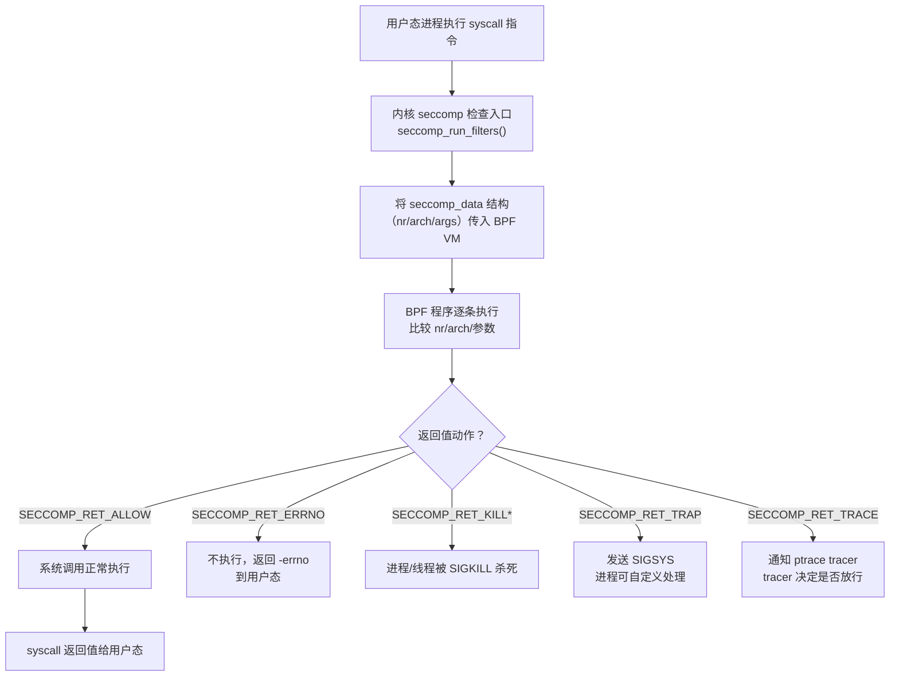

# 二进制漏洞与利用基础（21）· seccomp 沙箱逃逸

> [!abstract] TL;DR
> - **seccomp-bpf** 通过 cBPF 程序过滤进程的系统调用：每次 syscall 发生时，内核将调用号和参数传入 BPF 过滤器，依据返回值决定 `ALLOW`、`ERRNO`、`KILL` 等动作，是当前 Linux 最常见的系统调用沙箱机制。
> - 识别沙箱：`seccomp-tools dump ./target` 可反汇编 cBPF 规则；代码审计找 `prctl(PR_SET_SECCOMP, ...)` 或 `seccomp()` 系统调用。
> - **绕过思路（防御/研究视角）**主要包括：利用白名单漏洞（`open→openat/openat2`、`execve→execveat`）；32/64 位系统调用号混淆（`int 0x80` 走 IA-32 ABI，号码与 x86-64 不同）；利用 `SECCOMP_RET_TRACE` + ptrace 旁路；新 syscall 未入白名单；用 orw（open-read-write）读 flag 替代 execve getshell。
> - **健壮过滤器设计**：校验 `arch` 字段（防 32/64 混淆）、默认动作设为 `SECCOMP_RET_KILL_PROCESS`、白名单模式优先于黑名单。
> - **本篇一切绕过技术均仅用于 CTF 授权靶机和安全教育，防御视角讲解。**

---

## 概述与定位

在经历了用户态漏洞利用（[[02.栈溢出基础]] 至 [[19.利用自动化与工具链]]）和内核利用入门（[[20.Linux内核利用入门]]）之后，我们来到本系列最后一篇，聚焦于**系统调用沙箱**这一现代限制机制。

当一个程序在 CTF 题目或真实生产场景中被沙箱化（sandboxed）时，即便你拥有了代码执行权限，也无法直接调用 `execve` 打开 shell——因为沙箱在内核层面拦截了这个系统调用。这时就需要理解沙箱的实现机制，寻找过滤逻辑的盲点，以完成"读取 flag 文件"这一等价目标（CTF 中通常不需要真正的 shell，只需读出 `/flag` 内容）。

**seccomp**（Secure Computing Mode）是 Linux 内核提供的系统调用过滤框架，有两种模式：

1. **strict 模式**（`SECCOMP_MODE_STRICT`）：最简单，只允许 `read`/`write`/`exit`/`sigreturn` 四个系统调用。极少在 CTF 之外使用，因为限制太强。
2. **filter 模式**（`SECCOMP_MODE_FILTER`，即 seccomp-bpf）：允许进程提交一段 cBPF（Classic Berkeley Packet Filter）程序来定制过滤规则，可以精细控制允许/拒绝哪些系统调用及其参数。这是当前 CTF 和生产（Docker、Chrome sandbox、gVisor）中主流使用的模式。

本篇将深入讲解 seccomp-bpf 的原理与实现，介绍识别沙箱的方法，从防御视角剖析各类绕过思路（这些正是写沙箱的人需要堵上的漏洞），并讲解如何写出健壮的过滤器，最后简介容器环境中的 seccomp 应用。

---

## 原理与机制

### seccomp-bpf 的启动接口

进程通过以下两种方式安装 seccomp 过滤器：

**方式一：`prctl` 系统调用**

```c
#include <sys/prctl.h>
#include <linux/seccomp.h>
#include <linux/filter.h>

struct sock_fprog prog = {
    .len = (unsigned short)(sizeof(filter) / sizeof(filter[0])),
    .filter = filter,   /* struct sock_filter 数组 */
};

/* 在安装 BPF_FILTER 之前必须先调用 strict 模式或设置 no_new_privs */
prctl(PR_SET_NO_NEW_PRIVS, 1, 0, 0, 0);  /* 防止通过 execve 绕过 */
prctl(PR_SET_SECCOMP, SECCOMP_MODE_FILTER, &prog);
```

**方式二：`seccomp()` 系统调用**（Linux 3.17+，更现代）

```c
#include <linux/seccomp.h>
#include <sys/syscall.h>

syscall(SYS_seccomp, SECCOMP_SET_MODE_FILTER, 0, &prog);
```

两种方式等价。关键约束：

- 调用方必须具备 `CAP_SYS_ADMIN` 权限，**或**预先调用 `prctl(PR_SET_NO_NEW_PRIVS, 1, ...)`。`no_new_privs` 的语义是：当前进程及其后代不能通过 `execve` 获得比当前更高的权限（防止通过执行 setuid 程序绕过沙箱）。
- 一旦安装，过滤器**不可撤销**，只能通过 `execve` 替换（但 `no_new_privs` 会透传给子进程，`execve` 后依然受限）。
- 可以安装多个过滤器（链式叠加），内核对所有过滤器求交集（最严格的结果生效）。

### cBPF 过滤规则结构

seccomp 过滤器是一段 cBPF 字节码，对以下输入数据结构进行计算：

```c
struct seccomp_data {
    int   nr;           /* 系统调用号 */
    __u32 arch;         /* CPU 架构（AUDIT_ARCH_X86_64 等） */
    __u64 instruction_pointer; /* 发起 syscall 的 RIP */
    __u64 args[6];      /* 系统调用的前 6 个参数 */
};
```

BPF 程序通过 `BPF_LD | BPF_W | BPF_ABS` 指令按字节偏移读取此结构的各字段，做比较和跳转，最终 `BPF_RET` 返回一个动作值：

| 返回值 | 含义 |
|--------|------|
| `SECCOMP_RET_KILL_PROCESS` | 立即杀死整个进程组（发 SIGKILL），最严格 |
| `SECCOMP_RET_KILL_THREAD` | 仅杀死触发的线程（旧版 `SECCOMP_RET_KILL`） |
| `SECCOMP_RET_TRAP` | 发送 SIGSYS 给进程，可由进程自定义处理 |
| `SECCOMP_RET_ERRNO` | 系统调用不执行，返回指定 errno |
| `SECCOMP_RET_TRACE` | 通知 ptrace tracer，由 tracer 决定是否执行 |
| `SECCOMP_RET_LOG` | 允许执行但记录日志（Linux 4.14+） |
| `SECCOMP_RET_ALLOW` | 允许系统调用正常执行 |

返回值中高 16 位是动作（action），低 16 位是数据（如 errno 值或 ptrace message 数据）。

### 典型过滤器示例（libseccomp 生成）

使用 libseccomp 库编写过滤器比手写 BPF 字节码更直观：

```c
#include <seccomp.h>

void install_filter(void) {
    scmp_filter_ctx ctx;
    /* 默认动作：KILL，只有明确允许的才执行 */
    ctx = seccomp_init(SCMP_ACT_KILL);

    /* 白名单：允许 read/write/open/exit/exit_group */
    seccomp_rule_add(ctx, SCMP_ACT_ALLOW, SCMP_SYS(read),  0);
    seccomp_rule_add(ctx, SCMP_ACT_ALLOW, SCMP_SYS(write), 0);
    seccomp_rule_add(ctx, SCMP_ACT_ALLOW, SCMP_SYS(open),  0);
    seccomp_rule_add(ctx, SCMP_ACT_ALLOW, SCMP_SYS(exit),  0);
    seccomp_rule_add(ctx, SCMP_ACT_ALLOW, SCMP_SYS(exit_group), 0);

    seccomp_load(ctx);
    seccomp_release(ctx);
}
```

这段代码编译后生成的 BPF 字节码，会：
1. 检查 `arch` 是否为 `AUDIT_ARCH_X86_64`，若不匹配则 KILL。
2. 逐一比较 `nr`（syscall 号），匹配则 ALLOW。
3. 默认 KILL。

---

## 结构/算法/伪代码详解

### seccomp-bpf 决策流



### cBPF 程序的字节码结构

每条 cBPF 指令是一个 `struct sock_filter`：

```c
struct sock_filter {
    __u16 code;   /* 操作码：BPF_LD | BPF_W | BPF_ABS 等 */
    __u8  jt;     /* 条件为真时的跳转偏移 */
    __u8  jf;     /* 条件为假时的跳转偏移 */
    __u32 k;      /* 立即数/偏移量 */
};
```

一个典型的"只允许 read(0)，其余 KILL"的手写 BPF 过滤器：

```c
struct sock_filter filter[] = {
    /* 加载 arch 字段（偏移 4）*/
    BPF_STMT(BPF_LD | BPF_W | BPF_ABS,
             offsetof(struct seccomp_data, arch)),
    /* 检查是否为 x86-64，不是则跳到 KILL */
    BPF_JUMP(BPF_JMP | BPF_JEQ | BPF_K,
             AUDIT_ARCH_X86_64, 1, 0),
    BPF_STMT(BPF_RET | BPF_K, SECCOMP_RET_KILL),

    /* 加载 syscall 号（偏移 0）*/
    BPF_STMT(BPF_LD | BPF_W | BPF_ABS,
             offsetof(struct seccomp_data, nr)),
    /* 是否为 SYS_read (0)？是则 ALLOW */
    BPF_JUMP(BPF_JMP | BPF_JEQ | BPF_K, __NR_read, 0, 1),
    BPF_STMT(BPF_RET | BPF_K, SECCOMP_RET_ALLOW),
    /* 其余全部 KILL */
    BPF_STMT(BPF_RET | BPF_K, SECCOMP_RET_KILL),
};
```

### 绕过路径：等价 syscall 白名单遗漏

许多过滤器只考虑了常用 syscall，而遗漏了语义等价但编号不同的新 syscall。以下是常见的等价关系，是 CTF 中最高频的绕过手段：

| 被过滤的 syscall | 等价替代（可能未过滤） |
|-----------------|----------------------|
| `open` (2) | `openat` (257)、`openat2` (437) |
| `execve` (59) | `execveat` (322) |
| `read` (0) | `pread64` (17)、`readv` (19)、`preadv` (295)、`preadv2` (327) |
| `write` (1) | `pwrite64` (18)、`writev` (20)、`pwritev` (296)、`pwritev2` (328) |
| `fork` (57) | `clone` (56)、`clone3` (435) |
| `socket` (41) | 多种 socket 相关 syscall |
| `sendfile` (40) | 直接传文件内容，可替代 read+write |

**例**：过滤器只封堵了 `open`（nr=2），但未封堵 `openat`（nr=257）：

```python
# pwntools 构造 openat orw payload
# openat(AT_FDCWD, "/flag", O_RDONLY)
# AT_FDCWD = -100
payload  = shellcraft.openat(-100, "/flag", 0)   # openat
payload += shellcraft.read("rax", "rsp", 0x100)  # read fd到栈
payload += shellcraft.write(1, "rsp", 0x100)     # write到stdout
```

### 绕过路径：32/64 位系统调用号混淆

这是 CTF kernel pwn 和 seccomp bypass 中最经典的技巧之一。

**背景**：x86-64 Linux 支持两套系统调用接口：
- **x86-64 ABI**：使用 `syscall` 指令，寄存器 `rax` 存调用号，对应 64 位系统调用表。
- **IA-32 ABI（x86 32-bit compatibility）**：使用 `int 0x80` 指令，`eax` 存调用号，对应 32 位系统调用表（`/usr/include/x86/unistd_32.h`）。

同一系统调用在两个表中的**编号不同**：

| 系统调用 | x86-64 号码 | IA-32 号码 |
|----------|------------|-----------|
| `read` | 0 | 3 |
| `write` | 1 | 4 |
| `open` | 2 | 5 |
| `execve` | 59 | 11 |
| `mmap` | 9 | 90 |

**漏洞**：若过滤器只检查 `arch == AUDIT_ARCH_X86_64` 时的 64 位调用号，但**没有针对 IA-32 的分支**，攻击者可以用 `int 0x80` 触发 32 位 ABI：

```asm
; 过滤器封堵了 64 位 execve (nr=59)
; 但用 int 0x80 走 32 位 ABI，execve 的 32 位号是 11
xor eax, eax
mov al, 11       ; IA-32 execve
lea ebx, [rip + binsh_offset]
xor ecx, ecx
xor edx, edx
int 0x80         ; 走 32 位兼容层，过滤器可能未拦截
```

**注意**：在 64 位进程中，`int 0x80` 的参数用 `ebx`/`ecx`/`edx`（32 位寄存器），只有低 32 位地址有效（无法访问高于 4GB 的地址），所以 `"/bin/sh"` 字符串必须在低 32 位内存（如 bss）。

BPF 过滤器在收到 `int 0x80` 触发的 syscall 时，`seccomp_data.arch` 字段会是 `AUDIT_ARCH_I386` 而不是 `AUDIT_ARCH_X86_64`。如果过滤器开头只检查 `arch == X86_64` 然后跳到允许逻辑，并没有针对 `AUDIT_ARCH_I386` 的额外处理，就出现漏洞。

正确的做法：在检查 arch 时，对任何不是当前预期 arch 的情况一律 KILL，而不是仅仅跳过。

### 绕过路径：SECCOMP_RET_TRACE + ptrace

`SECCOMP_RET_TRACE` 是一种将控制权交给 ptrace tracer 的动作。当过滤器对某个 syscall 返回 `SECCOMP_RET_TRACE` 时，内核通知父进程（tracer），由 tracer 通过 `PTRACE_CONT` 决定是否放行。

在 CTF 中，这通常意味着：若我们已经控制了进程（例如通过漏洞获得代码执行），且能 `fork` 创建一个 tracer 父进程，可以构造一个 tracer-tracee 对，让 tracer 放行任意 syscall，从而绕过沙箱。但这需要能执行 `fork`/`ptrace`，通常比直接利用白名单漏洞复杂，更多出现在高难度题目中。

### 绕过路径：orw（open-read-write）读取 flag

当过滤器明确封堵了 `execve`/`execveat`（阻止获取 shell），但允许文件操作相关 syscall 时，CTF 的目标从"getshell"变成"直接读 flag 文件"：

```
open("/flag", O_RDONLY, 0) → fd
read(fd, buf, size)
write(1, buf, size)
```

对应的 shellcode（x86-64，假设 `/flag` 字符串在 shellcode 前端）：

```python
from pwn import *
context.arch = 'amd64'

flag_path = b"/flag\x00"

# 直接用 pwntools shellcraft 构造 orw
sc  = shellcraft.open("/flag", 0, 0)   # 返回 fd 在 rax
sc += shellcraft.read("rax", "rsp", 0x100)
sc += shellcraft.write(1, "rsp", 0x100)

payload = asm(sc)
```

若连 `open` 也被封堵但 `openat` 未被封堵，只需替换第一行：

```python
sc  = shellcraft.openat(-100, "/flag", 0)  # -100 = AT_FDCWD
```

`sendfile` syscall（nr=40）有时是另一个捷径——它直接在内核内完成从输入 fd 到输出 fd 的数据传输，不经过用户态缓冲区，若过滤器未封堵，可以一步完成"读文件并输出"：

```python
# sendfile(stdout_fd=1, file_fd, offset=0, count=0x100)
sc  = shellcraft.openat(-100, "/flag", 0)
sc += f"""
    mov rdi, 1       /* stdout */
    mov rsi, rax     /* file fd */
    xor rdx, rdx     /* offset = 0 */
    mov r10, 0x100   /* count */
    mov rax, 40      /* SYS_sendfile */
    syscall
"""
payload = asm(sc)
```

---

## 工具视角与实战

### seccomp-tools：识别过滤规则

`seccomp-tools` 是 CTF 分析 seccomp 沙箱的标准工具，支持 dump/反汇编 BPF 字节码：

```bash
# 安装
gem install seccomp-tools

# dump：运行目标程序，拦截 prctl 调用，打印已安装的 BPF 规则
seccomp-tools dump ./target_binary

# 直接反汇编 BPF 字节码文件
seccomp-tools disasm filter.bpf
```

**示例输出**：

```
 line  CODE  JT   JF      K
=================================
 0000: 0x20 0x00 0x00 0x00000004  A = arch
 0001: 0x15 0x00 0x09 0xc000003e  if (A != ARCH_X86_64) goto 0011
 0002: 0x20 0x00 0x00 0x00000000  A = sys_number
 0003: 0x15 0x07 0x00 0x00000000  if (A == read) goto 0011
 0004: 0x15 0x06 0x00 0x00000001  if (A == write) goto 0011
 0005: 0x15 0x05 0x00 0x0000003b  if (A == execve) goto 0011
 ...
 0010: 0x06 0x00 0x00 0x00000000  return KILL
 0011: 0x06 0x00 0x00 0x7fff0000  return ALLOW
```

从输出可以直接看出：哪些 syscall 被允许、arch 检查是否有漏洞、参数过滤规则。

**注意**：若程序在安装 seccomp 之前 fork 子进程，需要在子进程中追踪（`seccomp-tools dump` 支持 `-f` 参数跟踪子进程）。

### 静态分析：在 IDA/Ghidra 中识别 seccomp

若无法动态运行，通过静态分析识别 seccomp：

```bash
# 检查是否调用了 prctl
strings ./target | grep -E "prctl|seccomp"
objdump -d ./target | grep -A 5 "prctl"

# 或搜索系统调用号 157 (prctl) 和 317 (seccomp)
objdump -d ./target | grep -B 5 "0x9d"  # 0x9d = 157 = prctl
```

在 IDA 中，找到 `prctl(PR_SET_SECCOMP=22, SECCOMP_MODE_FILTER=2, &filter)` 调用，然后跟踪 `filter` 指针，即可找到 BPF 字节码数组，配合 `seccomp-tools disasm` 或手动解码。

### 编写测试用例：验证绕过思路

在本地复现绕过时，可以先写一个简单的沙箱程序，然后测试：

```c
/* sandbox_test.c：安装只封堵 open/execve 的沙箱，测试 openat 是否可用 */
#include <stdio.h>
#include <seccomp.h>
#include <unistd.h>

int main() {
    scmp_filter_ctx ctx = seccomp_init(SCMP_ACT_ALLOW);
    seccomp_rule_add(ctx, SCMP_ACT_KILL, SCMP_SYS(open), 0);
    seccomp_rule_add(ctx, SCMP_ACT_KILL, SCMP_SYS(execve), 0);
    seccomp_load(ctx);
    seccomp_release(ctx);

    /* 测试 openat 是否被允许 */
    int fd = syscall(257, -100, "/etc/passwd", 0, 0);  /* openat */
    printf("openat fd = %d\n", fd);  /* 若 > 0，则可用 */
    return 0;
}
```

### CTF 实战流程

```
1. 拿到题目二进制
          ↓
2. seccomp-tools dump ./target
   确认哪些 syscall 被允许/拒绝
          ↓
3. 分析允许列表的漏洞：
   - 有无等价 syscall 遗漏？（openat/openat2/execveat）
   - arch 检查是否完整？（int 0x80 混淆是否可行）
   - 是否允许 read/write（可用 orw 读 flag）
          ↓
4. 确认利用路径：
   - execve 可用 → 直接 getshell
   - execve 封堵但 openat+read+write 可用 → orw 读 /flag
   - 所有文件操作均封堵 → 寻找其他数据外泄路径（如 socket write）
          ↓
5. 构造 shellcode / ROP 链，发起攻击
```

---

## 安全性与正确使用

> [!caution] 教学声明与使用限制
> **本篇所有 seccomp 绕过技术均以安全教育、CTF 竞技和防御研究为目的。** 沙箱绕过技术在正确理解下是**写出更健壮沙箱的必要知识**——只有了解攻击者的绕过手法，防御者才能堵住对应漏洞。
>
> **本篇技术仅适用于以下场景**：
> - CTF 比赛授权靶机（题目本身就是考察 seccomp 绕过）
> - 个人安全研究实验室，对自有程序测试沙箱强度
> - 安全工程师评审自建沙箱方案时做对抗性测试
>
> **严禁将本篇技术用于绕过任何真实生产系统的安全沙箱（如 Chrome 渲染进程、Docker 容器、移动端沙箱）或对非授权系统发起攻击。**

### 如何写出健壮的 seccomp 过滤器

从上述绕过思路，可以反推出健壮过滤器的设计原则：

**原则一：必须校验 `arch` 字段，且对非预期 arch 直接 KILL**

```c
/* 错误写法：只检查 X86_64，未处理 I386 */
BPF_JUMP(BPF_JMP | BPF_JEQ | BPF_K, AUDIT_ARCH_X86_64, 0, 1),
BPF_STMT(BPF_RET | BPF_K, SECCOMP_RET_ALLOW),  /* 漏了 I386 路径 */

/* 正确写法：arch 不匹配则 KILL */
BPF_STMT(BPF_LD | BPF_W | BPF_ABS, offsetof(struct seccomp_data, arch)),
BPF_JUMP(BPF_JMP | BPF_JEQ | BPF_K, AUDIT_ARCH_X86_64, 1, 0),
BPF_STMT(BPF_RET | BPF_K, SECCOMP_RET_KILL),  /* 非 X86_64 一律 KILL */
```

**原则二：默认动作使用 `SECCOMP_RET_KILL_PROCESS`（白名单模式）**

白名单（明确允许的才放行，其余全杀）比黑名单（明确拒绝的才拦截，其余放行）安全得多。黑名单永远无法穷举所有危险 syscall，内核版本升级引入的新 syscall 会自动逃过黑名单。

```c
/* 白名单模式 */
scmp_filter_ctx ctx = seccomp_init(SCMP_ACT_KILL_PROCESS);
/* 只加白名单条目 */
seccomp_rule_add(ctx, SCMP_ACT_ALLOW, SCMP_SYS(read),  0);
/* ... */
```

**原则三：使用 libseccomp，而非手写 BPF 字节码**

libseccomp 自动处理 arch 检查、字节序、指令数量限制等细节，减少出错几率：

```c
/* libseccomp 会自动生成 arch 检查 */
scmp_filter_ctx ctx = seccomp_init(SCMP_ACT_KILL);
seccomp_rule_add(ctx, SCMP_ACT_ALLOW, SCMP_SYS(read), 0);
seccomp_load(ctx);
```

**原则四：明确封堵语义等价 syscall 的完整家族**

若要禁止文件打开，需同时封堵：`open`(2)、`openat`(257)、`openat2`(437)、`creat`(85)。
若要禁止执行，需同时封堵：`execve`(59)、`execveat`(322)。

可通过 `man 2 syscalls` 配合 `strace` 测试来发现等价系统调用。

**原则五：对参数做精细过滤**

seccomp-bpf 支持对 `args[]` 做过滤，可实现比"允许整个 syscall"更精细的控制：

```c
/* 只允许 write(fd=1, ...) —— 只允许写 stdout，不允许写其他 fd */
seccomp_rule_add(ctx, SCMP_ACT_ALLOW, SCMP_SYS(write), 1,
    SCMP_A0(SCMP_CMP_EQ, 1));  /* arg[0] == 1 */
```

### 容器与云原生中的 seccomp

**Docker seccomp profile**：Docker 默认为容器应用一个 seccomp profile（`/etc/docker/seccomp-default.json` 或内置 profile），封堵约 44 个危险 syscall（如 `ptrace`、`kexec_load`、`perf_event_open` 等），其余放行。

```bash
# 查看容器的 seccomp 状态
docker inspect <container> | grep -i seccomp

# 使用自定义 profile
docker run --security-opt seccomp=custom.json myimage

# 完全禁用 seccomp（不推荐）
docker run --security-opt seccomp=unconfined myimage
```

**gVisor（Google）**：gVisor 的 runsc 实现了一个用户空间的内核（Sentry），拦截所有 syscall 并在用户态处理，比 seccomp 更彻底地隔离——即便存在 seccomp 绕过，攻击者也只能到达 Sentry 的系统调用处理层，无法直接访问宿主内核。

**Kubernetes seccomp**：K8s 1.19+ 支持为 Pod 配置 seccomp profile，通过 `securityContext.seccompProfile` 字段指定。建议生产 Pod 至少使用 `RuntimeDefault` profile。

---

## 小结

1. **seccomp-bpf 的本质**是在内核 syscall 入口处运行一个 BPF 程序，对每次系统调用进行"过海关"检查，根据调用号和参数决定放行或拦截。理解 `seccomp_data` 结构和 BPF 返回值语义，是分析任何 seccomp 沙箱的基础。

2. **识别沙箱的标准流程**：`seccomp-tools dump` 拿到 BPF 字节码反汇编，或静态找 `prctl(22, 2, ...)` 调用并追踪 filter 数组——不要靠猜，要直接读规则。

3. **绕过思路本质上是挖掘过滤器的"遗漏"**：等价 syscall 家族遗漏（`open→openat`）、arch 检查缺失（`int 0x80` 走 IA-32 路径）、新内核 syscall 未入白名单（`openat2`、`clone3`），这些都是防御者需要针对性封堵的漏洞点。

4. **CTF 中"不能 getshell 就 orw"**是核心思路转变：若 `execve` 被封堵，只需 `open`（或 `openat`）+ `read` + `write` 三步即可读出 flag，目标从"执行 shell"降格为"读文件内容"。

5. **健壮过滤器的四个要点**：校验 arch（防混淆）、白名单模式（防遗漏）、用 libseccomp（防手写错误）、封堵完整 syscall 家族（防等价绕过）。这些原则直接对应本篇讲的各类绕过手法。

6. **seccomp 是纵深防御的一层**：它与命名空间、capabilities、AppArmor/SELinux、gVisor 等共同构成容器安全的多层防护。单独依赖 seccomp 并不足够，但没有 seccomp 会显著扩大攻击面。

---

## 相关阅读

- [[20.Linux内核利用入门]] — 内核利用基础，seccomp 的宿主环境
- [[15.SROP与ret2csu]] — SROP 技术中 rt_sigreturn 与 seccomp 黑名单的关系
- [[12.缓解机制总览]] — 各类缓解机制的全景对比
- [[06.ROP入门]] — 构造 orw shellcode/ROP 链的基础
- [[13.现代利用与信息泄露]] — 绕过 ASLR 的信息泄露技术（在沙箱题目中仍然需要）
- [[00.二进制漏洞与利用基础总览]] — 本系列总览

---

⬅️ 上一篇 [[20.Linux内核利用入门]] ｜ 🏠 [[00.二进制漏洞与利用基础总览]]
