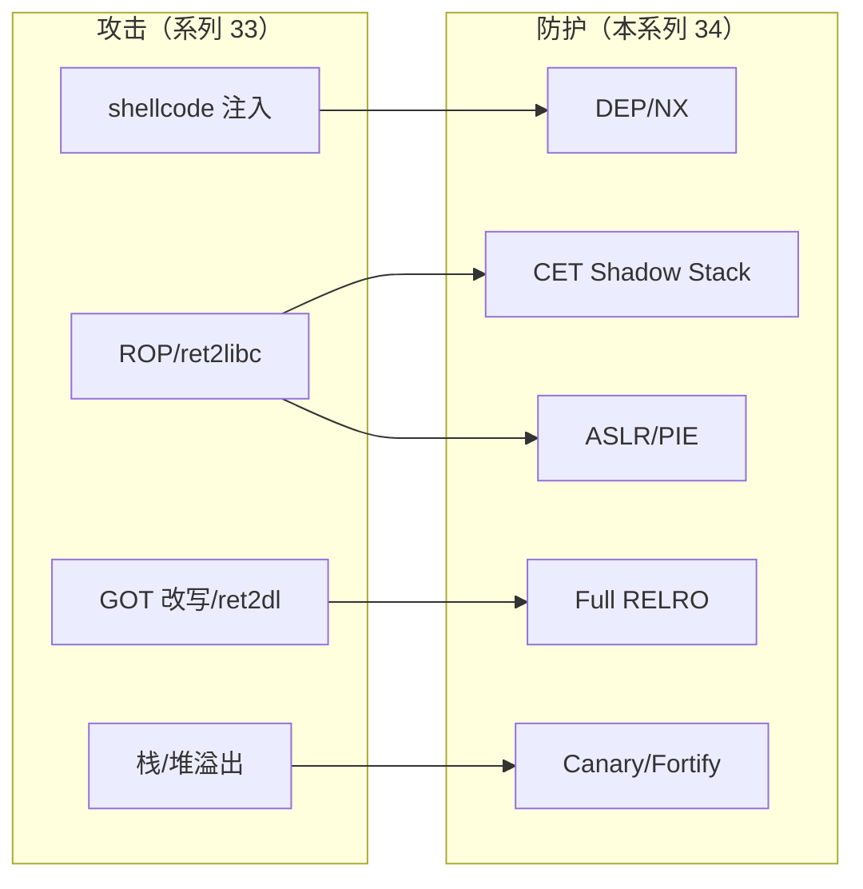

# 现代二进制防护机制 · 系列总览

> 作者原创系列，共 **12** 篇。系统讲解现代二进制**防护/缓解机制**的原理、实现、绕过边界与加固实践。与 [[33.二进制漏洞与利用基础/00.二进制漏洞与利用基础总览|系列 33（二进制漏洞与利用）]] **成对**——33 讲"攻击如何发生"，本系列讲"每项防护如何工作、挡住什么、残余风险、怎么开"。建立在 [[11.ELF文件详解/17.got节|GOT/RELRO]]、[[14.动态链接与加载器详解/15.加载器视角的安全|加载器安全]]、[[14.动态链接与加载器详解/09.ASLR与位置无关代码|ASLR/PIE]] 之上。

## 一、防护全景

| # | 章节 | 说明 |
| --- | --- | --- |
| 01 | [[01.防护机制全景]] | 攻防演进、纵深防御、各机制定位与协同 |

## 二、基础防护

| # | 章节 | 说明 |
| --- | --- | --- |
| 02 | [[02.DEP与NX]] | 数据不可执行、W^X，挡 shellcode |
| 03 | [[03.ASLR深入]] | 地址随机化、熵、各区域（详见 14 系列 09） |
| 04 | [[04.Stack Canary]] | 栈金丝雀、序言尾声、`-fstack-protector*` |
| 05 | [[05.RELRO]] | partial/full、`BIND_NOW`，挡 GOT 改写（详见 14 系列 15） |
| 06 | [[06.PIE]] | 位置无关可执行，使主程序基址可随机 |

## 三、编译防护

| # | 章节 | 说明 |
| --- | --- | --- |
| 07 | [[07.Fortify Source]] | `_FORTIFY_SOURCE`、`__*_chk` 运行时边界检查 |

## 四、控制流完整性

| # | 章节 | 说明 |
| --- | --- | --- |
| 08 | [[08.CFI控制流完整性]] | 前向 CFI、Clang CFI、间接调用校验 |
| 09 | [[09.Intel CET]] | Shadow Stack（后向）+ IBT（前向），挡 ROP/JOP（呼应 14 系列 08） |

## 五、平台防护

| # | 章节 | 说明 |
| --- | --- | --- |
| 10 | [[10.Windows防护体系]] | GS/DEP/ASLR/CFG/XFG/ACG/CIG |
| 11 | [[11.macOS与iOS防护]] | code signing/PAC(arm64e)/Hardened Runtime/SIP |

## 六、实战

| # | 章节 | 说明 |
| --- | --- | --- |
| 12 | [[12.加固工具与checksec]] | `checksec`、加固编译选项汇总、验收清单 |

## 攻击 ↔ 防护 的对应

> 一句话：没有单一机制能挡住一切——现代安全靠 NX + ASLR + Canary + RELRO + CFI/CET 的**纵深防御**叠加，逼迫攻击者突破层层关卡。
