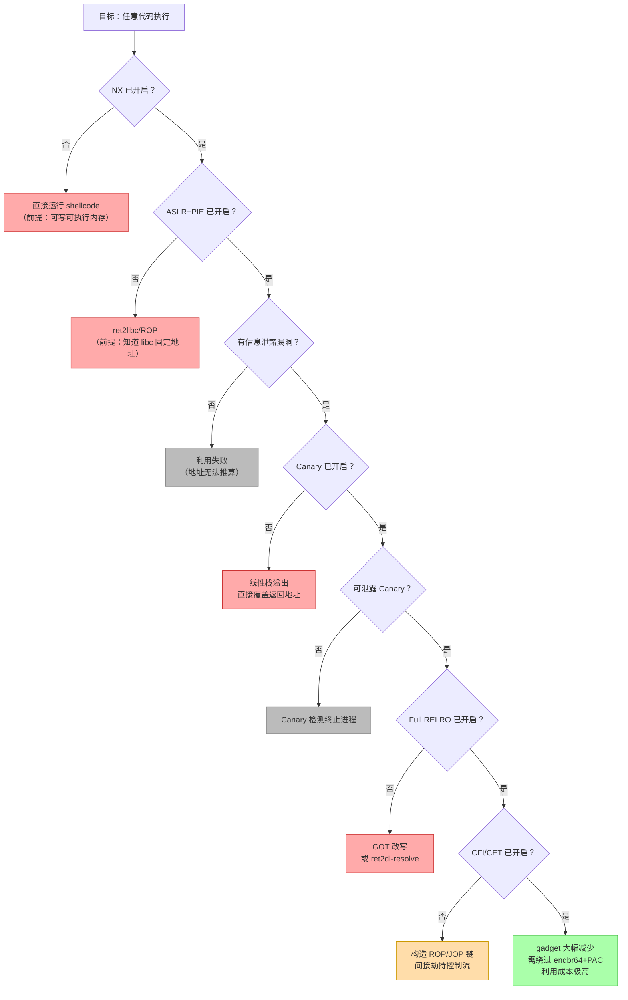
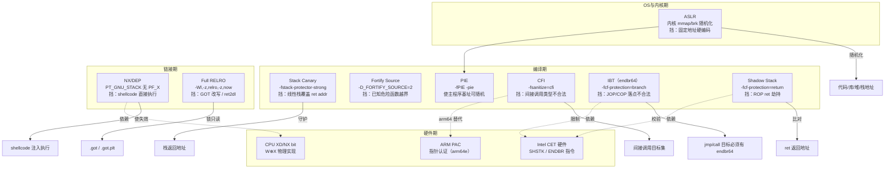
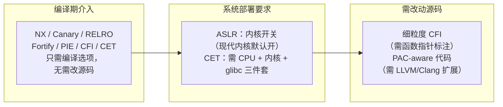

# 现代二进制防护机制（1）· 防护机制全景

> [!abstract] TL;DR
> - 二进制安全的演进是一场持续 30 年的**军备竞赛**：shellcode 催生 NX，ret2libc/ROP 催生 ASLR/PIE 与 CFI，GOT 改写催生 RELRO，ROP 残留催生 CET/Shadow Stack。
> - **纵深防御**是核心理念：没有银弹，每一层机制堵住特定的攻击路径，多层叠加才能让完整利用链的构建成本指数级上升。
> - 本篇给出全系列的**战略地图**：各机制的历史来源、防御定位、协同关系、代价与本系列 02–12 的路线规划。详细原理见各章。

---

## 概述与定位

[[33.二进制漏洞与利用基础/12.缓解机制总览.md]] 以"攻击手法 → 对应缓解"的视角梳理了七大机制。本系列（34）是其逐项深入版：每一章聚焦一个机制，讲清**它为什么存在、硬件/OS/编译器如何联合实现、挡住什么又挡不住什么、如何开启与验证**。

本篇是全系列的**全景导论**，覆盖：

1. 攻防演进史——"谁逼出了谁"
2. 纵深防御理念——为什么多层比单层重要
3. 各机制的角色与协同关系
4. 本系列 02–12 路线图
5. 防护代价评估
6. 威胁模型分级

---

## 攻防协同演进史

### 军备竞赛时间线

下图展示从 1988 年 Morris 蠕虫到 Intel CET 落地的主线节点。每一次攻击技术的突破，都催生了新一代防护机制，防护机制的部署又催生了下一轮绕过手法。

```mermaid
flowchart LR
    N1["1988<br/>Morris 蠕虫<br/>首次大规模利用缓冲区溢出<br/>→ 安全意识觉醒"]
    N2["1996<br/>Aleph One「Smashing the Stack」<br/>栈溢出 + shellcode 方法论公开"]
    N3["1998<br/>Solar Designer<br/>ret2libc 预演<br/>StackGuard / Stack Canary 诞生"]
    N4["2001<br/>ASLR 首次出现<br/>PaX patch for Linux<br/>地址随机化遏制固定地址利用"]
    N5["2000~2004<br/>NX/DEP 落地<br/>AMD NX bit 2003 / Intel XD 2004<br/>硬件层挡住直接 shellcode<br/>GCC -fstack-protector 2003 普及"]
    N6["2003~2007<br/>ROP 理论成型<br/>Hovav Shacham 2007「ROP 论文」<br/>纯复用合法代码片段，绕过 NX+Canary"]
    N7["2004~2008<br/>ASLR 进内核主线<br/>Linux 2.6.12 / Windows Vista<br/>PIE 要求编译器支持"]
    N8["2008~2012<br/>RELRO 普及<br/>GOT 改写盛行 → Full RELRO 推广<br/>ret2dl-resolve 针对 Partial RELRO"]
    N9["2010~2014<br/>ASLR 绕过研究爆发<br/>信息泄露 + Heap Spray + 部分写<br/>32 位熵不足被暴力破解"]
    N10["2013~2018<br/>CFI 研究主线<br/>Clang CFI / LLVM CFI<br/>Microsoft CFG /guard:cf<br/>粗粒度 → 细粒度 CFI 演进"]
    N11["2019~2021<br/>Intel CET 落地<br/>Ice Lake：Shadow Stack 挡 ROP ret<br/>IBT + endbr64 挡 JOP/COP"]
    N12["2020~2025<br/>ARM PAC 普及<br/>Apple M1/M2 arm64e 指针认证<br/>覆盖 iOS/macOS<br/>Linux 5.18+ 用户态 Shadow Stack"]

    N1 --> N2 --> N3 --> N4 --> N5 --> N6 --> N7 --> N8 --> N9 --> N10 --> N11 --> N12
```



> [!warning] 示例输出为示意
> 年份为主要事件近似值，部分技术（如 RELRO、Canary）在研究与工业界普及之间有时间差；具体发行版默认选项的启用时间各异。

### 关键节点解析

| 节点 | 攻击技术突破 | 催生的防护 |
|---|---|---|
| 1996–2000 | 栈溢出 shellcode 成熟 | NX/DEP（硬件 W⊕X）|
| 1998–2004 | ret2libc 绕过 NX | ASLR + PIE（随机化布局）|
| 2001–2007 | ROP 绕过 NX + Canary | CFI + CET Shadow Stack |
| 2004–2012 | GOT 改写 / ret2dl-resolve | Full RELRO + BIND_NOW |
| 2010–2018 | 信息泄露破解 ASLR | 更强 CFI + 减少泄露面 |
| 2019–现在 | 细粒度 ROP/JOP 仍有效 | Intel CET IBT + ARM PAC |

---

## 纵深防御理念

### 没有银弹

这是二进制安全领域最重要的结论：**每一项防护机制单独使用时都有明确的绕过路径**。

| 机制 | 单独使用的残余风险 |
|---|---|
| 仅 NX | ret2libc、ROP——不注入代码，只复用合法页 |
| 仅 ASLR/PIE | 信息泄露一次即破解；32 位熵低可暴力 |
| 仅 Stack Canary | 非线性写（堆漏洞）绕过；泄露 canary 值后原样覆盖 |
| 仅 Full RELRO | `.data`/`.bss` 函数指针仍可改写；vtable 仍有效 |
| 仅 CFI（粗粒度） | 签名兼容的合法目标（type confusion）仍可用 |
| 仅 Shadow Stack/CET | 不保护间接调用；JOP 链仍可构造 |

### 层层设防：攻击链视角

理解纵深防御最有效的方式是逆向审视攻击者的**前置条件链**：



> **图解**：每一个菱形判断节点对应一层防护机制。攻击者每多突破一层，前置条件就增加一个（需要信息泄露、需要 Canary 泄露、需要绕过 CFI……）。全部叠加时，完整利用链在工程上极为困难——这就是纵深防御的价值。

### 沙箱与隔离：纵深防御的第五层

上面的攻击链图谱有一个隐含假设：攻击者仍在进程内部博弈。然而现代防护体系还存在第五层——**被利用后**的遏制，即沙箱与进程隔离。

**为什么需要独立的隔离层？**

前四层（NX→ASLR→Canary/RELRO→CFI/CET）均在"阻止漏洞被成功利用"，其共同前提是漏洞类型与绕过技术之间的博弈尚未分出胜负。但现实中，尤其面对 0-day，某些利用链**确实能突破前四层全部机制**（典型场景：浏览器 JIT 漏洞 + 细粒度 CFI 绕过）。此时，沙箱层是最后的防线——它问的不是"这个进程能否被控制"，而是"即便进程被控制，攻击者能做到什么"。

**三类沙箱/隔离机制的层次**

| 机制 | 层次 | 限制的是什么 | 典型实现 |
|---|---|---|---|
| **seccomp-BPF** | 系统调用过滤 | 被利用的进程能发起哪些 syscall | Chrome 渲染进程、systemd `SystemCallFilter` |
| **Linux namespaces** | 内核资源隔离 | 文件系统、网络、PID 等内核视图 | 容器（runc/crun）、Chrome broker |
| **secomp + namespace 组合** | 容器级隔离 | 进程可见的整个操作系统视图 | Docker、Flatpak、systemd-nspawn |

**seccomp-BPF 的防御逻辑**

`seccomp(SECCOMP_SET_MODE_FILTER, ...)` 通过 BPF 字节码对每个 `syscall` 号及参数做白名单过滤。在沙箱进程中，即使攻击者通过 ROP 控制了 IP，也无法发起 `execve`、`open`、`connect` 等危险 syscall——内核会在 syscall 入口直接拒绝（返回 `-EPERM` 或发送 `SIGSYS` 终止进程）：

```c
// 典型的沙箱 seccomp 规则（白名单只允许必要的读写操作，拒绝 execve）
struct sock_filter filter[] = {
    BPF_STMT(BPF_LD | BPF_W | BPF_ABS, offsetof(struct seccomp_data, nr)),
    BPF_JUMP(BPF_JMP | BPF_JEQ | BPF_K, __NR_read,   5, 0),
    BPF_JUMP(BPF_JMP | BPF_JEQ | BPF_K, __NR_write,  4, 0),
    BPF_JUMP(BPF_JMP | BPF_JEQ | BPF_K, __NR_exit,   3, 0),
    BPF_JUMP(BPF_JMP | BPF_JEQ | BPF_K, __NR_exit_group, 2, 0),
    BPF_JUMP(BPF_JMP | BPF_JEQ | BPF_K, __NR_mmap,   1, 0),
    BPF_STMT(BPF_RET | BPF_K, SECCOMP_RET_KILL_PROCESS), // 其余 syscall 全部拒绝
    BPF_STMT(BPF_RET | BPF_K, SECCOMP_RET_ALLOW),
};
```

**与前四层的关系**

```
前四层（拦截利用链） → 最后防线（限制利用后影响）
NX / ASLR / Canary / CFI/CET        seccomp + namespace 沙箱
     ↑                                          ↑
  "让攻击者控制不了进程"              "即便控制了进程，限制爆炸半径"
```

> 沙箱详细原理与实现见 [[16.沙箱与隔离防护]]，包括 seccomp 的 BPF 过滤器设计、Linux namespace 类型与隔离粒度、Chrome 多进程沙箱架构及 broker 通信模型。

---

## 各机制定位与协同

### 防护协同全景图



### 各机制的分工表

| 机制 | 主攻击目标 | 防御层次 | 详见 |
|---|---|---|---|
| **NX/DEP** | shellcode 注入后直接执行 | 硬件 + 链接期 | [[02.DEP与NX]] |
| **ASLR** | 固定地址的 ret2libc/ROP | OS + 编译期 | [[03.ASLR深入]] |
| **Stack Canary** | 线性栈溢出覆盖返回地址 | 编译期（每函数） | [[04.Stack Canary]] |
| **RELRO** | GOT 改写 / ret2dl-resolve | 链接期 + 加载期 | [[05.RELRO]] |
| **PIE** | 主程序基址固定（ASLR 失效于主程序） | 编译期 + 链接期 | [[06.PIE]] |
| **Fortify Source** | 已知危险函数（`strcpy`/`sprintf`）越界 | 编译期（源码级） | [[07.Fortify Source]] |
| **CFI** | 间接调用/跳转劫持（vtable/JOP） | 编译期（插桩） | [[08.CFI控制流完整性]] |
| **Intel CET** | ROP（Shadow Stack）+ JOP（IBT） | 硬件 + 编译期 | [[09.Intel CET]] |
| **Windows 防护体系** | GS/CFG/XFG/ACG/CIG 组合 | 平台专篇 | [[10.Windows防护体系]] |
| **macOS/iOS 防护** | PAC/Hardened Runtime/SIP | 平台专篇 | [[11.macOS与iOS防护]] |
| **加固工具与 checksec** | 验收与工具链配置 | 实战 | [[12.加固工具与checksec]] |

> RELRO 深度机制见 [[14.动态链接与加载器详解/15.加载器视角的安全.md]]；GOT 结构与 GOT 改写攻防见 [[11.ELF文件详解/17.got节.md]]。

### MTE 在威胁对抗地图中的定位

现有分工表覆盖了软件层、OS 层到硬件控制流层，但缺少一类新兴的**硬件内存安全**机制——以 ARM MTE（Memory Tagging Extension）为代表，它在物理内存访问粒度上做边界检查，与 NX/ASLR 属于互补而非替代关系。

**MTE 解决的是什么问题？**

NX 防"非代码页执行"，ASLR 防"地址可预测"，CFI 防"控制流劫持"，但它们都无法检测**在同一内存区域内**发生的越界访问（如 heap buffer overflow 到邻接对象、use-after-free 访问已释放的 tag-mismatch 块）。这类漏洞在内存安全语言（Rust/Swift）之外的 C/C++ 代码中仍然普遍，是 CVE 的主要来源。

**MTE 的工作原理**

ARMv8.5-A 引入 MTE，为每个 16 字节对齐的内存粒度（granule）关联一个 4-bit 硬件标签（tag），同时把指针高位的 bits[59:56]（在 Top Byte Ignore/TBI 机制下）存储匹配标签。每次内存访问时硬件自动比对指针 tag 与内存 tag——不匹配即触发异常：

```
分配时：heap_alloc() 返回指针，bits[59:56] 设为随机 tag T
         对应内存粒度的 tag 也设为 T
访问时：load/store 指令硬件校验 ptr.tag == mem.tag
越界时：邻接块 tag 为 T'（不同随机值）→ 硬件异常（SIGSEGV/SIGBUS）
UAF 时：free() 将内存 tag 改为 ~T（取反）→ 悬挂指针 tag 仍为 T → 不匹配 → 异常
```

**在防护层次中的位置**

MTE 作用于**漏洞触发层**，而非利用链中途——它在内存错误刚发生时即告警，先于 NX/ASLR/CFI 介入的时机点（后三者作用于漏洞已发生、攻击者试图利用之后）：

```
漏洞触发（heap OOB / UAF）
      ↓
[MTE] tag 不匹配 → 立即 SIGSEGV      ← 最早一层，硬件级
      ↓（若 MTE 未开启或被绕过）
攻击者控制写入目标
      ↓
[NX] 数据页不可执行                    ← 第二层
      ↓
[ASLR] 地址随机
      ↓
[CFI/CET] 控制流完整性                 ← 最后防线
```

**与 ASAN 的对比**

ASAN（AddressSanitizer）是软件实现的内存错误检测，开销约 2×；MTE 是硬件实现，检测开销约 1–3%，适合生产环境部署（Android 14+ 已在系统级开启）。两者覆盖面略有差异（MTE 对堆内整个 16 字节粒度做 tag 比对，ASAN 在红区设置 shadow）。

> MTE 完整原理、内核支持路径（`PROT_MTE` mmap 标志、`PR_SET_TAGGED_ADDR_CTRL`）、malloc 适配方案（tcmalloc/Scudo）及绕过局限，详见 [[13.MTE内存标签扩展]]。

### Intel MPX（已废弃）历史备注

在理解向 MTE/ASAN 演进路径之前，有必要了解一次重要的失败探索：**Intel MPX（Memory Protection Extensions）**，这是编译器辅助指针边界检查在 x86 上的一次正式尝试。

**MPX 的设计思路**

Intel 在 Skylake（2015）中引入 MPX，通过四个新寄存器（`BND0`–`BND3`）存储指针的下界和上界，并配合新指令 `BNDMOV`/`BNDLDX`/`BNDSTX`/`BNDCL`/`BNDCU` 在每次指针解引用前插入边界校验：

```asm
; MPX 插桩示意（编译器生成）
bndmov  bnd0, [rsp+bounds_table]   ; 加载 ptr 的边界到 BND0
bndcl   bnd0, rax                  ; 检查 rax >= lower_bound
bndcu   bnd0, rax                  ; 检查 rax <= upper_bound
mov     [rax], rbx                  ; 实际访问（边界合法才到这里）
```

**废弃原因**

MPX 有三个根本性问题，最终导致整条技术路线被放弃：

1. **性能代价高**：每次指针解引用插入 2 条边界检查指令，实测性能损耗约 50–100%（视工作负载），比 ASAN 的 2× 开销还要高；且边界表（Bounds Table）需要额外内存，对大型数据结构开销尤为突出。

2. **假阳性多**：C 程序中合法的指针运算（如将指针减为负偏移后再加回、联合体类型双关）常触发假阳性，导致工程上大量白名单维护成本，难以在实际代码库落地。

3. **Intel 停止硬件支持**：从 Ice Lake（2019）起，Intel 新架构不再实现 MPX 功能单元。Linux 内核在 **5.6（2020）** 移除了 MPX 支持，GCC 在 **9.1（2019）** 起弃用了 `-mmpx` 和 `-fcheck-pointer-bounds` 编译选项（GCC 12 彻底移除）。

**历史意义**

MPX 的失败清楚地说明了为什么防护机制的演进路径转向了：
- **软件层**：ASAN/HWASan（开发期高置信检测，不部署生产）
- **硬件层**：ARM MTE（低开销、生产可用的硬件 tag 方案）

MPX 是"硬件辅助指针边界检查"这一思路在 x86 平台的终结，其失败教训也部分解释了为何 ARM MTE 设计上选择粗粒度（16 字节 granule + 4-bit tag）而非精确字节级边界：以较低硬件成本换取可部署性。

---

## 本系列路线图（02–12）

```mermaid
graph LR
    subgraph 基础防护_02_06["基础防护（02–06）"]
        NX2["02 DEP/NX<br/>W⊕X 不可执行内存"]
        ASLR2["03 ASLR 深入<br/>各区域熵与绕过"]
        CAN2["04 Stack Canary<br/>TLS canary 原理"]
        REL2["05 RELRO<br/>PT_GNU_RELRO 锁 GOT"]
        PIE2["06 PIE<br/>ET_DYN 主程序随机"]
    end

    subgraph 编译防护_07["编译防护（07）"]
        FOR2["07 Fortify Source<br/>__*_chk 运行时检查"]
    end

    subgraph 控制流_08_09["控制流完整性（08–09）"]
        CFI2["08 CFI<br/>前向 Clang CFI / CFG"]
        CET2["09 Intel CET<br/>Shadow Stack + IBT"]
    end

    subgraph 平台_10_11["平台专篇（10–11）"]
        WIN2["10 Windows<br/>GS/DEP/CFG/XFG/ACG"]
        MAC2["11 macOS/iOS<br/>PAC/Hardened Runtime/SIP"]
    end

    subgraph 实战_12["实战（12）"]
        CHK2["12 checksec<br/>加固工具与验收清单"]
    end

    NX2 --> ASLR2 --> CAN2 --> REL2 --> PIE2
    PIE2 --> FOR2 --> CFI2 --> CET2
    CET2 --> WIN2 --> MAC2 --> CHK2
```



**阅读建议**：
- 初学者：按 02 → 03 → 04 → 05 顺序，打好基础防护认知。
- CTF/漏洞研究方向：重点 04（Canary 绕过）、05（RELRO 与 ret2dl）、08–09（CFI/CET 前沿）。
- 工程加固方向：重点 07（Fortify）、12（checksec 工具链）、10–11（平台对照）。

---

## 防护的代价

机制不是"越多越好"——每项都有代价，需要在**安全 / 性能 / 兼容性**三角中取舍。

### 性能代价

| 机制 | 代价类型 | 量化参考 |
|---|---|---|
| **NX/DEP** | 几乎为零（硬件 PTE 标志位）| < 0.1% |
| **ASLR** | 几乎为零（内核随机化在映射时完成）| < 0.1% |
| **Stack Canary** | 每函数进出各读写一次 TLS，额外一次栈操作 | < 1%（典型工作负载）|
| **RELRO（Full）** | 启动期解析全部函数符号，增加冷启动延迟 | 通常 < 10 ms；对长期运行服务影响极小 |
| **PIE** | 代码段 PIC 间接寻址（x86-64 RIP-relative 已很高效）| < 1%（x86-64）；老式 x86-32 可达 5–15% |
| **Fortify Source** | 增加几个整数比较和条件分支（可静态折叠）| < 1% |
| **CFI（细粒度）** | 每次间接调用插入类型检查 + 查位图 | 1–10%（依工作负载中间接调用频率）|
| **Intel CET** | Shadow Stack：约 < 2%；IBT：约 0.5–2%（`endbr64` 是 NOP 语义）| 合计 < 5% |

### 兼容性代价

| 机制 | 主要兼容性问题 |
|---|---|
| **Full RELRO** | 关掉延迟绑定：`dlopen` 后新加载的 DSO 在其自身范围内仍有延迟绑定（不影响主程序 GOT）；旧版 glibc < 2.15 的极少数边界情况 |
| **PIE** | 位置无关代码要求所有依赖库也是 PIE/PIC；静态链接的大型二进制可能有遗留问题 |
| **CFI（细粒度）** | `dlsym` 后的函数指针跨模块调用需要显式标注；C 语言函数指针类型转换的合法使用可能被误判 |
| **CET/Shadow Stack** | 需要 CPU 支持（Ice Lake 2019+）；JIT 代码（JVM、V8）需要 CET-aware 实现；旧版内核需要补丁 |
| **ARM PAC** | 仅限 arm64e ABI（Apple A12+/M1+），通用 arm64 ABI 不包含 |

### 部署代价



---

## 威胁模型分级

不同场景下的防护优先级不同：

| 威胁等级 | 场景特征 | 最低防护基线 |
|---|---|---|
| **L1 基础** | 用户态内部工具，无网络输入 | NX + Stack Canary + Fortify |
| **L2 标准** | 网络服务、处理外部输入 | NX + ASLR/PIE + Canary + Full RELRO + Fortify |
| **L3 强化** | 高价值目标（浏览器、密钥服务）| L2 + CFI + CET/PAC |
| **L4 对抗** | 军事/金融/工控等对抗级场景 | L3 + 内核 CFI + 进程隔离 + 内存安全语言重写核心路径 |

> [!warning] 示例输出为示意
> 分级为教学用简化模型，实际场景中应结合具体威胁建模（STRIDE/DREAD）和合规要求（CVE 修复 SLA）来确定防护级别，不可直接套用本表。

### checksec 快速读法

```bash
checksec --file=./target
```

```text
[*] './target'
    Arch:     amd64-64-little
    RELRO:    Full RELRO
    Stack:    Canary found
    NX:       NX enabled
    PIE:      PIE enabled
    Fortify:  Enabled
```

> [!warning] 示例输出为示意
> 以上为代表性示意，非本机实跑。**五绿是最低基线**：缺任何一项都意味着对应攻击向量的利用门槛显著下降。详细读法见 [[12.加固工具与checksec]]。

---

## 与系列 33 的互补关系

本系列严格与 [[33.二进制漏洞与利用基础/12.缓解机制总览.md]] 互补：

| 33 系列（攻击面） | 34 系列（防护面） |
|---|---|
| 03 Shellcode 注入 | [[02.DEP与NX]]：NX/DEP 为何让 shellcode 失效 |
| 05 ret2libc | [[03.ASLR深入]]：ASLR 如何使固定地址失效 |
| 04 Stack Canary 绕过 | [[04.Stack Canary]]：Canary 的实现细节与绕过边界 |
| 07 GOT 劫持 / ret2dl | [[05.RELRO]]：Full RELRO 的完整锁 GOT 机制 |
| 06 ROP | [[08.CFI控制流完整性]] + [[09.Intel CET]]：前向 + 后向保护 |
| 08 格式化字符串 | [[07.Fortify Source]]：`%n` 限制与边界检查 |

**读法建议**：先读 33 系列理解"攻击为何成立"，再读 34 系列理解"防护如何瓦解该攻击"——两条线并行，才能真正掌握攻防逻辑。

---

## 小结

1. **攻防是持续博弈**：每一层机制都来自对特定攻击手法的响应；shellcode → NX → ret2libc/ROP → ASLR/CFI/CET 的军备竞赛仍在继续。
2. **纵深防御是唯一可行策略**：任何单一机制都有绕过路径，叠加多层才能使完整利用链的前置条件急剧增加。
3. **各机制有明确分工**：NX 断代码注入 → ASLR 藏地址 → Canary 护栈 → RELRO 护 GOT → CFI/CET 护控制流——每层守好自己的边界。
4. **代价可控**：现代工具链的默认选项已覆盖 L2 基线，Full RELRO + PIE + Canary + NX 合计性能损耗通常 < 2%，无理由不开。
5. **checksec 是验收工具**：五绿是基准，任何弱值都需要有意识地评估残余风险。

---

## 相关阅读

- **攻击手法总览（与本篇互补）**：[[33.二进制漏洞与利用基础/12.缓解机制总览.md]]
- **GOT 结构与 GOT 改写攻防**：[[11.ELF文件详解/17.got节.md]]
- **加载器视角的 RELRO 与 ret2dl**：[[14.动态链接与加载器详解/15.加载器视角的安全.md]]
- **下一篇——NX/DEP 原理**：[[02.DEP与NX]]
- **系列总览**：[[00.现代二进制防护机制总览]]

---

⬅️ 上一篇 [[00.现代二进制防护机制总览]] ｜ 🏠 [[00.现代二进制防护机制总览]] ｜ 下一篇 [[02.DEP与NX]] ➡️
