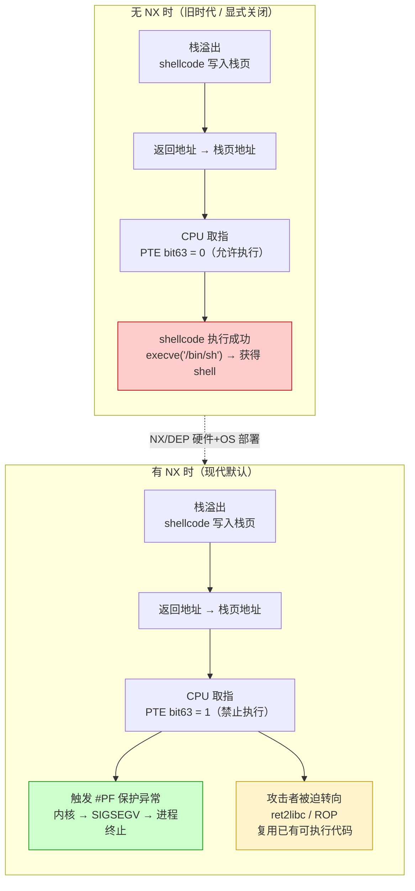

# 现代二进制防护机制（2）· DEP与NX

> [!abstract] TL;DR
> - **NX（No-eXecute）/ DEP（Data Execution Prevention）** 是现代二进制防护的第一道硬墙：通过 CPU 页表中的"执行禁止位"，让数据所在的内存页无法被当成代码执行。
> - 核心策略是 **W^X（Write XOR Execute）**：可写的页不可执行，可执行的页不可写——两者同时成立即为危险组合，现代工具链和操作系统默认拒绝。
> - 在 Linux ELF 中，`PT_GNU_STACK` 段的 `PF_X` 标志缺失即意味着 NX 栈；在 Windows 中对应的机制名为 **DEP**，通过 `/NXCOMPAT` 链接标志声明。
> - 它**直接挡住**了"向栈/堆注入 shellcode 再执行"的经典攻击路径（详见 [[33.二进制漏洞与利用基础/03.Shellcode概念.md]]）。
> - 它**挡不住**复用已有可执行代码的 ret2libc 和 ROP——这是 NX 被绕过的根本边界，需要 ASLR、Canary、RELRO 等机制协同。

---

## 概述与定位

### 这项防护挡哪类攻击

在没有 NX 的时代，栈和堆上的内存页权限为 `RWX`（可读可写可执行）。攻击者利用栈溢出把精心构造的机器码（shellcode）写入栈上，再把函数返回地址指向 shellcode，函数返回时 CPU 直接跳入并执行攻击者的代码——整个攻击链只需要"一个溢出漏洞"。

NX/DEP 从硬件层面切断了这条链的最后一环：**即使攻击者成功把 shellcode 写入栈/堆，那块内存页的权限也是 `RW-`（无执行权限），CPU 试图取指执行时触发保护异常，内核发送 `SIGSEGV` 终止进程**。

这一机制与 [[14.动态链接与加载器详解/04.可执行文件的内存映射.md]] 中描述的"W^X 安全基线"直接对应——那篇在加载器视角阐明了代码段（`R-X`）与数据段（`RW-`）权限分离的操作系统机制，本篇从安全防护的角度深入这一设计的动机、CPU 实现、绕过边界和开启验证方式。

---

## 原理与机制

### 页表 NX 位：硬件层面的执行禁止

现代 x86-64 系统中，每个虚拟页的访问权限由 **页表项（Page Table Entry，PTE）** 控制。PTE 是一个 64 位整数，其中：

- **bit 0**（P）：页是否在内存中（Present）
- **bit 1**（R/W）：0 = 只读，1 = 可读可写
- **bit 2**（U/S）：0 = 仅内核可访问，1 = 用户空间可访问
- **bit 63**（NX/XD，No-eXecute / eXecute-Disable）：**1 = 禁止从此页取指执行，0 = 允许执行**

x86-64 长模式下，每级页表项（PML4/PDPT/PD/PT）的 bit 63 均可设置 NX 位。CPU 在取指时，若任意一级页表项的 NX 位为 1，则触发 **#PF（页错误，error code bit 4 = 1，表示"指令取指违反"）**，等价于硬件层面的"禁止执行"判决。

```
x86-64 PTE（64 位，示意）：
bit 63     bit 2  bit 1  bit 0
  NX         U/S    R/W    P
   ↑                       ↑
  =1 → 此页禁止执行        =1 → 页在内存中

操作系统将数据页（栈/堆/.data/.bss）的 PTE bit 63 置 1：
  → CPU 取指到此页 → 触发 #PF（执行错误）→ 内核发 SIGSEGV
```

ARM 架构使用的是 **XN（eXecute-Never）** 位，原理完全对称：页描述符中的 XN/PXN 位置 1，即禁止从该页取指。64 位 ARMv8/v9 扩展为 UXN（非特权执行禁止）+ PXN（特权执行禁止）两位，粒度更细。

### 硬件支持历史：AMD NX 与 Intel XD

NX 位在 x86 历史上并非一开始就有：

| 年份 | 事件 |
|---|---|
| 2003 | **AMD** 在 Athlon 64 / Opteron 上率先引入 **NX bit**（No-eXecute），作为 x86-64 扩展的一部分 |
| 2004 | **Intel** 在 Pentium 4 Prescott（EM64T）上引入等价位，命名为 **XD bit**（eXecute Disable）；功能与 AMD NX 完全相同，名字不同 |
| 2004 | Windows XP SP2 发布，首次在 32 位 x86 系统上通过 PAE（Physical Address Extension）软件模拟 DEP，硬件 NX 需要 64 位模式或支持 PAE+NX 的 CPU |
| 2006–2007 | Vista / Linux 2.6.x 默认在 64 位模式下强制开启 NX；32 位模式下通过 PAE 扩展支持 |
| 现在 | 所有现代 x86-64 CPU（Intel、AMD）均支持 NX/XD 位；ARM、RISC-V 等架构也均有等价机制 |

> [!note] 32 位 x86 的历史包袱
> 早期 32 位 x86 的两级页表使用 32 位 PTE，没有多余位放 NX。PAE（Physical Address Extension，36 位物理地址）把 PTE 扩展到 64 位，才有空间放 bit 63 = NX。32 位 Linux 需要启用 PAE 模式（`CONFIG_X86_PAE`）才能使用硬件 NX；纯 32 位非 PAE 内核依赖软件模拟，开销更高且不够可靠。64 位系统无此限制。

### W^X 策略：NX 的操作系统落地

NX 位是 CPU 提供的硬件原语，**W^X（Write XOR Execute，可写异或可执行）** 是操作系统和工具链在其之上实施的安全策略，核心要求：

> **一个内存页，要么可写（W），要么可执行（X），二者不能同时成立。**

这直接反映在内存映射权限的组合上：

| 权限组合 | W^X 是否满足 | 典型用途 |
|---|---|---|
| `R-X`（只读可执行） | 是 | 代码段 `.text` |
| `RW-`（可读可写） | 是 | 数据段 `.data`、`.bss`、栈、堆 |
| `R--`（只读） | 是 | 只读数据 `.rodata`、RELRO 后的 GOT |
| `RWX`（可读可写可执行） | **否** | 危险！旧时代的默认或配置错误 |
| `-WX`（可写可执行，不可读） | **否** | 极罕见，几乎总是错误 |

### Mermaid：有/无 NX 时数据页执行的命运



---

## 实现细节

### Linux：PT_GNU_STACK 与 mprotect

**ELF 中的 NX 声明：`PT_GNU_STACK`**

Linux 通过 ELF 程序头中一个特殊段类型 `PT_GNU_STACK` 声明栈的执行权限。该段没有文件内容（`p_filesz = 0`、`p_memsz = 0`），仅用 `p_flags` 字段传达意图：

```
PT_GNU_STACK  p_flags = PF_R | PF_W           → NX 开启（栈不可执行，默认）
PT_GNU_STACK  p_flags = PF_R | PF_W | PF_X   → NX 关闭（栈可执行，危险）
```

内核在 `execve` 加载 ELF 时读取此字段，决定 `mmap` 栈时是否附加 `PROT_EXEC`：

```c
// 内核 fs/binfmt_elf.c（示意逻辑）
if (!(elf_stack_flags & PF_X)) {
    // NX：栈只有读写权限
    stack_prot = PROT_READ | PROT_WRITE;
} else {
    // execstack：栈可执行（历史兼容 / 教学环境）
    stack_prot = PROT_READ | PROT_WRITE | PROT_EXEC;
}
mmap(stack_addr, stack_size, stack_prot, MAP_PRIVATE | MAP_ANONYMOUS | MAP_STACK, -1, 0);
```

若 ELF 中不存在 `PT_GNU_STACK` 段（如某些旧工具链编译的二进制），内核默认策略视内核配置而定——大多数现代 Linux 发行版内核默认按 NX 处理。

**链接选项：`-z execstack` / `-z noexecstack`**

```bash
# 默认（NX 开启）：链接器生成 PT_GNU_STACK，p_flags = PF_R|PF_W
gcc -o safe a.c                      # 等效 -z noexecstack

# 显式关闭 NX（教学 / 调试用）：链接器生成 PT_GNU_STACK，p_flags = PF_R|PF_W|PF_X
gcc -o unsafe a.c -z execstack
```

**运行时权限修改：`mprotect`**

`mprotect(2)` 系统调用允许进程在运行期修改已映射内存页的保护权限：

```c
#include <sys/mman.h>
// 将地址 addr 起 length 字节的区域改为可执行（需要页对齐）
mprotect(addr, length, PROT_READ | PROT_EXEC);
```

这是合法绕过 NX 的标准路径，**被 JIT 编译器（V8、LuaJIT、JVM JIT 等）广泛使用**：先用 `mmap(PROT_READ|PROT_WRITE)` 写入生成的机器码，再 `mprotect(PROT_READ|PROT_EXEC)` 切换为只执行——两种权限不同时存在，符合 W^X。

> [!warning] 攻击者也能用 mprotect
> 若攻击者已经通过 ROP 或其他手段控制了程序执行流，可以构造调用 `mprotect` 的 ROP 链，把某块数据页改为可执行，再跳入其中执行 shellcode——这种手法绕过了 NX，称为"mprotect 升权"。对抗此手法需要更强力的机制（如 `PaX` 补丁的"永久 W^X"，或 macOS Hardened Runtime 的 `MAP_JIT` 限制）。

### Windows：DEP（Data Execution Prevention）

Windows 的等价机制命名为 **DEP（Data Execution Prevention）**，在底层同样依赖 CPU 的 NX/XD 位。

**DEP 的两个模式：**

| 模式 | 说明 |
|---|---|
| **硬件强制 DEP（Hardware-enforced DEP）** | 依赖 CPU NX/XD 位，在 PTE 层面禁止执行；2004 年后所有新 CPU 均支持 |
| **软件模拟 DEP（Software-enforced DEP，SafeSEH）** | 仅保护 SEH（结构化异常处理）链，不依赖 CPU NX 位；旧 32 位系统的回退方案 |

**PE 文件中的 NX 声明：`/NXCOMPAT`**

PE 的 `IMAGE_OPTIONAL_HEADER.DllCharacteristics` 字段中，bit 8（`IMAGE_DLLCHARACTERISTICS_NX_COMPAT = 0x0100`）标记该可执行文件与 DEP 兼容，告知 Windows Loader 可以为其开启硬件强制 DEP：

```
DllCharacteristics = 0x8160
  bit 8  (0x0100) = IMAGE_DLLCHARACTERISTICS_NX_COMPAT   → DEP 兼容
  bit 6  (0x0040) = IMAGE_DLLCHARACTERISTICS_DYNAMIC_BASE → ASLR
  bit 15 (0x8000) = IMAGE_DLLCHARACTERISTICS_TERMINAL_SERVER_AWARE
```

链接器选项：`/NXCOMPAT`（默认启用）或 `/NXCOMPAT:NO`（显式关闭，仅兼容旧代码用）。

**DEP 的系统级策略（`SetProcessDEPPolicy`）：**

Windows 还允许通过系统策略配置 DEP 的覆盖范围：

| 策略 | 含义 |
|---|---|
| OptIn（默认，Vista 时代） | 只对声明了 `/NXCOMPAT` 的程序启用 DEP |
| OptOut | 对所有程序启用，但 OptOut 名单中的程序除外 |
| AlwaysOn | 对所有程序强制启用，不可关闭（现代 64 位 Windows 实际行为） |
| AlwaysOff | 全局禁用（不推荐） |

64 位 Windows 系统上，DEP 对所有原生 64 位进程强制启用，`SetProcessDEPPolicy` 不再有效（`AlwaysOn` 实际生效）。

### macOS：XNU 的 W^X 与 Hardened Runtime

macOS 在 XNU 内核层面对所有进程强制 W^X：`mmap` 或 `mprotect` 同时请求 `PROT_WRITE | PROT_EXEC` 会被内核拒绝（返回 `EACCES`），除非进程持有特定权利（entitlement）。

如 [[14.动态链接与加载器详解/04.可执行文件的内存映射.md]] 中所述，Mach-O 段命令的 `maxprot` 字段设置了运行时权限上限——`__TEXT` 段的 `maxprot = r-x`，即使攻击者调用 `mprotect` 也无法把代码段改为可写；`__DATA` 段的 `maxprot = rw-`，禁止运行期改为可执行。

**JIT 的例外：`MAP_JIT` + Entitlement**

macOS 上的 JIT 编译器（如 Safari/JavaScriptCore）需要一块既可写又可执行的内存区域，通过以下机制实现且不违反 W^X：

1. 以 `mmap(... MAP_JIT ...)` 分配内存（需要进程具有 `com.apple.security.cs.allow-jit` entitlement）；
2. 每个线程在写代码时调用 `pthread_jit_write_protect_np(0)` 进入"写模式"（此时该线程看到 `RW-`）；
3. 写完后调用 `pthread_jit_write_protect_np(1)` 切换回"执行模式"（该线程看到 `R-X`）；
4. 利用 Apple Silicon 的硬件特性（two-permission pages，即同一物理页对不同线程呈现不同权限）实现——同一时刻，一个线程写、另一个线程执行，物理页不需要切换，但每个线程视角下永远是 W^X 合规的。

---

## 三平台对照

| 维度 | Linux | Windows | macOS |
|---|---|---|---|
| 机制名称 | NX（AMD）/ XD（Intel）| DEP（Data Execution Prevention）| W^X / XNU 强制 NX |
| 声明位置 | `PT_GNU_STACK` `p_flags`（`PF_X` 缺失 = NX）| `DllCharacteristics` bit 8（`/NXCOMPAT`）| `LC_SEGMENT_64.maxprot`；内核默认拒绝 `PROT_W\|PROT_X` |
| 默认状态 | 默认开启（现代工具链）| 64 位：强制开启；32 位 Vista+：OptIn→OptOut 演进 | 默认开启；Hardened Runtime 进一步加强 |
| 关闭方式 | `-z execstack` 链接选项 | `/NXCOMPAT:NO`（链接）或 `SetProcessDEPPolicy(0)` | 不可完全关闭；`MAP_JIT` + entitlement 为 JIT 特例 |
| JIT 例外 | `mprotect(RX)` 二阶段方式 | `VirtualAlloc(PAGE_EXECUTE_READ)` + 二阶段 | `MAP_JIT` + `pthread_jit_write_protect_np` |
| 验证工具 | `checksec`、`readelf -l` 看 `GNU_STACK` | `dumpbin /HEADERS` 看 `DllCharacteristics` | `otool -l` 看 `maxprot`；`codesign -dv` 查 entitlement |
| CPU 底层 | x86-64 PTE bit 63 = NX；ARM PTE XN/UXN 位 | 同 x86-64 PTE bit 63 = XD | Apple Silicon ARM64 XN；Intel Mac x86-64 XD |

---

## 为何 NX 能挡 shellcode 注入

结合 [[33.二进制漏洞与利用基础/03.Shellcode概念.md]] 的两大前提分析：

> shellcode 运行需要：**① 存放 shellcode 的内存页可执行** + **② 控制流能跳转到它**

NX 直接消灭前提 ①：

```
攻击路径（栈 shellcode 注入）：
  1. 攻击者通过栈溢出把 shellcode 写入 buf（在栈页）    ← 写入成功（RW-）
  2. 覆盖返回地址，使之指向 buf 起始地址               ← 覆盖成功（数据写操作）
  3. 函数返回，CPU 跳转到 buf 地址，开始取指            ← 此步被 NX 拦截
  4. 栈页 PTE bit63 = 1（NX），CPU 触发 #PF            ← 硬件层面拒绝执行
  5. 内核捕获 #PF，发送 SIGSEGV → 进程终止            ← shellcode 无法执行
```

同理，堆上注入（`malloc` 的内存）、BSS 段注入也被 NX 以相同方式阻断——任何非代码段的内存页，只要 OS 把 PTE NX 位置 1，CPU 就不会执行其中的内容。

> [!warning] NX 是必要但非充分条件
> NX 只挡住了"在数据页执行新注入代码"这一攻击路径。攻击者若改为复用程序自身 `.text` 段或 libc 中**已有的、有执行权限的**代码片段（ret2libc、ROP），NX 完全无效——那些代码本就在 `R-X` 页上，CPU 正常执行。

---

## 绕过边界与残余风险

### NX 挡不住的：ret2libc 与 ROP

NX 的根本局限在于：它只审查"被执行的页有没有执行权限"，不审查"执行的代码是否是合法控制流"。

**ret2libc**：攻击者不注入新代码，而是把栈上的返回地址指向 `libc.so` 中现有的 `system()` 函数（该函数在 `R-X` 的 libc 代码段中，CPU 正常执行），并在栈上布置 `/bin/sh` 字符串地址作为参数——整条攻击链没有任何字节在数据页上执行，NX 无从拦截。详见系列 33 第 05 篇。

**ROP（Return-Oriented Programming）**：攻击者收集程序和库中以 `ret`（`\xc3`）结尾的"gadget"片段（每个 gadget 都在 `R-X` 页上），通过控制栈上连续的返回地址，把 gadget 串联成任意计算——每一步都是合法的"从可执行页取指"，NX 对此无效。详见系列 33 第 06 篇。

```
NX 的防护边界示意：

  ✓ 挡住：向栈/堆/数据段注入 shellcode → 跳进去执行
  ✗ 挡不住：return-to-libc（跳到 libc 函数，R-X 页）
  ✗ 挡不住：ROP（串联 .text 中的 gadget，R-X 页）
  ✗ 挡不住：ret2plt / ret2syscall（复用 PLT 桩代码）
  ✗ 挡不住：mprotect ROP 链（用 ROP 调 mprotect 升权后执行 shellcode）
```

### JIT 编译器的例外

JIT 引擎（V8、SpiderMonkey、JVM、LuaJIT 等）需要在运行时生成并执行机器码，必须有一块"既能写又能执行"的内存。正确实现方式是两阶段切换（写时 `RW-`，执行时 `R-X`），但历史上不少 JIT 实现直接使用 `RWX` 内存——这块内存成为 NX 防护的"例外洞口"，是浏览器漏洞利用的重点目标。

现代方案：Windows 的 ACG（Arbitrary Code Guard）阻止进程动态创建或修改可执行内存；macOS 要求 `MAP_JIT` + entitlement；Chrome 沙箱把渲染进程和 JIT 进程隔离，降低 JIT 漏洞的影响半径。

### `mprotect` 升权的风险

如前所述，攻击者若已控制程序执行流（如通过 ROP），可构造调用 `mprotect` 或 `VirtualProtect` 的 payload，把一块数据页改为可执行，再把 shellcode 写进去执行——这是 NX 被"迂回绕过"的经典路径。

对抗手段：
- `PaX` / `grsecurity` 补丁：禁止 `mprotect` 为已有页添加 `EXEC` 权限（若该页曾经可写）；
- macOS Hardened Runtime：`maxprot` 在 Mach-O 加载时固定，`mprotect` 无法超出上限；
- Linux `vm.mmap_noexec` 等内核配置。

---

## 如何开启与验证

### 编译/链接选项

```bash
# Linux（GCC / Clang）
# 默认即 NX 开启，以下为明确写法：
gcc -o safe a.c -z noexecstack         # 明确声明栈不可执行（默认行为）

# 关闭 NX（仅教学 / 调试，生产环境禁用）：
gcc -o unsafe a.c -z execstack

# Windows（MSVC Linker）
# /NXCOMPAT 默认启用；显式写法：
link /NXCOMPAT /OUT:safe.exe ...

# 关闭（不推荐）：
link /NXCOMPAT:NO /OUT:unsafe.exe ...
```

> [!warning] 示例输出为示意
> 本节编译命令为通用示意；具体工具链版本、平台差异请参照官方手册。在 Windows 开发环境中通常通过 Visual Studio 项目属性设置，等效于 `/NXCOMPAT` 链接标志。

### checksec 验证（Linux）

```bash
checksec --file=./binary
```

```text
[*] Checking ./binary
    Arch:     amd64-64-little
    RELRO:    Full RELRO
    Stack:    Canary found
    NX:       NX enabled          ← 期望值：NX enabled
    PIE:      PIE enabled
```

> [!warning] 示例输出为示意
> 本机为 Windows 环境，上述 checksec 输出为示意，非实跑结果。在 Linux 环境中运行以获得准确输出。

`NX: NX enabled` 表示 `PT_GNU_STACK` 的 `p_flags` 不含 `PF_X`，栈不可执行。若显示 `NX disabled`，则说明编译时使用了 `-z execstack` 或代码中有对齐问题导致栈被标记为可执行。

### readelf 验证（Linux）

```bash
readelf -l ./binary | grep GNU_STACK
```

```text
  GNU_STACK  0x000000 0x0000000000000000 0x0000000000000000 0x000000 0x000000 RW  0x10
#                                                                              ^^
#                                                                              RW（无 E）= NX 开启，期望值
```

```text
  GNU_STACK  0x000000 0x0000000000000000 0x0000000000000000 0x000000 0x000000 RWE 0x10
#                                                                              ^^^
#                                                                              RWE（含 E）= NX 关闭，危险！
```

> [!warning] 示例输出为示意

`Flg` 列中有 `E`（即 `PF_X` 置位）即 NX 关闭；无 `E` 即 NX 开启。这是在 ELF 层面最直接的 NX 验证手段，不依赖任何第三方工具。

### Windows 验证：dumpbin

```bash
dumpbin /HEADERS binary.exe | findstr /i "DLL characteristics"
```

```text
            8160 DLL characteristics
                   High Entropy Virtual Addresses
                   Dynamic base          （ASLR）
                   NX compatible         ← DEP 兼容，期望值
                   Terminal Server Aware
```

> [!warning] 示例输出为示意

`NX compatible`（对应 `IMAGE_DLLCHARACTERISTICS_NX_COMPAT = 0x0100`）表示 DEP 已声明兼容。

---

## 小结

1. **NX 位是硬件原语**：x86-64 PTE bit 63（AMD 叫 NX，Intel 叫 XD）、ARM PTE XN/UXN 位——CPU 取指时若命中置 1 的 NX 位，立即触发保护异常，不会执行该页上的任何字节。
2. **W^X 是 OS 策略**：可写页不可执行，可执行页不可写，由操作系统在 `mmap` / `mprotect` 层面强制——这是现代平台的安全基线，与 [[14.动态链接与加载器详解/04.可执行文件的内存映射.md]] 中描述的段权限分离（`R-X` 代码段、`RW-` 数据段）直接对应。
3. **Linux 的 ELF 声明**：`PT_GNU_STACK` 段的 `p_flags` 无 `PF_X` = NX 栈；`-z noexecstack` 链接选项是现代工具链的默认行为；`readelf -l` + `checksec` 是验证工具。
4. **Windows 的 DEP**：通过 `/NXCOMPAT` 链接标志声明；64 位进程强制开启；底层同样依赖 CPU XD 位；`dumpbin /HEADERS` 可验证。
5. **macOS 的额外加固**：Mach-O 的 `maxprot` 字段在加载时固定权限上限；Hardened Runtime 要求 `MAP_JIT` entitlement 才能分配 JIT 内存，并通过线程级写保护实现 W^X 合规。
6. **防护边界**：NX 直接挡住了向栈/堆注入 shellcode 执行的经典路径（呼应 [[33.二进制漏洞与利用基础/03.Shellcode概念.md]] 的"两大前提"），但对复用已有可执行代码的 ret2libc 和 ROP 无效——需要 ASLR（[[03.ASLR深入]]）、Stack Canary、RELRO 等机制协同防御。

---

## 相关阅读

- **可执行文件的内存映射与 W^X 基线**：[[14.动态链接与加载器详解/04.可执行文件的内存映射.md]]
- **shellcode 的两大前提与 NX 的历史转折**：[[33.二进制漏洞与利用基础/03.Shellcode概念.md]]
- **系列内上篇（防护机制全景）**：[[01.防护机制全景]]
- **系列内下篇（ASLR 深入分析）**：[[03.ASLR深入]]
- **NX 失效后：ret2libc**：[[33.二进制漏洞与利用基础/05.ret2libc]]
- **NX 失效后：ROP 入门**：[[33.二进制漏洞与利用基础/06.ROP入门]]
- **加载器视角的安全加固（RELRO/NX/W^X）**：[[14.动态链接与加载器详解/15.加载器视角的安全.md]]
- **GOT 与 RELRO（配合 NX 的数据保护）**：[[11.ELF文件详解/17.got节.md]]
- **缓解机制全景（攻击对照）**：[[33.二进制漏洞与利用基础/12.缓解机制总览]]
- **系列总览与导航**：[[00.现代二进制防护机制总览]]

---

⬅️ 上一篇 [[01.防护机制全景]] ｜ 🏠 [[00.现代二进制防护机制总览]] ｜ 下一篇 [[03.ASLR深入]] ➡️
