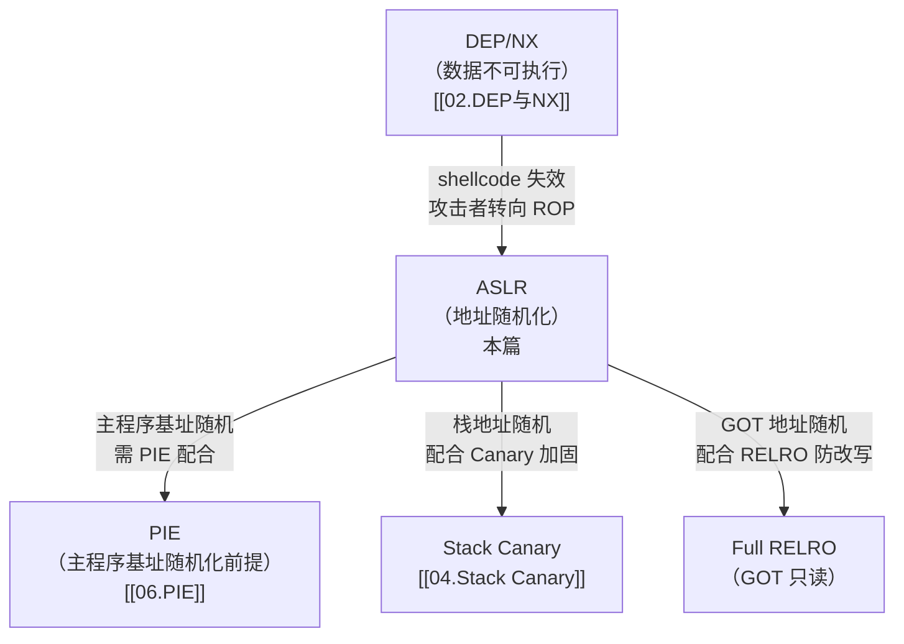
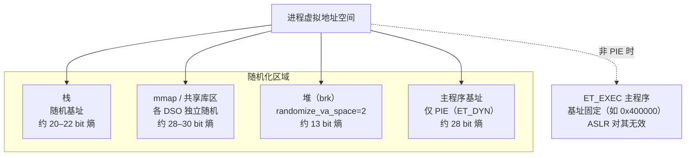

# 现代二进制防护机制（3）· ASLR深入

> [!abstract] TL;DR
> - ASLR（Address Space Layout Randomization）在每次进程创建时随机化栈、堆、共享库、mmap 区域的基址；若主程序编译为 PIE（`ET_DYN`），主程序基址也一并随机。
> - 各区域的熵差异显著：Linux x86-64 上库/mmap 约 28–30 bit，栈约 20–22 bit，brk 堆仅约 13 bit；`randomize_va_space=2` 才包含 brk 随机化。
> - ASLR 是概率防御，依赖"攻击者不知道地址"；信息泄露一旦发生，该模块的所有熵瞬间归零——防御重心必须前移到阻止泄露本身，参见 [[33.二进制漏洞与利用基础/13.现代利用与信息泄露.md]]。
> - 三平台实现差异：Linux 每 DSO 独立随机、macOS 以 shared cache slide 整体随机化系统库、Windows 以 `/DYNAMICBASE` + `HIGH_ENTROPY_VA` 控制。

本篇是「现代二进制防护机制」系列的第 3 篇，从**防护角度**深入解析 ASLR：它挡住了什么、熵从哪里来、在哪里失效，以及如何与 PIE（→ [[06.PIE]]）、Canary（→ [[04.Stack Canary]]）、RELRO 等机制协同构成纵深防御。ASLR/PIE 的机制层（PIC 原理、`ET_DYN` 加载流程、重定位类型）已在 [[14.动态链接与加载器详解/09.ASLR与位置无关代码.md]] 完整覆盖；本篇在此基础上侧重"作为防护机制的 ASLR"，两篇口径一致、视角互补，不重复展开机制推导。

---

## 概述与定位

### ASLR 挡哪类攻击

在没有地址随机化的时代，攻击者可以在 `gdb` 或 `/proc/maps` 中查到目标地址，把它硬编码进 payload，实现 return-to-libc、ROP 链、GOT 改写等攻击。ASLR 让这种"地址已知"的前提失效：

| 攻击类型 | 无 ASLR 时 | 有 ASLR 时 |
|---|---|---|
| **shellcode 注入 + 跳转栈** | 栈地址固定，`jmp esp` 硬编码地址即可 | 栈基址随机，直接跳转失败（配合 NX 双重防护） |
| **ret2libc** | `system()` 地址从符号表查到即可使用 | libc 基址随机，需先信息泄露才能定位 |
| **ROP 链** | gadget 偏移固定可预计算 | 需先泄露模块基址才能精确定位 gadget |
| **GOT 改写** | GOT 地址编译时可查 | 需先知道 `.got`/`.got.plt` 的运行期地址 |

> ASLR 本质上是**提高攻击成本**——不是让攻击不可能，而是让"直接猜地址"的成本从 O(1) 提升到 O(熵的指数量级)。

### 与 NX/DEP、PIE 的协同定位



NX/DEP 堵死了 shellcode 直接执行路径，迫使攻击者转向 ROP/ret2libc——而这两类攻击依赖已知地址，ASLR 正是在这里形成第二道防线。三者的递进关系是：**NX 迫使攻击者找 gadget，ASLR 让 gadget 地址不可预测，PIE 使主程序的 gadget 也不可预测**。

---

## 原理与机制

### ASLR 随机化哪些区域

ASLR 并非一把锁、一次随机；Linux 内核按**区域**分别随机化，机制各异：



各区域随机化机制：

| 区域 | 随机化前提 | Linux x86-64 典型熵 | 实现位置 |
|---|---|---|---|
| **主程序基址** | 必须为 `ET_DYN`（PIE） | 约 28 bit | `execve` → `load_elf_binary` 对 `ET_DYN` 随机 mmap |
| **共享库/mmap 基址** | 无需 PIE，mmap 区间本身随机 | 约 28–30 bit | 内核 `mmap`，各 DSO 独立随机偏移 |
| **栈** | 始终随机（含 `randomize_va_space=1`） | 约 20–22 bit（帧内另有最大 8 字节额外随机） | 内核初始化栈顶时加随机偏移 |
| **堆（brk）** | 需 `randomize_va_space=2` | 约 13 bit | `brk` 系统调用起始值随机化 |

> [!note] 熵的上限来自哪里
> x86-64 用户空间地址理论 47 bit，但库区间从固定高地址向下 mmap、低 12 bit 被 4KB 页对齐强制清零、内核保留地址范围，实际可随机的 bit 远小于理论值。AArch64 64 KB 页模式下熵甚至更低。brk 约 13 bit 意味着约 8192 种可能的堆基址，在 fork 模型服务中暴力猜测成本可接受——这是 brk 熵偏低的现实风险。以上数值与 [[14.动态链接与加载器详解/09.ASLR与位置无关代码.md]] 表格口径一致。

### 熵从哪里来

Linux 的随机化源头是内核的 `get_random_u32()`（底层使用 CSPRNG）。对 mmap/栈/brk，内核在分配时加入随机偏移量，再对齐到页边界（低 12 bit 清零）。随机化偏移的有效 bit 数即为该区域的熵。

对主程序（PIE）：内核 `execve` 发现 `ET_DYN`，直接把整个镜像 mmap 到 ASLR 随机选出的基址。ld.so 随后用该实际基址处理 `R_X86_64_RELATIVE` 重定位，把所有内部指针从"链接期 addend"调整到"运行期真实地址"。完整流程见 [[14.动态链接与加载器详解/09.ASLR与位置无关代码.md]] §数据结构/流程详解。

### `/proc/sys/kernel/randomize_va_space`

这是 Linux 控制 ASLR 级别的唯一内核参数：

| 值 | 效果 | 生产建议 |
|---|---|---|
| **0** | 关闭 ASLR：所有区域均不随机化 | 仅调试用，生产禁止 |
| **1** | 部分随机化：共享库、栈、mmap 随机；**brk/堆不随机** | 不推荐，brk 固定暴露堆地址 |
| **2** | 完全随机化（**默认值**）：在 1 的基础上 brk 也随机化 | 生产保持为 2 |

```bash
# 查看当前 ASLR 等级
cat /proc/sys/kernel/randomize_va_space

# 临时关闭（root，仅调试）
echo 0 > /proc/sys/kernel/randomize_va_space

# 持久化（/etc/sysctl.conf 或 /etc/sysctl.d/）
kernel.randomize_va_space = 2
sysctl -p
```

> [!warning] 示例输出为示意
> 上述命令需在 Linux 系统上以 root 执行；Windows/macOS 不存在该路径。修改此值会影响系统安全基线，请勿在生产环境设为 0 或 1。

### ASLR 必须配 PIE 才能随机主程序基址

> [!warning]
> 这是 ASLR 最常见的误解点：**开启 ASLR 不等于主程序基址随机化**。如果程序是 `ET_EXEC`（链接时未加 `-pie`），内核必须把它映射到程序头中写死的虚拟地址（如 x86-64 默认 `0x400000`），ASLR 对该地址**完全无效**。

原因：`ET_EXEC` 的各段虚拟地址在链接期写死进 `PT_LOAD` 程序头，内核的 `load_elf_binary` 会按此地址 mmap，无法偏移。只有 `ET_DYN`（PIE 编译产物）才没有固定加载地址，内核才能自由选择随机基址。因此：

```
ASLR 开启 + ET_EXEC 主程序：
  ✓ libc 基址随机（约 28-30 bit 熵）
  ✓ 栈随机（约 20-22 bit 熵）
  ✗ 主程序 .text/.got 基址固定（0x400000）
    → 攻击者可直接使用主程序 gadget，无需猜测

ASLR 开启 + PIE 主程序（ET_DYN）：
  ✓ libc 基址随机
  ✓ 栈随机
  ✓ 主程序基址随机（约 28 bit 熵）
    → 主程序 gadget 也需先泄露地址才能使用
```

PIE 的编译选项与原理详见 [[06.PIE]]。

---

## 实现细节

### 内核侧：mmap 随机偏移

Linux `mm/mmap.c` 中，`arch_mmap_rnd()` 生成随机偏移，`get_mmap_base()` 将其加入 mmap 基址。x86-64 默认 `mmap_rnd_bits=28`（可在 `/proc/sys/vm/mmap_rnd_bits` 查看），即 `mmap` 映射的随机偏移由 28 个随机 bit 组成，然后左移 12 bit（页对齐），有效熵为 28 bit。栈的随机化由 `arch_align_stack()` 在 execve 时注入。

### ld.so 侧：PIE 的基址确定

对 `ET_DYN` 主程序，ld.so（`_dl_load_object`）在选定 mmap 基址后，第一件事是处理 `.rela.dyn` 中的 `R_X86_64_RELATIVE` 重定位：

```
base = 实际加载基址（ASLR 随机值）
for each RELATIVE reloc in .rela.dyn:
    *（base + offset） = base + addend
```

`addend` 是链接期计算好的"链接时的绝对地址"（假设基址为 0 时的值），加上运行期 `base` 后得到真实指针。这就是 PIE + ASLR 的数学本质。

---

## 三平台对照

### Linux：每 DSO 独立随机

Linux ld.so 对每个共享库分别调用 `mmap(NULL, ...)` 映射，内核为每次 `mmap` 生成独立随机地址。各 DSO 相互之间无固定偏移关系。

| 维度 | Linux 行为 |
|---|---|
| 随机化单元 | 每个 DSO 独立随机偏移 |
| 主程序随机化前提 | 必须为 `ET_DYN`（`-fPIE -pie`） |
| 控制参数 | `/proc/sys/kernel/randomize_va_space`（0/1/2） |
| 关闭 ASLR（调试） | `setarch $(uname -m) -R ./binary`（单次禁用） |
| 检查工具 | `checksec --file=binary`、`ldd binary`（多次看库地址变化） |

### macOS：dyld shared cache + 整体 slide

macOS 把系统库预链接为一个大镜像（dyld shared cache，DSC），每次系统重启时对整个 DSC 应用一个随机 **slide**（偏移量）。DSC 内各库相互偏移固定，整体平移。

```
DSC 随机化示意（每次系统重启后变化，非每次进程启动）：
  slide = 0x1234_0000（随机，示意）
  libSystem   → DSC_base + 固定偏移_A + slide
  CoreFoundation → DSC_base + 固定偏移_B + slide
  （内部相互偏移不变，整体平移）
```

> [!warning] 示例偏移为示意，非本机实跑。

**重要安全含义**：DSC 内各库相互偏移固定，一旦泄露任意一个系统库函数地址，整个 DSC 内所有库的地址即全部暴露。这与 Linux 的"每 DSO 独立随机"形成鲜明对比。

| 维度 | macOS 行为 |
|---|---|
| 系统库随机化 | 整个 DSC 整体一个 slide（每次系统重启随机） |
| 第三方 dylib | dyld4 per-process slide，通常每进程独立随机 |
| 主程序随机化 | 需编译为 `MH_PIE`（Xcode 默认开） |
| 检查工具 | `codesign -dvvv binary`（看 `pie`）、`vmmap <pid>` |
| 关闭 ASLR | SIP 关闭后可操作；正常情况下 SIP 保护不可关 |

### Windows：`/DYNAMICBASE` + `HIGH_ENTROPY_VA`

Windows ASLR 以 PE 文件头的 `DllCharacteristics` 字段为开关，分两层：

**基础 ASLR**：链接时指定 `/DYNAMICBASE`，置位 `IMAGE_DLLCHARACTERISTICS_DYNAMIC_BASE`（`0x0040`）。Windows Loader 加载时选随机基址，而非使用 `ImageBase` 首选地址。32 位进程熵约 8 bit，较低。

**高熵 ASLR**：64 位专用，额外置位 `IMAGE_DLLCHARACTERISTICS_HIGH_ENTROPY_VA`（`0x0020`）。Windows 8.1+ 在 64 位进程中可把熵提升至约 17–19 bit（需与 `/DYNAMICBASE` 配合）。

```
IMAGE_OPTIONAL_HEADER64.DllCharacteristics 关键安全位：
  0x0020  IMAGE_DLLCHARACTERISTICS_HIGH_ENTROPY_VA   —— 64位高熵ASLR
  0x0040  IMAGE_DLLCHARACTERISTICS_DYNAMIC_BASE      —— 基础ASLR（/DYNAMICBASE）
  0x0100  IMAGE_DLLCHARACTERISTICS_NX_COMPAT         —— DEP/NX
  0x4000  IMAGE_DLLCHARACTERISTICS_GUARD_CF          —— CFG控制流保护
```

**强制 ASLR**：通过 Windows Defender Exploit Protection / EMET 策略，可强制对未标记 `/DYNAMICBASE` 的老旧 DLL 随机化——代价是 Loader 需做完整的 `.reloc` 重定位修正，缺 `.reloc` 节的 DLL 会退回固定地址。

| 维度 | Windows 行为 |
|---|---|
| 熵（32 bit） | 约 8 bit（较低） |
| 熵（64 bit，高熵） | 约 17–19 bit |
| 关闭 ASLR（调试） | 链接时 `/DYNAMICBASE:NO`，或清除 PE 标志位 |
| 检查工具 | `dumpbin /headers binary.exe`（看 `DLL characteristics`）、`checksec`（PE 版） |

### 三平台对照表

| 维度 | Linux（ld.so） | macOS（dyld） | Windows（Loader） |
|---|---|---|---|
| **主程序随机化前提** | `ET_DYN`（`-fPIE -pie`） | `MH_PIE`（Xcode 默认） | `/DYNAMICBASE` 标志 |
| **系统库随机化方式** | 每个 DSO 独立随机 mmap | DSC 整体一个 slide（每次重启） | 每个 DLL 独立随机（加载时） |
| **64 位库熵** | 约 28–30 bit | slide 约 20+ bit | 约 17–19 bit（高熵模式） |
| **堆随机化** | `randomize_va_space=2` 时 brk 随机（约 13 bit） | dyld 管理的堆有随机偏移 | 堆基址随机（64 bit 较高） |
| **栈随机化** | 约 20–22 bit + 帧内额外随机 | 始终随机 | 随机（含 `/GS` stack cookie） |
| **控制方式** | `/proc/sys/kernel/randomize_va_space` | SIP 保护，正常不可关 | Exploit Protection 策略 |
| **一次泄露波及** | 仅当前被泄露的 DSO | 泄露任意系统库 → 整个 DSC 暴露 | 仅当前 DLL |

---

## 绕过边界与残余风险

### 信息泄露打破 ASLR

ASLR 是概率防御，根本弱点是**依赖地址保密**。模块内偏移在链接后固定；一旦攻击者通过格式化字符串、OOB read、UAF 读、未初始化内存等途径泄露任一已知符号的运行期地址，即可计算出模块基址，随机化的保护彻底失效：

```
libc_base = leaked_printf_addr - printf_offset_in_libc
system    = libc_base + system_offset_in_libc
```

信息泄露的原理、常见原语（`%p`、OOB read、UAF unsorted bin fd/bk 泄露、未初始化内存）及防御策略，详见 [[33.二进制漏洞与利用基础/13.现代利用与信息泄露.md]]。

> [!warning]
> **信息泄露是 ASLR 的最大威胁**。任何将指针值以任何形式回显给不可信方的代码，都可能让 ASLR 瞬间归零。"全部防护开启"的 `checksec` 输出不能替代对代码逻辑是否存在泄露点的审计。

### 部分覆写（partial overwrite）绕过 ASLR

信息泄露是绕过 ASLR 最直接的方式，但并非唯一途径。当攻击者无法泄露基址，但能精确控制对某个指针或返回地址的**部分字节写入**时，存在另一类绕过手法：**部分覆写（partial overwrite）**。

**核心原理**

x86-64 地址的低 12 bit（`bits[11:0]`）对应页内偏移，无论基址如何随机化，这 12 bit 在同一可执行文件的同一函数/gadget 处永远固定（因为同一页内的相对偏移不变）。若攻击者只覆写某个堆指针或栈上返回地址的**最低 1–2 字节**（8–16 bit），就可以在不知道完整基址的情况下，将目标跳转到同一页（或同一模块）内另一个函数/gadget：

```
原始返回地址（示意）：
  0x7f 3a 45 67  89 ab  cd ef   ← 前 6 字节受 ASLR 随机化影响
                            ↑
                        低 2 字节（16 bit）= 页内偏移（低 12 bit固定）+ 1–2 bit页偏移

部分覆写：只改最低 1 字节（8 bit），把 0xef 改为 0x20（目标 gadget 的低 8 bit 偏移）
→ 跳转到同一页内偏移为 0x...cd20 处的 gadget
→ 无需知道前 6 字节的随机值
```

**前提与限制**

| 条件 | 说明 |
|---|---|
| **1 字节覆写（低 8 bit）** | 目标 gadget 必须与原始地址在同一 256 字节对齐块内；无需猜测，确定成功（若 gadget 存在） |
| **2 字节覆写（低 16 bit）** | 目标在同一 64KB 对齐块内；低 12 bit 固定，高 4 bit 需猜测（1/16 概率），多次尝试成功率可接受 |
| **3 字节及以上** | 超出页内偏移固定范围，高位 bit 受 ASLR 影响，猜测成本上升到 O(2^n) |
| **写入方式** | 必须是**字节粒度的线性覆写**（如栈溢出、堆覆写），格式化字符串的 `%hn`/`%hhn` 也可用于指定偏移写入 |
| **非 PIE 程序** | 主程序 `.text` 基址固定（如 0x400000），部分覆写等价于直接指定偏移，无需猜测 |

**典型场景：堆上函数指针的 1 字节覆写**

```c
struct obj {
    char buf[16];       // 溢出点
    void (*callback)(); // 函数指针，紧随 buf 之后
};
```

若 `callback` 当前指向 `foo()` 函数，攻击者通过 1 字节溢出把最低字节从 `0xA0`（`foo` 的低字节）改为 `0x20`（`bar` 的低字节），在不知道基址的情况下将调用目标从 `foo` 重定向到同一页内的 `bar`——这在浏览器漏洞利用中称为"short gadget pivot"。

**防御含义**

部分覆写对 PIE+ASLR 的绕过是有限度的——它只能在同一 256 字节/64KB 块内跳转，无法任意选择目标。现代防御层次：
1. Canary 阻止栈上的线性覆写抵达返回地址；
2. RELRO 阻止 GOT 被部分覆写；
3. CFI 限制间接调用目标集，即使部分覆写成功也无法指向非法目标。

### 低熵暴力猜测

部分区域熵较低，可被暴力攻击：

**brk 堆（约 13 bit）**：约 8192 种可能的堆基址。在 `fork` 模型的网络服务中，子进程继承父进程地址布局，攻击者可多次尝试（利用子进程崩溃不影响父进程重新 fork）逐步猜测堆地址。对策：对大型缓冲区优先使用 `mmap`（熵约 28–30 bit）而非 brk 分配。

**32 位地址空间**：x86（32 位）有效地址空间有限，库区间熵约 8–16 bit，纯暴力在可接受时间内成功。64 位迁移从根本上解决了这一问题。

**Windows 32 位**：`/DYNAMICBASE` 在 32 位进程中熵约 8 bit，仅 256 种基址变体，暴力可行。必须用 64 位 + `/HIGHENTROPYVA` 才能获得有意义的保护。

### vDSO 作为特殊映射区域

**vDSO（Virtual Dynamic Shared Object）** 是 Linux 内核在每个进程地址空间中自动注入的一段特殊共享内存，包含若干高频系统调用的用户态实现（如 `gettimeofday`、`clock_gettime`、`getcpu`），用于避免完整的 `syscall` 指令陷入内核的开销。

**vDSO 与 ASLR**

vDSO 被 ASLR 随机化，这一点与普通共享库相同。然而它的地址泄露渠道与普通 DSO 截然不同，是攻击者常用的"信息通道"：

1. **通过 `auxv`（辅助向量）泄露**：内核在 `execve` 时把 vDSO 基址写入 `AT_SYSINFO_EHDR` 辅助向量条目，该条目可通过以下方式读取：

   ```c
   // 方法 1：直接读取 /proc/self/auxv
   // 方法 2：通过 getauxval(AT_SYSINFO_EHDR) 函数
   // 方法 3：栈上 envp 数组末尾紧跟 auxv，格式化字符串泄露栈内容时可能读到
   #include <sys/auxv.h>
   unsigned long vdso_base = getauxval(AT_SYSINFO_EHDR);
   ```

2. **通过格式化字符串泄露栈内容**：内核把 auxv 放在进程栈的初始布局中（`argc → argv[] → envp[] → auxv[]`），格式化字符串漏洞扫描栈内容时，若扫到 `AT_SYSINFO_EHDR` 条目的值，就泄露了 vDSO 基址。

3. **通过 `/proc/<pid>/maps` 泄露**（需要读取权限）：vDSO 以 `[vdso]` 标注出现在进程内存映射中，若攻击者能读到该文件（例如通过 SSRF + 本地文件读取），即可直接获得 vDSO 地址。

**vDSO 作为 gadget 来源的攻击价值**

vDSO 不仅仅是信息泄露通道，其本身也包含可用 gadget。vDSO 代码在编译时不依赖任何外部符号（完全自包含），内部有标准的函数序言/尾声、syscall 指令周围的 gadget，以及必要的寄存器操作序列。在已知 vDSO 基址后（无论是通过信息泄露还是 auxv 读取），攻击者可以：

- 使用 vDSO 内的 `syscall; ret` gadget 直接调用任意系统调用（比查找 libc 中 syscall 更稳定，因为 vDSO 跨 libc 版本更稳定）；
- 以 vDSO 泄露为跳板，结合 vDSO 与 libc 的**固定偏移**（在同一内核版本下二者 slide 一旦泄露其一即可推算另一个）。

> [!note] vDSO vs vsyscall
> 早期 Linux 还有 `vsyscall` 页（固定映射在 `0xffffffffff600000`），未被 ASLR 随机化，已成为经典 gadget 来源。现代内核的 vsyscall 有三种模式：`native`（保留旧行为）、`emulate`（陷入内核模拟，阻止 gadget 使用）、`none`（彻底禁用）。RHEL/Ubuntu 新版默认 `emulate` 模式，使 vsyscall 中的 syscall 指令无法被直接 ROP 使用；vDSO 则始终保持真实代码，仍是有效 gadget 来源。

### 非 PIE 可执行文件的固定段

`ET_EXEC` 主程序的 `.text`、`.plt`、`.got`、`.got.plt`、`.bss` 等段基址固定。攻击者无需猜测即可：
- 直接使用主程序内的 ROP gadget（如 `pop rdi; ret`）构造 ROP 链
- 定位主程序 GOT 表项（Partial RELRO 下可写），实施 GOT 改写
- 通过 PLT 调用已解析的外部函数

这也是为什么现代发行版（GCC >= 6 大多数默认）把默认编译选项改为 PIE，并将 [[06.PIE]] 作为独立防护机制系统化落地的原因。

### fork 继承地址：ASLR 对父子进程失效

`fork()` 子进程继承父进程的**完全相同**地址空间布局（Copy-on-Write 语义），所有模块基址与父进程一致。在 fork-based 服务中（如老版 Apache prefork 模式）：

```
fork-based server：
  子进程 A → 与父进程同地址空间 → 崩溃
  父进程继续存活 → 再次 fork
  子进程 B → 仍与父进程同地址空间
  （只要父进程不重启，地址布局永不变）
```

攻击者利用崩溃探测（crash oracle）可逐 bit 暴力枚举地址，而无需信息泄露漏洞。对策：每次请求用 `exec` 而非纯 `fork` 重建地址空间，或严格限制子进程异常恢复策略。

### fork 继承地址的对抗工程细节

上文说明了 fork 为何放大爆破风险，但防御实践中有几个关键细节值得深入。

**exec 重建地址空间 vs 信号处理后重启的区别**

`fork()` 后执行 `execve()` 是唯一能完全重建地址空间的方式。`execve` 会：
1. 卸载当前进程的所有 VMA（虚拟内存区域）；
2. 重新映射新的可执行文件（内核对 `ET_DYN` 重新选择随机基址）；
3. 所有模块（主程序、libc、堆、栈）的基址**全部重新随机化**。

与之对比，以下情况**不会**重建地址空间：

| 情况 | 地址是否重新随机化 | 说明 |
|---|---|---|
| `fork()` 后不 `exec` | 否 | 完全继承父进程地址布局 |
| 信号处理器中的 `longjmp` 恢复 | 否 | 仅栈指针跳转，地址空间不变 |
| `setjmp/longjmp` 异常恢复 | 否 | 同上，进程内部跳转 |
| `posix_spawn`（内部 fork+exec）| 是 | 等价于 fork+exec，exec 重建 |
| `clone()` 不含 `CLONE_VM` | 子进程独立，但基址仍从父进程继承 | 需后续 exec 才随机化 |

典型的**不安全模式**（fork-server 且无 exec）：

```c
// 不安全：子进程与父进程共享地址布局
while (1) {
    pid_t pid = fork();
    if (pid == 0) {
        handle_request();  // 子进程处理请求，可能崩溃
        exit(0);           // 正常退出
    }
    // 父进程等待，子进程崩溃后父进程继续 fork
    // 父进程的地址布局始终不变
}
```

```c
// 安全：每次请求通过 exec 重建地址空间
while (1) {
    pid_t pid = fork();
    if (pid == 0) {
        execve("/usr/bin/worker", argv, envp);  // exec 重新随机化
        // 此后地址空间完全重置
    }
    waitpid(pid, NULL, 0);
}
```

**为何 fork-server 放大 canary 和 ASLR 爆破风险**

在 CTF 和真实渗透中，fork-server 模式（父进程 fork 后子进程继承相同地址空间）能将 canary 和 ASLR 的爆破成本从指数量级降低到线性量级：

```
理论爆破成本（无 fork-server）：
  canary 64 bit → 需 2^63 次平均尝试
  ASLR 28 bit  → 需 2^27 次平均尝试

实际爆破成本（fork-server，逐字节探测）：
  canary 64 bit = 8 字节 → 每字节 256 次最坏 → 8 × 256 = 2048 次请求
  （子进程崩溃 = 当前字节值错误；不崩溃 = 正确）
  ASLR 28 bit → 每次请求泄露 1 bit（通过 crash vs no-crash 二分）→ 28 次请求
```

逐字节爆破 canary 的原理：canary 通常是 8 字节（64 bit），存储在 TLS（每进程唯一，子进程继承）。由于子进程复制父进程内存，每个子进程的 canary 值相同。攻击者通过溢出缓冲区，每次多溢出 1 个字节，观察进程是否触发 canary 检测（`__stack_chk_fail` → 崩溃 vs 正常返回）：

```
字节 1：尝试 0x00 → 崩溃；尝试 0x01 → 崩溃；...；尝试 0xXX → 不崩溃 → 第 1 字节确定
字节 2：固定第 1 字节，尝试 0x00..0xFF 作为第 2 字节 → 同上
...（共 8 轮，每轮最多 256 次请求）
```

**对抗工程建议**

| 场景 | 推荐方案 | 原理 |
|---|---|---|
| 网络服务每请求一个子进程 | `fork + exec` 而非纯 `fork` | exec 强制重建地址空间，每次请求独立随机 |
| 不得不纯 fork（延迟敏感）| 限制客户端连接速率 + 崩溃次数阈值 | 降低爆破的时间窗口 |
| 预 fork 工作进程（如 Nginx worker）| 接受子进程地址共享的代价 + 叠加 CFI/CET | CFI/CET 使即便猜到地址也无法任意跳转 |
| 高安全要求的长期进程 | 定期主动重启（`exec` 自身）| 强制熵重置，防止长期运行积累泄露 |

对于 Partial RELRO 的程序，攻击者若能读到 `.got.plt` 的内容（已解析的函数地址），即可泄露 libc 地址——这属于"数据读取"而非"代码执行"，但后果等同于信息泄露。Full RELRO 配合 ASLR 可防止 GOT 被改写，但**读取**已有的 GOT 内容仍可能泄露地址，需配合整体的"不回显内部数据"策略。

### macOS DSC 整体暴露风险

macOS 系统库同在 DSC 中，相互偏移固定。泄露任意一个系统函数地址，整个 DSC（包含数百个系统库）的地址空间即完全已知。相比 Linux 的"每 DSO 独立随机"，macOS 的 DSC 设计在泄露后的波及范围更大，需更严格防止任何系统库地址回显给用户。

---

## 如何提升 ASLR 防护效果

### 编译层：确保 PIE

```bash
# Linux：明确开启 PIE（现代发行版通常已默认）
gcc -fPIE -pie -o binary source.c

# 验证：确认为 ET_DYN
readelf -h binary | grep Type
# 期望输出：Type: DYN (Position-Independent Executable file)
```

> [!warning] 示例输出为示意，非本机实跑。

### 系统层：确保 `randomize_va_space=2`

```bash
# 验证（生产服务器必查项）
cat /proc/sys/kernel/randomize_va_space
# 期望输出：2

# 持久化（/etc/sysctl.d/99-aslr.conf）
echo "kernel.randomize_va_space = 2" > /etc/sysctl.d/99-aslr.conf
sysctl --system
```

> [!warning] 示例命令为示意，需在 Linux 系统执行。

### Windows：全量 `/DYNAMICBASE` + `/HIGHENTROPYVA`

对所有自有模块确保编译标志：

```bash
# MSVC 链接器（64 位）
cl /MD source.c /link /DYNAMICBASE /HIGHENTROPYVA /NXCOMPAT

# 验证
dumpbin /headers binary.exe | findstr /i "entropy\|dynamic"
```

> [!warning] 示例命令为示意，需在 Windows 环境执行。

需确保所有第三方 DLL 同样携带这两个标志，否则老旧 DLL 暴露固定地址会成为跳板。

### 提升 mmap 随机位数（Linux）

```bash
# 查看当前 mmap 随机 bit 数
cat /proc/sys/vm/mmap_rnd_bits    # x86-64 默认 28
cat /proc/sys/vm/mmap_rnd_compat_bits  # 32位兼容模式

# 提升（若内核支持，最大值取决于架构，x86-64 通常最大 32）
echo 32 > /proc/sys/vm/mmap_rnd_bits
```

> [!warning] 示例命令为示意。修改此值前需确认内核支持范围，设置过大可能被内核截断。

---

## 如何开启与验证

### 开启 ASLR + PIE（Linux 完整步骤）

```bash
# 1. 系统层：确保 ASLR=2
echo 2 > /proc/sys/kernel/randomize_va_space

# 2. 编译层：使用 PIE + 完整加固选项
gcc -fPIE -pie \
    -fstack-protector-strong \
    -D_FORTIFY_SOURCE=2 \
    -Wl,-z,relro,-z,now \
    -o binary source.c

# 3. 验证 PIE
readelf -h binary | grep "Type"

# 4. 验证全部防护
checksec --file=binary

# 5. 运行验证：多次运行观察地址变化
for i in 1 2 3; do
    ./addr_demo
done
```

```text
（示意输出）
pid=100  main=0x55a1234a1149  libc_printf=0x7f1234567890
pid=101  main=0x56b2345b2149  libc_printf=0x7f2345678901
pid=102  main=0x57c3456c3149  libc_printf=0x7f3456789012
```

> [!warning] 示例输出为示意，非本机实跑。PIE 版本每次 `main` 地址前缀都变；`ET_EXEC` 版本 `main` 固定在 `0x401149` 等固定地址，`printf` 仍随机。

### checksec 验证

```bash
checksec --file=binary
```

```text
（示意输出）
[*] '/tmp/binary'
    Arch:        amd64-64-little
    RELRO:       Full RELRO
    Stack:       Canary found
    NX:          NX enabled
    PIE:         PIE enabled          ← 说明主程序基址随机化生效
```

```bash
checksec --file=binary_nopie
```

```text
（示意输出）
[*] '/tmp/binary_nopie'
    Arch:        amd64-64-little
    RELRO:       Partial RELRO
    Stack:       Canary found
    NX:          NX enabled
    PIE:         No PIE (0x400000)    ← 基址写死，ASLR 对主程序无效
```

> [!warning] 示例输出为示意，非本机实跑。`PIE: No PIE (0x400000)` 直接显示了固定基址，是最直观的"ASLR 对主程序失效"信号。

### ldd 验证库地址随机化

```bash
ldd binary; echo "---"; ldd binary
```

```text
（示意输出）
        linux-vdso.so.1 (0x00007ffd12345000)
        libc.so.6 => /lib/x86_64-linux-gnu/libc.so.6 (0x00007f1234560000)
---
        linux-vdso.so.1 (0x00007ffc98765000)
        libc.so.6 => /lib/x86_64-linux-gnu/libc.so.6 (0x00007f9876540000)
```

> [!warning] 示例输出为示意。两次运行库地址不同，直观印证 mmap 随机化；即使非 PIE 程序，库地址仍随机。

### Windows dumpbin 验证

```powershell
dumpbin /headers notepad.exe | findstr "DLL characteristics"
```

```text
（示意输出）
            C160 DLL characteristics
                   High Entropy Virtual Addresses
                   Dynamic base
                   NX compatible
                   Terminal Server Aware
```

> [!warning] 示例输出为示意，非本机实跑。`High Entropy Virtual Addresses` + `Dynamic base` 均出现才是正确配置。

### 工具速查

| 目的 | 平台 | 命令 | 关注点 |
|---|---|---|---|
| ASLR 等级 | Linux | `cat /proc/sys/kernel/randomize_va_space` | 应为 2 |
| 文件类型 | Linux | `readelf -h binary \| grep Type` | `EXEC` vs `DYN` |
| 安全属性汇总 | Linux/macOS | `checksec --file=binary` | PIE 列 |
| 库地址随机化 | Linux | `ldd binary`（多次执行对比） | 地址是否每次不同 |
| mmap 随机 bit | Linux | `cat /proc/sys/vm/mmap_rnd_bits` | 默认 28，可提升 |
| DSC slide | macOS | `vmmap $$`、`dyld_info -shared_cache_slide` | 库地址前缀 |
| DLL 特征标志 | Windows | `dumpbin /headers binary.exe` | `DYNAMIC_BASE`/`HIGH_ENTROPY_VA` |
| 进程地址 | Linux | `/proc/<pid>/maps` | 各区域实际基址 |

---

## 小结

| 要点 | 说明 |
|---|---|
| **ASLR 随机化哪些区域** | 栈、mmap/共享库、brk 堆（=2 时）、主程序（仅 PIE） |
| **各区域熵量级** | 库/mmap 约 28–30 bit；栈约 20–22 bit；brk 约 13 bit；主程序（PIE）约 28 bit |
| **`randomize_va_space` 三级** | 0 全关 / 1 部分（无 brk）/ 2 完全（含 brk，生产值） |
| **必须配 PIE** | `ET_EXEC` 主程序基址对 ASLR 免疫；主程序随机化必须配合 `-fPIE -pie` |
| **最大威胁：信息泄露** | 一次泄露使该模块所有熵归零；需阻止 `%p` 泄露、OOB read 等，见 [[33.二进制漏洞与利用基础/13.现代利用与信息泄露.md]] |
| **低熵风险** | brk 约 13 bit，fork 模型下可暴力；32 位平台熵更低 |
| **三平台差异** | Linux 每 DSO 独立随机；macOS DSC 整体 slide（泄露一个暴露全体）；Windows `/DYNAMICBASE`+`HIGH_ENTROPY_VA` |
| **纵深防御** | ASLR + PIE + Full RELRO + Canary + CFI/CET，各层独立成立、叠加才够强 |

---

## 相关阅读

- **ASLR/PIE 机制层（PIC 原理、重定位流程、三平台完整对照）**：[[14.动态链接与加载器详解/09.ASLR与位置无关代码.md]]
- **信息泄露打破 ASLR（现代利用第一步）**：[[33.二进制漏洞与利用基础/13.现代利用与信息泄露.md]]
- **DEP/NX——ASLR 的前置防线**：[[02.DEP与NX]]
- **Stack Canary——与 ASLR 协同保护栈**：[[04.Stack Canary]]
- **PIE——使主程序基址可随机化的编译机制**：[[06.PIE]]
- **GOT 结构与 RELRO——与 ASLR 协同防止 GOT 改写**：[[11.ELF文件详解/17.got节.md]]
- **加载器视角的安全（RELRO/ret2dl 攻防）**：[[14.动态链接与加载器详解/15.加载器视角的安全.md]]
- **缓解机制总览（ASLR/NX/Canary/RELRO 全景攻防对照）**：[[33.二进制漏洞与利用基础/12.缓解机制总览.md]]
- **Windows CFG 与控制流防护（配合 ASLR 的后续防线）**：[[10.Windows防护体系]]

---

⬅️ 上一篇 [[02.DEP与NX]] ｜ 🏠 [[00.现代二进制防护机制总览]] ｜ 下一篇 [[04.Stack Canary]] ➡️
