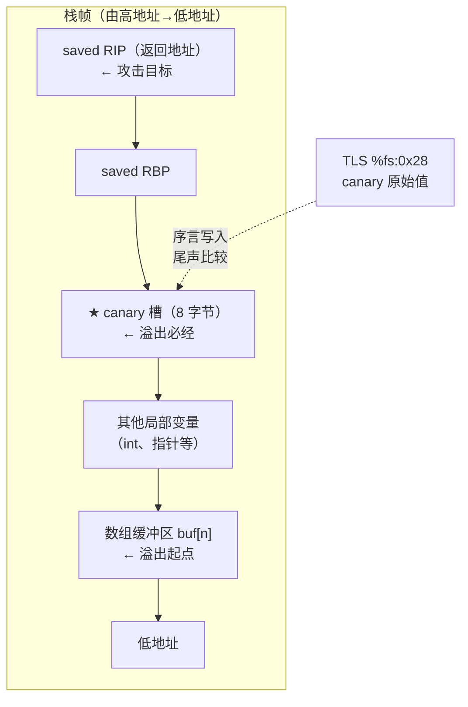
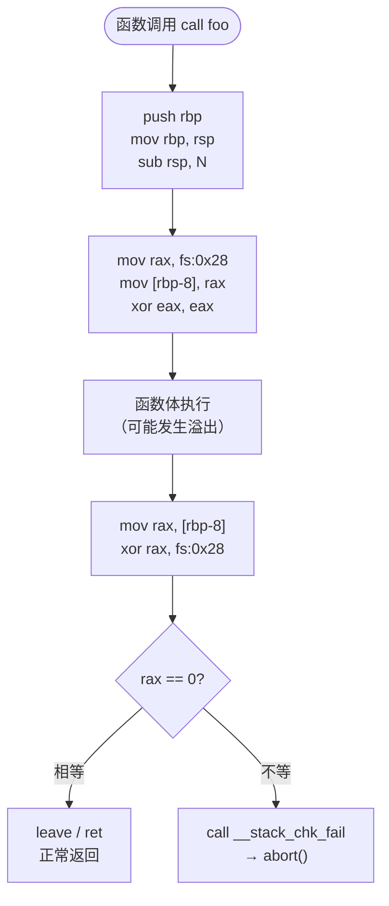

# 现代二进制防护机制（4）· Stack Canary

> [!abstract] TL;DR
> - Stack Canary（栈金丝雀）是编译器在函数**序言**（prologue）向栈上写入随机保护值、在**尾声**（epilogue）验证该值完整性的栈溢出缓解机制。
> - canary 值在进程启动时从内核 `AT_RANDOM` / `/dev/urandom` 获取，存入线程本地存储（TLS）`%fs:0x28`，每线程独立，无法跨线程推导。
> - 值被修改时 `__stack_chk_fail` 立即调用 `abort()`，阻止控制流劫持。
> - GCC 提供四个粒度选项（`-fstack-protector` / `-strong` / `-all` / `-explicit`），多数 Linux 发行版以 `-strong` 为默认值（GCC 4.9+）。
> - `[!warning]`：canary **仅拦截线性覆盖至返回地址的路径**；越界写其他局部变量、堆溢出、格式化字符串非线性写均在防护盲区，详见 [[33.二进制漏洞与利用基础/04.栈Canary原理.md]]。
> - Windows 对应机制为 GS（Security Cookie），macOS 同样采用随机 canary，三者原理一致但 TLS 偏移不同。

---

## 概述与定位

栈溢出覆盖返回地址是最经典的控制流劫持路径（见 [[33.二进制漏洞与利用基础/04.栈Canary原理.md]]）。NX 阻止了 shellcode 直接执行，ASLR 提高了 ROP gadget 定位难度（见 [[03.ASLR深入]]），但两者都不干预"覆盖行为本身"。Stack Canary 从另一个维度切入：**在栈帧内构造数据完整性绊线**——任何线性覆盖要抵达返回地址，必然先改写 canary，随即触发进程终止。

名称出自 20 世纪矿工携带金丝雀下矿的习俗：金丝雀对一氧化碳极敏感，比矿工先晕倒提供预警。栈上这个随机值逻辑相同：溢出先碰它，进程先止，攻击者无法继续。

本篇从**防护实现视角**深入：canary 值如何产生、在哪里存储、编译器插入了哪些指令、各选项覆盖范围如何权衡、绕过边界在哪里，以及如何验证保护已开启。攻击侧（泄露 canary、fork 爆破）的概念层见 [[33.二进制漏洞与利用基础/04.栈Canary原理.md]]。

---

## 原理与机制

### canary 的栈帧位置

编译器在函数分配局部变量时额外保留一个槽位，置于所有局部变量之上、`saved RBP` 之下——使任何从缓冲区低地址向高地址的线性溢出都必然先碰到 canary。



### 序言-尾声校验流程



### 汇编实例：x86-64 序言与尾声

```nasm
; ── prologue（序言）────────────────────────────────────────
push   rbp
mov    rbp, rsp
sub    rsp, 0x50              ; 分配局部变量空间（含 canary 槽）

mov    rax, QWORD PTR fs:0x28 ; 从 TLS 读 canary
mov    QWORD PTR [rbp-0x8], rax ; 写入栈上（紧邻 saved RBP 之下）
xor    eax, eax               ; 清除 rax，防 canary 留在寄存器被探测

; ── 函数体 ─────────────────────────────────────────────────
; ... 业务逻辑 ...

; ── epilogue（尾声）────────────────────────────────────────
mov    rax, QWORD PTR [rbp-0x8] ; 取栈上 canary
xor    rax, QWORD PTR fs:0x28   ; 与 TLS 原始值异或
je     .ok                      ; 结果为 0 → 相等 → 正常返回
call   __stack_chk_fail          ; 不等 → 校验失败 → abort()
.ok:
leave
ret
```

`__stack_chk_fail` 通过 PLT/GOT 调用（见 [[14.动态链接与加载器详解/15.加载器视角的安全.md]]），Full RELRO 下该 GOT 槽位在运行期只读，无法被 GOT 改写攻击替换。

---

## 实现细节

### canary 值来源：`AT_RANDOM` 与 TLS

canary 值的产生链条：

1. **内核辅助向量**：内核在 `execve` 时通过 `AT_RANDOM` 向量将 16 字节随机值的地址传入进程，这些字节由 `getrandom()` / `/dev/urandom` 生成，质量等同于密码学随机数。
2. **加载器读取**：`ld.so` 在 `_dl_sysdep_start` 阶段读 `AT_RANDOM`，以其中 8 字节初始化 TLS 中的 `stack_guard`（`__stack_chk_guard`）。
3. **TLS 存储**：x86-64 下 `%fs` 段寄存器指向当前线程的 `pthread_tcb`（线程控制块，由 `ld.so` 在线程创建时分配），固定偏移 `0x28` 处正是 canary 值：

```
pthread_tcb（%fs 指向）:
  [0x00] tcbhead_t.tcb   ← 自引用指针
  [0x28] stack_guard     ← canary 值（8 字节随机数）
  [0x30] pointer_guard   ← 函数指针混淆用的 guard
```

TLS 页的地址在 ASLR 下随机，读取必须经由段寄存器间接寻址，无法通过普通内存扫描定位。加载器视角的 TLS 初始化细节见 [[14.动态链接与加载器详解/15.加载器视角的安全.md]]。

**多线程含义**：`fork()` 子进程继承父进程 canary；`pthread_create()` 新线程获得独立 TLS 页，从父 canary 派生但有独立值——攻击者泄露一条线程的 canary 无法直接推断其他线程的值。

### canary 的三种类型

| 类型 | 特征 | 现状 |
|------|------|------|
| **Terminator canary** | 值含 `\x00`（有时含 `\r`、`\n`、`\xff`） | 利用 `strcpy`/`gets` 遇 `\0` 停止的特性；早期 StackGuard 方案，现代实现不单独使用 |
| **Random canary** | 启动时随机生成的 8 字节值 | 现代 glibc x86-64 默认；值存入 TLS，进程内唯一 |
| **Random XOR canary** | random canary 再与帧指针（frame pointer）等值异或 | StackGuard 原始论文描述；增加推导难度；glibc `pointer_guard`（`%fs:0x30`）体现类似思路 |

当前 glibc 主流使用 **random canary**，x86-64 下值在 `%fs:0x28`（`stack_guard`），ARM64 下使用 `sp_el0` + 固定偏移的类似结构。

### pointer_guard（`%fs:0x30`）：函数指针的 TLS 级混淆

在 x86-64 glibc 的 `pthread_tcb` 结构中，canary（`%fs:0x28`）的紧邻上方偏移 `%fs:0x30` 存放的是 **pointer_guard**，它与 canary 共享同一 TLS 页的生命周期，但职责完全不同：canary 守护的是栈帧返回地址，pointer_guard 守护的是**函数指针本身**的值不被伪造。

**受保护的目标**包括但不限于以下几类存储在 libc 内部的函数指针：

| 目标 | 存放位置 | 用途 |
|------|---------|------|
| `atexit`/`on_exit` 注册的析构函数 | `__exit_funcs` 链表（`.bss`/堆） | 进程退出时依次调用 |
| TLS 析构（`tls_dtor_list`） | TLS 析构链，存于堆 | `pthread_exit` 时调用 |
| `longjmp` 目标（`sigjmp_buf`） | 用户栈上的 `jmp_buf` | `longjmp` 恢复 PC |

攻击者若能任意写这些函数指针，可在进程退出或线程销毁时劫持控制流——这类攻击恰好绕过 Stack Canary 和 RELRO，因为目标不在 `.got.plt` 也不经过返回地址。

**`PTR_MANGLE` 的具体操作**（x86-64 glibc 实现）：

```c
/* glibc sysdeps/unix/sysv/linux/x86_64/pointer_guard.h（简化） */
#define PTR_MANGLE(reg)                                 \
    xorq %fs:0x30, reg;   /* 与 pointer_guard XOR */   \
    rolq $17, reg          /* 循环左移 17 位 */

#define PTR_DEMANGLE(reg)                               \
    rorq $17, reg;         /* 循环右移 17 位 */         \
    xorq %fs:0x30, reg
```

操作序列是**不可逆变换**（从攻击者视角）：要正确伪造一个混淆后的函数指针，必须同时知道 `pointer_guard` 的值；而该值与 canary 同在 TLS 页，ASLR 下无法通过普通内存扫描定位，也无法从已知目标反推（XOR 可逆但 ROL 掩盖了混淆前值的具体位模式）。

**存储与恢复时机**：写入 `atexit` 链表时，glibc 对回调指针调用 `PTR_MANGLE`；`exit()` 执行链表时调用 `PTR_DEMANGLE` 还原再跳转。`setjmp` 在保存 PC（`rip`）和栈指针（`rsp`）时同样经 `PTR_MANGLE`，`longjmp` 解混淆后才恢复。

**与 canary 的协同关系**：two guards 共同守护 TLS——一个防止栈帧返回路径被覆盖，另一个防止退出/跳转路径的函数指针被伪造。绕过其中一个不等于绕过另一个；攻击者如果同时需要覆盖返回地址又修改 `atexit` 钩子，需要分别突破两道防线（且都依赖 TLS 值泄露）。

---

## 编译选项：覆盖范围与开销对比

### 四个 `-fstack-protector` 选项

| 选项 | 保护的函数 | 典型用途 | 运行期开销（参考） |
|------|-----------|----------|-----------------|
| `-fstack-protector` | 含 `char[]`（≥ 8 B）或 `alloca()` 的函数 | 最窄；历史兼容；已有绕过案例（非 char 数组溢出） | 极低（极少函数） |
| `-fstack-protector-strong` | 含**任意数组**、对局部变量取地址（`&x`）、使用 `alloca()` 的函数 | **推荐生产默认**；GCC 4.9+ 引入；覆盖绝大多数实际溢出场景 | 低（~1% 代码量增加） |
| `-fstack-protector-all` | **所有**函数（无论布局） | 最高覆盖；安全关键路径或审计需求 | 中（每函数多 2 条 TLS 指令 + 跳转） |
| `-fstack-protector-explicit` | 仅标注 `__attribute__((stack_protect))` 的函数 | 内核、嵌入式等需精细控制开销的场景 | 按标注比例 |

> [!note] `-fstack-protector-strong` 为何优于 `-fstack-protector`
> `strong` 扩展了保护范围：`int arr[4]`、`struct s arr[2]` 等非字符数组的越界写同样会被 canary 拦截（因为这类函数也插入了 canary）；而 `-fstack-protector` 只保护含 `char[]` 的函数，攻击者可以精心布局溢出 `int[]` 绕过。大多数 Linux 发行版（Ubuntu 14.04+、Debian、Fedora、Android NDK）已将 `strong` 设为工具链默认 CFLAGS，无需手动添加。

### `-fstack-clash-protection`：相关但不同

`-fstack-clash-protection`（GCC 8+，Clang 11+）解决的是另一类问题——**栈碰撞攻击（stack clash）**：当函数分配大块栈空间时跨越保护页（guard page），直接落入其他映射区域（如 mmap 区域），使攻击者在不触发缺页异常的情况下覆盖相邻内存。

该选项的实现：大幅栈分配时插入探测写（probe），确保每 4096 字节至少访问一次，强制触发保护页的 `SIGSEGV`。它**不插入 canary**，不校验返回地址，与 `-fstack-protector-*` 互补：

```
-fstack-protector-strong  → 防止返回地址被线性溢出覆盖
-fstack-clash-protection  → 防止大栈分配跳过保护页污染相邻内存
```

两者宜同时开启：`-fstack-protector-strong -fstack-clash-protection`。

---

## 三平台对照

| 特性 | Linux（GCC/Clang） | Windows（MSVC） | macOS（Clang） |
|------|-------------------|-----------------|---------------|
| 机制名称 | Stack Canary | GS（Security Cookie） | Stack Canary |
| canary 存储 | TLS `%fs:0x28`（x86-64） | TLS `__security_cookie`（全局 + 线程 TLS） | TLS（x86-64 `%gs:0x30`，ARM64 类似） |
| 初始化来源 | `AT_RANDOM` / `getrandom()` | `RtlGenRandom` | `/dev/urandom` / `getentropy()` |
| 默认选项 | 发行版通常 `-fstack-protector-strong` | `/GS`（默认开启） | Clang 默认 `-fstack-protector` |
| 校验失败处理 | `__stack_chk_fail` → `abort()` | `__security_check_cookie` → `UnhandledExceptionFilter` → 进程终止 | `__stack_chk_fail` → `abort()` |
| 编译期关闭 | `-fno-stack-protector` | `/GS-` | `-fno-stack-protector` |

**Windows GS 额外机制**：MSVC 在函数尾声不仅检查 Security Cookie，还校验异常处理链（SEH）的完整性（若 `/SAFESEH` 开启）；GS 值与函数返回地址的 XOR 进一步防止 Cookie 值从栈上被逆推。

### xmm 寄存器保存 canary 的优化变体

在 x86-64 上，某些版本的 GCC（尤其是 4.8–5.x 系列在特定优化级别下）会生成一种不常见的 canary 保存变体：将 canary 值连同附近的局部变量一起以 SSE/XMM 指令批量保存和校验，而非使用逐字的 `MOV QWORD PTR [rbp-8], rax`。

**典型汇编形态**：

```nasm
; ── 序言（优化变体）────────────────────────────────────────────
mov    rax, QWORD PTR fs:0x28
movq   xmm0, rax               ; canary → xmm0 低 64 位
pinsrq xmm0, [rbp-0x10], 1    ; 相邻变量 → xmm0 高 64 位
movdqa [rbp-0x10], xmm0        ; 一条指令写入两个 QWORD

; ── 尾声（对称比较）────────────────────────────────────────────
movdqa xmm1, [rbp-0x10]       ; 从栈上读回 128 位
pextrq rax, xmm1, 0            ; 提取低 64 位（canary 槽）
xor    rax, QWORD PTR fs:0x28  ; 与 TLS 原始值比较
jne    __stack_chk_fail
```

**为何会出现这种变体**：当编译器决定在同一函数中保存多个值（例如：canary + 某个寄存器变量溢出到栈上），它可能将多个 `MOV` 合并为单条 SSE 指令以减少微操作数量（尤其在 Intel Sandy Bridge/Ivy Bridge 上，`MOVDQA` 可以写 16 字节但仅占一个 store buffer 槽位）。

**对防御分析的影响**：

1. **`objdump | grep "fs:0x28"` 可能漏报**：xmm 变体中，读取 TLS canary 的仍是 `mov rax, fs:0x28`，这条指令依然可被 grep 捕捉；但写入栈的指令从 `mov [rbp-8], rax` 变成了 `movq xmm0, rax; movdqa [rbp-...], xmm0` 两步，简单搜索可能只看到一半。完整验证应同时搜索 `__stack_chk_fail` 引用。

2. **对 canary 值本身无影响**：SSE 优化只是搬运方式不同，canary 的来源（`%fs:0x28`）、值（8 字节随机数）、语义（栈完整性绊线）完全不变，攻击者的"泄露再填回"策略在此变体下同样适用，无额外阻力也无额外弱点。

3. **现代 GCC 已趋向统一**：GCC 8+ 在此场景下更倾向于保持独立的 `mov` 指令（更易被调试器/插桩工具理解），xmm 批量保存变体主要出现在较旧工具链或较特殊的优化路径中。遇到该模式时不必惊慌，逻辑与标准形式等价。

---

## 绕过边界与残余风险

> [!warning] canary 的防护盲区
> Stack Canary **仅拦截"从低地址向高地址线性溢出、路径经过 canary、目的是覆盖返回地址"** 这一条路径。以下攻击面 canary 无法覆盖：

### 只保护返回地址覆盖路径

```
canary 有效路径（线性溢出）：
  buf[低] → ... → canary → saved RBP → saved RIP（被检测）

canary 无效路径：
  ① 越界写 canary 之前的局部变量（函数指针、结构体成员）
     → buf 溢出但未及 canary，已改写相邻 int* → 劫持控制流
  ② 堆溢出（heap overflow）
     → canary 仅在栈帧，堆对象无此保护
  ③ 格式化字符串任意写（non-linear write）
     → printf("%n") 精确写任意地址，完全跳过 canary
  ④ UAF / 类型混淆
     → 对象生命周期问题，与栈帧布局无关
  ⑤ 精确栈移位（only overwrite saved RBP）
     → 改 saved RBP 使 leave 后 rsp 偏移，epilogue 读到"合法"canary
```

### 格式串泄露 canary 再溢出：完整 CTF 案例流程

此类题目是 CTF pwn 入门的经典路径，完整流程分为两个阶段，逻辑上高度固定：

**前提条件**：目标程序同时存在**格式化字符串漏洞**（可泄露栈内存）和**栈溢出漏洞**（可覆盖返回地址），且二者可通过两次独立输入分别触发——这正是"泄露再溢出"成为独立题型的原因。

**第一阶段：定位并读出 canary 值**

栈上的 canary 作为一个 8 字节 QWORD 存在于确定的帧偏移处。攻击者利用 `%<N>$p` 格式符（按参数位置直接输出对应栈槽值）枚举每个槽位，直到找到满足以下特征的值：最低字节（小端序中位于内存最低地址）为 `\x00`，其余 7 字节随机非零。这一结构是 glibc random canary 的必然特征——最低字节被人为清零以截断 `strcpy`/`printf` 等终止符敏感函数对 canary 的直接读取。

```python
from pwn import *
p = process('./vuln')

# 枚举格式串参数偏移，找 canary（最低字节 == 0）
for i in range(5, 40):
    p.sendline(f'%{i}$p'.encode())
    val = int(p.recvline().strip(), 16)
    if (val & 0xff) == 0 and val != 0:
        print(f'canary @ offset {i}: {hex(val)}')
        canary = val
        break
```

**第二阶段：填回 canary 完成溢出**

已知 canary 值后，构造溢出 payload 时在 canary 槽位**精确填回原值**，尾声校验 `xor rax, fs:0x28` 结果为零，校验通过，随后覆盖 saved RBP 和 saved RIP 完成控制流劫持：

```python
# 典型 payload 布局（栈从低到高：buf → canary → saved RBP → saved RIP）
buf_size   = 64      # 根据题目栈帧布局而定
padding    = b'A' * buf_size
saved_rbp  = b'B' * 8
ret_addr   = p64(one_gadget)   # 或 ROP 链起点

payload = padding + p64(canary) + saved_rbp + ret_addr
p.sendline(payload)
```

**关键陷阱**：

1. **格式串偏移计算必须精确**：偏移 1 对应 `printf` 的第一个可变参数（即 `RSI`），不同 ABI 下格式串自身也可能在栈上，需结合 `%p %p ...` 批量输出确认哪个位置出现 canary 特征值。
2. **两次输入必须是同一栈帧**：若程序每次调用函数时重新生成栈帧（递归或复用不同函数），canary 槽位的相对偏移可能不同，需在同一函数的两次输入之间保持 canary 地址不变。
3. **canary 最低字节 `\x00` 的意义**：填回时务必把完整 8 字节（含 `\x00` 最低字节）写入；若漏掉最低字节改成 `\x41`（`'A'`），尾声校验将失败触发 `abort()`。
4. **ASLR + PIE 仍需单独泄露基址**：canary 泄露只解决 canary 校验问题，若需使用 libc 地址（`one_gadget`/`system`）或主程序 gadget，需额外在同一格式串输出中泄露对应的栈内指针再计算偏移。

### 泄露后失效

canary 的强度依赖**值的保密性**。若程序存在读漏洞（格式化字符串 `%p` 泄露、越界读、任意地址读），攻击者可读出栈上 canary 值，溢出时**原值填回**，使尾声校验通过——canary 完全失效。

这是 canary 最核心的"绕过前提"，详细的概念说明与攻击路径见 [[33.二进制漏洞与利用基础/04.栈Canary原理.md]]。

**缓解**：减少信息泄露漏洞本身（消除格式化字符串、边界检查）；配合 ASLR + PIE（见 [[03.ASLR深入]]）使栈地址随机，增加泄露后定位 canary 的难度。

### 需配合纵深防御

canary 与其他机制的互补关系：

```
canary          → 拦截返回地址线性覆盖
NX              → 禁止注入 shellcode 执行
ASLR + PIE      → 随机化代码/栈/堆地址（见 [[03.ASLR深入]]）
Full RELRO      → 锁定 GOT，防格式化字符串改 GOT（见 [[05.RELRO]]）
FORTIFY_SOURCE  → 编译期/运行期缓冲区边界检查
```

单独依赖 canary 的系统仍有大量攻击面；五项机制叠加才能构成有效的纵深防线。

---

## 如何开启与验证

### 编译选项

```bash
# 推荐生产配置（strong + clash protection + 其他防护）
gcc -o app app.c \
    -fstack-protector-strong \
    -fstack-clash-protection \
    -pie -fpie \
    -D_FORTIFY_SOURCE=2 -O2 \
    -Wl,-z,relro,-z,now \
    -Wl,-z,noexecstack

# 最高覆盖（所有函数）
gcc -o app app.c -fstack-protector-all

# 关闭（仅教学实验环境）
gcc -o vuln vuln.c -fno-stack-protector
```

### `checksec` 验证

```bash
$ checksec --file=app
```

> [!warning] 示例输出为示意，非本机实跑

```
Arch:    amd64-64-little
RELRO:   Full RELRO
Stack:   Canary found
NX:      NX enabled
PIE:     PIE enabled
FORTIFY: Enabled
```

`Stack: Canary found` 表示二进制含 `__stack_chk_fail` 引用及 `%fs:0x28` 读取模式。

### `objdump` 手动验证 canary 指令

```bash
# 搜索 TLS canary 读取特征指令（x86-64）
$ objdump -d app | grep "fs:0x28"
```

> [!warning] 示例输出为示意，非本机实跑

```nasm
1171: 64 48 8b 04 25 28 00 00 00   mov  %fs:0x28,%rax   ; 序言：读 canary
11b4: 64 48 33 04 25 28 00 00 00   xor  %fs:0x28,%rax   ; 尾声：校验异或
```

两条指令成对出现（一读一异或）是 canary 的汇编指纹。搜索 `__stack_chk_fail` 可确认校验失败分支：

```bash
$ objdump -d app | grep -A3 "__stack_chk_fail"
```

> [!warning] 示例输出为示意，非本机实跑

```nasm
0000000000001080 <__stack_chk_fail@plt>:
    1080: ff 25 9a 2f 00 00   jmp   *0x2f9a(%rip)   # .got.plt 槽位
    1086: 68 00 00 00 00      push  $0x0
    108b: e9 e0 ff ff ff      jmp   1020 <.plt>
```

`__stack_chk_fail` 经 PLT 调用；Full RELRO 下其 `.got.plt` 槽位在运行期只读，无法被 GOT 改写攻击替换（见 [[14.动态链接与加载器详解/15.加载器视角的安全.md]]）。

### `readelf` 查看动态节标志

```bash
$ readelf -d app | grep -E "FLAGS|BIND_NOW"
```

> [!warning] 示例输出为示意，非本机实跑

```
0x000000000000001e (FLAGS)     BIND_NOW
0x000000006ffffffb (FLAGS_1)   Flags: NOW PIE
```

`BIND_NOW` 说明已启用 `-z now`（Full RELRO 前提）；`PIE` 说明地址空间随机化已启用。

---

## 小结

Stack Canary 是防御栈溢出控制流劫持的**专用绊线**，工作在编译器层面，无需内核或 CPU 扩展支持：

- **canary 来源**：进程启动时由内核 `AT_RANDOM` 提供密码学随机字节，由 `ld.so` 初始化至 TLS `%fs:0x28`（`stack_guard`）。
- **运行机制**：序言从 TLS 读值写栈，尾声比较；不等则 `__stack_chk_fail` → `abort()`，进程立即终止。
- **类型**：terminator / random / random-XOR；现代 glibc 使用 random canary。
- **编译选项**：`-fstack-protector-strong` 是推荐的生产默认（GCC 4.9+，覆盖任意数组和取地址场景）；`-all` 覆盖最全；`-explicit` 供精细控制；`-fstack-clash-protection` 互补，防大栈分配跨保护页。
- **防护边界**：仅守线性溢出覆盖返回地址的路径；对越界写其他局部变量、堆、非线性写、泄露后填回等攻击面无效。
- **验证**：`checksec` 一键；`objdump` 搜 `fs:0x28` 指纹；`readelf -d` 查 `BIND_NOW`。
- **纵深配合**：与 ASLR + PIE（[[03.ASLR深入]]）、RELRO（[[05.RELRO]]）、NX、FORTIFY 组合才能构成有效防线。

---

## 相关阅读

- [[33.二进制漏洞与利用基础/04.栈Canary原理.md]] — 攻击侧：canary 如何被泄露、fork 爆破路径（概念层）
- [[14.动态链接与加载器详解/15.加载器视角的安全.md]] — 加载器视角：TLS 初始化、`AT_RANDOM`、RELRO、FORTIFY 全貌
- [[03.ASLR深入]] — ASLR 如何配合 canary 提高泄露后的定位难度
- [[05.RELRO]] — GOT 只读化，堵住格式化字符串绕过 canary 后改 GOT 的路径
- [[00.现代二进制防护机制总览]] — 本系列各防护机制全景

---

⬅️ 上一篇 [[03.ASLR深入]] ｜ 🏠 [[00.现代二进制防护机制总览]] ｜ 下一篇 [[05.RELRO]] ➡️
