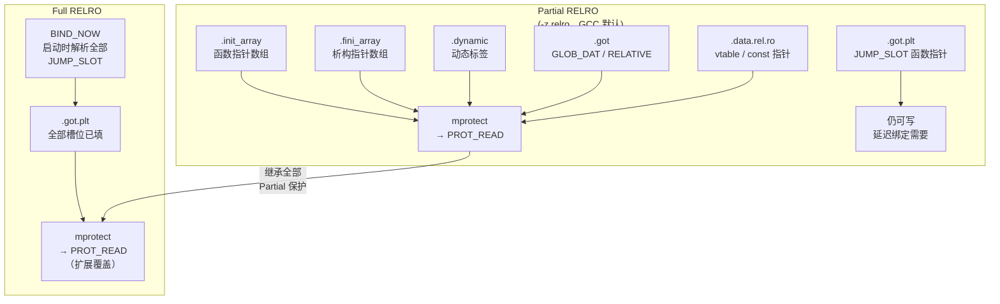
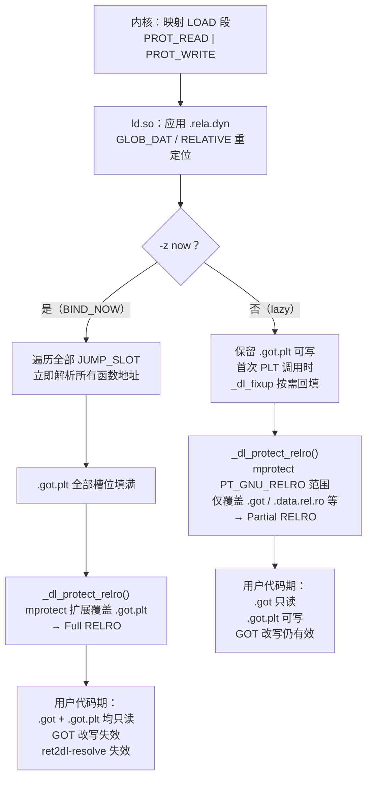

# 现代二进制防护机制（5）· RELRO

## 概述与定位

> [!abstract] TL;DR
> RELRO（RELocation Read-Only）是动态链接器在完成重定位后、把特定内存区域 `mprotect` 为只读的安全机制。**Partial RELRO**（`-Wl,-z,relro`）保护 `.got`（`GLOB_DAT` 数据 GOT）、`.dynamic`、`.init_array`/`.fini_array`，但 `.got.plt` 仍可写；**Full RELRO**（`-Wl,-z,relro,-z,now`）先靠 `BIND_NOW` 在启动时解析全部 `JUMP_SLOT`，再把 `.got.plt` 也锁为只读、关闭延迟绑定，彻底堵住 GOT 改写与 `ret2dl-resolve` 两条路径。Windows 无直接等价机制，靠 CFG 从另一维度限制间接调用；macOS arm64 靠 chained fixups 实现类似效果。

RELRO 挡住的核心攻击类是 **GOT 改写（GOT Overwrite）**：攻击者利用任意写漏洞（格式化字符串 `%n`、堆/栈溢出、UAF 等）覆盖 `.got.plt` 中的函数指针，将任意函数调用重定向到恶意代码。更进一步，Full RELRO 还封堵了 **`ret2dl-resolve`**——一种"不改 GOT、而是伪造重定位结构骗解析器"的技法（详见 [[14.动态链接与加载器详解/15.加载器视角的安全.md]] §`ret2dl-resolve` 一节）。

本篇与以下篇章紧密关联：
- [[11.ELF文件详解/17.got节.md]]：`.got` / `.got.plt` 的数据结构、GLOB_DAT 与 JUMP_SLOT、GOT 改写攻击原理
- [[11.ELF文件详解/51.data.rel.ro节.md]]：`.data.rel.ro` 的定位——"重定位后可只读"的数据（vtable、全局 const 指针）
- [[14.动态链接与加载器详解/15.加载器视角的安全.md]]：`PT_GNU_RELRO`、`mprotect` 时序、`ret2dl-resolve` 完整攻防（本篇口径以此为准）

---

## 原理与机制

### RELRO 三步实现

RELRO 的实现完全在加载器（`ld.so`）控制窗口内完成，用户代码 `main` 尚未执行时已上锁：

1. **链接期标记**：`-z relro` 让链接器生成 `PT_GNU_RELRO` 程序头，`p_vaddr`/`p_memsz` 描述"重定位完成后应只读"的虚拟内存范围，**按页对齐**扩充以满足 `mprotect` 整页粒度要求。
2. **运行期重定位**：`ld.so` 正常完成所有 `GLOB_DAT`、`RELATIVE`、`JUMP_SLOT` 等写入——此时目标内存仍可写。
3. **上锁**：`_dl_protect_relro()` 读取 `PT_GNU_RELRO` 范围，调用 `mprotect(addr, size, PROT_READ)` 将覆盖到的内存页设为只读。此后任何写入触发 `SIGSEGV`。

第 2 步中"全部 JUMP_SLOT 是否已提前解析完"是 Partial 与 Full RELRO 的**分叉点**。

### Partial vs Full RELRO 核心差异

```
Partial RELRO (-z relro，GCC 默认):
  PT_GNU_RELRO 覆盖范围：.init_array / .fini_array / .dynamic / .got / .data.rel.ro
  .got.plt 不在此范围（延迟绑定需继续回填）
  → .got (GLOB_DAT/RELATIVE) 只读，.got.plt 仍可写

Full RELRO (-z relro -z now):
  -z now → 在 .dynamic 中写入 DT_FLAGS(DF_BIND_NOW) 或 DT_FLAGS_1(DF_1_NOW)
  ld.so 解读该标志 → 启动时立即解析全部 JUMP_SLOT（等价 LD_BIND_NOW=1 但更彻底）
  所有函数 GOT 槽位填好后，PT_GNU_RELRO 边界延伸覆盖 .got.plt
  → .got 只读 + .got.plt 也只读，延迟绑定路径永远不再触发
```

> [!note] 为何 Partial RELRO 无法保护 `.got.plt`
> 延迟绑定的本质是"首次 PLT 调用时 `_dl_fixup` 回写 `.got.plt[n]`"。若 `.got.plt` 提前只读，回写即 `SIGSEGV`。因此只要延迟绑定存在，`.got.plt` 就必须可写，`PT_GNU_RELRO` 就无法覆盖它。**关掉延迟绑定（`-z now`）才是让 `.got.plt` 可只读化的前提**，两选项缺一不可。

### 内存布局与 `PT_GNU_RELRO` 边界

链接器刻意将"重定位后可只读"的节集中排布，使 `PT_GNU_RELRO` 的 `p_vaddr+p_memsz` 恰好覆盖它们而不触碰 `.data`：

```
PT_GNU_RELRO 范围（Partial RELRO 典型布局，地址为示意）：
  0x403d60  .init_array    ← 初始化函数指针数组
  0x403d70  .fini_array    ← 析构函数指针数组
  0x403d80  .dynamic       ← DT_* 动态标签
  0x403e00  .got           ← GLOB_DAT / RELATIVE 数据 GOT
  0x403e40  .data.rel.ro   ← vtable、全局 const 指针等
  ─────────────── mprotect 边界（页对齐）──────────────
  0x404000  .got.plt       ← Full RELRO 才纳入
  0x404030  .data          ← 普通可读写数据（始终在 RELRO 外）
  0x404060  .bss
```

> [!warning] 示例输出为示意
> 地址、节大小、顺序随工具链版本和编译选项而变；关键是 `.got.plt` 恰好跨越 RELRO 边界这一空间关系——Partial RELRO 正是在此留下缺口。

---

## Partial vs Full RELRO 覆盖范围对比（Mermaid）



---

## 实现细节

### `BIND_NOW`：DT_FLAGS 与 DT_FLAGS_1

`-z now` 在 `.dynamic` 中设置两个标志，`ld.so` 有其一即触发全量绑定：

| 标签 | 值 | 含义 |
|---|---|---|
| `DT_FLAGS(DF_BIND_NOW)` | `DF_BIND_NOW = 0x8` in `DT_FLAGS(0x1e)` | 触发加载时立即绑定全部 `JUMP_SLOT` |
| `DT_FLAGS_1(DF_1_NOW)` | `0x00000001` in `DT_FLAGS_1(0x6ffffffb)` | glibc 私有扩展，效果同上，优先级更高 |

`checksec` 判断 Full RELRO 的逻辑：`PT_GNU_RELRO` 存在**且** `DT_FLAGS` 含 `DF_BIND_NOW`（或 `DT_FLAGS_1` 含 `DF_1_NOW`）；只有前者为 Partial RELRO。

### 加载器时序（完整流程）



### `ret2dl-resolve` 与 Full RELRO 的关系

`ret2dl-resolve` 在目标未开 Full RELRO 时，通过伪造 `Elf64_Rela` / `Elf64_Sym` / 符号名字符串欺骗 `_dl_runtime_resolve`，使其解析出任意符号（如 `system`）并执行——全程借加载器之手，绕过传统 GOT 改写防线。

Full RELRO + `BIND_NOW` 的缓解逻辑**不是**"检测越界 `reloc_index`"，而是从根本上消除运行期 `_dl_runtime_resolve` 调用路径：

- 启动时已解析全部 `JUMP_SLOT` → PLT 慢路径（`push reloc_index; jmp PLT0`）永远不执行
- `.got.plt` 只读 → `fake_rela.r_offset` 若指向 `.got.plt`，回填即 `SIGSEGV`
- `.got.plt[GOT[2]]`（`_dl_runtime_resolve` 指针）本身只读 → 无法改写解析器入口

完整攻击链与防御分析见 [[14.动态链接与加载器详解/15.加载器视角的安全.md]]。

---

## 三平台对照

三平台在"函数指针表写保护"上殊途同归，实现路径各异：

| 维度 | Linux（ELF / ld.so） | macOS（Mach-O / dyld） | Windows（PE / Loader） |
|---|---|---|---|
| 函数指针表 | `.got.plt`（`JUMP_SLOT`） | `__DATA,__got` / `__la_symbol_ptr` | **IAT**（`IMAGE_IMPORT_DESCRIPTOR`） |
| "只读化"机制 | Full RELRO：`mprotect` + `BIND_NOW` | chained fixups 绑定后页保护；Hardened Runtime | ASLR + DEP；IAT 通常可写但 CFG 限制间接调用落点 |
| 延迟绑定 | 默认 lazy；`-z now` 关掉 | arm64 chained fixups 趋向即时绑定，`__la_symbol_ptr` 路径退场 | 无延迟绑定（普通导入加载时全量绑定 IAT）；`/DELAYLOAD` opt-in |
| 等效"Full RELRO" | `-Wl,-z,relro,-z,now` | Hardened Runtime + chained fixups 默认 | 无直接等价；CFG 从另一维度防间接调用劫持 |

### Linux

Partial RELRO 是 GCC 默认，`.got.plt` 可写，历史漏洞利用的高频目标。Fedora 23+ 对全部系统包强制 Full RELRO，Ubuntu 从 22.04 起对官方包基本默认 Full RELRO；嵌入式 Linux 与开发者自建二进制很可能仍为 Partial RELRO。

### macOS

**Hardened Runtime**（Xcode 签名选项）默认禁止 `DYLD_INSERT_LIBRARIES` 对签名二进制生效，与 Linux `AT_SECURE` 功能等价。**chained fixups**（`LC_DYLD_CHAINED_FIXUPS`）在 arm64 macOS 上几乎取代传统 lazy bind opcode：dyld 统一修补所有指针链后可将页设为只读，结构上类似 Full RELRO，且伪造 chained fixup 数据比伪造 ELF 重定位表更难。

### Windows

Windows PE 的 IAT 在加载时全量填充（相当于默认 `BIND_NOW`），但 IAT **通常可写**——传统 IAT hook 正利用此点。Windows 靠两个维度弥补：① **ASLR + DEP**；② **CFG（Control Flow Guard）**：`/guard:cf` 使间接调用在运行期检查目标是否在合法函数入口集合中，即使 IAT 被改写，跳到非法地址的 CFG 检查也会终止进程。Windows 没有等价于 Full RELRO 的"加载后 mprotect IAT 只读"机制。

---

## 绕过边界与残余风险

> [!warning] Full RELRO 不等于 GOT 攻击面清零
> Full RELRO 封堵的是**本程序**的 `.got` 与 `.got.plt`。以下攻击面仍然存在：

1. **Partial RELRO 不护函数 GOT**：`.got.plt` 中的函数指针（如 `printf`、`puts` 等）在 Partial RELRO 下完全暴露，任意写漏洞即可直接改写。这是 CTF 中格式化字符串 / 堆利用的经典收口。

2. **第三方 DSO 的 GOT**：主程序启用 Full RELRO，不代表 `libc.so`、`libpthread.so` 等加载到进程的共享库也是 Full RELRO。用 `checksec --file=/lib/x86_64-linux-gnu/libc.so.6` 单独确认。

3. **`.data`/`.bss` 中的函数指针**：Full RELRO 不保护这些区域，回调指针改写仍有效。对策：CET/CFI 限制间接调用落点（见 [[09.Intel CET]]、[[08.CFI控制流完整性]]）。

4. **`__malloc_hook`/`__free_hook`（glibc < 2.34）**：这两个钩子位于 `.bss` 可写段，是经典利用目标。glibc 2.34 已移除，升级是最直接对策。

5. **启动开销**：Full RELRO 强制在启动期解析所有函数符号，对符号多的大型程序会增加启动延迟（通常 < 10 ms，但嵌入式/冷启动场景需评估）。

6. **信息泄露前提**：ASLR + PIE 使 GOT 地址随机化，但一旦存在信息泄露漏洞（如格式化字符串 `%p` 读取 libc 指针），攻击者可重建地址空间布局，再结合其他可写函数指针完成利用。

---

## 如何开启与验证

### 编译选项

```bash
# Partial RELRO（GCC 现代版本默认，可显式指定）
gcc -Wl,-z,relro -o a.out a.c

# Full RELRO（推荐加固配置）
gcc -Wl,-z,relro,-z,now -o a.out a.c

# 关闭 RELRO（仅用于对比分析，生产环境不推荐）
gcc -Wl,-z,norelro -o a.out a.c

# CMake 工程
target_link_options(my_target PRIVATE -Wl,-z,relro,-z,now)
```

### `checksec` 验证

```bash
checksec --file=./a.out
```

```text
[*] './a.out'
    Arch:     amd64-64-little
    RELRO:    Full RELRO
    Stack:    Canary found
    NX:       NX enabled
    PIE:      PIE enabled
```

> [!warning] 示例输出为示意
> 具体字段值随二进制编译选项而变；`RELRO: Partial RELRO` 表示 `.got.plt` 仍可写，`No RELRO` 表示完全未保护。

### `readelf` 手动验证

```bash
# 检查 PT_GNU_RELRO 段是否存在（有输出 = 至少 Partial RELRO）
readelf -l a.out | grep GNU_RELRO

# 检查 BIND_NOW 标志（有输出 = Full RELRO）
readelf -d a.out | grep -E 'BIND_NOW|FLAGS'
```

```text
# Partial RELRO（无 BIND_NOW）
  GNU_RELRO      0x0000000000002d60 0x0000000000403d60 0x0000000000403d60
                 0x00000000000002a0 0x00000000000002a0  R      0x1
（readelf -d 无 BIND_NOW 输出）

# Full RELRO（同时有 BIND_NOW）
  GNU_RELRO      0x0000000000002d60 0x0000000000403d60 0x0000000000403d60
                 0x00000000000002c8 0x00000000000002c8  R      0x1

 0x000000000000001e (FLAGS)       BIND_NOW
 0x000000006ffffffb (FLAGS_1)     Flags: NOW
```

> [!warning] 示例输出为示意
> Full RELRO 下 `memsz` 更大（覆盖 `.got.plt`），且 `FLAGS BIND_NOW` + `FLAGS_1 NOW` 同时出现。两条命令均有输出才是 Full RELRO；只有 `GNU_RELRO` 行、无 `BIND_NOW` 为 Partial RELRO；两者都没有为 No RELRO（高风险）。

### GDB 验证 `.got.plt` 只读性（Full RELRO 场景）

```bash
gdb ./demo_now
(gdb) break main
(gdb) run
(gdb) set {long}0x404000 = 0xdeadbeef   # 尝试写 .got.plt 所在页
```

```text
# Full RELRO 预期输出：
Cannot access memory at address 0x404000
```

> [!warning] 示例输出为示意
> Full RELRO 下 `mprotect` 已将 `.got.plt` 所在页设为 `r--`；Partial RELRO 下写入会成功。

### 三种 RELRO 级别对比表

| RELRO 级别 | 链接参数 | `.got` 保护 | `.got.plt` 保护 | `.data.rel.ro` | 延迟绑定 | 启动开销 |
|---|---|---|---|---|---|---|
| No RELRO | `-Wl,-z,norelro` | 否 | 否 | 否 | 保留 | 无 |
| Partial RELRO | `-Wl,-z,relro`（GCC 默认） | 只读 | **可写** | 只读 | 保留 | 微小 |
| Full RELRO | `-Wl,-z,relro,-z,now` | 只读 | **只读** | 只读 | 关闭 | 略增（< 10 ms） |

---

## 小结

1. **RELRO = 加载器最后一把锁**：`ld.so` 在完成重定位后、`main` 执行前，把 `PT_GNU_RELRO` 覆盖的内存页调用 `mprotect(PROT_READ)` 锁定。这是程序自身代码无法做到的——加载器的"特权窗口"正是施力点。

2. **Partial RELRO 护数据 GOT，不护函数 GOT**：`.init_array`/`.fini_array`/`.dynamic`/`.got`（GLOB_DAT）在 Partial RELRO 下只读，但 `.got.plt`（JUMP_SLOT，函数指针）仍可写——格式化字符串写 GOT、堆溢出写 GOT 等经典手法依然有效。

3. **Full RELRO = BIND_NOW + 扩展锁**：`-z now` 让加载器启动时解析全部函数符号，填满 `.got.plt` 后一并上锁；同时消除运行期 `_dl_runtime_resolve` 调用路径，使 `ret2dl-resolve` 从根本上失效（详见 [[14.动态链接与加载器详解/15.加载器视角的安全.md]]）。

4. **绕过边界仍存在**：Full RELRO 不保护 `.data`/`.bss` 中的函数指针、第三方 DSO 的 GOT、旧版 glibc 的 malloc hook；需配合 CFI/CET、版本升级、代码审计共同应对。

5. **三平台殊途同归**：Linux Full RELRO `mprotect`、macOS chained fixups 页保护 + Hardened Runtime、Windows CFG 间接调用检查——各自用不同手段指向同一安全目标：锁定函数指针表或限制间接调用落点。

---

## 相关阅读

- **GOT 结构与 GOT 改写攻击原理**：[[11.ELF文件详解/17.got节.md]]
- **vtable 等重定位后只读数据（`.data.rel.ro`）**：[[11.ELF文件详解/51.data.rel.ro节.md]]
- **`PT_GNU_RELRO`、`mprotect` 时序、`ret2dl-resolve` 完整攻防**：[[14.动态链接与加载器详解/15.加载器视角的安全.md]]
- **上一篇（栈金丝雀）**：[[04.Stack Canary]]
- **下一篇（PIE / 位置无关可执行）**：[[06.PIE]]
- **系列总览**：[[00.现代二进制防护机制总览]]

---

⬅️ 上一篇 [[04.Stack Canary]] ｜ 🏠 [[00.现代二进制防护机制总览]] ｜ 下一篇 [[06.PIE]] ➡️
