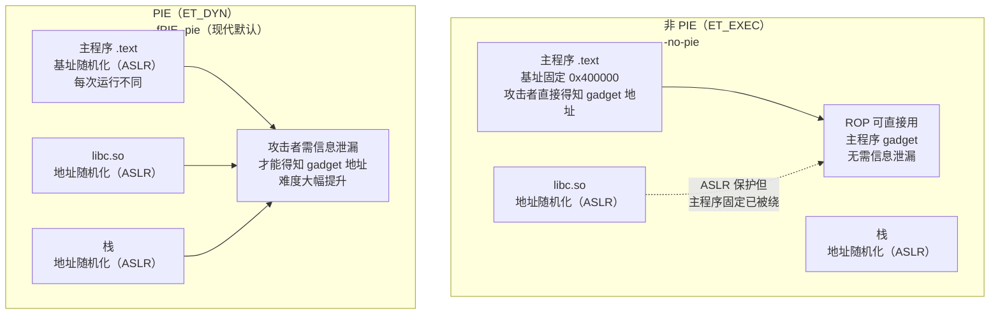

# 现代二进制防护机制（6）· PIE

## 概述与定位

> [!abstract] TL;DR
> PIE（Position-Independent Executable）把主程序编译成 `ET_DYN` 类型（与共享库相同），使操作系统加载器能够自由选择其基址——这正是 ASLR 随机化主程序基址的前提。传统的 `ET_EXEC` 可执行文件基址在链接期写死（x86-64 典型值 `0x400000`），即使系统开启 ASLR，主程序的代码段与数据段地址也永远固定，攻击者可直接利用其 `.text`/`.plt` 区域构建 ROP 链，无需猜测任何地址。PIE 消除了这一盲点，让 ASLR 的随机化覆盖整个进程映像。

PIE 挡住的核心威胁是**利用主程序固定地址构造 ROP 链 / ret2text 攻击**：攻击者无需信息泄漏、直接知道 `.text` 段中任意 gadget 的绝对地址，从而绕过 ASLR 对共享库的保护。PIE 开启后，主程序地址每次运行均随机化，这一前提被打破。

本篇与以下篇章紧密关联：
- [[14.动态链接与加载器详解/09.ASLR与位置无关代码.md]]：ASLR 与 PIE 的协作机制、`ET_EXEC` vs `ET_DYN`、熵分析（本篇口径以此为准）
- [[14.动态链接与加载器详解/01.从静态链接到动态链接.md]]：`ET_DYN` 是共享库和 PIE 可执行文件的共同类型，动态链接流水线基础
- [[05.RELRO]]：PIE 与 RELRO 常配合部署，共同覆盖地址随机化 + GOT 写保护两个维度
- [[07.Fortify Source]]：下一篇，编译期缓冲区越界检测

---

## 原理与机制

### 核心问题：`ET_EXEC` 的基址固化

ELF 文件头的 `e_type` 字段决定了可执行文件的类型，也直接决定了 ASLR 能否随机化主程序基址：

| `e_type` | 名称 | 基址特征 | ASLR 能随机化主程序？ |
|---|---|---|---|
| `ET_EXEC`（值 `2`） | 传统可执行文件 | 链接期写死（x86-64 默认 `0x400000`） | **不能**——内核按程序头写死的地址映射 |
| `ET_DYN`（值 `3`） | 共享库 / PIE 可执行文件 | 无固定基址，加载器自由选择 | **能**——加载器随机选基址后施加随机偏移 |

`ET_EXEC` 可执行文件在内核 `load_elf_binary` 中会被**按照程序头里写死的 `p_vaddr` 直接 mmap**，没有任何随机化余地。即使 `/proc/sys/kernel/randomize_va_space=2`，也只有共享库、栈、堆（brk）等区域被随机化，主程序自身的代码与数据段地址完全固定。

PIE 的解法是：**把可执行文件声明为 `ET_DYN`**。内核看到 `ET_DYN` 就会用 `mmap(NULL, ...)` 映射主程序——`NULL` 让内核自动选择地址，ASLR 随即生效。整个机制无需对主程序做任何代码修改，仅靠 ELF 头的类型字段改变内核行为。

### PIE = PIC 编译 + `ET_DYN` 链接

PIE 的实现分两层：

**编译层（`-fPIE`）**：让编译器为主程序生成位置无关代码（PIC）。在 x86-64 上，主要体现为：
- 主程序内部访问（`.rodata`、同模块函数调用）使用 **RIP-relative 寻址**，偏移在链接期确定，无论加载到什么基址都正确
- 访问外部全局变量通过 GOT 间接（`GOTPCREL(%rip)`），经 `.got` 槽位一次跳转
- 调用外部函数通过 PLT（`.got.plt` 间接跳转），与共享库完全相同

**链接层（`-pie`）**：让链接器把输出文件的 `e_type` 设为 `ET_DYN`（而非 `ET_EXEC`），并生成 `R_X86_64_RELATIVE` 等加载期重定位条目，供 `ld.so` 在映射后修正主程序内部的指针。

两者缺一不可：只有 `-fPIE` 没有 `-pie`，产物仍是 `ET_EXEC`，ASLR 无法生效；只有 `-pie` 没有 `-fPIE`，代码段含绝对地址，加载到随机基址后引用会出错。

### RIP 相对寻址 vs 非 PIE 对比

```nasm
;; ── 非 PIE（ET_EXEC）访问全局变量 global_var ──
;; 链接期直接写死绝对地址（x86-64 -no-pie）
movq    0x601040, %rax          ; 绝对地址，基址固定为 0x400000 系

;; ── PIE（ET_DYN）访问同一全局变量 ──
;; 先经 GOT 间接取地址（RIP-relative，偏移链接期确定）
movq    global_var@GOTPCREL(%rip), %rax   ; rax = &GOT[global_var]（GOT 项地址）
movq    (%rax), %rax                       ; rax = global_var 的值（间接读取）
```

对于**主程序内部**的只读数据或本模块函数，编译器可直接用 `leaq offset(%rip), %rax` 单条指令完成，不需要 GOT 间接层——链接器在输出时算好 `offset`，运行期与基址无关。外部符号才必须经 GOT。

对比 x86（32 位）：32 位 ISA 没有 `RIP`-relative 寻址，必须先 `call __x86.get_pc_thunk.bx` 把 PC 存入 `ebx`，再加偏移访问 GOT——比 x86-64 多一条指令、占用一个寄存器（`ebx`）。这正是 x86-64 PIE 开销比 x86 PIE 小的根本原因。

### 加载期：`R_X86_64_RELATIVE` 修正内部指针

PIE 主程序被映射到随机基址后，`ld.so` 第一件事就是遍历 `.rela.dyn` 中的 `R_X86_64_RELATIVE` 条目：

```
对每条 R_X86_64_RELATIVE 重定位：
    *target_address = load_base + addend
```

`addend` 是链接期算好的"相对文件基址 0 的偏移"，`load_base` 是本次加载的实际基址（由 ASLR 随机选定）。函数指针数组、虚表指针、全局初始化指针等内部绝对引用全部通过这一批重定位修正，之后主程序内部指针才正确。外部符号则由 `GLOB_DAT`/`JUMP_SLOT` 重定位完成（与普通共享库一致）。

### 非 PIE vs PIE 地址随机化对比



---

## 实现细节

### 编译选项语义

| 选项 | 作用层 | 效果 |
|---|---|---|
| `-fPIE` | 编译器 | 生成 PIC 代码（比 `-fPIC` 假定更强：符号默认不可被 interpose，允许更多直接引用） |
| `-pie` | 链接器 | 输出 `e_type = ET_DYN`，生成 `R_RELATIVE` 重定位，加入 `DF_1_PIE` 标志 |
| `-fno-pie` / `-no-pie` | 编译器/链接器 | 关闭 PIE，产物为 `ET_EXEC`，基址固定 |

`-fPIE` 与 `-fPIC` 的区别：`-fPIC` 用于共享库，假设符号可被外部 interpose（访问本模块全局变量也须经 GOT）；`-fPIE` 用于主程序，编译器知道主程序的全局符号不会被 interpose，可直接用 `leaq var@LOCAL(%rip), %rax` 省去 GOT 间接层，生成更高效的代码。

### `DF_1_PIE` 标志

链接器在 `.dynamic` 中设置 `DT_FLAGS_1` 的 `DF_1_PIE`（`0x08000000`）位，标记该 `ET_DYN` 文件是可执行文件而非共享库。工具（`checksec`、`readelf`）依此区分"PIE 可执行"与"普通共享库"——两者的 `e_type` 完全相同，靠 `DF_1_PIE` 和 `PT_INTERP` 程序头共同判断。

### 性能开销

**x86-64 PIE 的额外开销来自两处**：

1. **外部全局变量访问多一次内存间接**：本地局部变量无影响（栈变量通过 `%rsp` 访问）；主程序内部的全局变量若编译器已确认不可 interpose，用 `leaq var(%rip)` 直达，无开销；仅跨 DSO 的外部全局变量需经 GOT 间接。

2. **启动时 `R_RELATIVE` 处理**：主程序若含大量内部指针（如密集的虚表），`ld.so` 需遍历更多重定位条目。现代 glibc 支持 `DT_RELR` 压缩格式，将连续 `RELATIVE` 条目编码为位图，大幅减小重定位表体积与处理时间。

在 x86-64 上，PIE 开销通常在 **0%–5%** 之间（性能敏感路径已有 glibc PLT 优化和 GOT 松弛），远低于 32 位 x86（约 5%–15%，因 `get_pc_thunk` 和 `ebx` 寄存器压力）。

### `-no-pie` 的合理使用场景

以下场景可接受或需要关闭 PIE：

- **内核模块 / BIOS / 裸机固件**：无 ASLR 运行时，关闭 PIE 避免不必要的重定位开销
- **极度性能敏感的计算密集型程序**（需 profiling 确认）：若 GOT 间接层出现在热路径且 GOT 松弛无法消除，可评估关闭
- **静态链接程序**（`-static`）：静态链接后无运行期地址随机化，PIE + 静态联用（`-static-pie`）可实现静态 PIE，否则静态链接程序默认无 PIE
- **调试 / 逆向分析**：关闭 PIE 使地址固定，便于 GDB 断点和 IDA/Ghidra 分析

### `DF_1_PIE` 标志

链接器在 `.dynamic` 中设置 `DT_FLAGS_1` 的 `DF_1_PIE`（`0x08000000`）位，标记该 `ET_DYN` 文件是可执行文件而非共享库。工具（`checksec`、`readelf`）依此区分"PIE 可执行"与"普通共享库"——两者的 `e_type` 完全相同，靠 `DF_1_PIE` 和 `PT_INTERP` 程序头共同判断。

### static-pie：glibc 与 musl 的支持差异

**static-pie** 是将 PIE 与静态链接结合的特殊构建模式（`-static-pie` 链接选项）：产物是一个 `ET_DYN` 类型的静态二进制文件，无 `PT_INTERP`（不依赖动态链接器），但自身包含一个精简的**自举重定位器**，在内核将其映射到随机基址后自行完成 `R_*_RELATIVE` 修正，再跳入 `main`。这使得内核也能对静态二进制施加 ASLR 随机化。

**glibc 对 static-pie 的支持**（glibc 2.35+，GCC 10+）：

glibc 的 static-pie 自举重定位器（`sysdeps/x86_64/dl-machine.h` 中的 `elf_machine_runtime_setup` 与 `_dl_relocate_static_pie`）需要在 libc 初始化完成之前运行，因此存在严格的顺序约束：

```
1. 内核 execve → mmap 静态 PIE 到随机基址
2. 自举器（_dl_start_final → _dl_relocate_static_pie）：
   遍历 .rela.dyn 中的 R_X86_64_RELATIVE 条目
   * target_addr = load_base + addend
   若支持 DT_RELR：先处理压缩位图格式的 RELATIVE 重定位，再处理 .rela.dyn
3. 调用 __libc_start_main → main
```

glibc 2.35 引入了对 **`DT_RELR`**（压缩 RELATIVE 重定位格式，RFC 由 Google 提出）的 static-pie 支持：`DT_RELR` 用位图而非每条 `Elf64_Rela` 结构描述 `R_RELATIVE` 条目，对密集的连续相对重定位（如虚表指针数组）能将重定位表体积压缩 80%–90%，自举阶段的内存和时间开销随之大幅降低。

**musl 对 static-pie 的支持**（musl 1.2.0+）：

musl 的实现路径与 glibc 相似，但存在若干关键差异：

| 维度 | glibc static-pie | musl static-pie |
|------|-----------------|-----------------|
| 自举器位置 | `_dl_relocate_static_pie`（与动态 ld.so 共用大量代码） | `__dls2`（独立的极简自举函数，`ldso/dynlink.c`） |
| `DT_RELR` 支持 | glibc 2.35+ 完整支持 | musl 1.2.4+ 实验性支持，覆盖面较窄（部分架构缺失） |
| 对 `R_*_IRELATIVE` 的处理 | 支持（STT_GNU_IFUNC 解析器在自举阶段延后执行） | 支持，但 IFUNC 的延后机制更保守（不依赖 PLT 机制） |
| PIE 静态链接的 C++ 支持 | 较完整（`.init_array` 全局构造函数在重定位后运行） | 相同原理，但实现更简洁、边界情形处理有差异 |
| 默认工具链集成 | GCC 10+ 对 `--enable-static-pie` 构建的 glibc 自动支持 | Alpine Linux、Void Linux 等以 musl 为基础的发行版默认支持 |

**自举阶段的核心难点——鸡与蛋问题**：自举器本身是程序的一部分，在它修正 `R_RELATIVE` 之前，程序内所有绝对内部指针（函数指针、字符串指针等）都是"基于文件偏移 0 的裸偏移"，不可解引用。因此自举函数必须**完全无外部全局变量访问**（编译器通过 `-fPIC`/`-fPIE` 生成的 RIP-relative 代码保证了这一点），且不能调用任何依赖全局状态的函数，包括 `malloc`、锁等。glibc 和 musl 都通过严格控制自举器的代码路径来满足此约束。

### vDSO：非 PIE 但被独立随机化的特殊区域

**vDSO**（virtual Dynamic Shared Object）是内核在每个进程地址空间中映射的一个特殊只读共享库，提供少量高频系统调用的**用户态实现**（`gettimeofday`、`clock_gettime`、`getcpu`、`time`），使进程无需陷入内核即可完成这些调用，避免了 `syscall` 指令的上下文切换开销（约 200–1000 ns）。

**vDSO 与 PIE 的关系——看似矛盾，实则独立**：

vDSO 本身**不是** PIE 可执行文件，它是一个 `ET_DYN` 共享库（与 `libc.so` 同类型），由内核镜像直接提供。但它有一个独立于普通共享库的随机化机制：

```
普通共享库（libc.so 等）：
  加载地址由 ld.so 在 mmap 时由 ASLR 随机选择，所有共享库地址
  在同一进程内有相关性（从同一起始地址区间连续分配）。

vDSO：
  由内核在 execve 时直接 mmap，基址从一个独立的 ASLR 分布中选取，
  与用户空间其他映射的相关性更低。
  x86-64 Linux 的 vDSO 基址熵约 8–11 bit（受内核 ASLR 配置影响）。
```

**查看 vDSO 位置**：

```bash
# 在进程的内存映射中查找 vDSO
cat /proc/<pid>/maps | grep vdso

# 示例输出（示意，非实跑）
7ffd9f3d8000-7ffd9f3da000 r-xp 00000000 00:00 0  [vdso]
```

注意 `vdso` 的权限是 `r-xp`（只读可执行，无写权限，无文件背景），不在任何文件系统路径上。每次运行地址不同（ASLR 效果）。

**vDSO 与 PIE 协同防御的意义**：

vDSO 中的函数（如 `__vdso_clock_gettime`）是攻击者在 ROP 链中感兴趣的目标——它提供了内核态调用的"快捷入口"代码片段。由于 vDSO 独立随机化，攻击者即使通过信息泄露得知主程序基址（如 PIE 泄露），也**不能直接推算 vDSO 地址**；反之亦然——泄露 vDSO 地址不能还原主程序基址。两个随机化维度之间的相关性极低，这是 vDSO 独立 ASLR 为纵深防御额外贡献的一层不确定性。

**vDSO 的局限**：vDSO 没有 Stack Canary（内核代码路径不用 `__stack_chk_fail`），但其函数体极短（通常只有十几条指令，直接读 VVAR 数据页），攻击面本身就很小。真正的保护来自其只读映射属性和独立 ASLR，而非代码层面的防护。

---

## 三平台对照

### Linux

Linux x86-64 下 GCC 6+ 和 Clang 3.9+ 已将 `-fPIE -pie` 设为**默认编译选项**（大多数发行版如 Ubuntu、Fedora、Debian 均如此）。历史上大量用 `ET_EXEC` 编译的老旧系统工具仍以固定基址运行，现代发行版通过重编系统包逐步消除。

检查命令：
- `readelf -h binary | grep Type`：`DYN` 为 PIE，`EXEC` 为非 PIE
- `file binary`：`pie executable` 关键词确认 PIE
- `checksec --file=binary`：`PIE: PIE enabled` / `PIE: No PIE (0x400000)`

| 维度 | Linux PIE |
|---|---|
| 编译选项 | `-fPIE -pie`（GCC/Clang 现代版默认） |
| 加载随机化 | 内核 `mmap(NULL,...)` 映射，基址由 ASLR 随机（约 28 bit 熵，x86-64） |
| 重定位 | `ld.so` 处理 `R_X86_64_RELATIVE` 批量修正内部指针 |
| 关闭 | `gcc -no-pie -fno-pie -o out src.c` |

### Windows

Windows PE 可执行文件通过 `/DYNAMICBASE` 链接器标志实现等价于 PIE 的基址随机化（对应 `DllCharacteristics` 中的 `IMAGE_DLLCHARACTERISTICS_DYNAMIC_BASE`，`0x0040`）。**Visual Studio 2012 起对所有新项目默认开启 `/DYNAMICBASE`**，现代 Windows 应用基本全覆盖。

64 位程序同时应启用 `IMAGE_DLLCHARACTERISTICS_HIGH_ENTROPY_VA`（`0x0020`）以获得更高熵（约 17–19 bit vs 8 bit）。

| 维度 | Windows `/DYNAMICBASE` |
|---|---|
| 等价机制 | PE `DllCharacteristics: DYNAMIC_BASE + HIGH_ENTROPY_VA` |
| 验证命令 | `dumpbin /headers app.exe`（看 `Dynamic base`）、`checksec`（PE 版） |
| 默认状态 | VS 2012+ 默认开启 `/DYNAMICBASE` |
| 强制 ASLR | Windows Exploit Protection 可对未标记模块也施加强制随机化 |

### macOS

macOS 通过 `MH_PIE` 标志（Mach-O 文件头 `flags` 字段）实现主程序基址随机化。**Xcode 默认对所有目标启用 PIE**，macOS 10.7（Lion）起强制要求 App Store 应用开启。

| 维度 | macOS PIE |
|---|---|
| 等价机制 | Mach-O `MH_PIE` 标志，`dyld` 施加随机 slide |
| 验证命令 | `codesign -dvvv binary`（看 `flags=PIE`）、`otool -h binary`（看 `PIE` 标志位） |
| 默认状态 | Xcode 默认开启，App Store 强制要求 |
| 系统库随机化 | dyld shared cache 整体 slide 随机化（见 [[14.动态链接与加载器详解/09.ASLR与位置无关代码.md]]） |

---

## 绕过边界与残余风险

> [!warning] PIE 不等于主程序地址绝对不可知
> PIE + ASLR 是概率防御，核心依赖"攻击者不知道基址"这一前提。以下情形会削弱或绕过此保护：

### 1. 信息泄漏（最主要绕过路径）

任何能读取运行期指针值的漏洞（格式化字符串 `%p`、UAF 读取堆上的返回地址、`read()` 越界读栈帧、`/proc/self/maps` 可读等）均可泄漏主程序或库的加载基址。攻击者据此计算：

```
主程序基址 = 泄漏的主程序函数指针值 - 该函数在文件中的偏移（可从二进制文件读取）
```

一旦基址已知，PIE 提供的保护彻底消失，效果与非 PIE 无异。信息泄漏漏洞与 ASLR/PIE 绕过的完整分析见系列 33 相关篇章。

### 2. 暴力猜测（低熵 + 服务不重启）

x86-64 主程序基址约 28 bit 熵（即约 2^28 种可能基址），暴力遍历需大量尝试。但若服务采用 `fork` 模型（子进程继承父进程地址空间）且子进程崩溃后父进程不重启，攻击者可通过崩溃探测逐渐收敛正确基址。

对策：服务进程在崩溃后重新 `exec`（而非继承父进程地址空间），或采用每连接独立进程 + 严格崩溃处理。

### 3. PIE 不保护 `.data`/`.bss` 中的函数指针

PIE 随机化的是基址，`.data` 和 `.bss` 中的函数指针（回调、虚表、glibc 旧版 `__malloc_hook`）在基址随机化后位置仍随基址平移，但这些指针本身是可写的——任意写漏洞仍可改写。需要配合 Full RELRO（[[05.RELRO]]）、CFI 等进一步防护。

### 4. 非 PIE 的第三方库拖后腿

主程序开启 PIE 不代表进程内所有模块都随机化。若某个依赖库以 `ET_EXEC` 方式编译（极少见，通常不是问题）或库有固定加载地址（如 prelink），该库的地址固定，攻击者可从该库 gadget 开始构造 ROP 链。`checksec --file=<libxxx.so>` 可单独检查每个库。

### 5. `no-pie` 的遗留二进制

系统中仍可能存在历史上以非 PIE 编译的 setuid 程序、系统工具等。这些二进制开放了固定地址的攻击面，需逐步重编或用其他缓解手段替代。

---

## 如何开启与验证

### 编译选项

```bash
# PIE（现代 GCC/Clang 在大多数发行版已为默认，可显式指定）
gcc -fPIE -pie -o a.out a.c

# 关闭 PIE（仅用于对比分析或特殊场景）
gcc -fno-pie -no-pie -o a.out a.c

# CMake 工程全局启用 PIE
set(CMAKE_POSITION_INDEPENDENT_CODE ON)

# 或对单个目标
set_target_properties(my_target PROPERTIES POSITION_INDEPENDENT_CODE ON)

# 静态 PIE（静态链接 + PIE，glibc 2.35+ 支持）
gcc -fPIE -static-pie -o a.out a.c
```

### `checksec` 验证

```bash
checksec --file=./a.out
```

```text
[*] './a.out'
    Arch:     amd64-64-little
    RELRO:    Full RELRO
    Stack:    Canary found
    NX:       NX enabled
    PIE:      PIE enabled
```

> [!warning] 示例输出为示意
> `PIE: PIE enabled` 表示 `ET_DYN` + `DF_1_PIE` 确认为 PIE 可执行文件；`PIE: No PIE (0x400000)` 表示 `ET_EXEC`，括号内即固定基址。具体字段值随编译选项而变。

### `readelf` 手动验证文件类型

```bash
# 检查 ELF 类型（DYN = PIE 或共享库，EXEC = 非 PIE）
readelf -h ./a.out | grep Type

# 检查 DF_1_PIE 标志（区分 PIE 可执行文件与普通共享库）
readelf -d ./a.out | grep FLAGS_1
```

```text
# PIE 可执行文件
  Type:                              DYN (Position-Independent Executable file)

 0x000000006ffffffb (FLAGS_1)     Flags: PIE

# 非 PIE 可执行文件
  Type:                              EXEC (Executable file)
（readelf -d 无 FLAGS_1 PIE 输出）
```

> [!warning] 示例输出为示意
> 两条命令均有输出才能确认是 PIE 可执行文件（而非普通共享库）；`Type: DYN` 但无 `DF_1_PIE` 的是普通共享库。

### `file` 命令快速识别

```bash
file ./a.out
file ./a_nopie.out
```

```text
# PIE
./a.out: ELF 64-bit LSB pie executable, x86-64, dynamically linked, interpreter /lib64/ld-linux-x86-64.so.2, ...

# 非 PIE
./a_nopie.out: ELF 64-bit LSB executable, x86-64, dynamically linked, interpreter /lib64/ld-linux-x86-64.so.2, ...
```

> [!warning] 示例输出为示意
> 关键词：PIE 版出现 `pie executable`；非 PIE 版仅显示 `executable`，无 `pie` 字样。

### 运行期验证：观察基址随机化

```bash
# 多次运行 PIE 程序，主程序地址每次变化
for i in 1 2 3; do
    ./addr_demo   # 程序内打印 main 的地址
done

# 多次运行非 PIE 程序，主程序地址固定
for i in 1 2 3; do
    ./addr_demo_nopie
done
```

```text
# PIE 版示意（每次不同）
pid=1234  main=0x55a3b2c01149
pid=1235  main=0x56b2345b2149
pid=1236  main=0x57c3456c3149

# 非 PIE 版示意（始终固定）
pid=1237  main=0x401149
pid=1238  main=0x401149
pid=1239  main=0x401149
```

> [!warning] 示例输出为示意
> 地址为示意值，需在开启 ASLR（`/proc/sys/kernel/randomize_va_space=2`）的 Linux 系统上自行验证。PIE 版每次 `main` 地址前缀变化；非 PIE 版 `main` 固定（`0x401149` 中 `0x400000` 为典型固定基址）。

---

## 小结

1. **PIE 是 ASLR 覆盖主程序的前提**：`ET_EXEC` 的基址由内核按程序头写死映射，ASLR 改变不了它；把可执行文件声明为 `ET_DYN`（PIE），内核才能用 `mmap(NULL,...)` 让加载器自由选基址，ASLR 随机化才能覆盖主程序。

2. **实现 = `-fPIE`（PIC 代码）+ `-pie`（`ET_DYN` 文件类型）**：前者让代码段对加载地址不敏感（`RIP`-relative 寻址 + GOT 间接），后者让加载器获得随机化基址的能力。两者缺一不可。

3. **x86-64 开销可接受**：原生 `RIP`-relative 寻址消除了 32 位 PIC 的 `get_pc_thunk` 负担，x86-64 PIE 性能影响通常在 0%–5%；启动期 `R_RELATIVE` 重定位开销已通过 `DT_RELR` 压缩格式大幅降低。

4. **三平台均默认开启**：Linux（GCC/Clang 新版默认 `-fPIE -pie`）、Windows（VS 2012+ 默认 `/DYNAMICBASE`）、macOS（Xcode 默认 `MH_PIE`）均以 PIE/ASLR 为默认配置，历史遗留的非 PIE 二进制才是需要关注的例外。

5. **信息泄漏仍是死穴**：PIE 是概率防御，任何泄漏运行期指针值的漏洞都能让攻击者还原基址，使 PIE 失效。PIE 必须与 Full RELRO（[[05.RELRO]]）、Stack Canary（[[04.Stack Canary]]）、CFI 等纵深防御组合使用。

---

## 相关阅读

- **ASLR 机制与 `ET_EXEC` vs `ET_DYN` 详解**：[[14.动态链接与加载器详解/09.ASLR与位置无关代码.md]]
- **动态链接与 `ET_DYN` 基础**：[[14.动态链接与加载器详解/01.从静态链接到动态链接.md]]
- **GOT 结构与 RELRO 配合加固**：[[11.ELF文件详解/17.got节.md]]
- **上一篇（RELRO）**：[[05.RELRO]]
- **下一篇（Fortify Source）**：[[07.Fortify Source]]
- **系列总览**：[[00.现代二进制防护机制总览]]

---

⬅️ 上一篇 [[05.RELRO]] ｜ 🏠 [[00.现代二进制防护机制总览]] ｜ 下一篇 [[07.Fortify Source]] ➡️
