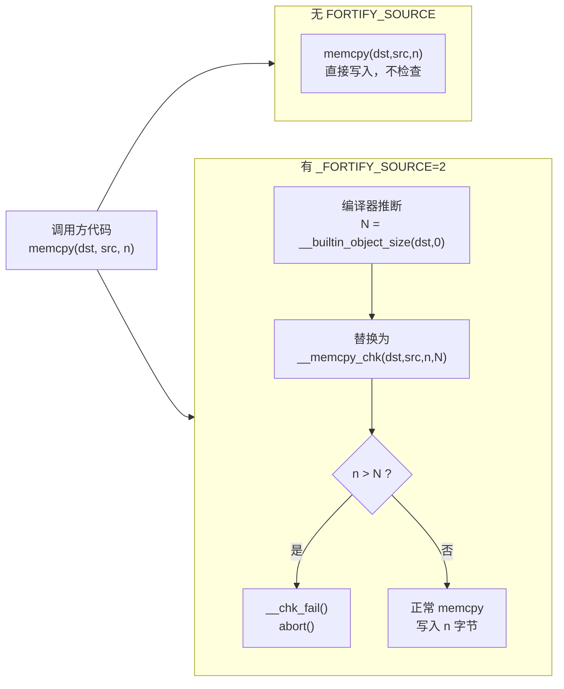

# 现代二进制防护机制（7）· Fortify Source

> [!abstract] TL;DR
> `_FORTIFY_SOURCE` 是 GCC/Clang 与 glibc 协同的**编译期 + 运行期双层**边界检查机制：编译时，编译器用 `__builtin_object_size` 推断目标缓冲区大小；链接时，`memcpy`/`strcpy`/`sprintf`/`gets`/`printf` 等危险函数被替换为带额外大小参数的 `__memcpy_chk`/`__strcpy_chk`/`__sprintf_chk`/`__printf_chk` 等 `_chk` 变体；运行时，若实际写入长度超过推断大小，glibc 调用 `__chk_fail` 立即 abort。对**栈溢出**（呼应 [[33.二进制漏洞与利用基础/02.栈溢出基础.md]]）和**格式化字符串 `%n`**（呼应 [[33.二进制漏洞与利用基础/08.格式化字符串漏洞.md]]）均有部分缓解，但只能保护编译器能静态推断大小的缓冲区。

---

## 概述与定位

### 挡哪类攻击

| 攻击类型 | 缓解效果 |
|---|---|
| 栈/全局缓冲区溢出（`gets`/`strcpy` 写超边界） | **部分缓解**：目标大小可推断时终止程序，见 [[33.二进制漏洞与利用基础/02.栈溢出基础.md]] |
| 格式化字符串 `%n` 写任意地址 | **级别 2+ 限制**：`%n` 被限制在只读内存区域，见 [[33.二进制漏洞与利用基础/08.格式化字符串漏洞.md]] |
| 堆缓冲区溢出（大小动态分配） | **不保护**：编译器无法静态推断堆块大小 |
| 精心构造的同大小越界（越界但不超 object size） | **不保护**：逻辑边界检查的盲区 |

Fortify Source 在防护栈（上一篇 [[06.PIE]]）之后、CFI（下篇 [[08.CFI控制流完整性]]）之前，属于"编译防护"层——以近乎零开销的代价把一批已知危险函数变成自检版本。

---

## 原理与机制

### 核心三步

```
编译期（GCC/Clang）
  1. __builtin_object_size(buf, type)
     → 推断 buf 指向对象的静态大小 N
       type=0: 最保守（最大可能大小）
       type=1: 对子对象更精确

链接期（glibc headers + 宏替换）
  2. 危险函数 → _chk 变体，把 N 作为额外参数传入
     memcpy(dst, src, n)  →  __memcpy_chk(dst, src, n, N)
     strcpy(dst, src)     →  __strcpy_chk(dst, src, N)
     sprintf(buf, fmt, …) →  __sprintf_chk(buf, flag, N, fmt, …)
     printf(fmt, …)       →  __printf_chk(flag, fmt, …)
     gets(buf)            →  __gets_chk(buf, N)   [=2 时被禁止]

运行期（glibc libc.so）
  3. _chk 函数检查 n > N（或等效条件）
     → 真：__chk_fail() → abort() + SIGABRT
     → 假：走正常路径，与原函数等价
```

### Mermaid：普通 memcpy vs \_\_memcpy\_chk



### `__builtin_object_size` 的关键依赖

`__builtin_object_size(ptr, type)` 是 GCC/Clang 内建：编译器在**优化阶段**通过数据流分析静态估算 `ptr` 指向对象的字节大小。若无法推断，返回 `(size_t)-1`（即"不知道"），`_chk` 函数此时**跳过检查**（保守策略，避免误报）。

> [!warning]
> 必须配合 **`-O1` 或更高优化**才能启用。`-O0` 时优化器未运行，`__builtin_object_size` 始终返回"未知"，`_FORTIFY_SOURCE` 实际上等于无效。启用 Fortify 时**必须同时加** `-O1`/`-O2`。

---

## 实现细节

### 三个级别

| 级别 | 含义 | 启用方式 |
|---|---|---|
| `=1` | 保守模式：只在编译期即可确定违规时报错/替换；运行期检查依赖静态推断的最大估计 | `-D_FORTIFY_SOURCE=1 -O1` |
| `=2` | 更严格：使用更精确的 object size（子对象）；`printf` 系列限制 `%n` 只能出现在只读内存格式串中；`gets` 被完全禁用 | `-D_FORTIFY_SOURCE=2 -O2`（推荐生产） |
| `=3` | glibc 2.34+ / GCC 12+：引入动态对象大小支持（`__builtin_dynamic_object_size`），可在一定程度上处理运行期才能知道大小的对象（如 `malloc` 返回后立刻 fortify） | `-D_FORTIFY_SOURCE=3 -O2`（较新工具链） |

### 被覆盖的函数（glibc 覆盖范围，`=2` 基准）

| 原函数 | `_chk` 替代 | 检查内容 |
|---|---|---|
| `memcpy` / `memmove` / `memset` | `__memcpy_chk` / `__memmove_chk` / `__memset_chk` | 写入字节数 ≤ dst object size |
| `strcpy` / `strncpy` / `strcat` / `strncat` | `__strcpy_chk` / `__strncpy_chk` / `__strcat_chk` / `__strncat_chk` | 字符串终止后写入量 ≤ dst size |
| `sprintf` / `snprintf` / `vsprintf` / `vsnprintf` | `__sprintf_chk` / `__snprintf_chk` / 同系 | 输出长度 ≤ dst size |
| `printf` / `fprintf` / `vprintf` | `__printf_chk` / `__fprintf_chk` / `__vprintf_chk` | `%n` 格式串必须在只读段 |
| `gets` | `__gets_chk` / 级别 2 直接 `#error` 禁用 | 完全禁止 `gets` |
| `read` / `pread` / `readlink` | `__read_chk` 等 | 目标缓冲区大小 |
| `recv` / `recvfrom` | `__recv_chk` 等 | 目标缓冲区大小 |

替换由 `<string.h>`、`<stdio.h>` 等头文件中的 `__USE_FORTIFY_LEVEL` 宏条件展开为内联调用完成，对用户代码透明。

### 对格式化字符串 `%n` 的限制（级别 ≥ 2）

`%n` 是格式化字符串漏洞中**任意写**的核心武器（详见 [[33.二进制漏洞与利用基础/08.格式化字符串漏洞.md]]）：它把已输出字符数写入对应参数指向的地址，攻击者可借此精准写入任意内存。

`_FORTIFY_SOURCE=2` 下，`__printf_chk` 在运行期检查：格式串指针是否指向**可写内存段**——若格式串来自栈或堆（用户可控输入的典型存放地），立即 `__chk_fail`。

```c
// 攻击场景（格式串在栈上）
char fmt[64];
fgets(fmt, sizeof(fmt), stdin);
printf(fmt);   // _FORTIFY_SOURCE=2 → __printf_chk(1, fmt, ...)
               // 检测 fmt 在栈（可写），含 %n → abort
```

> [!warning]
> 这并非"禁止 `%n`"，而是限制"格式串来自可写内存时禁止 `%n`"。若格式串是编译期字符串常量（.rodata，只读），含 `%n` 仍合法。这一设计能挡住 `printf(user_input)` 型漏洞，但挡不住格式串本身从只读区域读取而参数指向任意地址的更复杂构造。

### 对栈溢出的部分缓解

对于 [[33.二进制漏洞与利用基础/02.栈溢出基础.md]] 中描述的典型场景——`gets(buf)` / `strcpy(dst, src)` 写超栈上缓冲区——Fortify Source 的效果：

- `char buf[64]` 分配在栈上 → `__builtin_object_size(buf, 0)` = 64，编译期可知
- `gets(buf)` 被替换为 `__gets_chk(buf, 64)`（或在 `=2` 下编译期报错）
- 若输入超过 64 字节 → 运行期 `__chk_fail` abort，阻止返回地址被覆盖

**不能缓解的情形**：

```c
void vuln(char *dst) {
    strcpy(dst, user_input);   // dst 是外部传入指针，object size 未知
}                               // __builtin_object_size 返回 -1 → 跳过检查
```

---

## 三平台对照

| 平台 | 机制 | 说明 |
|---|---|---|
| **Linux（glibc）** | `_FORTIFY_SOURCE=1/2/3`，完整 `_chk` 函数族 | 最完善，glibc 2.3.4+ 支持，=3 需 glibc 2.34+ / GCC 12+ |
| **Linux（musl）** | 仅部分函数有 `_chk` 变体，覆盖范围较窄 | 轻量 libc，Fortify 支持不如 glibc 完整 |
| **macOS（libSystem）** | 支持 `_FORTIFY_SOURCE`，Apple Clang 实现，行为类似 `=2` | `printf %n` 限制同样存在，Xcode 默认开启 |
| **Windows（MSVC）** | 类似机制通过 **安全 CRT**（`_s` 后缀：`memcpy_s`/`strcpy_s`）实现，以及 `/GS`（Stack Canary）、`__fastfail` | 不使用 `_FORTIFY_SOURCE` 宏；GCC/MinGW 在 Windows 下可用 glibc 版本 |

---

## 绕过边界与残余风险

### 根本局限：只护"编译器能算出大小的"

```c
// 保护有效：栈数组，大小编译期已知
char buf[128];
strcpy(buf, src);   // → __strcpy_chk(buf, src, 128)  ✓

// 保护失效：堆分配，大小运行期才知
char *buf = malloc(n);
strcpy(buf, src);   // → __builtin_object_size = -1 → 无检查  ✗

// 保护失效：指针参数，编译器无法追踪来源
void foo(char *buf) {
    strcpy(buf, src);  // 同上  ✗
}

// 保护失效：同类型子缓冲区越界（off-by-one 到相邻字段）
struct { char name[16]; int uid; } user;
memcpy(user.name, src, 20);   // 超 16 进入 uid，但 object size 算整 struct=20？
                               // 取决于 type 参数和编译器分析精度
```

> [!warning]
> `_FORTIFY_SOURCE=3` 引入 `__builtin_dynamic_object_size`，尝试在运行时追踪 `malloc` 返回的块大小，但覆盖范围仍受限：必须能在同一函数内追踪指针来源，跨函数传递后仍失效。

### 不护逻辑越界

Fortify 只检查"写入字节数是否超过 object size"，不检查逻辑索引范围。若缓冲区大小恰好等于或大于攻击者写入量，检查通过但仍可能破坏相邻数据。

### 不能替代完整方案

Fortify Source 应与以下机制**叠加**，而非替代：

- [[04.Stack Canary]]：检测栈帧元数据被破坏（不同检查点）
- [[05.RELRO]]：阻止 GOT 改写，防止 format-string 写 GOT 后控制流劫持
- [[06.PIE]] + ASLR：使地址不可预测，配合 Fortify 提升攻击难度
- [[08.CFI控制流完整性]]：前向控制流完整性，挡间接调用劫持

---

## 如何开启与验证

### 编译选项

```bash
# 推荐生产配置
gcc -D_FORTIFY_SOURCE=2 -O2 -Wall -o prog prog.c

# 较新工具链（glibc 2.34+ / GCC 12+）
gcc -D_FORTIFY_SOURCE=3 -O2 -o prog prog.c

# 错误示例：缺 -O1+，Fortify 实际无效
gcc -D_FORTIFY_SOURCE=2 -O0 -o prog prog.c   # ← 等于没开
```

CMake 中：

```cmake
target_compile_definitions(myTarget PRIVATE _FORTIFY_SOURCE=2)
target_compile_options(myTarget PRIVATE -O2)
```

### 验证：看 `_chk` 符号

```bash
# 用 nm 查动态符号引用
nm -D prog | grep _chk
```

> [!warning] 示例输出为示意
> ```
>                  U __memcpy_chk
>                  U __sprintf_chk
>                  U __printf_chk
>                  U __strcpy_chk
> ```
> `U` 表示 undefined（从 glibc 动态链接）。若无任何 `_chk` 符号，说明该程序没有触发替换（可能全是编译期已证安全的调用，或未开 `-O1+`）。

```bash
# 用 objdump 确认 PLT 调用
objdump -d prog | grep -E 'memcpy_chk|strcpy_chk|printf_chk'
```

> [!warning] 示例输出为示意
> ```
> ...  call   <__memcpy_chk@plt>
> ...  call   <__printf_chk@plt>
> ```

```bash
# checksec（pwntools 提供）也会显示 FORTIFY 状态
checksec --file=prog
```

> [!warning] 示例输出为示意
> ```
> RELRO           STACK CANARY      NX            PIE             FORTIFY
> Full RELRO      Canary found      NX enabled    PIE enabled     Enabled
> ```
> `FORTIFY: Enabled` 表示检测到至少一个 `_chk` 符号。`checksec` 的判据仅是"有没有 `_chk` 符号"，不反映覆盖率——即使只替换了一个 `strcpy`，也显示 Enabled。

### 触发 abort 的现象

```
*** buffer overflow detected ***: terminated
Aborted (core dumped)
```

进程收到 `SIGABRT`，glibc 输出诊断信息后退出，不会被攻击者控制。

---

## 小结

`_FORTIFY_SOURCE` 是**低成本高收益**的编译防护：

- **零性能开销**（编译期替换）或**极低开销**（运行期仅一次大小比较）
- 覆盖 glibc 中最常被滥用的危险函数族
- 对格式化字符串 `%n` 和栈溢出均有**部分**缓解
- **根本局限**：只护编译器能静态推断大小的缓冲区，堆/动态/跨函数传递均不在保护范围

生产代码应**无条件开启** `-D_FORTIFY_SOURCE=2 -O2`；工具链支持时升至 `=3`；同时叠加 Stack Canary、RELRO、PIE/ASLR、CFI 构成纵深防线。单独依赖 Fortify 是不够的。

---

## 相关阅读

- [[33.二进制漏洞与利用基础/02.栈溢出基础.md]] — Fortify 部分缓解的攻击场景
- [[33.二进制漏洞与利用基础/08.格式化字符串漏洞.md]] — `%n` 攻击原理，Fortify 级别 2 限制
- [[33.二进制漏洞与利用基础/12.缓解机制总览.md]] — 全体防护机制攻防对照
- [[06.PIE]] — 上一篇：位置无关可执行
- [[08.CFI控制流完整性]] — 下一篇：控制流完整性
- [[04.Stack Canary]] — 与 Fortify 互补的栈防护
- [[05.RELRO]] — 防止 GOT 改写，配合 Fortify 防格式化字符串写 GOT
- [[11.ELF文件详解/17.got节.md]] — GOT 攻防基准

---

⬅️ 上一篇 [[06.PIE]] ｜ 🏠 [[00.现代二进制防护机制总览]] ｜ 下一篇 [[08.CFI控制流完整性]] ➡️
