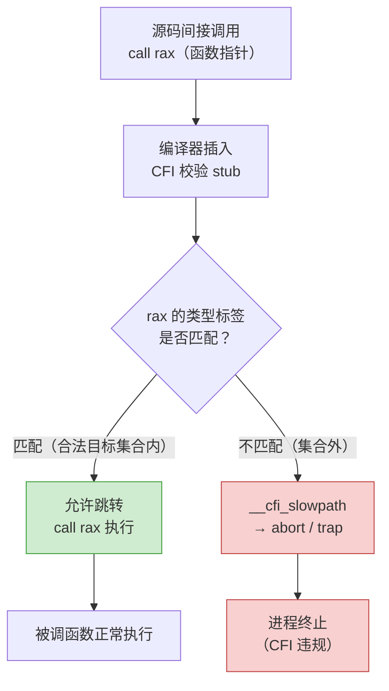

# 现代二进制防护机制（8）· CFI控制流完整性

## 概述与定位

> [!abstract] TL;DR
> CFI（Control-Flow Integrity，控制流完整性）是一类软件/硬件机制，其核心目标只有一句话：**间接调用/跳转/返回只能到达"事先计算好的合法目标集合"，偏出集合即终止程序**。CFI 直接挡住控制流劫持的"最后一跳"——即使攻击者已经能写任意内存，只要目标地址不在合法集合中，跳转就会被截住。本篇聚焦**前向 CFI**（forward-edge CFI：约束间接 call/jmp）；后向 CFI（保护 `ret`/返回地址）由 Shadow Stack 承担，硬件层面由 Intel CET 实现，详见 [[09.Intel CET]]。

CFI 挡住的核心攻击链是：

| 攻击手法 | 利用的"最后一跳" | CFI 的应对 |
|---|---|---|
| ROP（[[33.二进制漏洞与利用基础/06.ROP入门.md]]） | 篡改返回地址后跳 gadget（`ret`） | 后向 CFI / Shadow Stack；前向 CFI 限 JOP/COP |
| JOP/COP | 间接 jmp/call 串联 gadget | **前向 CFI** 约束间接跳转落点 |
| vtable 劫持（[[33.二进制漏洞与利用基础/11.整数溢出与类型混淆.md]]） | 替换 `__vptr` 后的虚函数 call | `-fsanitize=cfi-vcall` 校验虚调用类型合法性 |
| GOT 改写（[[11.ELF文件详解/17.got节.md]]） | 篡改 `.got.plt` 函数指针后的间接调用 | `-fsanitize=cfi-icall` 校验间接 call 目标；Full RELRO 封写路径 |

本篇与以下篇章紧密关联：
- [[33.二进制漏洞与利用基础/06.ROP入门.md]]：ROP/JOP 攻击原理——CFI 挡的正是这些"最后一跳"
- [[33.二进制漏洞与利用基础/11.整数溢出与类型混淆.md]]：vtable 混淆攻击——`cfi-vcall` 的直接防御对象
- [[07.Fortify Source]]：同为编译期插入运行时检查，两者互补（Fortify 守数据边界，CFI 守控制流边界）
- [[09.Intel CET]]：CFI 的硬件加速——IBT 实现粗粒度前向 CFI，Shadow Stack 实现后向 CFI

---

## 原理与机制

### 什么是"合法目标集合"

程序在编译期可以静态分析出：**哪些地址可能是合法的间接跳转落点**。对间接调用（`call rax`）而言，合法落点就是"函数入口"。但不是任意函数入口——CFI 的粒度取决于实现：

- **粗粒度 CFI**：合法集合 = 程序内所有函数入口（跳到任何函数都合法）。绕过门槛很低，在同类型函数集合内仍可被滥用。
- **细粒度 CFI**（Clang CFI 的做法）：合法集合按**函数类型签名（类型桶，type-based grouping）**划分——`call rax` 的目标必须是与调用点函数指针类型相兼容的函数入口。攻击者必须在兼容签名的函数中找可用 gadget，大幅缩小攻击面。

### 前向 CFI 的工作流程

```
编译期：
  分析间接 call/jmp 目标类型 →
  对每类函数签名建立"合法目标集合" →
  在每个间接 call/jmp 前插入校验 stub

运行期（每次间接调用）：
  1. 计算目标地址 rax
  2. 查合法目标集合（编译器内嵌的类型标签或 jump table）
  3. 目标在集合内 → 允许跳转
  4. 目标不在集合内 → 调用 __cfi_slowpath / abort / trap
```



### Clang CFI 的类型分桶机制

Clang CFI（`-fsanitize=cfi`）使用**基于类型的分桶（type-based bucketing）**来高效实现细粒度校验：

1. **编译时**：为每个函数签名（参数类型 + 返回类型）计算哈希，生成"类型 ID"。
2. **函数入口**：在函数体前插入一个对齐的**类型标签（type label）**——通常是一个与函数紧邻的、按固定粒度对齐的全局常量，使"目标地址 & mask"能定位到对应的 bitmap。
3. **调用点校验**：call 前检查 `target_addr` 是否命中当前调用点类型 ID 对应的 bitmap，未命中即触发违规。

这要求：
- **LTO（Link-Time Optimization）**：`-flto`。类型分析需要跨编译单元可见，LTO 合并 IR 后 Clang 才能看到整个程序的所有目标函数，才能正确建 bitmap。没有 LTO，CFI 无法工作。
- **`-fvisibility=hidden`**：将默认符号可见性设为隐藏，避免外部模块的同名函数干扰类型桶。未设置时，Clang CFI 会因无法枚举跨 DSO 的目标而退化或报错。

---

## 实现细节

### `cfi-icall`：间接函数调用校验

`-fsanitize=cfi-icall` 是最常用的 CFI 子类型，保护**所有通过函数指针的间接调用**。

```c
// 示例：函数指针调用
typedef int (*handler_t)(int, int);

int dispatch(handler_t fn, int a, int b) {
    return fn(a, b);   // ← 间接 call，cfi-icall 在此插入校验
}
```

编译后（概念性伪代码，非实际汇编）：

```
; cfi-icall 插入的校验（概念示意，非实际生成代码）
  ; 取目标地址
  mov  rax, [fn]
  ; 校验：目标是否在 int(int,int) 类型桶的合法集合中
  lea  rcx, [__cfi_check_table_int_int_int]
  call __cfi_check(rax, rcx)     ; 违规则 abort
  ; 校验通过后正常调用
  call rax
```

### `cfi-vcall`：虚函数调用校验

`-fsanitize=cfi-vcall` 专门保护 C++ 虚函数调用，即通过 `__vptr` 取 vtable 后的间接调用。

这与 [[33.二进制漏洞与利用基础/11.整数溢出与类型混淆.md]] 中的**虚表混淆**攻击直接对应：攻击者通过类型混淆或 UAF 替换 `__vptr`，让虚函数调用跳向伪造的 vtable 槽位。`cfi-vcall` 在每次虚调用前校验"该对象的动态类型是否与调用点的静态期望类型兼容"：

```cpp
// C++ 虚函数调用
class Base { virtual void f(); };
class Derived : public Base { void f() override; };

Base *obj = get_object();
obj->f();   // ← cfi-vcall 在此插入类型合法性校验
```

校验逻辑（概念）：
1. 读取 `obj->__vptr`（vtable 指针）。
2. 检查 `__vptr` 是否指向 `Base` 类层次结构内某个合法 vtable 的已知槽位。
3. 不合法（如指向伪造 vtable）→ abort。

### `cfi-nvcall`、`cfi-derived-cast`、`cfi-unrelated-cast`

Clang CFI 提供多个子类型，可以按需组合：

| 子类型 | 保护对象 |
|---|---|
| `cfi-icall` | 通过函数指针的间接调用 |
| `cfi-vcall` | C++ 虚函数调用（通过 vtable） |
| `cfi-nvcall` | C++ 非虚成员函数通过指针调用 |
| `cfi-derived-cast` | `static_cast` 向下转型的合法性（呼应类型混淆） |
| `cfi-unrelated-cast` | 不相关类型间的 `reinterpret_cast` |

`-fsanitize=cfi` 是以上所有子类型的集合开关。

### Linux 内核 CFI（KCFI）

Linux 内核从 6.1 版本起支持 **KCFI（Kernel Control-Flow Integrity）**，以 Clang 编译内核时可启用 `CONFIG_CFI_CLANG=y`。

内核 CFI 的特殊性在于：
- 内核无法使用用户态 Clang CFI 的 LTO 全程序链接（体积与工具链约束），改用**基于类型哈希的轻量标签方案**：每个函数入口前嵌入 4 字节类型哈希，间接调用前检查目标地址 `-4` 偏移处的哈希是否匹配调用点的期望哈希。
- 不依赖 LTO，但仍需 Clang 编译器，GCC 内核不支持。
- 粒度比用户态 Clang CFI 粗（单个哈希值可能碰撞），但相比没有 CFI 仍大幅缩小了合法目标集合。

```
KCFI 函数入口布局（概念）：
  [函数地址 - 4]  : uint32_t type_hash   ← 嵌入类型标签
  [函数地址 + 0]  : 第一条正常指令
```

```
KCFI 调用点校验（概念）：
  ; rax = 目标函数地址
  cmp  [rax - 4], expected_hash   ; 比较类型哈希
  jne  __kcfi_fail                ; 不匹配 → 内核 panic
  call rax
```

---

## 三平台对照

| 维度 | Linux（Clang CFI / KCFI） | Windows（CFG / XFG） | macOS / iOS（PAC + 编译器 CFI） |
|---|---|---|---|
| 主要机制 | `-fsanitize=cfi`（软件，Clang） | Control Flow Guard（CFG）`/guard:cf`；XFG（扩展 CFG） | 编译器 CFI（类似 Clang）+ ARM64 PAC |
| 粒度 | 细粒度（按函数类型签名分桶） | 粗粒度（合法集合 = 所有函数入口）；XFG 细化 | 中细粒度（按 ABI 函数类型） |
| 依赖 | LTO + `-fvisibility=hidden` | MSVC `/guard:cf` 链接；运行时 `ntdll` 校验 | Xcode + arm64e 硬件 PAC |
| 硬件加速 | 无（软件检查）；可配合 CET IBT（→ [[09.Intel CET]]） | 无（软件检查）；XFG 更精细但仍软件 | ARM PAuth（PAC）：硬件签名指针，天然前向保护 |
| 内核 CFI | KCFI（`CONFIG_CFI_CLANG`，Linux 6.1+） | 内核有 KPP（Kernel Patch Protection）等独立机制 | XNU 内核有 KTRR + PAC |
| 默认状态 | 不默认；需显式开启 | Windows 8.1+；Visual Studio 默认对新工程开启 | arm64e 系统二进制默认开启 PAC |

### Windows CFG（Control Flow Guard）

CFG 是微软在 Windows 8.1 / MSVC 2015 引入的粗粒度前向 CFI，通过 `/guard:cf` 启用，详见 [[10.Windows防护体系]]。核心思路：链接器收集所有合法的间接调用目标，生成一张位图（CFG Bitmap）写入 PE 映像；运行期每次间接 call 前，`ntdll` 注入的 `_guard_check_icall` 函数查位图，不在其中即终止进程。

CFG 的主要局限是粒度粗（合法集合 = 所有被取过地址的函数入口），XFG（eXtended Control Flow Guard）通过函数类型哈希进一步细化，但截至 2026 年仍未全面推广。

### macOS / iOS PAC

Apple Silicon（arm64e）利用 ARMv8.3-A 指针认证（PAC, Pointer Authentication Code）在硬件层面实现指针签名：存储函数指针时用密钥签名，调用前验签，不匹配则产生无效地址导致异常。PAC 既保护前向（函数指针）也保护后向（返回地址），是目前商用硬件中最强的 CFI 加速机制之一。用户无需额外编译选项，arm64e 系统二进制默认启用。

---

## 绕过边界与残余风险

> [!warning] CFI 不是银弹——粗粒度 CFI 仍有大量可滥用空间
> CFI 提高了控制流劫持的门槛，但有明确的残余风险：

### 1. 粗粒度 CFI 内的 COOP / 同类型函数滥用

即使 CFI 合法目标集合不为空，攻击者仍可在**集合内**寻找语义上可被滥用的函数。这类攻击称为 **COOP（Counterfeit Object-Oriented Programming）**——构造伪造对象，让 C++ 虚调用跳向合法但语义危险的虚函数，组合出攻击序列。CFI 约束了"去哪"但无法约束"做什么"，集合内的危险函数（如写内存、执行命令的合法代码）仍可被滥用。

### 2. 前向 CFI 不保护 `ret`（后向边）

CFI-icall/vcall 约束的是间接 call/jmp，**不保护 `ret` 指令的返回地址**。传统 ROP 链（通过栈溢出篡改返回地址后靠 `ret` 串联 gadget，见 [[33.二进制漏洞与利用基础/06.ROP入门.md]]）在没有后向 CFI 的情况下仍然有效。后向 CFI 需要 **Shadow Stack**（软件实现：SafeStack；硬件实现：Intel CET SHSTK，见 [[09.Intel CET]]）。

```
前向 CFI 保护范围：
  ✅  call  rax       （间接 call → cfi-icall 校验）
  ✅  jmp   rax       （间接 jmp → 部分 CFI 实现覆盖）
  ✅  call  [vtable]  （虚函数 → cfi-vcall 校验）
  ❌  ret             （返回指令 → 需要 Shadow Stack）
```

### 3. LTO 与 DSO 边界的覆盖盲区

Clang CFI 需要 LTO 才能跨编译单元建立完整的类型桶。若程序加载了**未用 Clang CFI 编译的第三方 DSO**（如系统库、闭源组件），CFI 在跨越 DSO 边界的调用上会退化（`-fsanitize=cfi-icall` 遇到跨 DSO 的函数指针调用默认退化为不校验，或需要 `-fsanitize-cfi-cross-dso` 模式并要求对方库也参与 CFI 编译）。

### 4. 信息泄露配合绕过

CFI 不阻止读内存——攻击者可通过信息泄露获取 CFI bitmap 的布局、合法目标集合的成员列表，再针对性选择集合内的"危险函数"。CFI 与 ASLR（[[14.动态链接与加载器详解/09.ASLR与位置无关代码.md]]）配合才能提高泄露的利用难度。

### 5. JIT 编译器的特殊挑战

JIT 引擎（浏览器 V8、JavaScriptCore 等）动态生成代码，CFI 的静态分析在 JIT 区域失效。现代 JIT 引擎有专属缓解（W^X JIT 内存、CFI 感知的 JIT stub 设计），但这属于更高级的话题。

---

## 如何开启与验证

### 编译选项

```bash
# 最小 CFI（所有子类型 + LTO + hidden visibility）
clang -flto -fvisibility=hidden \
      -fsanitize=cfi \
      -o target source.c

# 仅保护间接函数调用（最常用入门选项）
clang -flto -fvisibility=hidden \
      -fsanitize=cfi-icall \
      -o target source.c

# 仅保护 C++ 虚函数调用（对抗 vtable 混淆）
clang++ -flto -fvisibility=hidden \
        -fsanitize=cfi-vcall \
        -o target source.cpp

# 生产加固：CFI + 其他防护叠加
clang -flto -fvisibility=hidden \
      -fsanitize=cfi \
      -fstack-protector-strong \
      -D_FORTIFY_SOURCE=2 \
      -Wl,-z,relro,-z,now \
      -fpie -pie \
      -o target source.c

# 内核 CFI（Kconfig，非命令行选项）
# make LLVM=1 menuconfig → 开启 CONFIG_CFI_CLANG
```

> [!warning] `-flto` 与 `-fvisibility=hidden` 均为 Clang CFI 的**必要条件**，缺少任一会导致 CFI 编译失败或静默退化，不能省略。

### `checksec` 验证

`checksec` 工具目前对 Clang 软件 CFI 的识别依赖 ELF 属性或节名，覆盖不完整；更可靠的验证方式是直接检查二进制是否含 CFI 相关符号：

```bash
# 检查是否含 CFI 运行时符号（有输出说明 cfi-icall 或 cfi-vcall 已插入）
nm target | grep -E '__cfi_|__ubsan_handle_cfi'

# 检查是否含 __cfi_slowpath（CFI 违规慢路径处理函数）
nm target | grep __cfi_slowpath
```

```text
# 典型输出（开启 cfi-icall 后）：
0000000000401234 T __cfi_check
0000000000401280 T __cfi_slowpath
```

> [!warning] 示例输出为示意
> 实际地址随编译结果而变；nm 输出格式因平台和工具链版本不同略有差异。

### `readelf` 检查 GNU_PROPERTY（CET/IBT 联动）

若同时开启 CET IBT（`-fcf-protection=full`），readelf 可看到硬件 CFI 标记：

```bash
readelf -n target | grep -A3 "PROPERTY"
```

```text
Properties: x86 feature: IBT, SHSTK
```

> [!warning] 示例输出为示意
> IBT 表示硬件前向 CFI（CET），SHSTK 表示 Shadow Stack（后向 CFI）。两者与 Clang 软件 CFI 互补：Clang CFI 精度高（类型桶），CET IBT 粒度粗但零软件开销。

### 运行期验证：触发 CFI 违规

```c
// cfi_test.c — 验证 CFI 是否拦截非法间接调用
// 编译：clang -flto -fvisibility=hidden -fsanitize=cfi-icall -o cfi_test cfi_test.c
#include <stdio.h>

typedef int (*fn_t)(int);

int legit(int x) { return x + 1; }
int other(int x, int y) { return x + y; }  // 签名不匹配 fn_t

int main(void) {
    fn_t fp = (fn_t)(void *)other;  // 强转：类型不匹配
    printf("result: %d\n", fp(42)); // cfi-icall 应在此处触发 abort
    return 0;
}
```

```text
# 预期运行输出（CFI 开启）：
Illegal instruction (core dumped)
# 或：
runtime error: control flow integrity check for type 'int (int)' failed during indirect function call
```

> [!warning] 示例输出为示意
> CFI 违规的具体信号（SIGILL / SIGTRAP / SIGABRT）取决于 `-fsanitize-trap=cfi` 或 `-fsanitize-recover=cfi` 等细粒度选项；默认为 SIGILL（trap）。

### CFI + Fortify Source 组合加固

[[07.Fortify Source]] 保护数据操作边界（`memcpy`/`strcpy` 等函数的长度溢出），CFI 保护控制流边界，两者互补：

```bash
# 生产加固完整命令示例
clang -flto -fvisibility=hidden \
      -fsanitize=cfi \
      -D_FORTIFY_SOURCE=3 \
      -O2 \
      -fstack-protector-strong \
      -Wl,-z,relro,-z,now \
      -fpie -pie \
      -o hardened_target source.c
```

---

## 小结

1. **CFI 的核心约束**：间接 call/jmp 的目标必须在编译期确定的"合法目标集合"内，偏出集合即终止程序。集合越细（类型签名桶），攻击者在集合内找可用 gadget 的空间越小。

2. **Clang CFI 的三个必要条件**：`-fsanitize=cfi`（或子类型）+ `-flto`（LTO）+ `-fvisibility=hidden`。缺少 LTO，跨单元类型分析不完整；缺少 hidden visibility，外部符号污染类型桶。

3. **`cfi-vcall` 对抗类型混淆**：C++ 虚表混淆（[[33.二进制漏洞与利用基础/11.整数溢出与类型混淆.md]]）的利用收口是虚函数调用跳向伪造 vtable；`cfi-vcall` 在每次虚调用前校验对象动态类型的合法性，直接截断这条利用路径。

4. **前向 CFI 不护 `ret`**：CFI-icall/vcall 约束间接 call/jmp，`ret` 指令的返回地址保护需要 Shadow Stack；硬件层面由 Intel CET（[[09.Intel CET]]）提供 IBT（前向）+ SHSTK（后向）的完整覆盖。

5. **粗粒度 CFI 的局限**：CFG（Windows）等粗粒度实现将合法目标集合定为"所有函数入口"，集合仍很大，COOP 等攻击可在集合内找到语义危险的函数组合。Clang CFI 的细粒度类型桶显著缩小集合，但无法降到"每个调用点唯一目标"的理论最优。

6. **三平台分工**：Linux 靠 Clang CFI（软件细粒度）+ KCFI（内核）；Windows 靠 CFG/XFG（系统集成，粒度渐进细化，见 [[10.Windows防护体系]]）；macOS arm64 靠 PAC 硬件签名。它们的目标一致，实现路径不同。

---

## 相关阅读

- **ROP/JOP 攻击原理（CFI 的防御对象）**：[[33.二进制漏洞与利用基础/06.ROP入门.md]]
- **vtable 混淆（cfi-vcall 的防御对象）**：[[33.二进制漏洞与利用基础/11.整数溢出与类型混淆.md]]
- **GOT 改写防御（与 CFI 配合）**：[[11.ELF文件详解/17.got节.md]]
- **Fortify Source（编译期数据边界保护，与 CFI 互补）**：[[07.Fortify Source]]
- **Intel CET（CFI 硬件加速 + Shadow Stack 后向保护）**：[[09.Intel CET]]
- **ASLR/PIE（与 CFI 配合提高信息泄露利用难度）**：[[14.动态链接与加载器详解/09.ASLR与位置无关代码.md]]
- **Windows CFG/XFG 详解**：[[10.Windows防护体系]]
- **防护机制全景与协同**：[[00.现代二进制防护机制总览]]

---

⬅️ 上一篇 [[07.Fortify Source]] ｜ 🏠 [[00.现代二进制防护机制总览]] ｜ 下一篇 [[09.Intel CET]] ➡️
