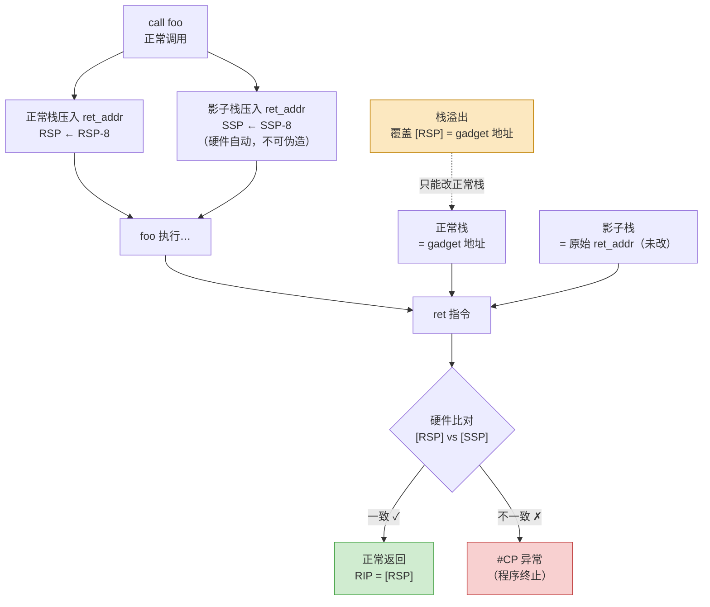

# 现代二进制防护机制（9）· Intel CET

> [!abstract] TL;DR
> - **Intel CET（Control-flow Enforcement Technology）** 是 Intel 在 Tiger Lake / Ice Lake 起引入的硬件级控制流保护，分两部分：**Shadow Stack**（后向 CFI，保护 `ret`）和 **IBT（Indirect Branch Tracking）**（前向 CFI，约束间接跳转落点）。
> - **Shadow Stack**：CPU 维护独立影子栈，`call` 同时压返回地址，`ret` 时硬件比对正常栈与影子栈——不一致触发 `#CP` 异常，ROP 链被截断（呼应 [[33.二进制漏洞与利用基础/06.ROP入门.md]]）。
> - **IBT**：所有间接 `call`/`jmp` 的落点首指令必须是 `endbr64`（x86-64）或 `endbr32`（x86-32），否则触发异常，封堵 JOP/COP；这就是现代 ELF 出现 `.plt.sec` 节的根本原因（详见 [[14.动态链接与加载器详解/08.PLT与GOT与延迟绑定.md]]）。
> - **局限**：IBT 是粗粒度（任何 `endbr64` 都是合法落点），单独使用仍有 JOP gadget 空间，须配合软件 CFI（[[08.CFI控制流完整性]]）收窄。
> - **ARM 对应**：BTI（前向）+ PAC（后向指针认证）构成 arm64e 的等价机制。

---

## 概述与定位

ROP（Return-Oriented Programming）和 JOP（Jump-Oriented Programming）的共同基础是：攻击者能把普通内存中的小段合法指令（gadget）串联成任意语义，NX/DEP 对此无效，因为 gadget 本身位于可执行代码段。缓解这类攻击需要从根本上约束控制流转移：

| 方向 | 攻击手法 | 对应机制 |
|---|---|---|
| **后向**（`ret` 返回） | ROP、ret 劫持 | Shadow Stack（SHSTK）|
| **前向**（间接 `call`/`jmp`） | JOP、COP | IBT（Indirect Branch Tracking）|

CET 两部分互补，构成完整的硬件 CFI 层。本篇是 [[08.CFI控制流完整性]] 在硬件实现层的延续，重点是 CPU/OS/编译器如何协同落地。

---

## 原理与机制

### Shadow Stack（后向 CFI）

#### 独立影子栈的设计

Shadow Stack 是一块受硬件保护的专用内存区域，由 CPU 用专用寄存器 `SSP`（Shadow Stack Pointer）追踪栈顶。正常栈由 `RSP` 管理，影子栈由 `SSP` 管理，两者**物理隔离**。

影子栈所在内存页的 PTE（Page Table Entry）有专门的"影子栈"标记位（bit 10 of EPT PTE / Supervisor Shadow Stack bit）。该页对普通的 `mov [addr], val` 写指令不可写，唯一合法的写指令是 CPU 内部在执行 `call` 时自动完成的压栈，以及 `WRSS`/`WRUSS` 这两条专用写指令（后者仅在受保护的内核/用户切换场景使用）。

#### call 与 ret 的行为变化

开启 Shadow Stack 后，`call`/`ret` 的语义扩展如下：

**`call target`（开启 SHSTK 后）：**
```
正常行为：RSP -= 8;  [RSP] = 返回地址
新增行为：SSP -= 8;  [SSP] = 返回地址   （硬件自动，无法被代码绕过）
```

**`ret`（开启 SHSTK 后）：**
```
正常行为：RIP = [RSP];  RSP += 8
新增比对：tmp = [SSP];  SSP += 8
          if (RIP ≠ tmp)  → #CP 异常（Control-Protection Exception）
          else            → 继续执行
```

`#CP`（vector 21）是 CET 专属的新异常向量，操作系统处理后通常终止进程。

#### 为什么 ROP 链被截断

ROP 通过栈溢出把正常栈上的返回地址覆盖成 gadget 地址。开启 Shadow Stack 后：

- 正常栈（`RSP` 所指）的返回地址已被攻击者覆盖成 gadget 地址。
- 影子栈（`SSP` 所指）保留原始返回地址，普通写指令无法触及。
- `ret` 执行时硬件比对：正常栈 ≠ 影子栈 → `#CP` → 进程终止。



#### WRSS / WRUSS 的合法写路径

内核和运行时在以下场景需要**有限地**向影子栈写入，为此提供了两条受限指令：

| 指令 | 全称 | 使用场景 |
|---|---|---|
| `WRSS` | Write to Shadow Stack | 用户态，仅可写用户态影子栈（需 `CR4.CET=1` 且页标记允许） |
| `WRUSS` | Write to User Shadow Stack | 内核态，可写用户态影子栈（用于信号帧/上下文切换恢复时修补影子栈） |

正常用户代码从不直接调用这两条指令，它们存在是为了让 glibc 的 `setjmp`/`longjmp`、信号处理、线程栈切换等**受控路径**能合法地调整影子栈，而不是留给攻击者的后门。

---

### IBT（Indirect Branch Tracking，前向 CFI）

#### endbr64 / endbr32 的工作原理

IBT 引入了一个 CPU 内部状态位 `TRACKER`，初始为 `IDLE`。每当 CPU 执行一条**间接 call 或 jmp**（`call rax`、`jmp [mem]`、`call [mem]` 等），`TRACKER` 切换到 `WAIT_FOR_ENDBRANCH` 状态。此后：

- 若下一条指令是 `ENDBR64`（编码 `F3 0F 1E FA`）或 `ENDBR32`（`F3 0F 1E FB`）：合法，`TRACKER` 回到 `IDLE`，继续执行。
- 若下一条指令是**任何其他指令**（包括普通 `nop`、`xor eax, eax`……）：非法跳转，触发 `#CP` 异常。

直接 `call`/`jmp`（目标地址编码在指令里）**不改变** `TRACKER`，只有间接转移才触发校验。因此：

- 正常直接调用函数：不受影响。
- `call rax`（间接调用）：目标首指令必须是 `endbr64`。

#### .plt.sec 与 endbr64 的关系

[[14.动态链接与加载器详解/08.PLT与GOT与延迟绑定.md]] 详述了 `.plt.sec`（Secure PLT）节的由来：开启 IBT 后，调用方执行 `call puts@plt` 时走的是间接调用路径，落点 stub 首指令必须是 `endbr64`；同时为防止攻击者把 `.plt` 的"慢路径 push/jmp"片段当作合法间接跳转落点，链接器把快路径（`endbr64 + jmp *GOT`）独立放进 `.plt.sec`，慢路径仍在 `.plt` 但其 `endbr64` 受到 IBT 保护：

```
.plt.sec（调用方真正 call 的目标，满足 IBT）：
  endbr64                      ; IBT 合法落点
  bnd jmp QWORD PTR [rip+...]  ; 读 .got.plt 槽位

.plt（慢路径，首次解析用）：
  endbr64                      ; 扑空回退落点也合法
  push $reloc_index
  bnd jmp PLT0
```

没有 `.plt.sec` 时（无 IBT），`.plt` 里普通 `jmp * GOT` 前并无 `endbr64`，开了 IBT 后间接 call 落在无 `endbr64` 的入口会立即 `#CP`，因此现代工具链默认产生 `.plt.sec`。

#### IBT 对 JOP/COP 的威慑

JOP gadget 依赖间接跳转（`jmp [reg]`）串联。开了 IBT 后，每个间接跳转落点必须有 `endbr64`，而绝大多数随机位置并无此指令——合法的 `endbr64` 只出现在函数入口和编译器明确标注的间接调用合法目标。这把 JOP 可用的 gadget 集合从"所有以间接 jmp 对齐的字节序列"大幅压缩为"所有 endbr64 之后的序列"。

---

## 实现细节

### 编译器层（GCC / Clang）

```bash
# 开启完整 CET 支持（IBT + Shadow Stack）
gcc -fcf-protection=full   source.c -o binary

# 仅 IBT
gcc -fcf-protection=branch source.c -o binary

# 仅 Shadow Stack
gcc -fcf-protection=return source.c -o binary

# 关闭（不推荐用于生产）
gcc -fcf-protection=none   source.c -o binary
```

`-fcf-protection=full` 做了以下事情：
1. 在每个函数入口插入 `endbr64`（满足 IBT 对合法间接调用落点的要求）。
2. 在 `.note.gnu.property` 中写入 GNU 属性 `GNU_PROPERTY_X86_FEATURE_1_IBT` 和 `GNU_PROPERTY_X86_FEATURE_1_SHSTK`，告知内核/ld.so 该二进制支持 CET。
3. 链接器生成 `.plt.sec` 替代传统 `.plt` 作为调用入口。

### 链接器层

链接期 `-z ibt`、`-z shstk`（或由 `-fcf-protection=full` 隐含传递）让 GNU ld 在最终 ELF 中：
- 将 PLT 调用入口放在 `.plt.sec`（含 `endbr64`）而非仅 `.plt`。
- 合并各目标文件的 GNU property 节，确保整个可执行文件的 IBT/SHSTK 标记一致（任何一个目标不支持，整体标记去掉）。

### 操作系统层（Linux）

内核 6.6 起完整支持 CET（`CONFIG_X86_CET`/`CONFIG_X86_USER_SHADOW_STACK`）：

- 检查进程的 PT_GNU_PROPERTY（`.note.gnu.property`）段，若含 SHSTK 标记则为该进程分配影子栈并设 `CR4.CET=1`（用户模式）。
- 信号帧中保存/恢复 `SSP`，`WRUSS` 修补影子栈以匹配信号返回地址。
- glibc 2.39+ 对 `setjmp`/`longjmp` / `swapcontext` 做了 Shadow Stack 感知适配（用 `WRSS` 调整 `SSP`）。

#### glibc 2.39+ 对 `setjmp`/`longjmp`/`swapcontext` 的 Shadow Stack 感知适配

**问题根源：非本地跳转破坏影子栈一致性**

Shadow Stack 的核心不变式是：**`SSP` 指向的影子栈内容，与正常调用栈上 `RSP` 对应的返回地址序列完全一致**。每一次 `call` 同时压两个栈，每一次 `ret` 同时弹两个栈，两者始终保持镜像关系。

`setjmp`/`longjmp` 是 C 标准库提供的"非本地跳转"原语：`setjmp` 在调用点保存当前执行上下文（`jmp_buf`：寄存器状态、`RSP`、`RIP` 等），`longjmp` 从任意深度的嵌套调用中直接跳回 `setjmp` 保存的上下文，**跳过中间所有函数的正常 `ret` 序列**。这破坏了 Shadow Stack 的一致性：

```
正常栈（RSP 视角）：       影子栈（SSP 视角）：
  func_a → func_b →           func_a → func_b →
  func_c → longjmp()          func_c（未弹出！）
  ↓ longjmp 直接把 RSP 回退到 func_a 的位置
  RSP 对齐到 func_a 的帧     SSP 仍指向 func_c 的影子栈帧
                              ← 两者不一致！
  下一次 ret（在 func_a 内）：
  [RSP] = func_a 的正常返回地址
  [SSP] = func_c 的影子栈返回地址（stale）
  → #CP 异常（误报！）
```

`swapcontext`（POSIX 协程原语，在不同上下文间切换）面临同样的问题——切换到另一个上下文时，`SSP` 不跟随 `RSP` 切换，导致后续 `ret` 校验失败。

**glibc 的 Shadow Stack 感知适配原理**

glibc 2.39 中对这三个函数的实现（`x86_64/setjmp.S`、`x86_64/longjmp.S`、`ucontext/swapcontext.S`）做了 Shadow Stack 感知扩展：

1. **`setjmp`**：在保存正常寄存器上下文的同时，额外调用 `RDSSP`（Read Shadow Stack Pointer）读取当前 `SSP`，把 `SSP` 值也存入 `jmp_buf`（glibc 在 `jmp_buf` 结构末尾扩展了一个 `__shadow_stack_pointer` 字段）。

2. **`longjmp`**：在恢复正常寄存器上下文之前，比较当前 `SSP` 与 `jmp_buf` 中保存的 `SSP`，计算需要前进多少步来匹配目标帧，然后调用 `INCSSP`（Increment Shadow Stack Pointer）把 `SSP` 向前移动对应的步数，使影子栈弹出中间帧，与正常栈恢复后的状态对齐：

```asm
; longjmp 中的 Shadow Stack 调整（概念，非实际 glibc 汇编）
RDSSP  rax                    ; rax = 当前 SSP
mov    rdx, [jmp_buf + SS_OFF] ; rdx = setjmp 时保存的目标 SSP
sub    rdx, rax                ; rdx = 需要前进的字节数（正方向）
shr    rdx, 3                  ; 转换为 8 字节槽数
; INCSSP 每次最多前进 255 个槽，超出需要循环
.loop:
  cmp   rdx, 255
  jbe   .done
  INCSSP 255
  sub   rdx, 255
  jmp   .loop
.done:
  INCSSP rdx                   ; 最终前进剩余步数
; 此后正常栈与影子栈重新对齐，ret 校验不再误报
```

3. **`swapcontext`**：在切换上下文时，`makecontext`/`swapcontext` 为新上下文分配一个新的影子栈区域（通过 `mmap` + shadow stack 页标记），`swapcontext` 保存并恢复 `SSP`，确保每个协程上下文有自己独立的影子栈段。切换时 `SSP` 与 `RSP` 同步切换，两者始终对应同一上下文的调用链。

**`INCSSP` 指令的约束与安全设计**

`INCSSP` 不是普通的加法指令，它有以下受控约束：

- **只能前进，不能后退**：`INCSSP` 的操作数是前进步数（正方向，向低地址），不存在"后退 SSP"的指令（减小 SSP 指向更深的位置），防止攻击者把 SSP 退回到旧帧欺骗 `ret`。
- **单次最多 255 步**：需要前进超过 255 个槽时必须多次调用，防止用单条指令大幅跳跃影子栈制造利用原语。
- **不直接写影子栈内容**：`INCSSP` 只移动指针，不修改影子栈上的值；实际修改影子栈内容需要 `WRSS`（用户态）或 `WRUSS`（内核态），且只能写 `SSP` 当前指向的槽位，不能随机写任意偏移。

**`jmp_buf` 的安全考量**

glibc 在实现中对 `jmp_buf` 里保存的 `__shadow_stack_pointer` 做了 pointer mangling（与进程随机密钥 XOR 异或混淆），与 `RSP`/`RIP` 字段的保护方式相同。这防止攻击者直接覆盖 `jmp_buf` 中的 `SSP` 字段来控制 `longjmp` 后的影子栈位置。

**版本与兼容性确认**

```bash
# 确认 glibc 版本（需 >= 2.39 才有 Shadow Stack 感知的 setjmp/longjmp）
ldd --version | head -1
# GNU C Library (GNU libc) stable release version 2.39

# 检查 glibc 的 setjmp 是否含 INCSSP（有输出说明已适配）
objdump -d /lib/x86_64-linux-gnu/libc.so.6 | grep -A2 incssp
# 期望看到 INCSSP 指令在 _longjmp / siglongjmp 的反汇编中出现
```

若系统 glibc 低于 2.39，而程序使用了 `setjmp`/`longjmp`，在开启 Shadow Stack 的进程中会在 `longjmp` 目标处的第一次 `ret` 触发 `#CP`（内核终止进程），表现为**程序启动正常但在第一次长跳转后立即崩溃**。

### CPU 层

需要支持 CET 的 CPU 微架构：
- Intel：Ice Lake（2019，部分 SKU）、Tiger Lake（2020）及以后。
- AMD：Zen 4（Ryzen 7000 / EPYC Genoa，2022）起支持 IBT 和 Shadow Stack。
- 通过 `CPUID.(EAX=7,ECX=0):ECX[bit 7]`（CET_SS）和 `CPUID.(EAX=7,ECX=0):EDX[bit 20]`（CET_IBT）检测支持情况。

#### AMD Zen 4 的 CET 支持与 CPUID 检测方法

**AMD Zen 4 的 CET 支持背景**

AMD 在 Zen 4 微架构（2022 年发布，Ryzen 7000 系列及 EPYC Genoa）中正式引入了与 Intel CET 兼容的 Shadow Stack 和 IBT 支持。AMD 的实现遵循 x86 架构规范（Intel SDM Vol. 1 Chapter 18 / Vol. 3 Chapter 18），与 Intel 实现在 ISA 语义上完全兼容——相同的 `endbr64` 指令、相同的 `#CP` 异常向量 21、相同的 `WRSS`/`WRUSS` 写指令、相同的 `SSP` 寄存器。

这意味着同一个以 `-fcf-protection=full` 编译的 ELF 二进制，在 Intel Tiger Lake 和 AMD Zen 4 上的行为完全相同，无需区分 CPU 品牌。

**CPUID 检测方法**

检测 CET 支持需查询 `CPUID` 的两个叶片位：

| 特性 | CPUID 叶片 | 寄存器 | 位 | 含义 |
|---|---|---|---|---|
| CET Shadow Stack（SHSTK）用户模式 | `EAX=7, ECX=0` 的输出 ECX | ECX | bit 7 | 支持用户态 Shadow Stack（`CR4.CET`、`SSP` 等）|
| CET IBT（间接分支跟踪） | `EAX=7, ECX=0` 的输出 EDX | EDX | bit 20 | 支持 IBT（`TRACKER` 状态机、`endbr64` 校验）|

用 C 代码检测（Linux / Windows 通用逻辑）：

```c
#include <cpuid.h>   // GCC/Clang；MSVC 用 <intrin.h> 中的 __cpuid()

static int cpu_supports_cet_ss(void) {
    unsigned int eax, ebx, ecx, edx;
    /* 查询 leaf 7, sub-leaf 0 */
    __cpuid_count(7, 0, eax, ebx, ecx, edx);
    return (ecx >> 7) & 1;   /* ECX bit 7 = CET_SS */
}

static int cpu_supports_cet_ibt(void) {
    unsigned int eax, ebx, ecx, edx;
    __cpuid_count(7, 0, eax, ebx, ecx, edx);
    return (edx >> 20) & 1;  /* EDX bit 20 = CET_IBT */
}
```

Linux 下也可直接读 `/proc/cpuinfo` 中的 feature flags：

```bash
# 检测 Shadow Stack 支持
grep -m1 "shstk" /proc/cpuinfo

# 检测 IBT 支持
grep -m1 " ibt" /proc/cpuinfo
```

典型输出（AMD Zen 4 / Intel Tiger Lake 均有）：

```text
flags   : ... shstk ibt ...
```

**在内核和运行时层的额外检查**

仅 CPU 支持 CET 不等于 CET 实际生效，还需内核和运行时开启：

```bash
# 检查内核是否编译了 CET 支持（Linux）
grep CONFIG_X86_USER_SHADOW_STACK /boot/config-$(uname -r)
# 期望输出：CONFIG_X86_USER_SHADOW_STACK=y

# 检查当前进程的 Shadow Stack 是否已分配（运行中）
grep -c 'ss' /proc/self/smaps 2>/dev/null
# 非零即代表有影子栈页映射
```

**AMD Zen 4 与 Intel 的已知差异**

尽管 ISA 级别兼容，AMD Zen 4 的 CET 实现在以下细节上与 Intel 存在微小差异（截至 2024 年已知）：

- **`INCSSP` 指令的行为**：`INCSSP` 用于以受限方式前进 `SSP`（用于 `longjmp` 等场景），Intel 和 AMD 的指令编码相同，但在某些边界条件（超出影子栈页边界时的异常行为）上早期 Zen 4 固件有修正；建议使用 2023 年后的 AGESA 固件。
- **性能影响**：AMD Zen 4 上 IBT 的 `endbr64` 指令在直接调用路径（非间接调用触发 `TRACKER` 状态机的路径）上的解码延迟与 Intel 实现略有差异，但在实际负载中通常低于 1% 的性能差异，可忽略。

---

## 三平台对照

### Linux / x86-64（ELF）

| 特性 | 实现 |
|---|---|
| Shadow Stack | 内核 6.6+ alloc 影子栈页；`SSP` 寄存器；`#CP` 向量 21 |
| IBT | `.plt.sec` + `endbr64`；`.note.gnu.property` 标记 |
| 编译选项 | `-fcf-protection=full` |
| 验证工具 | `readelf -n binary`、`checksec --file=binary` |

### Windows（PE / x86-64）

Windows 10 20H1（Build 19041）及以后原生支持 CET，称为 **Hardware-enforced Stack Protection（HSP）**：

- 链接选项 `/CETCOMPAT`（MSVC），等效于 Linux 的 `SHSTK` 标记。
- CET 与 **Control Flow Guard（CFG）**（[[10.Windows防护体系]] 的前向 CFI 机制）联用：CFG 约束间接调用目标集合（类似软件 IBT），CET Shadow Stack 保护返回地址。
- 可用 `dumpbin /headers binary.exe` 查看 `CETCOMPAT` 标志。

### macOS / ARM（Mach-O）

Apple Silicon（arm64e）用**不同的硬件机制**实现相同目标，但逻辑对应：

| CET（x86） | ARM64e 对应 | 说明 |
|---|---|---|
| IBT（前向） | **BTI（Branch Target Identification）** | 间接跳转落点必须是 `bti` 指令（`bti c`/`bti j`/`bti jc`）；指令集级等价 `endbr64` |
| Shadow Stack（后向） | **PAC（Pointer Authentication Codes）** | 返回地址通过 `PACIASP`（`call` 等效）签名，`RETAA`/`AUTIASP` 验证签名再 `ret`；密钥存 CPU 寄存器，攻击者无从伪造 |

**PAC 与 Shadow Stack 的差异**：PAC 是密码签名，影子栈是地址副本比对。PAC 的攻击面是密钥泄露或签名碰撞，Shadow Stack 的攻击面是影子栈内存本身被可控写（需 WRSS/WRUSS 级别的原语，难度极高）。两者在安全强度上各有侧重，不完全等价。

macOS 上 Xcode 编译 arm64e 二进制默认启用 PAC + BTI；Apple 内核强制验证 arm64e entitlement 才允许运行非 Apple 签名的 arm64e 二进制（限制用户自定义 arm64e 的实际使用场景）。

---

## 绕过边界与残余风险

> [!warning] CET 不是银弹
> 以下分析基于公开安全研究，目的是理解 CET 的防御边界从而正确使用，而非提供攻击指导。

### IBT 的粗粒度问题

IBT 只检查"落点是否有 `endbr64`"，并不区分"这个 `endbr64` 是否是该调用点的合法目标"。任何函数入口（编译器插 `endbr64`）都是全局合法的间接跳转落点。攻击者构造 JOP 链时，只要串联的 gadget 地址是某个函数入口（有 `endbr64`），IBT 不报警。

这正是为何 IBT 需配合 **软件 CFI**（[[08.CFI控制流完整性]]）进一步收窄：软件 CFI 可以细化到"每个间接 call 站点的类型匹配合法目标集"，把合法目标从"全部 `endbr64` 函数"收窄到"该调用点类型兼容的函数子集"。

### 历史绕过研究

- **Endbr64 gadget 滥用（2021 年，CopperheadOS/Project Zero 研究）**：二进制中任何以 `endbr64` 开头的字节序列均可作为 IBT 合法落点，包括函数中间意外对齐处的 `endbr64`。实际程序中此类 gadget 数量仍然相当多，可供构造 JOP 链，说明 IBT 独用时防御强度有限。
- **Shadow Stack 信号帧攻击（理论）**：若攻击者能控制 `sigreturn` 的上下文结构（SROP 变体），且 OS 在 `sigreturn` 时用 `WRUSS` 修补影子栈，则伪造信号帧可能让内核帮助攻击者写入影子栈；Linux 内核已对此场景做了专门防护（对齐/合法性检查）。
- **JIT 编译器的 `endbr64` 管理**：JIT 生成的代码必须在间接调用入口明确写入 `endbr64`，否则 IBT 拦截 JIT 代码；反之，JIT 生成的 `endbr64` 也可能成为 JOP 落点——需要 JIT 沙箱与 IBT 联合设计。

### Shadow Stack 的残余风险

- **不支持 SHSTK 的历史代码**：内核会在进程加载时检查 GNU property，若任何依赖库不支持 SHSTK，内核可能降级（不分配影子栈），等于保护失效——需要整条软件栈都以 `-fcf-protection=full` 构建。
- **`longjmp`/`setjmp` 的合法跨栈帧跳转**：不当适配 glibc 版本会因 SSP 与正常栈 RSP 不一致触发误报 `#CP`；需确认 glibc 版本 ≥ 2.39。
- **软件 CET 模拟（Intel SDE）的语义差异**：软件模拟器不能完全复现硬件 `#CP` 的精确时机，调试时注意区分。

#### SROP 在 CET 环境下的有效性分析

**SROP 的基本原理回顾**

SROP（Sigreturn-Oriented Programming）是一种特殊的 ROP 变体，利用 `sigreturn` 系统调用的语义：`sigreturn` 的作用是"从信号处理函数返回时，从栈上的信号帧（`sigcontext` / `ucontext`）恢复所有寄存器"，包括 `rip`、`rsp`、`rbp` 等控制流相关寄存器。如果攻击者能执行一次 `syscall 15`（`sigreturn`），并在调用前控制好正常栈上的信号帧布局，就能把 `rip`/`rsp` 设置为任意值——相当于一次性完成完整的寄存器状态伪造，不需要串联大量 ROP gadget。

**Shadow Stack 对 `sigreturn` 路径的保护**

`sigreturn` 的核心行为是从栈上的 `ucontext_t` 恢复 `rip`，而**不经过 `ret` 指令**——它通过系统调用直接修改内核保存的寄存器状态，返回用户态时直接跳到恢复后的 `rip`。这意味着：

```
普通 ROP（通过 ret）：
  ret 时 CPU 比对 [RSP] vs [SSP]
  → 攻击者改了 [RSP] 但影子栈 [SSP] 未变
  → #CP 异常，ROP 被截断 ✅ Shadow Stack 有效

SROP（通过 sigreturn syscall）：
  syscall 15 → 内核从栈上 ucontext 恢复寄存器
  → 直接设置 rip = ucontext.uc_mcontext.rip（任意值）
  → 不经过 ret，不触发 Shadow Stack 的 [RSP] vs [SSP] 比对
  → ?? Shadow Stack 是否有效？
```

**内核对信号返回的 Shadow Stack 感知处理**

Linux 内核在 CET 支持（`CONFIG_X86_USER_SHADOW_STACK`）中对信号帧的 `sigreturn` 路径做了专门处理：

1. **信号投递时保存 SSP**：内核在投递信号、构建用户态信号帧时，会把当前 `SSP`（影子栈指针）也保存到信号帧的 `XSAVE` 区域（CET 状态）。同时，内核用 `WRUSS` 在用户态影子栈上压入信号返回地址（即 `__vdso_sigreturn` 的地址），这样信号处理函数返回时能通过 `ret` + Shadow Stack 校验正常返回。

2. **`sigreturn` 时恢复并校验 SSP**：内核处理 `sigreturn` 时，从信号帧的 CET 状态中取出保存的 `SSP` 值，**校验其合法性**（页属性检查、范围检查），再恢复。这意味着攻击者伪造的信号帧若包含任意 `SSP` 值，内核会拒绝它（非法影子栈地址），`sigreturn` 失败，进程收到 `SIGSEGV`。

3. **`rip` 恢复的间接约束**：更根本的约束在于 `ret` 路径的影子栈值。即便 `sigreturn` 恢复了 `rip` 并跳转到某个地址，若后续代码路径最终通过 `ret` 返回，Shadow Stack 依然会校验该 `ret` 时的返回地址——SROP 链通常仍需通过 `ret` gadget 串联，此时 Shadow Stack 的保护仍然有效。

**SROP 在 CET 下的残余可行性**

综上，CET Shadow Stack 对纯 SROP 的防御效果取决于内核实现的严密程度：

| 场景 | Shadow Stack 的防御效果 |
|---|---|
| 攻击者伪造信号帧中的 `rip`，内核有 `SSP` 合法性校验 | 有效：`sigreturn` 因 SSP 伪造失败 |
| 攻击者有合法的 `SSP` 值（如通过信息泄露获取真实影子栈地址），伪造 `rip` | 取决于 `rip` 目标：若后续无 `ret`（纯 JOP/syscall 链），Shadow Stack 无直接阻断效果 |
| 内核用 `WRUSS` 压影子栈时存在竞争窗口（理论） | 已知 Linux 6.6+ 修复了早期实现的竞争问题 |
| 结合 ret 的 SROP 变体 | `ret` 时 Shadow Stack 校验仍有效，链路被截断 |

**防御结论**：在 Linux 6.6+、glibc 2.39+、完整 CET 支持的环境下，纯 SROP 的有效性大幅降低——内核对 `sigreturn` 的 `SSP` 合法性校验是关键屏障。但攻击者若能同时控制正常栈内容和影子栈内容（例如通过 `WRSS` 原语，需要极强的写原语），理论上仍可构造合法的伪造信号帧。这把 SROP 的利用门槛从"一次任意写"提高到了"可控写影子栈内存"的极高要求。

---

## 如何开启与验证

### 编译与链接

```bash
# 推荐：完整 CET，同时开启 Full RELRO（配合）
gcc -fcf-protection=full \
    -Wl,-z,relro,-z,now \
    -fstack-protector-strong \
    -fpie -pie \
    source.c -o binary
```

> [!warning] 注意事项
> 所有依赖的共享库也需以 CET 支持编译；系统 glibc/libpthread 若不支持，内核会在加载时降级，Shadow Stack 不生效。现代主流发行版（Ubuntu 24.04、Fedora 40+ 附带的 glibc 2.39+）已默认带 CET 支持。

### 验证 GNU PROPERTY

```bash
readelf -n binary
```

```text
Displaying notes found in: .note.gnu.property
  Owner                 Data size  Description
  GNU                   0x00000020 NT_GNU_PROPERTY_TYPE_0
      Properties: x86 feature: IBT, SHSTK
```

> [!warning] 示例输出为示意
> 仅 `IBT` 表示只开了前向 IBT；只见 `SHSTK` 表示只有后向 Shadow Stack；同时出现两者为完整 CET。若对应标记缺失，说明某个依赖库或目标文件未以 `-fcf-protection` 编译，链接时标记被剥除。

### 验证 .plt.sec 存在

```bash
objdump -h binary | grep plt
```

```text
 14 .plt      000000a0  ...
 15 .plt.sec  00000050  ...
```

> [!warning] 示例输出为示意
> `.plt.sec` 存在即表示 IBT 生效、PLT 已拆分为快路径（`.plt.sec`）和慢路径（`.plt`）。

### checksec 验证

```bash
checksec --file=binary
```

```text
[*] 'binary'
    Arch:       amd64-64-little
    RELRO:      Full RELRO
    Stack:      Canary found
    NX:         NX enabled
    PIE:        PIE enabled
    SHSTK:      Enabled
    IBT:        Enabled
```

> [!warning] 示例输出为示意
> `checksec` 0.6.0+ 支持 `SHSTK`/`IBT` 列；旧版本只能通过 `readelf -n` 手动确认。

### 运行期确认（Linux）

```bash
# 查看进程是否真正运行在 Shadow Stack 保护下
cat /proc/<pid>/status | grep -i shadow
```

或借助 `/proc/<pid>/smaps` 观察是否有带 `ss` 标志的映射页。

---

## 小结

1. **CET = Shadow Stack（后向）+ IBT（前向）**，两部分互补，从硬件层面实现完整的控制流完整性，与 [[08.CFI控制流完整性]] 的软件 CFI 互为补充。
2. **Shadow Stack 挡 ROP**：CPU 维护不可普通写的影子栈，`call` 时自动压地址，`ret` 时硬件比对，不一致 `#CP`——攻击者无法只改正常栈而让 `ret` 返回到 gadget（呼应 [[33.二进制漏洞与利用基础/06.ROP入门.md]] 的"缓解三件套"）。
3. **IBT 挡 JOP/COP**：间接跳转落点必须是 `endbr64`，否则 `#CP`；这驱动了 `.plt.sec` 的产生（见 [[14.动态链接与加载器详解/08.PLT与GOT与延迟绑定.md]]），也使 JOP 可用 gadget 大幅减少。
4. **粒度局限**：IBT 是粗粒度前向 CFI，所有 `endbr64` 入口都是合法落点；须配合软件 CFI 收窄；历史研究表明单用 IBT 仍可构造 JOP 链。
5. **ARM 等价**：BTI（前向，等价 IBT）+ PAC（后向指针认证，等价 Shadow Stack）；密码认证 vs 地址副本比对，两种思路各有攻防边界。
6. **整栈支持**：需 CPU（Ice Lake+ / AMD Zen 4+）+ 内核（Linux 6.6+）+ glibc（2.39+）+ 编译器（`-fcf-protection=full`）四层同时就绪，任一缺席则降级失效。

---

## 相关阅读

- **前向 CFI 软件实现（配合 IBT 收窄粒度）**：[[08.CFI控制流完整性]]
- **ROP 攻击原理与防御（Shadow Stack 的攻击对象）**：[[33.二进制漏洞与利用基础/06.ROP入门.md]]
- **PLT/GOT/延迟绑定与 `.plt.sec` 的产生**：[[14.动态链接与加载器详解/08.PLT与GOT与延迟绑定.md]]
- **Windows 对应防护（CFG/HSP/XFG）**：[[10.Windows防护体系]]
- **GOT 改写攻防（需与 Full RELRO 配合）**：[[11.ELF文件详解/17.got节.md]]
- **RELRO 与 BIND_NOW**：[[05.RELRO]]
- **整体防护机制协同**：[[00.现代二进制防护机制总览]]

---

⬅️ 上一篇 [[08.CFI控制流完整性]] ｜ 🏠 [[00.现代二进制防护机制总览]] ｜ 下一篇 [[10.Windows防护体系]] ➡️
