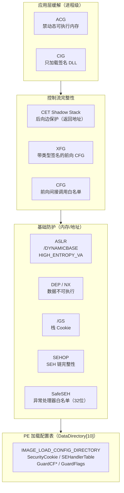
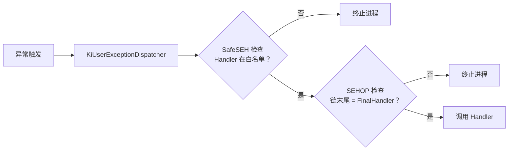
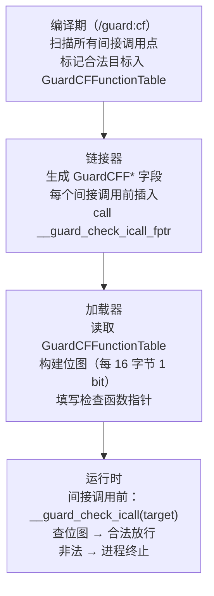
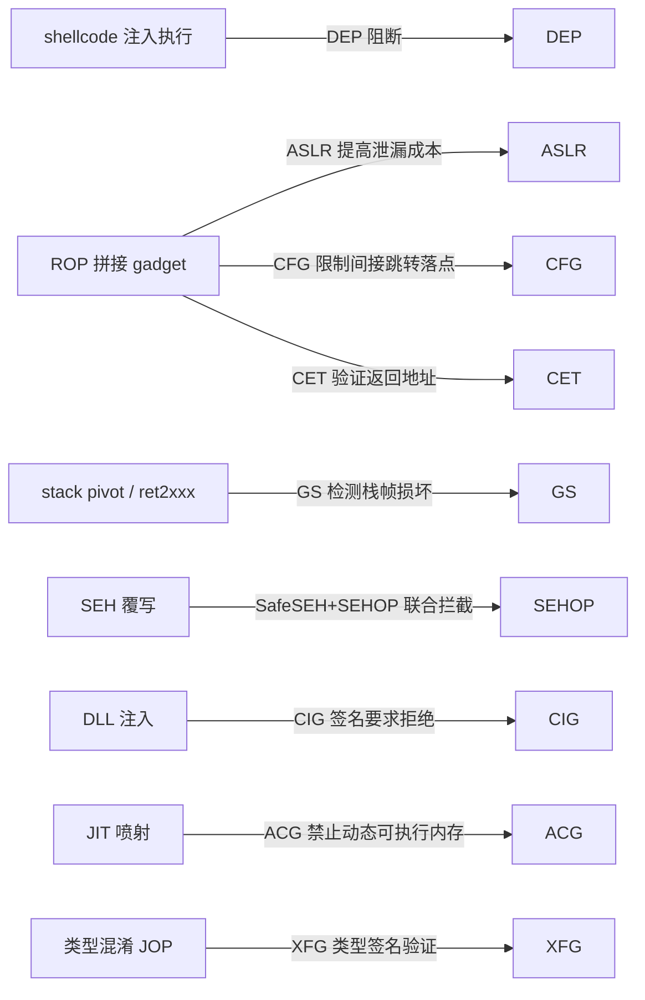

# 现代二进制防护机制（10）· Windows防护体系

## 概述与定位

> [!abstract] TL;DR
> Windows 从 XP SP2 开始，历经二十余年演进，构建了一套纵深叠加的防护体系：**GS**（栈 Cookie）、**SafeSEH/SEHOP**（异常链保护）、**DEP**（不可执行内存）、**ASLR**（地址随机化）、**CFG**（前向间接调用白名单）、**XFG**（带类型签名的增强 CFG）、**CET**（硬件 Shadow Stack）、**ACG**（禁止动态生成可执行代码）、**CIG**（只加载签名 DLL）。所有静态元数据（SafeSEH 处理器表、CFG 目标函数表）统一存放在 PE 加载配置表（[[13.PE文件详解/18-详解PE文件(十八)：加载配置表.md]]，数据目录索引 10）中，加载器据此初始化各机制的运行时状态。

Windows 的防护设计思路与 Linux/macOS 既有重叠也有差异：Linux 靠 Full RELRO + PIE + Canary + NX + CET 多层叠加（[[14.动态链接与加载器详解/15.加载器视角的安全.md]]）；Windows 因 PE 格式（加载时全量绑定 IAT，无延迟绑定）和历史 ABI 约束，走出了独特的路径——CFG 从"限制间接调用落点"角度弥补了"IAT 通常可写"的问题，而非像 Linux 那样对函数指针表做 `mprotect` 只读化。

本篇覆盖每项机制的**原理、PE 落地点、编译开关、验证方法与绕过边界**，与 [[09.Intel CET]] 的硬件层形成呼应——CET 在 Windows 10 20H1+ 上以 `/CETCOMPAT` 落地，是两篇的交汇点。

---

## 原理与机制

### 防护分层总览



---

## /GS — 栈安全 Cookie

### 原理

`/GS`（Security Cookie）是 Visual C++ 编译器默认开启的栈缓冲区保护。原理与 Linux 的 Stack Canary 完全对应：函数入口在栈帧中、局部变量与返回地址之间插入一个随机值（Cookie），函数返回前验证其完整性；若被覆盖则调用 `__report_gsfailure` 终止进程。

```
栈帧布局（/GS 开启后，x86-64）

高地址（调用方栈帧）
┌────────────────────────────┐
│  返回地址（Return Address）│  ← 攻击者的最终目标
├────────────────────────────┤
│  调用方 rbp（已保存）      │
├────────────────────────────┤
│  Security Cookie（随机值） │  ← 线性溢出必须先覆盖这里
├────────────────────────────┤
│  局部变量 / 缓冲区         │  ← 溢出起点
└────────────────────────────┘
低地址（当前栈帧）
```

### PE 落地点

Cookie 变量存放在进程 `.data` 段，地址记录在 PE 加载配置表的 `SecurityCookie` 字段（`IMAGE_LOAD_CONFIG_DIRECTORY.SecurityCookie`，VA 非 RVA）。加载器在进程启动时用 `NtQuerySystemTime` + `TickCount` 等混合随机值初始化该变量（见 [[13.PE文件详解/18-详解PE文件(十八)：加载配置表.md]] 中 `SecurityCookie` 字段详解）。

编译器在每个启用 `/GS` 的函数序言插入：

```asm
; x86-64 典型序言（MSVC）
mov  rax, [__security_cookie]   ; 读 Cookie 变量
xor  rax, rsp                   ; 与 rsp 混合（增强随机性）
mov  [rbp-8], rax               ; 压入栈帧
```

尾声调用 `__security_check_cookie` 验证。

### Linux 对应

Linux 的 Stack Canary（`-fstack-protector-strong`）在 `%gs:0x28`（TLS）存放 Master Canary，函数序言/尾声各一次 `mov rax, %gs:0x28` 读取比对，机制相同，存储位置不同（TLS vs `.data`）。

---

## SafeSEH / SEHOP — 异常处理链保护

### 背景：SEH 覆写攻击（32 位）

Windows 32 位的结构化异常处理（SEH）在**栈上**维护一条 `EXCEPTION_REGISTRATION` 链表（每帧有 `Next` 与 `Handler` 两个指针），攻击者若能栈溢出，可将 `Handler` 覆写为 shellcode 地址，在异常触发时劫持控制流。

### SafeSEH

`/SafeSEH` 链接选项让链接器在 PE 加载配置表中生成 `SEHandlerTable`（合法 SEH 处理器的 RVA 有序列表）与 `SEHandlerCount`。异常分发时，`ntdll` 的 `KiUserExceptionDispatcher` 在调用处理器前查询该表；不在表中的处理器地址被拒绝执行。

> [!note] SafeSEH 仅对 32 位 PE 有意义
> 64 位 Windows 使用**基于表的异常处理**（`RUNTIME_FUNCTION` 记录，存于 PE 异常表 DataDirectory[3]），SEH 链不再放在栈上，SafeSEH 机制自然退场。

### SEHOP（SEH Overwrite Protection）

SEHOP 是系统级（Vista SP1+）对 SEH 链进行完整性校验的机制：异常分发时遍历整条链，末尾必须是 `ntdll!FinalExceptionHandler`；若链被截断或末尾异常则终止进程。SEHOP 不依赖编译选项，由操作系统全局开启（注册表 `HKLM\SYSTEM\CurrentControlSet\Control\Session Manager\kernel\DisableExceptionChainValidation`）。



---

## DEP — 数据执行保护（= NX）

**Data Execution Prevention（DEP）** 是 Windows 对 CPU NX/XD 位的封装，对应 Linux 的 `PT_GNU_STACK` 无可执行位 + `mprotect(PROT_READ|PROT_WRITE)`（不含 `PROT_EXEC`）。

- **硬件 DEP**：CPU 支持 NX（Intel XD / AMD NX 位），由 Windows 内核在 PTE 中设置 `NX` 位，数据页不可执行。
- **软件 DEP（仅用于无 NX CPU 的旧机器）**：SEH 验证模拟部分防护，现代系统不再依赖。

PE 声明：链接选项 `/NXCOMPAT` 在 PE 可选头的 `DllCharacteristics` 中设置 `IMAGE_DLLCHARACTERISTICS_NX_COMPAT`（`0x0100`）位，告知加载器本进程请求 DEP 保护。64 位 PE 默认强制 DEP。

DEP 挡住的攻击：在栈/堆/数据段注入 shellcode 后直接跳转执行（ret2shellcode）。绕过路径：ROP（Return-Oriented Programming），完全在合法可执行代码页内拼接 gadget，DEP 对 ROP 无效——这正是 CFG/CET/ASLR 需要补位的原因。

---

## ASLR — 地址空间布局随机化

### Windows ASLR 两档

| 特性 | 链接选项 | DllCharacteristics 位 | 随机化对象 | 熵 |
|---|---|---|---|---|
| 基础 ASLR | `/DYNAMICBASE` | `IMAGE_DLLCHARACTERISTICS_DYNAMIC_BASE`（`0x0040`） | 模块基址、堆、栈 | x86：8 bit（256 槽），x64：≈17 bit |
| 高熵 ASLR | `/DYNAMICBASE /HIGHENTROPYVA` | `IMAGE_DLLCHARACTERISTICS_HIGH_ENTROPY_VA`（`0x0020`，仅 64 位） | x64 用户空间全 48 bit 地址空间 | 64 位：≈ 19 bit（栈/堆）；模块 ≈ 17 bit |

Linux 的 ASLR 机制详见 [[14.动态链接与加载器详解/15.加载器视角的安全.md]] 三平台对照节；本系列 [[03.ASLR深入]] 有独立分析。Windows x86 的熵明显低于 Linux x64，是已知弱点。

**Mandatory ASLR**（Process Mitigation `MoveImages`）：可强制对无 `/DYNAMICBASE` 标志的旧模块也做随机化，但由于没有重定位信息，效果有限且可能破坏旧软件。

**Force ASLR**：通过进程缓解策略 `PROCESS_MITIGATION_ASLR_POLICY.EnableForceRelocateImages` 启用，用于为旧版兼容模块也引入随机化。

---

## CFG — Control Flow Guard（前向控制流防护）

CFG 是 Windows 8.1 Update 3 / Windows 10 引入的**前向间接调用校验**机制，用于对抗 ROP/JOP：每次 `call [reg]` / `call [mem]` 执行前，检查目标地址是否在编译器预先标记的"合法间接调用目标"集合中。

### 元数据存储：PE 加载配置表

CFG 所有静态元数据存放在 [[13.PE文件详解/18-详解PE文件(十八)：加载配置表.md]] 中：

| 字段 | 含义 |
|---|---|
| `GuardCFFunctionTable` | 合法间接调用目标函数 RVA 列表 |
| `GuardCFFunctionCount` | 函数条目数量 |
| `GuardCFCheckFunctionPointer` | `__guard_check_icall_fptr` 变量 VA，加载器填入检查函数 |
| `GuardCFDispatchFunctionPointer` | `__guard_dispatch_icall_fptr` 变量 VA |
| `GuardFlags` | 能力位图（`IMAGE_GUARD_CF_INSTRUMENTED` 等） |

### 运行期工作流程



> [!note] CFG 位图粒度
> CFG 用每 16 字节对应 1 bit 的稀疏位图记录合法目标。粒度较粗：同一 16 字节内的任意地址都被标记为合法。这是 CFG 与 Linux IBT（`endbr64` 精确到指令）、macOS PAC（精确到函数签名）的重要区别。

### CFG 位图（GuardCF Bitmap）的内存布局与地址计算

CFG 位图是 Windows 加载器在进程启动时动态构建的稀疏数据结构，理解其内存布局有助于准确把握 CFG 的对齐精度与残余绕过面。

**地址到位偏移的映射原理**

加载器从 PE 加载配置表中读取 `GuardCFFunctionTable`（每条目存放 RVA，可选后缀附加额外元数据字节，元数据长度由 `GuardFlags` 的高 4 位 `Guard CF Function Table Stride` 字段记录）。对每个合法目标地址 `target`，其在位图中的位置按以下逻辑确定：

```
位图中的字节偏移 = target >> 9        // 右移 9 位 = 每 512 字节对应 1 字节
位图字节内的位偏移 = (target >> 4) & 7 // 再取低 3 位 = 每 16 字节对应 1 bit
```

两个步骤合起来等价于"每 16 字节对应位图中的 1 bit"。具体说：`target >> 4` 得到一个"16 字节槽编号"，该编号低 3 位选择目标字节内的 bit，高位部分（`>> 3`，即 `target >> 7`）选择位图字节。进一步按 512 字节一组将字节拆分成"位图页"，得到最终 `target >> 9` 作为页内字节索引的由来。

**位图页面布局**

位图本身驻留在一块连续的保留虚拟地址区域，由内核的 `NtSetSystemInformation` 或加载器内部初始化时调用 `ntdll!LdrpCfgProcessLoadConfig` 负责分配并映射。整个用户态地址空间理论上需要的位图大小为：

```
位图大小 = (最大用户态地址 >> 4) / 8
         = 最大用户态地址 >> 7
```

对于 64 位进程（用户态 128 TB，即 `2^47` 字节），位图理论全量大小为 `2^47 / 128 = 2^40 / 8` ≈ 128 GB。实际上采用**按需提交**（demand-paged sparse）策略：位图虚拟空间预留但仅在需要的页上实际提交物理内存，未使用区域保持为 `PAGE_NOACCESS` 或全零保留页，合法目标稀疏分布时内存实际消耗极小。

**对齐精度陷阱**

位图粒度为 16 字节这一事实带来两类精度问题：

1. **函数入口必须 16 字节对齐才能精确保护**：若编译器将某合法目标的实际入口放在 `0x1401abc8`，则整个 `[0x1401abc0, 0x1401abcf]` 范围内的任意地址在位图中对应同一 bit，攻击者只需构造一个跳转落在该 16 字节窗口内的任意偏移（如 `0x1401abca`），CFG 也会放行——这是"函数内部 gadget 利用 CFG 位图模糊边界"的基础。
2. **非对齐导出函数**：一些运行时合成的蹦床（thunk）或内联汇编函数起点不满足 16 字节对齐，其 bit 被置位后，16 字节窗口内的其他地址（可能是前一函数结尾的 gadget）也被连带标记为合法。

这正是 XFG（带类型签名）需要补位的根本原因：XFG 在 CFG 位图之外附加了函数入口处嵌入的类型 hash 验证，攻击者即使落在同一 16 字节窗口内也会被类型不符而拒绝。

### CFG 与 Linux/macOS 对照

| 维度 | Windows CFG | Linux IBT（CET） | macOS PAC |
|---|---|---|---|
| 保护方向 | 前向（间接 call/jmp 目标） | 前向（`endbr64` 标记合法目标） | 前向（指针签名验证） |
| 精度 | 16 字节粒度位图 | 指令级（`endbr64` 处才合法） | 函数级（签名类型匹配） |
| 元数据位置 | PE 加载配置表 `GuardCF*` | ELF `.note`，CPU 硬件 `MSR_IA32_S_CET` | Mach-O 紧跟 PAC 指令 |
| 开启方式 | `/guard:cf` | `-fcf-protection=branch` + 支持 IBT 的 CPU | arm64e 默认（Apple Silicon） |
| 粒度绕过面 | 位图粒度粗，同 16 字节任意入口可绕过 | 非 `endbr64` 前缀指令处跳入触发 `#CP` | 签名不匹配触发 PAC 异常 |

---

## XFG — eXtended Flow Guard

XFG 是微软在 CFG 基础上引入的**带类型签名的增强版前向控制流防护**，目前主要在内核模式和部分 Windows 系统组件中启用。

核心改进：CFG 只校验"目标地址是否在合法集合中"，XFG 进一步校验**函数原型签名 hash**——编译器对每个间接调用点和每个可达目标计算基于参数类型/返回类型的 hash，调用时同时验证地址合法性与类型签名匹配。若 hash 不一致，即使地址在 CFG 白名单中也会被拒绝。

```
XFG 调用序列（示意）：

  caller 侧：
    lea rax, [target_func]        ; 目标函数地址
    mov r10d, [XFG_type_hash]     ; 调用点期望的类型 hash
    call __guard_xfg_check_icall  ; 同时验证地址 + hash

  callee 入口（XFG 编译函数的序言）：
    ; 函数前 8 字节嵌入该函数的 XFG type hash
    dq  0x<callee_type_hash>
    ; 函数实际入口在 hash 后 8 字节处
    push rbp
    ...
```

XFG 将 CFG 的"地址白名单"升级为"（地址，类型签名）二元组白名单"，大幅收窄了 CFG 位图粒度粗导致的绕过面。编译选项：`/guard:cf,xfg`（需支持 XFG 的较新 MSVC 工具链）。

---

## `/guard:ehcont` — 异常处理继续目标（EHCONT）

`/guard:ehcont`（Exception Handling Continuation Targets）是 MSVC 2019 16.7+ 引入的 CFG 扩展机制，专门针对**异常处理展开（SEH/C++ EH unwind）路径**中的控制流转移点进行白名单保护。

### 为什么 CFG 对异常展开路径无效

CFG 的白名单保护的是运行时的**间接 call/jmp 指令**落点，但 C++ 异常处理展开过程中有一类特殊的控制流转移不走普通 `call reg` / `jmp reg` 路径：当异常被捕获后，系统展开框架（`RtlUnwindEx`）会恢复到 `catch` 块入口继续执行。这个"继续执行"的地址来自 PE 异常表（`RUNTIME_FUNCTION`）中存储的恢复 RVA，若攻击者能伪造或覆写该表的某个条目，展开后就可以跳到任意地址——即使该地址不在 CFG 白名单中，因为展开框架走的不是 `call reg` 路径。

### EHCONT 的工作原理

`/guard:ehcont` 让编译器对每个 `catch` 块入口、`__finally` 块入口以及 C++ EH 的 continuation 地址，在 PE 加载配置表中生成专用的白名单：

| 新增字段 | 含义 |
|---|---|
| `GuardEHContinuationTable` | 合法异常处理继续目标的 RVA 列表（RVA，按升序排列） |
| `GuardEHContinuationCount` | 表中条目数 |

在展开框架真正跳转到 continuation 地址之前，`ntdll` 中的展开辅助函数会调用 `__guard_check_icall_fptr`（同 CFG 使用的检查函数）对该地址做额外查询——但查询的是 `GuardEHContinuationTable` 而非 CFG 的 `GuardCFFunctionTable`，两张表分离，互不干扰，精度更高。

```asm
; 展开框架（伪代码，示意）
RtlUnwindEx:
    ; ... 展开栈帧 ...
    mov  rcx, [continuation_target]   ; 读取 catch 块地址
    ; EHCONT 检查（/guard:ehcont 编译的进程中，ntdll 注入此调用）
    call __guard_ehcont_check         ; 若不在 GuardEHContinuationTable → 终止进程
    jmp  rcx                          ; 跳转到 catch 块
```

### EHCONT 与 CFG 的互补关系

| 维度 | CFG | EHCONT |
|---|---|---|
| 保护的控制流路径 | 普通间接 `call reg` / `jmp reg` | 异常展开后的 continuation 跳转 |
| 白名单来源 | `GuardCFFunctionTable` | `GuardEHContinuationTable` |
| 粒度 | 16 字节位图 | 精确 RVA（无粒度模糊） |
| 绕过场景 | JOP/ROP 中的 `call reg` | 伪造 RUNTIME_FUNCTION 异常表的展开目标 |
| 编译开关 | `/guard:cf` | `/guard:ehcont`（单独或叠加） |

EHCONT 的精度优于 CFG 位图（精确到 RVA，无 16 字节对齐模糊），是 CFG 在异常路径上的精准补充。在高安全场景下，两者应同时开启：`/guard:cf /guard:ehcont`。

> [!note] `dumpbin` 验证 EHCONT
> ```text
> dumpbin /loadconfig target.exe
> # 输出中查找：
> Guard EH Continuation Table:  00007FF6C000xxxx
> Guard EH Continuation Count:  00000000000000yy
> ```
> `Guard Flags` 中 `EH Continuation Table Present` 位（`IMAGE_GUARD_EH_CONTINUATION_TABLE_PRESENT`，`0x00400000`）置位表示 EHCONT 已启用。

---

## CET — Control-flow Enforcement Technology

CET 的硬件原理（Shadow Stack + IBT）已在 [[09.Intel CET]] 中详述；本节聚焦 **Windows 侧的落地**。

### Windows CET 支持条件

- CPU：Intel 第 11 代（Tiger Lake）及以后，或 AMD Zen 4（Ryzen 7000，2022）及以后（含 Shadow Stack）
- OS：Windows 10 20H1（2020 年 5 月更新）及以后，内核 Shadow Stack 支持
- PE：链接时加 `/CETCOMPAT`（设置 `GuardFlags` 中 `IMAGE_GUARD_CET_COMPAT` 位）

### Windows Shadow Stack 工作方式

与 Linux CET（`MSR_IA32_S_CET` + `SSP` 寄存器）机制一致（见 [[09.Intel CET]]），区别在 Windows 管理面：

- 内核负责在进程创建时分配 Shadow Stack 内存（通过 `NtSetInformationProcess(ProcessShadowStackPolicy)`）
- 用户态无法直接读写 Shadow Stack（处于 `WP` 位保护下）
- 异常展开（Unwinding）时，Windows SEH 框架需要更新 Shadow Stack 指针（`INCSSPQ`），否则合法的异常处理展开会被 Shadow Stack 误判为 ret address 不匹配

### CET 与 ACG 的协同

CET Shadow Stack 防止返回地址被篡改（后向边保护）；ACG（下节）禁止动态生成可执行代码——二者配合使"动态生成 shellcode + 篡改返回地址执行"的组合攻击双重受阻。

---

## ACG — Arbitrary Code Guard

ACG（`PROCESS_MITIGATION_DYNAMIC_CODE_POLICY`）禁止进程在运行时：

1. 将内存页从不可执行修改为可执行（`VirtualProtect` 修改为 `PAGE_EXECUTE*` 被拒绝）
2. 创建可执行的内存映射（`VirtualAlloc(MEM_COMMIT, PAGE_EXECUTE_*)`）
3. 加载非签名的动态代码模块

ACG 的核心目标是彻底封堵**动态代码生成**（Dynamic Code Generation, DCG）路径——JIT 引擎、即时修补（hot-patching）、部分动态语言运行时都依赖 DCG；开启 ACG 的进程（如 Microsoft Edge 渲染进程）必须通过严格隔离设计将 JIT 编译移至独立的 JIT 进程，再将已编译的可执行代码通过只读共享内存传入渲染进程。

> [!warning] ACG 与 JIT 的兼容性
> 开启 ACG 会破坏大多数 JIT 引擎（V8、SpiderMonkey、ChakraCore 等）的默认工作模式。浏览器通过"JIT 进程外置"架构（Out-of-Process JIT）解决兼容性，但这也引入了新的攻击面：JIT 进程若被攻破，可向渲染进程注入已签名的恶意代码片段。

---

## CIG — Code Integrity Guard

CIG（`PROCESS_MITIGATION_BINARY_SIGNATURE_POLICY`）要求进程只能加载**具有有效数字签名的 DLL**：

- `MicrosoftSignedOnly`：仅接受微软签名的 DLL
- `StoreSignedOnly`：接受 Windows Store 发布的签名 DLL
- `MitigationOptionsMask`：可组合允许范围

CIG 阻断了 DLL 注入（DLL Injection）攻击：即便攻击者能调用 `LoadLibrary`，若目标 DLL 无合法签名也会被加载拒绝。

> [!warning] CIG 无法防御已加载 DLL 内的代码重用攻击
> CIG 的保护粒度是"模块加载"，对已在进程地址空间中的合法 DLL 内部的 ROP gadget 拼接无效。CFG + CET 负责这部分防护，三者形成互补。

---

## 各机制绕过边界简述

> [!warning] 以下内容仅用于安全研究与防御评估，请在合规环境中使用

| 机制 | 防护目标 | 主要绕过思路 | 缓解方向 |
|---|---|---|---|
| **/GS** | 栈线性溢出覆盖返回地址 | 泄露 Cookie 值（信息泄露漏洞）再精确覆盖；或绕过覆盖不受 GS 保护的局部结构（vtable 指针、函数指针） | 与 ASLR 结合提高 Cookie 地址随机性；CFI 防函数指针覆盖 |
| **SafeSEH** | SEH 处理器覆写（32位） | 使用白名单中已有的 SEH 处理器做跳板（`pop pop ret` gadget 在早期广泛可用） | SEHOP 链完整性验证封堵 |
| **SEHOP** | SEH 链被截断/伪造 | 泄露 `ntdll!FinalExceptionHandler` 地址（ASLR 已随机化，需信息泄露前提）；或利用不启用 SEHOP 的子进程 | ASLR 高熵配合 |
| **DEP** | 栈/堆 shellcode 执行 | ROP（完全在合法代码页内操作） | CFG + CET + ASLR 叠加 |
| **ASLR** | 硬编码地址利用 | 信息泄露（内核指针泄露、堆喷射）；x86 位下熵不足（256 槽）可爆破 | 高熵 ASLR（64位）+ 信息泄露防御 |
| **CFG** | 间接调用劫持（JOP） | 利用 CFG 白名单中已有的合法函数目标做 call-oriented gadget 拼接；CFG 位图粒度粗（16字节）可在同 16 字节内跳至非合法入口 | XFG 类型签名收窄；CET IBT 精确到 `endbr64` |
| **XFG** | CFG 粒度不足 | 找到类型签名 hash 碰撞的合法函数；或针对未启用 XFG 的旧模块 | 更严格 hash 算法；全量模块覆盖 |
| **CET** | 返回地址篡改（ROP） | 通过 shadow stack 本身的操作（`INCSSP` 等）绕过；需要代码执行权限前提 | 与 ACG 配合禁止动态代码 |
| **ACG** | 动态注入可执行代码 | 针对 JIT 进程的逃逸（Out-of-Process JIT 架构的 IPC 通道漏洞）；针对 R^W 共享映射 | 严格 JIT 进程隔离 + IPC 权限最小化 |
| **CIG** | DLL 注入 | 利用已加载的合法 DLL 内的 gadget；已有签名 DLL 被 ACG 豁免列表绕过 | CIG + ACG + CFG 三层联动 |

---

## 如何开启与验证

### 编译 / 链接选项汇总

```text
# Visual Studio / MSVC 链接选项
/GS              # 栈安全 Cookie（编译选项，默认开启）
/SafeSEH         # SafeSEH 处理器表（32位链接选项）
/NXCOMPAT        # 声明支持 DEP
/DYNAMICBASE     # 基础 ASLR（64位默认开启）
/HIGHENTROPYVA   # 高熵 ASLR（64位推荐）
/guard:cf        # CFG 控制流防护
/guard:cf,xfg    # CFG + XFG 类型签名（较新 MSVC）
/guard:ehcont    # 异常处理连续目标（GuardRF*）
/CETCOMPAT       # CET Shadow Stack 兼容
```

### Windows Exploit Protection（进程缓解策略）配置

除了编译链接选项外，Windows 10/11 提供了两条独立配置路径来**逐进程或全局**管理 DEP/ASLR/CFG 等缓解策略，这对于无法重新编译的第三方应用尤为重要。

**GUI 路径（Windows 安全中心）**

```
Windows 安全中心 → 应用和浏览器控制 → Exploit Protection 设置
  ├─ 系统设置（全局默认，影响所有进程）
  │    ├─ 控制流防护 (CFG)：默认开启
  │    ├─ 数据执行保护 (DEP)：默认开启
  │    └─ ASLR（强制随机化）：可配置
  └─ 程序设置（逐进程覆盖）
       ├─ 添加要自定义的程序（按名称或路径）
       └─ 为该进程单独配置所有缓解项
```

GUI 背后将配置序列化为 XML 并存入 `%APPDATA%\Microsoft\Windows Defender\Exploit Guard\Network Protection\ProcessMitigation.xml`，可通过组策略（GPO）或 SCCM 批量下发到企业域中所有主机。

**PowerShell 路径（`ProcessMitigation` 模块）**

```powershell
# 查看系统级默认缓解策略
Get-ProcessMitigation -System

# 查看指定进程（按 PID）的缓解策略
Get-ProcessMitigation -Id 1234

# 查看指定可执行文件的持久化缓解策略（注册表存储）
Get-ProcessMitigation -Name "example.exe"

# 为指定程序启用 CFG 严格模式（StrictMode 拒绝导出函数作为间接调用目标）
Set-ProcessMitigation -Name "example.exe" -Enable CFG, StrictCFG

# 启用 DEP + 强制 ASLR（针对无 /DYNAMICBASE 的旧程序）
Set-ProcessMitigation -Name "legacy.exe" -Enable DEP, ForceRelocateImages

# 启用 Heap Terminate（堆损坏时直接终止进程，不产生异常处理机会）
Set-ProcessMitigation -Name "example.exe" -Enable HeapTerminateOnCorruption

# 导出当前所有持久化策略为 XML，用于跨机器部署
Get-ProcessMitigation -RegistryConfigFilePath .\mitigation_policy.xml

# 从 XML 批量导入策略
Set-ProcessMitigation -PolicyFilePath .\mitigation_policy.xml
```

> [!note] StrictCFG 与普通 CFG 的区别
> 普通 CFG 将 PE 导出表（Export Table）中的所有导出函数自动加入 CFG 白名单，这为攻击者提供了通过"跳转到任意导出函数"绕过 CFG 的路径。`StrictCFG`（`GuardFlags` 中 `IMAGE_GUARD_CF_EXPORT_SUPPRESSION_INFO_PRESENT` 位）将导出函数从白名单中剔除，仅保留编译器实际标记为间接调用目标的函数。启用 StrictCFG 前需确认应用确实未依赖将导出函数作为间接调用目标的场景，否则可能引发崩溃。

**注册表底层存储**

`Set-ProcessMitigation` 的持久化缓解策略最终写入 `HKLM\SOFTWARE\Microsoft\Windows NT\CurrentVersion\Image File Execution Options\<程序名>\MitigationOptions` 和 `MitigationAuditOptions`，加载器在进程初始化时读取这两个 REG_QWORD 值并调用 `NtSetInformationProcess` 应用对应策略。

ACG / CIG 无链接选项，在运行时通过 `SetProcessMitigationPolicy` API 开启：

```c
// 开启 ACG
PROCESS_MITIGATION_DYNAMIC_CODE_POLICY dp = {};
dp.ProhibitDynamicCode = 1;
SetProcessMitigationPolicy(ProcessDynamicCodePolicy, &dp, sizeof(dp));

// 开启 CIG（仅微软签名）
PROCESS_MITIGATION_BINARY_SIGNATURE_POLICY bp = {};
bp.MicrosoftSignedOnly = 1;
SetProcessMitigationPolicy(ProcessSignaturePolicy, &bp, sizeof(bp));
```

### dumpbin 验证加载配置表

```text
dumpbin /loadconfig target.exe
```

```text
Load Configuration Directory:
  Size:                         000000E8
  ...
  Security Cookie:              00007FF6C0001234
  Guard CF Check Function Ptr:  00007FF6C0005678
  Guard CF Dispatch Function Ptr: 00007FF6C000ABCD
  Guard CF Function Table:      00007FF6C000EF00
  Guard CF Function Count:      0000000000000189
  Guard Flags:                  00004500
    CF Instrumented
    FID Table Present
    Protect Delayload IAT
    Delayload IAT in its own section
```

> [!warning] 示例输出为示意
> 地址为示意值，非真实运行期地址；`Guard CF Function Count` 表示白名单中的合法间接调用目标数；`GuardFlags` 具体位图含义见 [[13.PE文件详解/18-详解PE文件(十八)：加载配置表.md]]。

### Process Mitigation 查询（PowerShell）

```powershell
# 查询目标进程的所有缓解策略
Get-ProcessMitigation -Id <PID>
```

```text
CFG: Enable                   : ON
    SuppressExports           : OFF
    StrictMode                : OFF
DEP: Enable                   : ON
ASLR: EnableBottomUpRandomization : ON
      ForceRelocateImages     : OFF
DynamicCode: Prohibit         : ON      # ACG
Signature: MicrosoftSignedOnly: ON      # CIG
```

> [!warning] 示例输出为示意
> 实际输出随进程配置和 Windows 版本而变；`DynamicCode: Prohibit` 对应 ACG，`Signature: MicrosoftSignedOnly` 对应 CIG。

### `dumpbin /headers` 验证 DllCharacteristics

```text
dumpbin /headers target.exe | findstr DllCharacteristics
```

```text
            C160 DllCharacteristics
                   High Entropy Virtual Addresses
                   Dynamic base
                   NX compatible
                   Terminal Server Aware
```

> [!warning] 示例输出为示意
> `High Entropy Virtual Addresses` = `/HIGHENTROPYVA`；`Dynamic base` = `/DYNAMICBASE`；`NX compatible` = `/NXCOMPAT`。

---

## 三平台防护机制对照

| 防护维度 | Windows | Linux（ELF / ld.so） | macOS（Mach-O / dyld） |
|---|---|---|---|
| **栈 Cookie** | `/GS`（MSVC 默认），Cookie 在 `.data`，加载配置表 `SecurityCookie` 记录地址 | `-fstack-protector-strong`，Master Canary 在 `%gs:0x28`（TLS） | Clang `-fstack-protector`，TLS 存储 |
| **不可执行内存** | DEP（`/NXCOMPAT`，`NX_COMPAT` 位） | `PT_GNU_STACK` 无 `PF_X`（`-z noexecstack`） | `__DATA` 段不可执行，Hardened Runtime 强制 W^X |
| **地址随机化** | ASLR（`/DYNAMICBASE`），高熵（`/HIGHENTROPYVA`）；x86 熵 8 bit，x64 ≈19 bit | PIE + ASLR（`-fPIE -pie`）；x64 ≈ 28 bit 熵（发行版调优） | PIE 默认强制；arm64 ASLR + PAC 弥补低熵 |
| **异常处理保护** | SafeSEH（32位白名单）+ SEHOP（链完整性）| 无直接对应（x86-64 不用栈上 SEH 链） | 无直接对应 |
| **函数指针表保护** | IAT 可写（`/DYNAMICBASE` + DEP 提高门槛）；无直接等价于 Full RELRO | Full RELRO（`-z relro -z now`）锁定 `.got.plt` 只读（详见 [[14.动态链接与加载器详解/15.加载器视角的安全.md]]） | chained fixups 页只读化 + Hardened Runtime |
| **前向 CFI** | CFG（`/guard:cf`，16 字节粒度位图）+ XFG（类型签名） | IBT/CET（`-fcf-protection=branch`，`endbr64` 精确）| PAC（arm64e，指针签名类型验证） |
| **后向 CFI（返回地址）** | CET Shadow Stack（`/CETCOMPAT`，Win10 20H1+） | CET Shadow Stack（`-fcf-protection=return`，Linux 5.18+） | PAC + arm64 Return Address Authentication |
| **动态代码限制** | ACG（`ProcessDynamicCodePolicy`） | SELinux/AppArmor `execmem` 限制（系统级） | Hardened Runtime `com.apple.security.cs.allow-jit` entitlement 限制 |
| **模块签名要求** | CIG（`ProcessSignaturePolicy`） | 无通用机制（SELinux/IMA 可做文件完整性校验） | Gatekeeper + Hardened Runtime 代码签名强制 |
| **元数据载体** | PE 加载配置表（DataDirectory[10]，`IMAGE_LOAD_CONFIG_DIRECTORY`） | ELF 程序头（`PT_GNU_RELRO`、`PT_GNU_STACK`）、`.dynamic` | Mach-O Load Commands（`LC_DYLD_CHAINED_FIXUPS` 等） |

---

## 绕过后的纵深：机制协同



单一机制均可被绕过，**叠加**才是 Windows 防护体系的核心逻辑：绕过 DEP 需要 ROP → ROP 受 CFG 限制目标集 → CFG 位图位置需信息泄露（ASLR 提高代价）→ CFG 被绕过后返回地址还受 CET 保护 → CET 只能在合法代码中运行但 ACG 限制了动态代码注入 → CIG 进一步拦截未签名模块。

---

## 小结

1. **GS / SafeSEH / SEHOP** 是 XP SP2 时代的"第一道防线"，分别针对栈溢出和 SEH 覆写；前两者元数据记录在 PE 加载配置表（[[13.PE文件详解/18-详解PE文件(十八)：加载配置表.md]]）。
2. **DEP + ASLR** 构成基础地基：DEP 封堵 shellcode 直接执行，ASLR 让地址无法硬编码——两者单独都能被绕过，叠加才有意义。
3. **CFG** 是 Windows 控制流防护的核心，元数据（`GuardCFFunctionTable` + `GuardFlags`）存于加载配置表，运行期构建位图；位图粒度粗（16 字节）是已知弱点，XFG 用类型签名补位。
4. **CET** 以 `/CETCOMPAT` 在 Windows 10 20H1+ 落地，原理见 [[09.Intel CET]]；需 CPU（Tiger Lake / Zen 4+）和 OS 同时支持，与 ACG 协同封锁动态代码+返回地址双路径。
5. **ACG / CIG** 是应用层缓解，将攻击面从"任意代码执行"进一步收窄到"已签名合法代码内的 gadget 拼接"——现代 Edge / Office 等高价值进程已全量启用。
6. **Windows 与 Linux 的核心区别**：Linux 靠 Full RELRO 把函数指针表（`.got.plt`）`mprotect` 为只读（[[14.动态链接与加载器详解/15.加载器视角的安全.md]]）；Windows IAT 无等价机制，靠 CFG 从"限制间接调用落点"角度补位——殊途同归，但防护粒度与残余风险面不同。

---

## 相关阅读

- **PE 加载配置表详解**（CFG / SafeSEH / GS Cookie 元数据存放处）：[[13.PE文件详解/18-详解PE文件(十八)：加载配置表.md]]
- **加载器视角的 Windows/Linux/macOS 三平台对照**（RELRO / IAT / chained fixups）：[[14.动态链接与加载器详解/15.加载器视角的安全.md]]
- **Intel CET 硬件原理**（Shadow Stack + IBT，Windows CET 的底层）：[[09.Intel CET]]
- **macOS 与 iOS 防护**（PAC / Hardened Runtime / SIP）：[[11.macOS与iOS防护]]
- **系列总览**：[[00.现代二进制防护机制总览]]

---

⬅️ 上一篇 [[09.Intel CET]] ｜ 🏠 [[00.现代二进制防护机制总览]] ｜ 下一篇 [[11.macOS与iOS防护]] ➡️
