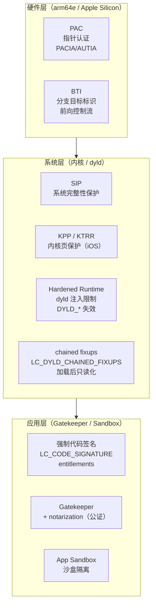
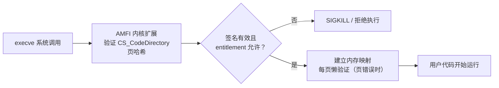
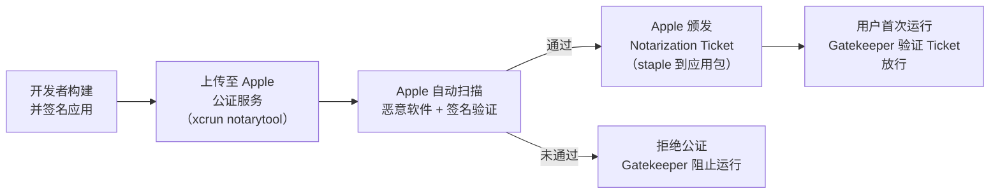
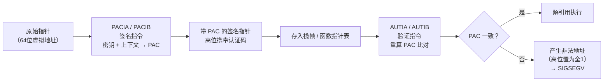
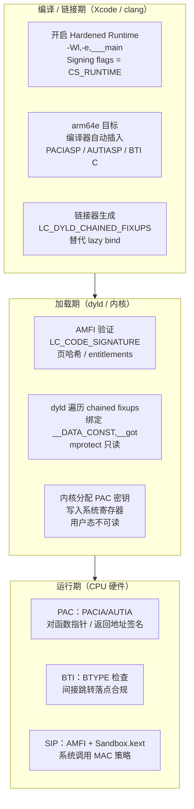

# 现代二进制防护机制（11）· macOS与iOS防护

## 概述与定位

> [!abstract] TL;DR
> 苹果平台安全体系以**代码签名**为基石，构建了从硬件到系统到应用的纵深防御：**强制代码签名**（`LC_CODE_SIGNATURE`）确保每个可执行文件经过苹果或开发者的加密背书；**Gatekeeper + notarization（公证）** 在运行前验证来源合规性；**Hardened Runtime** 限制 `DYLD_INSERT_LIBRARIES` 等动态注入路径，JIT 需显式 entitlement 开关；**SIP（System Integrity Protection）** 从内核层面保护系统目录和进程完整性；**PAC（Pointer Authentication，arm64e）** 用密钥+上下文对指针做加密签名，检测指针篡改与 ROP 后向利用；**BTI（Branch Target Identification）** 标记合法前向跳转目标，对应 x86 IBT；**App Sandbox** 以权限声明限制进程能访问的资源。iOS 在此基础上更进一步：全平台强制签名、无 JIT 例外、KPP/KTRR 内核页保护。
>
> 本篇与 [[10.Windows防护体系]]、[[09.Intel CET]]、[[14.动态链接与加载器详解/15.加载器视角的安全.md]] 形成三平台防护闭环；Mach-O 文件结构基础见 [[12.Mach-O文件详解/00.Mach-O文件详解总览.md]]。

苹果平台的防护设计哲学与 Linux/Windows 有显著差异：Linux 靠编译器/链接器选项逐项叠加（Full RELRO + Canary + NX + CET），Windows 靠 PE 加载配置表集中存储元数据（CFG / SafeSEH / GS），而苹果的核心思路是**以代码签名为信任锚、以 entitlement 为权限边界、以硬件指令（PAC/BTI）为运行期守卫**——三层互锁，任一层被突破均有其他层兜底。

---

## 原理与机制

### 防护分层总览



---

## 代码签名

### LC_CODE_SIGNATURE 与强制签名

macOS 和 iOS 的代码签名机制以 Mach-O 加载命令 **`LC_CODE_SIGNATURE`** 为核心载体（Mach-O 文件结构详见 [[12.Mach-O文件详解/00.Mach-O文件详解总览.md]]）。该命令指向 `__LINKEDIT` 段中的代码签名数据块（`CS_SuperBlob`），其中包含：

| 子结构 | 说明 |
|---|---|
| `CS_CodeDirectory` | 页哈希表（每 4 KB 一个 SHA-256 哈希）+ 标志位 + 团队 ID |
| `CS_EntitlementBlob` | entitlements plist（XML），声明进程权限 |
| `CS_RequirementsBlob` | 代码要求（对签名来源/标识符的约束） |
| `CS_CmsBlob` | CMS（Cryptographic Message Syntax）数字签名，由苹果 WWDR 中间 CA 或开发者证书签署 |

内核在 `execve` 时调用 `mac_execve`（AMFI，Apple Mobile File Integrity）验证签名：



**页级懒验证**：代码页在首次访问（缺页中断）时由内核验证其 SHA-256 与 `CS_CodeDirectory` 中对应条目是否一致；篡改后的页在首次执行时触发 `SIGKILL`，而不是在加载时全量扫描——这降低了启动开销，同时保证了完整性。

### Entitlements

Entitlements 是一组键值对，声明进程被允许的特殊权限，由 `CS_EntitlementBlob` 携带并经签名保护。常见 entitlement：

| Entitlement 键 | 含义 |
|---|---|
| `com.apple.security.cs.allow-jit` | 允许 `MAP_JIT` 映射可执行可写内存（JIT 编译器必须） |
| `com.apple.security.cs.allow-dyld-environment-variables` | 允许 `DYLD_INSERT_LIBRARIES` 等环境变量生效（调试用） |
| `com.apple.security.cs.disable-library-validation` | 允许加载未签名或第三方签名的 dylib |
| `com.apple.security.network.client` | 允许进程发起网络连接 |
| `com.apple.security.files.user-selected.read-write` | 允许访问用户选择的文件 |

> [!warning] entitlement 被篡改即签名失效
> 由于 entitlements 是 `CS_EntitlementBlob` 的一部分，其哈希包含在 `CS_CodeDirectory` 中并经 CMS 签名保护；任何对 entitlement 的修改都会导致签名验证失败，进程无法启动。

### codesign 验证

```bash
# 查看签名详情（包含 entitlements 和团队 ID）
codesign -dv --entitlements - /Applications/Safari.app

# 验证签名完整性
codesign --verify --deep --strict /Applications/Safari.app

# 查看 LC_CODE_SIGNATURE 的偏移和大小
otool -l /usr/bin/ssh | grep -A4 LC_CODE_SIGNATURE
```

```text
# 示例输出（codesign -dv，代表性示意）
Executable=/Applications/Safari.app/Contents/MacOS/Safari
Identifier=com.apple.Safari
Format=app bundle with Mach-O universal (x86_64 arm64)
CodeDirectory v=20500 size=85904 flags=0x10000(runtime) hashes=2679+5 location=embedded
TeamIdentifier=APPLE
Sealed Resources version=2 rules=13+2 files=2541
Internal requirements count=1 size=188
```

> [!warning] 示例输出为示意
> 实际 CodeDirectory 大小、哈希数、flags 随二进制内容和工具链版本变化；`flags=0x10000(runtime)` 表示 Hardened Runtime 已启用。

---

## Gatekeeper 与 Notarization（公证）

**Gatekeeper** 是 macOS 在首次运行下载应用时执行的来源检查机制（非实时检查，首次运行时触发）：

- 检查应用是否由 Developer ID 证书签名（来自 Mac App Store 或公证后的开发者分发）
- 验证应用是否经过 Apple 公证（notarization）
- 检查是否在苹果撤销列表（OCSP）中

**Notarization（公证）** 是 macOS Catalina 后对 Developer ID 分发应用的强制要求：



Notarization Ticket 被"装订"（staple）到应用包中，用户离线运行时 Gatekeeper 仍可验证，无需联网查询 OCSP（苹果的公证 OCSP 端点过去曾引发隐私争议）。

**与 Linux/Windows 对应**：Linux 无通用的应用来源验证机制（发行版包管理器用 GPG 签名，但第三方二进制无强制要求）；Windows CIG（Code Integrity Guard）要求已加载 DLL 有有效签名，但对首次运行的 .exe 不做类似 Gatekeeper 的来源审查。

---

## Hardened Runtime（强化运行时）

Hardened Runtime 是 macOS 10.14+ 引入的**进程级安全策略集合**，以 Xcode 构建选项 `Enable Hardened Runtime` 开启，在代码签名的 `CS_CodeDirectory.flags` 中设置 `CS_RUNTIME`（`0x10000`）位。

### 核心限制

启用 Hardened Runtime 后，dyld 和内核对进程施加以下限制：

| 限制 | 默认状态 | 解除所需 entitlement |
|---|---|---|
| `DYLD_INSERT_LIBRARIES` 注入 | **禁用** | `com.apple.security.cs.allow-dyld-environment-variables` |
| `DYLD_LIBRARY_PATH` / `DYLD_FRAMEWORK_PATH` | **禁用** | 同上 |
| `DYLD_*` 所有环境变量 | **禁用** | 同上 |
| `MAP_JIT`（可写可执行内存） | **禁用** | `com.apple.security.cs.allow-jit` |
| 加载第三方未签名 dylib | **禁用** | `com.apple.security.cs.disable-library-validation` |
| ptrace attach（调试） | **受限** | `com.apple.security.cs.debugger` 或 Get Task Allow |

### 与加载器安全的呼应

`DYLD_INSERT_LIBRARIES` 是 macOS 上等价于 Linux `LD_PRELOAD` 的 dylib 注入机制（详见 [[14.动态链接与加载器详解/15.加载器视角的安全.md]]）。Linux 在 setuid/AT_SECURE 场景下自动忽略 `LD_PRELOAD`；macOS Hardened Runtime 则对**所有启用该 flag 的进程**全局禁用 `DYLD_*`，范围更广、粒度更细（可按 entitlement 逐项豁免）。

### JIT 与 W^X

标准 Hardened Runtime 强制 W^X（Write XOR Execute）：同一内存页不能同时可写且可执行。JIT 编译器（JavaScript 引擎、虚拟机等）需要：

1. 声明 `com.apple.security.cs.allow-jit` entitlement
2. 使用 `mmap(..., PROT_READ|PROT_WRITE|PROT_EXEC, MAP_JIT)` 分配专用 JIT 内存
3. 写入机器码后通过 `pthread_jit_write_protect_np(true)` 切换为只读可执行，写入时切回可写不可执行

iOS 上无任何 JIT entitlement，浏览器 JS 引擎只能使用解释执行（WebKit 的 LLInt 解释器），或通过特殊内核接口（`MAP_JIT` + 受限 SPI）在 Safari 内部使用。

---

## SIP — System Integrity Protection

SIP（System Integrity Protection，系统完整性保护）是 macOS 10.11 El Capitan 引入的**内核级保护机制**，由 `AMFI.kext` 和 `Sandbox.kext` 联合实施，即使 root 用户也无法绕过（必须进 Recovery Mode 关闭）。

### 保护范围

SIP 保护以下内容：

| 类型 | 受保护路径/行为 |
|---|---|
| 系统目录 | `/System`、`/usr`（`/usr/local` 除外）、`/bin`、`/sbin` |
| 系统文件 | 只允许 Apple 签名且有特定 entitlement 的进程写入 |
| 内核扩展 | 第三方 kext 必须经苹果公证（macOS 12+ 需使用 DriverKit 替代） |
| 运行时注入 | 对系统进程禁止 `DYLD_INSERT_LIBRARIES`（即使拥有 Hardened Runtime entitlement 也无法注入系统进程） |
| 调试系统进程 | 禁止 `ptrace`/`task_for_pid` 对系统保护进程进行附加 |
| NVRAM 和引导参数 | 禁止非 Apple 修改引导参数（防止内核调试模式被偷开） |

### SIP 与 Linux/Windows 对比

Linux 没有直接等价的 SIP——SELinux/AppArmor 可达到类似效果，但属于可配置策略，不是内核硬编码的强制边界；Windows 的受保护进程（Protected Process Light, PPL）有类似思路，但只针对特定进程（lsass.exe 等），不覆盖整个系统目录。

> [!warning] SIP 绕过历史
> 历史上存在数个 SIP 绕过漏洞（CVE-2021-30892"Shrootless"等），通常利用 Apple 签名的系统工具的权限滥用或逻辑漏洞；修复后仍应视 SIP 为强防护层而非绝对屏障。

---

## PAC — Pointer Authentication（arm64e）

PAC 是 ARMv8.3-A 引入、Apple 在 arm64e ABI 中全面落地的**硬件级指针完整性保护**机制，Apple Silicon（M 系列芯片）和 A12 及以后的 iOS 芯片均支持。

### 核心思路

PAC 在指针的**高位虚拟地址空间中未使用的比特位**（典型 arm64 用户态：bit[63:48]）嵌入一个**指针认证码（PAC，Pointer Authentication Code）**，由密钥和上下文（modifier）通过 QARMA 密码算法计算得出。



### 密钥与上下文

PAC 使用 5 个 128 位密钥，由操作系统在进程初始化时随机生成（存储在系统寄存器，用户态不可读）：

| 密钥 | 用途 |
|---|---|
| IA（Instruction A） | 代码指针（函数指针、返回地址），默认 |
| IB（Instruction B） | 代码指针，供操作系统内核使用 |
| DA（Data A） | 数据指针 |
| DB（Data B） | 数据指针，备用 |
| GA（Generic A） | 通用 HMAC（`PACGA` 指令） |

**上下文（modifier/discriminator）** 是混合进签名的额外值（通常是栈指针 SP 或内存地址），使同一指针在不同上下文的签名值不同——攻击者无法把从一个位置提取的已签名指针直接搬到另一个上下文使用。

### 典型指令序列

```asm
; 函数入口：对返回地址签名并存栈（编译器自动插入）
PACIASP               ; 用 IA 密钥 + SP 作为上下文对 LR 签名
STP X29, LR, [SP, #-16]!  ; 将签名后的返回地址存入栈帧

; 函数出口：验证并恢复返回地址
LDP X29, LR, [SP], #16    ; 从栈帧读出（可能被攻击者篡改的）返回地址
AUTIASP               ; 用 IA 密钥 + SP 重算 PAC 并验证
RET                   ; 若 PAC 不匹配，LR 高位被置为全1 → 非法地址 → 异常
```

```asm
; 函数指针签名（存储前）
PACIZA X0             ; 用 IA 密钥、上下文=0 对 X0（函数指针）签名

; 函数指针验证（调用前）
AUTIZA X0             ; 验证 PAC，移除认证码还原真实地址
BLR X0                ; 跳转（若 AUTIZA 失败则地址非法 → 崩溃）
```

### PAC 防护范围

PAC 同时提供**后向边（返回地址）**和**前向边（函数指针）**保护：

- **后向边**：`PACIASP`/`AUTIASP` 对函数返回地址签名，挡住 ROP 链——攻击者篡改栈上返回地址后，`AUTIASP` 验证失败，`RET` 跳入非法地址；等价于 Intel CET Shadow Stack 的功能，但实现路径不同（Shadow Stack = 独立只读内存副本；PAC = 指针自带签名）。
- **前向边**：`PACIZA`/`AUTIZA` 对函数指针签名，挡住 JOP（Jump-Oriented Programming）——等价于 Intel IBT（`endbr64`）+ 类型签名，但 PAC 的上下文机制使精度更高。

与 Windows CFG 对比：CFG 用 16 字节粒度位图（精度较粗），PAC 用密码学签名（精度高，且每次签名结果随密钥随机化，无法预测）。

### PAC 绕过边界

> [!warning] PAC 并非无法绕过，以下为已知研究发现
> 1. **密钥泄露**：若攻击者能读取系统寄存器（需内核权限），可获取 PAC 密钥自行构造合法签名。
> 2. **oracle 攻击**：若存在可利用的"签名 oracle"（即让进程对攻击者可控的指针做签名），攻击者可获得合法签名指针；某些历史漏洞（如 CVE-2021-30858）利用 JIT 边界实现 oracle。
> 3. **上下文混淆**：若签名使用常量上下文（discriminator=0），不同位置的已签名指针可互换——编译器应使用地址敏感的上下文（如存储位置地址）以最大化防护。
> 4. **非 arm64e 路径**：macOS 仍可运行 x86_64 代码（Rosetta 2）和旧 arm64（非 arm64e）代码，这些路径不受 PAC 保护。
> 5. **gadget 内部操作**：PAC 保护的是指针传递到 `BLR`/`RET` 的一刻；若攻击者能通过 CAS（Compare-And-Swap）或类似原语在签名前覆盖指针，PAC 无效。

---

## BTI — Branch Target Identification

BTI 是 ARMv8.5-A 引入的**前向控制流完整性**机制，对应 x86 的 Intel IBT（Indirect Branch Tracking）和 `endbr64` 指令。

### 原理

在 Mach-O 二进制中开启 BTI 后，CPU 进入 BTI 模式（通过 `PSTATE.BTYPE` 控制）：

- 间接跳转（`BR`/`BLR`）只能落在 `BTI` 指令（或 `NOP` 的 BTI 变体）处
- 跳入非 BTI 目标触发 Branch Target 异常（BTI exception）（等价于 Intel CET 的 `#CP` 异常）

```asm
; 合法 BTI 目标（函数入口）
BTI C               ; Branch Target Identification for Calls（允许 BLR 到此处）
STP X29, LR, [SP, #-16]!
...

; 没有 BTI 的非法目标（函数中间）
ADD X0, X1, #1      ; 间接跳转到此处触发 BTITRAP
```

BTI 与 PAC 联用：PAC 验证指针签名（密码学保证），BTI 验证跳转落点（CPU 硬件保证），两层互补——PAC 防指针被篡改后用于任意地址，BTI 防 gadget 拼接（即便指针未被篡改，也不能跳入函数中间的 gadget）。

Mach-O 通过 `LC_BUILD_VERSION` 的 `platform`/`tool` 字段和 section attributes 标记 BTI 支持；链接器在目标文件都支持 BTI 时才在最终二进制中开启 BTI 页保护。

---

## App Sandbox

App Sandbox 是 macOS/iOS 的**权限声明式隔离**机制，应用在 entitlements 中声明所需权限类别，内核（Sandbox.kext）在运行时对每个系统调用做 MAC（Mandatory Access Control）策略检查。

沙盒容器为应用提供专属目录（`~/Library/Containers/<bundle-id>/`），默认阻止：

- 访问其他应用的容器目录
- 监听任意网络端口（须声明 `com.apple.security.network.server`）
- 访问摄像头、麦克风（须声明对应 entitlement 并获得用户授权）
- 发起进程（须声明 `com.apple.security.app-sandbox.open-urls`）

Mac App Store 强制要求沙盒；iOS App Store 所有应用默认强制沙盒。

---

## iOS 更严的附加保护

iOS 在 macOS 基础上施加了更多无法绕过的限制：

| 机制 | macOS | iOS |
|---|---|---|
| 代码签名 | 强制（Gatekeeper 可用 `--override` 绕过开发者模式） | **绝对强制**，任何未签名代码均无法执行 |
| JIT | 有 `allow-jit` entitlement 可开 | **无 JIT entitlement**，普通 App 不允许动态可执行内存；Safari 使用特殊 SPI |
| 侧载（Sideloading） | Developer ID 签名可直接运行 | iOS 17 EU 地区允许有限侧载，其余地区仅 App Store |
| 内核保护 | SIP 保护内核扩展 | **KPP（Kernel Patch Protection）+ KTRR（Kernel Text Readonly Region）**：防内核代码篡改，运行期内核代码段只读 |
| 调试 | 开发者账户 + Get Task Allow entitlement 可调试 | 仅限持有 Developer entitlement 的设备；越狱设备除外 |
| 进程隔离 | 沙盒（可豁免） | **全量强制沙盒**，无豁免路径 |

### KPP / KTRR

**KPP（Kernel Patch Protection）**：A10 之前 iOS 的内核代码完整性保护，由专用协处理器（Secure Enclave Processor 的一部分）定期校验内核代码页哈希，发现篡改立即重启设备。

**KTRR（Kernel Text Readonly Region）**：A10+ 引入的硬件机制，在 MMU 层面将内核代码段标记为永久只读——即使内核自身也无法修改（通过 `APRR` 寄存器实现），是 KPP 的硬件级替代和增强，更难绕过。

---

## Chained Fixups 与 __DATA_CONST

现代 arm64 macOS（Big Sur+）广泛使用 **`LC_DYLD_CHAINED_FIXUPS`** 替代旧的 `LC_DYLD_INFO_ONLY` lazy bind opcode（Mach-O Load Commands 详见 [[12.Mach-O文件详解/00.Mach-O文件详解总览.md]] 第 17 条 `LC_DYLD_INFO_ONLY`）。

chained fixups 将二进制内所有需要修补的指针（GOT 项、`__DATA,__got` 中的导入符号指针）组织成链表结构，dyld 在加载时一次性遍历链表完成所有绑定，绑定完成后：

1. `__DATA_CONST` 段中的指针页被 `mprotect` 为只读（等价于 Linux Full RELRO 对 `.got` 的处理）
2. 原有的懒绑定（`__la_symbol_ptr`）逐渐退场，减少了"首次调用时可写的函数指针表"这一攻击面

与 Linux Full RELRO 对比（详见 [[14.动态链接与加载器详解/15.加载器视角的安全.md]]）：

| 维度 | Linux Full RELRO | macOS chained fixups |
|---|---|---|
| 函数指针表 | `.got.plt`（`JUMP_SLOT`），`mprotect` 只读 | `__DATA_CONST,__got`，加载后 `mprotect` 只读 |
| 触发条件 | `-z relro -z now`（显式开启） | arm64 macOS 默认；x86_64 macOS 部分使用 |
| 懒绑定 | 默认 lazy，`-z now` 关闭 | arm64 趋向即时绑定，lazy bind 退场 |
| 伪造难度 | 伪造 `Elf64_Rela` / `Elf64_Sym` 结构 | chained fixup 结构更复杂，伪造门槛更高 |

---

## 实现细节：各层如何落地



---

## 三平台防护对照

| 防护维度 | macOS / iOS（Mach-O / dyld） | Linux（ELF / ld.so） | Windows（PE / 加载器） |
|---|---|---|---|
| **代码签名** | **强制**（AMFI + Gatekeeper），`LC_CODE_SIGNATURE`，页哈希逐页验证 | 无通用机制（IMA 可选）；包管理器用 GPG | PE Authenticode 签名（可选）；CIG 要求签名 DLL |
| **来源审查** | Gatekeeper + notarization | 无（包管理器 GPG 签名） | SmartScreen（用户态，非强制） |
| **dylib/DLL 注入防御** | Hardened Runtime 禁用 `DYLD_*`；SIP 对系统进程 | `AT_SECURE=1` 清除 `LD_*`（限 setuid 场景） | CIG `MicrosoftSignedOnly` |
| **函数指针表保护** | chained fixups → `__DATA_CONST` 只读（arm64 默认） | Full RELRO：`mprotect(.got.plt)` + `-z now` | IAT 可写；CFG 从限制落点角度补位 |
| **前向 CFI** | PAC（arm64e，密码学签名）+ BTI（ARMv8.5，CPU 强制） | IBT/CET（`endbr64`，CPU 强制，需 Ice Lake+） | CFG（16 字节粒度位图）+ XFG（类型签名） |
| **后向 CFI（返回地址）** | PAC `PACIASP`/`AUTIASP`（密码学签名） | CET Shadow Stack（独立只读内存副本） | CET Shadow Stack（`/CETCOMPAT`，Win10 20H1+） |
| **动态代码（JIT）** | Hardened Runtime W^X；JIT 须 `allow-jit` entitlement；iOS 无 JIT | `mprotect(PROT_EXEC)` 不受限；SELinux `execmem` 可限制 | ACG（`ProcessDynamicCodePolicy`），JIT 进程外置 |
| **系统保护** | SIP（系统目录 + 内核扩展不可修改，即使 root） | SELinux / AppArmor（可配置策略） | PPL（Protected Process Light，针对特定进程） |
| **内核保护** | KPP / KTRR（iOS，硬件只读内核代码段） | 内核自写保护（`CONFIG_DEBUG_RODATA`）；无 KPP 等价 | PatchGuard（BSOD 触发，非硬件强制） |
| **沙盒** | App Sandbox（MAC 策略，App Store 强制） | seccomp + namespaces（需显式配置） | AppContainer（UWP 应用强制） |
| **验证工具** | `codesign -dv`、`otool -l`、`codesign --verify --deep` | `checksec`、`readelf -l`、`readelf -d` | `dumpbin /loadconfig`、`Get-ProcessMitigation` |

---

## 绕过边界与残余风险

> [!warning] 本节内容仅用于安全研究与防御评估，请在合规环境中使用

| 机制 | 典型绕过思路 | 残余风险与缓解 |
|---|---|---|
| **代码签名** | 利用已签名二进制的逻辑漏洞（无需绕过签名）；越狱修改 AMFI 策略 | 深度沙盒 + SIP 限制已签名代码的权限上限 |
| **Gatekeeper** | 压缩包/挂载镜像绕过（历史漏洞 CVE-2021-30657 "Shrootless"等）；社会工程让用户手动解除隔离 | Notarization 扫描 + 快速撤销（OCSP）；用户安全意识 |
| **Hardened Runtime** | 拥有 `allow-dyld-environment-variables` entitlement 的应用可被 `DYLD_INSERT_LIBRARIES` 注入；利用已签名应用的漏洞提权后从内部注入 | 最小化豁免 entitlement；SIP 保护系统进程 |
| **SIP** | Apple 签名工具链的提权漏洞（CVE-2021-30892"Shrootless"通过脚本处理绕过）；物理访问 + Recovery Mode 关闭 SIP | 及时更新系统补丁；物理安全 |
| **PAC** | PAC oracle 攻击（让进程签名攻击者控制的指针）；内核密钥泄露（需内核态权限）；常量 discriminator（zero-context）可互换 | 使用地址敏感 discriminator；与 BTI 联用 |
| **BTI** | 仅在未开启 BTI 的旧二进制中 gadget 不受限；Apple 只在 arm64e 进程中全量执行 BTI，x86_64 Rosetta 路径无 BTI | 全量 arm64e 编译；保持 dylib 生态同步更新 |
| **chained fixups** | x86_64 macOS 部分仍使用旧式 lazy bind，`__la_symbol_ptr` 在首次调用前可写；Rosetta 翻译路径安全属性不同 | 优先 arm64/arm64e 原生构建；用 `otool -l` 确认使用 chained fixups |
| **iOS KPP / KTRR** | 历史 checkm8（物理访问，针对 BootROM）；内核 UAF 漏洞建立 fake MMU 映射绕过 APRR | Apple 持续修复内核漏洞；新硬件（A17+）额外加固 |

---

## 如何开启与验证

### 开启 Hardened Runtime（Xcode）

```text
# Xcode → Target → Signing & Capabilities → Hardened Runtime → Enable
# 或在 xcconfig / build settings 中：
ENABLE_HARDENED_RUNTIME = YES
```

```bash
# 命令行签名（分发时）
codesign --sign "Developer ID Application: <Team>" \
         --options runtime \
         --entitlements MyApp.entitlements \
         MyApp.app
```

`--options runtime` 对应 `CS_RUNTIME` flag，即 Hardened Runtime 开启标志。

### 验证代码签名与 Hardened Runtime

```bash
# 验证签名完整性
codesign --verify --deep --strict /Applications/MyApp.app

# 查看签名详情（含 runtime flag）
codesign -dv /Applications/MyApp.app
```

```text
# 示例输出（codesign -dv，代表性示意）
Executable=/Applications/MyApp.app/Contents/MacOS/MyApp
Identifier=com.example.MyApp
Format=Mach-O universal (x86_64 arm64e)
CodeDirectory v=20500 size=12345 flags=0x10000(runtime) hashes=384+5 location=embedded
TeamIdentifier=XXXXXXXXXX
```

> [!warning] 示例输出为示意
> `flags=0x10000(runtime)` 确认 Hardened Runtime 已开启；若 flags 中无 `runtime` 则 Hardened Runtime 未启用，`DYLD_INSERT_LIBRARIES` 等仍有效。

### 查看 LC_CODE_SIGNATURE

```bash
otool -l /usr/bin/ssh | grep -A6 LC_CODE_SIGNATURE
```

```text
# 示例输出（代表性示意）
          cmd LC_CODE_SIGNATURE
      cmdsize 16
      dataoff 524288
     datasize 4096
```

> [!warning] 示例输出为示意
> `dataoff` 为签名数据在文件中的偏移，`datasize` 为签名数据大小；实际值随二进制内容变化。

### 检查 PAC 支持（arm64e）

```bash
# 查看二进制目标架构（arm64e 表示支持 PAC）
lipo -info /usr/bin/ssh
# 或
file /usr/bin/ssh
```

```text
# 示例输出（代表性示意）
/usr/bin/ssh: Mach-O universal binary with 2 architectures:
              [arm64e] [x86_64]
```

> [!warning] 示例输出为示意
> `arm64e` slice 存在表示该二进制在 Apple Silicon 上运行时使用 PAC 保护；`arm64`（无 `e`）不受 PAC 保护。

### 验证 SIP 状态

```bash
csrutil status
```

```text
# 示例输出（代表性示意）
System Integrity Protection status: enabled.
```

> [!warning] 示例输出为示意
> `enabled` 为正常状态；若为 `disabled`，表示用户已在 Recovery Mode 中关闭 SIP（测试/越狱场景），系统保护全面失效。

### 检查 entitlements

```bash
# 查看应用的 entitlements
codesign -d --entitlements - /Applications/Safari.app/Contents/MacOS/Safari
```

```text
# 示例输出（部分，代表性示意）
<?xml version="1.0" encoding="UTF-8"?>
<!DOCTYPE plist PUBLIC ...>
<plist version="1.0">
<dict>
    <key>com.apple.security.cs.allow-jit</key>
    <true/>
    <key>com.apple.security.network.client</key>
    <true/>
    ...
</dict>
</plist>
```

> [!warning] 示例输出为示意
> 实际 Safari entitlements 内容随 macOS 版本变化；`com.apple.security.cs.allow-jit` 的存在说明 Safari 有 JIT 权限（JavaScript 引擎需要）。

---

## 小结

1. **代码签名是信任基石**：`LC_CODE_SIGNATURE` 携带页哈希 + entitlements + CMS 签名，内核在每次页错误时懒验证——篡改任何代码页在首次执行时触发 SIGKILL。entitlement 是权限边界，经签名保护不可伪造。
2. **Gatekeeper + notarization 守住来源**：分发链上的信任验证补充了运行时签名验证的盲区（签名自身合法但来源不可信的场景）；快速撤销（OCSP）可在公证票据发放后撤回信任。
3. **Hardened Runtime 堵死 dyld 注入**：默认禁用 `DYLD_INSERT_LIBRARIES` / `DYLD_*` 所有环境变量，等价于 Linux `AT_SECURE` 但覆盖更广；JIT 须显式 entitlement，W^X 由内核执行（详见 [[14.动态链接与加载器详解/15.加载器视角的安全.md]] 三平台对照）。
4. **PAC 以密码学保护指针完整性**：QARMA 算法 + 随机密钥 + 上下文使签名结果不可预测；`PACIASP`/`AUTIASP` 挡后向 ROP，`PACIZA`/`AUTIZA` 挡前向 JOP，与 Intel CET Shadow Stack + IBT 功能等价但实现路径不同。
5. **BTI 在 CPU 层面收窄跳转落点**：仅允许间接跳转落在 `BTI` 指令处，与 PAC 联用形成"密码学 + 硬件"双保险前向 CFI。
6. **SIP 把系统目录和内核扩展锁死**：即使 root 也无法修改 `/System`，比 Linux SELinux/AppArmor 更难配置绕过；iOS 额外有 KPP/KTRR 把内核代码段做硬件只读。
7. **chained fixups 使函数指针表默认只读**：arm64 macOS 上 `__DATA_CONST,__got` 绑定后 `mprotect` 只读，趋近 Linux Full RELRO 效果，且懒绑定（`__la_symbol_ptr` 可写）路径退场。
8. **残余风险**：PAC oracle 攻击、旧 x86_64/arm64 路径无 PAC/BTI、Hardened Runtime entitlement 豁免滥用、SIP 绕过漏洞（历史上有 CVE）——单层防护仍有盲区，纵深叠加是关键。

---

## 相关阅读

- **Mach-O 文件结构与 Load Commands**：[[12.Mach-O文件详解/00.Mach-O文件详解总览.md]]
- **加载器视角的安全（RELRO / AT_SECURE / 三平台对照）**：[[14.动态链接与加载器详解/15.加载器视角的安全.md]]
- **Intel CET：Shadow Stack（后向）+ IBT（前向），与 PAC/BTI 的横向对比**：[[09.Intel CET]]
- **Windows 防护体系：CFG / CIG / ACG / CET**：[[10.Windows防护体系]]
- **加固工具与 checksec（三平台验证汇总）**：[[12.加固工具与checksec]]
- **攻击对照（33 系列）**：[[33.二进制漏洞与利用基础/12.缓解机制总览.md]]

---

⬅️ 上一篇 [[10.Windows防护体系]] ｜ 🏠 [[00.现代二进制防护机制总览]] ｜ 下一篇 [[12.加固工具与checksec]] ➡️
