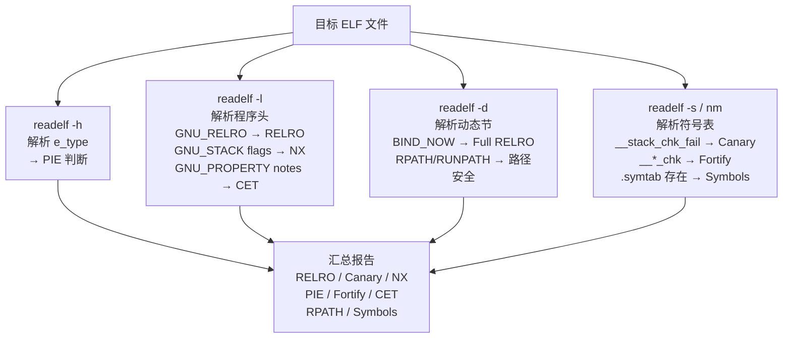
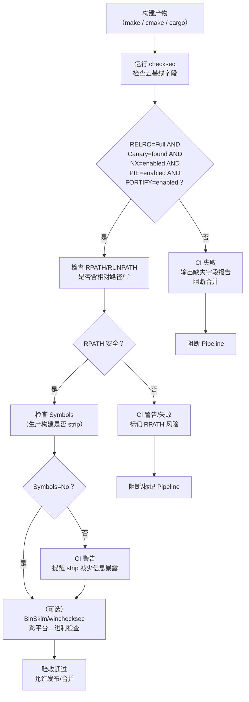
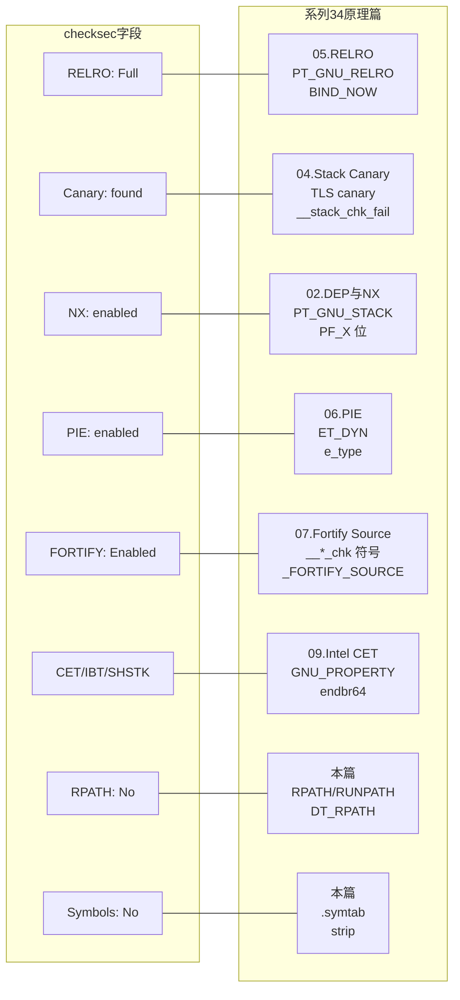

# 现代二进制防护机制（12）· 加固工具与checksec

> [!abstract] TL;DR
> - `checksec` 通过解析 ELF 程序头、节头与符号表，一次性汇报 RELRO/Canary/NX/PIE/Fortify/CET/RPATH/Symbols 等所有关键加固状态——**每个字段对应本系列一篇原理章**。
> - 加固编译选项不是独立开关的随机组合，而是一套**有内在逻辑的纵深防御配置**：缺任何一项都对应一条仍然开放的利用路径。
> - 各平台（Linux/Windows/macOS）有不同的验收工具，但核心思路一致：让工具替代人工逐字段核查，把验收结果嵌入 CI 门控。
> - 本篇是全系列**收官实战篇**，串起 01–11 篇所有机制，给出可直接落地的编译模板与验收清单。

---

## 概述与定位

### 这一篇解决什么问题

前 11 篇把每项防护机制的原理、实现与绕过边界讲透了，但工程上仍有一个问题没有解决：**如何确认一个交付二进制真正开启了所有应该开启的保护？**

手工 `readelf -l`、`readelf -s`、`readelf -n` 逐项比对费时且容易遗漏。`checksec` 把这些操作自动化，并以人类可读的格式输出。本篇做三件事：

1. 逐字段讲清 `checksec` **检测什么、怎么检测**，理解为什么它能代表对应防护的"开启与否"。
2. 给出**加固编译选项汇总表**（口径与 [[33.二进制漏洞与利用基础/14.安全开发与防御.md]] 一致，本系列视角补全细节）。
3. 讲解**三平台验收工具**并给出**CI 集成模板**与**加固检查清单**，把防护验收嵌入发布流程。

### 挡哪类攻击

`checksec` 本身不防御任何攻击——它是**验收工具**，帮助发现"该开未开"的防护缺口。缺口对应的攻击详见各原理篇。

---

## checksec 详解

### 工具来源与安装

`checksec` 最初由 Tobias Klein 开发，后由 pwntools 项目维护，现有两个主要形态：

```bash
# 方式 A：通过 pwntools 附带
pip install pwntools
checksec --file=./target

# 方式 B：独立 shell 脚本版（slimmer，无 Python 依赖）
wget https://raw.githubusercontent.com/slimm609/checksec.sh/master/checksec
chmod +x checksec
./checksec --file=./target
```

> [!warning] 示例输出为示意
> 以下所有 checksec 输出均为**示意值**，非本机实跑，实际地址/版本号因环境而异。

### 典型输出

```
[*] './demo'
    Arch:       amd64-64-little
    RELRO:      Full RELRO
    Stack:      Canary found
    NX:         NX enabled
    PIE:        PIE enabled
    FORTIFY:    Enabled
    FORTIFY_FOUND: 2
    Symbols:    No
    RPATH:      No RPATH
    RUNPATH:    No RUNPATH
```

> [!warning] 示例输出为示意

---

### 逐字段解读

#### Arch（架构）

纯信息字段，来自 ELF header `e_machine`（`EM_X86_64`=62，`EM_AARCH64`=183 等）与 `EI_DATA`（大小端）。不涉及安全，但影响 ROP gadget 搜索策略。

---

#### RELRO

**Full RELRO / Partial RELRO / No RELRO**

| 输出 | 含义 |
|---|---|
| Full RELRO | `PT_GNU_RELRO` 段存在，且 `BIND_NOW`/`DT_FLAGS_1 DF_1_NOW` 置位 |
| Partial RELRO | `PT_GNU_RELRO` 存在，但无 `BIND_NOW`（`.got.plt` 仍可写） |
| No RELRO | `PT_GNU_RELRO` 不存在 |

**检测方法**：`checksec` 用 `readelf -l` 查找类型为 `GNU_RELRO` 的程序头；再用 `readelf -d` 检查 `BIND_NOW` 或 `FLAGS_1` 中的 `NOW` 位。

```bash
readelf -l ./demo | grep GNU_RELRO    # 有输出 → 至少 Partial RELRO
readelf -d ./demo | grep BIND_NOW     # 有输出 → Full RELRO
```

> [!warning] 示例输出为示意

**防御含义**：Partial RELRO 只保护 `.got`（非 PLT 部分），`.got.plt` 在延迟绑定期间仍可写，ret2dl-resolve 仍可利用；Full RELRO 把全部 GOT 在加载完成后锁只读，彻底堵死 GOT 改写路径。详见 [[05.RELRO]]、[[11.ELF文件详解/17.got节.md]]、[[14.动态链接与加载器详解/15.加载器视角的安全.md]]。

---

#### Stack（Stack Canary）

**Canary found / No canary found**

**检测方法**：在二进制符号表或动态符号表中查找 `__stack_chk_fail` 符号的引用。若存在，说明编译器插入了 canary 序言/尾声并引用了该函数（失败时调用）。

```bash
readelf -s ./demo | grep __stack_chk_fail
nm ./demo | grep __stack_chk_fail
```

> [!warning] 示例输出为示意

**局限**：有些函数因不含本地数组/指针而被 `-fstack-protector-strong` 跳过，仍无 canary 保护；`__stack_chk_fail` 存在只说明**至少有一个函数**被保护，不代表**所有函数**都被保护。详见 [[04.Stack Canary]]。

---

#### NX（No-eXecute）

**NX enabled / NX disabled**

**检测方法**：查找 `PT_GNU_STACK` 程序头的 `p_flags` 字段。若缺少可执行位（`PF_X`=1），即 flags 为 `RW`（`PF_R|PF_W` = 0x6），则 NX enabled；若 flags 为 `RWE`（0x7），则 NX disabled。

```bash
readelf -l ./demo | grep GNU_STACK
# 输出示意：GNU_STACK  0x... 0x... RW   0x10   → NX enabled
#           GNU_STACK  0x... 0x... RWE  0x10   → NX disabled
```

> [!warning] 示例输出为示意

若二进制完全不含 `PT_GNU_STACK`，内核默认行为取决于架构（x86-64 通常默认可执行——这是危险的默认值）。详见 [[02.DEP与NX]]。

---

#### PIE（Position Independent Executable）

**PIE enabled / No PIE**

**检测方法**：读 ELF header 中的 `e_type` 字段。`ET_DYN`（值=3）表示位置无关可执行文件（也是共享库的类型），`ET_EXEC`（值=2）表示固定地址可执行文件。

```bash
readelf -h ./demo | grep Type
# ET_DYN → PIE enabled
# ET_EXEC → No PIE
```

> [!warning] 示例输出为示意

**注意**：`ET_DYN` 是必要但不充分条件——用 `-fPIE -pie` 编译的 ELF 才既是 ET_DYN 又有主程序的 ASLR 效果；共享库本身也是 ET_DYN，但这不等于"主程序基址随机"。详见 [[06.PIE]]、[[14.动态链接与加载器详解/09.ASLR与位置无关代码.md]]。

---

#### FORTIFY / FORTIFY_FOUND

**Enabled / Disabled，以及检测到的 `_chk` 符号数量**

**检测方法**：在符号表中搜索 `__*_chk` 前缀的符号（`__memcpy_chk`、`__strcpy_chk`、`__sprintf_chk`、`__printf_chk` 等）。存在至少一个即为 Enabled，数量即 FORTIFY_FOUND 的值。

```bash
readelf -s ./demo | grep '_chk'
```

> [!warning] 示例输出为示意

**局限**：源文件中没有用到对应的危险函数，`_chk` 符号自然不出现——这不等于该二进制"不需要 FORTIFY"，而可能只是恰好本文件没用；因此 FORTIFY Disabled 的结论要结合代码上下文理解。详见 [[07.Fortify Source]]。

---

#### CET / SHSTK / IBT

较新版本的 checksec 支持检测 Intel CET 标记：

**检测方法**：在 ELF notes（`.note.gnu.property` 节）中查找 `GNU PROPERTY` 类型的条目，具体为：
- `GNU_PROPERTY_X86_FEATURE_1_IBT`（bit 0）：IBT 标记
- `GNU_PROPERTY_X86_FEATURE_1_SHSTK`（bit 1）：Shadow Stack 标记

```bash
readelf -n ./demo | grep -A5 "GNU_PROPERTY"
# 示意：
# Properties: x86 feature: IBT, SHSTK
```

> [!warning] 示例输出为示意

这两个标记由 `-fcf-protection=full` 编译时写入；内核和 glibc 在加载时检查并决定是否激活硬件 CET。详见 [[09.Intel CET]]。

---

#### RPATH / RUNPATH

**No RPATH / RPATH set / No RUNPATH / RUNPATH set**

**检测方法**：`readelf -d` 查找 `DT_RPATH` 和 `DT_RUNPATH` 动态条目。

```bash
readelf -d ./demo | grep -E "RPATH|RUNPATH"
```

> [!warning] 示例输出为示意

**安全含义**：`RPATH`/`RUNPATH` 硬编码了动态链接器的搜索路径。若包含 `.` 或相对路径，攻击者可通过在当前目录放置同名恶意 DSO（DLL planting 的 Linux 变体）劫持动态链接。生产二进制不应含 `RPATH`，或只含绝对的系统路径。

---

#### Symbols

**No Symbols / Symbols present**

**检测方法**：检查 `.symtab` 节是否存在（`readelf -s` 有无非动态符号表条目）。

调试符号（`-g`）不影响安全，但会大幅降低逆向难度：函数名、变量名、行号信息直接暴露给攻击者，辅助 gadget 定位和漏洞分析。生产二进制应在 `strip` 后发布。

---

### checksec 工作原理总结



---

## 加固编译选项汇总表

> [!warning] 教学环境说明
> 前各篇为了复现教学现象使用了 `-fno-stack-protector -no-pie -z execstack` 等关闭防护。**下表是生产构建应开启的选项**，与 [[33.二进制漏洞与利用基础/14.安全开发与防御.md]] 口径一致，并补充了系列 34 各篇的原理出处与性能开销。

| 编译/链接选项 | 防御目标 | 对应 checksec 字段 | 本系列篇章 | 开销 |
|---|---|---|---|---|
| `-fstack-protector-strong` | 在含本地数组/指针的函数插入 canary，检测栈线性覆盖 | Stack: Canary found | [[04.Stack Canary]] | < 1%（典型负载）|
| `-D_FORTIFY_SOURCE=2` | 为 `memcpy`/`strcpy`/`sprintf` 等插入运行期长度检查，`=3` 覆盖更多调用点 | FORTIFY: Enabled | [[07.Fortify Source]] | < 1%（静态可折叠）|
| `-D_FORTIFY_SOURCE=3` | 同上，更强覆盖（glibc 2.34+/Clang 12+） | FORTIFY: Enabled | [[07.Fortify Source]] | 与 `=2` 相当 |
| `-fPIE -pie` | 生成位置无关可执行文件，使主程序基址可被 ASLR 随机化 | PIE: PIE enabled | [[06.PIE]]、[[03.ASLR深入]] | < 1%（x86-64）|
| `-Wl,-z,relro,-z,now` | Full RELRO：加载期解析全符号后锁 GOT 只读，堵 GOT 改写与 ret2dl-resolve | RELRO: Full RELRO | [[05.RELRO]]、[[11.ELF文件详解/17.got节.md]] | 冷启动 < 10 ms，长期运行可忽略 |
| `-Wl,-z,noexecstack` | 将 `PT_GNU_STACK` 标记为不可执行（NX/W^X） | NX: NX enabled | [[02.DEP与NX]] | 零（PTE 标志位）|
| `-fcf-protection=full` | 启用 Intel CET：IBT（endbr64）+ Shadow Stack，挡 ROP/JOP | CET/IBT/SHSTK | [[09.Intel CET]] | < 5%（IBT ≈ 0.5–2%，SHSTK < 2%）|
| `-fstack-clash-protection` | 在栈增长时强制探测页（probe），防止越过 guard page 跳入堆/映射区 | 无独立字段 | [[04.Stack Canary]]（stack clash）| < 1% |
| `-fsanitize=cfi` | 软件 CFI：为每次间接调用插入类型检查，收窄合法跳转目标集 | 无独立字段 | [[08.CFI控制流完整性]] | 1–10%（依间接调用密度）|
| `-Wformat-security -Werror=format-security` | 对非字面量格式串发 warning/error，防格式化字符串漏洞 | 无独立字段 | [[07.Fortify Source]]（结合）| 零（编译期检查）|
| `strip` 去符号 | 删除 `.symtab` 节，增加逆向难度 | Symbols: No | 本篇 | 减小二进制体积 |

### 生产构建一行模板（Linux GCC/Clang）

```bash
# 基础加固（L2 标准级）
CFLAGS="-O2 -D_FORTIFY_SOURCE=2 \
        -fstack-protector-strong \
        -fstack-clash-protection \
        -fPIE \
        -Wformat-security -Werror=format-security"

LDFLAGS="-pie \
         -Wl,-z,relro,-z,now \
         -Wl,-z,noexecstack"

# 追加 CET（需 CPU Ice Lake+ 和内核/glibc 支持）
CFLAGS+=" -fcf-protection=full"

# 追加软件 CFI（Clang 专有，需 LTO）
CFLAGS+=" -fsanitize=cfi -flto -fvisibility=hidden"
```

---

## 各平台验证工具

### Linux：checksec / hardening-check

**checksec**（如前所述）是主力工具。**hardening-check**（Debian `devscripts` 包附带）提供另一个视角：

```bash
hardening-check ./demo
# 示意输出：
# ./demo:
#  Position Independent Executable: yes
#  Stack protected: yes
#  Fortify Source functions: yes (some protected functions found)
#  Read-only relocations: yes
#  Immediate binding: yes
#  Stack clash protection: yes
```

> [!warning] 示例输出为示意

两者结合使用可互相印证。`hardening-check` 额外检测 stack-clash protection（通过探测函数调用的代码模式）。

### checksec 批量扫描目录

`checksec` 支持对整个目录批量检测，这在审计第三方 `.so` 依赖库时尤为实用——项目往往自身加固选项齐全，但随附的第三方共享库才是最薄弱的环节。

```bash
# 批量扫描目录下所有可执行文件和共享库
checksec --dir=/path/to/lib/

# 结合 jq 过滤出所有"No RELRO"的库（便于优先修复）
checksec --dir=/path/to/lib/ --output=json | \
  jq -r 'to_entries[] | select(.value.relro != "full") | .key + ": RELRO=" + .value.relro'

# 只看 .so 文件（排除 ELF 可执行文件）
find /path/to/lib/ -name "*.so*" -exec checksec --file={} \;
```

> [!warning] 示例输出为示意

`--dir` 模式会递归遍历目录，对每个 ELF 文件（通过 magic bytes `\x7fELF` 识别，不依赖扩展名）单独运行检测并汇总输出。常见的批量审计场景：

| 场景 | 命令示意 |
|---|---|
| 审计 Android NDK `.so` 打包目录 | `checksec --dir=./app/src/main/jniLibs/arm64-v8a/` |
| 审计 Docker 镜像层的共享库 | 在容器内 `checksec --dir=/usr/lib/` |
| 与 CI 结合生成 RELRO 报告 | `checksec --dir=./dist/ --output=json > relro_report.json` |

批量扫描的结果应重点关注：`No RELRO`（GOT 完全可写，最危险）、`NX disabled`（数据段可执行）、`No canary`（栈溢出无探测）。第三方库的加固状态直接影响整个进程的安全下限——攻击者只需在最弱的库中找到漏洞，就能在最强防护的主程序中造成危害。

### hardening-check 对 `-fstack-clash-protection` 的检测原理

`hardening-check` 对 stack-clash protection 的检测不是简单的符号表查找，而是通过**代码模式识别（pattern matching on function prologue）**来判断函数在扩展栈帧时是否插入了"探测（probe）"代码。

**Stack Clash 攻击的背景**

Stack Clash（CVE-2017-1000364 等）利用的是栈增长越过 guard page 跳入相邻内存映射区的能力：程序一次性分配超过 4 KB（一个 guard page 的大小）的栈空间时，若直接修改 `rsp` 而不触碰中间的 guard page，栈指针就越过了 guard page 落入相邻的堆或其他映射区——后续的栈操作会读写相邻区域的数据，实现跨映射区覆写。

**`-fstack-clash-protection` 的插桩机制**

编译器对每次分配 ≥ 4 KB 的栈空间（即 `rsp -= N` where N ≥ PAGE_SIZE）改为**分页探测循环**：每次只移动 `rsp` 一页（4 KB），并向该页写入一个虚拟值（通常是 `mov [rsp], 0`），确保每一页都被实际访问到，触发缺页中断，让内核有机会检测越界。

```asm
; 无 stack-clash protection：直接分配大栈帧
sub rsp, 0x10000       ; 一次减少 64 KB，越过 guard page

; 有 stack-clash protection：分页探测循环（GCC 生成示意）
probe_loop:
  sub  rsp, 0x1000     ; 每次减少 4 KB（一页）
  mov  QWORD PTR [rsp], 0   ; 探测该页（触发缺页，保证 guard page 被访问）
  cmp  rsp, <target_rsp>
  jg   probe_loop      ; 直到 rsp 达到目标值
```

**hardening-check 的检测方式**

`hardening-check` 使用 `objdump -d` 反汇编二进制，再通过正则表达式匹配以下代码模式来识别是否存在探测循环：

```perl
# hardening-check 内部核心正则（简化示意）
# GCC x86_64 的 stack probe 模式：循环中含 sub rsp, 0x1000 + mov [rsp], 0
if ($disasm =~ /sub\s+\$?0x1000,\s*%rsp.*?mov\s+\$?0x0,\s*\(%rsp\)/s) {
    $stack_clash = "yes";
}
```

这种方式的特点与局限：

| 特点 | 说明 |
|---|---|
| **不依赖符号**：`-fstack-clash-protection` 不产生特殊符号或 ELF note | 反汇编代码模式是唯一可靠的检测手段 |
| **编译器特定**：GCC 和 Clang 生成的探测循环格式略有差异 | `hardening-check` 需要维护多套正则以覆盖不同编译器版本 |
| **误漏情况**：若函数没有大栈帧分配（N < PAGE_SIZE），不需要探测循环，这不等于"未开启保护" | `hardening-check` 报 "Stack clash protection: no" 有时是假阴性 |
| **架构相关**：arm64 的探测模式与 x86_64 不同（使用 `strb wzr, [sp, #0]` 等） | `hardening-check` 主要针对 x86_64，arm64 支持不完整 |

这也是 `checksec` 无此字段的原因——符号表和 ELF notes 均无法反映 stack-clash protection 是否开启，只有代码层面的模式匹配才能检测。

**readelf 手工验证关键命令**：

```bash
# RELRO + BIND_NOW
readelf -l ./demo | grep GNU_RELRO
readelf -d ./demo | grep -E "(BIND_NOW|FLAGS_1)"

# NX
readelf -l ./demo | grep GNU_STACK

# PIE
readelf -h ./demo | grep Type

# Canary
nm ./demo | grep __stack_chk_fail

# Fortify
nm ./demo | grep "_chk"

# CET
readelf -n ./demo | grep -A10 GNU_PROPERTY
```

> [!warning] 示例输出为示意

---

### Windows：BinSkim / winchecksec

**BinSkim** 是 Microsoft 开源的静态分析工具，检查 PE 二进制的安全特性：

```powershell
# 安装（需 .NET SDK）
dotnet tool install --global Microsoft.CodeAnalysis.BinSkim

# 分析
binskim analyze .\demo.exe --output results.sarif
```

> [!warning] 示例输出为示意

BinSkim 检查的 PE 对应项：

| BinSkim 规则 | PE 机制 | 对应 Linux 机制 |
|---|---|---|
| BA2001 | `IMAGE_DLLCHARACTERISTICS_NX_COMPAT` | NX/DEP |
| BA2002 | `ASLR (/DYNAMICBASE)` | PIE + ASLR |
| BA2007 | `/GS`（Security Cookie，栈 canary） | `-fstack-protector` |
| BA2008 | SafeSEH | 结构化异常处理保护 |
| BA2025 | `Guard CF (/guard:cf)` | CFI |
| BA2026 | `CETCOMPAT`（CET Shadow Stack） | Intel CET SHSTK |

**winchecksec**（Trailofbits 出品，Rust 实现，输出 JSON）：

```powershell
winchecksec.exe .\demo.exe
```

> [!warning] 示例输出为示意

```json
{
  "aslr": true,
"cfg": true,
  "dep": true,
  "dynamic_base": true,
  "force_integrity": false,
  "gs": true,
  "high_entropy_va": true,
  "isolation": true,
  "rfg": false,
  "seh": true
}
```

> [!warning] 示例输出为示意

### winchecksec JSON 中 `rfg` 字段的含义

`rfg`（Return Flow Guard）是 winchecksec JSON 输出中的一个字段，其名称经常引发混淆，值得专门澄清。

**RFG 是什么**

RFG（Return Flow Guard）是微软在 2016 年 WinHEC 大会上宣布的实验性返回地址保护机制，计划作为后向控制流保护（防 ROP）的解决方案——其本质思路与 Intel CET Shadow Stack 类似：在每次函数调用时将返回地址额外保存到一个受保护区域，函数返回时对比栈上返回地址与受保护副本是否一致。

RFG 使用**线程本地存储（TLS）**（而非硬件 Shadow Stack 内存）存放返回地址副本：

```asm
; RFG 函数序言（编译器插入，伪代码）
mov  rax, [rsp]              ; 读取当前返回地址
xor  rax, <cookie>           ; 与进程 cookie 异或（混淆）
mov  gs:[rsp - some_offset], rax  ; 存入 GS 段偏移的线程局部保护区域

; RFG 函数尾声
mov  rax, gs:[rsp - same_offset]  ; 读出保护副本
xor  rax, <cookie>           ; 解混淆
cmp  rax, [rsp]              ; 与栈上返回地址对比
jne  __RFG_failure           ; 不一致则终止进程
```

**RFG 与 XFG/CET 的关系**

| 机制 | 提出时间 | 状态 | 实现路径 |
|---|---|---|---|
| RFG | 2016 年 WinHEC 宣布 | **已放弃，从未正式发布** | 软件（TLS 存储返回地址副本），编译器 `/guard:rg` |
| CET Shadow Stack | Intel 2016 年规范，Windows 10 20H1 落地 | **现役** | 硬件（CPU Shadow Stack 内存，`MSR_IA32_S_CET`），`/CETCOMPAT` |
| XFG | ~2019 年内部使用 | **现役（部分）** | 软件+硬件混合（类型 hash 扩展 CFG），`/guard:cf,xfg` |

RFG 最终被 Intel CET Shadow Stack 取代——CET 在硬件层面完成了 RFG 想在软件层面做的事，且安全性更强（Shadow Stack 内存由 CPU 强制不可写，而 TLS 区域在一定条件下可被篡改）。

**winchecksec `rfg` 字段的实际含义**

winchecksec 检测 `rfg` 字段的依据是 PE 加载配置表中是否存在 `GuardFlags` 的 `IMAGE_GUARD_RF_INSTRUMENTED`（`0x00020000`）位，以及 `GuardRFFailureRoutineFunctionPointer`、`GuardRFVerifyStackPointerFunctionPointer` 等 RFG 专用字段。

由于 RFG 从未在正式 Windows 版本中启用，**任何生产 PE 的 `rfg` 字段均为 `false`**，这是正常且预期的状态。`rfg: false` 不代表安全缺陷，也不是需要修复的项目。

真正的后向控制流保护应通过 `cet` 字段确认：`/CETCOMPAT` 编译的 PE 在 winchecksec 中对应 `cet: true`（部分版本字段名为 `cetcompat`）。若想验证返回地址保护，应检查 `cet` 而非 `rfg`。

Windows 防护体系原理详见 [[10.Windows防护体系]]。

---

### macOS：codesign / otool

macOS 的保护机制（代码签名、Hardened Runtime、PAC、SIP）与 ELF/PE 的机制层次不同，验证工具也不同：

```bash
# 查看代码签名状态与 Hardened Runtime
codesign -dv --entitlements - ./demo.app

# 查看 Mach-O 段标志（栈保护相关）
otool -l ./demo | grep -A5 "__LINKEDIT"

# 查看架构（是否 arm64e，即支持 PAC）
lipo -info ./demo
# 或
file ./demo

# 查看 Mach-O load commands（等价于 ELF 程序头）
otool -l ./demo | grep -A5 "LC_SEGMENT"
```

> [!warning] 示例输出为示意

| macOS 特性 | 验证方式 | 对应 Linux 机制 |
|---|---|---|
| 代码签名（强制） | `codesign -dv` | —（Linux 无强制代码签名）|
| Hardened Runtime | `codesign -dv` 看 entitlements | 近似 seccomp |
| PAC（指针认证） | `lipo -info`/`file` 看 arm64e | Intel CET IBT/SHSTK |
| SIP | `csrutil status`（需重启恢复模式）| 近似 SELinux/AppArmor |
| ASLR | 默认开启，Mach-O PIE 由链接器控制 | PIE + kernel ASLR |

macOS/iOS 防护原理详见 [[11.macOS与iOS防护]]。

---

## CI 集成与加固验收流程

### 加固验收流程图



---

### GitHub Actions 集成示例

```yaml
# .github/workflows/hardening-check.yml
name: Hardening Check
on: [push, pull_request]

jobs:
  build-and-check:
    runs-on: ubuntu-latest
    steps:
      - uses: actions/checkout@v4

      - name: Build with hardening flags
        run: |
          make CFLAGS="-O2 -D_FORTIFY_SOURCE=2 -fstack-protector-strong \
                        -fstack-clash-protection -fPIE -Wformat-security \
                        -Werror=format-security" \
               LDFLAGS="-pie -Wl,-z,relro,-z,now -Wl,-z,noexecstack"

      - name: Install checksec
        run: pip install pwntools

      - name: Run checksec
        run: |
          checksec --file=./build/demo --output=json > checksec_result.json
          cat checksec_result.json

      - name: Assert hardening baseline
        run: |
          python3 - <<'EOF'
          import json, sys
          with open("checksec_result.json") as f:
              data = json.load(f)
          binary = list(data.values())[0]
          failures = []
          if binary.get("relro") != "full":
              failures.append("RELRO: not Full RELRO")
          if binary.get("canary") != "yes":
              failures.append("Canary: not found")
          if binary.get("nx") != "yes":
              failures.append("NX: disabled")
          if binary.get("pie") != "yes":
              failures.append("PIE: disabled")
          if binary.get("fortify_source") != "yes":
              failures.append("FORTIFY: disabled")
          if failures:
              print("HARDENING CHECK FAILED:")
              for f in failures:
                  print(f" - {f}")
              sys.exit(1)
          print("All hardening checks passed.")
          EOF
```

> [!warning] 示例输出为示意
> checksec JSON 字段名因版本而异（`relro`/`RELRO` 等），使用前请对照实际安装版本的输出格式调整解析逻辑。

---

### Makefile 集成片段

```makefile
CFLAGS  := -O2 -D_FORTIFY_SOURCE=2 -fstack-protector-strong \
            -fstack-clash-protection -fPIE \
            -Wformat-security -Werror=format-security
LDFLAGS := -pie -Wl,-z,relro,-z,now -Wl,-z,noexecstack

.PHONY: hardening-check
hardening-check: $(TARGET)
	checksec --file=$(TARGET)
	@echo "--- Asserting Full RELRO ---"
	readelf -l $(TARGET) | grep -q GNU_RELRO || (echo "FAIL: No RELRO" && exit 1)
	readelf -d $(TARGET) | grep -q BIND_NOW  || (echo "FAIL: No BIND_NOW (Partial RELRO only)" && exit 1)
	@echo "Hardening check passed."
```

---

## 加固检查清单

以下清单用于**发布前人工/自动化验收**，对应本系列各原理篇的"如何开启"小节。

### 编译选项清单

- [ ] `-fstack-protector-strong`（或 `-all`）已在 CFLAGS 中——防止栈线性溢出，详见 [[04.Stack Canary]]
- [ ] `-D_FORTIFY_SOURCE=2`（或 `=3`）已在 CFLAGS 中——运行期危险函数边界检查，详见 [[07.Fortify Source]]
- [ ] `-fPIE` 已在 CFLAGS，`-pie` 已在 LDFLAGS——主程序基址可随机，详见 [[06.PIE]]、[[03.ASLR深入]]
- [ ] `-Wl,-z,relro,-z,now` 已在 LDFLAGS——Full RELRO 锁 GOT，详见 [[05.RELRO]]
- [ ] `-Wl,-z,noexecstack` 已在 LDFLAGS——栈不可执行，详见 [[02.DEP与NX]]
- [ ] `-fstack-clash-protection` 已在 CFLAGS——防 stack clash
- [ ] `-fcf-protection=full`（CET 可用时）已在 CFLAGS——硬件 ROP/JOP 防护，详见 [[09.Intel CET]]
- [ ] `-Wformat-security -Werror=format-security` 已在 CFLAGS——格式串漏洞防护
- [ ] 生产二进制已 `strip`——减少符号信息暴露

### checksec 验收清单

- [ ] `RELRO: Full RELRO`
- [ ] `Stack: Canary found`
- [ ] `NX: NX enabled`
- [ ] `PIE: PIE enabled`
- [ ] `FORTIFY: Enabled`
- [ ] `RPATH: No RPATH`（或仅含绝对系统路径）
- [ ] `Symbols: No`（生产构建）

### CI 门控清单

- [ ] checksec 验收步骤已加入 CI Pipeline
- [ ] 五基线字段任一不满足时 Pipeline 失败并阻断合并
- [ ] RPATH 检查已加入（警告或失败）
- [ ] Windows 目标已集成 BinSkim 或 winchecksec
- [ ] macOS 目标已集成 codesign 签名验证

---

## 串起全系列：各篇机制与 checksec 字段对照

本篇是系列 34 的收官实战篇，每项防护在前各篇均有深入讲解：



**攻防对照**（本系列 34 与系列 33 的成对关系）：

| 系列 33 攻击篇 | 利用技术 | 系列 34 防护篇 | checksec 字段 |
|---|---|---|---|
| [[33.二进制漏洞与利用基础/03.Shellcode概念.md]] | shellcode 注入执行 | [[02.DEP与NX]] | NX |
| [[33.二进制漏洞与利用基础/05.ret2libc.md]] | 固定地址 ret2libc | [[06.PIE]] + [[03.ASLR深入]] | PIE |
| [[33.二进制漏洞与利用基础/04.栈Canary原理.md]] | 绕过 / 泄露 canary | [[04.Stack Canary]] | Stack |
| [[33.二进制漏洞与利用基础/07.GOT劫持与ret2dl-resolve.md]] | GOT 改写 / ret2dl | [[05.RELRO]] | RELRO |
| [[33.二进制漏洞与利用基础/06.ROP入门.md]] | ROP 链 | [[09.Intel CET]] + [[08.CFI控制流完整性]] | CET |
| [[33.二进制漏洞与利用基础/08.格式化字符串漏洞.md]] | `%n` 任意写 | [[07.Fortify Source]] | FORTIFY |
| [[33.二进制漏洞与利用基础/11.整数溢出与类型混淆.md]] | 分配大小溢出 | [[07.Fortify Source]]（`_chk` 拦截）| FORTIFY |

---

## 绕过边界与残余风险

`checksec` 五绿是**必要基线**，但不等于"无法被利用"。残余风险：

| 字段全绿后的残余风险 | 参见 |
|---|---|
| 信息泄露漏洞可以破解 ASLR + PIE，使随机化失效 | [[33.二进制漏洞与利用基础/13.现代利用与信息泄露.md]] |
| Canary 仅保护**含本地数组/指针**的函数；堆漏洞/非线性写可绕过 | [[04.Stack Canary]] |
| Full RELRO 保护 GOT，但 `.data`/`.bss` 段的函数指针、C++ vtable 仍可改写 | [[05.RELRO]] |
| Fortify 只保护编译器能静态推断大小的缓冲区，动态分配的堆块不受保护 | [[07.Fortify Source]] |
| CET IBT 是粗粒度（任何带 `endbr64` 的位置都是合法落点），需配合软件 CFI | [[09.Intel CET]]、[[08.CFI控制流完整性]] |
| 第三方依赖库可能未开启相同加固选项，成为最薄弱环节 | — |

> [!warning] 重要提示
> `checksec` 验收是**最低门控**，不是安全的终点。安全需要：源码层安全编码（详见 [[33.二进制漏洞与利用基础/14.安全开发与防御.md]]）+ 编译加固 + CI 测试（ASan/Fuzzing）+ 运行时沙箱（seccomp/AppArmor）的**纵深防御叠加**。

---

## 小结

1. **`checksec` 把人工 `readelf` 操作自动化**：每个字段对应一个 ELF 结构特征（PT_GNU_RELRO、`__stack_chk_fail` 符号、PT_GNU_STACK PF_X 位、ET_DYN、`_chk` 符号、GNU PROPERTY），检测逻辑完全透明可验证。

2. **加固编译选项是有内在逻辑的纵深防御配置**：`-fstack-protector-strong` 守栈、`-D_FORTIFY_SOURCE=2` 守危险函数、`-fPIE -pie` 使 ASLR 作用于主程序、`-Wl,-z,relro,-z,now` 锁 GOT、`-Wl,-z,noexecstack` 封 shellcode 执行、`-fcf-protection=full` 硬件级守控制流——缺任何一项都对应一条仍开放的利用路径。

3. **三平台验收工具各有侧重**：Linux 用 checksec/hardening-check，Windows 用 BinSkim/winchecksec，macOS 用 codesign/otool——原理不同但目的相同：让机器替代人工检查每个防护位。

4. **CI 门控是把验收从"偶尔人工"变为"每次必查"的关键**：把 checksec 嵌入 Pipeline，五基线不满足就阻断合并，确保加固选项不会被偶尔的构建配置漂移悄悄丢掉。

5. **`checksec` 五绿是必要基线，不是充分条件**：信息泄露、vtable 改写、第三方库弱加固等残余风险仍需配合源码安全开发（[[33.二进制漏洞与利用基础/14.安全开发与防御.md]]）、ASan/Fuzzing、运行时沙箱共同应对。

---

## 相关阅读

- [[01.防护机制全景]] — 全系列战略地图，攻防演进史与纵深防御理念
- [[02.DEP与NX]] — NX/W^X 硬件实现，对应 checksec NX 字段
- [[03.ASLR深入]] — 地址空间随机化各区域熵与绕过
- [[04.Stack Canary]] — TLS canary 实现，`__stack_chk_fail` 检测机制
- [[05.RELRO]] — PT_GNU_RELRO 与 BIND_NOW，Full vs Partial 差异
- [[06.PIE]] — ET_DYN 主程序，使主程序基址可随机
- [[07.Fortify Source]] — `__*_chk` 符号，`_FORTIFY_SOURCE` 三个级别
- [[08.CFI控制流完整性]] — 软件 CFI，配合 CET 收窄合法 gadget 集
- [[09.Intel CET]] — GNU_PROPERTY CET 标记，IBT + Shadow Stack
- [[10.Windows防护体系]] — GS/DEP/CFG/XFG/ACG，BinSkim 验收
- [[11.macOS与iOS防护]] — 代码签名/PAC/Hardened Runtime，codesign 验收
- [[11.ELF文件详解/17.got节.md]] — GOT 结构与 RELRO 攻防深度
- [[14.动态链接与加载器详解/15.加载器视角的安全.md]] — RELRO 实现、ret2dl-resolve、AT_SECURE
- [[14.动态链接与加载器详解/09.ASLR与位置无关代码.md]] — ASLR/PIE 口径
- [[33.二进制漏洞与利用基础/14.安全开发与防御.md]] — 攻击侧防御收官，编译选项口径互补
- [[33.二进制漏洞与利用基础/12.缓解机制总览.md]] — 系列 33 缓解总览，攻击对照
- [[00.现代二进制防护机制总览]] — 系列导航

---

⬅️ 上一篇 [[11.macOS与iOS防护]] ｜ 🏠 [[00.现代二进制防护机制总览]] ｜ 下一篇 [[00.现代二进制防护机制总览]] ➡️
