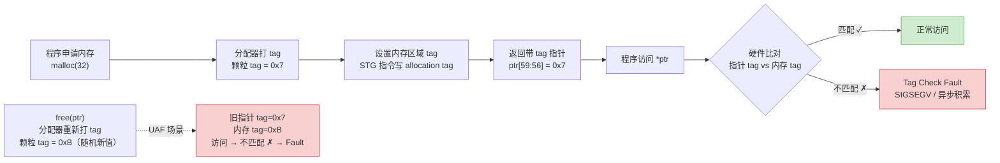

# 现代二进制防护机制（13）· MTE 内存标签扩展

> [!abstract] TL;DR
> - **MTE（Memory Tagging Extension）** 是 ARMv8.5-A 引入的硬件内存安全机制：每 16 字节"颗粒"关联一个 4-bit 标签，指针高位 bits[59:56] 同时携带标签；访问时 CPU 硬件比对两侧标签，不匹配触发 fault，代价极低（约 1–3% 运行时开销）。
> - **能检测**：线性越界溢出（相邻颗粒 tag 不同）、Use-After-Free（free 后对该颗粒重新打 tag，旧指针的 tag 失配）。
> - **三种运行模式**：Synchronous（精确同步，适合调试/生产安全优先场景）、Asynchronous（异步积累，性能优先）、Asymmetric（非对称混合，2022 年 Android 默认选择）。
> - **Android 落地**：Pixel 8+ 在部分场景默认启用；Scudo 分配器原生集成；内核侧 MTE 加速 KASAN 硬件化。
> - **局限**：16 字节粒度内的溢出检测不到；tag 仅 4 位（16 种）存在碰撞概率；依赖 ARMv8.5-A+ 硬件。

---

## 概述与定位

内存安全漏洞中，堆缓冲区溢出（Heap Buffer Overflow）与 Use-After-Free（UAF）长期位居高危榜首。传统缓解机制（ASLR、NX、canary）能增加利用成本，却无法在漏洞触发的那一刻直接检测越界或悬空指针访问。软件工具 ASAN（AddressSanitizer）能精确检测，但依赖影子内存，运行时开销高达 2–10 倍，无法在生产环境中全量部署。

MTE 的设计目标是把 ASAN 的检测语义做进 CPU 硬件：以极低开销在生产设备上常态化运行，而非只在测试阶段使用。



---

## 原理与机制

### TBI（Top Byte Ignore）：MTE 的基础

MTE 建立在 ARMv8 已有的 **TBI（Top Byte Ignore）** 机制之上。ARM64 虚拟地址只使用低 48 位（或低 52 位，取决于 VA 范围配置），高位字节在地址转换时被硬件忽略。TBI 允许软件在指针 bits[63:56] 存放任意元数据而不影响内存访问——这是 Android 的 **Tagged Pointers** 优化、Google HWASan 的 8-bit tag 方案乃至 MTE 的共同基础。

MTE 在 TBI 基础上进一步规范：

- bits[63:60]：保留给 OS/架构使用（如 PAC 密钥 ID）。
- bits[59:56]：**Logical Address Tag（逻辑标签）**，由软件/分配器管理，随指针传递。
- bits[55:0]：实际虚拟地址。

### 内存侧标签：Allocation Tag

内存标签存储在与主内存**物理隔离**的标签内存中，每 16 字节颗粒（Granule）对应 4 bit 标签。这块标签内存不占用应用程序的虚拟地址空间，也无法通过普通 load/store 直接读写，只能通过专用的 MTE 指令（`STG`、`ST2G`、`STGM`、`LDG` 等）操作：

| 指令 | 说明 |
|---|---|
| `STG [base], imm` | 设置 base 指向颗粒的 allocation tag，tag 取自 base[59:56] |
| `ST2G [base], imm` | 一次设置 2 个连续颗粒的 tag |
| `STGM [base], xt` | MTE Store Tag Multiple，可批量标记整块内存 |
| `LDG [xt], [base], imm` | 读取 allocation tag 到 xt[59:56] |
| `IRG [xt], [xn]` | Insert Random Tag：基于 xn 地址生成伪随机 tag 写入 xt[59:56] |
| `ADDG`/`SUBG` | 带 tag 偏移的指针算术（tag 域与地址域分开计算） |

`IRG`（Insert Random Tag）是分配器生成随机 tag 的核心指令。它使用一个基于 EL1 系统寄存器配置的 LFSR 种子，产生排除指定"禁用 tag 集合"之外的伪随机 4-bit 值——分配器通常会传入相邻块的 tag 作为排除集，确保相邻颗粒几乎总是不同 tag，从而检测线性越界。

### 访问检查：硬件比对流程

每次内存访问（load/store），CPU 地址转换单元（MMU）在完成虚拟→物理地址转换的同时执行 tag check：

1. 取出访问指针的 bits[59:56]（逻辑 tag）。
2. 从标签内存读取目标颗粒的 allocation tag。
3. 比对：若相等，访问继续；若不等，根据模式选择处理方式（见下节）。

这个比对发生在硬件流水线内，正常路径下不增加内存延迟——tag 内存读取与物理内存访问可并行。

---

## 三种运行模式详解

MTE 支持三种 tag check 模式，通过 EL1 寄存器 `SCTLR_EL1.TCF0`（EL0 访问）和 `SCTLR_EL1.TCF`（EL1 访问）配置：

### Synchronous 模式（同步精确模式）

tag 不匹配时立即在**同一指令处**触发同步 Data Abort（`ESR_EL1.EC = 0x25`，DFSC = 0x11）。处理路径清晰，发生错误的指针和地址精确可知，调试友好。但每次检测到不匹配都立即打断流水线，性能敏感场景下开销略高（约 2–3%）。

适合场景：开发测试、安全优先的生产部署（如金融/支付关键路径进程）。

### Asynchronous 模式（异步积累模式）

tag 不匹配时 CPU **不立即触发异常**，而是置位系统寄存器 `TFSRE0_EL1`（或 `TFSR_EL1`，EL1 访问）中的 TF0/TF 位，异常在后续某个"同步点"（如异常返回、系统调用边界）批量上报。单次检测开销极低（约 0.5–1%），但故障报告是异步的——错误发生的精确位置需要通过 MTE 检查日志或其他工具追溯，调试难度高。

适合场景：大规模生产部署的性能基线，如服务端守护进程的全量扫描。

### Asymmetric 模式（非对称模式，ARMv8.7-A 引入）

**读操作**使用同步检查，**写操作**使用异步检查。针对的是漏洞利用中"读越界泄露信息比写越界更危险"的不对称威胁模型——同步阻断读越界，写越界允许异步积累但不影响性能关键写路径。

Android 12 起在 Pixel 设备上将 Asymmetric 模式作为 MTE 的默认配置，在可接受的开销（约 1–2%）下兼顾安全与性能。

### 模式对比

| 模式 | 触发时机 | 精确度 | 开销 | 典型用途 |
|---|---|---|---|---|
| Synchronous | 同一指令立即 | 精确（指令级） | ~2–3% | 开发/调试/安全优先生产 |
| Asynchronous | 延迟批量 | 近似（同步点） | ~0.5–1% | 大规模生产性能基线 |
| Asymmetric | 读同步/写异步 | 读精确/写近似 | ~1–2% | Android 生产默认（Pixel 8+）|

---

## 能检测的漏洞类型与检测边界

### 堆缓冲区越界（线性溢出）

分配器为每次 `malloc` 分配的内存块打一个随机 tag，**相邻颗粒（即相邻分配块的边界颗粒）被强制赋予不同 tag**（通过 `IRG` 的排除集机制）。越界访问进入相邻颗粒时，指针 tag 与目标颗粒 allocation tag 不匹配，触发 fault。

检测盲区：**16 字节颗粒内部**的越界无法检测。例如分配 17 字节、颗粒覆盖到 32 字节，在前 32 字节颗粒范围内（即第 18–32 字节）越界访问仍拿同一个 tag，MTE 无感知。这是 MTE 与 ASAN 相比最显著的检测粒度差距——ASAN 的"redzone"可以细化到字节级。

### Use-After-Free（UAF）

分配器在 `free` 之后对该内存块的所有颗粒执行 **retag**：用新的（不同的）随机 tag 覆写 allocation tag。持有旧 tag 的指针再次访问该内存时，指针 tag ≠ allocation tag，触发 fault。

这是 MTE 相对 canary 最核心的价值扩展——canary 只保护栈上的函数返回地址，对堆 UAF 无能为力；MTE 直接在硬件层面使 UAF 原语失效。

### 不能检测的场景

- **栈缓冲区溢出**：MTE 主要针对堆；栈 MTE 支持需要编译器在栈分配时插入 `STG` 指令，目前尚未广泛部署。
- **类型混淆（Type Confusion）**：同一颗粒内不同类型字段的错误解释，tag 相同，无法检测。
- **整数溢出导致的错误长度**：计算出的 size 本身错误，分配和访问都在合法 tag 范围内。
- **信息泄露（读越界 + 泄露内容）**：Synchronous 模式能中断访问，但如果漏洞通过 speculative execution 侧信道泄露，MTE 无帮助。

---

## 工具视角与实战

### 编译器支持（Clang/GCC）

```bash
# Clang 11+ 原生支持 MTE intrinsic
# Android NDK r23+ 支持 MTE 目标

# 编译时启用 MTE 目标特性（ARMv8.5-A + memtag）
clang -march=armv8.5-a+memtag \
      -fsanitize=memtag         \
      -fsanitize-memtag-mode=sync \
      -o target source.c

# 异步模式
clang -march=armv8.5-a+memtag \
      -fsanitize=memtag \
      -fsanitize-memtag-mode=async \
      -o target source.c
```

`-fsanitize=memtag` 让编译器在 `malloc`/`free` 的包裹函数中插入 `IRG`/`STG` 指令，并在栈分配（如果启用 stack MTE）时插入相应标签指令。

### Scudo 分配器集成

Android 默认堆分配器 **Scudo** 原生集成 MTE 支持，不需要额外编译选项——只需运行在 MTE 硬件上，Scudo 即自动：

1. 每次 `malloc` 调用 `IRG` 生成随机 tag。
2. 用 `STGM` 批量设置分配块内所有颗粒的 allocation tag。
3. 返回携带该 tag 的指针（高位 bits[59:56] 已置位）。
4. `free` 时用 `IRG` 生成新 tag，`STGM` 重新标记所有颗粒。

这使 MTE 对应用层完全透明——只要 APK 运行在 Pixel 8+ 设备且系统版本 ≥ Android 14，堆 UAF 和越界保护自动生效。

### 内核侧：MTE for KASAN

Linux 内核 5.15+ 支持用 MTE 硬件加速 KASAN（Kernel Address Sanitizer）：

- 传统 KASAN 使用影子内存，每 8 字节对应 1 字节影子，内存开销约 12.5%。
- **MTE-KASAN（也称 HW-tag-KASAN）** 利用 MTE 的 EL1 tag check，内核堆分配使用 ARMv8.5 tag 机制，理论影子内存开销降为 0（tag 存储在独立标签内存），运行时开销约 1% 量级。
- 内核配置：`CONFIG_KASAN=y` + `CONFIG_KASAN_HW_TAGS=y`，需要内核以 `-march=armv8.5-a+memtag` 编译。

### 运行时检测与报告

同步模式下，tag 不匹配产生 `SIGSEGV`，信号信息中包含：

```
SIGSEGV (fault addr 0x1234567890, cause: tag-check-fault-setting)
```

`android.os.Build.SOC_MODEL` 可用于运行时查询硬件 MTE 支持；`/proc/cpuinfo` 特性行中出现 `memtag` 表示内核已启用 MTE。

```bash
# 检查设备 MTE 支持（Android adb shell）
grep -i memtag /proc/cpuinfo
# 或
getprop ro.product.cpu.abilist64   # 看是否支持 arm64-v8a
adb shell getprop persist.arm64.memtag.app_default  # Pixel 8+ 上查看默认模式
```

### 与 HWASan 的关系

HWASan（Hardware-assisted AddressSanitizer）是 Google 早于 MTE 的软件方案，也基于 TBI，使用 8-bit 影子 tag（`AArch64 TSB`），每次访问通过 shadow lookup 比对。MTE 正式落地后，HWASan 在 ARMv8.5-A 设备上可以直接使用 MTE 硬件（`-fsanitize=hwaddress` + 支持 MTE 的内核），把影子查找替换为硬件 tag check，大幅降低开销。

---

## 安全性与正确使用

> [!note] MTE 的防御边界与合规声明
> 本节分析 MTE 的检测盲区与局限，目的是指导工程师正确配置分配器和测试策略，而非描述如何规避 MTE 检测。MTE 是防御机制，生产环境中的检测触发应视为安全事件。

### tag 碰撞概率分析

4-bit tag 仅有 16 种可能值。同一颗粒被 retag 后，新旧 tag 相同的概率为 1/15（排除自身，分配器通常在重分配时排除旧 tag）。攻击者若能精确控制 UAF 时机并猜测 tag，单次猜中概率约 6.7%——在真实利用场景中，需要多次尝试且每次失败都触发 fault（Synchronous 模式立即崩溃），实际利用难度极高。

若攻击者能通过旁路（如时序分析或对 `IRG` 的 LFSR 状态建模）预测 tag 序列，则碰撞威胁升级。Android 的 Scudo 实现中 LFSR 种子通过 `RDRAND`/`getrandom` 初始化，增加预测难度。

### 16 字节粒度盲区的工程缓解

对于安全敏感的代码（如解析外部输入的缓冲区），建议：

1. **对齐分配**：确保关键缓冲区的起止都对齐到 16 字节边界，让越界访问立即进入相邻颗粒（不同 tag 区域）而非同颗粒内部盲区。
2. **ASAN 补充测试**：开发阶段用 ASAN 覆盖 MTE 检测不到的字节级越界，生产阶段用 MTE 的低开销全量保护。
3. **Scudo chunk-rounding 配置**：Scudo 支持配置对分配大小向上取整到 16 字节倍数，减少颗粒内部空白。

### 与其他机制的叠加

MTE 专注于**内存访问合法性**（指针是否指向分配时打标签的区域），不保护控制流（需要 BTI/PAC/CFI）、不保护加密密钥完整性（需要机密计算或硬件安全区）。生产级 ARM64 二进制的完整防护栈：

| 层 | 机制 | 保护目标 |
|---|---|---|
| 内存访问合法性 | **MTE** | 堆越界/UAF 检测 |
| 返回地址 | **PAC + ShadowCallStack** | ROP 缓解 |
| 间接跳转 | **BTI + CFI** | JOP/COP 缓解 |
| 栈溢出 | **Stack Canary + SafeStack** | 栈缓冲区溢出 |
| 空间随机化 | **ASLR + PIE** | 地址预测 |

---

## 小结

1. **MTE 的核心创新**在于把标签比对做进了硬件 MMU，每 16 字节颗粒附带 4-bit allocation tag，指针高位携带 logical tag，访问时自动比对，检测成本接近于零。
2. **三种模式**（同步/异步/非对称）适应不同场景：同步模式调试精确，异步模式性能最优，非对称模式（Android 默认）在读安全与写性能之间取得平衡。
3. **检测覆盖**：线性溢出（依赖相邻颗粒 tag 不同）和 UAF（依赖 free 后 retag）是 MTE 最有效的场景；16 字节粒度内越界、类型混淆等超出检测范围。
4. **Android 生态落地**：Scudo 分配器无缝集成，Pixel 8+ 部分默认开启，内核 MTE-KASAN 将保护延伸至内核堆，是目前最成熟的移动端生产级内存安全部署。
5. **与 ASAN 互补**：ASAN 覆盖开发/测试阶段的字节级精确检测，MTE 覆盖生产阶段的低开销颗粒级常态检测，两者结合才能完整闭合测试到生产的安全检测链。

---

## 相关阅读

- **栈影子保护（返回地址与局部变量分离保护）**：[[14.SafeStack与ShadowCallStack]]
- **PAC 指针认证（ARM 后向 CFI，与 MTE 同为 ARMv8.5-A 新特性）**：[[09.Intel CET]]（PAC 对比章节）
- **加固工具检测 MTE 状态**：[[12.加固工具与checksec]]
- **整体防护机制协同**：[[00.现代二进制防护机制总览]]

---

⬅️ 上一篇 [[12.加固工具与checksec]] ｜ 🏠 [[00.现代二进制防护机制总览]] ｜ 下一篇 [[14.SafeStack与ShadowCallStack]] ➡️
