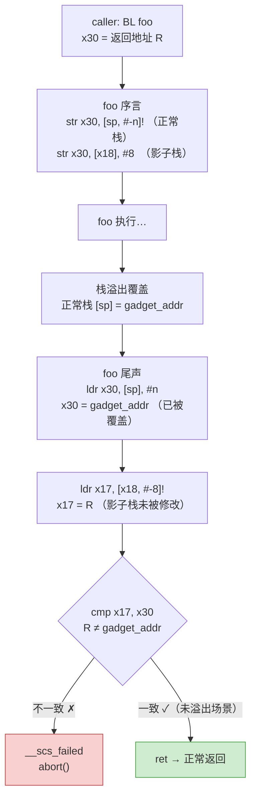

# 现代二进制防护机制（14）· SafeStack 与 ShadowCallStack

> [!abstract] TL;DR
> - **SafeStack**（Clang `-fsanitize=safe-stack`）：编译期分析将"不安全"局部变量（取地址的缓冲区/数组）移到独立的 unsafe stack，返回地址与类型安全变量留在 safe stack，溢出难以跨栈触达返回地址，防御栈缓冲区溢出覆盖返回地址。
> - **ShadowCallStack**（Clang `-fsanitize=shadow-call-stack`，主要针对 AArch64）：用保留寄存器 `x18` 指向影子栈；函数序言把链接寄存器 `LR`（即 `x30`）压入影子栈，尾声取回与 `LR` 比对，不一致则终止——仅保护返回地址，实现简洁高效。
> - **对比 Intel CET Shadow Stack**：CET 是硬件影子栈，CPU 自动维护，无需 CPU 寄存器占用；ShadowCallStack 是纯软件方案，不依赖 ARMv8.5-A，Android 系统库与内核广泛部署。
> - **叠加价值**：两者与 stack canary、CFI 互补，canary 防检测型 PoC，SafeStack 阻断溢出路径，ShadowCallStack 保护返回地址，CFI 保护间接调用目标。

---

## 概述与定位

### 栈布局的安全困境

函数调用栈的经典布局将返回地址、帧指针、局部变量（含数组/缓冲区）紧密排列在同一内存区域。攻击者通过局部缓冲区的线性溢出，可以以确定的偏移覆盖返回地址，实现控制流劫持。Stack canary 在返回地址下方插入随机值，能检测这类覆盖——但 canary 只能检测、不能从根源上阻断，且对已知 canary 值（泄露/爆破）的攻击无效。

SafeStack 和 ShadowCallStack 采取了两种互补的根本性策略：

- **SafeStack**：把"危险数据"（可被溢出的缓冲区）和"关键数据"（返回地址）**物理隔离**到不同地址空间，溢出无法线性触达。
- **ShadowCallStack**：把返回地址**额外保存**到独立影子栈，函数返回前校验一致性，即便正常栈返回地址被覆盖也能检测。

两者都是**纯软件机制**，不依赖特定 CPU 新特性（SafeStack 跨架构；ShadowCallStack 依赖 `x18` 保留寄存器约定，实质上是 AArch64 专属），可在 Android 5.0 时代的 ARM64 设备上部署。

---

## 原理与机制

### SafeStack：双栈布局

#### 安全性分析与分类

编译器在函数分析阶段对每个局部变量执行**安全性分析（Safety Analysis）**，判断该变量是否可以被攻击者用来实施栈溢出：

**不安全变量（移入 unsafe stack）的判定条件：**

1. **数组或非平凡大小的缓冲区**（如 `char buf[128]`）——典型溢出载体。
2. **取了地址的变量**（`&local_var`）——地址可能传递给外部函数，外部函数若溢出写入则可覆盖相邻数据。
3. **通过指针访问的聚合类型成员**——间接访问路径打破了单变量的边界约束。

**安全变量（留在 safe stack）的判定条件：**

1. **标量类型（整数、指针值本身）且不取地址**——生命周期可证明只在当前函数的 SSA 路径中，无法被外部溢出触达。
2. **返回地址和帧指针**——始终留在 safe stack，这正是 SafeStack 的核心价值所在。

#### 双栈内存布局

```
高地址
┌──────────────────────────────┐
│       safe stack              │  ← RSP/SP 管理
│   返回地址                    │
│   帧指针                      │
│   安全局部变量（标量等）       │
│                               │
│       ↓ 向低地址增长           │
├──────────────────────────────┤
│         [间隔/GUARD]          │  ← mmap 分配，不相邻
├──────────────────────────────┤
│       unsafe stack            │  ← __safestack_unsafe_stack_ptr (TLS)
│   char buf[128]               │
│   &-of 局部变量               │
│                               │
│       ↓ 向低地址增长           │
└──────────────────────────────┘
低地址
```

Safe stack 是常规的线程栈（由 OS 分配，`RSP`/`SP` 管理）。Unsafe stack 是通过 `mmap` 独立分配的内存区域，指针存储在线程本地存储（TLS）中，通过 `__safestack_unsafe_stack_ptr` 访问。

两块栈之间没有地址连续性——攻击者即便能完全控制 unsafe stack 的内容，也无法通过线性溢出跨越到 safe stack 的返回地址区域（需要知道 safe stack 的确切地址，而 ASLR 使之随机化）。

#### 运行时开销

SafeStack 的主要开销来自：

1. 每次进入函数时通过 TLS 读取 unsafe stack 指针（一次 TLS 访问，约 1–2 个周期）。
2. 函数内部的 unsafe 变量使用间接寻址（通过 unsafe stack 指针 + 偏移），而非直接通过帧指针偏移。
3. unsafe stack 本身的内存分配（首次分配，不是每次函数调用）。

实测开销：约 **0.1%** 对大多数应用，内存密集型写操作函数可达 1–2%。这是 SafeStack 相对 ASAN 的巨大优势，可在生产环境常态化部署。

---

### ShadowCallStack：保护返回地址

#### AArch64 的调用约定基础

AArch64 的函数调用通过链接寄存器 `x30`（也写作 `LR`）传递返回地址：`BL`/`BLR` 指令将 PC+4 写入 `x30`，被调函数用 `RET`（等价于 `BR x30`）返回。对于非叶子函数，`x30` 在函数序言中被保存到栈上（`STR x30, [sp, #-n]!` 或类似），尾声恢复（`LDR x30, [sp], #n`）后 `RET`。

栈溢出覆盖的正是这个被 spill 到栈上的 `x30` 值。

#### `x18` 保留寄存器约定

AArch64 调用约定（AAPCS64）将 `x18` 定义为**平台保留寄存器（Platform Register）**：在普通应用层 ABI 中，`x18` 由平台（OS/运行时）保留特定用途，编译器生成的代码不得将其用作通用临时寄存器。

Android 平台约定 `x18` 指向当前线程的 **shadow call stack**（影子栈）顶部指针。ShadowCallStack 利用这一约定，在每个非叶子函数的序言和尾声插入以下代码：

**序言（函数入口）：**
```asm
; 正常序言（保存 LR 到正常栈）
str   x30, [sp, #-16]!

; ShadowCallStack 额外动作：把 LR 也压入影子栈
str   x30, [x18], #8      ; [x18] = x30；x18 前进 8 字节
```

**尾声（函数返回前）：**
```asm
; ShadowCallStack 取回并校验
ldr   x30, [x18, #-8]!    ; x30 = 影子栈顶；x18 后退 8 字节
; （ldr 取出后与当前 x30 比对）

; 注意：实际实现中校验逻辑更精确，见下文
ret
```

实际 Clang 生成的比对更精确：尾声先从影子栈加载期望的返回地址，与正常栈上的 `x30` 比对，不一致时调用 `__scs_failed` 终止进程：

```asm
; 尾声详细逻辑（示意）
ldr   x17, [x18, #-8]!    ; x17 = 影子栈中保存的 LR
cmp   x17, x30            ; 与当前 LR 比对
b.ne  .scs_fail           ; 不一致 → 终止
ret
```



#### 影子栈内存的管理

影子栈是通过 `mmap` 独立分配的内存区域（类似 SafeStack 的 unsafe stack 分配）：

- Android bionic libc 在线程初始化时为每个线程分配影子栈，大小约 1 MiB（可配置）。
- 影子栈地址存储在 `x18` 中；`x18` 在线程切换时由内核保存/恢复（Android 内核已对 SCS 提供内核级支持，`x18` 在 `task_struct` 中维护）。
- 影子栈本身不设 guard page（节省资源），但其地址通过 ASLR 随机化，攻击者需要额外的地址泄露才能定位。

---

## 安全性与正确使用

> [!warning] 软件影子栈的攻击面与防御边界
> 以下分析源于公开安全研究，目的是理解 ShadowCallStack 和 SafeStack 的防御边界，指导正确配置和威胁建模；不构成攻击指导。

### ShadowCallStack 的绕过前提

**ShadowCallStack 的安全假设**是：`x18` 寄存器和影子栈内存对攻击者不可见/不可写。若攻击者能突破以下两条，ShadowCallStack 失效：

1. **`x18` 泄露**：若程序存在寄存器值泄露，攻击者可得知影子栈地址，结合任意写原语（如 heap overflow 能写到任意地址）直接覆盖影子栈内容。缓解：ASLR + 限制寄存器泄露路径（CFI + 减少信息泄露面）。

2. **任意写 + 影子栈地址知晓**：任意地址写（AAW）原语在得知 `x18` 后可直接写影子栈。ShadowCallStack 不能防御 AAW 原语本身——这需要 MTE（检测越界写）或 CFI（限制写原语的来源）联合防御。

**与 Intel CET Shadow Stack 的关键差异**：CET Shadow Stack 的影子栈内存页由硬件标记，普通 store 指令无法写入，只有 CPU 内部 `call` 指令自动压栈——这使得即便有 AAW 原语也无法直接覆盖影子栈（需要 `WRSS`/`WRUSS` 级别的受控原语，极难获取）。ShadowCallStack 没有此硬件保护，安全强度低于 CET Shadow Stack，但无需硬件支持。

### SafeStack 的绕过前提

SafeStack 阻断的是"通过 unsafe stack 溢出线性触达 safe stack"这条路径，但不能防御：

- **safe stack 上的越界**：如果溢出发生在 safe stack 上的某个变量（编译器误判为安全），仍可触达返回地址。实践中 SafeStack 的安全分析较为保守（倾向于把可疑变量移入 unsafe），误判率低。
- **unsafe stack 地址泄露 + 任意跳**：攻击者若能读取 TLS 中的 `__safestack_unsafe_stack_ptr` 并利用 unsafe stack 上的函数指针或跳转目标，仍可劫持控制流（需配合 CFI 限制合法跳转目标）。
- **use-after-return（UAR）**：返回后仍持有指向旧 unsafe 栈帧的指针，该帧被复用后产生类 UAF 场景——SafeStack 不防 UAR，ASAN 的 `detect_stack_use_after_return` 选项可补充检测。

### 与 canary、CFI 的关系与叠加

| 机制 | 防御目标 | 是否冗余 |
|---|---|---|
| Stack Canary | 检测 safe stack 覆盖（通过 canary 值比对） | 与 ShadowCallStack 同保护返回地址，可互补：canary 检测任意覆盖，SCS 在 canary 后二次校验 |
| SafeStack | 隔离危险缓冲区，防止溢出触达返回地址 | 减少 canary/SCS 需要响应的情况，正交叠加 |
| ShadowCallStack | 保护返回地址免于被覆盖后劫持 | 独立校验返回地址完整性，canary 失效时兜底 |
| CFI | 限制间接调用/返回目标集合 | 保护间接调用，SCS/SafeStack 主保护直接返回地址 |
| MTE | 检测堆/栈越界访问与 UAF | 可在越界写入影子栈前拦截（需栈 MTE 支持） |

生产级 Android 系统库（`libc.so`、`libm.so`、`libdl.so`）同时启用了 SafeStack + ShadowCallStack + CFI，构成多层防御。

### 为何 ShadowCallStack 主要用于 AArch64

**x86-64 的情况**：

1. **寄存器不足**：x86-64 的通用寄存器（`rax`–`r15`，16 个）在 System V ABI 中已全部分配用途，没有与 `x18` 等价的"平台保留寄存器"可用作影子栈指针。若强行占用一个寄存器，会与现有代码约定冲突，需要全工具链协同修改。

2. **CET 已覆盖**：x86-64 上 Intel CET Shadow Stack 提供了硬件影子栈，安全强度更高，优先选择。

3. **`%gs` 段基地址方案**：x86-64 可以通过 `%gs` 段寄存器访问 TLS，理论上可用 TLS 变量存影子栈指针，但每次访问需 `%gs:offset` 寻址，序言/尾声开销比 `x18` 直接寻址高。LLVM 的 x86 ShadowCallStack 实验性实现确实用了 `%gs`，但因为上述原因未被 Android 生产化。

**ARM32 的情况**：ARMv7 有 `r9` 作为平台保留寄存器，但 Android 的 ARM32 ABI 中 `r9` 被用作 "thread local" 指针，且 ARM32 的大量历史代码库不支持 SCS，未全面推进。

---

## 工具视角与实战

### 编译选项

```bash
# SafeStack（跨架构，Clang 3.7+）
clang -fsanitize=safe-stack source.c -o binary

# ShadowCallStack（Clang 7+，AArch64 主要支持）
# 交叉编译 Android NDK aarch64 目标
clang --target=aarch64-linux-android \
      -fsanitize=shadow-call-stack \
      source.c -o binary

# 两者叠加（推荐生产配置）
clang --target=aarch64-linux-android \
      -fsanitize=safe-stack,shadow-call-stack \
      -fstack-protector-strong \
      source.c -o binary
```

### Android 系统中的部署现状

Android AOSP 的构建系统（Soong/Blueprint）为系统库默认开启：

```makefile
# Android.bp 示例（部分系统组件）
cc_library {
    name: "libexample",
    sanitize: {
        scs: true,           # ShadowCallStack
        safe-stack: true,    # SafeStack（较少见，按组件）
    },
}
```

Android 内核（GKI）从 Android 12 起对部分子系统启用 ShadowCallStack，配置为 `CONFIG_SHADOW_CALL_STACK=y`，内核函数调用的 `x18` 管理由 `entry.S` 中的上下文切换代码维护。

### 检测是否启用

```bash
# 检查二进制是否有 ShadowCallStack 相关符号
nm binary | grep scs
# 或
readelf -s binary | grep __scs

# 检查是否有 SafeStack 符号
nm binary | grep safestack
# 或
readelf -s binary | grep __safestack_unsafe_stack_ptr

# objdump 查看函数序言（SCS 的特征：str x30, [x18], #8）
objdump -d binary | grep -A 5 "<function_name>:"
```

`checksec`（新版本）也加入了对 ShadowCallStack 的检测，通过扫描特征指令序列来判断：

```bash
checksec --file=binary
# 若输出含 SCS: Enabled 则表示已启用
```

---

## 小结

1. **SafeStack 的本质**是数据流隔离：编译期分析将危险数据物理搬离 safe stack，溢出无法线性触达返回地址，从根本上降低了栈溢出的危害——开销约 0.1%，远低于 ASAN 的影子内存方案。
2. **ShadowCallStack 的本质**是返回地址副本校验：利用 AArch64 的 `x18` 保留寄存器维护影子栈，每次函数返回前硬件比对，纯软件实现无需 ARMv8.5-A 特性，Android 系统库与内核大规模部署。
3. **与 Intel CET 的对比**：CET Shadow Stack 依赖硬件标记页，普通写指令无法触及，安全强度更高；ShadowCallStack 是纯软件，`x18` 泄露 + AAW 原语可绕过，但无需新 CPU。
4. **防御叠加的逻辑**：SafeStack 减少溢出触达返回地址的机会，ShadowCallStack 在触达发生后二次校验，canary 作为早期检测层，CFI 约束合法跳转目标——四者正交叠加，无冗余，覆盖从溢出到劫持的完整攻击链。
5. **AArch64 专属的原因**：`x18` 的"平台保留"约定使影子栈指针可免费驻留寄存器；x86-64 因 CET 的硬件覆盖和寄存器不足，未推进 ShadowCallStack。

---

## 相关阅读

- **MTE 内存标签（相邻的 ARM 硬件内存安全机制）**：[[13.MTE内存标签扩展]]
- **Intel CET Shadow Stack（硬件影子栈，ShadowCallStack 的 x86-64 对应）**：[[09.Intel CET]]
- **CFI 控制流完整性（与 SCS 叠加保护间接调用）**：[[08.CFI控制流完整性]]
- **内核防护与 kCFI**：[[15.内核防护与kCFI]]
- **整体防护机制协同**：[[00.现代二进制防护机制总览]]

---

⬅️ 上一篇 [[13.MTE内存标签扩展]] ｜ 🏠 [[00.现代二进制防护机制总览]] ｜ 下一篇 [[15.内核防护与kCFI]] ➡️
