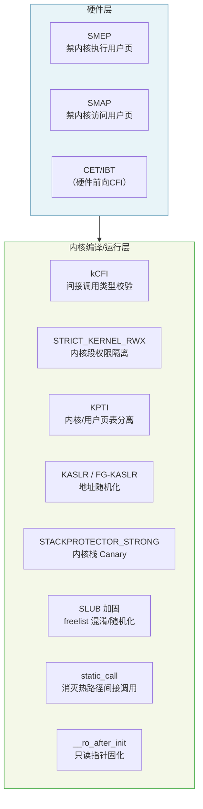
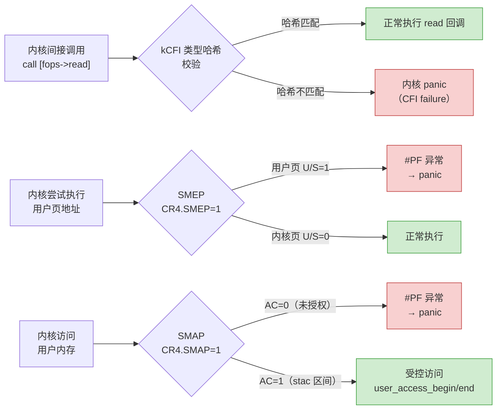

# 现代二进制防护机制（15）· 内核防护与 kCFI

> [!abstract] TL;DR
> - **kCFI（Kernel CFI，`CONFIG_CFI_CLANG`）** 是 Linux 6.1+ 采用 Clang/LLVM 编译时实现的内核级前向控制流完整性：在每个间接调用点前插入 4 字节类型哈希校验，目标函数入口存入相同哈希，不匹配则内核 panic——专门保护 `file_operations`、`proto_ops`、`fops` 等回调指针表。
> - **内核栈保护（`CONFIG_STACKPROTECTOR_STRONG`）** 为每个函数帧插入 stack canary，防止内核缓冲区溢出覆盖返回地址，是内核版本的用户态 SSP 机制（详见 [[03.Stack Canary]]）。
> - **KASLR / FG-KASLR** 在引导时随机化内核基址和函数粒度布局，使 ROP gadget 定位困难；但 KASLR 只是概率防护，信息泄露即可击穿（攻防详见 [[33.二进制漏洞与利用基础/20.Linux内核利用入门]]）。
> - **SMEP / SMAP**（`CR4` 位）在 CPU 级别禁止内核执行用户页（SMEP）和禁止内核直接访问用户页（SMAP），截断经典"ring-0 执行用户 shellcode"路径。
> - **KPTI**（内核页表隔离）将内核与用户态页表完全分离，缓解 Meltdown 类推测执行侧信道；**`CONFIG_STRICT_KERNEL_RWX`** 将内核代码段设为只执行、数据段设为不可执行，在内核级复现 NX/DEP 语义。
> - **SLUB freelist 加固**（`CONFIG_SLAB_FREELIST_HARDENED` / `_RANDOM`）以指针混淆和随机化保护堆分配器元数据，类似用户态 glibc 的 safe-linking；**`static_call` / `__ro_after_init`** 消灭热路径间接调用并固化只读指针，协同收窄内核攻击面。

---

## 概述与定位

用户态二进制有 NX、PIE、RELRO、Stack Canary、CFI、CET 等层层防护；相对应地，Linux 内核作为运行在 ring-0 的特权代码，其内部的控制流劫持、堆/栈破坏若得手，攻击者可直接提权或执行任意内核代码，危害远超用户态漏洞。因此内核同样需要一套多层防护体系，且受制于性能敏感路径（系统调用热路径、中断处理、调度器）和编译器受限环境（不能依赖标准 LLVM sanitizer 全集），其实现细节与用户态有显著差异。

本文以 **防御视角** 逐层梳理当代 Linux 内核（x86-64 为主，aarch64 类比说明）的防护机制，并与用户态对应机制对照。对应的攻击面与利用技术请参考 [[33.二进制漏洞与利用基础/20.Linux内核利用入门]]。

### 内核防护分层概览



---

## 原理与机制

### kCFI：内核前向控制流完整性

#### 背景：内核间接调用的攻击面

内核大量使用函数指针表（虚函数表的 C 实现）：`struct file_operations`（`read`/`write`/`ioctl` 等钩子）、`struct proto_ops`（网络协议操作表）、`struct security_hook_list`（LSM 钩子）等。若攻击者能通过内核堆溢出或类型混淆覆写这些指针，内核一旦调用即跳转到攻击者控制的地址——这是经典内核提权路径之一。

用户态的 CFI（[[08.CFI控制流完整性]]）和 CET IBT（[[09.Intel CET]]）分别从软件和硬件角度约束间接跳转落点；内核的 kCFI 是面向内核代码的软件 CFI 实现。

#### kCFI 的实现（`CONFIG_CFI_CLANG`，Linux 6.1+，Clang）

kCFI 依赖 **Clang 的 `-fsanitize=kcfi`** 编译选项，其原理分为两部分：

**函数入口侧（被调用方）**：编译器在每个可被间接调用的函数入口前插入 4 字节的类型哈希值（类型签名的 CRC32 变体），存放在函数指令序列之前的特定偏移处。

```
; 典型 kCFI 函数入口布局（x86-64）
<function-4>: .long  TYPE_HASH      ; 4 字节类型哈希（数据，不执行）
<function+0>: endbr64 / nop         ; 函数正式入口
              push rbp
              ...
```

**调用点侧（调用方）**：编译器在每个间接 `call` 前插入内联校验序列：

```nasm
; kCFI 间接调用校验（简化示意）
mov  eax, [target_func - 4]   ; 读取目标函数入口前 4 字节（类型哈希）
cmp  eax, EXPECTED_TYPE_HASH  ; 与调用点期望的类型哈希比较
jne  __cfi_slowpath            ; 不匹配 → 慢路径（panic 或 warn）
call target_func               ; 匹配 → 正常调用
```

`EXPECTED_TYPE_HASH` 在编译期由 Clang 根据函数类型签名（参数类型、返回类型）计算确定，内嵌在调用指令前。这意味着：
- 即便攻击者覆写了 `file_operations.read` 指针，指向的目标必须具有与 `ssize_t (*)(struct file *, char __user *, size_t, loff_t *)` 完全匹配的类型签名，否则 kCFI 触发内核 panic。
- 类型哈希的粒度比 IBT 的"任意 `endbr64`"细得多，与 LLVM CFI 对用户态的保护粒度相当（见 [[08.CFI控制流完整性]]）。

#### kCFI 的局限

- 类型哈希是 CRC32 变体，存在理论碰撞（但实际利用难度极高，因为目标函数还须通过链接期合法性约束）。
- 覆写指针后若能找到类型哈希完全一致的内核函数，可绕过 kCFI 的类型校验（"type confusion via matching hash"）——这要求攻击者对内核符号和类型有深入了解。
- kCFI 只保护 **前向**（间接调用）；**后向**（返回地址保护）由 STACKPROTECTOR 或 ARM64 PAC-RET 负责。

---

### 内核栈保护（CONFIG_STACKPROTECTOR / _STRONG）

与用户态 SSP（[[03.Stack Canary]]）机制完全类比：编译器在每个存在局部缓冲区的函数帧中插入 canary，函数返回前校验 canary 是否被覆写，若改变则触发内核 `__stack_chk_fail` → `panic`。

- **`CONFIG_STACKPROTECTOR`**：保护含有 8 字节以上局部字符数组的函数（GCC `-fstack-protector` 语义）。
- **`CONFIG_STACKPROTECTOR_STRONG`**：更广覆盖——含有局部数组（不限类型）、地址被取引用的局部变量、调用 `alloca` 的函数均插入 canary（`-fstack-protector-strong` 语义），是现代内核推荐配置。

内核 canary 值存储于 `per-CPU` 变量 `current_stack_canary`（x86-64 通过 GS segment 寄存器寻址），避免跨 CPU 信息泄露。

---

### KASLR 与 FG-KASLR

#### KASLR（Kernel Address Space Layout Randomization）

KASLR 在引导时将内核映像整体加载到随机基址（而非固定的 `0xffffffff81000000`），使攻击者无法在不获取信息泄露的前提下得知 ROP gadget、函数指针的运行时地址。

x86-64 上 KASLR 的随机化范围通常为 1 GB 以内的 2 MB 对齐偏移（受限于大页对齐要求），随机位数约 9 位（512 种可能），熵值相对有限。

#### FG-KASLR（Function Granularity KASLR）

FG-KASLR（`CONFIG_FG_KASLR`，部分发行版补丁，非主线）在 KASLR 基础上对内核内各函数的相对顺序额外随机化，使得即便通过信息泄露得知某函数地址，其他函数的偏移仍不可预测。主线内核通过 `CONFIG_RANDOMIZE_KSTACK_OFFSET` 实现了内核栈基址的 per-syscall 随机化（在系统调用入口随机移动 RSP），对抗基于栈布局的推断。

KASLR 对应用户态的 PIE+ASLR（[[04.PIE与ASLR]]），同样属于"概率保护"——单独的 KASLR 在存在信息泄露漏洞时可被击穿，需与其他机制联用。

---

### SMEP / SMAP

#### SMEP（Supervisor Mode Execution Prevention）

通过设置 `CR4.SMEP`（bit 20），CPU 在内核态（ring 0）执行指令时，若指令地址落在用户页（`U/S` 位置 1 的页），触发 `#PF` 异常。

**防护目标**：传统内核漏洞利用路径之一是将 shellcode 写入用户态缓冲区，然后通过劫持内核控制流跳至该缓冲区执行 ring-0 代码。SMEP 使这条路径直接失效——内核无法执行用户页中的代码。

在 Linux 中，SMEP 通过 `set_in_cr4(X86_CR4_SMEP)` 在 CPU 初始化时启用（内核 `setup_cr4_bits`），无需 `CONFIG` 开关，凡 CPU 支持则自动开启。

#### SMAP（Supervisor Mode Access Prevention）

通过设置 `CR4.SMAP`（bit 21），CPU 在内核态执行时，若访问（读写）用户页，触发 `#PF` 异常——除非当前 `EFLAGS.AC`（Alignment Check）置 1。

内核需要访问用户内存时，必须显式调用 `stac`（置 `AC=1`，开放访问）和 `clac`（清 `AC=1`，关闭访问），通过宏 `user_access_begin()` / `user_access_end()` 封装。这要求内核只在明确、受控的代码窗口内访问用户数据，防止攻击者通过 `call_usermodehelper` 等路径让内核意外读写攻击者控制的用户内存。



---

### KPTI（Kernel Page-Table Isolation）

KPTI（`CONFIG_PAGE_TABLE_ISOLATION`）是 Meltdown 漏洞（CVE-2017-5754）的主要缓解措施，于 Linux 4.15 合并。

**原理**：进程在用户态运行时，使用 **用户页表**（`user_pgd`），其中内核地址空间映射极少（仅保留 syscall 入口蹦床等必要部分，且标记为不可读用户态）；进入内核态（系统调用/中断）时，`CR3` 切换为 **内核页表**（`kernel_pgd`），包含完整内核映射。

**防护意义**：Meltdown 利用推测执行使用户态程序通过缓存侧信道读取内核内存；KPTI 通过隔离页表使内核映射在用户态不可见，从根本上消除推测访问路径。

**性能代价**：每次 syscall / 中断的 ring 切换需刷新 TLB（或使用 PCID 减少刷新），在 I/O 密集应用上造成 3%~30% 的性能回归，对 PCID 支持的现代 CPU（Westmere+）已通过 PCID 优化大幅缓解。

---

### CONFIG_STRICT_KERNEL_RWX

类比用户态的 NX（[[02.NX与DEP]]），`CONFIG_STRICT_KERNEL_RWX`（Linux 4.6+）强制内核地址空间的段权限分离：

| 内核段 | 权限 |
|---|---|
| 代码段（`.text`） | R-X（可读可执行，不可写） |
| 只读数据段（`.rodata`） | R--（可读，不可写不可执行） |
| 可写数据段（`.data`、`.bss`） | RW-（可读写，不可执行） |

内核 `__init` 段在初始化完成后权限降为 RW-（不再可执行），避免攻击者复用初始化代码段中的 gadget。这也是 `__ro_after_init`（下文）的安全基础——数据页在初始化后变为只读。

---

### SLUB Freelist 加固

内核的 SLUB 分配器（`CONFIG_SLUB`，主流发行版默认）通过两个可选配置加固空闲链表元数据：

#### CONFIG_SLAB_FREELIST_HARDENED（指针混淆）

空闲对象的 `freelist` 指针在存储前通过 XOR 与随机密钥（`s->random`，slab 创建时随机生成）以及当前指针自身地址进行混淆：

```c
/* 简化的混淆/解混淆逻辑（参考内核源码 mm/slub.c） */
static inline void *freelist_ptr_encode(const struct kmem_cache *s,
                                         void *ptr, unsigned long ptr_addr)
{
    return (void *)((unsigned long)ptr ^ s->random ^ ptr_addr);
}

static inline void *freelist_ptr_decode(const struct kmem_cache *s,
                                         void *ptr, unsigned long ptr_addr)
{
    return (void *)((unsigned long)ptr ^ s->random ^ ptr_addr);
}
```

此机制与用户态 glibc 2.32+ 的 safe-linking（[[06.Heap概述与glibc分配器基础]]）思路完全类比：攻击者即便能读到混淆后的指针，若不知晓 `s->random`，也无法直接构造合法的 freelist 链表伪造对象。

#### CONFIG_SLAB_FREELIST_RANDOM（随机化空闲序列）

每个 slab 页在初始化时，将初始 freelist 顺序随机打乱，使得连续分配的对象地址不再线性递增。这对抗基于"分配顺序可预测"的堆喷攻击：攻击者通过大量分配某对象使目标对象排列在特定位置的策略被随机化打乱。

---

### static_call 与 __ro_after_init

#### static_call（消灭热路径间接调用）

内核中有若干高频调用点在运行时实际上只有一个具体实现（如 paravirt 操作、KVM 某些路径），但为兼容性原因以函数指针形式编写，导致每次调用都经过间接 call。`static_call`（Linux 5.10+）机制允许内核在引导时将这类间接调用动态 **patch 成直接 call 指令**：

```
引导前：call *pv_ops.read_cr2    ; 间接调用，可被指针篡改
引导后（patch）：call native_read_cr2  ; 直接调用，无需解引用指针
```

这既提升了热路径性能，又消灭了可被利用的间接调用点——kCFI 保护的是"间接调用"，用直接调用替换后连 kCFI 都不需要，因为直接调用的目标在编译时固定，攻击者无从覆写。

#### __ro_after_init（初始化后只读指针）

`__ro_after_init` 是一个节属性标记，声明为此属性的变量（通常是函数指针或配置值）在内核初始化（`do_initcalls` 完成）后，其所在内存页权限降为只读。

```c
/* 典型用例 */
static const struct dma_map_ops *dma_ops __ro_after_init;
static const struct security_hook_heads security_hook_heads __ro_after_init;
```

对攻击者而言，即便找到了写原语，也无法覆写 `__ro_after_init` 区域的指针（写操作触发 `#PF`），从根本上消除了这类指针被劫持的可能性。

---

## 结构/算法/伪代码详解

### kCFI 类型哈希校验全流程

```
编译期（Clang -fsanitize=kcfi）：
  1. 对每个函数 F，计算 TypeHash(F) = CRC32_variant(函数类型签名字符串)
  2. 在 F 入口前 -4 字节处写入 TypeHash(F)（作为数据，不参与执行）
  3. 对每个间接 call 点 C，确定期望类型 T，嵌入 TypeHash(T) 为立即数

运行期（间接 call 执行）：
  目标地址 = target_ptr（可能已被攻击者覆写）
  actual_hash  = *(uint32_t *)(target_ptr - 4)   ; 读被调用函数的类型哈希
  expected_hash = COMPILE_TIME_HASH              ; 调用点硬编码的期望哈希

  if actual_hash != expected_hash:
      __cfi_slowpath_diag(target_ptr, expected_hash)
      → CONFIG_CFI_PERMISSIVE: pr_warn + 继续（调试用）
      → 默认（严格模式）: BUG() → 内核 panic
  else:
      正常间接调用
```

### SLUB freelist 混淆算法细节

```
分配时（kmem_cache_alloc 快路径）：
  raw_next = *freelist_slot               ; 读当前空闲指针（混淆态）
  next_obj = raw_next ^ s->random ^ &freelist_slot   ; 解混淆得到真实下一个对象地址
  freelist = next_obj                     ; 更新 freelist 头

释放时（kfree）：
  混淆后指针 = real_next ^ s->random ^ &目标槽位地址
  *freelist_slot = 混淆后指针             ; 写回混淆态

攻击者视角（假设能读到 freelist_slot 内容）：
  读出 raw_next = real_next ^ s->random ^ slot_addr
  若不知 s->random（per-slab 随机值）→ 无法还原 real_next → 无法伪造链表
```

---

## 工具视角与实战

### 查看内核防护配置

```bash
# 查看当前内核编译配置（需 /boot/config-$(uname -r) 或 /proc/config.gz）
grep -E 'CFI|STACKPROTECTOR|KASLR|SMEP|SMAP|KPTI|STRICT_KERNEL_RWX|SLAB_FREELIST' \
    /boot/config-$(uname -r)

# 运行时确认 SMEP/SMAP 是否在 CR4 中启用（x86-64，需 root）
python3 -c "
import struct
with open('/dev/cpu/0/msr','rb') as f:
    f.seek(0x3A0)  # IA32_FEAT_CTL，仅示意
    # 实际通过 /sys/kernel/debug/x86/cr4 或 rdmsr
"

# 更实用：通过 sysfs 查看内核安全特性
cat /sys/kernel/security/lockdown          # 内核锁定级别
cat /proc/cmdline | grep -o 'nokaslr\|kaslr\|kpti=[01]'

# 确认 KPTI 状态
dmesg | grep -i 'page table isolation\|kpti\|pti'

# 确认 SMEP/SMAP（dmesg 引导日志）
dmesg | grep -E 'SMEP|SMAP|NX protection'
```

### 查看 kCFI 状态

```bash
# 确认内核以 kCFI 编译
grep CONFIG_CFI_CLANG /boot/config-$(uname -r)
# 期望输出：CONFIG_CFI_CLANG=y

# 查看 kCFI 触发记录（若发生 CFI violation 会在 dmesg 中留 BUG）
dmesg | grep -i 'CFI failure\|cfi_check'

# 用 pahole/vmlinux 查看函数入口前的类型哈希
# （需 vmlinux 符号文件，开发/调试环境）
objdump -d vmlinux | grep -A2 '<file_operations_read>'
```

### checksec 内核模块检查

```bash
# checksec 可检查内核模块（.ko 文件）的编译防护标志
checksec --kernel        # 输出内核整体防护概况
checksec --file=module.ko  # 检查特定内核模块

# 典型输出（示意）：
# [*] Kernel protection information:
#   Kernel version: Linux 6.6.0
#   SMEP: Yes
#   SMAP: Yes
#   KASLR: Yes
#   KPTI: Yes
#   Stack Protector: Yes (strong)
```

### 内核堆分配器调试与验证

```bash
# 开启 SLUB 调试（引导参数，开发环境用，生产慎用）
# slub_debug=FP,kmalloc-192  → 对 kmalloc-192 slab 开启 freelist/poison 检查
# slub_debug=Z               → 引导阶段全局零化已释放对象

# 运行时查看 SLUB 统计
cat /sys/kernel/slab/kmalloc-192/alloc_calls
cat /sys/kernel/slab/kmalloc-192/free_calls
```

---

## 安全性与正确使用

> [!note] 防御向声明
> 本节从防御视角总结各机制的正确启用方式和常见配置误区。内核 kCFI 绕过技术（类型哈希碰撞、类型混淆利用）需要高度专业的内核安全研究背景，本文不提供具体绕过指导；相关攻防分析请参考 [[33.二进制漏洞与利用基础/20.Linux内核利用入门]]。

### 推荐内核防护配置（安全加固基线）

以下 `Kconfig` 选项构成安全发行版（如 RHEL、Ubuntu LTS 服务器版）的标准内核加固基线：

```
# 控制流完整性
CONFIG_CFI_CLANG=y              # kCFI，需 Clang 编译内核
CONFIG_SHADOW_CALL_STACK=y      # SCS（aarch64）或配合 CET SHSTK（x86）

# 栈保护
CONFIG_STACKPROTECTOR_STRONG=y

# 地址随机化
CONFIG_RANDOMIZE_BASE=y         # KASLR
CONFIG_RANDOMIZE_KSTACK_OFFSET=y

# 内存权限分离
CONFIG_STRICT_KERNEL_RWX=y
CONFIG_STRICT_MODULE_RWX=y      # 内核模块同样强制 RWX 分离

# 页表隔离（Meltdown 缓解）
CONFIG_PAGE_TABLE_ISOLATION=y

# 堆元数据保护
CONFIG_SLAB_FREELIST_HARDENED=y
CONFIG_SLAB_FREELIST_RANDOM=y

# 模块加载锁定（阻止未签名模块）
CONFIG_MODULE_SIG=y
CONFIG_MODULE_SIG_FORCE=y
CONFIG_SECURITY_LOCKDOWN_LSM=y
```

### 常见配置误区

1. **仅开启 KASLR 而未开 kCFI**：KASLR 是概率保护，存在内核信息泄露（如 `/proc/kallsyms`、`dmesg` 中的指针）即可击穿；kCFI 则即便攻击者知道地址，也无法随意劫持控制流——两者互补而非互替。

2. **内核模块未同步启用防护**：若 `CONFIG_STRICT_MODULE_RWX=n` 而内核主体已开 STRICT_KERNEL_RWX，内核模块段仍可能可写可执行，形成薄弱环节。

3. **`/proc/kallsyms` 未限制读取**：默认 root 可读 `/proc/kallsyms`，若内核未开 `kptr_restrict=2`，非 root 通过 `dmesg` 也可能泄露内核指针，直接击穿 KASLR。建议配置 `sysctl kernel.kptr_restrict=2`。

4. **旧版本 Clang 编译 kCFI**：kCFI 依赖 Clang 14+（Linux 6.1 引入时），Clang 版本不匹配可能导致哈希计算逻辑差异，内核引导时出现误报 panic。

5. **FG-KASLR 与 kCFI 的叠加**：FG-KASLR 使函数相对偏移随机化，使得 kCFI 哈希校验中的目标地址不可预测——两者协同提供更强的"知道目标地址 + 正确类型哈希"双重障碍。

### 用户态与内核态防护对照表

| 安全目标 | 用户态机制 | 内核态机制 |
|---|---|---|
| 前向 CFI（间接调用约束） | LLVM CFI / [[08.CFI控制流完整性]] | kCFI（`CONFIG_CFI_CLANG`） |
| 后向 CFI（返回地址保护） | CET Shadow Stack / SCS / [[14.SafeStack与ShadowCallStack]] | `CONFIG_SHADOW_CALL_STACK`（aarch64）/ CET SHSTK（x86） |
| 栈缓冲区溢出 | Stack Canary / [[03.Stack Canary]] | `CONFIG_STACKPROTECTOR_STRONG` |
| 代码段不可写 | NX / `STRICT_EXEC` / [[02.NX与DEP]] | `CONFIG_STRICT_KERNEL_RWX` |
| 地址布局随机化 | PIE + ASLR / [[04.PIE与ASLR]] | KASLR + FG-KASLR + kstack offset |
| 堆元数据保护 | glibc safe-linking / [[06.Heap概述与glibc分配器基础]] | SLUB freelist hardened/random |
| 只读关键指针 | `const` + RELRO / [[05.RELRO]] | `__ro_after_init` |
| 消灭间接调用热点 | 直接调用 / LTO 内联 | `static_call` |
| 隔离用户/内核执行 | 无（用户天然在 ring 3） | SMEP（CR4.SMEP） |
| 隔离用户/内核数据访问 | 无（内核显式 copy_to/from_user） | SMAP（CR4.SMAP） |
| 侧信道（Meltdown）缓解 | 不适用 | KPTI |

---

## 小结

Linux 内核的现代防护体系是多层防线的协同：

1. **kCFI** 在编译期通过类型哈希校验约束间接调用，专门针对 `file_operations`、`proto_ops` 等内核回调指针表被覆写的攻击路径，是用户态 LLVM CFI 在内核场景的移植与优化。

2. **STACKPROTECTOR_STRONG** 将用户态 Stack Canary 机制平移到内核，保护内核函数栈帧中的缓冲区溢出，以 per-CPU canary 避免跨 CPU 泄露。

3. **SMEP / SMAP** 是硬件层的内核/用户隔离：SMEP 截断"执行用户 shellcode"路径，SMAP 强制内核只能通过受控 `user_access_begin/end` 窗口访问用户数据，两者共同封闭经典提权路径。

4. **KASLR（+FG-KASLR）** 提供概率性地址随机化，需与 `kptr_restrict` 等信息泄露防护配合，否则单独效果有限。

5. **KPTI + STRICT_KERNEL_RWX** 分别在页表层和页权限层实现内核地址空间隔离，前者缓解 Meltdown，后者复现内核级 NX 语义。

6. **SLUB freelist hardened/random** 将用户态堆保护思路（safe-linking、分配顺序随机化）带入内核分配器，抬高内核堆溢出的利用复杂度。

7. **`static_call` / `__ro_after_init`** 从设计层面消灭间接调用热点和可写指针，在防护机制之上通过架构手段收窄攻击面。

各机制单独都有局限，协同使用时攻击者需同时突破多道防线——这正是纵深防御的核心理念，与用户态防护体系的设计哲学完全一致。

---

## 相关阅读

- **Linux 内核漏洞利用与攻防对照**：[[33.二进制漏洞与利用基础/20.Linux内核利用入门]]
- **用户态前向 CFI 软件实现（kCFI 同源技术）**：[[08.CFI控制流完整性]]
- **Intel CET：硬件 CFI 与 Shadow Stack**：[[09.Intel CET]]
- **SafeStack 与 ShadowCallStack（后向 CFI，aarch64 SCS）**：[[14.SafeStack与ShadowCallStack]]
- **Stack Canary 原理（STACKPROTECTOR 的用户态对应）**：[[03.Stack Canary]]
- **ASLR 与 PIE（KASLR 的用户态对应）**：[[04.PIE与ASLR]]
- **NX/DEP（STRICT_KERNEL_RWX 的用户态对应）**：[[02.NX与DEP]]
- **glibc 堆分配器基础（safe-linking 与 SLUB 加固对照）**：[[06.Heap概述与glibc分配器基础]]
- **整体防护机制协同**：[[00.现代二进制防护机制总览]]

---

⬅️ 上一篇 [[14.SafeStack与ShadowCallStack]] ｜ 🏠 [[00.现代二进制防护机制总览]] ｜ 下一篇 [[16.沙箱与隔离防护]] ➡️
