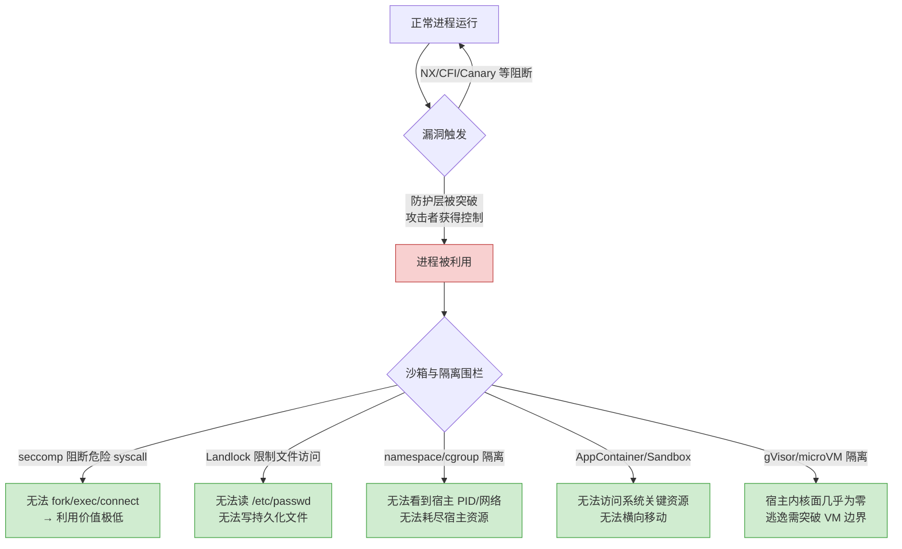

# 现代二进制防护机制（16）· 沙箱与隔离防护

> [!abstract] TL;DR
> - **沙箱与隔离**是纵深防御的最后一道围栏：前面的防护机制（NX、CFI、ASLR、Stack Canary……）尽力阻止漏洞被利用；沙箱则假设漏洞**已被利用**，通过限制进程的系统调用、文件访问、网络、进程树等能力，使攻击者即便拿到进程控制权也无法横向移动或持久化。
> - **seccomp-bpf** 在 Linux 进程级别过滤系统调用：以 BPF 字节码程序定义 allowlist/denylist，不在 allowlist 中的 syscall 触发 `SCMP_ACT_KILL`（立即终止进程）或 `SCMP_ACT_ERRNO`；Chrome、OpenSSH、Firefox、systemd service 等均大量采用。
> - **Landlock LSM**（Linux 5.13+）是非特权进程可自主申请的文件系统访问控制：进程通过 `landlock_create_ruleset` + `landlock_restrict_self` 声明自己只能访问指定目录/文件，内核在后续所有文件操作上强制执行。
> - **Linux namespaces + cgroups + capabilities** 是容器隔离三支柱：namespaces 隔离视图（pid/net/mnt/uts/ipc/user），cgroups 限制资源，capabilities 细化特权；三者配合构成 Docker/podman 等容器运行时的安全基础。
> - **gVisor / Firecracker / Kata Containers** 分别以用户态内核拦截、microVM、轻量级 VM 三种路径将容器的内核攻击面隔离到最小；**Windows AppContainer / Job Object** 和 **macOS App Sandbox（seatbelt）** 是各自平台的等价机制。
> - 沙箱不是"零配置保证安全"——错误配置（allowlist 过宽、namespace 逃逸、容器特权模式）将使围栏形同虚设；相关逃逸技术见 [[33.二进制漏洞与利用基础/21.seccomp沙箱逃逸]]。

---

## 概述与定位

纵深防御（Defense in Depth）的核心思想是：没有任何单一防护机制是无懈可击的，当一层防线被突破时，后续层应能限制损失。前面各篇讨论的防护（NX/CFI/ASLR/Canary/CET 等）都在**阻止漏洞被成功利用**；沙箱与隔离则从根本上改变了"成功利用后能做什么"的问题答案。



本文以**防御视角**逐层讲解各沙箱机制的原理、正确配置方式和适用场景，以及关键的配置误区。相关逃逸技术请参考 [[33.二进制漏洞与利用基础/21.seccomp沙箱逃逸]]，macOS EndpointSecurity 框架的深度分析见 [[32.hooks/16-macos-endpointsecurity]]。

---

## 原理与机制

### seccomp-bpf：系统调用过滤

#### seccomp 的工作层次

seccomp（Secure Computing Mode）在内核系统调用入口处拦截，通过附加在进程上的 BPF 程序决定每次系统调用的命运。拦截点在 `syscall_enter_from_user_mode`（x86-64 的 `SYSCALL` 指令路径），发生在任何内核代码执行之前，因此即便是触发特权提升的系统调用也在此被截断。

seccomp 的两种模式：
- **`SECCOMP_MODE_STRICT`**：只允许 `read`/`write`/`_exit`/`sigreturn` 四个系统调用，极端限制，主要用于计算密集型隔离进程。
- **`SECCOMP_MODE_FILTER`**（seccomp-bpf，Linux 3.5+）：允许附加任意 cBPF 程序定义过滤逻辑，这是实际生产中使用的模式。

#### seccomp-bpf 过滤器的结构

BPF 过滤器接收 `struct seccomp_data` 作为输入，包含：
- `nr`：系统调用编号
- `arch`：调用架构（防止 32/64 位混用绕过）
- `instruction_pointer`：调用方代码地址
- `args[6]`：系统调用的 6 个参数

过滤器返回值决定内核行为：

| 返回值 | 含义 |
|---|---|
| `SECCOMP_RET_ALLOW` | 允许系统调用正常执行 |
| `SECCOMP_RET_ERRNO` | 返回指定 errno，系统调用不执行 |
| `SECCOMP_RET_KILL_THREAD` | 立即终止当前线程（SIGSYS 信号，无法被 handler 捕获） |
| `SECCOMP_RET_KILL_PROCESS` | 立即终止整个进程（更安全，防止多线程绕过） |
| `SECCOMP_RET_TRAP` | 向进程发送 SIGSYS，可被自定义 handler 捕获（调试用） |
| `SECCOMP_RET_TRACE` | 通知 ptrace tracer 决策（用于 strace 类工具集成） |
| `SECCOMP_RET_LOG` | 允许并记录日志 |
| `SECCOMP_RET_USER_NOTIF` | 通知用户态 supervisor 进程决策（Linux 5.0+，用于容器运行时代理） |

#### 防御最佳配置原则

**1. 默认拒绝（allowlist 模式）**

```c
/* libseccomp 示例：最小 allowlist，默认 KILL */
scmp_filter_ctx ctx = seccomp_init(SCMP_ACT_KILL_PROCESS);  // 默认杀进程

/* 只允许必要的 syscall */
seccomp_rule_add(ctx, SCMP_ACT_ALLOW, SCMP_SYS(read), 0);
seccomp_rule_add(ctx, SCMP_ACT_ALLOW, SCMP_SYS(write), 0);
seccomp_rule_add(ctx, SCMP_ACT_ALLOW, SCMP_SYS(close), 0);
seccomp_rule_add(ctx, SCMP_ACT_ALLOW, SCMP_SYS(exit_group), 0);
seccomp_rule_add(ctx, SCMP_ACT_ALLOW, SCMP_SYS(mmap), 0);
/* ... 仅添加进程实际需要的 syscall ... */

seccomp_load(ctx);
seccomp_release(ctx);
```

**2. 先设 NO_NEW_PRIVS，再加载过滤器**

```c
/* 非 root 进程加载 seccomp 过滤器前必须先设此 prctl，防止 setuid 提权绕过 */
prctl(PR_SET_NO_NEW_PRIVS, 1, 0, 0, 0);
/* 之后加载 seccomp 过滤器 */
seccomp_load(ctx);
```

`PR_SET_NO_NEW_PRIVS` 确保进程及其子孙**永远无法通过 execve 获得更高权限**（setuid bit 无效），防止攻击者通过 `execve("/bin/su")` 绕过 seccomp 重新获得提权能力。

**3. 过滤参数而非仅过滤 syscall 号**

仅过滤 syscall 号是粗粒度的；seccomp-bpf 可以检查参数：

```c
/* 只允许向 stdout/stderr 写，禁止 write 到任意 fd */
seccomp_rule_add(ctx, SCMP_ACT_ALLOW, SCMP_SYS(write), 1,
                 SCMP_A0(SCMP_CMP_LE, 2));  // fd <= 2（stdin/stdout/stderr）
```

**4. 注意架构检查防止 32/64 位混用绕过**

```c
/* 开头必须校验 arch，防止 x86-32 syscall 表绕过 x86-64 过滤器 */
// libseccomp 自动处理；手写 cBPF 时必须手动加：
// BPF_STMT(BPF_LD | BPF_W | BPF_ABS, offsetof(struct seccomp_data, arch))
// BPF_JUMP(BPF_JMP | BPF_JEQ | BPF_K, AUDIT_ARCH_X86_64, 1, 0)
// BPF_STMT(BPF_RET | BPF_K, SECCOMP_RET_KILL_PROCESS)
```

#### 生产环境中的实际应用

- **Chrome / Chromium**：渲染进程使用 seccomp-bpf 严格限制 syscall，配合 Zygote 进程模型实现进程隔离。禁止渲染进程调用 `ptrace`、`perf_event_open`、大多数 socket 相关调用。
- **OpenSSH**（`privsep` 模式）：SSH 子进程通过 seccomp 限制到只能处理加密操作相关的 syscall，认证逻辑在另一独立进程中运行，漏洞只能影响受限子进程。
- **systemd `SystemCallFilter=`**：`systemd.service` 单元文件支持 `SystemCallFilter=~@mount @reboot @swap` 等预定义组，通过 systemd 自动生成 seccomp 过滤器，无需程序本身感知 seccomp：

```ini
[Service]
ExecStart=/usr/bin/myservice
# 只允许基本 I/O，拒绝所有危险调用组
SystemCallFilter=@system-service
SystemCallFilter=~@mount @reboot @swap @privileged
NoNewPrivileges=yes
```

---

### Landlock LSM：非特权文件系统沙箱

#### 背景与定位

传统的 Linux DAC（Discretionary Access Control）和 MAC（如 SELinux/AppArmor）需要 root 配置策略，无法由非特权程序**自主**限制自己的文件访问权限。Landlock LSM（Linux 5.13+）填补了这个空白：任何进程（包括非 root）可以使用 `landlock_create_ruleset` syscall 申请一个访问控制规则集，然后通过 `landlock_restrict_self` 将其绑定到自身，内核此后强制执行这些限制。

Landlock 是**不可提升**的：一旦进程调用了 `landlock_restrict_self`，其文件系统访问只会比当前更受限（可以叠加，不能放宽），子进程继承这些限制。这是"自我降权"的典型应用，特别适合沙箱框架主动收窄自己的权限。

#### Landlock 使用流程

```c
#include <linux/landlock.h>
#include <sys/syscall.h>

/* 1. 创建规则集：声明要管理的访问权限类型 */
struct landlock_ruleset_attr ruleset_attr = {
    .handled_access_fs =
        LANDLOCK_ACCESS_FS_READ_FILE  |
        LANDLOCK_ACCESS_FS_WRITE_FILE |
        LANDLOCK_ACCESS_FS_READ_DIR   |
        LANDLOCK_ACCESS_FS_MAKE_REG,
};
int ruleset_fd = syscall(SYS_landlock_create_ruleset,
                         &ruleset_attr, sizeof(ruleset_attr), 0);

/* 2. 添加允许规则：允许读取 /usr 目录下的文件 */
struct landlock_path_beneath_attr path_attr = {
    .allowed_access = LANDLOCK_ACCESS_FS_READ_FILE | LANDLOCK_ACCESS_FS_READ_DIR,
    .parent_fd = open("/usr", O_PATH | O_CLOEXEC),
};
syscall(SYS_landlock_add_rule, ruleset_fd,
        LANDLOCK_RULE_PATH_BENEATH, &path_attr, 0);

/* 3. 启用：锁定自身到这个规则集 */
prctl(PR_SET_NO_NEW_PRIVS, 1, 0, 0, 0);  // 必须先设
syscall(SYS_landlock_restrict_self, ruleset_fd, 0);
close(ruleset_fd);

/* 此后进程只能读取 /usr 下的文件，尝试访问 /etc/passwd 将返回 EACCES */
```

#### Landlock 的局限

- 仅控制文件系统访问权限，不涉及网络、IPC、系统调用等（需与 seccomp 配合）。
- Linux 5.19+ 才引入网络访问控制（`LANDLOCK_ACCESS_NET_*`）。
- 不支持对已打开的 fd 进行限制（限制发生在路径解析层，`O_PATH` 之后的操作不受约束）。

---

### Linux Namespaces + cgroups + Capabilities：容器隔离三支柱

#### Namespaces：隔离视图

Linux namespaces 将全局系统资源的"视图"（view）分割，使不同命名空间中的进程看到不同的世界：

| Namespace 类型 | `CLONE_NEW*` 常量 | 隔离的资源 |
|---|---|---|
| PID | `CLONE_NEWPID` | 进程 ID 空间；容器内 PID 1 在宿主看来是任意高位 PID |
| Network | `CLONE_NEWNET` | 网络接口、路由表、iptables 规则、socket；容器有独立 `lo` 和 veth |
| Mount | `CLONE_NEWNS` | 挂载点树；容器有独立的文件系统根（配合 `pivot_root`）|
| UTS | `CLONE_NEWUTS` | hostname 和 domain name |
| IPC | `CLONE_NEWIPC` | SysV IPC（消息队列/共享内存/信号量）和 POSIX 消息队列 |
| User | `CLONE_NEWUSER` | UID/GID 映射；容器内"root"（UID 0）实际映射为宿主非特权 UID |
| Cgroup | `CLONE_NEWCGROUP` | cgroup 根视图 |
| Time | `CLONE_NEWTIME` | 单调时钟和引导时钟偏移（Linux 5.6+） |

`CLONE_NEWUSER`（User Namespace）是非特权沙箱的关键：非 root 用户可以创建一个新的 user namespace 并在其中成为"root"，但这个"root"映射到宿主上是无特权的普通用户，无法影响宿主资源。这也是 rootless 容器（Docker rootless mode、podman rootless）的安全基础。

#### cgroups v2：资源限制与审计

cgroups（Control Groups）限制进程组的资源消耗：CPU 时间（`cpu.max`）、内存（`memory.max`）、I/O 带宽（`io.max`）、PID 数量（`pids.max`）等。

从安全角度，cgroups 防止了一类重要的 DoS 攻击：容器内进程通过耗尽 CPU、内存或 fork bomb 影响宿主或其他容器。`pids.max` 尤其重要——限制最大 PID 数量可有效阻止 fork bomb：

```bash
# 在 cgroup v2 中设置最大 PID 数
echo 100 > /sys/fs/cgroup/mycontainer/pids.max
```

#### capabilities：细化特权

传统的 UNIX 权限模型是二值的（root 全能，非 root 全不能）。Linux capabilities 将 root 权限拆分为约 40 个独立能力（`CAP_NET_ADMIN`、`CAP_SYS_PTRACE`、`CAP_DAC_OVERRIDE`……），进程可以只持有完成工作所需的最小能力集，即使以 root 身份运行也可主动放弃不需要的能力。

```bash
# 查看当前进程的 capabilities
cat /proc/self/status | grep Cap
# CapPrm/CapEff/CapBnd/CapAmb 各为一个位掩码，可用 capsh --decode= 解码

# 以最小 capabilities 启动服务（systemd）
[Service]
CapabilityBoundingSet=CAP_NET_BIND_SERVICE  # 只允许绑定低位端口
AmbientCapabilities=CAP_NET_BIND_SERVICE
User=nobody                                  # 非 root 用户运行
```

在容器中，`--cap-drop=ALL --cap-add=NET_BIND_SERVICE` 这样的配置确保即便容器内进程被利用，攻击者也只有绑定端口的能力，而无法 `ptrace` 其他进程、修改路由表或加载内核模块。

---

### 高级隔离：gVisor / Firecracker / Kata Containers

#### 传统容器的内核攻击面

Docker/OCI 容器共享宿主内核：容器内进程的系统调用**直接进入宿主内核**，只是 namespace/seccomp 过滤减少了可用的 syscall 集合。若内核自身存在漏洞（如 `runc` CVE-2019-5736、Dirty Pipe CVE-2022-0847），容器内进程可能通过 syscall 触发漏洞逃逸到宿主。

下表对比三种高隔离方案：

| 方案 | 隔离机制 | 内核攻击面 | 性能影响 | 适用场景 |
|---|---|---|---|---|
| **gVisor**（Google） | 用户态内核（Sentry 进程），拦截所有 syscall | Sentry 的有限 host syscall 接口 | 中等（每次 syscall 进入 Sentry） | 多租户云服务，syscall 密集应用 |
| **Firecracker**（AWS） | KVM microVM，极轻量化 hypervisor | hypervisor 接口（virtio 等） | 极低（KVM 硬件辅助） | AWS Lambda、Fargate 工作负载 |
| **Kata Containers** | 轻量级 VM（QEMU-lite / StratoVirt）+ OCI 兼容层 | VM 硬件接口 | 低（KVM）+ 容器启动开销 | 安全容器，Kubernetes pod |

**gVisor 工作原理**：进程系统调用被 ptrace（sandbox 模式）或 KVM（KVM 模式）拦截，转发到用户态的 `Sentry` 进程（用 Go 实现的"内核"），Sentry 执行逻辑后仅通过约 50 个精心筛选的宿主 syscall 与真实内核通信。容器内进程的大量 syscall（如 `mmap`、`read`、`epoll`）在 Sentry 中完全模拟，永远不触达宿主内核。

---

### Windows AppContainer 与 Job Object

#### AppContainer

Windows AppContainer 是 Windows 8+ 的进程级沙箱，主要用于 UWP 应用和 Microsoft Edge（旧版）等：

- 进程运行在低完整性级别（Low Integrity Level）或 AppContainer 完整性级别
- 对文件系统、注册表、网络的访问受 Capability（Windows 版本，如 `internetClient`、`picturesLibrary`）控制
- 进程间通信受限于 AppContainer 边界（只能与声明了 AppID 匹配能力的其他 AppContainer 通信）
- 通过 `CreateProcessAsUser` + AppContainer SID 创建，或由 `WinRT` 框架自动设置

```powershell
# 查看进程是否在 AppContainer 中运行（PowerShell）
$process = Get-Process -Name "msedge" | Select-Object -First 1
$token = [System.Security.Principal.WindowsIdentity]::GetCurrent()
# 使用 P/Invoke 查询 TokenIntegrityLevel 或 TokenAppContainerSid
```

#### Job Object

Job Object 是 Windows 的进程组资源限制机制，功能类似 Linux cgroups，但同时具备强制约束能力：

- 限制进程内存使用（`JobObjectExtendedLimitInformation.ProcessMemoryLimit`）
- 限制 CPU 时间（`BasicLimitInformation.ActiveProcessLimit`）
- **沙箱相关**：`JOB_OBJECT_BASIC_UI_RESTRICTIONS`（限制 UI 访问）、`JOB_OBJECT_LIMIT_KILL_ON_JOB_CLOSE`（父进程退出时子进程一并终止）
- 阻止子进程逃脱 Job（`JOB_OBJECT_LIMIT_BREAKAWAY_OK` 未设置时，子进程无法离开 Job）

Chrome 渲染进程就同时受 Job Object 和 Windows ACL 双重约束，配合 Integrity Level 构成多层隔离。

---

### macOS App Sandbox（seatbelt）与 EndpointSecurity

#### App Sandbox

macOS App Sandbox 基于 TrustedBSD MAC（`seatbelt` 内核扩展）实现：每个沙箱化应用程序在 Info.plist 中声明 entitlements（能力），内核通过 Sandbox.kext 在文件操作、网络操作、进程间通信等各个层面强制执行这些限制。

核心策略文件（`sandbox-exec` 格式，内部称为 `.sb` scheme-based 策略）：

```scheme
; 简化示意：只允许读取应用包目录和写入临时目录
(version 1)
(deny default)
(allow file-read* (subpath "/Applications/MyApp.app"))
(allow file-write* (subpath (param "TMPDIR")))
(allow mach-lookup (global-name "com.apple.CoreServices.coreservicesd"))
(allow network-outbound (remote ip "127.0.0.1:8080"))
```

`(deny default)` 是关键：默认拒绝所有操作，再通过 `(allow ...)` 声明必要权限，这正是 allowlist 思想在 macOS 上的体现。

macOS 14+ 的 App Sandbox 深度集成了 Gatekeeper（代码签名验证）、Hardened Runtime（禁止 JIT 注入、`CS_RESTRICT` 标志）和 System Integrity Protection（SIP），形成多层保护。EndpointSecurity 框架的深度分析见 [[32.hooks/16-macos-endpointsecurity]]。

---

## 结构/算法/伪代码详解

### seccomp-bpf 过滤器执行流程

```
用户态进程执行 syscall 指令（如 SYSCALL on x86-64）
  → CPU ring 切换到 ring 0
  → 内核 syscall_enter_from_user_mode()
  → 检查进程是否附加了 seccomp 过滤器
     若无 → 正常路径执行 syscall
     若有 → 执行 BPF 过滤器

BPF 过滤器（cBPF 字节码）：
  输入：struct seccomp_data {
    nr: syscall 编号（如 SYS_execve = 59）
    arch: 架构（AUDIT_ARCH_X86_64 = 0xC000003E）
    instruction_pointer: 调用方 RIP
    args[6]: 系统调用参数
  }

  典型 allowlist 逻辑（伪 cBPF）：
    load arch
    jne AUDIT_ARCH_X86_64 → KILL_PROCESS   // 架构检查
    load nr
    jeq SYS_read   → ALLOW
    jeq SYS_write  → ALLOW
    jeq SYS_close  → ALLOW
    jeq SYS_exit_group → ALLOW
    /* ... 其他允许的 syscall ... */
    default → KILL_PROCESS

返回 SECCOMP_RET_KILL_PROCESS：
  内核向进程发送 SIGKILL（不可拦截）
  → 进程立即终止
  → 内核记录审计事件（若开启了 auditd）
```

### Namespace 隔离创建流程（容器运行时）

```
容器运行时（如 runc）启动容器：

1. clone(CLONE_NEWUSER | CLONE_NEWPID | CLONE_NEWNET | 
          CLONE_NEWNS | CLONE_NEWIPC | CLONE_NEWUTS, ...)
   → 创建新进程，进入所有新 namespace

2. 在新 user namespace 中设置 UID/GID 映射：
   write /proc/<pid>/uid_map "0 <host_uid> 1"   // 容器 root → 宿主 <host_uid>
   write /proc/<pid>/gid_map "0 <host_gid> 1"

3. 挂载容器文件系统层（overlayfs）并 pivot_root

4. 加载 seccomp 过滤器（OCI spec 中的 seccomp profile）

5. drop capabilities（从 full set 降到 OCI spec 指定的最小集）
   prctl(PR_SET_KEEPCAPS, 0)
   prctl(PR_CAP_AMBIENT, PR_CAP_AMBIENT_CLEAR_ALL, ...)

6. execve 容器 entrypoint
   → 容器进程以独立视图运行，seccomp 和 capabilities 永久生效
```

---

## 工具视角与实战

### seccomp 策略开发与调试

```bash
# 使用 strace 收集进程实际使用的 syscall（为制定 allowlist 提供基础）
strace -e trace=all -f -o /tmp/syscalls.txt ./myapp
# 提取 syscall 名称并去重
grep -o 'syscall([^)]*)\|^[a-z_]*(' /tmp/syscalls.txt | sort -u

# 使用 seccomp-tools（Ruby gem）分析和反编译 BPF 过滤器
seccomp-tools dump ./binary_with_seccomp    # dump 进程的 seccomp 过滤器
seccomp-tools disasm filter.bpf             # 反编译 BPF 字节码

# 验证 seccomp 是否生效（Linux）
cat /proc/<pid>/status | grep Seccomp
# Seccomp: 2  → SECCOMP_MODE_FILTER 已启用

# 查看 seccomp 违规记录（需要 auditd）
ausearch -m SECCOMP -ts recent
```

### 容器安全扫描与配置审计

```bash
# 检查容器运行时安全配置（Docker）
docker inspect <container_id> | jq '.[0].HostConfig | {
  Privileged: .Privileged,
  CapAdd: .CapAdd,
  CapDrop: .CapDrop,
  SecurityOpt: .SecurityOpt,
  UsernsMode: .UsernsMode
}'

# 使用 trivy 扫描容器镜像安全配置误区
trivy config <Dockerfile 或 docker-compose.yaml>

# 检查 seccomp profile 是否被禁用（危险配置）
docker inspect <container_id> | grep -i seccomp
# 若看到 "seccomp=unconfined" → 沙箱被完全关闭

# 用 amicontained 检查容器内的权限配置
docker run --rm -it r.j3ss.co/amicontained
# 输出：当前 capabilities、namespaces、seccomp 状态等

# 验证 Landlock 是否可用
cat /sys/kernel/security/lsm | grep landlock    # 检查 Landlock 是否启用
grep CONFIG_SECURITY_LANDLOCK /boot/config-$(uname -r)
```

### 生产环境 systemd 沙箱加固示例

```ini
[Service]
ExecStart=/usr/bin/mywebserver

# 基本进程隔离
User=myservice
Group=myservice
DynamicUser=yes           # 每次启动动态分配 UID/GID

# 文件系统限制
ProtectSystem=strict      # 只读挂载 /usr /boot /etc
ProtectHome=yes           # 拒绝访问 /home /root /run/user
PrivateTmp=yes            # 独立的 /tmp
ReadWritePaths=/var/lib/myservice  # 只允许写这里

# Capabilities 限制
CapabilityBoundingSet=CAP_NET_BIND_SERVICE
AmbientCapabilities=CAP_NET_BIND_SERVICE
NoNewPrivileges=yes

# Namespace 隔离
PrivateNetwork=no         # 保留网络（web 服务需要）
PrivateDevices=yes        # 隔离设备文件
ProtectKernelTunables=yes # 只读 /proc/sys
ProtectKernelModules=yes  # 禁止加载内核模块
ProtectControlGroups=yes  # 只读 cgroup

# Syscall 过滤
SystemCallFilter=@system-service
SystemCallFilter=~@mount @reboot @swap @privileged @clock
SystemCallArchitectures=native
```

---

## 安全性与正确使用

> [!caution] 沙箱逃逸风险与配置误区
> 沙箱的安全边界依赖正确配置——错误配置不仅使保护失效，有时还会给攻击者提供错误的安全感。以下列出关键风险点，相关逃逸技术的完整分析见 [[33.二进制漏洞与利用基础/21.seccomp沙箱逃逸]]。

### seccomp 常见错误配置

**1. `denylist`（黑名单）模式而非 `allowlist`（白名单）模式**

只禁止"已知危险" syscall（如 `execve`）而允许其余全部，攻击者只需找到一个未被列入黑名单但具有等效能力的 syscall（如用 `memfd_create` + `execveat` 替代 `execve`）即可绕过。**始终使用默认拒绝的 allowlist**。

**2. 未检查架构**

在 x86-64 机器上同时支持 x86-32 调用时，若过滤器只检查 x86-64 syscall 号，攻击者可使用 x86-32 ABI（通过 `int 0x80`）调用相同功能但编号不同的 syscall 绕过过滤。每个 `seccomp_init` 后必须首先校验 `arch` 字段。

**3. 未设 `PR_SET_NO_NEW_PRIVS`**

若进程过滤后通过 `execve` 启动 setuid 二进制，新进程以 root 身份运行，seccomp 过滤器对其继续有效但 root 权限已获得——须在加载 seccomp 前设置 `PR_SET_NO_NEW_PRIVS`。

**4. 特权容器（`--privileged`）**

`docker run --privileged` 完全禁用 seccomp、AppArmor/SELinux 配置，并赋予全部 capabilities，等于完全取消沙箱——这种配置只应在开发调试场景使用，绝不应出现在生产环境。

### 容器隔离常见风险

**1. 宿主路径挂载（`-v /:/hostfs`）**

将宿主根目录挂载进容器，容器内可直接修改宿主文件系统，完全绕过所有 namespace 隔离——namespace 隔离的是"视图"，挂载点是 mount namespace 外的实际文件系统。

**2. `CAP_SYS_ADMIN` 未显式 drop**

`CAP_SYS_ADMIN` 是最危险的能力，等效于 root 的大多数操作（挂载、ioctl、修改内核参数……），历史上多次被用于容器逃逸。容器运行时默认的 capability 集应不包含 `CAP_SYS_ADMIN`，需显式确认：`docker run --cap-drop=SYS_ADMIN`。

**3. user namespace 的误用（`CLONE_NEWUSER` 提权路径）**

非特权用户创建 user namespace 后成为 namespace 内的"root"，历史上 Linux 内核多次出现通过 user namespace 配合内核漏洞提权的利用链（如 Exploit CVE-2022-0492 通过 `cgroup_release_agent` + user namespace 逃逸）。某些发行版（Debian、Ubuntu）通过 `kernel.unprivileged_userns_clone=0` 限制非特权进程创建 user namespace，tradeoff 是 rootless 容器无法使用。

**4. seccomp `SECCOMP_RET_USER_NOTIF` 的竞争条件**

Linux 5.0+ 的 `SECCOMP_RET_USER_NOTIF` 允许 supervisor 进程在用户态决策是否允许子进程的 syscall。若 supervisor 决策逻辑存在 TOCTOU 漏洞（如：检查 `/proc/<pid>/fd/<n>` 验证参数合法性，但子进程在检查和允许之间替换 fd），攻击者可利用竞争窗口绕过过滤。需用 `pidfd` + `process_vm_readv` 在快照语义下验证参数。

### 各平台沙箱机制对比

| 平台 | 进程级 syscall 过滤 | 文件系统限制 | 容器/VM 隔离 | 默认强制程度 |
|---|---|---|---|---|
| Linux | seccomp-bpf | Landlock LSM / AppArmor / SELinux | namespace + cgroup + gVisor/Firecracker | 需手动配置或依赖运行时 |
| Windows | 无直接等价（通过 WinAPI 层过滤） | AppContainer 访问控制 / Job Object | Hyper-V Container（Argon/Helium） | UWP 强制，Win32 可选 |
| macOS | App Sandbox（seatbelt） | Sandbox entitlements | 无原生容器内核隔离（需 VM） | App Store 应用强制 |
| Android | seccomp-bpf（每个 app 进程） | SELinux policy 强制 | 每 app 独立 UID + SELinux domain | 系统强制 |

---

## 小结

沙箱与隔离是纵深防御体系的最后一道围栏，其核心理念是将"已被利用的进程能做什么"的上界压到最低：

1. **seccomp-bpf** 在系统调用入口层以 BPF 程序实施 allowlist，配合 `PR_SET_NO_NEW_PRIVS` 防止 setuid 绕过。Chrome、OpenSSH、systemd `SystemCallFilter` 等生产系统已大规模验证其有效性；正确实现的关键是**默认拒绝**（`SCMP_ACT_KILL_PROCESS`）+ 架构检查 + 最小 allowlist。

2. **Landlock LSM** 赋予非特权进程自主收窄文件系统访问权限的能力，补充 seccomp 的 syscall 维度限制，两者协同可以构成强约束的"文件 + 系统调用"双维度沙箱。

3. **Linux namespaces + cgroups + capabilities** 是容器隔离的底层基础，分别隔离视图、限制资源、细化特权。理解三者的边界——namespaces 不限制系统调用、cgroups 不防止提权、capabilities 不替代 seccomp——才能正确组合使用。

4. **gVisor / Firecracker / Kata** 通过用户态内核或硬件虚拟化将容器对宿主内核的暴露面缩小到极限，是多租户云场景对传统 OCI 容器隔离不足的补充。

5. **Windows AppContainer / macOS App Sandbox** 在各自生态中提供平台原生的沙箱框架，均以 allowlist 为核心设计原则，与 Linux seccomp 的哲学高度一致。

6. 沙箱的安全性取决于**配置质量**：特权容器、过宽 allowlist、挂载宿主文件系统等误配置会使围栏形同虚设。持续的配置审计（`amicontained`、`trivy config`、`seccomp-tools`）是维持沙箱有效性的必要运维动作。

---

## 相关阅读

- **seccomp 沙箱逃逸技术（攻防对照）**：[[33.二进制漏洞与利用基础/21.seccomp沙箱逃逸]]
- **macOS EndpointSecurity 框架深度分析**：[[32.hooks/16-macos-endpointsecurity]]
- **内核防护机制（沙箱的上游配合）**：[[15.内核防护与kCFI]]
- **用户态前向 CFI（进程内漏洞缓解）**：[[08.CFI控制流完整性]]
- **ASLR 与 PIE（随机化配合沙箱使信息泄露更难）**：[[04.PIE与ASLR]]
- **Windows 防护体系（AppContainer/CFG/CET 协同）**：[[10.Windows防护体系]]
- **整体防护机制协同**：[[00.现代二进制防护机制总览]]

---

⬅️ 上一篇 [[15.内核防护与kCFI]] ｜ 🏠 [[00.现代二进制防护机制总览]]
