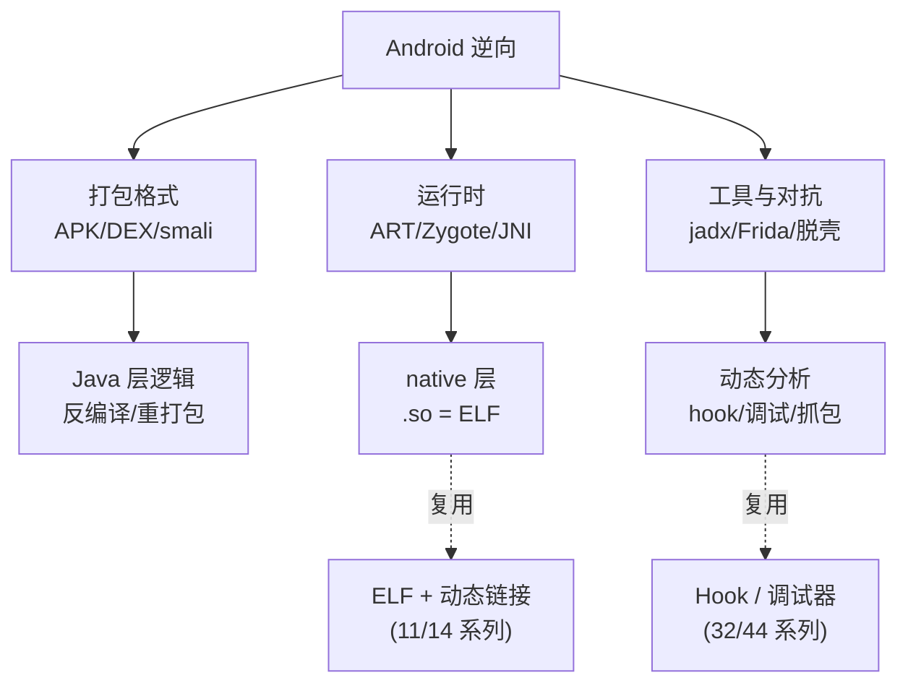

# Android逆向与运行时 · 系列总览

> 作者原创系列，共 **21** 篇（16–21 为进阶专题扩展）。系统拆解 Android 应用的逆向工程与运行时机制：从 **APK/DEX 打包格式**、**Dalvik/ART 字节码与 smali**，到 **ART 运行时**、**Zygote 启动**、**JNI/native 层**，再落到 **静态/动态分析工具**（jadx/apktool/Frida）、**加固脱壳**、**反调试对抗**、**抓包与 SSL Pinning**、**APK 签名 v1–v4** 与一次**完整实战逆向**。Android native `.so` 即 ELF + 动态链接——本系列与 [[11.ELF文件详解/00.ELF文件详解总览|ELF 文件详解]]、[[14.动态链接与加载器详解/00.动态链接与加载器总览|动态链接与加载器]]、[[32.hooks/00.总览|Hook 技术]]、[[44.调试器原理与实战/00.调试器原理与实战总览|调试器原理]] 深度互补。

## 一、基础与全景

| # | 章节 | 说明 |
| --- | --- | --- |
| 01 | [[01.Android架构与逆向全景]] | 系统分层、Linux 内核/ART/Framework/App、逆向目标与工具链全景 |

## 二、打包格式

| # | 章节 | 说明 |
| --- | --- | --- |
| 02 | [[02.APK结构详解]] | APK=ZIP、classes.dex/resources.arsc/AndroidManifest(AXML)/lib/META-INF |
| 03 | [[03.DEX文件格式]] | 魔数、头部、string/type/proto/field/method/class_def、字节布局 |
| 04 | [[04.Dalvik字节码与smali]] | 寄存器型字节码、smali 语法、助记符、反汇编/重打包 |

## 三、运行时

| # | 章节 | 说明 |
| --- | --- | --- |
| 05 | [[05.ART运行时]] | Dalvik→ART、AOT/JIT、oat/vdex/art、dex2oat、解释器 |
| 06 | [[06.应用启动与Zygote]] | Zygote fork、预热、AMS、Application/Activity 启动链 |
| 07 | [[07.JNI与native层]] | JNI 类型签名、RegisterNatives/JNI_OnLoad、.so 与 ELF/动态链接 |

## 四、分析工具与动态

| # | 章节 | 说明 |
| --- | --- | --- |
| 08 | [[08.静态分析工具]] | jadx/apktool/IDA/Ghidra、反编译流程、资源还原 |
| 09 | [[09.Frida动态插桩]] | frida 架构、frida-server、Java/native hook、脚本 |
| 10 | [[10.动态调试]] | smali 调试、IDA/lldb 调 so、调试 server、断点 |

## 五、加固与对抗（安全研究 / 防御视角）

| # | 章节 | 说明 |
| --- | --- | --- |
| 11 | [[11.加固与脱壳]] | 壳分类、DEX 抽取/VMP、内存 dump 脱壳原理（分析视角） |
| 12 | [[12.反调试与反Frida对抗]] | ptrace 检测、调试标志、Frida 特征检测与对抗（分析视角） |
| 13 | [[13.抓包与SSL_Pinning绕过]] | 证书校验、Pinning 原理、抓包分析（自有 App 评估视角） |

## 六、完整性与实战

| # | 章节 | 说明 |
| --- | --- | --- |
| 14 | [[14.APK签名机制v1到v4]] | JAR 签名 v1、APK Signing Block v2、v3 密钥轮换、v4 增量 |
| 15 | [[15.实战完整逆向]] | 一个样本：定位→反编译→Frida→native→还原逻辑全流程 |

## 七、进阶专题（扩展）

| # | 章节 | 说明 |
| --- | --- | --- |
| 16 | [[16.Xposed与LSPosed框架]] | Xposed/ART method hook、LSPosed/Zygisk、模块开发、检测对抗 |
| 17 | [[17.so逆向与native层深入分析]] | so/ELF、RegisterNatives 定位、OLLVM 去混淆、Unicorn 模拟、AArch64 |
| 18 | [[18.应用层协议分析与算法还原]] | 签名/加密算法定位、Frida 主动调用、Protobuf、协议重放 |
| 19 | [[19.Root原理Magisk与KernelSU]] | su/systemless、Magisk/Zygisk、KernelSU、Root 检测对抗 |
| 20 | [[20.Jetpack_Compose逆向]] | Composable 编译变换、recomposition、字节码识别、Compose 逆向 |
| 21 | [[21.插件化与热修复逆向]] | 插件化 ClassLoader 代理、Tinker/AndFix 热修复、补丁还原 |

## Android 逆向的三大支柱



> 一句话：Android 逆向 = **看懂打包格式**（APK/DEX/smali 把 App 拆开）+ **理解运行时**（ART 如何执行、Zygote 如何起、JNI 如何跨到 native）+ **用对工具**（jadx 静态、Frida 动态、脱壳穿透加固）。读完本系列，你能独立分析一个真实 App 的 Java 与 native 逻辑。

---

## Android 版本 × 逆向影响时间线

Android 每次大版本更新都对逆向工具链产生实质影响。以下时间线标注了逆向工程师需要关注的关键节点：

| Android 版本 | API | 关键逆向影响 |
|---|---|---|
| **5.0 Lollipop** | 21 | Dalvik 正式退场，ART 成为唯一运行时；OAT 格式替代 DEX，`dex2oat` 在安装时 AOT 编译；`odex` 文件格式变化，旧版 baksmali 工具需更新 |
| **7.0 Nougat** | 24 | 引入 **JIT + Profile-Guided Compilation**（混合模式），`vdex` 格式出现；**non-SDK API 限制**首次引入（灰名单），通过 `Reflection` 访问 `@hide` 方法开始受限；`network_security_config` 默认不信任用户 CA（抓包方式改变） |
| **8.0 Oreo** | 26 | `ClassLoader` 隔离加强，Instant Apps 沙箱；`dex2oat` 编译策略调整（speed-profile），`art` 文件与 `oat` 文件分离更清晰 |
| **9.0 Pie** | 28 | **非 SDK 限制升级**（黑/深灰/浅灰名单），`getDeclaredMethods` 等反射方法对黑名单字段返回空；APK 签名 v3（密钥轮换）上线；`ptrace` 能力在特定配置下受限 |
| **10 Q** | 29 | **Scoped Storage**（沙箱化存储）影响文件写入路径（`/sdcard` 受限）；`compact DEX（cdex）`格式引入（`classes.cdex`），需 `compact_dex_converter` 或新版 baksmali 才能处理；`execmem` SELinux 策略收紧 |
| **11 R** | 30 | APK 签名 v4 + 增量安装（IncFS）；**non-SDK 严格模式**，`setAccessible(true)` 对黑名单字段抛出 `NoSuchFieldException`；原生 APEX 包（`/apex/*` 路径），系统库不再在 `/system/lib64` 下有符号链接 |
| **12 S** | 31 | `exported` 属性对所有含 `intent-filter` 的组件强制声明（影响 Activity 劫持测试）；`UnsafeOptIn` 注解标记的 API 访问需显式 opt-in；Zygote 预加载优化变化 |
| **13 T** | 33 | **Hidden API** 绕过方案（双反射/`Unsafe`）被系统主动检测；APK 签名 v3.1（`0x1b93ad61`）；媒体权限细化（读取图片/视频分别授权）；`JobScheduler` 权限检查收紧影响分析脚本自动化 |
| **14 U** | 34 | `ClassLoader` 隔离进一步收紧；`ptrace` 在 `userdebug`/`eng` 构建之外的行为变化；动态代码加载（`DEX_IN_BOOT_CLASSPATH`）受限 |
| **15 V** | 35 | `MANAGE_MEDIA` 权限要求提高；`execmem` 限制影响部分 JIT hook 方案；系统签名校验路径变化 |

> [!tip] 实操建议
> 确认目标 App 的 `minSdk` 和 `targetSdk`，结合上表判断哪些分析手段在目标设备版本上可用。例如：针对 `targetSdk 33+` 的 App，`setAccessible` 黑名单绕过需要额外步骤；针对 `minSdk 24+` 的 App 不需要考虑 Dalvik 兼容性。

---

## 工具 × Android API 兼容矩阵

主流逆向工具对不同 Android 版本/API 的支持存在断层，错误版本匹配会导致分析结果不可信：

| 工具 | 关键版本要求 | 已知断层/注意事项 |
|---|---|---|
| **jadx** | ≥ 1.4.0 推荐 | 1.3.x 对 cdex（Android 10+）支持不完整；1.4+ 支持 compact DEX 直接反编译 |
| **apktool** | ≥ 2.8.0 推荐 | 2.7.x 对 Android 13 资源格式兼容性问题；`AndroidManifest` 二进制 XML 解析在旧版偶有字段丢失 |
| **baksmali / smali** | ≥ 3.0.0 | 2.x 不支持 cdex；Android 10+ `classes.cdex` 必须用 3.x；DEX 版本 `040`/`041` 需最新版 |
| **Frida** | ≥ 16.x 推荐 | 15.x 在 Android 12+ 的 Art method 内联缓存结构上有 hook 失效 Bug；16.x 修复了 Android 13 的部分权限问题 |
| **frida-server** | 必须与 frida 客户端**同版本** | 版本不匹配直接报 `version mismatch`；升级时客户端和服务端同步升级 |
| **IDA Pro** | ≥ 7.7 推荐 | 7.6 的 Android 调试器在 arm64 Android 12+ 附加时偶有 SIGBUS；7.7+ 改善了 AArch64 调试稳定性 |
| **objection** | ≥ 1.11.0 | 依赖 Frida 版本，指定 `--frida-version` 参数与已安装的 frida-server 匹配 |
| **adb** | platform-tools ≥ 34 | 旧版 `adb` 在 Android 14+ 的 `adb root` 可能失败；`adb pair` mDNS 配对需 32+ |
| **JADX + DEX 040** | jadx ≥ 1.5.0 | DEX 格式版本 040（Android 14）新增指令集，旧版 jadx 解析失败 |

**常见版本不匹配症状**：

| 症状 | 可能原因 |
|---|---|
| `frida -U` 连接但 `Java.perform` 回调不触发 | frida 客户端与 frida-server 版本不匹配 |
| apktool 重打包后 App 崩溃（无报错） | apktool 版本与目标 APK 资源格式不兼容，导致 `resources.arsc` 损坏 |
| jadx 反编译输出大量 `UnknownOpcode` 错误 | baksmali 或 jadx 版本不支持目标 DEX 格式版本 |
| IDA attach 后 App 立即崩溃 | Android 版本与 IDA 调试器不兼容，或 `debuggable=false` 但 ptrace 权限不足 |
| Frida hook 注入成功但目标函数没有触发 | arm64 内联缓存（IC）导致 ART 直接调用，绕过了 JNI 层；需 hook art 方法 |

---

## Play Integrity / SafetyNet 演进（知识盲区补充说明）

> [!note] 本节作为系列知识盲区的补充说明
> Play Integrity API 和 SafetyNet Attestation 是 Android 对抗体系中与 Google 服务深度耦合的部分，单靠离线逆向难以完整理解其内部机制，本节梳理关键节点供参考，配合 [[12.反调试与反Frida对抗]] §Play Integrity 绕过难度 一节食用。

**SafetyNet → Play Integrity 演进时间线**：

```
2013  SafetyNet Attestation API 发布
         ↓ 初版：基于证书链 + 设备属性的软件检测
2017  加入 Hardware-backed attestation（TEE 支持）
         ↓ ctsProfileMatch: 是否通过 CTS 认证
2020  SafetyNet 引入 verdict throttling（限速，绕过变难）
         ↓
2022  Google 宣布 Play Integrity API 取代 SafetyNet
         ↓ MEETS_BASIC / DEVICE / STRONG 三级判定
2023  SafetyNet Attestation 不再接受新应用接入
         ↓
2024  SafetyNet Attestation API 正式停服（现有调用返回错误）
         ↓
当前  Play Integrity API 为唯一官方方案
      三级 verdict：BASIC / DEVICE_INTEGRITY / STRONG_INTEGRITY
```

**对逆向分析的实际影响**：

1. **2024 年后分析 SafetyNet 绕过的文档/模块已过时**：搜索到的多数 Magisk SafetyNet Fix 模块已无意义，应改看 PlayIntegrityFix 相关资源
2. **Play Integrity verdict 由 Google Play 服务（非 App 本身）生成**：verdict token 由 Google 服务端签发，App 只是调用 API 并将 token 转发给自有后端；真正的防护在 Google 服务端，无法本地伪造
3. **绕过代价不对称**：破解 SafetyNet 时代需修改本地 App 属性；Play Integrity 时代需要泄露的厂商 Keybox（硬件级别），门槛大幅提高

**本系列的知识边界**：本系列 12 篇已覆盖 Play Integrity 的调用层（Java API）和设备完整性绕过的已知方法；Google 服务端的 token 验证逻辑属于黑盒，超出可逆向分析的范围。如需深入研究，参考 Android Security Bulletins 和 Google Play Integrity 官方文档。
