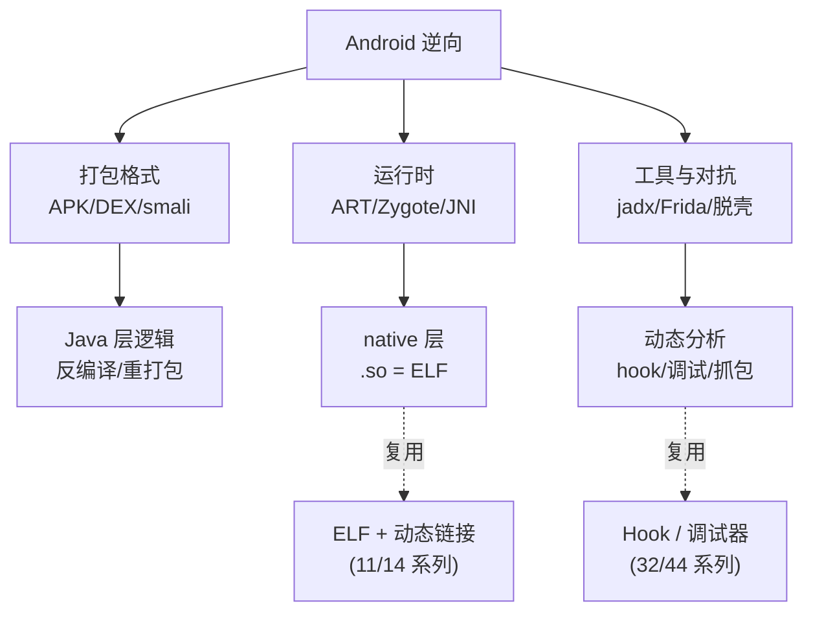

# Android逆向与运行时 · 系列总览

> 作者原创系列，共 **15** 篇。系统拆解 Android 应用的逆向工程与运行时机制：从 **APK/DEX 打包格式**、**Dalvik/ART 字节码与 smali**，到 **ART 运行时**、**Zygote 启动**、**JNI/native 层**，再落到 **静态/动态分析工具**（jadx/apktool/Frida）、**加固脱壳**、**反调试对抗**、**抓包与 SSL Pinning**、**APK 签名 v1–v4** 与一次**完整实战逆向**。Android native `.so` 即 ELF + 动态链接——本系列与 [[11.ELF文件详解/00.ELF文件详解总览|ELF 文件详解]]、[[14.动态链接与加载器详解/00.动态链接与加载器总览|动态链接与加载器]]、[[32.hooks/00.总览|Hook 技术]]、[[44.调试器原理与实战/00.调试器原理与实战总览|调试器原理]] 深度互补。

## 一、基础与全景

| # | 章节 | 说明 |
| --- | --- | --- |
| 01 | [[01.Android架构与逆向全景]] | 系统分层、Linux 内核/ART/Framework/App、逆向目标与工具链全景 |

## 二、打包格式

| # | 章节 | 说明 |
| --- | --- | --- |
| 02 | [[02.APK结构详解]] | APK=ZIP、classes.dex/resources.arsc/AndroidManifest(AXML)/lib/META-INF |
| 03 | [[03.DEX文件格式]] | 魔数、头部、string/type/proto/field/method/class_def、字节布局 |
| 04 | [[04.Dalvik字节码与smali]] | 寄存器型字节码、smali 语法、助记符、反汇编/重打包 |

## 三、运行时

| # | 章节 | 说明 |
| --- | --- | --- |
| 05 | [[05.ART运行时]] | Dalvik→ART、AOT/JIT、oat/vdex/art、dex2oat、解释器 |
| 06 | [[06.应用启动与Zygote]] | Zygote fork、预热、AMS、Application/Activity 启动链 |
| 07 | [[07.JNI与native层]] | JNI 类型签名、RegisterNatives/JNI_OnLoad、.so 与 ELF/动态链接 |

## 四、分析工具与动态

| # | 章节 | 说明 |
| --- | --- | --- |
| 08 | [[08.静态分析工具]] | jadx/apktool/IDA/Ghidra、反编译流程、资源还原 |
| 09 | [[09.Frida动态插桩]] | frida 架构、frida-server、Java/native hook、脚本 |
| 10 | [[10.动态调试]] | smali 调试、IDA/lldb 调 so、调试 server、断点 |

## 五、加固与对抗（安全研究 / 防御视角）

| # | 章节 | 说明 |
| --- | --- | --- |
| 11 | [[11.加固与脱壳]] | 壳分类、DEX 抽取/VMP、内存 dump 脱壳原理（分析视角） |
| 12 | [[12.反调试与反Frida对抗]] | ptrace 检测、调试标志、Frida 特征检测与对抗（分析视角） |
| 13 | [[13.抓包与SSL_Pinning绕过]] | 证书校验、Pinning 原理、抓包分析（自有 App 评估视角） |

## 六、完整性与实战

| # | 章节 | 说明 |
| --- | --- | --- |
| 14 | [[14.APK签名机制v1到v4]] | JAR 签名 v1、APK Signing Block v2、v3 密钥轮换、v4 增量 |
| 15 | [[15.实战完整逆向]] | 一个样本：定位→反编译→Frida→native→还原逻辑全流程 |

## Android 逆向的三大支柱

> 一句话：Android 逆向 = **看懂打包格式**（APK/DEX/smali 把 App 拆开）+ **理解运行时**（ART 如何执行、Zygote 如何起、JNI 如何跨到 native）+ **用对工具**（jadx 静态、Frida 动态、脱壳穿透加固）。读完本系列，你能独立分析一个真实 App 的 Java 与 native 逻辑。
