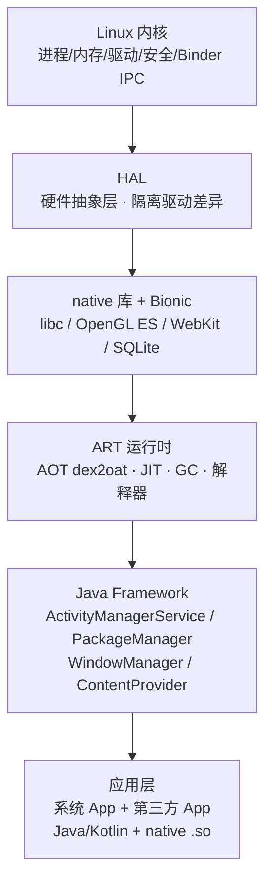
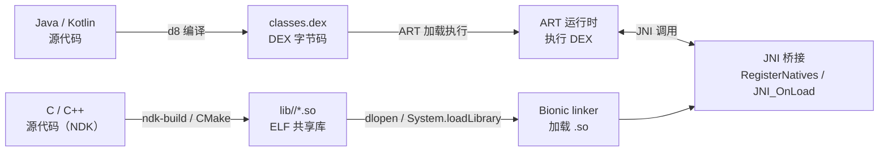
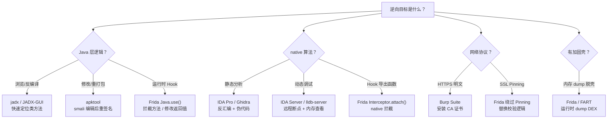
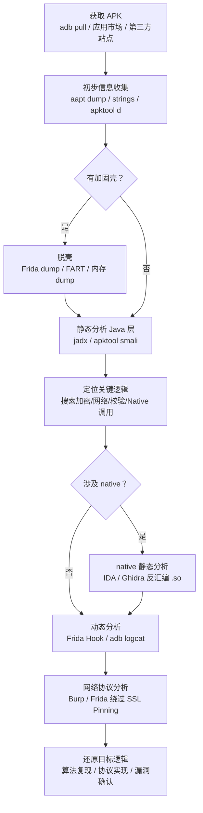

# Android逆向（01）· Android架构与逆向全景

> [!abstract] TL;DR
> - Android 是一个**分层操作系统**：从 Linux 内核、HAL、Bionic/native 库，到 ART 运行时，再到 Java Framework，最终托起应用层。每一层都是逆向的潜在目标。
> - 应用有**两种形态**：Java/Kotlin 代码编译为 DEX 字节码（ART 执行），native 代码编译为 `.so`（即 ELF，参见 [[11.ELF文件详解/00.ELF文件详解总览.md]]）。两条路径对应两套不同的逆向手段。
> - 逆向的四大动机：**安全评估、恶意样本分析、互操作研究、技术学习**。合规边界始终是前提。
> - 工具链分为静态（jadx/apktool/IDA/Ghidra）、动态（Frida/Xposed）、系统（adb/dumpsys）三大类，各自覆盖不同的分析层次。

---

## 概述与定位

Android 是当今最广泛部署的移动操作系统，承载着数十亿设备上的金融、通信、医疗类应用。理解其内部架构是所有逆向工程工作的起点——**你分析的每一个目标，都运行在这个分层体系里**。

本篇是系列开篇，目标是建立一张「全景地图」：说清楚 Android 从内核到应用的分层结构、应用代码的两种形态、逆向的动机与目标维度、工具链的全貌，以及贯穿本系列的工作流。后续各篇（APK 格式、DEX 字节码、ART 运行时、Frida 插桩……）都可以在这张地图上找到自己的位置。

---

## Android 系统分层

### 六层架构

Android 的架构自下而上可以分为六层，每一层都为上层提供服务，同时也限制了上层能做的事：

**Linux 内核（Linux Kernel）**

Android 使用经过深度定制的 Linux 内核，添加了 Binder IPC 驱动（`/dev/binder`）、Ashmem（匿名共享内存）、Wakelocks 等 Android 特有机制。进程隔离、UID 沙箱、SELinux 策略、文件系统权限全部由内核层强制执行。逆向视角下，内核是 `ptrace` 附加调试、`/proc/<pid>/maps` 内存布局读取、系统调用 hook 的基础。

**HAL（Hardware Abstraction Layer）**

硬件抽象层将 Android 框架与底层驱动解耦。Android 8.0 Treble 引入 `HIDL`（Hardware Interface Definition Language），之后 Android 12 迁向 `AIDL HAL`，使 HAL 组件可以独立于厂商驱动升级。逆向分析时 HAL 层较少直接接触，但在分析特定硬件相关漏洞时会涉及。

**native 库与 Bionic**

这一层包含大量 C/C++ 共享库：
- **Bionic**：Android 自己的 C 标准库（替代 glibc），实现了 `libc`、`libm`、`libdl`。Bionic 针对嵌入式环境做了精简，其动态链接器 `linker`/`linker64` 是 Android 上加载 `.so` 的核心组件。
- **OpenGL ES / Vulkan**：图形渲染库。
- **WebKit / SQLite / zlib**：WebView、数据库、压缩等系统级 native 库。

这些库以 ELF 格式的 `.so` 文件存在，是 [[11.ELF文件详解/00.ELF文件详解总览.md]] 和 [[14.动态链接与加载器详解/00.动态链接与加载器总览.md]] 所讲内容的直接应用场景。

**ART 运行时（Android Runtime）**

ART 是执行 DEX 字节码的核心组件，取代了 Android 4.4 之前的 Dalvik。ART 引入了 AOT（Ahead-of-Time）编译，将 DEX 提前编译为本地机器码（输出 `.oat`/`.vdex`/`.art` 文件），同时保留了 JIT 和解释器模式。详见 [[05.ART运行时]]。

**Java Framework**

基于 ART 之上，Java Framework 提供了应用开发所需的所有系统服务：

| 组件 | 职责 |
|---|---|
| `ActivityManagerService`（AMS） | 管理 Activity/进程生命周期 |
| `PackageManagerService`（PMS） | APK 安装、权限、签名校验 |
| `WindowManagerService`（WMS） | 窗口合成与显示 |
| `ContentProvider` | 跨进程数据共享 |
| `BroadcastReceiver` | 异步广播机制 |

逆向时，通过 Hook Framework 层的这些服务（尤其是 AMS/PMS），可以在不修改 APK 的前提下监控甚至改变应用行为——这是 Xposed 和 LSPosed 框架的核心能力。

**应用层**

最上层是所有用户可见的应用。一个典型的 Android App 同时包含 Java/Kotlin 代码（编译为 DEX）和 native 代码（编译为 `.so`，即 ELF 格式）。应用与系统的交互通过 Binder IPC 完成。

---

## 应用的两种形态

### DEX 字节码（Java/Kotlin 路径）

Java 或 Kotlin 源代码经编译器处理后，生成 `.class` 文件，再由 `d8`（旧版为 `dx`）工具转换为 **DEX（Dalvik Executable）** 字节码，打包进 APK 的 `classes.dex`（或 `classes2.dex`、`classes3.dex`……）。

DEX 是**寄存器型字节码**（区别于 JVM 的栈式字节码），每条指令明确指定操作数寄存器。DEX 魔数为 `64 65 78 0A 30 33 35 00`（即 `dex\n035\0`，版本号随 SDK 演进，035/037/038/039 等）。

| 阶段 | 工具 | 输出 |
|---|---|---|
| Java/Kotlin 源码 → `.class` | `javac` / `kotlinc` | JVM 字节码 |
| `.class` → `.dex` | `d8`（旧：`dx`） | DEX 字节码 |
| `.dex` → 机器码（AOT） | `dex2oat` | `.oat` / `.vdex` |
| 运行时（JIT/解释） | ART 解释器 | 直接执行 DEX |

逆向 DEX 层是最常见的 Android 逆向场景——jadx 可以将 DEX 直接反编译为接近原始 Java 的代码，apktool 可以将 DEX 反汇编为可读的 smali 语法，再重新打包。详见 [[02.APK结构详解]]。

### native 代码（.so/ELF 路径）

NDK（Native Development Kit）允许开发者用 C/C++ 编写代码，编译为针对目标 ABI 的 `.so` 文件（ELF 格式），打包进 APK 的 `lib/<abi>/` 目录。

这类代码通过 **JNI（Java Native Interface）** 与 Java 层交互，在 Java 侧声明 `native` 方法，在 `.so` 内实现对应的 C 函数。详见 [[07.JNI与native层]]。

对 `.so` 的逆向需要完全不同的工具链——IDA Pro 或 Ghidra 反汇编，IDA/lldb 动态调试。`.so` 本质上就是标准 ELF 共享库，所有 ELF 结构（`.text`/`.data`/`.got`/`.plt`/`DYNAMIC` 段等）在 Android 上与 Linux 桌面环境保持一致，区别在于动态链接器是 Android 自己的 `linker64`，以及 Bionic 作为 C 库。

---

## 为什么逆向

### 四大动机

逆向 Android 应用有明确的合理用途，理解动机有助于在实际工作中选择正确的技术路径：

**安全评估（Security Assessment）**

对自有 App 或在授权范围内对目标 App 进行安全测试：检测敏感数据（密钥、Token、证书）是否硬编码于代码中、网络通信是否有 SSL Pinning 可被绕过、业务逻辑是否存在可被客户端操控的授权缺陷、是否存在未保护的 exported 组件。这是企业移动安全团队最常见的逆向场景。

**恶意样本分析（Malware Analysis）**

分析恶意 APK 的行为：提取 C2 服务器地址、还原加密算法、理解数据窃取逻辑、分析持久化机制。沙箱环境（隔离的模拟器或测试机）是必要条件。

**互操作与兼容性研究（Interoperability）**

分析特定平台 API 的实际行为（文档外的实现细节）、理解私有协议的网络格式、为开源替代实现提供参考。

**技术学习（Learning）**

理解 Android 系统内部机制——ART 如何执行字节码、Zygote 如何 fork 进程、JNI 如何跨越 Java/native 边界——本系列本身就服务于这个目标。

---

## 逆向目标维度

一个完整的 Android App 可以从以下维度被逆向分析，每个维度对应不同的技术栈：

| 维度 | 典型目标 | 主要工具 |
|---|---|---|
| **Java 层业务逻辑** | 网络请求构造、加密参数生成、授权检查、反调试检测 | jadx / apktool + smali / Frida Java Hook |
| **native 层算法** | 硬编码密钥、自定义加密算法、JNI 实现的核心逻辑 | IDA / Ghidra / Frida native hook |
| **网络协议** | HTTP/HTTPS 流量分析、私有二进制协议、SSL Pinning 绕过 | Burp Suite / mitmproxy + Frida |
| **加固壳** | DEX 抽取型、VMP 型、整体加固 | 内存 dump 脱壳 + dex-tools |
| **系统级行为** | 权限请求、Binder 调用、文件访问、广播注册 | adb + dumpsys + strace / Frida |

---

## 工具链全景

### 工具分类总览

| 类别 | 工具 | 用途 | 系列对应 |
|---|---|---|---|
| **静态分析** | jadx / JADX-GUI | DEX → Java 反编译，直观浏览业务逻辑 | [[08.静态分析工具]] |
| **静态分析** | apktool | APK 拆包、smali 反汇编、资源还原、重打包 | [[08.静态分析工具]] |
| **静态分析** | IDA Pro | native `.so` 反汇编与分析（商业，industry-standard） | [[08.静态分析工具]] |
| **静态分析** | Ghidra | native `.so` 反汇编，NSA 开源，反编译质量高 | [[08.静态分析工具]] |
| **动态插桩** | Frida | 运行时 Java/native Hook，注入 JS 脚本 | [[09.Frida动态插桩]] |
| **动态插桩** | Xposed / LSPosed | 基于 ART Hook 的模块框架，Hook Framework 层 | [[09.Frida动态插桩]] |
| **动态调试** | IDA + IDA Server | native `.so` 远程调试，设置断点、查寄存器 | [[10.动态调试]] |
| **动态调试** | lldb + lldb-server | 开源 LLVM 调试器，Android NDK 官方配套 | [[10.动态调试]] |
| **系统工具** | adb | APK 安装/推送、日志抓取（logcat）、shell 访问 | — |
| **系统工具** | dumpsys | 查询系统服务状态（activity/package/meminfo）| — |
| **抓包** | Burp Suite / mitmproxy | HTTPS 中间人抓包（配合 CA 证书安装） | [[13.抓包与SSL_Pinning绕过]] |

### 工具选择决策树

> [!warning] 示例输出为示意
> 上述工具的具体命令与输出示例见各对应篇章，以实际环境版本为准。

---

## ABI 与 CPU 架构

Android 应用的 native 代码按目标 CPU 架构打包进不同的 `lib/<abi>/` 子目录：

| ABI | 架构 | 说明 |
|---|---|---|
| `armeabi-v7a` | ARM 32-bit（ARMv7-A） | 旧设备兼容，2013年前主流；现代设备仍需兼容包 |
| `arm64-v8a` | ARM 64-bit（ARMv8-A / AArch64） | 2014年后主流，当前绝大多数设备默认架构 |
| `x86` | Intel/AMD 32-bit | 模拟器（x86 模拟器，现已较少使用） |
| `x86_64` | Intel/AMD 64-bit | x86 模拟器（64位），以及部分 Chromebook |

> [!tip] 逆向时的 ABI 选择
> 现实分析中优先选择 `arm64-v8a` 的 `.so`——它是主流设备的实际执行版本，且 IDA/Ghidra 对 AArch64 的反编译质量最成熟。`x86_64` 版本在 x86 模拟器上可以直接用 `gdb`/`lldb` 调试，但反编译出的指令与真实设备不同。

系统在运行时根据设备支持的 ABI 列表（`adb shell getprop ro.product.cpu.abilist`）按优先级选择最合适的 `.so` 加载。一个 APK 理论上可以包含多套 ABI 的 `.so`，也可以只提供一种。

---

## API Level 与版本演进

Android API Level 是版本的内部编号，与逆向工程密切相关——不同 API Level 下，运行时机制、安全边界、签名要求均有变化：

| Android 版本 | API Level | 逆向相关重大变化 |
|---|---|---|
| 4.4 KitKat | 19 | ART 作为可选运行时引入，Dalvik 默认 |
| 5.0 Lollipop | 21 | **Dalvik 退场，ART 成为唯一运行时**；64-bit 支持 |
| 7.0 Nougat | 24 | 用户 CA 证书默认不信任（影响抓包）；混合 JIT+AOT；**APK 签名 v2 引入** |
| 8.0 Oreo | 26 | Project Treble（HAL 与厂商驱动解耦）；vdex 格式引入 |
| 9.0 Pie | 28 | 非 SDK 接口限制（灰名单/黑名单）；TLS 1.3；**签名 v3（密钥轮换）引入** |
| 10 | 29 | Scoped Storage；TLS 1.3 默认启用 |
| 11 | 30 | **targetSdk 30+ 强制 APK 至少带 v2 签名**；`/proc/net` 访问限制 |
| 12 | 31 | 签名 v4 引入；exported 组件强制声明 |
| 13 | 33 | 更细粒度权限；媒体访问变化 |
| 14 | 34 | 签名 v2/v3 验证强化；部分 JNI 限制 |

**Dalvik → ART 演进对逆向的影响**

Dalvik 时代（Android < 5.0）字节码在运行时逐条解释执行（带 JIT），`classes.dex` 就是实际执行的内容。ART 之后引入 AOT，安装时 `dex2oat` 会将 DEX 编译为 `.oat` 文件（内含本地机器码）。这意味着：

- `.oat` 文件也可以用 IDA/Ghidra 分析（本质上是 ELF，包含 `.text` 段），但反编译难度高于 DEX。
- ART 仍保留解释器和 JIT，DEX 反编译（jadx）始终有效，因为 DEX 文件本身不变。
- `vdex` 文件（Android 8.0+）存储验证过的 DEX 数据，可以从中提取原始 DEX。

详见 [[05.ART运行时]]。

---

## 逆向工作流总览

下图展示一次完整逆向分析的典型流程——从获取 APK 到还原目标逻辑：

| 阶段 | 目标 | 工具示例 |
|---|---|---|
| 获取 APK | 取得待分析样本 | `adb shell pm path <pkg>` → `adb pull` |
| 初步信息收集 | 包名/权限/组件/版本/文件列表 | `aapt dump badging` / `unzip -l` |
| 脱壳（如有） | 还原真实 DEX | Frida + FART / BlackDex |
| 静态分析 Java 层 | 反编译阅读业务逻辑 | jadx-gui / apktool |
| 定位关键逻辑 | 找到加密、网络、校验入口 | jadx 全局搜索字符串/类名 |
| native 静态分析 | 理解 C/C++ 算法 | IDA Pro / Ghidra |
| 动态分析 | 运行时验证猜想、Hook 关键函数 | Frida / lldb / adb logcat |
| 网络协议分析 | 抓包、绕过 SSL Pinning | Burp Suite + Frida |
| 还原逻辑 | 输出分析报告 / 概念验证 | Python / 伪代码 |

---

## 安全性与正确使用

### 合规边界

> [!danger] 重要：合规是前提，不是可选项
> 本系列所有技术内容面向以下合法场景：
> 1. **自有 App 安全评估**：对自己开发或拥有的应用进行安全测试。
> 2. **授权渗透测试**：在明确书面授权下对委托方的应用进行测试。
> 3. **恶意样本分析**：在隔离环境中分析已发现的恶意 APK。
> 4. **技术学习与 CTF**：对专用练习样本或 CTF 题目进行分析。
>
> **不适用场景**：对他人生产环境中的应用实施未授权逆向、破解商业应用的付费逻辑、绕过他人版权保护。许多国家和地区的法律（如美国 DMCA、中国《网络安全法》）对未授权逆向行为有明确限制。

### 环境隔离

| 环境 | 优点 | 适用场景 |
|---|---|---|
| Android 模拟器（AVD） | 快速创建/销毁，支持快照，x86 可用 gdb | 基础分析、网络协议分析、无强检测的样本 |
| 物理测试机（已 root） | 最接近真实环境，可绕过部分检测 | 反调试样本、需要真实硬件特性的分析 |
| 云端沙箱 | 免安装，有自动化分析报告 | 恶意样本初步评估 |

> [!warning] 测试机与日常机隔离
> 逆向环境（root / Frida-server / 自签 CA 证书安装）会降低设备安全性。务必使用**专用测试设备**，不要在日常使用的手机上安装 frida-server 或 Magisk。

### 实践建议

1. **先静后动**：静态分析成本低、不留痕迹，优先用 jadx 建立整体理解，再针对性地动态 Hook。
2. **构建基线**：用 `aapt`、`apktool` 提取 `AndroidManifest.xml` 和权限声明，了解 App 声明的能力边界。
3. **版本匹配**：frida-server 版本必须与 Frida Python 客户端版本严格一致；jadx 版本影响反编译质量，优先使用最新稳定版。
4. **保留原始样本**：分析前备份原始 APK，修改重打包只在副本上操作。
5. **日志与记录**：动态分析过程中保留 `adb logcat` 日志，便于复盘和报告撰写。

---

## 小结

本篇建立了 Android 逆向的全景认知：

- **系统分层**决定了攻击面的分布——Linux 内核、Bionic、ART、Framework、App 各层都有对应的分析技术。
- **应用的两种形态**（DEX 字节码 vs native `.so`）决定了必须掌握两套工具链：jadx/smali 用于 Java 层，IDA/Ghidra/Frida-native 用于 native 层。
- **逆向工作流**是「静态定位 + 动态验证 + native 深挖 + 网络分析」的组合，本系列各篇正是对这个流程各阶段的系统拆解。
- **合规与环境隔离**是所有逆向工作的前提，不是附加项。

后续各篇将按照这张地图逐步展开：先看清 APK 的「包装」（[[02.APK结构详解]]），再拆解 DEX 格式与 smali，理解 ART 如何执行，深入 JNI 桥接，最后掌握完整的工具链与对抗技巧。

---

## 相关阅读

- [[02.APK结构详解]] — APK 的 ZIP 结构、各核心文件详解
- [[05.ART运行时]] — Dalvik 到 ART 的演进，AOT/JIT/解释器机制
- [[07.JNI与native层]] — JNI 类型签名、`RegisterNatives` / `JNI_OnLoad` 流程
- [[11.ELF文件详解/00.ELF文件详解总览.md]] — Android native `.so` 即 ELF，本系列的 native 层基础
- [[14.动态链接与加载器详解/00.动态链接与加载器总览.md]] — Bionic linker 加载 `.so` 的完整机制
- [[08.静态分析工具]] — jadx / apktool / IDA / Ghidra 实战
- [[09.Frida动态插桩]] — Frida 架构与 Java/native Hook 实践
- [[44.调试器原理与实战/00.调试器原理与实战总览.md]] — 调试器原理，含 ptrace 与反调试
- [[34.现代二进制防护机制/00.现代二进制防护机制总览.md]] — 加固与防护机制

---

⬅️ 上一篇 [[00.Android逆向与运行时总览]] ｜ 🏠 [[00.Android逆向与运行时总览]] ｜ 下一篇 [[02.APK结构详解]] ➡️
