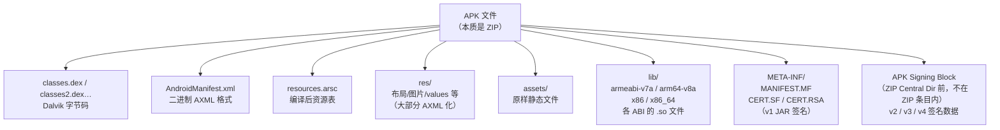
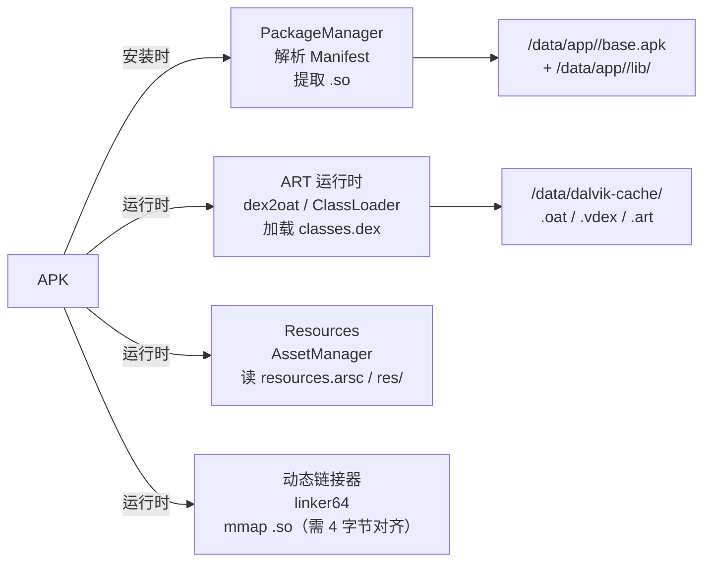
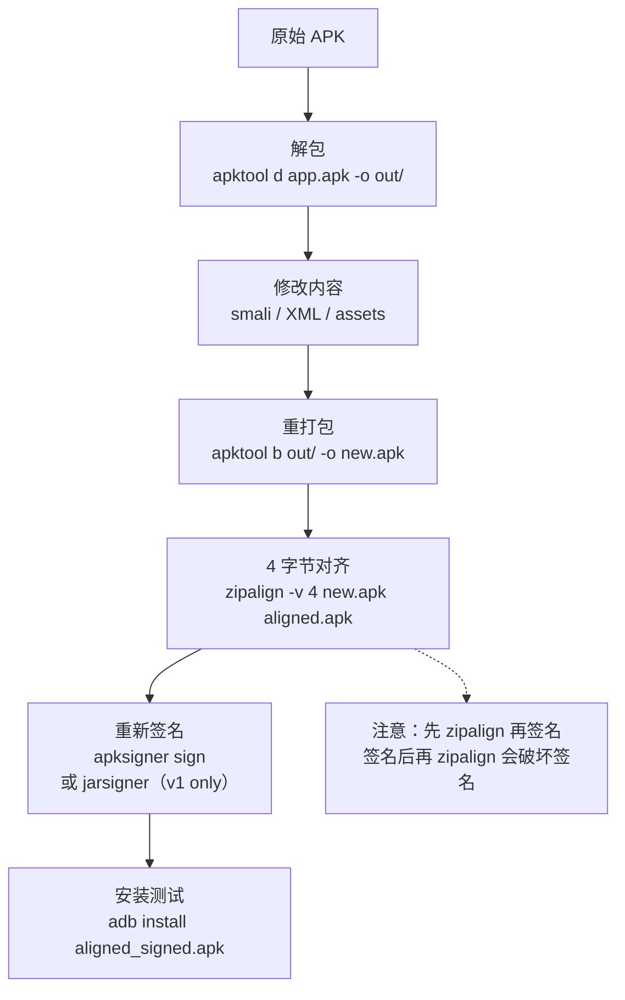

# Android逆向（02）· APK结构详解

> [!abstract] TL;DR
> - APK（Android Package）本质是一个 **ZIP 文件**，可以直接用 `unzip` 解开，无需专用工具。
> - 内部结构高度规范：`classes.dex`（Java/Kotlin 字节码）、`resources.arsc`（编译后资源表）、`AndroidManifest.xml`（**二进制 AXML，非文本**）、`res/`（编译后资源文件）、`assets/`（原样静态资源）、`lib/<abi>/*.so`（native 库）、`META-INF/`（v1 签名文件）。
> - `AndroidManifest.xml` 以二进制 AXML 格式存储，直接打开是乱码；需借助 `apktool`/`aapt2 dump` 还原为可读 XML。
> - `resources.arsc` 是编译后的资源索引表，所有资源 ID 均遵循 `0xPPTTEEEE` 编码规则（PP=包、TT=类型、EEEE=条目）。
> - 解包→修改→重打包后，**必须重新签名**，且对齐（`zipalign`）要在签名之前完成；签名机制详见 [[14.APK签名机制v1到v4]]。
> - 加固 App 的 DEX 在磁盘可能是加密/抽取状态（非明文），需脱壳后才能正常反编译；详见 [[11.加固与脱壳]]。

---

## 概述与定位

APK 是 Android 应用的标准分发容器。从操作系统视角看，它只是一个 ZIP 存档；从逆向工程视角看，它是通往 Java 字节码、native 代码、资源表、签名验证的入口。

理解 APK 结构是 Android 逆向的第一步：
- 知道 `classes.dex` 在哪里，才能用 jadx / apktool 正确反编译（参见 [[08.静态分析工具]]）；
- 知道 `AndroidManifest.xml` 是二进制格式，才不会被直接打开时的乱码迷惑；
- 知道签名在 `META-INF/` 以外还有 APK Signing Block，才能理解为何修改 APK 后必须重签名（参见 [[14.APK签名机制v1到v4]]）；
- 知道 `lib/` 里存放 ELF `.so` 文件，才能把逆向分析延伸到 native 层（参见 [[07.JNI与native层]]，底层结构参见 [[11.ELF文件详解/00.ELF文件详解总览.md]]）。

本篇在系列中的位置：

| 维度 | 本篇聚焦 | 相邻篇章 |
|---|---|---|
| 容器格式 | APK = ZIP，完整目录结构与各部分用途 | DEX 字节布局见 [[03.DEX文件格式]] |
| 二进制资源 | AXML 格式、resources.arsc 结构 | smali 字节码见 [[04.Dalvik字节码与smali]] |
| 工具实践 | apktool / unzip / zipalign / apksigner | 静态分析工具全景见 [[08.静态分析工具]] |
| 签名完整性 | META-INF v1，APK Signing Block v2/v3/v4 | 签名机制详见 [[14.APK签名机制v1到v4]] |
| 加固感知 | DEX 可能非明文，需脱壳 | 脱壳原理见 [[11.加固与脱壳]] |

---

## 原理与机制

### APK = ZIP：为什么这样设计

Android 选择 ZIP 作为 APK 容器，原因是工程上的务实取舍：

1. **成熟的工具生态**：ZIP 格式有几十年历史，压缩、验证、流式读取的实现无处不在；运行时 `ZipFile`/`ZipInputStream` API 可直接操作 APK 内条目，无需二次解压到磁盘。
2. **运行时直接读取**：Android 系统在安装和运行期直接从 ZIP 索引中读取特定条目（如动态链接器直接 `mmap` `.so` 文件）。**未压缩的条目**（`STORE` 模式）可以被直接内存映射，而无需先解压。这正是 `.so` 和部分资源必须在 ZIP 中以 `STORE` 模式存储、且需要 4 字节对齐（`zipalign`）的根本原因。
3. **逆向友好**：ZIP 结构公开、工具丰富——`unzip`/`7z`/`jar` 均可直接操作 APK，不存在专有容器壁垒。



> [!note] APK Signing Block 不是 ZIP 条目
> v2 及以上签名的数据块插入在 ZIP 文件数据区末尾与 Central Directory 之间，不作为普通 ZIP 条目存在。ZIP 解析器看不见它，但 Android 安装器验证时会找到它。这意味着：用 `unzip` 解包再重打包后，原有的 v2/v3 签名块消失——重打包必须重签名，且必须用 `apksigner` 而非旧的 `jarsigner`（只支持 v1）。详见 [[14.APK签名机制v1到v4]]。

### 文件加载路径：从安装到运行

理解 APK 结构不只是"知道文件在哪"，还要知道每个文件在运行时如何被消费：



---

## 完整目录结构详解

下表列出 APK 内所有核心路径及其用途，逆向时需要重点关注的条目用 * 标出：

| 路径 | 是否压缩 | 用途 | 逆向关注点 |
|---|---|---|---|
| `classes.dex` * | 通常 Deflate | Dalvik/ART 字节码，主 DEX | jadx/apktool 反编译入口 |
| `classes2.dex`、`classes3.dex`… * | 通常 Deflate | MultiDex：方法数超 65535 时拆分 | 多 DEX 均需分析，部分壳把 payload 塞在 classes2+ |
| `AndroidManifest.xml` * | 通常 Deflate | 二进制 AXML，描述包名/组件/权限 | 逆向信息金矿：权限/组件/入口/debuggable |
| `resources.arsc` * | **STORE（不压缩）** | 编译后资源 ID 映射表 | 资源 ID 反查、字符串提取 |
| `res/layout/*.xml` | 通常 Deflate | 二进制 AXML 化的布局文件 | apktool 可还原为文本 XML |
| `res/drawable-*/*.png` | STORE | 图片资源（已压缩格式无需再压） | 直接提取可用 |
| `res/values/` | — | **不单独存在**，已编译进 resources.arsc | 字符串/颜色/样式从 arsc 读 |
| `assets/**` | 视文件类型 | 原样静态资源，不经 aapt 编译 | 数据库/配置/加密 payload 常藏于此 |
| `lib/armeabi-v7a/*.so` | **STORE** | 32 位 ARM native 库 | ELF 格式，IDA/Ghidra/Frida 分析目标 |
| `lib/arm64-v8a/*.so` | **STORE** | 64 位 ARM native 库（主流） | 同上，优先分析此 ABI |
| `lib/x86/*.so`、`lib/x86_64/*.so` | **STORE** | x86/x86_64 native 库（模拟器） | 同上 |
| `META-INF/MANIFEST.MF` | Deflate | v1 签名清单：每个文件的 SHA 摘要 | 验证文件完整性的哈希列表 |
| `META-INF/CERT.SF` | Deflate | v1 签名文件：对 MANIFEST.MF 的签名 | 签名链的中间层 |
| `META-INF/CERT.RSA`（或 `.DSA`/`.EC`）| Deflate | v1 证书：含公钥和对 .SF 的签名 | 提取证书信息（`keytool -printcert -file CERT.RSA`） |
| `META-INF/*.kotlin_module` | Deflate | Kotlin 模块元数据 | 辅助信息，通常无逆向价值 |

> [!note] .so 文件必须 STORE + 对齐
> Android 动态链接器（`linker64`）要求 `.so` 在 ZIP 中以 `STORE` 模式（不压缩）存储，且在 ZIP 文件内的偏移是 **4 字节对齐**的（某些情况需要 16 字节对齐）。`zipalign -v 4` 工具专门完成此对齐操作。违反对齐的 APK 安装时会报 `Failed to extract native libraries`。

### MultiDex 机制

单个 DEX 文件受限于 Dalvik 早期规格：方法引用数上限为 **65536**（16 位索引，即著名的 "64K limit"）。超出时需要拆分为多个 DEX：

```
classes.dex    ← Primary DEX，Application 主类和启动路径必须在这里
classes2.dex   ← Secondary DEX，运行时动态加载
classes3.dex
…
```

逆向时**所有 DEX 均需关注**：加固壳经常把解密 payload 或反调试逻辑放在 `classes2.dex` 以降低静态扫描命中率。`jadx` 默认会合并分析所有 DEX；`apktool` 解包后每个 DEX 会产生对应的 smali 目录（`smali/`、`smali_classes2/`…）。

---

## AndroidManifest.xml 二进制格式（AXML）

### 为何不是文本 XML

`AndroidManifest.xml` 在打包时由 `aapt2`（Android Asset Packaging Tool 2）编译为**二进制 XML（AXML）**格式，原因如下：

1. **解析效率**：二进制格式可被系统直接按偏移定位读取，无需 SAX/DOM 解析，启动速度更快。
2. **体积压缩**：字符串去重（String Pool）避免重复存储长包名/属性名；资源引用以 4 字节整数代替字符串。
3. **资源映射**：属性值可以是资源 ID（`0xPPTTEEEE`），直接映射到 `resources.arsc`，无需字符串查找。

### AXML 文件结构

AXML 文件由若干 **Chunk（块）** 顺序排列，每个 Chunk 以固定头部开始：

```
AXML 文件布局：

偏移 0x00  [RES_XML_TYPE Chunk 头]
            magic / header_size / chunk_size
            ↓
偏移 0x08  [String Pool Chunk]     ← 所有字符串去重存储
            ├── 字符串数量 / 样式数量
            ├── 字符串偏移数组
            └── 字符串内容（UTF-16LE 或 UTF-8）
            ↓
            [Resource Map Chunk]   ← 属性名 → 资源 ID 映射（可选）
            ↓
            [Start Namespace Chunk]← XML 命名空间声明
            ↓
            [Start Element Chunk]  ← <element 开始标签>
            ├── namespace index（String Pool 下标）
            ├── name index
            └── 属性列表（每个属性含 ns/name/rawValue/dataType/data）
            ↓
            [End Element Chunk]    ← </element> 结束标签
            ↓
            [End Namespace Chunk]
```

关键字段含义：

| 字段 | 类型 | 说明 |
|---|---|---|
| `dataType` | uint8 | 属性值类型：`0x03`=字符串，`0x10`=整数，`0x11`=布尔，`0x01`=引用 ID |
| `data` | uint32 | 实际值：引用类型时为资源 ID（`0xPPTTEEEE`） |
| String Pool 索引 | uint32 | 指向 String Pool 中的字符串位置，`-1` 表示无 |

直接用文本编辑器打开 `AndroidManifest.xml` 会看到乱码，因为它不是 UTF-8 文本。

### 还原为文本 XML

```bash
# 方法一：apktool（最常用，完整解包时自动还原）
apktool d app.apk -o output_dir/
# 还原后：output_dir/AndroidManifest.xml 即文本 XML

# 方法二：aapt2 dump（不解包，直接打印）
aapt2 dump xmltree --file AndroidManifest.xml app.apk

# 方法三：aapt（旧版，兼容性好）
aapt dump xmltree app.apk AndroidManifest.xml
```

> [!warning] 示例输出为示意
> 以下为 `aapt2 dump` 的代表性输出结构，实际内容随 App 不同而变。

```text
N: android=http://schemas.android.com/apk/res/android
  E: manifest (line=2)
    A: android:versionCode(0x0101021b)=(type 0x10)0x1
    A: android:versionName(0x0101021c)="1.0.0" (Raw: "1.0.0")
    A: package="com.example.app"
    A: android:debuggable(0x0101020c)=(type 0x12)0xffffffff
    E: application (line=7)
      A: android:name(0x01010003)="com.example.MyApplication"
      A: android:allowBackup(0x01010280)=(type 0x12)0xffffffff
      E: activity (line=12)
        A: android:name(0x01010003)="com.example.MainActivity"
        A: android:exported(0x01010037)=(type 0x12)0xffffffff
```

---

## 逆向重点：读 AndroidManifest

AndroidManifest 是 Android 逆向的**信息金矿**，以下字段是必看项：

| 字段 / 属性 | 位置 | 逆向意义 |
|---|---|---|
| `package` | `<manifest>` | 应用包名，确定目标 App 身份 |
| `android:versionCode` | `<manifest>` | 版本号（整数），对比不同版本的 DEX 差异 |
| `android:minSdkVersion` | `<uses-sdk>` | 最低支持 API，确定字节码特性范围 |
| `android:debuggable="true"` | `<application>` | **可调试标志**——为 true 时可以 adb 调试（JDWP），大幅降低动态分析难度 |
| `android:allowBackup="true"` | `<application>` | 允许 adb backup 提取数据 |
| `<uses-permission>` | `<manifest>` 子元素 | 权限列表，推测 App 能力（网络/存储/相机/位置…） |
| `android:name`（Application） | `<application>` | 自定义 Application 类，**壳的入口**常在此，是分析加固 App 的起点 |
| `android:name`（Activity/Service…） | 各组件 | 组件类名，jadx 反编译时的搜索入口 |
| `android:exported="true"` | 组件属性 | 组件对外暴露，**攻击面评估**的关键字段 |
| `<intent-filter>` with `MAIN/LAUNCHER` | `<activity>` 子元素 | 应用主入口 Activity |
| `<provider android:authorities>` | `<provider>` | ContentProvider URI，常见越权漏洞入口 |

```bash
# 快速提取关键信息（aapt）
aapt dump badging app.apk | grep -E "package|sdkVersion|application-label|launchable"

# 列出所有权限
aapt dump permissions app.apk

# 列出所有导出组件（exported=true）
apktool d app.apk -o tmp/ && grep -r 'exported="true"' tmp/AndroidManifest.xml
```

> [!warning] 示例输出为示意

---

## resources.arsc 结构

### 资源 ID 编码规则

Android 资源系统的核心是一个 4 字节整数 ID，编码格式为 `0xPPTTEEEE`：

```
资源 ID：0xPPTTEEEE

PP   = Package ID（包编号）
       0x01 → Android 系统资源（android.R）
       0x7F → 应用自有资源（R.*）

TT   = Type ID（资源类型）
       随 App 不同：layout/string/drawable/color/anim…

EEEE = Entry ID（条目编号，在该类型内的序号）
```

例如 `0x7F040001` 表示：包 `0x7F`（应用）、类型 `0x04`（如 layout）、第二个条目。

### resources.arsc 文件布局

`resources.arsc` 同样是二进制格式，由嵌套 Chunk 组成：

```
resources.arsc 布局：

[Table Chunk]                    ← 顶层容器
  [String Pool Chunk]            ← 全局字符串池（文件名/字符串值）
  [Package Chunk] × N            ← 每个包一个（通常只有一个 0x7F 包）
    [Type String Pool Chunk]     ← 类型名字符串：layout/string/drawable…
    [Key String Pool Chunk]      ← 资源名字符串：activity_main/app_name…
    [Type Spec Chunk] × T        ← 每类型的标志（是否有配置差异）
    [Type Chunk] × T × C        ← 每类型每配置（hdpi/en/night…）的条目表
      ├── Config 结构            ← 语言/DPI/方向/夜间模式…
      └── Entry 数组             ← 条目 → 值（字符串索引 / 整数 / 引用…）
```

资源 ID 与 `resources.arsc` 条目的对应关系：

```
给定资源 ID 0x7F040001：
  1. 找 Package Chunk，其 id == 0x7F
  2. 在该包内找 Type，其索引 == 0x04 (typeId - 1 = 3)
  3. 在 Type Chunk 的 Entry 数组中取下标 0x0001 的条目
  4. 按当前设备 Config 选最佳匹配的 Type Chunk
```

### 逆向时的用途

1. **字符串提取**：所有 `R.string.*` 值都存在资源表 String Pool 中，`aapt2 dump resources app.apk` 可批量导出；
2. **资源名反查**：jadx 反编译代码中出现 `R.layout.activity_main`，可在 `resources.arsc` 中找到对应文件路径 `res/layout/activity_main.xml`；
3. **混淆绕过**：资源名通常不被 ProGuard 混淆（或有规律），可从资源名推断业务功能。

---

## 解包 / 重打包流程

### 完整工作流



### apktool 解包与重打包

```bash
# 解包（-f 强制覆盖，-r 不解码资源以加速）
apktool d app.apk -o out/
apktool d -f app.apk -o out/            # 强制覆盖已有目录
apktool d -r app.apk -o out/            # 保留 resources.arsc 二进制（不解码资源）

# 解包后目录结构：
# out/
# ├── AndroidManifest.xml   ← 已还原为文本 XML
# ├── apktool.yml           ← 元数据（targetSdk/minSdk/版本等）
# ├── res/                  ← 已还原的资源文件
# ├── smali/                ← classes.dex 对应的 smali 汇编
# ├── smali_classes2/       ← classes2.dex（如有）
# └── assets/               ← 原样 assets

# 修改 smali / XML / assets 后重打包
apktool b out/ -o new.apk
```

> [!warning] 示例输出为示意

### zipalign 对齐

```bash
# 检查 APK 是否对齐
zipalign -c -v 4 app.apk

# 执行 4 字节对齐（必须在签名之前）
zipalign -v 4 new.apk aligned.apk
```

> [!warning] 示例输出为示意

**为什么要对齐？** `.so` 等文件需要被 `mmap` 直接映射到内存，`mmap` 要求文件偏移按页对齐（或至少 4 字节对齐）。`zipalign` 通过调整 ZIP 本地文件头的 extra field 填充，使每个条目的数据区按 4 字节边界对齐。若先签名后对齐，`zipalign` 修改了 ZIP 结构，已有签名立即失效。**顺序必须是：`apktool build → zipalign → apksigner`。**

### 重新签名

```bash
# 生成测试密钥库（首次使用）
keytool -genkey -v -keystore test.jks -alias test \
        -keyalg RSA -keysize 2048 -validity 10000

# 使用 apksigner 签名（支持 v1/v2/v3）
apksigner sign --ks test.jks --ks-key-alias test \
               --out signed.apk aligned.apk

# 验证签名
apksigner verify --verbose signed.apk

# 旧版 jarsigner（仅 v1，不推荐）
jarsigner -verbose -sigalg SHA1withRSA -digestalg SHA1 \
          -keystore test.jks aligned.apk test
```

> [!warning] 示例输出为示意

重打包重签名后，App 的签名指纹与原版不同。若 App 在运行期校验自身签名（常见反篡改手段），重打包版本会被拒绝启动。绕过此类检测属于动态分析范畴，参见 [[09.Frida动态插桩]]。

---

## 工具实践

### 快速解包与信息提取

```bash
# 直接 unzip（不还原 AXML，速度最快）
unzip app.apk -d raw_contents/

# 提取 DEX 文件
unzip app.apk "classes*.dex" -d dex_files/

# 提取 Manifest（二进制，需后续工具解码）
unzip app.apk AndroidManifest.xml -d tmp/

# apktool 完整解包（还原 AXML + smali，最常用）
apktool d app.apk -o decoded/

# jadx-gui 直接拖入 APK（自动处理 AXML + DEX 反编译）
jadx-gui app.apk
```

### jadx 反编译 APK

`jadx` 是目前最好用的 Android 反编译工具，直接接受 APK 输入：

```bash
# 命令行：输出 Java 源码到目录
jadx -d output_src/ app.apk

# 命令行：同时输出资源
jadx -d output_src/ --export-gradle app.apk

# jadx-gui：图形界面，支持搜索、导航、保存
jadx-gui app.apk
```

> [!warning] 示例输出为示意

常用 jadx-gui 功能（逆向必用）：

- **Find Usage**（右键类/方法）：查找所有引用位置
- **Text search**（Ctrl+Shift+F）：在反编译代码中全文搜索字符串
- **Decompiled code → smali**：同步查看 smali 原始字节码（验证反编译正确性）

### APK 分析速查

| 目的 | 工具 / 命令 | 输出 |
|---|---|---|
| 完整解包（含 smali） | `apktool d app.apk -o out/` | 目录树，Manifest 还原为 XML |
| 只看 Manifest | `aapt dump xmltree app.apk AndroidManifest.xml` | 文本 XML 树 |
| 包名/版本/权限 | `aapt dump badging app.apk` | 摘要信息 |
| DEX 反编译 Java | `jadx -d src/ app.apk` | Java 源码目录 |
| 证书信息 | `keytool -printcert -file META-INF/CERT.RSA` | 证书主体/有效期/指纹 |
| 签名方案 | `apksigner verify --verbose app.apk` | v1/v2/v3/v4 状态 |
| 资源 ID 查询 | `aapt2 dump resources app.apk` | 资源 ID 到路径映射 |
| 检查 ZIP 对齐 | `zipalign -c -v 4 app.apk` | 对齐状态（0=已对齐） |
| 列出 .so 文件 | `unzip -l app.apk "lib/*"` | native 库列表 |

---

## 安全性与正确使用

### 重打包风险与正确使用边界

重打包 APK 是合法的安全研究手段（自有 App 测试、漏洞分析、学术研究），但须注意：

1. **法律边界**：对他人生产 App 进行重打包并分发属于违法行为（侵犯著作权/违反服务协议）。本系列所有实操面向自有 App 安全评估与授权测试。
2. **签名变更后果**：重打包后签名指纹改变，依赖系统签名校验的功能（如 Google Pay、某些 SDK）会失效；部分 App 内置了签名自校验，会主动检测并拒绝启动。
3. **Root 检测与 App 完整性校验**：许多 App 在运行期检测是否被重打包（`PackageManager.getSignatures()`、`SafetyNet Attestation`、Google Play Integrity API）。

### 对齐与签名一致性

| 操作顺序 | 结果 |
|---|---|
| apktool build → **zipalign** → **apksigner** | 正确：对齐有效，签名覆盖对齐后的 ZIP 结构 |
| apktool build → apksigner → **zipalign** | 错误：zipalign 修改 ZIP 结构导致签名校验失败 |
| 使用 jarsigner（v1 only） → zipalign | 仅 v1；Android 7.0+ 设备校验 v2；targetSdk 30+ 强制 v2+ |

### 加固 App：DEX 可能非明文

加固（加壳）App 的 `classes.dex` 在磁盘上**并非真实的应用 DEX**：壳会将真实 DEX 加密后藏入 `assets/` 或追加在 DEX 文件末尾，运行时在内存中解密并动态加载。此时直接对 `classes.dex` 运行 `jadx` 只能看到壳本身的代码。

识别加固 App 的常用特征：

- `classes.dex` 反编译后代码极少，只有壳 Application 类
- `assets/` 目录有加密文件（`.jar`/`.bin`/无后缀的大文件）
- `AndroidManifest.xml` 中 `<application android:name>` 指向第三方壳包名（如 `com.qihoo.util.StubApp`、`com.tencent.StubShell`）
- `lib/` 中有特征 `.so`（如 `libjiagu.so`、`libshell-*.so`）

针对加固 App 需要内存 dump 脱壳，详见 [[11.加固与脱壳]]。Native 层 `.so` 的 ELF 结构分析参见 [[11.ELF文件详解/00.ELF文件详解总览.md]] 与 [[14.动态链接与加载器详解/00.动态链接与加载器总览.md]]。

### 常见坑

1. **忘记 zipalign 就签名**：导致签名后对齐失效，安装器可能报 `INSTALL_FAILED_NO_MATCHING_ABIS` 或 native 库加载失败。
2. **只修改了一个 DEX，漏掉 classes2+**：多 DEX App 的逻辑可能分布在多个 DEX，只看 `classes.dex` 会遗漏大量代码。
3. **直接搜索文本 XML**：Manifest 和 `res/layout/` 都是二进制 AXML，`grep` 会乱码，必须先 `apktool d` 还原。
4. **混淆后的类名失去语义**：ProGuard/R8 混淆后类名变为 `a.b.c`，需结合字符串常量、Manifest 组件名、资源引用反推语义。
5. **忽略 assets/ 目录**：重要的配置、密钥、加密数据库常藏于 `assets/`，逆向时勿遗漏。

---

## 小结

1. **APK = ZIP**：可直接 `unzip` 解开，工具门槛低，是 Android 逆向最便捷的切入点。
2. **六大核心目录/文件**：`classes.dex`（字节码）、`AndroidManifest.xml`（AXML 二进制）、`resources.arsc`（资源表）、`res/`（编译资源）、`lib/`（native 库）、`META-INF/`（v1 签名），各司其职，逆向时均需关注。
3. **AXML 不是文本**：`AndroidManifest.xml` 和布局文件是二进制编码，需借助 `apktool d` 或 `aapt2 dump` 还原；Manifest 包含包名、权限、组件、debuggable 等所有核心逆向信息。
4. **resources.arsc 是资源 ID 映射中心**：`0xPPTTEEEE` 编码串联起代码中的资源引用与文件系统中的实际资源。
5. **解包→改→重打包顺序**：`apktool d → 修改 → apktool b → zipalign → apksigner`，先对齐再签名，缺一不可。
6. **加固 App 的特殊性**：DEX 可能被加密/抽取，需脱壳后再分析；`<application android:name>` 和 `lib/` 中的壳 `.so` 是加固识别的关键特征。

---

## 相关阅读

- **DEX 文件内部结构**：[[03.DEX文件格式]]
- **Dalvik 字节码与 smali 反汇编**：[[04.Dalvik字节码与smali]]
- **APK 签名机制（v1/v2/v3/v4）**：[[14.APK签名机制v1到v4]]
- **jadx / apktool / Ghidra / IDA 实践**：[[08.静态分析工具]]
- **加固检测与内存 dump 脱壳**：[[11.加固与脱壳]]
- **native .so 的 ELF 格式**：[[11.ELF文件详解/00.ELF文件详解总览.md]]
- **动态链接与 .so 加载**：[[14.动态链接与加载器详解/00.动态链接与加载器总览.md]]
- **Frida 动态插桩（hook 签名校验等）**：[[09.Frida动态插桩]]
- **系列总览**：[[00.Android逆向与运行时总览]]

---

⬅️ 上一篇 [[01.Android架构与逆向全景]] ｜ 🏠 [[00.Android逆向与运行时总览]] ｜ 下一篇 [[03.DEX文件格式]] ➡️
