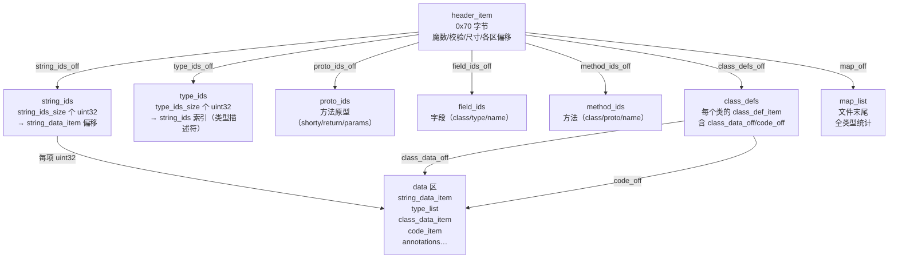

# Android逆向（03）· DEX文件格式

DEX（Dalvik Executable）是 Android 平台专用的字节码容器格式，承载了整个 Java/Kotlin 层的可执行逻辑。一个 APK 里的 `classes.dex` 就是逆向工程的核心战场：jadx/apktool 能读的、smali 能反汇编的、Frida 能 hook Java 方法的，全部以 DEX 为起点。理解 DEX 的每一个字节，是分析混淆/加固、还原逻辑、做动态 hook 的底层依据。

> [!abstract] TL;DR
> - DEX 是**紧凑的字节码容器**，专为移动设备低内存设计：所有字符串/类型/方法共享常量池、按索引引用、文件内仅存一份。
> - 文件以 **`dex\n035\0`**（8 字节魔数）开头，版本号随 SDK 升级（`035`/`037`/`038`/`039`）；`header_item` 固定 **0x70 字节**，含 Adler-32 校验与 SHA-1 摘要。
> - 整体布局：`header` → `string_ids` → `type_ids` → `proto_ids` → `field_ids` → `method_ids` → `class_defs` → `data`（含 `string_data_item`/`code_item` 等）→ `map_list`；可变长字段用 **uleb128/sleb128** 编码。
> - 类型描述符遵循 JVM 惯例：`V/Z/B/S/C/I/J/F/D/L…;/[`；MUTF-8 编码（null 字符编 `0xC0 0x80`）。
> - `class_def_item` 是核心条目，`class_data_item` 描述字段/方法列表，`code_item` 包含寄存器型 Dalvik 字节码（非栈式）。
> - **MultiDex**（`classes2.dex`…）解决 64K 方法数上限；**ODEX/OAT/vdex** 是 ART 编译产物，是 DEX 的"运行时变体"（详见 [[05.ART运行时]]）。
> - 逆向关注点：checksum/signature 校验是加固壳判活的常用手段；内存 dump 可绕过 DEX 抽取型保护（详见 [[11.加固与脱壳]]）。

---

## 概述与定位

### 为什么是 DEX，而不是 JVM class

Java 虚拟机的 `.class` 文件以**栈式字节码**为核心，一个类一个文件，字符串常量池分散在每个 `.class` 中。Android 设备（Dalvik 时代）的内存只有几十 MB，把几百个 `.class` 各自带常量池全部加载代价太高。Google 设计 DEX 时做了三个关键取舍：

1. **合并**：所有类打包进同一个文件，消除跨类的常量重复。
2. **共享索引池**：全文件唯一的 `string_ids`/`type_ids`/`proto_ids`/`field_ids`/`method_ids` 数组，引用时只存 4 字节索引，大幅压缩。
3. **寄存器型字节码**：Dalvik 指令操作的是寄存器（vN），而非 JVM 的操作数栈；编译器可做更好的寄存器分配，每条指令隐含操作数更少，字节码密度更高。

这三点在 [[04.Dalvik字节码与smali]] 会继续展开；本篇聚焦 DEX **文件格式本身**——每个字节放在哪里、代表什么。

### 与 ELF 的类比

如果你熟悉 [[11.ELF文件详解/00.ELF文件详解总览.md]]，可以这样建立直觉：

| ELF 概念 | DEX 对应 |
|---|---|
| ELF 文件头（`Elf64_Ehdr`） | `header_item`（固定 0x70 字节） |
| 节头表（`.shstrtab`/`.dynsym`/`.strtab`） | `string_ids` + `type_ids` + `method_ids` 等索引区 |
| `.text` 节（代码段） | `code_item`（嵌在 data 区） |
| 动态链接符号表 | `method_ids` / `field_ids`（跨类引用） |
| `PT_LOAD` 段的文件偏移 | 各节区的 `*_off` 字段（绝对文件偏移） |

ELF 以 `e_shoff`/`e_phoff` 指向两张表；DEX 以 `header_item` 里的多组 `size`/`off` 对直接给出各索引区的位置——原理相同，表现形式更紧凑。

---

## 原理与机制

### DEX 整体布局



> 整个 DEX 的"读取地图"就是 `header_item`：它给出 8 个区的起始偏移和条目数，解析器只需跟着偏移跳。`data` 区是一个大的"堆"，凡是变长结构（字符串、方法体、注解…）都压在里面；`map_list` 提供完整的类型目录，供工具做完整性验证。

### 常量池共享与按索引引用

DEX 的设计哲学是**一切都通过索引共享**。任何字段、方法、类型引用，最终都归约为一个整数下标，指向对应的 ids 数组条目。

```
方法引用的解引用链：
  method_idx (uint16/uint32)
    → method_ids[method_idx]
        .class_idx → type_ids[class_idx] → string_ids[…] → "Ljava/io/InputStream;"
        .proto_idx → proto_ids[proto_idx] → shorty_idx/return_type/parameters
        .name_idx  → string_ids[name_idx] → "read"
```

这种设计的逆向意义：jadx 做"内联常量/混淆名还原"时，改的就是这些 ids 数组；smali 里的 `Ljava/lang/String;->valueOf(I)Ljava/lang/String;` 这一整串，在 DEX 字节码层面只是三个小整数（class_idx + proto_idx + name_idx）。

---

## 结构 / 格式 / 流程详解

### header_item 字段逐字节表

`header_item` 位于文件偏移 0，共 **0x70（112）字节**，全部小端序（endian_tag 确认）。

```
偏移    大小(字节)  字段名              值/说明
────────────────────────────────────────────────────────────────────────
0x00    8           magic[8]            64 65 78 0A 30 33 35 00
                                        即 "dex\n035\0"（版本 035）
0x08    4           checksum            Adler-32，覆盖 0x0C..文件末
0x0C    20          signature[20]       SHA-1，覆盖 0x20..文件末
0x20    4           file_size           整个 DEX 文件字节数
0x24    4           header_size         固定 0x70（112）
0x28    4           endian_tag          0x12345678（小端）
                                        大端文件此处为 0x78563412
0x2C    4           link_size           静态链接数据大小（通常 0）
0x30    4           link_off            静态链接数据偏移（通常 0）
0x34    4           map_off             map_list 的文件偏移
0x38    4           string_ids_size     string_ids 数组元素数量
0x3C    4           string_ids_off      string_ids 数组的文件偏移
0x40    4           type_ids_size       type_ids 数组元素数量（≤ 65535）
0x44    4           type_ids_off        type_ids 数组的文件偏移
0x48    4           proto_ids_size      proto_ids 数组元素数量（≤ 65535）
0x4C    4           proto_ids_off       proto_ids 数组的文件偏移
0x50    4           field_ids_size      field_ids 数组元素数量
0x54    4           field_ids_off       field_ids 数组的文件偏移
0x58    4           method_ids_size     method_ids 数组元素数量
0x5C    4           method_ids_off      method_ids 数组的文件偏移
0x60    4           class_defs_size     class_defs 数组元素数量
0x64    4           class_defs_off      class_defs 数组的文件偏移
0x68    4           data_size           data 区字节数（必须 4 字节对齐）
0x6C    4           data_off            data 区文件偏移
────────────────────────────────────────────────────────────────────────
合计    0x70 (112字节)
```

**关键字段详解：**

**`magic[8]`：**`64 65 78 0A 30 33 35 00` = `dex\n` + 版本号 3 字节 + `\0`。版本号与 Android SDK 关系：

| DEX 版本 | 引入 Android | API Level | 新增特性 |
|---|---|---|---|
| `035` | Android 1.0 | 1 | 基础版本 |
| `037` | Android 7.0 | 24 | 默认方法、接口静态方法 |
| `038` | Android 8.0 | 26 | `invoke-polymorphic`/`invoke-custom`（方法句柄/invokedynamic） |
| `039` | Android 9.0 | 28 | `const-method-handle`/`const-method-type` |
| `040` | Android 10 | 29 | Compact DEX（cdex）扩展，`hiddenapi_class_data` |

**`checksum`：** Adler-32 算法，覆盖字节范围从偏移 `0x0C` 到文件末尾（跳过 magic 和自身）。ART 加载时会校验此值；加固壳常篡改 DEX 后重算 checksum，或者 hook 校验函数绕过。

**`signature[20]`：** SHA-1 摘要，覆盖范围从偏移 `0x20` 到文件末尾（跳过 magic + checksum + 自身）。用于唯一标识一个 DEX 文件，也是 Dalvik/ART 缓存（ODEX）关联的 key——签名变了就放弃缓存重新编译。

**`header_size`：** 固定为 `0x70`（十进制 112）。如果读到别的值，说明文件可能是 cdex 或被篡改。

**`endian_tag`：** `0x12345678` 表示小端。在所有真实 Android 设备上你只会看到小端；大端设备理论存在但实际不存在于任何量产 Android 硬件。

### DEX 版本号 hex dump 示例

下面是一个真实 DEX 文件（`classes.dex`，版本 035）的头部 **112 字节** hex dump 与逐字节解读：

```
文件偏移  十六进制                                           ASCII
00000000  64 65 78 0a 30 33 35 00  11 22 33 44 xx xx xx xx  dex.035.."3D....
00000010  xx xx xx xx xx xx xx xx  xx xx xx xx xx xx xx xx  ................ ← SHA-1 (20字节,0x0C..0x1F)
00000020  a4 5c 00 00 70 00 00 00  78 56 34 12 00 00 00 00  .\..p...xV4.....
00000030  00 00 00 00 c4 58 00 00  17 00 00 00 10 00 00 00  .....X..........
00000040  62 00 00 00 40 00 00 00  7c 01 00 00 21 00 00 00  b...@...|...!...
00000050  ec 02 00 00 51 00 00 00  b0 04 00 00 24 01 00 00  ....Q.......$...
00000060  50 09 00 00 38 00 00 00  98 11 00 00 5c 49 00 00  P...8.......\I..
0000006C  40 0e 00 00 f8 14 00 00                           @.......
```

> [!warning] 示例输出为示意
> 上述 hex dump 中具体数值为**说明性示例**，`xx` 表示 SHA-1 摘要字节（不影响解读结构），实际 DEX 文件各字段值随内容而异。

逐字段解读：

```
0x00–0x07  64 65 78 0A 30 33 35 00   → magic: "dex\n035\0"，版本 035
0x08–0x0B  11 22 33 44               → checksum: 0x44332211（小端），Adler-32
0x0C–0x1F  xx×20                     → signature[20]: SHA-1 摘要（20字节）
0x20–0x23  A4 5C 00 00               → file_size: 0x5CA4 = 23716 字节
0x24–0x27  70 00 00 00               → header_size: 0x70 = 112（固定）
0x28–0x2B  78 56 34 12               → endian_tag: 0x12345678（小端确认）
0x2C–0x2F  00 00 00 00               → link_size: 0（无静态链接）
0x30–0x33  00 00 00 00               → link_off: 0
0x34–0x37  C4 58 00 00               → map_off: 0x58C4（map_list 偏移）
0x38–0x3B  17 00 00 00               → string_ids_size: 23 个字符串
0x3C–0x3F  10 00 00 00               → string_ids_off: 0x10（紧跟 header）
0x40–0x43  62 00 00 00               → type_ids_size: 98 个类型
0x44–0x47  40 00 00 00               → type_ids_off: 0x40
...以此类推
```

### 索引区详解

#### string_ids 与 string_data_item

`string_ids` 是一个 `uint32[string_ids_size]` 数组，每个元素是对应字符串在文件中的**绝对偏移**，指向一个 `string_data_item`：

```
string_data_item:
  uleb128   utf16_size   字符串的 UTF-16 code unit 数量（≠字节数）
  ubyte[]   data[]       MUTF-8 编码的字符串，以 0x00 结尾
```

**MUTF-8（Modified UTF-8）** 与标准 UTF-8 的区别：
- `U+0000`（null）编为 `0xC0 0x80`（双字节序列），**不用** `0x00` 单字节——这样字符串内部不会提前截断。
- 补充字符（Supplementary Characters，U+10000 以上）用**代理对**表示（两个 3 字节 MUTF-8 序列），而非标准 UTF-8 的 4 字节序列。

这意味着：逆向时若用标准 UTF-8 解码 DEX 字符串，遇到含 null 字符或表情符号的字符串**会出错**；jadx 自己处理了 MUTF-8，但自己写解析脚本时要注意。

#### type_ids

`type_ids` 是 `uint32[type_ids_size]` 数组，每项是类型描述符字符串在 `string_ids` 中的下标。类型描述符（Type Descriptor）格式：

| 描述符 | 类型 |
|---|---|
| `V` | void |
| `Z` | boolean |
| `B` | byte |
| `S` | short |
| `C` | char |
| `I` | int |
| `J` | long（64位，占两个寄存器） |
| `F` | float |
| `D` | double（64位，占两个寄存器） |
| `Ljava/lang/String;` | 引用类型：`L` + 全限定名（`/` 代替 `.`）+ `;` |
| `[I` | int 数组（`[` + 元素描述符） |
| `[[Ljava/lang/Object;` | 对象二维数组 |

**J/D 占两个寄存器** 是 smali 调试的常见陷阱：`long` 参数传给 `v0`，实际占 `v0`/`v1`，后续参数从 `v2` 开始。

#### proto_ids（方法原型）

`proto_ids_item` 描述一个方法签名（不含方法名与所属类）：

```c
struct proto_id_item {
    uint32_t  shorty_idx;      // string_ids 索引：shorty descriptor，如 "VILjava/lang/String;"
    uint32_t  return_type_idx; // type_ids 索引：返回类型
    uint32_t  parameters_off;  // → type_list（参数类型列表），0 表示无参数
};
```

**shorty descriptor** 是压缩版签名，每个参数/返回类型只用一个字符（L 类引用统一用 `L`，数组用 `L`）：方法 `void foo(int, String)` 的 shorty 为 `"VIL"`。它的用途是**快速匹配**——Dalvik 调用时可先比 shorty 再比详细签名，加快分派。

#### field_ids

```c
struct field_id_item {
    uint16_t  class_idx;  // type_ids 索引：字段所属类
    uint16_t  type_idx;   // type_ids 索引：字段类型
    uint32_t  name_idx;   // string_ids 索引：字段名
};
```

所有字段（含继承、静态、实例）按 `class_idx` 升序、`name_idx` 升序排列。引用一个字段时，字节码里只存一个 `field_idx`（field_ids 数组下标）——4 字节替代完整字段描述。

#### method_ids

```c
struct method_id_item {
    uint16_t  class_idx;  // type_ids 索引：方法所属类
    uint16_t  proto_idx;  // proto_ids 索引：方法签名
    uint32_t  name_idx;   // string_ids 索引：方法名
};
```

`method_ids` 是 Dalvik 字节码里使用频率最高的索引结构：`invoke-virtual {v0, v1}, Ljava/lang/StringBuilder;->append(Ljava/lang/String;)Ljava/lang/StringBuilder;` 在字节码层面只是一个 `method_idx` 整数，指向这里。

> **MultiDex 的 64K 限制根源**：`method_idx` 在 Dalvik 字节码指令中是 **16 位**字段，最多寻址 65536 个方法。超出时需要第二个 DEX 文件（`classes2.dex`），详见本篇末的 MultiDex 节。

### class_def_item

每个类对应一个 `class_def_item`（固定 32 字节）：

```c
struct class_def_item {
    uint32_t  class_idx;           // type_ids 索引：本类的类型描述符
    uint32_t  access_flags;        // 访问标志（见下表）
    uint32_t  superclass_idx;      // type_ids 索引：父类（java.lang.Object 为 NO_INDEX=0xFFFFFFFF）
    uint32_t  interfaces_off;      // → type_list（实现接口列表），0 表示无
    uint32_t  source_file_idx;     // string_ids 索引：源文件名（如 "MainActivity.java"）
    uint32_t  annotations_off;     // → annotations_directory_item，0 表示无注解
    uint32_t  class_data_off;      // → class_data_item（字段+方法列表），0 表示无数据（接口）
    uint32_t  static_values_off;   // → encoded_array_item（静态字段初始值），0 表示全默认值
};
```

`access_flags` 是位域，常用值：

| 标志 | 值 | 含义 |
|---|---|---|
| `ACC_PUBLIC` | 0x0001 | public |
| `ACC_PRIVATE` | 0x0002 | private |
| `ACC_PROTECTED` | 0x0004 | protected |
| `ACC_STATIC` | 0x0008 | static |
| `ACC_FINAL` | 0x0010 | final |
| `ACC_INTERFACE` | 0x0200 | interface |
| `ACC_ABSTRACT` | 0x0400 | abstract |
| `ACC_SYNTHETIC` | 0x1000 | 编译器生成（如内部类桥方法） |
| `ACC_ANNOTATION` | 0x2000 | 注解类型 |
| `ACC_ENUM` | 0x4000 | 枚举 |

**`ACC_SYNTHETIC`** 在逆向中是重要信号：带这个标志的字段/方法是编译器合成的，没有对应源码，通常是内部类访问外部私有成员的 `access$xxx` 桥方法，混淆后名字乱但行为固定。

### class_data_item

`class_data_item` 紧跟 `class_def_item.class_data_off` 指向的位置，全部用 **uleb128** 变长编码：

```
class_data_item:
  uleb128  static_fields_size    静态字段数量
  uleb128  instance_fields_size  实例字段数量
  uleb128  direct_methods_size   直接方法数量（private + constructor + static）
  uleb128  virtual_methods_size  虚方法数量（可重写的实例方法）
  encoded_field[static_fields_size]   静态字段列表
  encoded_field[instance_fields_size] 实例字段列表
  encoded_method[direct_methods_size] 直接方法列表
  encoded_method[virtual_methods_size] 虚方法列表
```

**encoded_field（每个字段条目）：**

```
  uleb128  field_idx_diff   与前一个字段的 field_ids 下标差（第一个是绝对值）
  uleb128  access_flags     访问标志
```

**encoded_method（每个方法条目）：**

```
  uleb128  method_idx_diff  与前一个方法的 method_ids 下标差（第一个是绝对值）
  uleb128  access_flags     访问标志
  uleb128  code_off         → code_item 的文件偏移，0 表示 abstract/native 方法
```

**差值（diff）编码**是 DEX 压缩的精髓：字段/方法按 `*_idx` 升序排列，存相邻条目的**下标差**而非绝对值——差值通常很小（1、2、3），uleb128 编码只需 1 字节，大幅节省空间。解析时逐条累加即可还原绝对 idx。

### code_item

`code_item` 是 DEX 中最复杂的结构，包含一个方法的实际字节码：

```c
struct code_item {
    uint16_t  registers_size;  // 本方法使用的寄存器总数（含参数寄存器）
    uint16_t  ins_size;        // 入参占用的寄存器数（在 registers_size 末尾）
    uint16_t  outs_size;       // 调用其他方法时所需的出参寄存器数（栈帧保留）
    uint16_t  tries_size;      // try 块数量（若 > 0，后续有 try_item[]）
    uint32_t  debug_info_off;  // → debug_info_item（行号/局部变量表），0 表示无
    uint32_t  insns_size;      // 字节码数组的长度，以 2 字节 code unit 为单位
    uint16_t  insns[insns_size]; // 字节码数组（每个 code unit 2 字节）
    // 若 insns_size 为奇数，此处有 2 字节填充对齐
    // 若 tries_size > 0：
    //   try_item[tries_size]          每个 try 块的范围
    //   encoded_catch_handler_list    异常处理器列表
};
```

**寄存器编号约定（关键逆向知识）：**

```
registers_size = N  →  寄存器 v0 ... v(N-1)
ins_size = M        →  入参占 v(N-M) ... v(N-1)

示例：void foo(int a, String b)  → ins_size=3（this(1)+int(1)+String(1)=3）
  实例方法：ins_size = 1（this）+ 参数数量
  静态方法：ins_size = 参数数量

如 registers_size=5, ins_size=3，则：
  v0, v1 是局部变量
  v2 = p0（this）
  v3 = p1（int a）
  v4 = p2（String b）
```

smali 里的寄存器别名：`p0`=第一个参数寄存器（实例方法的 `this`），`p1`/`p2`/... 依次对应后续参数，这是 `ins` 寄存器的语法糖。[[04.Dalvik字节码与smali]] 详细展开所有指令格式。

**`tries_size`/`try_item`：** 每个 `try_item` 记录受保护的代码范围（`start_addr`/`insn_count`，以 code unit 为单位）及对应的 `catch_handler_offset`。异常分派逻辑在 ART 运行时查这张表——这也是为什么加固壳喜欢往方法里塞伪造 try/catch 来混淆控制流分析。

### uleb128 / sleb128 / MUTF-8 编码

DEX 大量使用 DWARF 中定义的 LEB128（Little Endian Base 128）变长整数编码来节省空间。

**uleb128（无符号）：**
- 每字节最高位（bit 7）为"延续标志"：`1` 表示后续还有字节，`0` 表示最后一个字节。
- 有效数据在低 7 位，多字节时低字节在前（小端次序）。

```
编码示例：
  值 0x01         → 01                    (1 字节)
  值 0x7F         → 7F                    (1 字节，最大单字节值)
  值 0x80         → 80 01                 (2 字节：0x80=10000000，延续；0x01=00000001)
  值 624485       → E5 8E 26              (3 字节)

解码 E5 8E 26：
  0xE5 = 1110 0101  → 延续位=1，data=110 0101
  0x8E = 1000 1110  → 延续位=1，data=000 1110
  0x26 = 0010 0110  → 延续位=0，data=010 0110
  拼接（低字节先）：010 0110 | 000 1110 | 110 0101 = 0001 0011 0001 1100 0110 0101
  = 0x98765（十进制 624485）✓
```

**sleb128（有符号）：** 与 uleb128 结构相同，但最后一个字节的最高有效位做符号扩展。负数例：`-1` 编为 `0x7F`（一字节，bit6=1 → 符号扩展为 0xFFFFFFFF）。

**uleb128p1（uleb128 plus 1）：** DEX 中少数字段（如 `encoded_value` 里的某些类型）用 `value + 1` 存储，允许表示 `-1`（存 0）。

这些编码的实践意义：**手动 hex dump 解析 DEX 时，遇到 class_data_item / encoded_method，不能按固定偏移读取——必须按 uleb128 规则逐字节扫描**。很多自制 DEX 分析脚本在这里出 bug。

### map_list

`map_list`（由 `header_item.map_off` 指向）给出文件内所有数据类型的清单，是对 `header_item` 的补充：

```c
struct map_item {
    uint16_t  type;    // 项类型（见下表）
    uint16_t  unused;  // 填充
    uint32_t  size;    // 该类型的条目数量
    uint32_t  offset;  // 该类型第一个条目的文件偏移
};

struct map_list {
    uint32_t   size;          // map_item 的数量
    map_item   list[size];    // 按偏移升序排列
};
```

常见 `type` 值：

| 类型常量 | 值 | 对应结构 |
|---|---|---|
| `TYPE_HEADER_ITEM` | 0x0000 | `header_item` |
| `TYPE_STRING_ID_ITEM` | 0x0001 | `string_id_item` |
| `TYPE_TYPE_ID_ITEM` | 0x0002 | `type_id_item` |
| `TYPE_PROTO_ID_ITEM` | 0x0003 | `proto_id_item` |
| `TYPE_FIELD_ID_ITEM` | 0x0004 | `field_id_item` |
| `TYPE_METHOD_ID_ITEM` | 0x0005 | `method_id_item` |
| `TYPE_CLASS_DEF_ITEM` | 0x0006 | `class_def_item` |
| `TYPE_CALL_SITE_ID_ITEM` | 0x0007 | DEX 038+ 动态调用 |
| `TYPE_METHOD_HANDLE_ITEM` | 0x0008 | DEX 038+ 方法句柄 |
| `TYPE_MAP_LIST` | 0x1000 | `map_list` 自身 |
| `TYPE_TYPE_LIST` | 0x1001 | `type_list`（接口/参数列表） |
| `TYPE_STRING_DATA_ITEM` | 0x2002 | `string_data_item` |
| `TYPE_CODE_ITEM` | 0x2001 | `code_item` |
| `TYPE_CLASS_DATA_ITEM` | 0x2000 | `class_data_item` |
| `TYPE_ANNOTATIONS_DIRECTORY_ITEM` | 0x2006 | 注解目录 |

`map_list` 的逆向用途：工具用它做**完整性扫描**——枚举所有 `code_item` 不需要遍历 class_defs，直接从 map_list 找 `TYPE_CODE_ITEM` 条目，按 `size`/`offset` 批量处理。一些壳会故意破坏 `class_defs` 里的 `class_data_off` 而保留 `map_list` 中的真实偏移，以干扰常规解析。

---

## 工具实践

### 1. 提取并反编译 DEX

```bash
# 从 APK 中提取所有 DEX（APK 即 ZIP）
unzip -o target.apk 'classes*.dex' -d ./dex_out/

# 用 jadx 反编译为 Java 源码
jadx -d ./out/ ./dex_out/classes.dex

# 用 apktool 反编译（保留 smali 层）
apktool d target.apk -o ./apktool_out/
# smali 文件在 ./apktool_out/smali/ 目录
```

> [!warning] 示例输出为示意

### 2. 查看 DEX 头部与 map_list

```bash
# 用 dexdump（AOSP 工具）输出结构信息
dexdump -h classes.dex          # 只看 header
dexdump -d classes.dex          # 完整反汇编（含字节码）

# 用 baksmali 单独反汇编
java -jar baksmali.jar disassemble classes.dex -o smali_out/

# 用 Python dex 库手动解析头部（frida-tools 附带 dexparse）
python3 -c "
import struct
data = open('classes.dex','rb').read()
magic = data[:8]
checksum = struct.unpack_from('<I', data, 8)[0]
file_size = struct.unpack_from('<I', data, 0x20)[0]
header_size = struct.unpack_from('<I', data, 0x24)[0]
endian_tag = struct.unpack_from('<I', data, 0x28)[0]
string_ids_size = struct.unpack_from('<I', data, 0x38)[0]
print(f'magic: {magic}')
print(f'checksum: {checksum:#010x}')
print(f'file_size: {file_size}')
print(f'header_size: {header_size:#x}')
print(f'endian_tag: {endian_tag:#010x}')
print(f'string_ids_size: {string_ids_size}')
"
```

> [!warning] 示例输出为示意

### 3. 用 Frida 枚举 DEX（运行时）

```javascript
// Frida 脚本：枚举已加载的 DEX 文件（用于脱壳）
Java.perform(function() {
    var DexFile = Java.use('dalvik.system.DexFile');
    // 枚举所有已加载 ClassLoader 及其 dex path
    var classLoaderClass = Java.use('java.lang.ClassLoader');
    // 配合 memory dump 实现内存中 DEX 的 dump（参见 11.加固与脱壳）
});

// 更底层：搜索内存中的 DEX 魔数
Process.enumerateModules().forEach(function(mod) {
    Memory.scan(mod.base, mod.size, '64 65 78 0A', {
        onMatch: function(addr, size) {
            console.log('Found DEX magic at: ' + addr);
        },
        onComplete: function() {}
    });
});
```

> [!warning] 示例输出为示意

### 4. 手动修改 DEX（重打包）

```bash
# apktool 解包 → 修改 smali → 重打包 → 重签名
apktool d target.apk -o out/
# 编辑 out/smali/com/example/MainActivity.smali
apktool b out/ -o modified.apk
# 用测试密钥签名
apksigner sign --ks debug.keystore --out signed.apk modified.apk
```

> [!warning] 示例输出为示意
> 修改 DEX 后 `checksum` 和 `signature` 会失效；apktool 的 `b` 命令会重算这两个字段。自己写工具修改时，必须手动重算 Adler-32 和 SHA-1 填回对应偏移，否则 ART 加载时报 `E/dex: Bad checksum`。

---

### Compact DEX（cdex）

Android 10（API 29）引入 **Compact DEX**，是 ART 在设备上内部使用的优化 DEX 格式，以提升加载速度和减少内存占用。

#### magic 与版本号

cdex 文件的 magic 与标准 DEX 不同：

```
标准 DEX：  64 65 78 0A 30 33 35 00  ("dex\n035\0")
Compact DEX：63 64 65 78 0A 30 30 31 00  ("cdex\n001\0")
              ↑ 比标准 DEX 多一个字节 'c'，头部 magic 增长到 9 字节
```

cdex header 在标准 DEX header（0x70 字节）基础上扩展了若干字段，如 `feature_flags`、`data_off`、`data_size` 等，用于描述共享 data 区。

#### 共享 data 区

cdex 最核心的优化是 **多个 cdex 共享同一 data 区**：

```
传统 DEX：
  classes.dex   [header + ids + class_defs + data区]
  classes2.dex  [header + ids + class_defs + data区]
  （data区各自独立，重复存储公共字符串）

Compact DEX（设备 OAT 产物）：
  base.cdex       [header + ids + class_defs]
  base2.cdex      [header + ids + class_defs]
  shared_data区   [string_data_item / type_list / code_item 等]
  （多个 cdex 的 data_off 指向同一共享区域，去重公共数据）
```

共享 data 区通过 `data_off` 字段指向一个跨文件的共享区域（通常嵌于 `.vdex` 文件中），避免了不同 DEX 间重复存储相同字符串（如 `Ljava/lang/Object;`）。

#### `/data/dalvik-cache/` 提取的是 cdex

在已安装应用的 OAT 产物路径下，提取出的往往不是标准 DEX，而是 cdex：

```bash
# 提取已安装 App 的 vdex（包含 cdex 内容）
adb root
adb pull /data/app/com.example.app-xxxxx/oat/arm64/base.vdex /tmp/

# 直接检查魔数
xxd /tmp/base.vdex | head -2
# 标准 vdex 头：76 64 65 78 ... ("vdex...")
# vdex 内嵌 cdex：其内嵌 DEX 部分的魔数为 63 64 65 78 ("cdex...")

# 使用 vdexExtractor 提取（自动识别并转换 cdex → dex）
vdexExtractor -i /tmp/base.vdex -o /tmp/out/ --cdex-to-dex
# 输出标准 classes.dex（可直接 jadx 分析）
```

> [!warning] 示例输出为示意

逆向注意事项：

| 工具 | 对 cdex 的支持 |
|---|---|
| jadx >= 1.4.x | 原生支持 cdex，直接拖入即可 |
| baksmali >= 2.5.x | 支持 cdex（`baksmali disassemble` 自动识别） |
| 老版 dexdump | 不认 cdex magic，报错 "magic is wrong" |
| vdexExtractor | 专门处理 vdex+cdex，可转为标准 dex |

---

### annotations 与 InMemoryDexClassLoader

#### 注解（Annotation）结构与逆向价值

DEX 中注解存储在 `annotations_directory_item` → `annotation_item`，每个注解包含类型引用和键值对列表。逆向常见的重要注解：

| 注解 | 来源 | 逆向意义 |
|---|---|---|
| `@Keep` | AndroidX `androidx.annotation.Keep` | 防混淆保留，标注关键类/方法名 |
| `@Component`/`@Module`/`@Inject` | Dagger 2 / Hilt | 依赖注入图的入口，标注关键对象创建点 |
| `@SerializedName` | Gson | 字段名与 JSON key 映射，可还原网络 API 结构 |
| `@Retrofit.*`/`@GET`/`@POST` | Retrofit | 直接读出 API endpoint 路径 |
| `@JvmField`/`@JvmStatic` | Kotlin 编译器 | 辅助理解 Kotlin 特性在字节码层的表现 |

在 jadx 中，注解直接显示在反编译代码上方；baksmali 输出中以 `.annotation` 块表示：

```smali
.class public Lcom/example/UserRepository;
.super Ljava/lang/Object;

# @Keep 注解保留此类不被混淆
.annotation system Ldalvik/annotation/EnclosingClass;
    value = Lcom/example/AppModule;
.end annotation

.method public getUser(I)Lcom/example/User;
    .annotation build Ljavax/inject/Inject;
    .end annotation
    ...
.end method
```

**Dagger 反射链路逆向**：Dagger 生成的 `XXX_Factory` 和 `XXX_MembersInjector` 类带有 `@Generated` 注解，jadx 可见完整生成代码，通过追踪 `provide*` 方法可还原整个依赖图。

#### InMemoryDexClassLoader（API 26+）

`InMemoryDexClassLoader`（Android 8.0+，API 26）允许直接从 **字节数组** 加载 DEX，不需要落盘为文件——这使其成为现代加固壳和动态代码下发的核心手段，因为传统基于文件路径的监控（如 hook `DexFile.loadDex()`）无法拦截：

```java
// 加固壳典型使用（示意）
byte[] decryptedDex = decryptFromAssets("payload.bin");
ByteBuffer dexBuffer = ByteBuffer.wrap(decryptedDex);

ClassLoader cl = new InMemoryDexClassLoader(
    dexBuffer,
    getClass().getClassLoader()   // parent ClassLoader
);
Class<?> realApp = cl.loadClass("com.real.Application");
realApp.getMethod("onCreate").invoke(realApp.newInstance());
```

**逆向 InMemoryDexClassLoader 的三种方法**：

1. **Hook 构造函数，dump ByteBuffer**：

```javascript
// Frida hook InMemoryDexClassLoader 构造（示意）
Java.perform(function() {
    var IMDCL = Java.use('dalvik.system.InMemoryDexClassLoader');
    IMDCL.$init.overload(
        'java.nio.ByteBuffer', 'java.lang.ClassLoader'
    ).implementation = function(buf, parent) {
        var capacity = buf.capacity();
        var bytes = Java.array('byte', new Array(capacity));
        buf.get(bytes);
        buf.rewind();
        // 将 bytes 写出到文件
        var fos = Java.use('java.io.FileOutputStream').$new(
            '/data/local/tmp/dumped_' + Date.now() + '.dex');
        fos.write(bytes);
        fos.close();
        console.log('[IMDCL] dumped ' + capacity + ' bytes');
        return this.$init(buf, parent);
    };
});
```

2. **内存扫描 DEX magic**：InMemoryDexClassLoader 最终也会在内存中映射 DEX，可用 Frida `Memory.scan()` 搜索 `dex\n` 魔数。

3. **Hook ART 内部 `ClassLinker::OpenDexFilesFromOat`** 或 `DexFile::Open`（native 层），捕获所有 DEX 加载，不论来源。

**现代脱壳战场**：正因 InMemoryDexClassLoader 绕过文件层监控，FART（基于 ART 的主动调用脱壳）等工具选择在 ART 内部（`dex2oat` 或 `ClassLinker`）植入 hook，在 DEX 完成验证时捕获内存中的完整 DEX，而非依赖文件路径监控。

---

### debug_info_item

`code_item.debug_info_off` 指向 `debug_info_item`，存储方法的行号映射、局部变量名、参数名等调试信息。混淆工具（ProGuard/R8）可以选择保留或移除这些信息。

#### 结构与内容

```
debug_info_item：
  uleb128  line_start       源码起始行号（方法第一条指令对应的行）
  uleb128  parameters_size  参数名数量
  uleb128p1 parameter_names[]  每个参数的名称（string_ids 索引，-1 表示无名）

  # 之后是字节码流（opcode 序列）：
  DBG_END_SEQUENCE (0x00)       结束
  DBG_ADVANCE_PC (0x01)         推进字节码地址（+ uleb128 addr_diff）
  DBG_ADVANCE_LINE (0x02)       推进行号（+ sleb128 line_diff）
  DBG_START_LOCAL (0x03)        局部变量开始（register/name/type）
  DBG_START_LOCAL_EXTENDED (0x04)  局部变量 + signature
  DBG_END_LOCAL (0x05)          局部变量结束
  DBG_RESTART_LOCAL (0x06)      局部变量恢复（重用槽）
  DBG_SET_PROLOGUE_END (0x07)
  DBG_SET_EPILOGUE_BEGIN (0x08)
  DBG_SET_FILE (0x09)           切换源文件名
  Special opcodes (0x0A–0xFF)   同时推进 PC 和行号（紧凑编码）
```

#### 未混淆 App 的逆向价值

当 `debug_info_item` 存在且完整时（`release` 构建未裁剪，或 App 有意保留调试信息），可提取：

**参数名**：`parameters_size` + `parameter_names[]` 直接给出原始参数名。jadx 在反编译输出中使用这些名字，否则只能看到 `p0`/`p1` 等占位符。

```bash
# dexdump 输出含 debug_info 的方法信息（示意）
dexdump -d classes.dex | grep -A20 "Method #0"
# 输出：
# name          : 'authenticate'
# type          : '(Ljava/lang/String;Ljava/lang/String;)Z'
# ...
#   locals        :
#     0x0000 - 0x0018 reg=2 username java.lang.String
#     0x0000 - 0x0018 reg=3 password java.lang.String
```

**行号映射**：`.line N` 指令（baksmali 输出中可见）标出每条字节码对应的源码行号，配合混淆映射文件（`mapping.txt`）可完整还原调用栈。

**局部变量名**：`DBG_START_LOCAL` 记录变量生存期（起止字节码偏移）和名称，jadx 据此在反编译代码中显示原始变量名（如 `encryptedToken` 而非 `v3`）。

**判断 App 是否保留调试信息**：

```bash
# 检查 code_item 的 debug_info_off 是否为 0
# dexdump -d 输出中，debugInfo 字段非 0 即保留了调试信息
dexdump -d classes.dex | grep "debugInfo"
# "debugInfo      : 0x00001234" 表示存在
# "debugInfo      : 0x00000000" 表示已移除

# jadx GUI：菜单 → Tools → Show debug info（开启后反编译结果含行号注释）
```

逆向实践：对于中小型 App（尤其国内无混淆或轻混淆的 App），`debug_info_item` 完整保留的概率很高，此时 jadx 反编译出的代码接近原始源码，变量名、参数名完整可读，逆向效率极高。

---

## MultiDex、ODEX、OAT 与 vdex

### MultiDex：打破 64K 限制

Dalvik 字节码中方法引用使用 **16 位索引**，单个 DEX 最多引用 65536（64K）个方法。大型 App（如各类超级 App）早就超过这个限制，解决方案是 **MultiDex**：

```
APK 中：
  classes.dex    → 主 DEX（含 Application/启动路径所需类）
  classes2.dex   → 第二 DEX
  classes3.dex   → …以此类推
```

Android 5.0（Lollipop）以前，MultiDex 支持靠 `com.android.support:multidex` 库在运行时动态加载额外 DEX；5.0 以后 ART 原生支持 MultiDex，`dex2oat` 编译时会处理所有 `classesN.dex`。

逆向 MultiDex App 时，**每个 `classesN.dex` 都是独立的 DEX 文件**，各自有完整的 `header_item` 和索引区；类之间的跨 DEX 引用在 ART 加载后通过 ClassLoader 机制串联。jadx 会自动合并分析所有 DEX，但用 dexdump/baksmali 手动分析时要记得拆开处理。

### ODEX（Optimized DEX）

早期 Dalvik 加载 DEX 后会在 `/data/dalvik-cache/` 生成 `.odex`（Optimized DEX）：把平台相关的快速指令替换进去（如 `invoke-virtual` → `invoke-virtual-quick`），并把布局调整到对当前设备友好的形式。ODEX 文件头 magic 为 `dey\n036\0` 而非 `dex\n`，包含一个指向原始 DEX 的 `dependencies` 区。

ODEX 是**Dalvik 时代**产物，已被 ART 的 OAT 取代，但部分老设备/老 ROM 仍可见。

### OAT / vdex（ART 时代）

ART 取代 Dalvik 后（Android 5.0+），引入了新的编译产物链：

```
classes.dex
    ↓ dex2oat（AOT 编译）
classes.vdex    原始 DEX 的验证版本（含 quickened 字节码，供解释器）
classes.oat     ELF 格式的 native 代码（AOT 编译结果）
classes.art     堆镜像（预热的 Java 对象，加速启动）
```

**vdex（Verified DEX）：** 包含经 ART 验证并优化的字节码（`quickened` 指令），避免每次启动都重新验证。vdex 文件头有自己的 magic（`vdex`）和版本号。

**oat 文件：** 本质是一个 ELF `.so`，其中嵌入了 native 代码。从 ELF 角度看它是 `.so`，从逆向角度看它内嵌了 DEX 数据和编译后的 native 代码。这就是为什么 `objdump`/IDA 能打开 `.oat` 文件——它是 ELF（参见 [[11.ELF文件详解/00.ELF文件详解总览.md]]）。

ART 运行时、dex2oat 编译流程与 JIT/AOT 切换策略的完整细节，见 [[05.ART运行时]]。

---

## 安全性与正确使用

### checksum 与 signature 校验：加固壳的攻防点

ART 加载 DEX 时会执行两层校验：

1. **Adler-32 checksum**：先校验，失败直接拒绝加载（`E/dex: Bad checksum`）。
2. **SHA-1 signature**：用于与 ODEX/OAT 缓存文件关联；签名变化 = 缓存失效 = 重新编译。

**攻：** 加固壳在运行时对内存中的 DEX 解密/还原后，必须重算并填写正确的 checksum（否则 ART 或 DexFile 的 `verify()` 方法会拒绝）。一些反检测手段是 hook `libdvm.so`/`libart.so` 中的校验函数，让它永远返回成功。

**守：** App 自身可在 Java 层读取 `classes.dex` 的实际 checksum，与预埋值对比，检测是否被篡改（但 Frida 可以 hook `java.util.zip.ZipFile`/`DexFile` 构造器来绕过）。

**内存 dump 与加固绕过：**

加固壳（尤其 DEX 抽取型）在运行时才把真实 DEX 还原到内存，磁盘上的 `classes.dex` 是加密壳体。逆向思路是：等壳完成解密后，在内存中搜索 `dex\n` 魔数，把完整 DEX dump 出来（[[11.加固与脱壳]] 详细展开）。

```javascript
// Frida 内存 dump 示例（思路）
var base = Module.findBaseAddress('libdvm.so') || Module.findBaseAddress('libart.so');
// 搜索内存中的 DEX magic
Memory.scan(ptr(0), Process.pageSize * 1000, '64 65 78 0A', {
    onMatch: function(addr, size) {
        var fileSize = Memory.readU32(addr.add(0x20));
        var dump = Memory.readByteArray(addr, fileSize);
        // 写出文件...
    },
    onComplete: function() {}
});
```

> [!warning] 示例输出为示意
> 上述代码为说明性示例；实际内存布局随 Android 版本/加固方案而异。内存 dump 技术用于自有 App 的安全评估与安全研究，请遵守合规边界。

### DEX 篡改检测的常见坑

| 场景 | 问题 | 对策 |
|---|---|---|
| 修改 smali 后重打包 | apktool 未重算 checksum → ART 拒绝加载 | 确认 apktool 版本 ≥ 2.7，或手动重算 Adler-32 |
| 手写 DEX 注入工具 | 未处理 uleb128 边界 → class_data_item 解析错位 | 用 libdex / dex-tools 库而非手写偏移计算 |
| DEX 039 指令集 | 老版 baksmali 不认 `const-method-handle` | 确保 baksmali/smali 版本 ≥ 2.5.2 |
| MultiDex 分析 | 只分析 classes.dex，遗漏 classes2.dex 中的关键类 | jadx 加 `--multi-dex` 选项，或分别 dump 每个 DEX |
| MUTF-8 解码 | 用标准 UTF-8 库解码含 `` 或表情的字符串 → 截断 | 用专门的 MUTF-8 解码器（Android SDK 的 `DataInput.readUTF` 或手写） |

---

## 小结

1. **DEX 是紧凑的单文件字节码容器**：`header_item`（112 字节固定头）→ 五张共享索引池（string/type/proto/field/method ids）→ `class_defs`（每类 32 字节描述符）→ `data` 区（变长的字符串/字节码体）→ `map_list`（完整类型目录）。整个布局靠 header 里的 `size`/`off` 对串联，比 ELF 更扁平直接。

2. **魔数 + 版本号是解析起点**：`dex\n035\0`（8 字节），版本号 035/037/038/039 对应 API 1/24/26/28+，决定了允许哪些指令集和特性（方法句柄、invoke-custom 等）。

3. **三层校验**：magic 判格式、checksum（Adler-32）判完整性、signature（SHA-1）做缓存关联；逆向时改 DEX 必须重算前两者，否则 ART 拒绝加载。

4. **uleb128/sleb128 无处不在**：class_data_item、encoded_method、debug_info_item 全是变长编码，解析时不能按固定偏移跳——这是自制 DEX 解析工具最常踩的坑。

5. **类型描述符是一切的语言**：`V/Z/B/S/C/I/J/F/D/L…;/[` 这套记法贯穿 DEX、smali、JNI（[[07.JNI与native层]]），读懂它是读懂任何 Android 逆向输出的前提。

6. **MultiDex / OAT / vdex** 是 DEX 的横向与纵向扩展：前者解决 64K 方法上限、后者是 ART 的 AOT 编译产物（ELF 包裹内嵌 DEX，[[05.ART运行时]] 详解）。

7. **安全面**：内存 dump 是加固壳的宿命弱点（解密后内存必有完整 DEX）；checksum 校验是 App 自我保护的浅层手段；深层防护需要 ART hook 检测 + 代码虚拟化（[[11.加固与脱壳]] / [[34.现代二进制防护机制/00.现代二进制防护机制总览.md]]）。

---

## 相关阅读

- **DEX 字节码层：反汇编/重打包**：[[04.Dalvik字节码与smali]]
- **ART 如何执行 DEX：AOT/JIT/解释器/dex2oat**：[[05.ART运行时]]
- **APK 容器（DEX 所在的 ZIP）**：[[02.APK结构详解]]
- **ELF 文件格式（.oat 本质是 ELF，native .so 同理）**：[[11.ELF文件详解/00.ELF文件详解总览.md]]
- **加固壳如何操弄 DEX / 内存 dump 脱壳**：[[11.加固与脱壳]]
- **JNI 类型描述符（同套记法 Ljava/lang/String; 等）**：[[07.JNI与native层]]
- **Frida 在 Java 层的 hook 原理（作用于 DEX 方法）**：[[09.Frida动态插桩]]

---

⬅️ 上一篇 [[02.APK结构详解]] ｜ 🏠 [[00.Android逆向与运行时总览]] ｜ 下一篇 [[04.Dalvik字节码与smali]] ➡️
