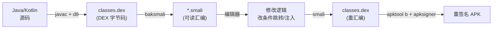
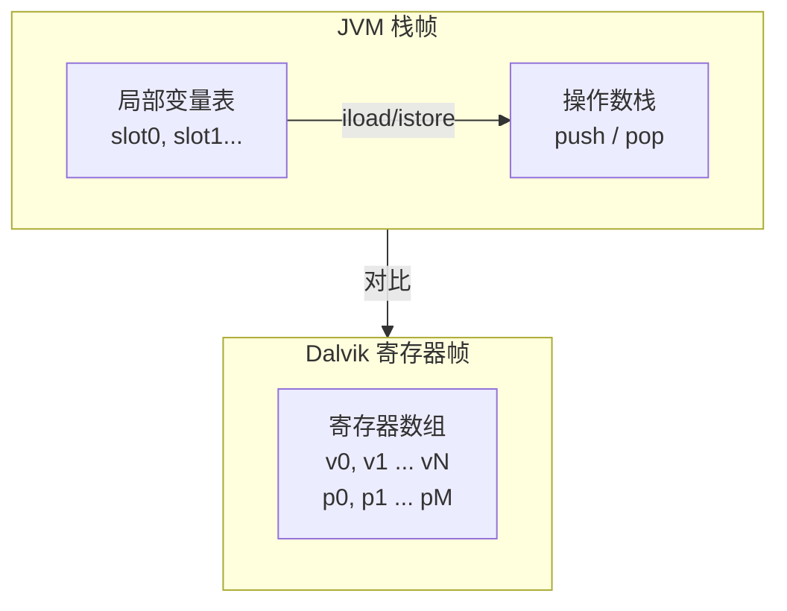

# Android逆向（04）· Dalvik字节码与smali

> [!abstract] TL;DR
> - Dalvik 是**寄存器型**虚拟机，而非 JVM 的栈式虚拟机：指令直接操作编号寄存器（`v0`/`p0`），减少了 push/pop 数量，更适合内存受限的移动端。
> - smali 是 Dalvik 字节码的**人类可读汇编表示**；baksmali 把 `.dex` 反汇编成 `.smali` 文本，smali 工具再把它重汇编回 `.dex`，是 APK 改码的基础。
> - 每个方法的寄存器由 `.registers N` 或 `.locals N` 声明，参数寄存器从尾部占据（`p0..pN`），实例方法 `p0` 固定是 `this`。
> - 方法调用用 `invoke-virtual`/`invoke-direct`/`invoke-static`/`invoke-interface`/`invoke-super`，返回值不在栈上，须用 `move-result`/`move-result-object` 紧跟提取。
> - 改 smali 实践：把条件跳转取反（`if-eqz` → `if-nez`）即可绕过简单校验；重打包后须重新签名才能安装。加固 App 中 smali 可能不可见，参见 [[11.加固与脱壳]]。

---

## 概述与定位

Android 应用的 Java/Kotlin 源码经 `javac`/`kotlinc` → `dx`/`d8` 编译为 [[03.DEX文件格式]] 中的字节码，存于 `classes.dex`。这套字节码的执行引擎最初是 **Dalvik**（Android 2.x–4.3 时代），之后被 **ART** 取代（参见 [[05.ART运行时]]）。但字节码格式与助记符体系从 Dalvik 延续至今，ART 仍执行相同的 DEX 字节码。

smali 是逆向工程师与字节码打交道的主要文本格式：[[08.静态分析工具]] 中的 apktool 调用 baksmali 将 DEX 解包成人类可读的 `.smali` 文件，修改后再 `smali`（重汇编）→ 重打包 → 签名，从而实现**无需源码的 App 改码**。



---

## 原理与机制

### 寄存器型 vs 栈式虚拟机

| 维度 | JVM（栈式） | Dalvik（寄存器型） |
|---|---|---|
| 操作数存放 | 操作数栈（push/pop） | 有编号的寄存器（`v0`、`p0`…） |
| 典型加法 | `iload_0`/`iload_1`/`iadd`/`istore_2`（4条） | `add-int v2, v0, v1`（1条） |
| 指令条数 | 较多 | 明显更少（通常少 30%–50%） |
| 代码体积 | 操作数隐含于栈，指令字节数小 | 寄存器编号占位，单条指令字节数略大 |
| 移动端适配 | 原始设计面向服务端 JVM | 专为内存受限手机优化，减少解释器调度次数 |
| 解释器实现 | 基于栈指针，状态简单 | 基于寄存器帧，分派更直接 |

Dalvik 的核心设计决策：**每帧（frame）分配固定数量的寄存器**，既包含本地变量槽，也包含参数槽，统一编号，消除了 JVM 中"局部变量表 + 操作数栈"两套结构并存的复杂性。



---

## 寄存器命名规则

### v 寄存器与 p 寄存器

Dalvik 把一个方法的全部寄存器分成两段，但它们**共享同一个编号空间**：

```
总寄存器数 = .registers N
参数寄存器数 = 参数个数（实例方法含 this）
本地寄存器数 = N - 参数数

编号映射：
  v0 .. v(N-M-1)   → 本地寄存器（Local）
  v(N-M) .. v(N-1) → 参数寄存器（也可用 p0..p(M-1) 别名）
```

例如：`.registers 5`，参数 2 个（实例方法，p0=this，p1=第一个参数），则 v0、v1、v2 是本地寄存器，v3=p0（this），v4=p1。

| 助记符 | 含义 |
|---|---|
| `v0`–`vN` | 本地寄存器，方法内临时变量 |
| `p0`–`pM` | 参数寄存器；等价于编号末尾的 vX |
| `p0`（实例方法）| 固定为 `this` 引用 |
| `p0`（静态方法）| 第一个显式参数（无 this） |

### `.registers` 与 `.locals` 的区别

| 指令 | 含义 | 寄存器计算 |
|---|---|---|
| `.registers N` | 声明总寄存器数（本地 + 参数） | 直接用，N 即帧大小 |
| `.locals N` | 声明**本地**寄存器数（不含参数） | 总寄存器 = N + 参数数 |

apktool/baksmali 默认生成 `.registers`；手写 smali 时用 `.locals` 更直观。

---

## 指令格式编码

Dalvik 指令集有**多种编码格式**，格式名如 `12x`/`11n`/`35c` 用数字+字母编码：数字表示指令半字节（nibble）分配，字母表示操作数类型（`x`=寄存器对，`n`=立即数4位，`c`=常量池引用，`r`=寄存器范围）。

| 格式 | 典型指令 | 含义 |
|---|---|---|
| `10x` | `nop`/`return-void` | 无操作数 |
| `12x` | `move v0, v1` | 2个4位寄存器 |
| `11n` | `const/4 v0, #4` | 1个4位寄存器 + 4位立即数 |
| `21c` | `const-string v0, "hello"` | 1个8位寄存器 + 16位常量池索引 |
| `22c` | `iget v0, p0, Lcom/Foo;->field:I` | 2个4位寄存器 + 16位字段引用 |
| `35c` | `invoke-virtual {v0,v1}, Method` | 最多5个4位寄存器 + 方法引用 |
| `3rc` | `invoke-virtual/range {v0..v4}, Method` | 寄存器范围 + 方法引用，用于参数>5 |
| `31i` | `const v0, 0x12345678` | 1个8位寄存器 + 32位立即数 |

指令长度从 2 字节（1 个 16-bit code unit）到 10 字节不等。逆向时关注格式主要为了手动核对 smali 与字节偏移的对应关系。

---

## 助记符全景

### 数据移动

| 指令 | 含义 |
|---|---|
| `move vA, vB` | vA = vB（32位值） |
| `move-wide vA, vB` | vA:vA+1 = vB:vB+1（64位 long/double） |
| `move-object vA, vB` | vA = vB（对象引用） |
| `move-result vA` | 取上一条 invoke-* 的 int/float 返回值 |
| `move-result-wide vA` | 取 long/double 返回值 |
| `move-result-object vA` | 取对象引用返回值 |
| `move-exception vA` | catch 块首行：取抛出的异常对象 |

### 常量加载

| 指令 | 含义 |
|---|---|
| `const/4 vA, #+B` | 4位有符号整数立即数 |
| `const/16 vA, #+BBBB` | 16位有符号整数 |
| `const vA, #+BBBBBBBB` | 32位整数 |
| `const-wide vA, #+BBBBBBBBBBBBBBBB` | 64位整数（long） |
| `const-string vA, "string"` | 加载字符串常量池引用 |
| `const-class vA, Lcom/Foo;` | 加载 Class 对象引用 |

### 对象操作

| 指令 | 含义 |
|---|---|
| `new-instance vA, Lcom/Foo;` | 创建新对象（不调用构造函数，须紧跟 invoke-direct init） |
| `new-array vA, vB, [I` | 创建长度为 vB 的 int 数组 |
| `check-cast vA, Lcom/Foo;` | 类型检查，失败抛 ClassCastException |
| `instance-of vA, vB, Lcom/Foo;` | vA = (vB instanceof Foo) ? 1 : 0 |
| `array-length vA, vB` | vA = vB.length |

### 字段访问

| 指令 | 含义 |
|---|---|
| `iget vA, vB, Lcom/Foo;->field:I` | 实例字段读（int） |
| `iget-object vA, vB, Lcom/Foo;->field:Lbar;` | 实例字段读（对象） |
| `iput vA, vB, Lcom/Foo;->field:I` | 实例字段写 |
| `sget vA, Lcom/Foo;->sField:I` | 静态字段读 |
| `sput vA, Lcom/Foo;->sField:I` | 静态字段写 |

### 方法调用

| 指令 | 适用场景 |
|---|---|
| `invoke-virtual {vC..vG}, Method` | 虚方法（实例方法，需虚表分派） |
| `invoke-direct {vC..vG}, Method` | 私有方法或构造函数（直接分派） |
| `invoke-static {vC..vG}, Method` | 静态方法 |
| `invoke-interface {vC..vG}, Method` | 接口方法（需接口虚表） |
| `invoke-super {vC..vG}, Method` | 调用父类方法（super.xxx()） |
| `invoke-*/range {vC..vN}, Method` | 参数超过 5 个时用 range 格式 |

### 算术与位运算

| 指令 | 含义 |
|---|---|
| `add-int vA, vB, vC` | vA = vB + vC |
| `sub-int`/`mul-int`/`div-int`/`rem-int` | 减/乘/除/取余 |
| `add-long`/`add-float`/`add-double` | 对应类型 |
| `and-int`/`or-int`/`xor-int` | 位运算 |
| `shl-int`/`shr-int`/`ushr-int` | 左移/算术右移/逻辑右移 |
| `neg-int`/`not-int` | 取负/按位取反 |

### 数组访问

| 指令 | 含义 |
|---|---|
| `aget vA, vB, vC` | vA = vB[vC]（int 数组） |
| `aget-object vA, vB, vC` | vA = vB[vC]（对象数组） |
| `aput vA, vB, vC` | vB[vC] = vA |

### 跳转与控制流

| 指令 | 含义 |
|---|---|
| `goto :label` | 无条件跳转（8位偏移） |
| `goto/16 :label` | 无条件跳转（16位偏移） |
| `if-eq vA, vB, :label` | vA == vB 则跳 |
| `if-ne vA, vB, :label` | vA != vB 则跳 |
| `if-lt`/`if-ge`/`if-gt`/`if-le` | 有符号比较 |
| `if-eqz vA, :label` | vA == 0 则跳（含 null 检测） |
| `if-nez vA, :label` | vA != 0 则跳 |
| `if-ltz`/`if-gez`/`if-gtz`/`if-lez` | 与零比较 |
| `packed-switch vA, :table` | 连续值 switch |
| `sparse-switch vA, :table` | 稀疏值 switch |

### 返回

| 指令 | 含义 |
|---|---|
| `return-void` | void 方法返回 |
| `return vA` | 返回 int/float/boolean/byte/short/char |
| `return-wide vA` | 返回 long/double |
| `return-object vA` | 返回对象引用 |

---

## 类型描述符与方法签名

Dalvik 沿用 JVM 的**类型描述符（Type Descriptor）**体系：

| 描述符 | 对应类型 |
|---|---|
| `V` | void |
| `Z` | boolean |
| `B` | byte |
| `S` | short |
| `C` | char |
| `I` | int |
| `J` | long |
| `F` | float |
| `D` | double |
| `Lfully/qualified/ClassName;` | 对象类型（注意末尾分号） |
| `[I` | int[] |
| `[Ljava/lang/String;` | String[] |
| `[[I` | int[][] |

**方法签名格式**：`(参数描述符列表)返回类型`

```
示例：
  ()V                          → void foo()
  (I)V                         → void foo(int)
  (ILjava/lang/String;)Z       → boolean foo(int, String)
  ([BII)V                      → void foo(byte[], int, int)
  ()Ljava/lang/String;         → String foo()
```

smali 中的完整方法引用形如：
```
Lcom/example/MyClass;->methodName(ILjava/lang/String;)Z
```

字段引用形如：
```
Lcom/example/MyClass;->fieldName:Ljava/lang/String;
```

---

## 方法调用与返回值提取

**关键规则**：`invoke-*` 指令本身**不直接把返回值放入寄存器**，返回值暂存于"返回值伪寄存器"，必须用 `move-result*` 在下一条指令立即提取（不能插入其他指令）。

```smali
# 调用实例方法 String.length()，返回 int
invoke-virtual {v0}, Ljava/lang/String;->length()I
move-result v1          # v1 = 返回的 int

# 调用静态方法 String.valueOf(int)，返回 String
invoke-static {v2}, Ljava/lang/String;->valueOf(I)Ljava/lang/String;
move-result-object v3   # v3 = 返回的 String 对象

# 调用构造函数（返回 void，不需要 move-result）
new-instance v0, Ljava/lang/StringBuilder;
invoke-direct {v0}, Ljava/lang/StringBuilder;-><init>()V
```

参数寄存器列表规则（`35c` 格式）：
- `{v0, v1, v2}` 格式，最多 5 个寄存器
- 实例方法第一个寄存器必须是对象引用（相当于 this）
- 超过 5 个参数须用 `/range` 格式：`invoke-virtual/range {v0..v6}, Method`

---

## smali 文件语法

一个 `.smali` 文件对应一个 Java 类（或内部类），其结构如下：

### 文件级指令

```smali
.class public Lcom/example/MainActivity;
.super Landroid/app/Activity;
.implements Ljava/lang/Runnable;
.source "MainActivity.java"       # 可选，调试信息
```

### 字段声明

```smali
# 实例字段
.field private mName:Ljava/lang/String;
# 静态字段
.field public static final TAG:Ljava/lang/String; = "MainActivity"
```

### 方法结构

```smali
.method public onCreate(Landroid/os/Bundle;)V
    .registers 3          # 或 .locals 1
    .param p1, "savedInstanceState"   # 参数名（可选）
    .prologue             # 方法体开始标记（可选）
    .line 15              # 对应源码行号（调试信息）

    invoke-super {p0, p1}, Landroid/app/Activity;->onCreate(Landroid/os/Bundle;)V

    const/16 v0, 0x7F04006A
    invoke-virtual {p0, v0}, Lcom/example/MainActivity;->setContentView(I)V

    return-void
.end method
```

### 控制流标签与异常处理

```smali
    if-eqz v0, :cond_0

    # true 分支
    invoke-virtual {v1}, Ljava/lang/Object;->toString()Ljava/lang/String;
    move-result-object v2
    goto :goto_0

    :cond_0
    # false 分支
    const-string v2, "null"

    :goto_0
    # 汇合点
    return-object v2

    # 异常处理
    :try_start_0
    invoke-virtual {v0}, Ljava/io/InputStream;->read()I
    :try_end_0
    .catch Ljava/io/IOException; {:try_start_0 .. :try_end_0} :catch_0

    :catch_0
    move-exception v1
    invoke-virtual {v1}, Ljava/lang/Exception;->printStackTrace()V
```

### smali 关键字速查

| 指令/标记 | 作用 |
|---|---|
| `.class` | 声明类名与访问修饰符 |
| `.super` | 父类 |
| `.implements` | 实现的接口 |
| `.field` | 字段声明 |
| `.method` / `.end method` | 方法定义边界 |
| `.registers` | 总寄存器数 |
| `.locals` | 本地寄存器数（不含参数） |
| `.param` | 参数名（可选调试信息） |
| `.line` | 源码行号映射（调试信息） |
| `.prologue` | 方法体序言标记 |
| `.catch` | 异常捕获声明 |
| `:label_name` | 任意跳转目标标签 |
| `:try_start_X` / `:try_end_X` | try 块边界 |
| `:cond_X` | if 条件跳转目标（约定命名） |
| `:goto_X` | goto 跳转目标（约定命名） |
| `:catch_X` / `:catchall_X` | 异常处理块入口 |

---

## smali ↔ Java 对照

下面以一个简单的校验方法为例，给出 Java 与 smali 的并排对照：

### Java 源码

```java
public class License {
    private static final String VALID_KEY = "ABCD-1234";

    public boolean checkKey(String inputKey) {
        if (inputKey == null) {
            return false;
        }
        return VALID_KEY.equals(inputKey);
    }
}
```

### smali（baksmali 反汇编结果）

```smali
.class public Lcom/example/License;
.super Ljava/lang/Object;

.field private static final VALID_KEY:Ljava/lang/String; = "ABCD-1234"

.method public checkKey(Ljava/lang/String;)Z
    .registers 4
    # p0 = this, p1 = inputKey, v0/v1 = 本地寄存器

    .prologue
    .line 6
    # if (inputKey == null) → if-eqz p1
    if-eqz p1, :cond_0

    .line 9
    # VALID_KEY.equals(inputKey)
    sget-object v0, Lcom/example/License;->VALID_KEY:Ljava/lang/String;
    invoke-virtual {v0, p1}, Ljava/lang/String;->equals(Ljava/lang/Object;)Z
    move-result v1
    return v1       # return boolean

    :cond_0
    .line 7
    # return false → const/4 v0, 0x0
    const/4 v0, 0x0
    return v0

.end method
```

> [!note] 对照要点
> - Java `==` 对象比较 → smali `if-eqz`（与零/null 比较）
> - 静态字段读 → `sget-object`
> - 实例方法调用 → `invoke-virtual`，返回值用 `move-result`
> - `return false` → `const/4 v0, 0x0` + `return v0`（boolean 在 Dalvik 中是 int 0/1）

---

## 工具实践：baksmali / smali / apktool

### 工具链概览

| 工具 | 来源 | 功能 |
|---|---|---|
| baksmali | 独立工具 / apktool 内置 | DEX → smali 反汇编 |
| smali | 独立工具 / apktool 内置 | smali → DEX 重汇编 |
| apktool | 独立工具 | APK 解包（含 baksmali + AXML/资源解码）与重打包 |
| [[08.静态分析工具]] | - | jadx 可直接反编译到 Java，更易读；smali 更贴近真实字节码 |

### 基本工作流

```bash
# 1. 解包 APK（baksmali + 资源解码）
apktool d target.apk -o out_dir

# 2. 查看 smali 结构
# out_dir/smali/com/example/License.smali

# 3. 编辑 smali 文件（见下方实战）

# 4. 重打包
apktool b out_dir -o modified.apk

# 5. 对齐（可选，提升运行效率）
zipalign -v 4 modified.apk aligned.apk

# 6. 签名（必须，否则无法安装）
apksigner sign --ks debug.keystore --out signed.apk aligned.apk

# 7. 安装
adb install signed.apk
```

> [!warning] 示例输出为示意
> 上述命令输出因 apktool 版本、APK 结构不同而异，实际运行请参考工具文档。

### 独立使用 baksmali/smali

```bash
# 单独反汇编 DEX
java -jar baksmali.jar d classes.dex -o smali_out/

# 单独重汇编
java -jar smali.jar a smali_out/ -o classes_new.dex
```

> [!warning] 示例输出为示意

---

## 改 smali 实战：绕过条件校验

以下演示针对**自有 App**的安全评估场景，修改 smali 绕过一个简单的注册码校验。

### 目标逻辑（Java 伪代码）

```java
// com/example/LicenseChecker.smali 中的 verify() 方法
boolean isValid = checkKey(inputKey);
if (isValid == false) {  // 若校验失败
    showErrorAndExit();  // 弹错误并退出
}
```

### 原始 smali 片段

```smali
.method public verify(Ljava/lang/String;)V
    .registers 3

    invoke-virtual {p0, p1}, Lcom/example/LicenseChecker;->checkKey(Ljava/lang/String;)Z
    move-result v0

    # v0 == 0 (false) 时跳到错误处理
    if-eqz v0, :cond_error

    return-void

    :cond_error
    invoke-virtual {p0}, Lcom/example/LicenseChecker;->showErrorAndExit()V
    return-void

.end method
```

### 修改：将 `if-eqz` 改为 `if-nez`

```smali
    # 修改后：条件取反——原来"校验失败才跳错误"，改成"校验成功才跳错误"
    # 实际效果：任何输入都不再进入错误分支，校验被强制放行
    if-nez v0, :cond_error   # ← 将 if-eqz 改为 if-nez
```

改法说明：原逻辑校验失败（v0=0）跳错误分支；将 `if-eqz` 改为 `if-nez` 后，v0=0 时不跳，直接 `return-void` 放行。更彻底的改法是在 `invoke-virtual` 后直接写 `const/4 v0, 0x1` 强制返回 true——仅限自有 App 安全评估演示。

> [!warning] 示例输出为示意
> 以上 smali 片段为示意性演示，真实 App 的字节码结构因混淆、加固程度不同而有所差异。

---

## 安全性与正确使用

### 寄存器数量约束

- `.registers` 最大值为 **65535**（16位），但 Dalvik/ART 实际限制在 **64K-1**（`0xFFFF`）。
- `invoke-*`（35c 格式）单次最多传 **5 个**寄存器；超过 5 个须用 `/range` 格式，且参数寄存器必须连续。
- 修改 smali 引入新寄存器时，**必须同步更新 `.registers` 或 `.locals` 的数值**，否则 dexlib 重汇编时报错，或运行时抛 `VerifyError`。

### 改码后校验与签名

修改 smali 并重打包后必须经过以下步骤，否则无法在设备上安装运行：

1. **zipalign**：ZIP 对齐，4字节对齐，ART 运行时要求。
2. **重签名**：原始签名（`META-INF/` 目录的 JAR 签名 v1，或 APK Signing Block 的 v2/v3）已失效，必须用新密钥重签。生产 App 有签名校验逻辑时，还需绕过签名验证（动态插桩见 [[09.Frida动态插桩]]）。
3. **dex 字节码验证**：ART 有内置字节码验证器（Verifier），错误的寄存器计数、类型不匹配、非法跳转目标均会导致 `VerifyError` 并在安装或首次运行时崩溃。

### 加固下 smali 不可见

商业加固方案（参见 [[11.加固与脱壳]]）会对 DEX 进行加密、抽取或虚拟化：
- **DEX 加密壳**：`classes.dex` 是壳代码，真实 DEX 在内存中解密后才可见，apktool 反汇编只能看到壳的 smali。
- **方法抽取**：方法体（code item）在运行时动态还原，静态看到的是空方法体或 `return-void`。
- **VMP（Dalvik 虚拟机保护）**：关键方法被转成私有字节码，smali 完全不可见。

此类场景需要内存 dump 脱壳后再做 smali 分析，或改用 [[09.Frida动态插桩]] 在运行时 hook Java 方法。

### 合规与安全研究边界

- 本文演示操作仅适用于**自有 App 的安全评估**、**CTF 题目**、**恶意样本分析**等合法场景。
- 对他人应用进行 smali 修改并分发属于违法行为（违反著作权法及相关协议）。
- 企业安全团队使用此技术进行自有 App 渗透测试时，应确保有书面授权。

---

## 小结

| 要点 | 核心内容 |
|---|---|
| 执行模型 | Dalvik 寄存器型虚拟机，指令直接操作 v0/p0，比 JVM 栈式少30%–50%指令 |
| 寄存器命名 | `.registers N` 总帧大小；p0=this（实例方法）；`.locals` 仅算本地 |
| 指令格式 | `12x`/`11n`/`21c`/`35c`/`3rc` 等，按操作数类型与数量编码 |
| 调用约定 | `invoke-*` 五种形式；返回值必须用 `move-result`/`move-result-object` 提取 |
| smali 语法 | `.class`/`.field`/`.method`/`.registers`/`.catch`/:label 构成完整文件 |
| 类型描述符 | `Ljava/lang/String;`/`[I`/`(ILjava/lang/String;)V` 等 JVM 体系 |
| 工具链 | apktool d → 编辑 smali → apktool b → zipalign → apksigner |
| 改码实战 | 改条件跳转取反绕过校验；须更新 .registers 计数、重签名、应对 VerifyError |
| 局限性 | 加固 App 的 smali 可能不可见，需先脱壳或改用 Frida 动态分析 |

---

## 相关阅读

- [[03.DEX文件格式]] — smali 的字节码最终存储于 DEX 的 code_item，理解 DEX 结构有助于手动分析偏移
- [[05.ART运行时]] — ART 如何执行 DEX 字节码（解释器、JIT、AOT），smali 改码在 ART 下的注意事项
- [[08.静态分析工具]] — jadx 将 DEX 直接反编译为 Java，比 smali 更易读；两者互补
- [[09.Frida动态插桩]] — 无需改 smali 即可 hook Java 方法，加固 App 的首选动态方案
- [[11.加固与脱壳]] — DEX 加密/抽取/VMP 使 smali 不可见时的脱壳与应对
- [[11.ELF文件详解/00.ELF文件详解总览|ELF 文件详解]] — native `.so` 与 DEX 并存于 APK，JNI 层见 [[07.JNI与native层]]

---

⬅️ 上一篇 [[03.DEX文件格式]] ｜ 🏠 [[00.Android逆向与运行时总览]] ｜ 下一篇 [[05.ART运行时]] ➡️
