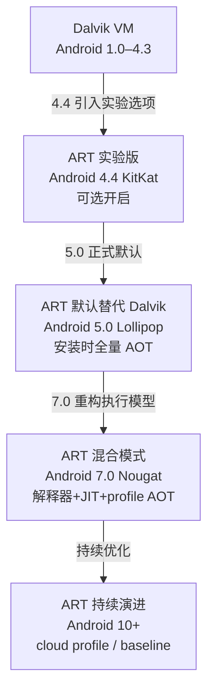
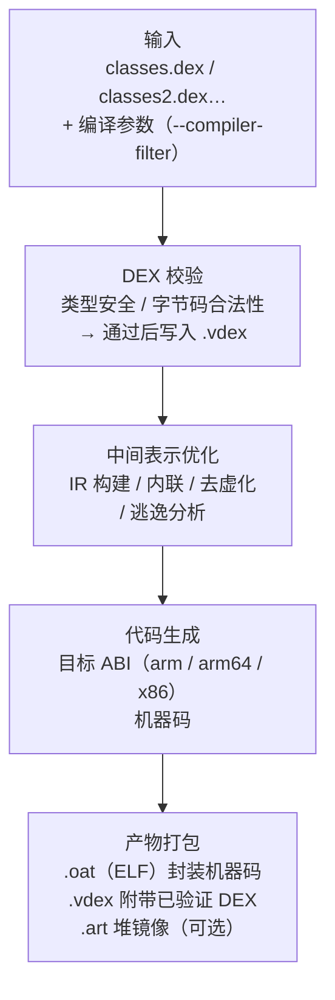
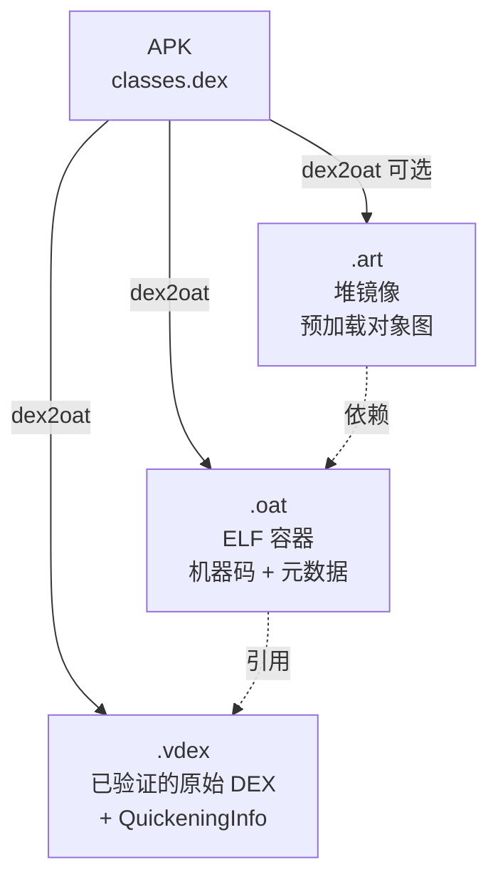

# Android逆向（05）· ART运行时

> [!abstract] TL;DR
> - ART（Android Runtime）是 Android 5.0 起取代 Dalvik 的默认运行时，从"执行时解释 + 运行时 JIT"演进为"安装时 AOT 编译 + 运行时 JIT + profile-guided 混合"三阶段。
> - 核心产物三件套：`.oat`（ELF 容器，包裹已编译机器码）、`.vdex`（验证过的原始 DEX，快速回退兼脱壳目标）、`.art`（堆镜像，预加载对象）。
> - dex2oat 编译流水线：DEX 输入 → 校验 → 优化 → 机器码生成 → 产物落盘 `/data/app/.../oat/<arch>/`。
> - Android 7.0（Nougat）后不再安装时全量 AOT，而是"解释器启动 → JIT 热点标记 → profile 引导的后台 AOT"，兼顾安装速度与运行性能。
> - 对逆向的意义：`.oat` 可被反编译还原已编译方法，`.vdex` 可提取原始 DEX 用于脱壳，ART 内部结构（`ArtMethod`/`ClassLinker`）是 native hook 的核心目标。

---

## 概述与定位

ART 是 Android 虚拟机的现代实现，负责执行所有 Java/Kotlin 应用代码。理解 ART 的执行模型与产物格式，是 Android 逆向、脱壳与动态分析的基础。

- **与 DEX 格式的关系**：ART 的输入是 [[03.DEX文件格式]] 描述的 `.dex` 字节码，输出是针对目标 ABI 编译后的机器码产物（`.oat`/`.vdex`/`.art`）。
- **与 Zygote 的关系**：ART 在 [[06.应用启动与Zygote]] 描述的 Zygote 进程中预热，fork 子进程后直接继承 boot image 与已加载框架。
- **与 JNI/native 的关系**：ART 通过 [[07.JNI与native层]] 的 JNI 机制与 native `.so` 交互，`.so` 本身是 [[11.ELF文件详解/00.ELF文件详解总览.md]] 描述的 ELF 文件。

---

## 原理与机制

### Dalvik 到 ART 演进

Android 历史上先后存在两套虚拟机，演进路径如下：



**Dalvik 执行模型（Android 1.0–4.4 主流）**

- 寄存器型虚拟机，执行 `.dex` 字节码（参见 [[04.Dalvik字节码与smali]]）。
- Android 2.2 起引入 JIT（Just-In-Time）：解释执行过程中对热点方法即时编译为机器码，存入运行时 code cache，但**安装时不做任何预编译**。
- 弱点：每次应用启动都从头解释，JIT 预热慢；code cache 非持久，重启后丢失。

**ART 安装时 AOT 阶段（Android 5.0–6.0）**

- 安装时（`dex2oat`）将 DEX 全量编译为目标 ABI 机器码，产物存入 `.oat`。
- 启动直接执行机器码，启动快、运行快；但安装慢（大型 App 数十秒）、产物占空间大。

**ART 混合模式（Android 7.0+，现行主流）**

三阶段协同，是当前所有逆向分析面对的主要模式：


| 阶段 | 触发时机 | 特点 |
|---|---|---|
| 解释器 | 首次安装 / 冷启动 | 无需等待编译，安装即可运行 |
| JIT | 运行期热点方法 | 即时编译进 code cache，重启丢失 |
| AOT（profile-guided） | 后台空闲 / 充电 / dex2oat | 依 profile 只编译热点，产物持久 |

Android 7.0 引入这一混合策略，根本原因是早期全量 AOT 带来安装时间过长与磁盘占用过大的问题，而纯 JIT（Dalvik 模式）又无法在重启后保持编译成果。

---

## dex2oat 编译流程

`dex2oat` 是 ART 的 AOT 编译器，将 DEX 转化为目标平台机器码。

### 编译流水线



### compiler-filter 参数

`dex2oat` 的编译深度由 `--compiler-filter` 控制，决定产物形态：

| filter 值 | 行为 | 何时使用 |
|---|---|---|
| `verify` | 只做字节码校验，不编译 | 快速安装，后续靠 JIT |
| `quicken` | 生成简化解释提示，部分优化 | Android 8–9 中间态 |
| `speed-profile` | 只 AOT 编译 profile 中的热点方法 | Android 7+ 默认后台策略 |
| `speed` | 全量 AOT 编译所有方法 | 系统镜像 / 性能优先场景 |
| `everything` | 全量 AOT + 额外优化 | 调试 / 基准测试 |

实际命令示例：

```bash
dex2oat --dex-file=/data/app/com.example/.../base.apk \
        --oat-file=/data/app/com.example/oat/arm64/base.odex \
        --compiler-filter=speed-profile \
        --profile-file=/data/.../base.prof
```

> [!warning] 示例输出为示意
> 实际路径、参数随 Android 版本与设备厂商定制而不同，以 `adb shell` 实际观察为准。

---

## 产物详解：.oat / .vdex / .art 三件套

Android 7.0 之后，dex2oat 落盘产物最多三个，分工清晰：



### .oat 文件

`.oat` 本质是一个 **ELF 共享库**（`.so` 的格式，ABI 标识特殊），内部封装已编译机器码与 ART 特有段：

| ELF 节 / 段 | 内容 |
|---|---|
| `.rodata` | OatHeader（魔数 `oat\n` + 版本 + 校验）、类元数据偏移表、dex 文件内嵌（旧版）|
| `.text` | 每个已编译方法的机器码（目标 ABI）|
| `.dynamic` / 符号表 | ELF 标准符号与动态链接信息 |
| `oatdata`/`oatexec`/`oatlastword` 符号 | ART 加载器定位 oat 内容的关键符号 |

OatHeader 开头魔数为 ASCII `oat\n` 后跟 3 字节版本号（如 `179`），不同 Android 版本对应不同版本号——逆向时需注意版本兼容性。

ELF 结构详见 [[11.ELF文件详解/00.ELF文件详解总览.md]]。

### .vdex 文件

`.vdex`（Verified DEX）是 Android 8.0 引入的格式，存储**已通过字节码校验的原始 DEX 内容**：

- 包含原始 `.dex` 数据（与 APK 内 classes.dex 内容对应），前缀一个 VdexHeader（魔数 `vdex` + 版本）。
- 附加 `QuickeningInfo`：记录解释器优化过的字节码快速提示（Android 10+ 后逐步弃用）。
- **对逆向的核心价值**：加固壳若干预了 dex2oat 或抹掉了 DEX 内容，`.vdex` 仍保留已验证的原始 DEX——它是内存 dump 脱壳之外，最直接的 DEX 提取目标（参见 [[11.加固与脱壳]]）。

提取 `.vdex` 中的 DEX：

```bash
# vdexExtractor 工具（示意）
vdexExtractor -i /data/app/com.example/oat/arm64/base.vdex -o /tmp/out/
# 输出 classes.dex（原始 DEX）
```

> [!warning] 示例输出为示意
> 实际可用工具与参数随 Android 版本变化，`.vdex` 格式也在持续演进。

### .art 文件

`.art` 是堆镜像（Heap Image），以序列化形式存储**预加载的 Java 对象图**：

- `boot.art`（boot image）：存储核心框架类（`java.lang.*`、`android.*` 关键类）的实例化对象，Zygote 启动时直接映射进内存，所有应用共享同一份物理页——这是 [[06.应用启动与Zygote]] 描述的预热机制的物理基础。
- 应用级 `.art`：存储应用自身的预热对象，较少见。

### 产物存放路径

| 路径 | 说明 |
|---|---|
| `/system/framework/arm64/boot.oat` | 框架 boot image（OAT） |
| `/system/framework/arm64/boot.art` | 框架 boot image（堆镜像） |
| `/data/app/<包名>/oat/<abi>/base.odex` | 用户 App 的 OAT（Android 5–6 为 `.odex`） |
| `/data/app/<包名>/oat/<abi>/base.vdex` | 用户 App 的 VDEX |
| `/data/dalvik-cache/<abi>/` | 旧式缓存路径（Android 5 前） |
| `/data/misc/profiles/cur/0/<包名>/primary.prof` | JIT profile 文件 |

查看实际路径：

```bash
adb shell ls -la /data/app/com.example.app*/oat/arm64/
```

> [!warning] 示例输出为示意
> 路径中的版本哈希后缀随安装变化。

---

## 执行模型详解

### 解释器：mterp 与 switch 解释

ART 内置两种解释器实现，用于执行尚未 AOT 或 JIT 编译的方法：

**mterp**（模板解释器）
- 用目标 ABI 汇编手写的高度优化解释器，每条 Dalvik 字节码对应一段汇编处理模板。
- ARM64 上每个操作码处理模板固定为 128 字节（便于直接跳转），通过 `x0` 保存分发表基址，执行时 `fetch` → `dispatch` 形成"线程解释"（threaded interpreter）。
- 优点：接近硬件的最优解释性能；缺点：每种 ABI 需要独立维护汇编。

**switch 解释器**（可移植解释器）
- C++ 实现的 `switch(opcode)` 大循环，逻辑清晰、平台无关。
- 用于调试模式、mterp 不支持的指令路径、或作为 mterp 的回退。

逆向者关注解释器的场景：加固壳在壳代码执行阶段往往强制走解释器路径（禁止 JIT/AOT），通过 hook ArtMethod 的 `interpreter_entry_point_from_quick_compiled_code_` 字段或 Instrumentation 接口可以追踪方法执行。

### JIT 编译器

Android 7.0 后 JIT 重回 ART，与解释器、AOT 协同：

- **热点触发**：解释器维护每个方法的调用计数器（hotness counter），超过阈值（默认约 10000 次）触发 JIT 编译。
- **code cache**：JIT 编译结果存入进程内的 code cache（初始容量约 64 KB，按需增长，最大约 64 MB（64 位；32 位约 32 MB）），重启后丢弃。
- **OSR（On-Stack Replacement）**：长时间运行的循环方法可在循环体内触发 OSR，从解释状态切换到 JIT 编译状态，无需方法调用边界。
- **profile 写入**：JIT 会将热点方法信息写入 `/data/misc/profiles/cur/0/<包名>/primary.prof`，供后续后台 dex2oat 使用。

### profile-guided AOT

`primary.prof` 文件记录热点方法列表（方法签名 + 类信息），后台 dex2oat 以此为输入，只编译热点方法，实现精准 AOT：

- **baseline profile**：由应用开发者随 APK 一同发布的预置 profile（`assets/dexopt/baseline.prof`），Android 9+ 支持。Google Play 发布的 App 通常附带，使首次安装后已有合理的 AOT 结果。
- **cloud profile**：Google Play 收集用户群体的 profile 数据，在 OTA 或应用更新时下发给设备，让冷启动用户也能享受经过充分 profile 引导的 AOT 产物。

---

## 类加载与 ClassLinker

ART 的类加载由 `ClassLinker` 负责，是理解 hook 与脱壳的关键组件。

### ClassLinker 职责

- 解析 `.oat` / `.vdex` 中的类定义，构建 `Class` 对象。
- 将 DEX 中的方法描述符与 OAT 中的机器码入口（`entry_point_from_quick_compiled_code_`）关联。
- 管理类的状态机：`kNotReady` → `kIdx` → `kLoaded` → `kResolved` → `kVerified` → `kInitialized`。

### ArtMethod 结构

每个 Java 方法在 ART 中对应一个 `ArtMethod` 结构体（C++ 对象），字段（以 Android 12 arm64 为参考，字段偏移随版本变化）：

```
ArtMethod 关键字段（示意偏移，非硬常量）：
  [+0x00]  declaring_class_          : GcRoot<Class>    类引用
  [+0x08]  access_flags_             : uint32_t         方法访问标志
  [+0x0C]  dex_method_index_         : uint32_t         DEX 中方法索引
  [+0x10]  method_index_             : uint16_t         vtable / interface 表索引
  [+0x18]  hotness_count_            : uint16_t         JIT 热度计数器
  [+0x20]  dex_code_item_offset_     : uint32_t         DEX 字节码偏移（CodeItem）
  [+0x28]  entry_point_from_jni_     : void*            JNI 方法或 trampoline
  [+0x30]  entry_point_from_quick_compiled_code_ : void*  执行入口（机器码/解释器/JIT）
```

> [!warning] 字段偏移因 Android 版本与编译配置而不同
> `entry_point_from_quick_compiled_code_` 是 native hook ART 方法的核心目标：将其替换为自定义函数，即可在不修改 DEX/smali 的前提下拦截任意 Java 方法。Frida、SandHook、Epic 等框架均依赖此机制（参见 [[09.Frida动态插桩]]）。

### boot image 与框架预热

`boot.art` + `boot.oat` 共同构成 boot image：

- `boot.oat`：将 `core-oj.jar`、`framework.jar` 等系统框架 DEX 全量 AOT 编译的产物。
- `boot.art`：`java.lang.String`、`java.lang.Class` 等高频对象的预实例化镜像，Zygote 启动时 `mmap` 进内存。
- 所有 App 进程 fork 自 Zygote，继承 boot image 的映射，无需重新加载框架——这是 Android 启动性能优化的基础。

---

## GC：从标记-清除到并发拷贝

ART 的垃圾回收器随版本演进，对逆向分析的影响主要体现在 hook 稳定性与对象存活分析。

| GC 实现 | 引入版本 | 算法特点 |
|---|---|---|
| Mark-Sweep | Android 5.0 | 停顿明显，简单实现 |
| Concurrent Mark-Sweep (CMS) | Android 5.0+ | 并发标记，减少停顿 |
| Semi-Space (SS) | Android 5.0 调试模式 | 拷贝式，碎片少 |
| Generational SS | Android 5.0+ | 分代，新生代 SS + 老年代 MS |
| Concurrent Copying (CC) | Android 8.0+ | 并发拷贝，低停顿，arm64 默认 |
| Generational CC | Android 10+ | 分代并发拷贝，低内存优先 |

**并发拷贝（CC）对逆向的影响**：CC GC 会移动对象（拷贝到新地址），依赖对象绝对地址的 hook（如直接保存 `ArtMethod*` 指针）需注意 GC 期间指针失效；ART 通过 read barrier 维护引用一致性，hook 框架需正确处理这一点。

---

## 对逆向的意义

### .oat 反编译：还原已编译方法

`.oat` 内的机器码可被反汇编工具（IDA Pro、Ghidra）直接分析：

```bash
# 将 .oat 作为 ELF 加载到 IDA（arm64）
# 搜索 oatdata / oatexec 符号定位代码段

# 或使用 oatdump 查看 ART 元数据
adb shell oatdump --oat-file=/data/app/com.example/oat/arm64/base.odex
```

> [!warning] 示例输出为示意
> `oatdump` 是 Android 内置工具，输出格式随版本变化；IDA 加载 `.oat` 需手动识别 ART 特有节区。

### .vdex 提取：脱壳的直接目标

当加固壳以"DEX 抽取"或"在内存中动态还原 DEX"的方式工作时（参见 [[11.加固与脱壳]]），`.vdex` 文件可能保留了壳尚未抹除的原始 DEX 内容：

```bash
adb pull /data/app/com.target.app-*/oat/arm64/base.vdex /tmp/
# 使用 vdexExtractor 或 apktool 解析 vdex 得到 classes.dex
```

> [!warning] 示例输出为示意

更深层的加固（VMP、指令抽取）会破坏 `.vdex` 中的 CodeItem，此时需结合内存 dump 方案。`.vdex` 是 ELF/DEX 二进制分析（[[11.ELF文件详解/00.ELF文件详解总览.md]]）中一个独特的 Android 场景。

### ArtMethod Hook：native 层注入

拦截 Java 方法的最底层手段是直接修改 `ArtMethod.entry_point_from_quick_compiled_code_`：

```
正常调用路径：
  invoke-virtual → ClassLinker 分发 → ArtMethod.entry_point → 机器码/解释器

Hook 后路径：
  invoke-virtual → ArtMethod.entry_point → 自定义 trampoline → 原始实现（可选）
```

Frida 的 Java.use() hook（参见 [[09.Frida动态插桩]]）底层即操纵此字段。Android 版本差异导致 `ArtMethod` 布局不同——主流 hook 框架维护版本偏移表，逆向分析时需确认目标设备的 Android 版本。

### 加固对 dex2oat 的干预

高强度加固壳会干预 dex2oat 流程（参见 [[11.加固与脱壳]]、[[34.现代二进制防护机制/00.现代二进制防护机制总览.md]]）：

| 干预手段 | 效果 | 绕过思路 |
|---|---|---|
| 抹除 DEX CodeItem | `.vdex` 中方法体为空，dex2oat 不编译 | 运行时内存 dump（方法执行前 CodeItem 已还原）|
| 替换 `entry_point` 为壳 trampoline | 所有方法执行时先经壳 | Hook ClassLinker / 监控 `entry_point` 赋值 |
| 拦截 dex2oat 进程 | 阻止 AOT，强制走解释器 | ptrace/frida 追踪解释器执行流 |
| 多 DEX 动态加载 | 热点 DEX 运行时 `InMemoryDexClassLoader` | Hook `ClassLoader.loadClass` / 内存搜索 DEX 魔数 |

---

## 安全性与正确使用

### 版本差异的实践陷阱

不同 Android 版本的 ART 实现差异显著，逆向分析时务必考量：

- **OAT 版本号**：OatHeader 中的版本字段（如 `179`/`183`/`199`）与 Android API Level 对应，解析工具（vdexExtractor、oatdump）需匹配版本。
- **ArtMethod 偏移**：从 Android 5 到 15，`ArtMethod` 各字段偏移多次变动（指针压缩模式 `kUseReadBarrier`、`kUsePointerSummation` 等编译选项也影响布局）。hook 框架如 Frida 通过 `Process.androidVersion` 动态适配。
- **vdex 格式演进**：Android 8 引入，10 弃用 QuickeningInfo，12 后部分厂商定制格式。

### .oat/.vdex 与原 DEX 的一致性

- 正常情况下 `.vdex` 内嵌 DEX 与 APK 中 `classes.dex` SHA-1 一致，dex2oat 在 VdexHeader 中记录校验和。
- 加固破坏一致性后，ART 加载时仍依赖 `.vdex` 执行——逆向分析时对比 APK DEX 与 vdex 内容可快速识别是否被加固干预。

### 合规与分析边界

- 提取 `.vdex`/`.oat` 分析代码，应用于自有 App 安全评估（脱壳分析是安全研究的标准手段）。
- 针对他人商业应用的反编译与逆向，需在当地法律法规与服务条款允许范围内进行。
- ArtMethod hook 用于动态分析与安全研究（自有 App 评估、恶意样本分析），不用于未授权的生产系统注入。

---

## 小结

1. **演进脉络**：Dalvik（解释+JIT）→ ART 5.0（安装时全量 AOT）→ ART 7.0+（解释器+JIT+profile-guided AOT 三阶段混合），每一步都是在安装速度、启动速度、运行性能、磁盘占用之间的权衡。
2. **dex2oat 产物三件套**：`.oat`（ELF 机器码容器）、`.vdex`（已验证原始 DEX，脱壳核心目标）、`.art`（堆镜像，框架预热基础），分工明确，相互引用。
3. **执行模型**：mterp 解释器处理冷代码，JIT code cache 覆盖热点，profile 引导 AOT 持久化热点编译结果——三者共同决定方法的实际执行路径，也决定 hook/分析时的切入点。
4. **ClassLinker 与 ArtMethod**：是 ART 内部结构的核心，`entry_point_from_quick_compiled_code_` 字段是 native hook Java 方法的最底层入口。
5. **GC 演进**：Android 8+ 默认并发拷贝（CC）GC，对象可能被移动，hook 框架需正确处理 read barrier，避免持久化裸指针。
6. **逆向实践**：`.oat` 反汇编可还原已编译方法，`.vdex` 提取可绕过部分加固获取原始 DEX，ArtMethod hook 是动态分析的底层基础——三者结合是 Android 运行时分析的完整工具链。

---

## 相关阅读

- **DEX 格式（ART 的输入）**：[[03.DEX文件格式]]
- **Dalvik 字节码与 smali**：[[04.Dalvik字节码与smali]]
- **应用启动与 Zygote 预热**：[[06.应用启动与Zygote]]
- **JNI 与 native 层**：[[07.JNI与native层]]
- **ELF 结构（.oat 即 ELF）**：[[11.ELF文件详解/00.ELF文件详解总览.md]]
- **Frida 动态插桩（ArtMethod hook 的上层封装）**：[[09.Frida动态插桩]]
- **加固与脱壳（.vdex 提取与内存 dump）**：[[11.加固与脱壳]]
- **现代二进制防护（加固干预 dex2oat）**：[[34.现代二进制防护机制/00.现代二进制防护机制总览.md]]
- **Hook 技术（ArtMethod 入口替换原理）**：[[32.hooks/00.总览.md]]
- **调试器与反调试（ptrace 追踪解释器）**：[[44.调试器原理与实战/00.调试器原理与实战总览.md]]

---

⬅️ 上一篇 [[04.Dalvik字节码与smali]] ｜ 🏠 [[00.Android逆向与运行时总览]] ｜ 下一篇 [[06.应用启动与Zygote]] ➡️
