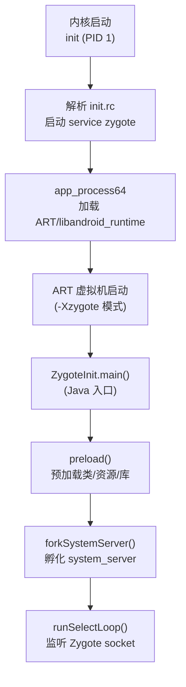
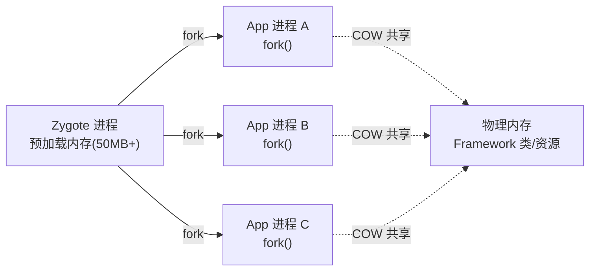
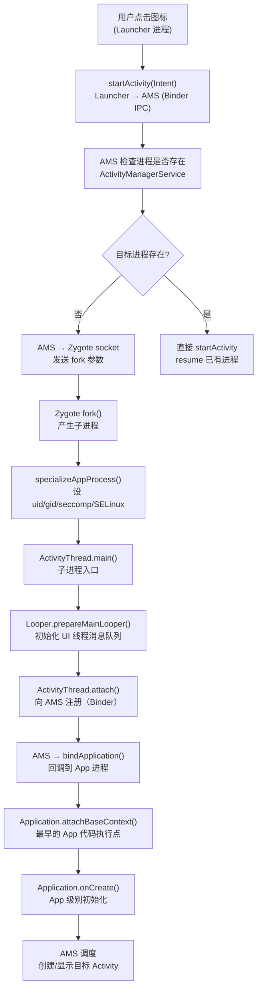
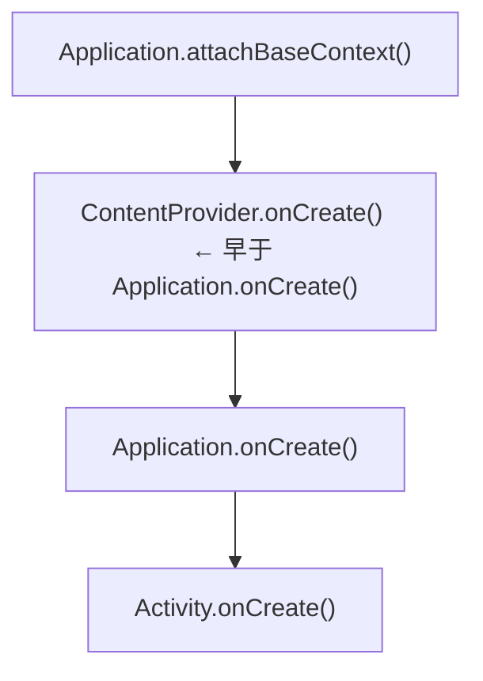

# Android逆向（06）· 应用启动与Zygote

> [!abstract] TL;DR
> - Android 不让每个 App 从零 JVM 冷启，而是由 **Zygote** 这个"种子进程"预先加载好 Framework 类库、资源与共享库，然后通过 **`fork()`** 复制自身孵化子进程——借助写时复制（COW），几十 MB 的预热内存被所有 App 进程零成本共享，App 启动耗时从秒级降到百毫秒量级。
> - 启动链：**点击图标 → Launcher → AMS → Zygote socket → fork() → 子进程 specialize → `ActivityThread.main()` → `attach` → `bindApplication` → `Application.attachBaseContext()` → `Application.onCreate()` → 目标 Activity**。
> - 逆向意义：理解这条链，才知道**在哪个时机 attach/hook**（Frida `spawn` 模式、`attachBaseContext` 脱壳点）、**加固壳在哪解密 dex**（见 [[11.加固与脱壳]]）、以及**反调试检测在哪落位**（见 [[12.反调试与反Frida对抗]]）。

---

## 概述与定位

每个 Android App 在独立进程中运行，进程所属用户为 App 专属 uid。如果从 `exec()` 冷起，每次都要重新初始化 JVM、加载 Framework 类（`android.app.*`、`java.lang.*`、`libcore` 等数百个类）、解码 drawable/string 资源——这些开销是确定性的、重复的，与 App 自身逻辑无关。

Zygote 的设计思路：**把这部分一次性付出提前做好，后续每次 fork 只需复制已就绪的进程状态**。这与操作系统的 `vfork` + COW 页面机制配合，使内存开销也被平摊到所有 App。

本篇覆盖：

| 主题 | 核心概念 |
|---|---|
| init → Zygote 启动 | `init.rc`、`app_process`、`ZygoteInit` |
| Zygote 预加载 | 类、资源、共享库 |
| fork + COW 原理 | 内存共享机制，省内存 + 快启动 |
| Zygote socket 协议 | 监听 fork 请求、参数传递 |
| 完整应用启动链 | Launcher → AMS → Zygote → ActivityThread |
| 进程与线程模型 | main/UI 线程、Looper/MessageQueue |
| 逆向意义与 hook 时机 | attach 点、脱壳点、反调试落位 |

---

## 原理与机制

### 2.1 init → Zygote 启动

Android 启动序列：

```
BootROM → Bootloader → Linux 内核 → init（PID 1）
```

`init` 进程解析 `/system/etc/init/` 下的 `.rc` 文件。Zygote 的启动条目在 `init.zygote64.rc`（64 位）或 `init.zygote32_64.rc` 等文件中：

```
service zygote /system/bin/app_process64 -Xzygote /system/bin --zygote --start-system-server
    class main
    user root
    group root ...
    socket zygote stream 660 root inet
```

关键字段解析：

| 字段 | 含义 |
|---|---|
| `app_process64` | 启动进程的可执行文件，负责加载 `libandroid_runtime.so` 并启动 JVM |
| `-Xzygote` | 传给 ART 的标志，告知以 Zygote 模式初始化 |
| `--zygote` | `AppRuntime` 识别此参数后走 Zygote 路径 |
| `--start-system-server` | 同时孵化 system_server 进程（AMS/WMS 等服务容器） |
| `socket zygote` | init 替 Zygote 创建名为 `zygote` 的 Unix domain socket |

`app_process` 内部调用 `AndroidRuntime::start()` 启动 ART 虚拟机，然后通过 JNI 进入 Java 世界的 `com.android.internal.os.ZygoteInit.main()`。



### 2.2 Zygote 预加载（preload）

`ZygoteInit.preload()` 在 Zygote 自身进程内一次性完成下列工作：

```java
// frameworks/base/core/java/com/android/internal/os/ZygoteInit.java（简化）
static void preload(TimingsTraceLog bootTimingsTraceLog) {
    preloadClasses();        // 加载 /system/etc/preloaded-classes 列表中的类
    preloadResources();      // 解析 framework-res.apk，构建 Resources 对象
    preloadOpenGL();         // 初始化 EGL/OpenGL 驱动
    preloadSharedLibraries(); // dlopen libandroid.so、libjpeg.so 等
    preloadTextResources();  // 字体/文字方向资源
    WebViewFactory.prepareWebViewInZygote(); // WebView 预热
}
```

> [!warning] 示例输出为示意
> 实际预加载类数量因 Android 版本而异，Android 12+ 约 3500–4500 个类。

预加载完成后：
- 这些类的 `.dex` 字节码已在内存中完成验证与 AOT/JIT 编译（见 [[05.ART运行时]]）
- 对应的 Java 对象、`ClassLoader`、Method 表、vtable 均已构建
- `libandroid.so`、`libc.so`、`libdvm.so` 等共享库已映射到进程地址空间

### 2.3 fork() 与写时复制（COW）

Zygote 接到 App 启动请求后，调用 `fork()` 系统调用：

```
App 进程 = fork(Zygote)
```

Linux `fork()` 的内存语义：**父子进程的虚拟页面映射到同一批物理页，标记为只读；任何一方写入时，内核为写入方复制一个新物理页（Copy-on-Write）**。

对 Zygote 已预加载的那部分内存，App 进程**只读不写**（类元数据、方法表、只读 dex 页等），因此这些物理页**永远不会触发 COW**——所有 App 进程共享同一份物理内存。



收益：
- **启动速度**：子进程 fork 后 JVM 已就绪、Framework 类已加载，省去冷启动的 JVM 初始化与类加载阶段
- **内存效率**：多个 App 共享同一批物理页，设备总内存开销显著降低

### 2.4 Zygote socket 协议

Zygote 进入 `runSelectLoop()` 循环，监听名为 `zygote` 的 Unix domain socket（路径 `/dev/socket/zygote`）。

`ActivityManagerService`（AMS）需要启动新 App 时，向该 socket 发送一组参数：

| 参数字段 | 作用 |
|---|---|
| `uid` / `gid` | App 进程的用户 ID 与组 ID |
| `gids[]` | 附加组（如 `sdcard_rw`） |
| `runtimeFlags` | JVM 调试标志（是否启用 JDWP 等） |
| `seInfo` | SELinux 上下文标签 |
| `niceName` | 进程名（`ps` 可见的名称） |
| `appDataDir` | App 数据目录（`/data/data/<pkg>`） |
| `instructionSet` | 指令集（`arm64`/`x86_64`…） |
| `classpath` | APK 路径（传给 `ClassLoader`） |

Zygote 接收后调用 `Zygote.forkAndSpecialize()`：
1. `fork()` 产生子进程
2. 在子进程中调用 `specializeAppProcess()`：设置 uid/gid、挂载命名空间、应用 seccomp 过滤规则（限制可用系统调用集合）、设置 SELinux domain

---

## 完整应用启动链

### 3.1 时序：点击图标到 Activity 显示



### 3.2 各阶段详解

**① Launcher → AMS**

Launcher 调用 `startActivity()`，经 `Instrumentation.execStartActivity()` 通过 Binder IPC 到达 `AMS.startActivity()`。AMS 持有 `ActivityStack`，管理 Activity 的生命周期与任务栈。

**② AMS 判断进程**

AMS 维护 `ProcessRecord` 表。若目标包名无对应进程（App 首次启动），AMS 调用 `Process.start()`，最终写 Zygote socket。

**③ Zygote fork**

Zygote 在 `runSelectLoop()` 中收到请求，调用 `ZygoteConnection.processOneCommand()`，最终 `Zygote.forkAndSpecialize()`。

**④ specializeAppProcess**

子进程中：
- `setuid(uid)` / `setgid(gid)` — 设置 App 专属 uid
- `setgroups(gids)` — 附加组权限
- 安装 seccomp 过滤器（限制系统调用集）
- 设置 SELinux domain
- 关闭 Zygote 自身打开的 socket fd（子进程不需要继续监听）

**⑤ ActivityThread.main()**

`ZygoteInit` 在子进程中调用 `RuntimeInit.findStaticMain()`，反射调用 `android.app.ActivityThread.main()`。这是 App 进程的 Java 入口点。

```java
// ActivityThread.main() 核心逻辑（简化）
public static void main(String[] args) {
    Looper.prepareMainLooper();      // 初始化主线程 Looper
    ActivityThread thread = new ActivityThread();
    thread.attach(false, startSeq); // 向 AMS 注册，获取 IApplicationThread Binder
    Looper.loop();                   // 进入消息循环，永不返回
}
```

**⑥ attach → bindApplication**

`attach()` 通过 Binder 将 `ApplicationThread`（一个 Binder 服务端）传给 AMS。AMS 随后通过此 Binder 回调 `bindApplication()`，携带 `ApplicationInfo`、`ComponentName`、ContentProvider 列表等信息。

**⑦ Application.attachBaseContext()**

`ActivityThread.handleBindApplication()` 创建 `Application` 对象，调用 `attachBaseContext(context)`。**这是 App 自身代码的最早执行点**，也是加固壳、多渠道框架最早接管控制流的地方（详见 [[11.加固与脱壳]]）。

**⑧ Application.onCreate()**

`attachBaseContext()` 返回后调用 `onCreate()`，这里完成各种 SDK/库的初始化。

**⑨ Activity 创建**

AMS 发送 `LAUNCH_ACTIVITY` 消息，`ActivityThread` 的 `Handler` 处理，反射创建 Activity，调用 `onCreate()`/`onStart()`/`onResume()`，界面最终绘制到屏幕。

---

## 进程与线程模型

### 4.1 主线程（UI 线程）

App 进程的主线程即 `ActivityThread.main()` 所在线程，也称 UI 线程。它拥有：

- **`Looper`**：持有一个 `MessageQueue`，`loop()` 无限取消息并分发
- **`Handler`**：`ActivityThread` 内部的 `H extends Handler`，处理 `BIND_APPLICATION`、`LAUNCH_ACTIVITY`、`PAUSE_ACTIVITY` 等系统消息

所有 Activity 生命周期回调、View 绘制均在主线程执行。耗时操作不能阻塞主线程（> 5 秒触发 ANR）。

### 4.2 Binder 线程池

除主线程外，`ProcessState::startThreadPool()` 启动 Binder 线程池（默认最多 15 + 1 = 16 个 Binder 线程），处理来自系统服务的 IPC 调用。

### 4.3 多进程 App

AndroidManifest 可为组件声明独立进程：

```xml
<service android:name=".MyService"
         android:process=":remote" />
```

`:remote` 表示在包名后附加 `:remote` 的独立进程（同样由 Zygote fork）。多进程 App 的逆向分析需注意：
- 每个进程有独立 JVM、独立内存空间
- Frida 需分别 attach 各进程
- 反调试检测可能在任一进程落点

---

## 关键 Hook 时机与逆向意义

### 5.1 Frida spawn 模式注入

Frida 的 `spawn` 模式让 Frida Server 在目标进程启动前准备好注入逻辑，在进程早期（`fork()` 完成、`ActivityThread.main()` 之前）注入 gadget：

```bash
frida -U -f com.example.app --no-pause -l hook.js
```

> [!warning] 示例输出为示意
> 实际注入时机因设备 Android 版本和 Frida 版本而异。

`spawn` 模式在 [[09.Frida动态插桩]] 中详述。理解 Zygote fork → ActivityThread 的顺序，是设计注入脚本"在什么时机 hook 什么"的前提。

### 5.2 attachBaseContext：加固壳最早接管点

加固壳（Dex 加密/抽取型）通常替换 `Application` 类，在 `attachBaseContext()` 内解密并加载真实 `classes.dex`：

```
attachBaseContext() 被调用
  └── 壳代码解密/加载真实 dex
      └── 替换 ClassLoader 为新的 DexClassLoader
          └── 反射调用真实 Application.attachBaseContext()
```

这使得 **`attachBaseContext()` 成为内存 dump 脱壳的黄金时机**：在此时机之后，真实 dex 已映射到内存，可通过 `/proc/<pid>/maps` 定位并 dump（详见 [[11.加固与脱壳]]）。

### 5.3 常见 hook 时机汇总

| 时机 | 说明 | 用途 |
|---|---|---|
| `fork()` 返回子进程 | Zygote 子进程最早时刻 | Frida `spawn` 注入；反调试在此检测 `ptrace` |
| `specializeAppProcess()` 后 | seccomp 已安装 | 某些反调试在此检测沙箱/模拟器特征 |
| `ActivityThread.attach()` | 向 AMS 注册前 | Hook AMS Binder 接口 |
| `Application.attachBaseContext()` | App 最早代码执行点 | **脱壳**、多渠道 SDK 注入、反调试启动检测 |
| `Application.onCreate()` | App 初始化阶段 | Hook 网络库、加密库初始化 |
| `Activity.onCreate()` | 目标界面创建 | UI 逻辑 Hook、SSL Pinning bypass |

### 5.4 理解启动链对逆向的意义

1. **attach 时机选择**：Frida `attach` 模式只能在进程存在后 attach，会错过 `attachBaseContext()` 之前的代码；`spawn` 模式才能覆盖最早时机。

2. **加固识别**：若 `AndroidManifest.xml` 中 `application android:name` 指向一个非业务类（如 `com.stub.StubApp`），则该类就是壳的 Application，`attachBaseContext` 是突破口。

3. **多进程注意**：Frida 默认 attach 到主进程，若关键逻辑在 `:remote` 进程，需额外 attach。

4. **反调试落位**：反调试检测代码多数落在 `attachBaseContext()` 或 `onCreate()` 中（见 [[12.反调试与反Frida对抗]]）；理解执行顺序有助于在检测逻辑运行前完成 hook。

---

### system_server 逆向

`system_server` 是 Zygote fork 的第一个特殊子进程，承载了 AMS、PMS、WMS 等所有核心系统服务。逆向系统服务或 hook 签名检测等功能必须理解 system_server 的结构。

#### system_server 作为系统服务宿主进程

```
Zygote.forkSystemServer()
  └── system_server 进程
        ├── ActivityManagerService（AMS）   ← App 生命周期、进程管理
        ├── PackageManagerService（PMS）    ← APK 安装、权限、签名校验
        ├── WindowManagerService（WMS）     ← 窗口合成、显示
        ├── ContentProviderHelper           ← ContentProvider 调度
        ├── PowerManagerService             ← 电源管理
        └── ... (100+ 系统服务)
```

system_server 进程的 SELinux domain 为 `u:r:system_server:s0`，权限远高于普通 App。逆向 system_server 需要 root 权限或借助 Magisk/LSPosed 框架注入（LSPosed 在 system_server 进程内运行 Hook 代码）。

#### hook PackageManagerService.getPackageInfo 绕过签名检测

PMS 的 `getPackageInfo()` 是 App 签名校验的核心路径。App 自身或 SDK 调用 `getPackageManager().getPackageInfo(pkgName, GET_SIGNATURES)` 取得签名后与预埋值对比，检测是否被重打包。

```java
// App 内典型签名校验代码（Java 伪码）
PackageInfo info = context.getPackageManager()
    .getPackageInfo(context.getPackageName(), PackageManager.GET_SIGNATURES);
String sig = bytesToHex(info.signatures[0].toByteArray());
if (!sig.equals(EXPECTED_SIG_HEX)) {
    // 签名不符，退出
    System.exit(1);
}
```

**Frida hook PMS（在 App 进程 hook 代理端）**：

```javascript
// 在 App 进程中 hook PackageManager 代理（示意）
Java.perform(function() {
    // 方案 A：hook ApplicationPackageManager.getPackageInfo
    var ApplicationPM = Java.use(
        'android.app.ApplicationPackageManager');
    ApplicationPM.getPackageInfo.overload(
        'java.lang.String', 'int'
    ).implementation = function(pkgName, flags) {
        var result = this.getPackageInfo(pkgName, flags);
        if (pkgName === 'com.example.app' &&
            (flags & 0x40) !== 0) {   // GET_SIGNATURES = 0x40
            // 替换 signatures 为原始签名的字节
            var Signature = Java.use('android.content.pm.Signature');
            var origSigBytes = hexToBytes('3082...');  // 原签名 DER 字节
            result.signatures.value = [Signature.$new(origSigBytes)];
            console.log('[sig-spoof] replaced signature for ' + pkgName);
        }
        return result;
    };

    // 方案 B：hook 更底层的 IPackageManager.Stub.Proxy.getPackageInfo
    // （适用于 App 直接通过 Binder 调用的情况）
});
```

> [!warning] 示例输出为示意

**通过 LSPosed 模块 hook system_server 内的 PMS**（更彻底，在签名返回之前替换）：

```java
// LSPosed 模块（XposedInterface 风格）
@Override
public void handleLoadPackage(LoadPackageParam lpparam) throws Throwable {
    if (!lpparam.packageName.equals("android")) return;  // system_server
    
    XposedHelpers.findAndHookMethod(
        "com.android.server.pm.PackageManagerService",
        lpparam.classLoader,
        "getPackageInfo",
        String.class, int.class, int.class,
        new XC_MethodHook() {
            @Override
            protected void afterHookedMethod(MethodHookParam param) {
                PackageInfo info = (PackageInfo) param.getResult();
                if (info != null && info.signatures != null) {
                    // 替换 signatures 为原始签名
                    info.signatures = new Signature[]{new Signature(ORIG_SIG_BYTES)};
                }
            }
        }
    );
}
```

---

### Zygote socket 与进程模型

#### socket 访问控制（仅 system_server）

Zygote socket（`/dev/socket/zygote`）的访问权限由 `init.rc` 中的 `socket` 语句控制：

```
# init.zygote64.rc
service zygote /system/bin/app_process64 ...
    socket zygote stream 660 root inet
#   ↑ 模式 660：owner（root）可读写，group（inet）可读写，other 不可访问
```

实际效果：SELinux 策略进一步限制，只有 `system_server` 进程的 domain（`u:r:system_server:s0`）可以向 `zygote_socket` 类型的 socket 发送 `write`/`connect` 操作；普通 App（`untrusted_app` domain）尝试连接会被 SELinux 直接拒绝，即使文件权限允许。

```bash
# 验证 Zygote socket 的 SELinux 上下文
adb shell ls -Z /dev/socket/zygote
# u:object_r:zygote_socket:s0 /dev/socket/zygote

# 尝试从普通 App 连接（会被 SELinux 拒绝）
adb shell run-as com.example.app sh -c "nc -U /dev/socket/zygote"
# connect: Permission denied（AVC denied: { write } for pid=xxx ... tclass=unix_stream_socket)
```

这一访问控制的逆向意义：**不可能**从 App 进程直接向 Zygote 发 fork 请求来创建任意进程；所有进程创建必须经 AMS → system_server → Zygote socket 的链路，保证了进程的 uid/gid/seccomp 设置受系统控制。

#### Zygote 注入漏洞史

历史上存在若干利用 Zygote 特权或其 socket 通信缺陷实现提权/注入的漏洞：

| 漏洞/技术 | 时间 | 核心问题 |
|---|---|---|
| **Zygote socket 格式解析缺陷** | Android 早期 | 参数字符串解析不严格，可注入额外参数影响 fork 结果 |
| **CVE-2019-2215（Binder use-after-free）** | 2019 | 内核级 Binder 驱动漏洞，可提权到 kernel；Zygote 是高价值目标 |
| **Zygisk（Magisk 功能）** | 现今 | 合法（已 root 设备）在 Zygote 内注入模块代码，fork 时自动继承到所有 App 进程 |

Zygisk 原理（仅限已 root 设备，合规逆向环境）：

```
Zygote 启动时，Magisk 注入 libzygisk.so
  ↓
重载 ZygoteServer.runSelectLoop() / ZygoteInit.nativeForkAndSpecialize()
  ↓
每次 fork 新 App 前：调用 ZygiskModule.onModuleLoaded() （各模块代码）
  ↓
fork 后子进程中：调用 ZygiskModule.postAppSpecialize() → 模块完成各自 hook
```

#### ContentProvider onCreate 先于 Application.onCreate

**关键执行顺序**（反常识，是逆向壳/框架分析的高频考点）：



`ActivityThread.handleBindApplication()` 的代码逻辑：

```java
// 简化的 ActivityThread.handleBindApplication（关键顺序）
void handleBindApplication(AppBindData data) {
    // 1. 创建 Application，调用 attachBaseContext
    Application app = data.info.makeApplication(false, mInstrumentation);
    // ↑ 内部调用 Application.attachBaseContext()

    // 2. 初始化所有 ContentProvider（早于 Application.onCreate！）
    installContentProviders(app, data.providers);
    // ↑ 内部依次调用每个 ContentProvider.onCreate()

    // 3. 最后调用 Application.onCreate()
    mInstrumentation.callApplicationOnCreate(app);
}
```

**逆向意义**：
1. 若目标 App 在 `ContentProvider.onCreate()` 中执行初始化（如加载 native 库、读取配置），Frida `spawn` 后须在 `attachBaseContext` 之后、第一个 ContentProvider 初始化之前 hook，否则可能错过初始化时机。
2. 某些 SDK（如 Firebase、部分广告 SDK）利用 `ContentProvider.onCreate()` 的早执行特性，无需 App 代码主动初始化——逆向时若发现 App 看起来没有调用 SDK init，搜索是否有 `ContentProvider` 子类。
3. 壳可以在 `ContentProvider.onCreate()` 中提前执行反调试检测，早于 Application 代码——frida spawn 注入时机须对应提前。

#### zygote32/64 并存与 ABI 选择

现代 64 位 Android 设备同时运行 `zygote`（32 位）和 `zygote64`（64 位）两个 Zygote 进程：

```bash
adb shell ps | grep zygote
# zygote64  PID1   ...  /system/bin/app_process64 -Xzygote /system/bin --zygote --start-system-server
# zygote    PID2   ...  /system/bin/app_process32 -Xzygote /system/bin --zygote
```

ABI 选择由 `ActivityManagerService` 根据以下规则决定使用哪个 Zygote：

| 条件 | 结果 |
|---|---|
| App 仅有 `lib/arm64-v8a/` | → 64 位 Zygote（app_process64），进程为 64 位 |
| App 仅有 `lib/armeabi-v7a/` | → 32 位 Zygote（app_process32），进程为 32 位 |
| App 同时有 64 位和 32 位 `.so` | → 优先 64 位；属性 `ro.zygote=zygote32_64` 时取决于 primary zygote |
| App 无 native 库 | → 设备默认（通常 64 位） |
| `AndroidManifest` 声明 `android:required32BitAbi=true` | → 强制 32 位 |

**逆向影响**：
- **Frida 版本匹配**：attach 32 位进程须用 32 位 `frida-server`（`frida-server-arm`），或确保设备上同时安装了对应架构的 frida-server。
- **`.so` 选择**：IDA/Ghidra 分析时，优先选择 `lib/arm64-v8a/` 的 `.so`——这是实际运行的版本；若只有 `lib/armeabi-v7a/`，运行在 32 位进程中，AArch32 指令集分析策略不同。
- **内存地址空间**：32 位进程地址空间仅 4GB（实际可用更少），64 位进程 48 位地址空间——调试时注意地址范围差异。

```bash
# 确认目标 App 运行在 32 还是 64 位进程
adb shell cat /proc/$(pidof com.example.app)/status | grep "^Name\|^Pid"
# 查看是否有 abi 信息
file /proc/$(pidof com.example.app)/exe
# 或直接看进程父进程是 zygote 还是 zygote64
adb shell cat /proc/$(pidof com.example.app)/status | grep PPid
```

---

## 安全性与正确使用

### 6.1 早期注入与反注入对抗

Frida `spawn` 模式的注入时机越早，绕过反调试的机会越大，但也越脆弱：

- **`ptrace` 占坑**：App 进程在 `attachBaseContext()` 最早处调用 `ptrace(PTRACE_TRACEME, 0, 0, 0)`，若调试器已 attach，该调用失败（EPERM）；壳以此判断被调试——逆向分析需在此之前处理（见 [[12.反调试与反Frida对抗]] 与 [[44.调试器原理与实战/02.ptrace原理]]）。

- **Frida 特征检测**：Zygote 继承的文件描述符、`/proc/self/maps` 中 `frida-agent` 的内存段、`/proc/self/status` 中 TracerPid 非零，均是常见检测指标（见 [[12.反调试与反Frida对抗]]）。

- **seccomp 过滤**：`specializeAppProcess()` 之后 seccomp 已安装，部分底层系统调用被禁用，注入工具需注意使用受限系统调用的兼容性。

### 6.2 多进程 App 的分析策略

对于包含 `:remote` 进程的 App：

```bash
# 列出所有进程
adb shell ps -A | grep com.example.app

# 分别 attach
frida -U com.example.app          # 主进程
frida -U com.example.app:remote   # :remote 进程
```

关键逻辑（如反作弊、证书校验）有时刻意放在独立进程，以增加逆向难度。

### 6.3 合规边界

本篇描述的技术（早期注入、内存 dump、进程 attach）应仅用于：
- 自有 App 的安全评估与漏洞分析
- 恶意样本的安全研究与分析
- 安全竞赛（CTF）的学习环境

对第三方生产 App 进行未授权的内存读取或代码注入，违反相关法律法规。

---

## 小结

| 核心概念 | 一句话 |
|---|---|
| Zygote 存在的原因 | 预加载 + fork + COW，让 App 进程省内存、快启动 |
| `app_process` 的作用 | 启动 ART、进入 `ZygoteInit.main()` |
| `preload()` 的作用 | 一次性加载 Framework 类/资源/库到 Zygote 内存 |
| `fork()` + COW | 子进程共享 Zygote 物理内存页，写时才复制 |
| Zygote socket | AMS 通过它向 Zygote 发 fork 请求，传递 uid/gid/classpath |
| `specializeAppProcess()` | fork 后在子进程设置 uid、seccomp、SELinux |
| `ActivityThread.main()` | App 进程的 Java 入口，初始化 Looper，向 AMS 注册 |
| `attachBaseContext()` | App 最早代码执行点，加固壳接管/脱壳/反调试的主战场 |
| Frida spawn 模式 | 在进程早期注入，覆盖 `attachBaseContext()` 之前的时机 |

理解从 init 到 Activity 显示的完整链路，是在正确位置放置 hook、分析加固壳行为、判断反调试检测落点的基础——这也是 [[01.Android架构与逆向全景]] 所说"理解运行时"这一支柱的核心内容。

---

## 相关阅读

- [[01.Android架构与逆向全景]] — 系统分层与逆向工具链全景
- [[05.ART运行时]] — AOT/JIT/解释器、dex2oat、.oat/.vdex/.art 文件
- [[07.JNI与native层]] — native 函数注册、JNI_OnLoad、.so 加载
- [[09.Frida动态插桩]] — spawn/attach 模式、Java hook、早期注入
- [[11.加固与脱壳]] — attachBaseContext 脱壳点、内存 dump 原理
- [[12.反调试与反Frida对抗]] — ptrace 占坑、Frida 特征检测、对抗分析
- [[44.调试器原理与实战/02.ptrace原理]] — ptrace 系统调用详解

---

⬅️ 上一篇 [[05.ART运行时]] ｜ 🏠 [[00.Android逆向与运行时总览]] ｜ 下一篇 [[07.JNI与native层]] ➡️
