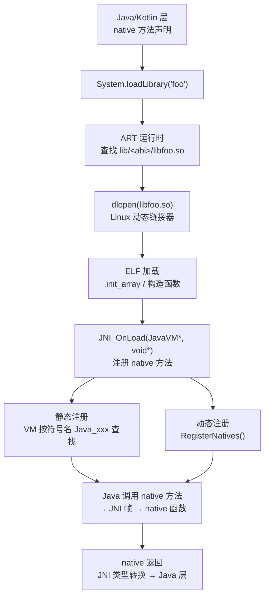

# Android逆向（07）· JNI与native层

> [!abstract] TL;DR
> - **JNI（Java Native Interface）** 是 Java/Kotlin 调用 C/C++ 代码的标准桥梁，Android 平台广泛使用它调用系统库、复用高性能 C 库，以及——**逆向的重点**——把核心算法、加固壳、反调试逻辑藏进 `.so` 里。
> - **加载链**：`System.loadLibrary("foo")` → ART 在 APK 的 `lib/<abi>/libfoo.so` 里找库 → `dlopen` 加载（触发 ELF 动态链接）→ 执行 `JNI_OnLoad`，完成 native 方法注册。
> - **两种注册**：① **静态注册**——编译器按 `Java_<包>_<类>_<方法>` 命名导出函数，VM 按符号名查找；② **动态注册**——`JNI_OnLoad` 中调 `RegisterNatives`，把任意内部函数绑到 Java native 方法，函数名无规律，是逆向的难点。
> - **逆向核心动作**：IDA/Ghidra 打开 `.so` → 定位 `JNI_OnLoad` → 解析 `RegisterNatives` 调用中的方法映射表 → 还原 Java-native 对应关系；Frida 直接 hook 导出符号或任意地址。

---

## 概述与定位

### JNI 是什么

JNI（Java Native Interface）是 JVM 规范定义的一套 C API，允许 Java（或 Kotlin）代码与本地 C/C++ 代码双向调用。Android 平台完整实现了 JNI 规范，ART 虚拟机通过它向 `.so` 共享库暴露 Java 对象、方法、字段，同时允许 `.so` 调回 Java 层。

从体系结构看，JNI 是 Android 运行时（见 [[05.ART运行时]]）与 Linux 用户空间 C/C++ 世界之间的**标准边界**：Java 层编译成 DEX 字节码（见 [[03.DEX文件格式]]），在 ART 解释或 AOT 编译下运行；native 层编译成共享对象 `.so`，本质上是 ELF 格式的动态库（见 [[11.ELF文件详解/00.ELF文件详解总览|ELF 文件详解]]），通过 Linux 动态链接器 `linker64`/`linker` 加载（见 [[14.动态链接与加载器详解/00.动态链接与加载器总览|动态链接与加载器]]）。

### 为什么要用 native

| 使用理由 | 说明 |
|---|---|
| **性能** | 图像/音视频/密码运算等计算密集场景，C/C++ 比解释执行的 DEX 快数倍 |
| **复用 C 库** | OpenSSL、SQLite、FFmpeg 等成熟 C 库，无需在 Java 层重写 |
| **核心算法保护** | Java 层反编译几乎无损（jadx 可还原到接近源码），而 `.so` 需要 IDA/Ghidra 逆向汇编，门槛高得多 |
| **加固壳与反调试** | 商业加固的脱壳引擎、`ptrace` 反调试、字符串加密等**都藏在 `.so` 里**——这是逆向的主战场 |
| **签名与完整性校验** | native 层做 APK 签名校验、包名/证书指纹比对，规避 Java 层简单 hook |

从逆向视角，理解 JNI 机制的核心价值在于：**知道 Java 层的 `native` 方法声明对应 `.so` 里哪个函数，才能有效分析和 hook**。

---

## 原理与机制

### JNI 全链路：从 Java 声明到 native 执行



### loadLibrary 与 dlopen

当 Java 层执行 `System.loadLibrary("foo")` 时，ART 按以下步骤定位共享库：

1. 按当前 ABI（`arm64-v8a`/`armeabi-v7a`/`x86_64` 等）在 APK 的 `lib/<abi>/` 目录下查找 `libfoo.so`（安装时已解压到 `/data/app/<pkg>/lib/<abi>/`）。
2. 若不在 APK 内，依次搜索 `/system/lib64`、`/vendor/lib64` 等系统路径。
3. 找到后调用 `dlopen(path, RTLD_NOW | RTLD_LOCAL)`，触发 Linux 动态链接器（`/system/bin/linker64`）加载 ELF 文件：解析 `PT_LOAD` 段映射内存、处理 `.rel.dyn`/`.rela.dyn` 重定位、处理 `.init_array`（C++ 全局构造函数）。
4. `dlopen` 返回后，ART 查找导出符号 `JNI_OnLoad`，若存在则立即调用。

`.so` 的加载原理与所有 ELF 动态库一致，详见 [[14.动态链接与加载器详解/00.动态链接与加载器总览|动态链接与加载器]]；导出符号表、`.init_array`、`.dynamic` 节的结构详见 [[11.ELF文件详解/00.ELF文件详解总览|ELF 文件详解]]。

### .init_array 先于 JNI_OnLoad

ELF 加载链中，`.init_array` 节存放一组函数指针，由动态链接器在 `dlopen` 完成段映射后、将控制权交给 `JNI_OnLoad` **之前**，按数组顺序逐个调用。多个函数指针则按下标从低到高依次执行。

```
dlopen → 映射 PT_LOAD 段 → 处理重定位 → 调用 .init_array[0] → ... → .init_array[N-1] → 调用 JNI_OnLoad
```

逆向意义：

- 加固 so 常把**字符串解密**、**反调试检测**放进 `.init_array` 函数，在 `JNI_OnLoad` 执行前就已激活。
- 若断点只打在 `JNI_OnLoad`，反调试已触发，调试器无法附上，造成"断点明明设了却没停"的困惑。
- 应当在 `dlopen` 返回前或对 `.init_array` 中每个函数地址分别设断，才能捕获最早的初始化逻辑。

```bash
# 用 readelf 查看 .init_array 的偏移与大小（在设备上 / 提取 so 后）
readelf -S libfoo.so | grep init_array
# 示例输出（示意）：[ N] .init_array INIT_ARRAY 0000000000012000 ... size 0x10
# 0x10 = 16 字节 / 8 字节每指针 = 2 个初始化函数

# IDA：在 Segments 窗口或 .init_array 节起始地址处逐项读取函数指针，对每个地址 F2 设断
```

| 关注点 | .init_array | JNI_OnLoad |
|---|---|---|
| 执行时机 | dlopen 内部，段映射后 | .init_array 全部执行完毕后 |
| 函数数量 | 可多个，按序 | 只有一个入口 |
| 典型用途 | C++ 全局构造函数；壳解密；反调试占坑 | JNI 方法动态注册；全局 JNI 引用初始化 |
| 逆向断点 | 需对数组每项逐一下断 | 导出符号，直接按名断 |

---

### JNI_OnLoad

`JNI_OnLoad` 是 native 库的**入口点**，原型：

```c
jint JNI_OnLoad(JavaVM *vm, void *reserved);
```

它在 `dlopen` 完成、`.init_array` 执行之后、任何 Java native 方法被调用之前执行。典型职责：

- 调用 `vm->GetEnv()` 拿到当前线程的 `JNIEnv*`。
- 调用 `RegisterNatives()` 完成动态注册（见下节）。
- 初始化全局变量、解密字符串、设置反调试钩子。
- 返回支持的 JNI 版本，必须 `>= JNI_VERSION_1_4`（Android 常用 `JNI_VERSION_1_6`）。

对于**逆向分析**，`JNI_OnLoad` 是 `.so` 分析的**必读函数**：动态注册的所有 native 方法映射都在这里建立，反调试手段也往往在此启动（详见 [[12.反调试与反Frida对抗]]）。

---

## 结构 / 格式 / 流程详解

### 两种 native 方法注册方式

#### 静态注册

依赖**命名约定**：native 函数名必须符合 `Java_<包名下划线>_<类名>_<方法名>` 的格式，包名中的 `.` 替换为 `_`，特殊字符加 `_0xxxx` 转义。

```
包名: com.example.app
类名: CryptoUtil
方法: decrypt(String) → String

导出符号: Java_com_example_app_CryptoUtil_decrypt
```

VM 在首次调用 native 方法时，从已加载的 `.so` 导出符号表中按名字查找该函数。静态注册不需要写 `RegisterNatives`，导出符号即映射。

**逆向便利性**：IDA/Ghidra 打开 `.so`，在 Export 表里直接看到 `Java_com_example_app_...` 形式的符号，包名、类名、方法名一目了然。

**逆向局限性**：若 `.so` 做了符号剥离（`strip`），即使保留了函数，Export 表中的符号名也会丢失，只剩 `sub_XXXXX` 形式的地址标签。此时需要靠函数签名（参数类型 `JNIEnv*`/`jobject`）、字符串交叉引用等手段定位。

#### 动态注册

在 `JNI_OnLoad` 中调用 `RegisterNatives()`，将**任意内部函数**绑定到指定 Java native 方法：

```c
// 原型
jint RegisterNatives(jclass clazz, const JNINativeMethod *methods, jint nMethods);

// JNINativeMethod 结构
typedef struct {
    const char *name;      // Java 方法名（字符串）
    const char *signature; // 方法类型签名（见下节）
    void       *fnPtr;     // 指向 native 函数的指针（可以是任意内部函数）
} JNINativeMethod;
```

典型 `JNI_OnLoad` 动态注册示例：

```c
static JNINativeMethod gMethods[] = {
    { "decrypt",  "(Ljava/lang/String;)[B",  (void*)nativeDecrypt  },
    { "checkSig", "()Z",                     (void*)nativeCheckSig },
};

jint JNI_OnLoad(JavaVM *vm, void *reserved) {
    JNIEnv *env;
    vm->GetEnv((void**)&env, JNI_VERSION_1_6);
    jclass clazz = env->FindClass("com/example/app/CryptoUtil");
    env->RegisterNatives(clazz, gMethods, 2);
    return JNI_VERSION_1_6;
}
```

**逆向难点**：`fnPtr` 可以是任意地址，即使未剥离符号，该函数也未必有规律的名称（可以是静态函数 `sub_XXXXX`）。分析者必须在 IDA/Ghidra 中找到 `RegisterNatives` 调用，读取传入的 `JNINativeMethod` 数组，才能还原"Java 方法名 → native 函数地址"的完整映射。

### JNI 类型签名

JNI 使用与 DEX 描述符相同的类型签名体系（详见 [[03.DEX文件格式]]）。理解签名是读懂 `RegisterNatives` 表的前提：

| 签名 | 对应 Java 类型 |
|---|---|
| `Z` | `boolean` |
| `B` | `byte` |
| `C` | `char` |
| `S` | `short` |
| `I` | `int` |
| `J` | `long` |
| `F` | `float` |
| `D` | `double` |
| `V` | `void` |
| `Ljava/lang/String;` | `String`（引用类型以 `L` 开头、`;` 结尾，`.` 改 `/`） |
| `[I` | `int[]`（数组在前加 `[`） |
| `[[B` | `byte[][]`（多维数组） |

方法签名格式：`(<参数签名列表>)<返回值签名>`

```
Java 方法：boolean decrypt(int key, String data)
JNI 签名：(ILjava/lang/String;)Z

Java 方法：byte[] encode(byte[] input)
JNI 签名：([B)[B
```

### JNIEnv 与核心 API

`JNIEnv*` 是每个 native 函数的**第一个参数**（非静态方法第二个参数是 `jobject this`，静态方法第二个参数是 `jclass`），是所有 JNI 操作的入口：

```c
// native 非静态方法原型
ReturnType Java_xxx(JNIEnv *env, jobject thiz, ...);

// native 静态方法原型
ReturnType Java_xxx(JNIEnv *env, jclass clazz, ...);
```

常用 `JNIEnv` API：

| API | 说明 |
|---|---|
| `env->FindClass("com/example/Foo")` | 查找 Java 类，返回 `jclass` |
| `env->GetMethodID(clazz, "method", "(I)V")` | 获取实例方法 ID，返回 `jmethodID` |
| `env->GetStaticMethodID(clazz, "method", "()Z")` | 获取静态方法 ID |
| `env->CallIntMethod(obj, mid, ...)` | 调用实例方法（各类型有对应变体） |
| `env->CallStaticBooleanMethod(clazz, mid, ...)` | 调用静态方法 |
| `env->GetFieldID(clazz, "field", "I")` | 获取字段 ID，返回 `jfieldID` |
| `env->GetIntField(obj, fid)` | 读取整型字段值 |
| `env->SetIntField(obj, fid, val)` | 写入整型字段值 |
| `env->GetStringUTFChars(jstr, &isCopy)` | 获取 Java String 的 UTF-8 C 字符串 |
| `env->ReleaseStringUTFChars(jstr, cstr)` | 释放 `GetStringUTFChars` 分配的内存 |
| `env->NewStringUTF(cstr)` | 从 C 字符串创建 Java String |
| `env->NewByteArray(len)` | 创建 `byte[]` |
| `env->SetByteArrayRegion(arr, 0, len, buf)` | 向 `byte[]` 写入数据 |
| `env->ExceptionCheck()` | 检查 Java 是否有待处理异常 |
| `env->ThrowNew(clazz, msg)` | 向 Java 层抛出异常 |

核心引用类型：

| 类型 | 含义 |
|---|---|
| `jobject` | 任意 Java 对象引用 |
| `jclass` | `java.lang.Class` 引用 |
| `jstring` | `java.lang.String` 引用 |
| `jarray` / `jbyteArray` / `jintArray` … | 数组引用 |
| `jmethodID` | 方法标识，由 `GetMethodID` 返回 |
| `jfieldID` | 字段标识，由 `GetFieldID` 返回 |
| `JavaVM` | JVM 实例，全局唯一，可跨线程使用 |

### JNI 调用 Java 层的逆向意义

native 函数内大量调用 `FindClass`/`GetMethodID`/`Call*Method`，说明该函数在主动**回调 Java 层逻辑**（典型：native 加固壳在校验通过后动态加载 DEX、调 `ClassLoader`；签名校验 native 拿到包名后调 `PackageManager` API）。在 IDA 反汇编里看到 `FindClass`/`CallStaticMethod` 的字符串参数，能快速推断 native 代码在做什么。

---

## 工具实践：逆向 native 层

### 静态分析：IDA / Ghidra 打开 .so

APK 解压后，`lib/<abi>/libfoo.so` 即标准 ELF 共享对象，可直接用 IDA Pro 或 Ghidra 打开：

```bash
# 解压 APK 提取 .so
unzip app.apk lib/arm64-v8a/libfoo.so -d ./output
```

分析流程：

1. **查 Export 表**：找 `Java_` 前缀符号（静态注册）和 `JNI_OnLoad`。
2. **进 `JNI_OnLoad`**：找 `RegisterNatives` 调用，读取第二个参数（`JNINativeMethod*` 数组地址）。
3. **解析方法映射表**：数组每项三个指针——字符串名称、类型签名、函数指针。函数指针落在 `.text` 段的具体地址，即对应 native 函数的入口。
4. **分析目标函数**：识别 `JNIEnv*`（`x0`/`r0` 寄存器）和 `jobject`（`x1`/`r1` 寄存器）参数，追踪逻辑。

> [!warning] 示例输出为示意
> IDA 中 `RegisterNatives` 调用的 XREF 定位方式随 IDA 版本和 `.so` 混淆程度而异，下面为代表性示意。

```python
# IDA Python：遍历 .rodata 中的 JNINativeMethod 数组（示意）
import idc, idaapi

def find_native_methods(arr_addr, count):
    for i in range(count):
        base = arr_addr + i * 3 * 8   # 64位，每项3个指针=24字节
        name    = idc.get_strlit_contents(idc.get_qword(base + 0))
        sig     = idc.get_strlit_contents(idc.get_qword(base + 8))
        fn_ptr  = idc.get_qword(base + 16)
        print(f"  {name} {sig} → 0x{fn_ptr:x}")
```

### 识别关键 native 函数模式

反汇编 ARM64 native 函数时，以下特征有助于快速判断其作用：

| 特征 | 含义 |
|---|---|
| 首参 `x0` 存入局部、调用 `[x0, #偏移]` 处的函数指针 | `JNIEnv->VTable` 调用，是 JNI API 调用 |
| 调用前 `x2` 指向常量字符串如 `"com/example/Foo"` | `FindClass` 调用 |
| 连续 `FindClass` + `GetMethodID` + `CallStatic*Method` | 回调 Java 逻辑，常见于加固壳 |
| 调用 `open("/proc/self/status")` 或 `ptrace(PTRACE_TRACEME,...)` | 反调试检测（详见 [[12.反调试与反Frida对抗]]） |
| 大量位运算 + 固定长度循环 + 常量表 | 加解密逻辑（AES/RC4/自定义）|

### Frida Hook native 层

Frida 既能 hook Java 层方法，也能直接 hook `.so` 中的 native 函数（详见 [[09.Frida动态插桩]]）：

```javascript
// Hook 静态注册的导出函数（已知符号名）
Interceptor.attach(
    Module.findExportByName("libfoo.so", "Java_com_example_app_CryptoUtil_decrypt"),
    {
        onEnter(args) {
            // args[0] = JNIEnv*, args[1] = jobject/jclass
            // args[2+] = Java 参数（对应 JNI 签名）
            console.log("decrypt called, arg2 =", args[2]);
        },
        onLeave(retval) {
            console.log("decrypt returns", retval);
        }
    }
);

// Hook 动态注册函数（按地址，需先解析 RegisterNatives 表）
var base = Module.findBaseAddress("libfoo.so");
Interceptor.attach(base.add(0x3C10), {   // 0x3C10 为示意偏移
    onEnter(args) {
        console.log("nativeDecrypt at", this.context.pc);
    }
});

// 拦截 RegisterNatives，自动打印所有动态注册映射
var RegisterNatives = Module.findExportByName(null, "RegisterNatives");
if (!RegisterNatives) {
    // Android linker 将 JNI 函数内联，需找 JNIEnv VTable 偏移
    var envPtr = Java.vm.getEnv().handle.readPointer();
    RegisterNatives = envPtr.readPointer().add(215 * Process.pointerSize).readPointer();
}
Interceptor.attach(RegisterNatives, {
    onEnter(args) {
        var clazz = args[1];
        var methods = args[2];
        var count = args[3].toInt32();
        for (var i = 0; i < count; i++) {
            var name    = methods.add(i * 3 * 8 + 0).readPointer().readCString();
            var sig     = methods.add(i * 3 * 8 + 8).readPointer().readCString();
            var fnPtr   = methods.add(i * 3 * 8 + 16).readPointer();
            console.log("RegisterNatives:", name, sig, "→", fnPtr);
        }
    }
});
```

> [!warning] 示例输出为示意
> 上述脚本中的 VTable 偏移（`215`）、结构体布局随 Android 版本和 ABI 可能有差异，实际使用时以当前设备 ART 版本为准。

---

## 常见 native 用途（逆向视角）

### 加解密与密钥保护

最常见的 native 使用场景：Java 层传入密文/密钥参数，native 层实现 AES、SM4、RC4 或自定义算法，返回明文。将算法置于 native 层的目的是提高 Java 层 hook（如 `Cipher.doFinal`）的绕过难度。

逆向思路：在 IDA 中搜索 S-box 常量（AES 的 `0x63636363` 等特征）、寻找密钥扩展模式、或直接用 Frida 在函数入口/出口打印参数和返回值。

### APK 签名校验与完整性检查

native 层读取 `/proc/self/maps`、`/data/app/<pkg>/base.apk`，自行解析 ZIP 中 `META-INF/` 目录，计算证书指纹与编译期内嵌的哈希比对。绑定包名、`applicationId`、设备指纹等。

逆向思路：在 IDA 搜索字符串 `META-INF`、`PackageManager`、`signatures`，或 Frida hook `open`/`read` 系统调用观察文件访问路径（详见 [[14.APK签名机制v1到v4]]）。

### 反调试

`JNI_OnLoad` 或单独的 native 函数中启动监控线程，轮询 `/proc/self/status` 中的 `TracerPid` 字段、调用 `ptrace(PTRACE_TRACEME, 0, 0, 0)` 抢占调试权、检测 `/proc/self/maps` 中 Frida 相关内存映射特征（详见 [[12.反调试与反Frida对抗]]）。

### 字符串解密

`.so` 中的敏感字符串（URL、密钥、协议字段）以加密形式存储在 `.rodata` 或 `.data`，native 函数在运行时解密后返回给 Java 层或自用。IDA 静态分析时看到的是密文字节，需运行时拦截解密函数出口才能获取明文。

---

## 安全性与正确使用

### JNI 引用生命周期

JNI 定义三种引用类型，管理 Java 对象在 GC 下的可达性与生存周期：

| 引用类型 | 创建方式 | 作用域 | GC 行为 | 典型用途 |
|---|---|---|---|---|
| **Local**（局部引用） | JNI 函数返回值（`FindClass`、`NewObject` 等）；`NewLocalRef` | 当前 JNI 帧（函数调用期间）；帧弹出自动释放 | GC 可追踪，持有期间不回收 | 函数内临时对象 |
| **Global**（全局引用） | `NewGlobalRef(localRef)` | 显式 `DeleteGlobalRef` 前永久有效 | 持有期间阻止 GC 回收 | 跨函数/跨线程共享 `jclass`、`jmethodID` 对应的 `jclass` |
| **WeakGlobal**（弱全局引用） | `NewWeakGlobalRef(localRef)` | 显式 `DeleteWeakGlobalRef` 前有效 | GC 可回收对象，引用被置 NULL；用前需 `NewLocalRef` 检验 | 缓存可选对象，不阻止 GC |

**`PushLocalFrame` / `PopLocalFrame`**——批量管理局部引用的窗口：

```c
// 创建一个可容纳 16 个局部引用的新帧
if (env->PushLocalFrame(16) < 0) return;  // OOM 则返回负值

jstring s = env->NewStringUTF("hello");   // 在新帧内分配
jbyteArray arr = env->NewByteArray(32);  // 同一帧

// ... 使用 s / arr ...

// 弹出帧，释放帧内所有局部引用；若要保留一个到外层，传给 PopLocalFrame 第二参数
jstring result = (jstring)env->PopLocalFrame(s);  // s 提升到外层帧
// arr 已自动销毁
```

**局部引用表溢出（`local reference table overflow`）**：

ART 默认每个 JNI 帧最多 512 个局部引用（Android 8+ 略有调整）。在循环中大量创建局部引用而不及时 `DeleteLocalRef` 会触发：

```
JNI ERROR: local reference table overflow (max=512)
```

典型场景：遍历大数组、循环调用返回对象的 JNI API。

```c
// 正确做法：循环内显式释放
for (int i = 0; i < count; i++) {
    jstring item = env->GetObjectArrayElement(arr, i);
    process(item);
    env->DeleteLocalRef(item);  // 立即释放，避免引用表溢出
}
```

逆向视角：看到 `.so` 崩溃日志含 `local reference table overflow` → 目标函数有大量 JNI 对象操作，是分析其 Java 层回调逻辑的切入点。

---

### Android 版本对 JNI 的限制

Android 各大版本对 native 层访问私有 API 及 so 加载路径施加了逐步收紧的限制：

| Android 版本 | 限制要点 | 逆向影响 |
|---|---|---|
| **7.0（N）** | 禁止 non-SDK library 私有符号访问（`dlopen` 系统库内未导出符号报 WARNING/ERROR） | 依赖私有 API 的旧壳在 7.0+ 崩溃；逆向时看到 `dlopen`/`dlsym` 失败日志需识别目标 |
| **8.0（O）** | 引入 `android_dlopen_ext` 支持 linker namespace 感知加载；`InMemoryDexClassLoader`（API 27）首次提供内存加载 DEX 的官方 API | 壳可用 `InMemoryDexClassLoader` 替代文件路径加载，脱壳需同时 hook 此入口 |
| **9.0（P）** | **linker namespace 隔离**正式收紧：App 进程只能 `dlopen` 其 namespace 白名单内的 so；系统私有 so（`/system/lib64/` 非公开库）对 App 透明 | 壳注入系统 so 符号的技巧失效；App so 路径穿越 namespace 需 `android_dlopen_ext` + `ANDROID_DLEXT_USE_NAMESPACE` |
| **11.0（R）** | non-SDK 黑名单进一步扩大；`/proc/self/maps` 读取受到部分限制 | 检测 Frida 用 `/proc/maps` 的方式在某些配置下返回受限内容 |
| **14.0（U）** | `run-as` 沙箱收紧（仅 `debuggable` 应用可 `run-as`）；`ptrace` 限制增强（见 [[10.动态调试]]）| 非 debuggable 包无法通过 `run-as` 访问数据目录；attach 调试需 root |

**linker namespace 隔离（9.0+）核心规则**：

```
[App linker namespace]
  accessible: /data/app/<pkg>/lib/  + /apex/...public libs...
  NOT accessible: /system/lib64/libsqlite.so (private)
               /system/lib64/libbinder.so

→ App so 直接 dlopen("/system/lib64/libsqlite.so") → 失败（不在 App namespace）
→ 需用 android_dlopen_ext 指定系统 namespace 才可加载
```

---

### native 反调试案例

以一个常见的 native 反调试函数为例，分析其汇编特征与 Frida 绕过方法。

**目标函数功能**：轮询 `/proc/self/status` 的 `TracerPid` 字段，非零则退出进程（ARM64）。

**IDA 反汇编（示意，代表性结构）**：

```c
// Hex-Rays 反编译示意（伪码）
void *anti_debug_thread(void *arg) {
    char buf[256];
    while (1) {
        FILE *fp = fopen("/proc/self/status", "r");
        if (fp) {
            while (fgets(buf, 256, fp)) {
                if (strncmp(buf, "TracerPid:", 10) == 0) {
                    int pid = atoi(buf + 10);
                    if (pid != 0) {
                        kill(getpid(), SIGKILL);  // 自杀
                    }
                }
            }
            fclose(fp);
        }
        usleep(500000);  // 500ms 轮询
    }
    return NULL;
}
```

对应 ARM64 汇编关键特征：

```asm
; 打开 /proc/self/status
ADRP    X0, #aProc_self_sta@PAGE   ; "/proc/self/status"
ADD     X0, X0, #aProc_self_sta@PAGEOFF
ADRP    X1, #aR@PAGE               ; "r"
ADD     X1, X1, #aR@PAGEOFF
BL      fopen

; 比较 "TracerPid:"
ADRP    X1, #aTracerpid@PAGE       ; "TracerPid:"
ADD     X1, X1, #aTracerpid@PAGEOFF
MOV     X2, #0xA                   ; 比较长度 10
BL      strncmp
CBNZ    W0, loop_next              ; 不匹配则继续读

; atoi 后比较非零
BL      atoi
CBZ     W0, loop_next              ; TracerPid == 0 则继续
BL      getpid
MOV     W1, #9                     ; SIGKILL
BL      kill
```

**Frida 绕过方案一：hook `fgets` 篡改返回内容**：

```javascript
// hook fgets，过滤 TracerPid 行返回 "TracerPid:\t0\n"
var fgetsPtr = Module.findExportByName(null, "fgets");
Interceptor.attach(fgetsPtr, {
    onLeave: function(retval) {
        if (retval.isNull()) return;
        var line = retval.readCString();
        if (line && line.indexOf("TracerPid:") === 0) {
            // 覆写为 TracerPid: 0
            retval.writeUtf8String("TracerPid:\t0\n");
        }
    }
});
```

**Frida 绕过方案二：hook `pthread_create`，阻止反调试线程启动**：

```javascript
// 在 JNI_OnLoad 前 hook pthread_create，过滤启动反调试函数的线程
var pthread_create = Module.findExportByName("libc.so", "pthread_create");
Interceptor.attach(pthread_create, {
    onEnter: function(args) {
        // args[2] = 线程函数指针
        var threadFunc = args[2];
        // 若 threadFunc 地址在目标 so 范围内且匹配已知偏移，则 NOP
        var libBase = Module.findBaseAddress("libfoo.so");
        if (libBase && threadFunc.compare(libBase) >= 0 &&
            threadFunc.compare(libBase.add(0x100000)) < 0) {
            // 替换为空函数
            args[2] = new NativeCallback(function() {
                return ptr(0);
            }, "pointer", ["pointer"]);
            console.log("[*] pthread_create blocked for anti-debug thread @ " + threadFunc);
        }
    }
});
```

**Frida 绕过方案三：hook `kill`/`raise`，拦截自杀信号**：

```javascript
var killPtr = Module.findExportByName("libc.so", "kill");
Interceptor.attach(killPtr, {
    onEnter: function(args) {
        var sig = args[1].toInt32();
        if (sig === 9 /* SIGKILL */ || sig === 6 /* SIGABRT */) {
            console.log("[*] kill(" + args[0].toInt32() + ", " + sig + ") blocked");
            args[1] = ptr(0);  // 改为 signal 0（只检查进程存在，不发信号）
        }
    }
});
```

| 防护手段 | 效果 | 逆向应对 |
|---|---|---|
| `strip` 剥离符号表 | 导出函数名丢失，静态注册函数变 `sub_XXXXX` | 按函数签名（首参 `JNIEnv*`）和字符串 XREF 定位 |
| `JNI_OnLoad` + 动态注册 | Java-native 映射无法从符号名推断 | Frida 拦截 `RegisterNatives`，运行时打印映射 |
| 字符串加密 | `.rodata` 中无明文敏感信息 | Frida hook 解密函数出口；内存 dump 解密后数据 |
| `.init_array` 前置逻辑 | 在 `JNI_OnLoad` 之前执行反调试/解密 | 关注 `.init_array` 函数；调试器在 `dlopen` 返回前断 |
| OLLVM / 控制流混淆 | 反编译图难以阅读 | 结合动态执行追踪（Frida `Stalker`）去混淆 |

### native 反调试的逆向对抗

native 层反调试的典型检测点（详见 [[12.反调试与反Frida对抗]]）：

- 读 `/proc/self/status` 的 `TracerPid`：非 0 则认为被调试。
- `ptrace(PTRACE_TRACEME, 0, 0, 0)` 返回 `-1`：说明已有调试器附加。
- 检测 `/proc/<pid>/maps` 中是否有 `frida-agent` 相关内存段。
- 检测 `/proc/<pid>/fd/` 中是否有 `/dev/ashmem/frida-...` 文件描述符。

Frida hook 系统调用（`open`/`read`/`ptrace`）或修改 `/proc/self/status` 返回值可绕过大部分基于 `procfs` 的检测；ptrace 抢占型反调试需在 `JNI_OnLoad` 执行之前（`dlopen` 返回前）介入。

### 合规分析与边界

分析 native 层代码的正当场景：自有 App 安全评估、恶意样本分析、漏洞研究。在上述场景中，理解 JNI 机制、逆向 `.so` 内加密逻辑和反调试手段是核心技能。

合规边界：逆向分析应仅针对自有 App 或合法授权的样本；使用本篇技术分析他人 App 时须遵守相关法律法规及服务条款，不得用于未经授权的数据提取或绕过访问控制。

### 正确使用 JNI 的实践建议

- native 函数中**必须**检查 `JNIEnv->ExceptionCheck()` 并及时清理异常，否则后续 JNI 调用行为未定义。
- 通过 `GetStringUTFChars` 获得的 C 字符串必须调用 `ReleaseStringUTFChars` 释放，否则内存泄漏；`FindClass` / `GetMethodID` 的 `jclass` 若需跨函数保存，需转为 `NewGlobalRef`。
- `JNIEnv*` 是**线程局部**的，不能跨线程传递；需要在非 JNI 线程调用 Java 时，须先 `JavaVM->AttachCurrentThread` 获取该线程的 `JNIEnv*`。
- 生产代码应开启 `-fsanitize=address`（ASan）检测 native 内存错误，配合 `Full RELRO` 和 `PIE` 加固 `.so`（与 [[14.动态链接与加载器详解/00.动态链接与加载器总览|动态链接加固]] 一致）。

---

## 小结

1. **JNI = Java ↔ C/C++ 桥**：ART 通过 `JNIEnv*` 暴露 Java 对象操作 API，native 函数以 `JNIEnv*` / `jobject` 为首参，类型签名与 DEX 描述符同源。
2. **加载链**：`System.loadLibrary` → `dlopen`（ELF 动态链接）→ `JNI_OnLoad`（注册方法）→ 方法映射建立。`.so` 即 ELF，加载原理完全遵循动态链接器规范。
3. **静态注册**靠符号名约定，IDA 里直接可读；**动态注册**靠 `RegisterNatives` 表，Frida 拦截或 IDA 追踪 `JNI_OnLoad` 还原映射——后者是逆向难点。
4. **逆向 native 的核心动作**：静态用 IDA/Ghidra 分析 ELF 结构、追踪 `RegisterNatives`、识别 JNIEnv VTable 调用；动态用 Frida hook 导出函数/任意地址、自动打印方法映射。
5. **常见 native 用途**：加解密、签名校验、反调试、字符串混淆——这四类是 Android 安全分析的高频目标。

---

## 相关阅读

- **本系列**：[[03.DEX文件格式]]（类型签名与 DEX 描述符同源）、[[05.ART运行时]]（ART 如何调度 native 帧）、[[06.应用启动与Zygote]]（App 进程如何初始化 JNI 环境）、[[09.Frida动态插桩]]（hook native 导出与任意地址）、[[10.动态调试]]（IDA/lldb 调试 .so）、[[11.加固与脱壳]]（native 壳加载 DEX 的完整链路）、[[12.反调试与反Frida对抗]]（native 层反调试机制详解）
- **ELF 基础**：[[11.ELF文件详解/00.ELF文件详解总览|ELF 文件详解]]（.so 即 ELF：导出符号表、.init_array、动态链接）
- **动态链接**：[[14.动态链接与加载器详解/00.动态链接与加载器总览|动态链接与加载器]]（dlopen / linker / PLT-GOT 延迟绑定）
- **静态分析工具**：[[08.静态分析工具]]（IDA/Ghidra 打开 .so 的完整流程）

---

⬅️ 上一篇 [[06.应用启动与Zygote]] ｜ 🏠 [[00.Android逆向与运行时总览]] ｜ 下一篇 [[08.静态分析工具]] ➡️
