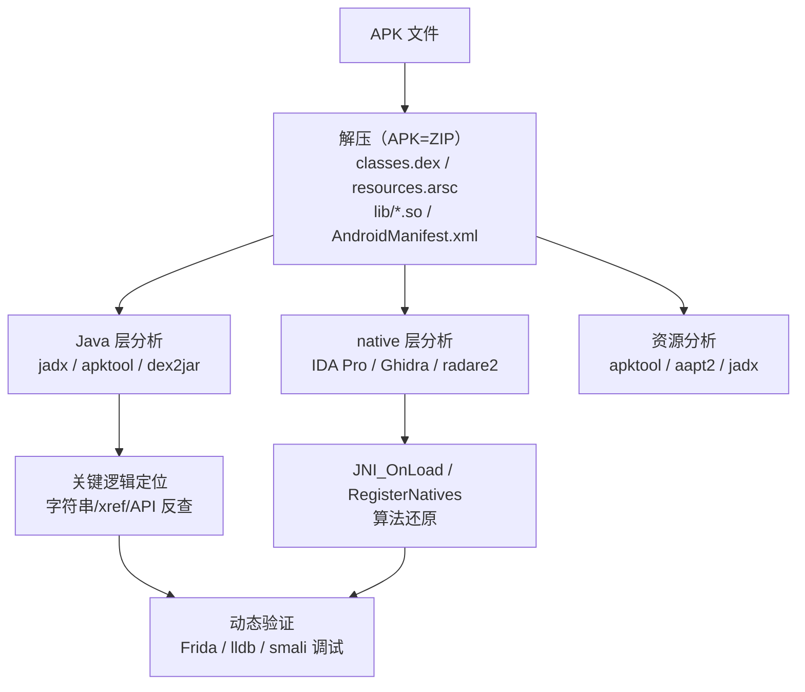
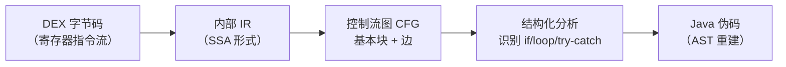
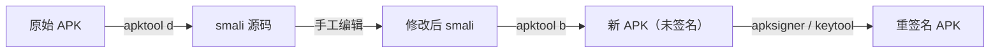
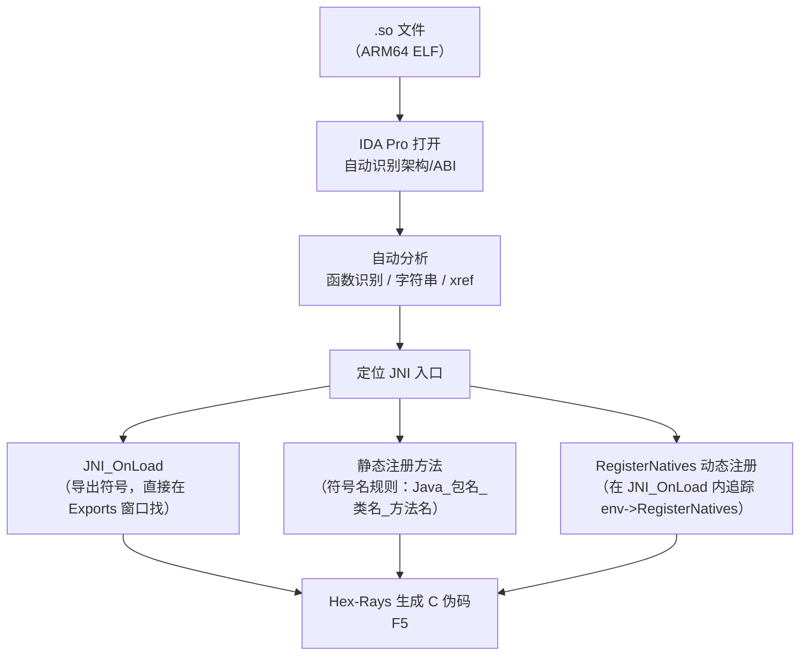
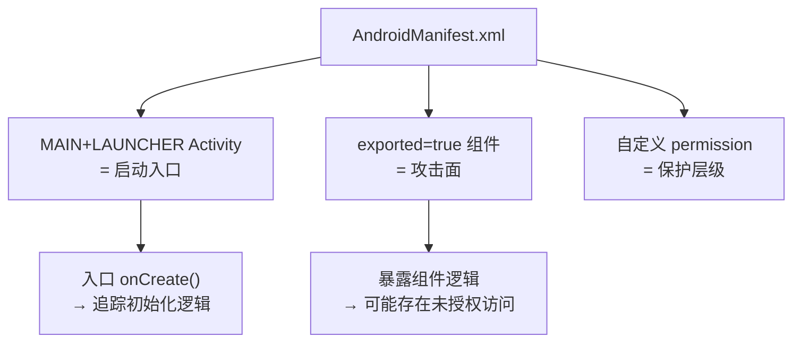
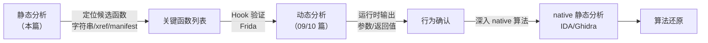

# Android逆向（08）· 静态分析工具

> [!abstract] TL;DR
> - **静态分析**：不运行目标程序，直接对 APK 内的 DEX 字节码、资源、native `.so` 进行反编译与审计。
> - **Java 层主力**：jadx/JADX-GUI（DEX→Java 伪码，含搜索/xref/重命名/`--deobf`）；apktool（smali 双向重打包 + 资源还原）；dex2jar + JD-GUI（旧路线，DEX→jar→Java）。
> - **native 层主力**：IDA Pro / Ghidra / radare2——分析 `.so`（ELF），定位 `JNI_OnLoad`、还原 `RegisterNatives` 映射。
> - **反编译不是魔法**：混淆/VMP/控制流平坦化 会让伪码质量大幅下滑；静态分析应与动态插桩（[[09.Frida动态插桩]]）组合使用。
> - **合规边界**：只分析自有 App、已授权样本、CTF 题目或公开开源组件；逆向他人商业 App 需获得明确授权。

---

## 概述与定位

### 静态分析在逆向流程中的位置

一次完整的 Android 逆向通常分两阶段：**静态分析**（本篇）先摸清代码结构、找到关键点；**动态分析**（[[09.Frida动态插桩]]、[[10.动态调试]]）在运行时验证推断、绕过保护。静态分析的优点是不需要真机/模拟器、不触发反调试，但面对重度混淆和加固时能看到的"真相"有限。



### 工具全景对比

| 工具 | 输入 | 输出 | Java 层 | native 层 | 资源 | 典型场景 |
|---|---|---|---|---|---|---|
| **jadx / JADX-GUI** | APK / DEX / AAR | Java 伪码 | ✅ 最佳 | ❌ | ✅ 部分 | 快速审计 Java 逻辑、xref 追踪 |
| **apktool** | APK | smali + 资源 | ✅（smali） | ❌ | ✅ 最佳 | 重打包修改、AXML 还原 |
| **baksmali / smali** | DEX / odex | smali / DEX | ✅（smali） | ❌ | ❌ | 精确字节码控制、补丁 |
| **dex2jar** | DEX | JAR | ✅（Java） | ❌ | ❌ | 旧路线，配 JD-GUI/BCV |
| **enjarify** | DEX | JAR | ✅（更稳健） | ❌ | ❌ | dex2jar 失败时的备选 |
| **IDA Pro** | .so / 任意二进制 | 伪码 / 汇编 | ❌ | ✅ 最佳 | ❌ | ARM 算法还原、漏洞分析 |
| **Ghidra** | .so / 任意二进制 | 伪码 / 汇编 | ❌ | ✅ | ❌ | 开源免费替代 IDA |
| **radare2** | .so / 任意二进制 | 汇编 / 脚本 | ❌ | ✅ | ❌ | 脚本化批量分析 |

---

## 原理与机制

### 反编译原理：DEX → Java 伪码的内部流程

DEX 字节码是寄存器型的（见 [[04.Dalvik字节码与smali]]），不能直接 1:1 映射回 Java 源码。反编译器需要经历多个阶段的分析与重建：



| 阶段 | 做什么 | 失败时的现象 |
|---|---|---|
| 字节码解析 | 读 DEX 头部/字符串/类型/方法表（见 [[03.DEX文件格式]]） | 非法字节码→工具崩溃/跳过方法 |
| SSA 构建 | 寄存器 → 静态单赋值变量 | 寄存器混用或异常跳转→变量错乱 |
| 控制流恢复 | switch/异常表/goto 还原为 if/while | 控制流平坦化（CFF）→伪码只剩 `switch` 循环 |
| 类型推断 | 从签名/用法推断变量类型 | 泛型擦除+混淆→出现 `Object` 类型 |
| 反混淆 | 标识符重命名、字符串解密（可选） | ProGuard 后剩 `a.b.c()`，`--deobf` 自动重命名 |

**为何有时失败**：混淆工具（ProGuard/R8）会在 DEX 里插入合法但语义诡异的字节码（如非法 goto、手工构造 try-catch 表），或通过字符串加密使关键常量在静态层不可见，甚至故意制造让反编译器内部 IR 构建失败的 edge case，导致整个方法输出 `/* stub */` 或抛出异常。

---

## Java 层工具详解

### jadx / JADX-GUI

jadx 是目前质量最高的开源 DEX→Java 反编译器，也是 Android 逆向分析的首选入口。

**核心功能**：

- 直接输入 APK / DEX / AAR，无需手动解压
- 反编译质量优于 dex2jar 路线，能处理 Lambda/Kotlin/协程
- 内置 AXML 还原（`AndroidManifest.xml`、`res/` 布局文件）
- 完整的符号搜索、交叉引用（xref）、重命名（持久化到 `.jadx/` 目录）
- `--deobf` 自动生成有意义的类名/方法名（基于签名推断，不能替代真实混淆还原，但大幅提高可读性）
- 支持导出 Gradle 工程，可在 Android Studio 中二次浏览

**命令行常用操作**：

```bash
# 反编译 APK 到目录
jadx -d output/ target.apk

# 启动 GUI
jadx-gui target.apk

# 反编译 + 自动去混淆命名
jadx --deobf -d output/ target.apk

# 只导出为可构建的 Gradle 工程
jadx --export-gradle -d output/ target.apk

# 多线程加速（线程数建议 = CPU 核数）
jadx -j 8 -d output/ target.apk
```

> [!warning] 示例输出为示意

```
INFO  - loading ...
INFO  - processing ...
INFO  - done
```

**JADX-GUI 的关键操作**：

| 功能 | 快捷键 / 菜单 | 说明 |
|---|---|---|
| 全局文本搜索 | `Ctrl+Shift+F` | 搜字符串字面量、方法名 |
| 查找用法（xref） | 在符号上右键 → `Find Usage` | 追踪某方法被哪些调用者调用 |
| 跳转到声明 | `Ctrl+Click` / `F4` | 追溯类/方法定义 |
| 重命名符号 | `N` 键 | 持久化到项目配置 |
| 导航历史 | `Alt+Left/Right` | 来回跳转 |
| 反汇编查看 | `Smali` 标签页 | 对比 smali 字节码与 Java 伪码 |

**`--deobf` 的工作原理**：
jadx 对混淆类/方法/字段，按其签名特征自动生成可读名称。例如：
- 只有一个 `int` 字段的类 → `C0001` → `IntHolder`
- 返回 `String` 的无参方法 → `m0042()` → `getString_0042()`

这不是真正的反混淆（不能还原 ProGuard 映射），但让代码可阅读性大幅提升。

---

### multidex 跨 dex 定位

Android 5.0 之前方法数超过 65536（`dex method reference limit`）的 App 通过 **multidex** 拆分为 `classes.dex`、`classes2.dex`、`classes3.dex` 等多个 DEX 文件。jadx 在加载 APK 时会自动合并所有 DEX，但以下场景容易踩坑：

**类在 jadx 里"找不到"的常见原因**：

| 现象 | 原因 | 解决 |
|---|---|---|
| jadx 搜索某类名无结果 | 类定义在 classes2/3.dex，jadx 未加载 | 直接把 APK（含全部 dex）拖入 jadx 而非单个 dex 文件 |
| 编译报错"cannot resolve symbol" | 跨 dex 引用，jadx 解析顺序问题 | 用 `jadx -d out/ target.apk`（不要只传 classes.dex） |
| 反编译结果方法体为 stub | 二代壳抽取，不是 multidex 问题 | 见 [[11.加固与脱壳]] |

**手动定位类所在 DEX**：

```bash
# 解压 APK 获取所有 dex
unzip target.apk 'classes*.dex' -d dex_out/

# 用 dexdump 在每个 dex 中搜索类名
for f in dex_out/classes*.dex; do
    if dexdump "$f" 2>/dev/null | grep -q "com/example/SecretClass"; then
        echo "Found in $f"
    fi
done

# 或用 baksmali 批量反汇编，grep 定位
baksmali disassemble dex_out/classes2.dex -o smali2/
grep -r "SecretClass" smali2/
```

**跨 dex 方法调用**：DEX 方法引用超出 64K 的原因正是跨 dex 调用——一个 dex 中的类可以引用其他 dex 的类，但在同一 dex 内的方法引用表（`method_id_item`）里只能记录本 dex 已知的引用，跨 dex 类在运行时由 `BaseDexClassLoader` 的 `DexPathList` 顺序搜索加载（见 [[06.应用启动与Zygote]]）。

---

### Kotlin 协程反编译难点

Kotlin 协程编译为 JVM/DEX 字节码时，`suspend` 函数被转换为**状态机**，jadx 反编译结果与原始 Kotlin 代码差异极大。

**编译器变换原理**：

```kotlin
// 原始 Kotlin suspend 函数
suspend fun fetchData(url: String): String {
    val result = delay(1000)    // 挂起点 1
    return httpGet(url)         // 挂起点 2
}
```

编译后变成一个实现 `Continuation<T>` 接口的**内部类**，通过 `label` 状态变量控制每次 `invokeSuspend` 的执行分支：

```java
// jadx 反编译结果（示意）
// 原函数签名变为：
Object fetchData(String url, Continuation<? super String> $completion)

// 状态机内部类（编译器生成，名称形如 FetchDataKt$fetchData$1）
final class FetchDataKt$fetchData$1 extends SuspendLambda {
    int label;     // 状态变量，控制当前执行到哪个挂起点
    String url;    // 捕获的参数

    @Override
    public Object invokeSuspend(Object $result) {
        switch (this.label) {
            case 0:
                this.label = 1;
                if (DelayKt.delay(1000L, this) == COROUTINE_SUSPENDED) {
                    return COROUTINE_SUSPENDED;   // 挂起，等待恢复
                }
                // fall through
            case 1:
                this.label = 2;
                return HttpKt.httpGet(this.url, this);
            // ...
        }
    }
}
```

**反编译难点汇总**：

| 难点 | 原因 | 应对 |
|---|---|---|
| 函数多出 `Continuation` 参数 | 每个 `suspend` 函数签名末尾插入 `Continuation` | 识别模式，忽略末尾 `$completion` |
| `invokeSuspend` 大 switch 难读 | 状态机将逻辑拆成分支，控制流不连续 | 按 `label` 值顺序手动还原执行路径 |
| 内联函数（`inline`）展开 | 编译器把 inline 函数体直接嵌入调用处，中间层消失 | 找调用处逐一分析，无法追踪"函数定义" |
| Lambda 变为匿名类 | Kotlin lambda 编译为继承 `Function*` 的匿名类 | 在 jadx 中按生成类名（`$lambda-0` 等）追踪 |
| `@JvmStatic` / `companion object` | 伴生对象生成静态内部类 `Companion`，方法前缀改变 | 搜索 `Companion` 内部类 |

**逆向技巧**：

```
1. 在 jadx 找到 suspend 函数对应的状态机类（类名通常含 $1/$2 后缀，父类为 SuspendLambda/ContinuationImpl）
2. 阅读 invokeSuspend 的 switch，按 label 值顺序还原正常执行路径
3. 对挂起点（返回 COROUTINE_SUSPENDED 处）打 Frida hook，截获恢复时的参数
```

---

### JADX `--deobf` 局限与 jadx 插件

**`--deobf` 的核心局限**：

| 局限 | 说明 |
|---|---|
| 不能跨调用链传播重命名 | `--deobf` 对每个类/方法独立生成名称，若 `a.b()` 被 `c.d()` 调用，两个名称独立生成，调用关系不变但可读性不一定提升 |
| 同名碰撞 | 多个不同类的同名单字母方法都生成相似名称，可能产生歧义（如两个类各有一个 `get_0042()`） |
| 无法还原语义 | 名称基于结构特征推断（返回类型、字段数量），不含业务语义——`IntHolder` 不能告诉你它是"用户 ID"还是"重试计数" |
| 混淆映射不可用 | 无法读取外部 ProGuard `mapping.txt`；需要 `retrace` 工具另行处理 |

**jadx-cli 插件机制（`--plugins`）**：

jadx 1.4+ 支持通过 `--plugins` 参数或 `~/.jadx/plugins/` 目录加载插件 JAR，插件实现 `jadx.api.plugins.JadxPlugin` 接口。

```bash
# 查看已安装插件
jadx --plugins list

# 加载指定插件 JAR（示意）
jadx --plugins /path/to/my-plugin.jar -d out/ target.apk
```

社区常用插件方向：

| 插件功能 | 典型场景 |
|---|---|
| 字符串解密器 | 识别固定模式的解密函数，自动在反编译结果中内联解密后的明文 |
| 混淆映射导入 | 读取 `mapping.txt` 做精确重命名（比 `--deobf` 更准确） |
| 流量协议结构标注 | 识别 Protobuf/FlatBuffer 生成代码，自动标注字段语义 |

---

### radare2 Cutter GUI 与 mapping.txt

**Cutter**：

Cutter 是 radare2 的官方跨平台 GUI 前端（[cutter.re](https://cutter.re)），集成了 Ghidra 反编译引擎（`r2ghidra` 插件），提供图形化 CFG、函数列表、十六进制视图与符号搜索，是 radare2 命令行的可视化替代。

```
安装：cutter.re 下载独立可执行包，自带 radare2 运行时
导入 so：File → Open → 选择 libfoo.so（自动识别 ARM64 ELF）
反编译：Functions 窗口双击目标函数 → Decompiler 面板（需启用 r2ghidra 插件）
搜索：Edit → Find → 字符串/函数名
```

**ProGuard mapping.txt 获取途径**：

`mapping.txt` 是 ProGuard/R8 混淆时生成的完整符号映射表，格式为：

```
com.example.RealClass -> a.b.c:
    int realField -> a
    void realMethod(java.lang.String) -> b
```

| 获取途径 | 可行性 | 说明 |
|---|---|---|
| **Crashlytics / Firebase Crash** | 中等 | 构建时自动上传 mapping.txt；若服务端 API 无鉴权保护或 token 泄漏，可从 API 响应中提取 |
| **CI 产物泄漏** | 中等 | GitHub Actions/GitLab CI 的 artifact 如设为 public 或 retention 未清理，mapping.txt 可直接下载 |
| **APK 内残留** | 低（但值得检查） | 少数开发者误将 `mapping.txt` 打包进 assets/ 或 res/ |
| **开发者失误提交** | 低 | GitHub 搜索 `"com.example" mapping.txt`，偶有开发者将 mapping 提交到公开仓库 |

**retrace 还原混淆堆栈**：

```bash
# 使用 ProGuard 自带 retrace
java -jar retrace.jar mapping.txt obfuscated_stacktrace.txt

# 使用 Android SDK 的 retrace（支持 R8 mapping）
retrace --stacktrace obfuscated.txt mapping.txt
```

---

### 工具版本兼容

Android 13+ 引入了若干 DEX/资源格式变化，静态分析工具的兼容性有所差异：

| 变化 | 影响工具 | 状态（截至 2025 年主流版本） |
|---|---|---|
| **DEX 版本 `040`/`041`**（Android 13 引入新字节码特性如 packed-switch 扩展） | jadx < 1.4.5 解析可能报错 | jadx 1.4.7+ 已支持 `040`/`041`；apktool 2.9.3+ 跟进 |
| **资源 `resources.arsc` 新格式**（稀疏编码优化） | apktool 旧版本解包崩溃 | apktool 2.9+ 兼容；`aapt2 dump` 始终可用 |
| **`AndroidManifest.xml` 新属性**（`RECEIVER_EXPORTED` 等 API 33 flag） | apktool 旧版本忽略未知属性 | 不影响反汇编，只是 XML 中缺少新属性的字符串值 |
| **`classes.dex` 多 compact dex（cdex）** | 部分直接读取 cdex 的工具失效 | jadx/apktool 均在安装时阶段处理，运行时 ART 已转换为标准 dex |
| **so 中 BTI/PAC（ARMv8.3 指针认证）** | IDA < 7.7 错误解析含 PAC 的 ARM64 指令 | IDA 7.7+/Ghidra 10.3+ 支持；radare2 需 r2-pay 插件 |

**实践建议**：

```bash
# 检查 jadx 版本
jadx --version

# 检查 apktool 版本
apktool --version

# 对 Android 13+ APK 建议最低版本：
# jadx >= 1.4.7
# apktool >= 2.9.3
# IDA Pro >= 7.7（处理 ARMv8.3 so）
```它分两层工作：
1. 还原 **smali** 字节码（见 [[04.Dalvik字节码与smali]]）
2. 还原 **资源**：`AndroidManifest.xml`（AXML → 明文 XML）、`res/` 布局文件、`resources.arsc`（字符串/值资源表）

```bash
# 解包（decode）：apk → smali + 资源
apktool d target.apk -o output/

# 重打包（build）：修改后的 smali + 资源 → 新 apk
apktool b output/ -o repackaged.apk

# 指定框架（分析系统 APK 时需要预先安装系统框架）
apktool if framework-res.apk
apktool d SystemUI.apk -o output/
```

> [!warning] 示例输出为示意

```
I: Using Apktool 2.9.3 on target.apk
I: Loading resource table...
I: Decoding AndroidManifest.xml with resources...
I: Decoding values */* XMLs...
I: Baksmaling classes.dex...
I: Done.
```

**apktool 解包结构**：

```
output/
├── AndroidManifest.xml   ← AXML 已还原为明文
├── apktool.yml           ← 元数据（SDK版本/框架版本）
├── res/                  ← 资源文件（已还原 XML）
│   ├── layout/
│   ├── values/
│   └── ...
├── smali/                ← smali 字节码（每个类一个 .smali 文件）
│   └── com/example/...
└── lib/                  ← native .so（原样保留）
```

**smali 重打包流程**（补丁注入典型用法）：



> [!tip] 注意事项
> - 多 DEX（`classes2.dex` 等）apktool 会自动处理为 `smali_classes2/` 等目录
> - 重打包后必须重签名，签名 v2/v3 会失效（见 [[14.APK签名机制v1到v4]]）
> - 系统 app 解包需要先 `apktool if` 安装对应系统框架，否则资源 ID 解析会出错

---

### baksmali / smali

baksmali 是 apktool 内部使用的 smali 反汇编器，也可独立使用。当需要精确控制字节码层操作时（如 CTF patch、字节码级调试），直接用 baksmali/smali 比 apktool 更底层灵活。

```bash
# DEX → smali 目录
baksmali disassemble classes.dex -o smali_out/

# smali 目录 → 新 DEX
smali assemble smali_out/ -o new_classes.dex
```

> [!warning] 示例输出为示意

```
$ baksmali disassemble classes.dex -o smali_out/
# 无额外输出，成功时静默返回 0
```

smali 语法详见 [[04.Dalvik字节码与smali]]，关键助记符如 `invoke-virtual`、`const-string`、`iget`、`.method`、`.field` 均在该篇有详细解析。

---

### dex2jar + JD-GUI / Bytecode Viewer / enjarify（旧路线）

这条路线在 jadx 崛起前是主流，现在仍有参考价值（部分 CI 脚本或自动化分析框架仍使用）。

**流程**：

```
DEX → dex2jar → JAR（.class 文件）→ JD-GUI / Bytecode Viewer → Java 伪码
```

```bash
# dex2jar
d2j-dex2jar.sh target.apk -o target.jar

# enjarify（Google 出品，对某些 dex2jar 失败的 DEX 更健壮）
enjarify target.apk -o target.jar
```

> [!warning] 示例输出为示意

```
dex2jar target.apk -> target-dex2jar.jar
```

**局限**：
- dex2jar 对 Kotlin 协程、Lambda、某些 try-catch 嵌套处理不佳，反编译质量低于 jadx
- JD-GUI 较老，对 Java 8+ 语法支持有限
- **enjarify** 是 dex2jar 的更健壮替代品，但同样只产出 JAR，还需再套一层反编译器（Bytecode Viewer / CFR / Procyon）

**现代建议**：优先 jadx；dex2jar 作为 jadx 失败时的备选，或需要接入 jar-based 工具链时使用。

---

## native 层工具详解

Android native 层的 `.so` 文件就是 ARM/ARM64 架构的 **ELF 共享库**（详见 [[11.ELF文件详解/00.ELF文件详解总览.md]]），分析方法与通用 ELF 逆向一致，但有 JNI 特有的关注点（见 [[07.JNI与native层]]）。

### IDA Pro

IDA Pro 是业界最成熟的商业反汇编/反编译器，对 ARM/ARM64 的支持最完整，Hex-Rays 插件可生成高质量 C 伪码。

**分析 Android `.so` 的典型工作流**：



**关键操作**：

```
# 定位 JNI_OnLoad（导出函数，Exports 窗口直接可见）
View → Open Subviews → Exports → 搜索 JNI_OnLoad

# 在 JNI_OnLoad 内追踪 RegisterNatives
# RegisterNatives 原型：
# jint RegisterNatives(JNIEnv *env, jclass clazz,
#                      const JNINativeMethod *methods, jint nMethods)
# methods 数组每项含：name / signature / fnPtr（见 [[07.JNI与native层]]）
# IDA 可以通过结构体视图 (Structures) 定义 JNINativeMethod 结构体后查看

# 识别 JNIEnv 参数：ARM64 首参 X0 = JNIEnv *
# 通过 X0 偏移调用虚函数表（vtable），每个 JNI 函数有固定偏移
# 例：CallObjectMethod 在 JNIEnv vtable 偏移 0x228（64位）
```

**识别 JNIEnv vtable 调用**：

```c
// 典型 IDA 伪码（识别前）
(*(__int64 (**)(void))(*(_QWORD *)a1 + 0x228LL))();

// 导入 JNI 头文件并对 a1 设类型 JNIEnv * 后（识别后）
(*env)->CallObjectMethod(env, obj, methodID, ...);
```

> [!tip] JNI 结构体导入
> IDA 可通过 `File → Load File → Parse C Header File` 导入 `jni.h`，之后对 `JNIEnv *` 类型的寄存器/变量设置正确类型，vtable 调用将自动转为可读的 JNI 方法名。

---

### Ghidra

Ghidra 是 NSA 开源的逆向工程框架，功能接近 IDA Pro，完全免费，支持插件扩展。对 Android ARM64 `.so` 支持良好，反编译质量与 IDA 相当。

**与 IDA 的主要差异**：

| 维度 | IDA Pro | Ghidra |
|---|---|---|
| 价格 | 商业，数千美元 | 开源免费 |
| 反编译质量 | Hex-Rays 略优 | 接近，持续迭代 |
| 协作分析 | 有限 | 原生多人协作（共享项目） |
| 脚本语言 | IDAPython | Java / Python（Jython） |
| 插件生态 | 更成熟 | 快速增长 |
| JNI 分析辅助 | JNI Helper 插件 | Decomp Ghidra 内置 + 社区插件 |

**Ghidra 分析 `.so` 快速上手**：

```
1. File → New Project → 导入 .so
2. 选 ARM:LE:64:v8A 架构
3. Analysis → Auto Analyze（第一次打开时）
4. Window → Symbol Tree → 搜索 JNI_OnLoad / Java_
5. 双击函数 → Decompiler 窗口看 C 伪码
6. 右键符号 → Rename 重命名
```

---

### radare2

radare2（r2）是开源命令行逆向框架，强项在于**脚本化批量分析**和内置 REPL 环境，学习曲线陡峭但自动化能力强。

```bash
# 打开 .so，分析所有函数
r2 -A libexample.so

# 列出所有导出函数（找 JNI 入口）
[0x000...]> iE

# 跳转到 JNI_OnLoad
[0x000...]> s sym.JNI_OnLoad
[0x000...]> pdf         # 打印反汇编

# r2ghidra 插件：在 r2 内调用 Ghidra 反编译
[0x000...]> pdg
```

> [!warning] 示例输出为示意

```
[0x0000a3b0]> iE
[Exports]
nth  paddr      vaddr      bind  type   size  lib       name
─────────────────────────────────────────────────────────────────
1    0x0000a3b0 0x0000a3b0 GLOBAL FUNC  0     libexample JNI_OnLoad
2    0x0000b120 0x0000b120 GLOBAL FUNC  0     libexample Java_com_example_NativeLib_stringFromJNI
```

---

### native 分析核心：定位 JNI 映射

结合 [[07.JNI与native层]] 的两种 JNI 注册方式，静态分析时的定位策略如下：

**静态注册（符号名规则）**：
- 函数名格式：`Java_<包名下划线>_<类名>_<方法名>`
- 例：`Java_com_example_app_MainActivity_decrypt`
- 在 IDA Exports / Ghidra Symbol Tree 中直接可见，最易定位

**动态注册（`RegisterNatives`）**：
- 入口：`JNI_OnLoad(JavaVM *vm, void *reserved)` — 库加载时由 ART 自动调用
- 关键调用：`env->RegisterNatives(clazz, methods, count)`
- `methods` 是 `JNINativeMethod[]` 数组，每项含：

```c
typedef struct {
    const char *name;       // Java 方法名（字符串字面量）
    const char *signature;  // 类型签名，如 "(I)Ljava/lang/String;"
    void       *fnPtr;      // native 函数指针
} JNINativeMethod;
```

- 静态分析时：在 IDA/Ghidra 中找到 `JNINativeMethod` 数组所在地址，读取 `name` 和 `fnPtr`，即可还原 Java 方法 → native 函数的完整映射表

**JNI 类型签名速查**（见 [[07.JNI与native层]]）：

| Java 类型 | 签名 |
|---|---|
| `int` | `I` |
| `String` | `Ljava/lang/String;` |
| `int[]` | `[I` |
| `void` | `V` |
| `(int, String)void` 方法 | `(ILjava/lang/String;)V` |

---

## 定位关键代码的方法论

拿到一个 APK 后，面对数百个类和成千上万行反编译代码，系统性地找到关键逻辑需要方法论，而不是随机翻阅。

### 方法一：字符串搜索

字符串是最高价值的静态线索——URL、错误消息、加密算法名、日志标签几乎不会被完全消除。

```
JADX-GUI：Ctrl+Shift+F → 输入关键词
jadx CLI：jadx -d out/ target.apk && grep -r "api.example.com" out/
```

典型搜索目标：
- API 端点：`https://`、`/api/`、`token`、`secret`
- 加密提示：`AES`、`RSA`、`SHA`、`HMAC`、`key`、`cipher`
- 错误/日志：`TAG`、`Error`、`fail`、`debug`
- 包名/类名：已知的第三方 SDK 名称

### 方法二：从 Manifest 入口切入

`AndroidManifest.xml` 是 App 结构的地图，所有 Activity/Service/Receiver/Provider 均在此声明。



**jadx-gui 直接显示还原后的 Manifest**；apktool 解包后在根目录的 `AndroidManifest.xml` 中可读（AXML 已还原）。

重点关注：
- `android:name` — 组件类名，直接跳转到对应类
- `android:exported="true"` — 外部可调用，是典型攻击面
- `<intent-filter>` 的 action/category — 触发条件
- `<meta-data>` — 内嵌 API Key、配置（有时直接存在这里！）

### 方法三：关键 API 反查（xref）

不是从入口追踪，而是从关键 API 往上找调用者：

| 目标行为 | 关键类 / 方法 |
|---|---|
| 加解密 | `javax.crypto.Cipher`、`SecretKeySpec`、`MessageDigest` |
| 网络请求 | `OkHttpClient`、`HttpURLConnection`、`Retrofit` |
| 本地存储 | `SharedPreferences`、`SQLiteDatabase`、`File` |
| 证书/TLS | `TrustManager`、`X509Certificate`、`SSLContext` |
| 反射调用 | `Class.forName`、`getDeclaredMethod`、`invoke` |
| 动态加载 | `DexClassLoader`、`PathClassLoader` |
| Root/调试检测 | `Build.TAGS`、`/proc/self/status`、`isDebuggerConnected` |

在 JADX-GUI 中：点击目标方法 → 右键 `Find Usage`，立即看到所有调用点。

### 方法四：JNI 调用追踪（Java→native 边界）

在 Java 层搜索 `native` 关键字方法声明：

```java
// jadx 反编译输出中，native 方法如下
public native String encrypt(String input, byte[] key);
```

找到 `native` 方法声明后：
1. 记录类名 + 方法名 + 签名
2. 用上述 native 工具（IDA/Ghidra）在 `.so` 中找对应实现
3. 若是动态注册，需在 `JNI_OnLoad` 中追踪 `RegisterNatives` 数组

---

## 对抗反编译

实际逆向中，商业 App 往往部署多层保护，了解这些机制才能选择正确的对策。

### ProGuard / R8 混淆

**效果**：将类名、方法名、字段名缩短为 `a`、`b`、`c` 等无语义名称；移除无用代码（tree shaking）；优化字节码。

**识别**：反编译后看到大量单字母/双字母类名，或类似 `a.b.c.d` 的包名结构。

**应对**：
- jadx `--deobf` 辅助重命名（基于结构推断，效果有限）
- 若有 `mapping.txt`（混淆映射表），用 `retrace` 工具还原（需能获取到构建产物）
- 人工追踪：从已知 API 入口（字符串搜索→xref）反向定位，绕开命名问题

### 字符串加密

**效果**：字面字符串被加密存储，运行时调用解密函数还原，静态搜索字符串失效。

**识别**：反编译后关键字符串变成 `SomeObf.decode("AAABBB==")` 或字节数组初始化。

**应对**：
- 找解密函数（通常是 `decode`/`decrypt` 的静态方法），尝试理解算法并模拟执行
- 动态分析（[[09.Frida动态插桩]]）：Hook 解密函数，在运行时截获明文输出

### 控制流平坦化（Control Flow Flattening, CFF）

**效果**：原始 if/switch/loop 结构被展平成一个大 `switch` 循环，状态变量控制每次迭代的分支，控制流图几乎无法阅读。

**识别**：反编译后看到 `while (true) { switch (state) { case ...: ... state = ...; } }`，且 case 数量极多。

**应对**：
- 静态层极难恢复，需要符号执行工具（如 Miasm、angr）
- 动态分析通常更高效：直接 Hook 函数出入口，观察输入/输出

### 反编译器崩溃（Anti-Decompiler）

**效果**：在 DEX 中故意插入语法上合法但语义上导致工具内部 IR 构建失败的结构（如无效 try-catch 表、手工构造的 goto 环、重叠的 exception handler），让 jadx/apktool 在特定方法上输出 `/* code decompilation skipped */` 或直接崩溃。

**应对**：
- 尝试切换工具（jadx 失败 → apktool smali 层查看）
- 使用 baksmali 直接看 smali 字节码，绕过反编译层
- 动态分析：运行时 Hook，不依赖静态反编译结果

### 加固（壳）

重度保护方案（DEX 抽取、VMP、整体加固）已不属于本篇静态分析工具的范畴，详见 [[11.加固与脱壳]]。加固后静态工具能看到的往往只是壳代码，需要先脱壳（内存 dump）再分析。

---

## 安全性与正确使用

### 合法分析对象

静态分析工具本身中立；关键在于分析**谁的** App：

| 合法场景 | 注意事项 |
|---|---|
| 自有 App 的安全自测 | 无限制 |
| 已获书面授权的渗透测试 | 保留授权文件 |
| CTF 题目 / 公开样本 / 恶意软件分析 | 在隔离环境中操作 |
| 学术研究 / 漏洞披露 | 遵循负责任披露（RD）流程 |
| **未授权的第三方商业 App** | **违反 CFAA / 当地计算机犯罪法 / 服务条款** |

### 混淆下的局限

- **静态分析有天花板**：重度混淆 + 字符串加密 + 加固后，静态层能直接读取的逻辑可能不足 30%
- **不要执着于"看懂每一行"**：方法论是"定位关键逻辑所在位置"，而非"通读所有代码"
- **静态+动态组合**才是完整分析：静态确定候选函数 → 动态 Hook 验证行为 → 静态深入分析算法

### 静态与动态结合建议



- [[09.Frida动态插桩]]：Hook Java/native 方法，运行时截获参数与返回值
- [[10.动态调试]]：smali 断点调试、IDA Remote 调试 `.so`
- 遇到加固先脱壳（[[11.加固与脱壳]]），再返回静态分析

---

## 小结

| 工具 | 最适合的任务 |
|---|---|
| **jadx-gui** | 第一步：快速反编译 + 字符串搜索 + xref 追踪 |
| **apktool** | 需要重打包 / 修改 smali / 还原完整资源 |
| **baksmali/smali** | 字节码级精确操作、补丁注入 |
| **dex2jar/enjarify** | 旧工具链兼容、jadx 失败时备选 |
| **IDA Pro** | native `.so` 深度分析、漏洞挖掘 |
| **Ghidra** | 免费替代 IDA、多人协作分析 |
| **radare2** | 脚本化批量分析、自动化流水线 |

**核心原则**：从 jadx 快速全局摸底 → manifest 找攻击面 → 字符串/xref 定位关键逻辑 → native 分析对齐 JNI 边界 → 静态推断 + 动态验证形成闭环。混淆和加固不是终点，而是提示你切换工具或组合动态分析的信号。

---

## 相关阅读

- [[03.DEX文件格式]] — DEX 头部结构、字符串/类型/方法表，理解反编译器解析的原始输入
- [[04.Dalvik字节码与smali]] — smali 语法与助记符，apktool/baksmali 的输出格式
- [[07.JNI与native层]] — JNI 类型签名、`JNI_OnLoad`、`RegisterNatives`，native 分析的理论基础
- [[11.ELF文件详解/00.ELF文件详解总览.md]] — `.so` 即 ELF，ELF 节结构、符号表、重定位
- [[09.Frida动态插桩]] — 静态分析的动态搭档，Hook Java/native 验证推断
- [[10.动态调试]] — smali 断点、IDA Remote 调试 native 层
- [[11.加固与脱壳]] — 静态分析失效时的对策：内存 dump 脱壳原理

---

⬅️ 上一篇 [[07.JNI与native层]] ｜ 🏠 [[00.Android逆向与运行时总览]] ｜ 下一篇 [[09.Frida动态插桩]] ➡️
