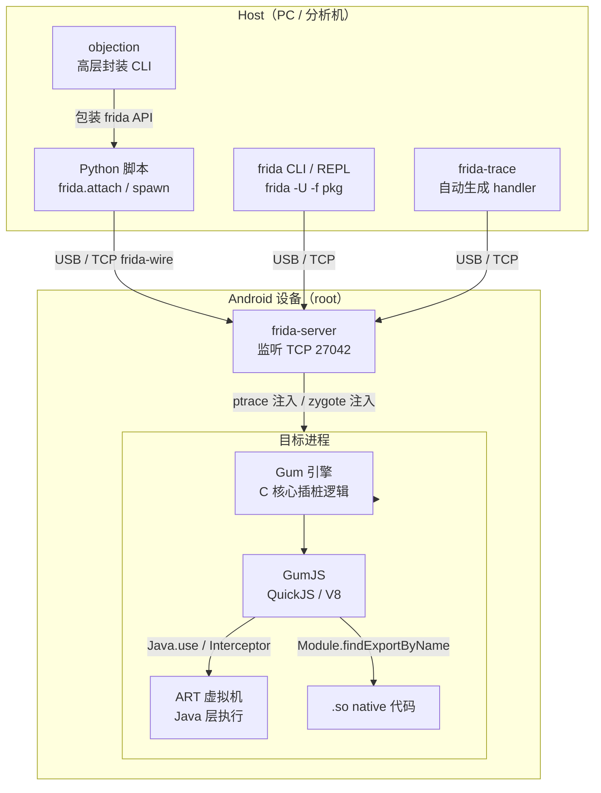
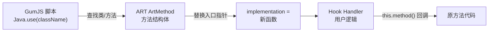
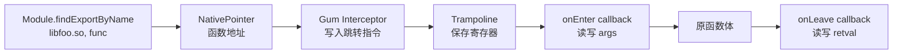

# Android逆向（09）· Frida动态插桩

## 概述与定位

> [!abstract] TL;DR
> Frida 是一个**动态二进制插桩（DBI，Dynamic Binary Instrumentation）**框架，核心能力是在**不重新编译、不修改安装包**的前提下，于运行时向目标进程注入自定义逻辑——修改函数行为、读写内存、追踪调用链。它同时支持 Java 层（`Java.use` + `implementation`）与 native 层（`Interceptor.attach`），配合 `rpc.exports` 可从 host 端实时与插桩脚本双向通信。本篇是 [[32.hooks/00.总览]] hook 体系在 Android 平台的专项落地，Java 层原理依赖 [[06.应用启动与Zygote]]，native 层原理对接 [[07.JNI与native层]]，对抗层延伸到 [[12.反调试与反Frida对抗]]。

Frida 诞生于 2014 年，最初为 Windows/Linux 桌面平台设计，后迅速扩展到 Android、iOS、macOS 等移动与嵌入式平台。与传统的静态分析（jadx/apktool，见 [[08.静态分析工具]]）不同，Frida 的切入点是**运行状态**——App 跑起来后，任何函数在被调用的一瞬间都可以被拦截、修改、替换，无需接触 APK 文件本身。

---

## 原理与机制

### Frida 是什么：DBI 与 hook 体系的关系

**动态二进制插桩（DBI）**是指在程序运行期间动态向二进制代码注入额外指令或逻辑的技术范畴。Frida 属于 [[32.hooks/00.总览]] 所描述的"OS 层 + 指令层"双重 hook：

- **Java 层**：通过操控 ART 虚拟机内部的方法表（`ArtMethod`），实现对 Java 方法的拦截——属于"语言运行时层 hook"。
- **native 层**：在目标函数入口处写入跳转指令，redirect 到 Frida 的 trampoline——属于"CPU 指令层 inline hook"，与 [[32.hooks/00.总览]] 第 2 节所述 Inline Hook 原理一致。

两层都通过同一套 JavaScript API 控制，这是 Frida 相比手工 ptrace 或 Xposed 最大的工程优势。

### 整体架构



关键组件说明：

| 组件 | 位置 | 职责 |
|---|---|---|
| `frida-server` | 设备端（需 root 推送） | 接收 host 连接，负责进程注入，转发消息 |
| **Gum** | 注入目标进程内 | C 语言插桩内核，提供 `Interceptor`、`MemoryAccessMonitor`、`Stalker` |
| **GumJS** | 注入目标进程内 | 内嵌 JS 引擎（QuickJS 轻量 / V8 完整），执行用户脚本 |
| host 端 Python/CLI | 分析机 | 加载脚本、收发 `message`、调用 `rpc.exports` |

### 注入流程

1. host 通过 USB（`-U`）或 TCP 连接到 `frida-server`。
2. `frida-server` 以 root 权限对目标进程调用 `ptrace(PTRACE_ATTACH, ...)`，暂停目标。
3. 向目标进程写入一段 bootstrap 代码（shellcode），通过 `dlopen` 加载 `frida-agent.so`。
4. `frida-agent.so` 初始化 Gum 引擎与 GumJS，建立与 `frida-server` 的双向通信通道。
5. 用户 JS 脚本传入 GumJS 执行，`Java.perform` / `Interceptor.attach` 等 API 生效。
6. 目标进程恢复执行，hook 已就位。

---

## 注入模式：spawn vs attach

Frida 提供两种主要注入时机，选择恰当的模式对 hook 成功率至关重要。

### spawn 模式（早期注入）

```bash
frida -U -f com.example.app --no-pause
```

> [!warning] 示例输出为示意

```
     ____
    / _  |   Frida 16.x.x - A world-class dynamic instrumentation toolkit
   | (_| |
    > _  |   Commands:
   /_/ |_|       help      -> Displays the help system
   . . . .       object?   -> Display information about 'object'
   . . . .       exit/quit -> Exit
   . . . .
[Android Emulator 5554::com.example.app ]->
```

- `frida -U -f <packageName>`：Frida 负责 **fork + exec** 目标 App，在进程刚创建、代码尚未执行时完成注入。
- 适合需要 hook **早期初始化代码**的场景：`Application.onCreate`、`JNI_OnLoad`、静态初始化块、加固壳的解密过程（参见 [[06.应用启动与Zygote]] 的启动链）。
- `--no-pause` 让目标进程注入后自动继续；去掉则暂停等待 `%resume`，适合在 REPL 先注册 hook 再恢复。

### attach 模式（附着已运行进程）

```bash
frida -U com.example.app          # 按包名
frida -U -p 1234                  # 按 PID
```

> [!warning] 示例输出为示意

```
[Android Emulator 5554::com.example.app ]-> Java.androidVersion
"12"
```

- 目标 App 已在前台运行，Frida 附着进去。
- 无法 hook 已经完成执行的早期代码，但对登录验证、支付校验、运行中功能分析足够。
- App 自实现了反调试/反 Frida 检测时，attach 时机较晚，检测可能已通过——但也可能 attach 本身触发检测（详见 [[12.反调试与反Frida对抗]]）。

### 模式对比

| 维度 | spawn（早期注入） | attach（附着） |
|---|---|---|
| hook 时机 | 进程刚起，早于 `Application.onCreate` | 进程已运行 |
| 适用场景 | 壳解密、早期初始化、JNI_OnLoad | 登录逻辑、运行时校验、按需分析 |
| 反检测风险 | 较低（早于检测代码执行） | 较高（进入时检测代码可能已激活） |
| App 行为 | 从头走完启动链（[[06.应用启动与Zygote]]） | 不影响已完成的启动流程 |

---

## Java 层 Hook

Java 层 hook 通过操控 ART 内部的 `ArtMethod` 结构（将方法标记为 native 并替换入口指针）实现。用户无需理解 ART 内部，通过 GumJS 提供的 `Java.*` API 即可。

### 基础：Java.perform

所有 Java 层操作必须包裹在 `Java.perform` 回调内，确保在 ART 初始化完成、类加载器就绪后执行：

```javascript
Java.perform(function () {
    // 所有 Java.use / Java.choose 调用放在这里
});
```

### 拦截方法：Java.use + implementation

```javascript
Java.perform(function () {
    var MainActivity = Java.use("com.example.app.MainActivity");

    // hook checkLicense 方法，使其始终返回 true
    MainActivity.checkLicense.implementation = function (key) {
        console.log("[*] checkLicense called, key = " + key);
        var ret = this.checkLicense(key);   // 调用原方法
        console.log("[*] original return = " + ret);
        return true;                        // 强制返回 true
    };
});
```

### 处理重载：overload

Java 方法可重载，必须用 `overload(...)` 指定参数签名，否则 Frida 报错（`use overload(...) to disambiguate`）：

```javascript
Java.perform(function () {
    var Crypto = Java.use("com.example.app.CryptoUtil");

    // encrypt(String) 重载
    Crypto.encrypt.overload("java.lang.String").implementation = function (data) {
        console.log("[*] encrypt(String): " + data);
        return this.encrypt(data);
    };

    // encrypt(byte[]) 重载
    Crypto.encrypt.overload("[B").implementation = function (data) {
        console.log("[*] encrypt(byte[]): " + JSON.stringify(Array.from(data)));
        return this.encrypt(data);
    };
});
```

参数签名遵循 JNI 类型描述符（与 [[07.JNI与native层]] 中 `RegisterNatives` 所用签名相同）：

| Java 类型 | 签名字符串 |
|---|---|
| `int` | `"int"` 或 `"I"` |
| `boolean` | `"boolean"` 或 `"Z"` |
| `byte[]` | `"[B"` |
| `java.lang.String` | `"java.lang.String"` |
| `void` | `"void"` 或 `"V"` |

### 枚举已有实例：Java.choose

目标类已经有实例在运行（如 Singleton、Activity、自定义 Manager），用 `Java.choose` 遍历堆上的实例：

```javascript
Java.perform(function () {
    Java.choose("com.example.app.UserSession", {
        onMatch: function (instance) {
            console.log("[*] Found instance, token = " + instance.token.value);
            instance.isLoggedIn.value = true;   // 强制修改字段
        },
        onComplete: function () {
            console.log("[*] Enumeration done");
        }
    });
});
```

### 枚举加载的类：Java.enumerateLoadedClasses

分析不知道类名时，先枚举当前进程已加载的所有类，过滤关键词：

```javascript
Java.perform(function () {
    Java.enumerateLoadedClasses({
        onMatch: function (className) {
            if (className.indexOf("License") !== -1 ||
                className.indexOf("Verify") !== -1) {
                console.log("[+] " + className);
            }
        },
        onComplete: function () {}
    });
});
```

### Java 层 hook 路径



---

## native 层 Hook

native 层 hook 基于 Inline Hook 原理：在目标函数入口处写入 `B`/`BLX`（ARM）或 `JMP`（x86）跳转指令，redirect 到 Gum 的 trampoline，执行用户回调后跳回原代码（onEnter/onLeave）或完全替换（replace）。

这与 [[32.hooks/00.总览]] 第 2 节描述的 Inline Hook 机制、以及 [[11.ELF文件详解/17.got节.md]] 中 GOT 表项劫持思路共同构成 native hook 的两条技术路线——Frida 主要走 Inline Hook，也支持 GOT patch。

### 定位函数地址

```javascript
// 方法一：按导出符号名
var addr = Module.findExportByName("libfoo.so", "Java_com_example_encrypt");

// 方法二：按模块基址 + 偏移（IDA/Ghidra 分析得到偏移，见 08.静态分析工具）
var base = Module.findBaseAddress("libfoo.so");
var addr = base.add(0x1234);   // 偏移 0x1234

// 方法三：枚举模块所有导出，过滤关键词
Module.enumerateExports("libfoo.so").forEach(function (exp) {
    if (exp.name.indexOf("decrypt") !== -1) {
        console.log(exp.name + " @ " + exp.address);
    }
});
```

> [!warning] 示例输出为示意

```
Java_com_example_app_CryptoJni_decrypt @ 0x7b3a104c20
```

### Interceptor.attach（onEnter / onLeave）

```javascript
var func = Module.findExportByName("libfoo.so", "do_decrypt");

Interceptor.attach(func, {
    onEnter: function (args) {
        // args[0], args[1] ... 为函数参数（NativePointer）
        console.log("[*] do_decrypt called");
        console.log("    arg0 (buf ptr) = " + args[0]);
        console.log("    arg1 (len)     = " + args[1].toInt32());
        // 可以直接读取内存
        console.log("    buf hex = " + hexdump(args[0], { length: 16 }));
        this.buf = args[0];    // 保存到 this，供 onLeave 使用
        this.len = args[1].toInt32();
    },
    onLeave: function (retval) {
        console.log("[*] do_decrypt returned = " + retval.toInt32());
        // 修改返回值
        // retval.replace(1);
        // 读取解密后的 buf
        console.log("    result = " + Memory.readUtf8String(this.buf, this.len));
    }
});
```

> [!warning] 示例输出为示意

```
[*] do_decrypt called
    arg0 (buf ptr) = 0x7b3a20c000
    arg1 (len)     = 32
    buf hex =
           0  1  2  3  4  5  6  7  8  9  A  B  C  D  E  F  0123456789ABCDEF
00000000  48 65 6c 6c 6f 20 57 6f 72 6c 64 21 00 00 00 00  Hello World!....
[*] do_decrypt returned = 0
    result = Hello World!
```

### Interceptor.replace（完全替换）

不调用原函数，完全替换实现：

```javascript
var checkSignature = new NativeFunction(
    Module.findExportByName("libfoo.so", "check_signature"),
    "int",          // 返回类型
    ["pointer", "int"]   // 参数类型列表
);

Interceptor.replace(
    Module.findExportByName("libfoo.so", "check_signature"),
    new NativeCallback(
        function (buf, len) {
            console.log("[*] check_signature bypassed");
            return 1;   // 强制返回成功
        },
        "int",
        ["pointer", "int"]
    )
);
```

### NativeFunction 与 NativePointer

```javascript
// 把一个地址包装为可调用的 NativeFunction（主动调用 native 函数）
var decrypt = new NativeFunction(
    Module.findExportByName("libcrypto.so", "AES_decrypt"),
    "void",
    ["pointer", "pointer", "pointer"]
);
decrypt(cipherPtr, plainPtr, keyPtr);

// NativePointer：地址的包装类型，支持算术与内存操作
var ptr = new NativePointer("0x7b3a104c20");
var val = ptr.readU32();
ptr.add(4).writeU32(0xDEADBEEF);
```

### native 层 hook 路径



### 与 JNI 层的关系

native 层 hook 自然可以拦截 JNI 函数（即 [[07.JNI与native层]] 中通过 `RegisterNatives` 或命名约定导出的 `Java_*` 函数）。在 JNI bridge 上 attach，能同时访问 Java 侧参数（经 JNI 转换后的 C 类型）与 native 侧内存，是分析加密/解密、证书校验等跨层逻辑的主要手段。

---

## 内存操作与 RPC

### Memory API

```javascript
// 读取各类型
var u8  = Memory.readU8(ptr);
var u32 = Memory.readU32(ptr);
var str = Memory.readUtf8String(ptr);         // 读 C 字符串
var bytes = Memory.readByteArray(ptr, 32);    // 读 N 字节，返回 ArrayBuffer

// 写入
Memory.writeU32(ptr, 0x1234);
Memory.writeByteArray(ptr, [0x90, 0x90, 0x90]);   // NOP patch

// hexdump（调试用）
console.log(hexdump(ptr, { offset: 0, length: 64, header: true, ansi: true }));

// 搜索内存（扫描特征字节）
Memory.scan(base, 0x10000, "48 65 6c 6c 6f", {
    onMatch: function (address, size) {
        console.log("[+] Pattern found @ " + address);
    },
    onComplete: function () {}
});
```

### rpc.exports：host ↔ 脚本双向通信

`rpc.exports` 让 host 端 Python 代码实时调用脚本内暴露的函数，适合自动化分析流程：

```javascript
// 脚本端（inject.js）
rpc.exports = {
    // host 调用 script.exports.decrypt(data) 时触发
    decrypt: function (hexData) {
        var buf = Memory.alloc(hexData.length / 2);
        // ... 写入数据，调用 native 解密函数 ...
        return Memory.readByteArray(buf, 16);
    },
    getToken: function () {
        // 从内存中读 token 字段
        return Memory.readUtf8String(tokenPtr);
    }
};
```

```python
# host 端（analyze.py）
import frida, sys

session = frida.get_usb_device().attach("com.example.app")
with open("inject.js") as f:
    script = session.create_script(f.read())
script.load()

# 同步调用 rpc
result = script.exports.get_token()
print("token:", result)

data = bytes.fromhex("deadbeef" * 4)
plain = script.exports.decrypt(data)
print("plain:", plain.hex())
```

> [!warning] 示例输出为示意

```
token: eyJhbGciOiJIUzI1NiJ9...
plain: 48656c6c6f20576f726c6421000000
```

---

## 常用场景脚本

### 场景 1：Trace 所有方法调用（打印调用堆栈）

```javascript
Java.perform(function () {
    var targetClass = Java.use("com.example.app.AuthManager");
    // 获取所有方法，逐一 hook
    targetClass.class.getDeclaredMethods().forEach(function (method) {
        var methodName = method.getName();
        try {
            targetClass[methodName].overloads.forEach(function (overload) {
                overload.implementation = function () {
                    console.log("[TRACE] AuthManager." + methodName
                        + "(" + JSON.stringify(Array.from(arguments)) + ")");
                    // 打印 Java 堆栈
                    console.log(Java.use("android.util.Log")
                        .getStackTraceString(
                            Java.use("java.lang.Exception").$new()
                        ));
                    return overload.apply(this, arguments);
                };
            });
        } catch (e) {}
    });
});
```

> [!warning] 示例输出为示意

```
[TRACE] AuthManager.checkLicense(["TRIAL-KEY-001"])
java.lang.Exception
    at com.example.app.AuthManager.checkLicense(AuthManager.java:42)
    at com.example.app.MainActivity.onCreate(MainActivity.java:78)
    ...
```

### 场景 2：绕过 SSL Pinning（Java 层）

```javascript
Java.perform(function () {
    // 绕过 OkHttp3 CertificatePinner
    var CertPinner = Java.use("okhttp3.CertificatePinner");
    CertPinner.check.overload("java.lang.String", "java.util.List")
        .implementation = function (hostname, certs) {
            console.log("[*] SSL Pinning bypassed for: " + hostname);
            // 不调用原方法，直接返回（不抛异常 = 验证通过）
        };
});
```

> [!warning] 示例输出为示意

```
[*] SSL Pinning bypassed for: api.example.com
```

### 场景 3：dump native 解密结果

```javascript
Java.perform(function () {
    var addr = Module.findExportByName("libsec.so", "sec_decrypt");
    Interceptor.attach(addr, {
        onEnter: function (args) {
            this.outBuf = args[1];    // 输出 buffer
            this.outLen = args[2].toInt32();
        },
        onLeave: function (retval) {
            if (retval.toInt32() === 0) {
                var data = Memory.readByteArray(this.outBuf, this.outLen);
                send({ type: "decrypt_result" }, data);  // 发到 host
            }
        }
    });
});
```

### 场景 4：枚举加载的 native 模块

```javascript
Process.enumerateModules().forEach(function (mod) {
    if (mod.name.indexOf("lib") === 0) {
        console.log(mod.name + " base=" + mod.base + " size=" + mod.size);
    }
});
```

> [!warning] 示例输出为示意

```
libfoo.so   base=0x7b3a100000 size=0x20000
libsec.so   base=0x7b3a200000 size=0x80000
libart.so   base=0x7b5e000000 size=0x400000
```

---

## 生态工具

### frida-trace：自动生成 hook 骨架

`frida-trace` 根据函数名/通配符自动生成 handler JS 文件，开箱即用：

```bash
# trace libfoo.so 所有导出函数
frida-trace -U -f com.example.app -I "libfoo.so"

# trace 特定函数（支持通配符）
frida-trace -U -f com.example.app -i "do_*" -i "check_*"

# trace Java 方法
frida-trace -U -f com.example.app -j "com.example.app.AuthManager!*"
```

> [!warning] 示例输出为示意

```
Instrumenting...
do_decrypt: Auto-generated handler at "__handlers__/libfoo.so/do_decrypt.js"
Started tracing 3 functions. Press Ctrl+C to stop.
           /* TID 0x1234 */
   291 ms  do_decrypt(arg0=0x7b3a..., arg1=0x20)
   292 ms  do_decrypt: returned 0x0
```

生成的 `__handlers__/libfoo.so/do_decrypt.js` 可直接编辑加入分析逻辑，下次运行自动加载。

### objection：高层封装 CLI

objection 是基于 Frida 的交互式探索工具，免写脚本即可完成常见分析任务：

```bash
# 启动并附着
objection -g com.example.app explore

# 常用命令（在 objection shell 内）
android hooking list classes              # 枚举类
android hooking search classes License   # 过滤关键词
android hooking watch class com.example.app.AuthManager  # trace 整个类
android sslpinning disable               # 一键绕过 SSL Pinning
android root disable                     # 绕过 root 检测
memory dump all /tmp/memdump.bin         # 内存 dump
```

> [!warning] 示例输出为示意

```
Using USB device `Android Emulator 5554`
Agent injected and responds ok!
com.example.app on (Android: 12) [usb] # android hooking list classes
...
com.example.app.AuthManager
com.example.app.LicenseChecker
...
```

---

## 与 Xposed/LSPosed 对比

Xposed 是另一个主流的 Android hook 框架，二者定位不同，适用场景互补：

| 维度 | Frida | Xposed / LSPosed |
|---|---|---|
| **层次** | Java 层 + native 层（统一） | 主要 Java 层（通过替换 ART `handleBindApplication` 入口） |
| **脚本语言** | JavaScript（运行时热更） | Java / Kotlin（需编译为 APK） |
| **持久化** | 非持久（进程生命周期内有效） | 持久（模块 APK 安装，重启后自动激活） |
| **root 要求** | 必须 root（`frida-server` 需 root 推送） | 必须 root（Xposed 框架安装到系统分区） |
| **native hook** | 原生支持 `Interceptor.attach`、`Inline Hook` | 不直接支持，需 native 模块配合 |
| **灵活性** | 极高（运行时改脚本，不重启） | 中等（改模块需重启 App） |
| **稳定性** | 依赖 App 版本（方法签名变化即失效） | 类似，但以模块形式分发更易维护 |
| **检测难度** | 易被 App 检测（frida-server 特征明显） | 相对不易被检测（但 LSPosed 也有指纹） |
| **典型用途** | 逆向分析、CTF、安全评估（一次性） | 功能扩展、长期 hook（开发者/用户层面） |

**选型原则**：需要分析 native 层、快速迭代脚本、不想在设备上安装额外 APK 时用 Frida；需要长期稳定的 Java 层 hook、多 App 共享同一套模块逻辑时用 Xposed/LSPosed。

---

## 安全性与正确使用

### 被检测：Frida 的可见指纹

App 可以通过多种手段检测 Frida 存在（详细原理与对抗见 [[12.反调试与反Frida对抗]]），常见检测点包括：

| 检测手段 | Frida 暴露的特征 |
|---|---|
| **端口扫描** | `frida-server` 默认监听 TCP 27042，`/proc/net/tcp` 可见 |
| **进程/线程名** | 注入线程名含 `gmain`、`gdbus`、`frida`、`gum-js-loop` |
| **内存字符串** | 进程内存含 `FRIDA`、`frida-agent`、`GumScript` 等字符串 |
| **`/proc/maps` 扫描** | `frida-agent.so` 路径出现在内存映射中 |
| **符号检测** | 使用 `dlopen` 检测 `frida_agent_main` 等符号是否存在 |
| **`ptrace` 自附着** | App 在启动时 `ptrace(PTRACE_TRACEME)` 占坑，阻止外部附着 |
| **完整性校验** | 检测自身代码段是否被修改（native inline hook 会改字节） |

### spawn vs attach 的安全选择

- **分析自有 App / 授权评估**：两种模式均可，spawn 更彻底。
- **早期绕过检测**：优先 spawn，在检测代码执行前 hook。
- **对抗已有检测**：可结合自定义 `frida-server`（改端口/字符串混淆）或 Frida gadget（嵌入 `.so`）等方式——具体对抗技术见 [[12.反调试与反Frida对抗]]。

### 合规边界

> [!warning] 重要合规说明
> - Frida 插桩**需要 root 权限**，只能用于：自有设备上的自有 App 安全评估、授权的渗透测试、恶意样本分析（隔离环境）、CTF/教学研究。
> - **不得用于**：未经授权分析他人生产 App、绕过 DRM/版权保护系统、对他人设备或服务器发起攻击。
> - 不同国家/地区对逆向工程的合法性规定不同（部分国家 DMCA 等法律有限制），操作前需确认法律合规性。
> - 企业安全评估场景，建议在合同中明确授权范围，并在隔离测试设备上操作，不使用生产数据。

### 实践建议与常见坑

| 坑 | 原因 | 对策 |
|---|---|---|
| `Java.use` 找不到类 | 类未加载或包名拼写错误 | 先用 `Java.enumerateLoadedClasses` 确认；spawn 时等 `Application.onCreate` 后再 use |
| hook 不生效 | `Java.perform` 未包裹，或方法有重载未用 `overload` | 检查控制台报错；`overload(...)` 精确指定签名 |
| native 地址错误 | ASLR 导致每次加载基址不同 | 不要硬编码绝对地址，始终 `Module.findBaseAddress` + 偏移 |
| onLeave `this.xxx` 丢失 | 不同线程的 `this` 独立，无需担心；但闭包变量要确认作用域 | 用 `this.xxx` 而非外部变量保存跨回调数据 |
| App 崩溃 | hook 函数签名类型不匹配或返回值错误 | 确认参数/返回类型；`NativeCallback` 类型必须与原函数一致 |
| frida-server 版本不匹配 | host 端 frida Python 包版本与设备端 frida-server 版本须一致 | `pip show frida` 对齐 frida-server release 版本号 |

---

## 小结

Frida 的核心价值在于**统一的运行时插桩接口**：用同一套 JavaScript API，无缝跨越 Java 层（操控 ART 方法表）与 native 层（Inline Hook + GOT patch），配合 `rpc.exports` 实现 host-脚本双向自动化，大幅降低 Android 逆向的门槛。

关键要点回顾：
- **spawn 早、attach 晚**：启动链敏感逻辑（[[06.应用启动与Zygote]]）用 spawn，运行时校验用 attach。
- **Java 层**：`Java.perform` → `Java.use` → `.implementation` → `overload` 处理重载。
- **native 层**：`Module.findExportByName` 定位 → `Interceptor.attach(onEnter/onLeave)` 观测 → `replace` 替换；结合 JNI 分析（[[07.JNI与native层]]）。
- **内存与 RPC**：`Memory.read*`/`write*` 直接操作内存，`rpc.exports` 让分析流程自动化。
- **检测与对抗**：Frida 有明显的端口/线程/内存指纹，App 可检测，详见 [[12.反调试与反Frida对抗]]。
- **合规优先**：root 权限 + 授权场景，不用于未经授权的生产系统。

---

## 相关阅读

- **Hook 体系全景**：[[32.hooks/00.总览]]
- **应用启动链（spawn 的起点）**：[[06.应用启动与Zygote]]
- **JNI 与 native 层（native hook 对象）**：[[07.JNI与native层]]
- **静态分析（hook 点定位辅助）**：[[08.静态分析工具]]
- **动态调试（Frida 的调试器搭档）**：[[10.动态调试]]
- **反调试与反 Frida 对抗**：[[12.反调试与反Frida对抗]]
- **ELF GOT 表（native hook 原理基础）**：[[11.ELF文件详解/17.got节.md]]
- **ELF 系列总览**：[[11.ELF文件详解/00.ELF文件详解总览.md]]
- **动态链接（.so 加载原理）**：[[14.动态链接与加载器详解/00.动态链接与加载器总览.md]]

---

⬅️ 上一篇 [[08.静态分析工具]] ｜ 🏠 [[00.Android逆向与运行时总览]] ｜ 下一篇 [[10.动态调试]] ➡️
