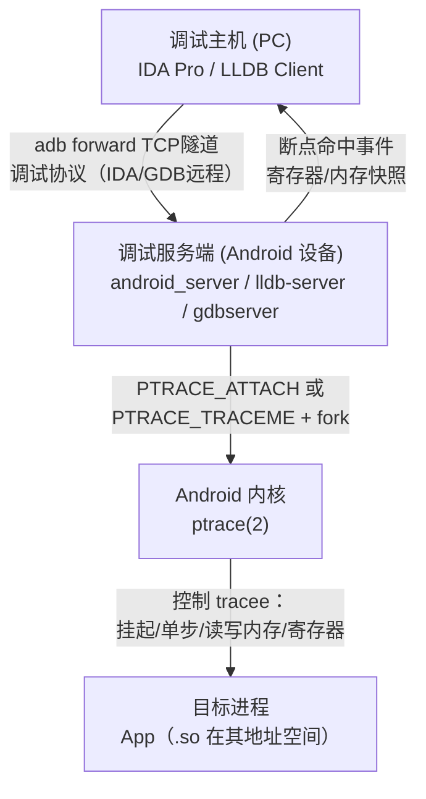
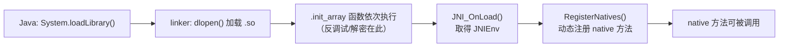
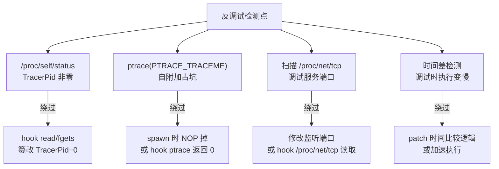

# Android逆向（10）· 动态调试

> [!abstract] TL;DR
> - 动态调试分两条线：**Java/smali 层**（需 `debuggable` 环境，jdb/Android Studio attach，smali 断点单步）和 **native/so 层**（IDA Pro + `android_server`、lldb-server、gdbserver，看寄存器/内存/调用栈）。
> - native 调试底层复用 `ptrace(2)` 机制——`android_server`/`lldb-server` 通过 `PTRACE_ATTACH` 或 `PTRACE_TRACEME` 取得目标进程控制权，详见 [[44.调试器原理与实战/02.ptrace原理.md]]。
> - 调试 JNI 的关键时机：在 `JNI_OnLoad` 或 `.init_array` 早期下断，捕获 so 初始化与 `RegisterNatives` 注册过程，详见 [[07.JNI与native层]]。
> - 反调试手段（`TracerPid` 检测、ptrace 自附加、调试端口探测）会令调试器无法附加或令 App 自毁，绕过分析见 [[12.反调试与反Frida对抗]]。
> - 所有调试操作须在**合法授权**的设备/App 上进行；反调试绕过仅用于自有 App 安全评估与恶意样本分析。

---

## 概述与定位

动态调试（Dynamic Debugging）在 Android 逆向中指：**在 App 运行中实时观察控制流、变量状态和内存内容**，而不仅依赖静态反编译的源码猜测。相比 [[09.Frida动态插桩]] 的脚本式 hook，调试器能提供更底层的单步控制、断点命中时的完整寄存器/调用栈快照，适合分析复杂流程或加固后难以直接 hook 的场景。

动态调试的两条主线：

| 调试层 | 目标代码 | 核心工具 | 前提 |
|---|---|---|---|
| **Java/smali 层** | DEX 字节码（ART 解释/JIT） | jdb、Android Studio、JADX 断点 | App `debuggable="true"` 或设备 `ro.debuggable=1` |
| **native 层** | `.so`（ELF，ARM/AArch64 指令） | IDA Pro + `android_server`、lldb-server、gdbserver | App `debuggable` 或 root 环境 |

两条线可联动：调试 JNI 跨层调用时，可同时在 Java 侧和 `JNI_OnLoad` 处设断，捕获从 Java 调用 native 方法的完整路径（参见 [[07.JNI与native层]]）。

---

## 原理与机制

### Java/smali 层调试原理

Android 的 Java 调试遵循 **JDWP**（Java Debug Wire Protocol）标准，ART 运行时内置了 JDWP 实现（`libart.so` 中的 `jdwp_*` 模块）：

1. App 启动时 ART 检查 `android:debuggable` 标志（来自 `AndroidManifest.xml` 二进制属性）或设备属性 `ro.debuggable`。
2. 若可调试，ART 创建 JDWP 线程，监听 Unix domain socket（路径形如 `/dev/socket/jdwp/<pid>`）或 TCP 端口（通过 `adb forward` 转发到 PC）。
3. 调试客户端（jdb / Android Studio / JADX）经 JDWP 协议发送命令：设断点、单步、读取变量、查调用栈。
4. ART 解释器在每条 DEX 字节码指令执行前检查断点表，命中时挂起目标线程并通知调试客户端。

**smali 断点的本质**：apktool 反汇编出 smali 后，行号信息来自 DEX 中的 `debug_info_item`（记录 DEX 指令偏移 → 行号映射）。调试器据此把"第 N 行"映射到具体的 DEX 指令偏移，再通知 ART 在该偏移设事件断点。

### native 层调试原理

`.so` 是标准 ARM/AArch64 ELF 共享库，原生机器码在 CPU 上直接运行。调试器通过 Linux `ptrace(2)` 系统调用取得目标进程控制权——这与桌面 Linux 上 GDB/LLDB 调试的机制完全一致，详见 [[44.调试器原理与实战/02.ptrace原理.md]]。

Android 上的两种路径：
- **spawn 模式**（IDA "launch application"）：调试服务器以 `fork` + `PTRACE_TRACEME` + `exec` 方式启动目标 App，exec 后内核自动在第一条指令前暂停，调试器得以在 so 初始化前设断。
- **attach 模式**（IDA "attach to process"）：目标 App 已在运行，调试服务器以 `PTRACE_ATTACH` 附加目标进程 pid，发送 `SIGSTOP` 令其暂停，随后进入标准 `waitpid` 事件循环。



### 断点类型

| 类型 | 实现机制 | 适用层 | 特点 |
|---|---|---|---|
| **软件断点** | 在目标地址写入 `int 3`（x86 `0xCC`）或 ARM `BKPT`/`BRK` 指令；命中时 CPU 触发 `SIGTRAP` | native | 无数量限制，需目标内存可写；可被反调试检测（扫描 `BKPT` 字节） |
| **硬件断点** | 利用 CPU 调试寄存器（ARM `DBGBCR`/`DBGBVR`，ARM64 最多 16 个）；无需修改代码段 | native | 数量有限（通常 4–16 个），不修改内存，难以被软件检测 |
| **内存断点（watchpoint）** | 监视指定内存地址的读/写；CPU 调试寄存器中的"数据断点" | native | 用于定位变量被修改的调用路径 |
| **JDWP 事件断点** | ART 解释器软件实现，无需修改 DEX 字节码 | Java/smali | 仅在解释模式生效；AOT/JIT 编译后的方法需 deoptimize |

断点更完整的原理机制参见 [[44.调试器原理与实战/00.调试器原理与实战总览.md]] 中的断点篇。

---

## Java/smali 层调试

### 使 App 可调试的两种方式

**方式 A：重打包（改 AndroidManifest.xml）**

```bash
# 1. 反汇编 APK
apktool d target.apk -o target_out

# 2. 编辑 target_out/AndroidManifest.xml，在 <application> 标签加属性
#    android:debuggable="true"

# 3. 重打包
apktool b target_out -o target_debug.apk

# 4. 签名（用测试 keystore）
apksigner sign --ks debug.keystore --out target_signed.apk target_debug.apk

# 5. 安装
adb install -r target_signed.apk
```

> [!warning] 示例输出为示意
> 上述命令在 apktool 2.9.x + apksigner（build-tools）环境下可用；部分加固 App 有签名校验，重打包后会在运行时崩溃，需配合第 11/12 篇的脱壳/绕过手段。

**方式 B：设备级 `ro.debuggable`（需 root 或 userdebug 镜像）**

```bash
# 在已 root 的设备上（或 userdebug/eng 固件自带）
adb shell setprop ro.debuggable 1
# 重启 zygote 令新属性生效
adb shell stop && adb shell start
```

> [!warning] 示例输出为示意
> `ro.debuggable` 属于 `ro.*` 只读属性，普通 `setprop` 在 user 版固件不生效；需要 Magisk 模块（如 MagiskHide Props Config）或刷写 userdebug 固件方能持久修改。

### 让 App 等待调试器：`Debug.waitForDebugger`

在 smali 代码中插入等待语句，可让 App 在指定位置暂停直到调试器附加：

```smali
# 在目标方法开头插入（重打包后写入 smali 文件）
invoke-static {}, Landroid/os/Debug;->waitForDebugger()V
```

也可通过 `adb` 在 App 启动时令其等待：

```bash
# -D 表示等待调试器；-S 先停止再启动
adb shell am start -D -n com.example.target/.MainActivity
```

> [!warning] 示例输出为示意
> 命令执行后 App 界面会停在白屏，logcat 输出 `Waiting for debugger to connect...`，此时调试器 attach 后才继续运行。

### jdb 附加调试

```bash
# 1. 转发 JDWP 端口（找到目标进程 pid）
adb jdwp                         # 列出可调试进程 pid
adb forward tcp:8700 jdwp:<pid>  # 把 JDWP socket 转发到 PC 8700 端口

# 2. jdb 连接
jdb -connect com.sun.jdi.SocketAttach:hostname=localhost,port=8700
```

> [!warning] 示例输出为示意
> 连接成功后 jdb 输出 `Set uncaught java.lang.Throwable` 等初始化提示，随后进入交互式 `>` 提示符。`stop in com.example.Foo.bar` 设方法断点，`step` 单步，`print <var>` 查变量。

### Android Studio attach 调试

1. 菜单 **Run → Attach Debugger to Android Process**，选目标包名（需 `debuggable`）。
2. Studio 内部自动完成 `adb forward` + JDWP 握手。
3. 在 Java 源码视图（或 smali 插件中）设断点，程序运行到该行时 Studio 高亮并展示变量窗口、调用栈。

smali 断点依赖 **JADX + Smalidea / Android Studio smali 插件**：插件把 smali 行号映射到 JDWP 事件断点，与 Java 断点机制相同，只是展示的是助记符而非 Java 代码。

---

## native 层调试

### 工具链对比

| 工具 | 服务端（设备侧） | 客户端（PC 侧） | 协议 | 特点 |
|---|---|---|---|---|
| **IDA Pro 远程调试** | `android_server`（IDA 自带） | IDA Pro GUI | IDA 私有协议 | 界面最友好，支持 F5 反编译同步；闭源收费 |
| **LLDB** | `lldb-server`（NDK 提供） | `lldb`（命令行/VSCode） | GDB RSP | 开源，Apple/Google 标准工具，功能完整 |
| **GDBserver** | `gdbserver`（NDK 提供） | `gdb`（命令行） | GDB RSP | 老牌方案；LLDB 现已为首选 |

### IDA Pro + android_server 流程

**Step 1：推送并启动 android_server**

```bash
# android_server 位于 IDA 安装目录 dbgsrv/，选对架构（armv7 / arm64）
adb push android_server64 /data/local/tmp/
adb shell chmod +x /data/local/tmp/android_server64
adb shell /data/local/tmp/android_server64 -p 23946
```

> [!warning] 示例输出为示意
> 成功后设备侧输出 `IDA Android 64-bit remote debug server(ST) v7.x. Listening on 0.0.0.0:23946.`；若提示 Permission denied 需要 root 或在 `debuggable` App 的 run-as 沙箱内运行。

**Step 2：adb 端口转发**

```bash
adb forward tcp:23946 tcp:23946
```

**Step 3：IDA 远程 attach**

1. 菜单 **Debugger → Attach → Remote ARM Linux/Android debugger**。
2. 主机填 `localhost`，端口 `23946`，点 OK。
3. IDA 弹出进程列表，选择目标 App 的进程（通常是包名或 `app_process64`）。
4. 点 OK 后 IDA 通过 android_server 向目标进程发出 `PTRACE_ATTACH`，进程暂停，IDA 进入调试模式。

**Step 4：设断点并恢复**

- 在反汇编视图按 `F2` 设软件断点（IDA 内部通过 `android_server` 写入 `BRK` 指令）。
- 按 `F9` 恢复运行，命中断点时 IDA 弹出寄存器窗口（R0–R30/X0–X30、PC、SP）、内存窗口和调用栈。

```
寄存器窗口（AArch64 示意）：
X0  = 0x00000072a1b2c3d4   X1  = 0x0000000000000001
X2  = 0x00000072f0e1d2c3   X3  = 0x0000000000000000
...
PC  = 0x000000712345abcd   SP  = 0x00000072ffeedd00
```

> [!warning] 示例输出为示意
> 寄存器值因 ASLR 每次加载地址不同，图中地址纯为示意。

### lldb-server 流程

```bash
# 推送 lldb-server（NDK 中 toolchains/llvm/prebuilt/linux-x86_64/lib/clang/*/lib/aarch64-linux-android/lldb-server）
adb push lldb-server /data/local/tmp/
adb shell chmod +x /data/local/tmp/lldb-server

# 设备侧：平台模式启动
adb shell /data/local/tmp/lldb-server platform --listen "*:1234" --server

# PC 侧：端口转发
adb forward tcp:1234 tcp:1234

# PC 侧：lldb 连接并 attach
lldb
(lldb) platform select remote-android
(lldb) platform connect connect://localhost:1234
(lldb) attach --pid <target_pid>
(lldb) breakpoint set --name JNI_OnLoad
(lldb) continue
```

> [!warning] 示例输出为示意
> `attach` 成功后 lldb 输出 `Process <pid> stopped`；`breakpoint set` 输出 `Breakpoint 1: where = libxxx.so\`JNI_OnLoad, address = 0x...`。

### 断点命中时的关键操作

```bash
# 查看当前寄存器（lldb）
(lldb) register read

# 查看调用栈
(lldb) bt

# 读内存（从 x0 指向的地址读 32 字节）
(lldb) memory read --size 4 --count 8 $x0

# 修改寄存器（绕过校验时常用）
(lldb) register write x0 0x1

# 单步（指令级）
(lldb) si

# 单步（函数级，跳过 call）
(lldb) ni
```

> [!warning] 示例输出为示意
> `register read` 展示 `x0 = 0x00000072a1234567` 等 AArch64 寄存器列表；`bt` 展示 `frame #0: libxxx.so\`JNI_OnLoad + 0x1c` 等调用帧。

---

## 调试 JNI（跨层关键点）

JNI 层是 Java 代码与 `.so` 的桥梁，详见 [[07.JNI与native层]]。动态调试 JNI 有三个黄金断点位置：

### 1. `JNI_OnLoad`：so 初始化入口

```bash
# lldb：在 JNI_OnLoad 下断（so 刚被 System.loadLibrary 加载时触发）
(lldb) breakpoint set --name JNI_OnLoad

# IDA：在反汇编窗口找到 JNI_OnLoad 符号地址，F2 设断
```

命中时 so 刚被 `dlopen` 加载，`RegisterNatives` 尚未执行——此时可单步追踪动态注册的 native 方法映射表，揭示混淆后的函数地址。

### 2. `.init_array`：比 `JNI_OnLoad` 更早

ELF 的 `.init_array` 节存放 so 加载时最先执行的函数指针数组（在 `JNI_OnLoad` 之前运行）。加固 so 常把解密逻辑和反调试检测放在这里。

```bash
# 读取 .init_array 函数地址（设备上，需 root）
adb shell readelf -S /data/app/com.example.target-1/lib/arm64/libtarget.so | grep init_array
# 在 IDA 中找到对应偏移，对每个函数指针设断
```

> [!warning] 示例输出为示意
> `readelf` 输出 `[ N] .init_array INIT_ARRAY 0000000000012000 ... size 0x10`；每个函数指针 8 字节，`0x10` 表示有 2 个初始化函数。

### 3. `RegisterNatives` 调用

`RegisterNatives` 是 JNI 动态注册的核心 API，原型为：

```c
jint RegisterNatives(JNIEnv *env, jclass clazz,
                     const JNINativeMethod *methods, jint nMethods);
```

在 lldb/IDA 中对 `RegisterNatives` 函数地址设断，命中时查看 `methods` 参数（x2 寄存器）：该结构体数组包含 `{name, signature, fnPtr}` 三元组，即可找出混淆方法名背后的真实函数地址。



---

## 调试时机：spawn vs attach

| 时机 | 操作方式 | 适用场景 | 优劣 |
|---|---|---|---|
| **spawn（启动即调试）** | 调试器控制 App 的启动（`-D` 等待 or IDA launch）；App 从第一条指令前就被暂停 | 需要在 so 初始化（`.init_array`/`JNI_OnLoad`）设断；反调试在启动早期触发 | 可在最早期设断；需要修改启动方式或重打包 |
| **attach（运行中附加）** | App 已正常运行，调试器通过 pid 附加 | 调试特定功能、网络请求处理、用户交互触发的逻辑 | 无法捕获启动阶段；反调试的 `ptrace` 自占（见下节）会阻止此路径 |

**spawn 后立即挂起**的窗口期：`adb shell am start -D` 命令让 App 等待 JDWP 调试器，此时进程已存在但 DEX 尚未执行业务逻辑；native 调试器可在 `JNI_OnLoad` 前就 attach，捕获 so 加载的完整初始化过程。

---

## 反调试对抗（分析视角）

> [!warning] 本节为分析与研究视角
> 以下内容用于理解反调试机制如何工作，以便对**自有 App** 做安全评估或分析**恶意样本**。完整的检测技术与绕过对抗详见 [[12.反调试与反Frida对抗]]。

### 检测 `TracerPid`

`/proc/<pid>/status` 中的 `TracerPid` 字段：正常运行时为 `0`；若被调试器 attach，则为调试器的 pid（非零）。

```c
// 典型反调试代码（读取自身 /proc/self/status）
FILE *fp = fopen("/proc/self/status", "r");
char line[256];
while (fgets(line, sizeof(line), fp)) {
    if (strncmp(line, "TracerPid:", 10) == 0) {
        int tracer = atoi(line + 10);
        if (tracer != 0) {
            // 检测到调试器 → 退出或触发对抗
            exit(1);
        }
    }
}
```

**绕过**：在调试器中拦截 `openat`/`read` 系统调用，将读取的 `/proc/self/status` 内容中的 `TracerPid` 值替换为 `0`；或用 Frida hook `fopen`/`fgets`（见 [[12.反调试与反Frida对抗]]）。

### ptrace 自附加占坑

一个进程同时只能有一个 tracer（内核规定）。App 启动时主动调用 `ptrace(PTRACE_TRACEME, 0, NULL, NULL)` 声明"自己是自己的 tracee"，令任何外部调试器 attach 时因 `EPERM` 失败（目标已被追踪）。

```c
// 典型自附加占坑
if (ptrace(PTRACE_TRACEME, 0, NULL, NULL) == -1) {
    // 说明已经被其他 tracer attach 了 → 反调试触发
    exit(1);
}
```

**绕过**：在 spawn 模式下，调试器在 `PTRACE_TRACEME` 执行之前就已取得控制权，可跳过或 NOP 掉这段逻辑；或用 Frida 在 native 层 hook `ptrace` 系统调用使其返回假成功值。

### 检测调试端口

扫描 `/proc/net/tcp` 或 `/proc/net/tcp6` 查找 `android_server` 默认监听端口（23946）或 lldb-server 端口（1234 等）；若端口存在则判定为调试环境。

**绕过**：修改 `android_server` 监听端口，或 hook `open`/`read` 拦截对 `/proc/net/tcp` 的读取并过滤目标端口行。

### 反调试机制总结图



完整分析与对抗手段见 [[12.反调试与反Frida对抗]]。

---

### interpret-only 降级与条件断点

**`cmd package compile` 降级到解释模式**：

ART 默认对已安装 App 做 AOT 编译（生成 `.oat`/`.vdex`），AOT 代码以机器码运行，JDWP smali 断点在 AOT 代码路径上**不生效**。解决方法：将目标 App 强制降级到解释模式，让 ART 放弃 AOT 版本、改用解释器逐条执行 DEX，此时 smali 断点才能生效。

```bash
# 将目标 App 降级到 interpret-only（每次方法调用都走解释器）
adb shell cmd package compile -m interpret-only -f com.example.target

# 验证编译状态
adb shell cmd package compile --dump-profiles com.example.target
# 或查看 oat 状态
adb shell dumpsys package com.example.target | grep -i "compile"

# 恢复 AOT 编译（分析结束后）
adb shell cmd package compile -m speed -f com.example.target
```

> [!warning] 示例输出为示意
> `compile -m interpret-only` 成功后，后续 App 启动时 ART 不加载 `.oat` 文件，完全走解释器，smali 断点可正常命中。Android 8.0+ 支持此命令。

其他可用的编译模式：

| 模式 | 说明 | 调试效果 |
|---|---|---|
| `interpret-only` | 全解释，零 AOT | smali 断点完全生效，性能最差 |
| `verify` | 仅验证 DEX，不编译 | 类似 interpret-only，稍快 |
| `quicken`（默认 8.0+） | DEX 指令转为 quicken 格式，解释执行 | 部分断点生效 |
| `speed` / `speed-profile` | 完整 AOT / 基于 profile AOT | smali 断点不生效 |

**IDA 条件断点（python 表达式）**：

IDA 支持在断点命中时执行 Python 代码，可实现条件断点：

```python
# IDA Python 条件断点示意（在 Breakpoints 窗口的 Condition 字段输入）
# 仅当 X0 寄存器值等于特定值时中断
GetRegValue("X0") == 0x1234

# 读取 X1 指向的内存字符串，仅当包含 "secret" 时中断
import idautils, idc
x1 = GetRegValue("X1")
try:
    s = idc.get_strlit_contents(x1, -1, idc.STRTYPE_C)
    return s is not None and b"secret" in s
except:
    return False
```

**lldb 条件断点**：

```bash
# 设置条件断点（仅当 x0 == 1 时命中）
(lldb) breakpoint set --name checkAuth
(lldb) breakpoint modify --condition "($x0 == 1)"

# 命中 N 次后才中断（跳过前 N-1 次）
(lldb) breakpoint set --name fillCodeItem
(lldb) breakpoint modify --ignore-count 9  # 第 10 次才停

# 条件 + 命令（命中时自动执行命令，不中断）
(lldb) breakpoint command add
> po $x0
> continue
> DONE
```

---

### lldb Python 脚本与 GDB RSP

**lldb Python API 自动化分析**：

lldb 内置完整 Python API，可在 lldb 内部执行复杂分析逻辑：

```python
# lldb Python 脚本示例：自动 dump RegisterNatives 映射表
# 在 lldb 命令行 `script` 模式下，或通过 -o "script ..." 批量执行

import lldb

def dump_register_natives(debugger, command, result, internal_dict):
    """在 RegisterNatives 断点命中时自动打印方法映射"""
    target = debugger.GetSelectedTarget()
    process = target.GetProcess()
    thread = process.GetSelectedThread()
    frame = thread.GetSelectedFrame()

    # 读取寄存器（ARM64：x1=clazz, x2=methods数组, x3=count）
    x2 = frame.FindRegister("x2").GetValueAsUnsigned()
    x3 = frame.FindRegister("x3").GetValueAsUnsigned()

    count = x3
    ptr_size = 8  # arm64

    print(f"[*] RegisterNatives: {count} methods")
    for i in range(count):
        # JNINativeMethod: {name*, signature*, fnPtr*}
        base = x2 + i * 3 * ptr_size
        name_ptr  = read_pointer(process, base + 0)
        sig_ptr   = read_pointer(process, base + ptr_size)
        fn_ptr    = read_pointer(process, base + 2 * ptr_size)

        name = read_cstring(process, name_ptr)
        sig  = read_cstring(process, sig_ptr)
        print(f"  [{i}] {name} {sig} -> 0x{fn_ptr:x}")

def read_pointer(process, addr):
    err = lldb.SBError()
    return process.ReadPointerFromMemory(addr, err)

def read_cstring(process, addr, max_len=256):
    err = lldb.SBError()
    data = process.ReadMemory(addr, max_len, err)
    end = data.find(b'\x00')
    return data[:end].decode('utf-8', errors='replace') if end >= 0 else data.decode('utf-8', errors='replace')

# 注册命令：在 lldb 中执行 `command script import this_script.py`
def __lldb_init_module(debugger, internal_dict):
    debugger.HandleCommand(
        'command script add -f dump_natives.dump_register_natives dump_natives'
    )
```

```bash
# 使用流程
lldb
(lldb) command script import /path/to/dump_natives.py
(lldb) breakpoint set --name RegisterNatives
(lldb) breakpoint command add
> dump_natives
> continue
> DONE
(lldb) attach --pid <target_pid>
(lldb) continue
# 每次 RegisterNatives 被调用时自动打印映射表
```

**GDB 远程串行协议（GDB RSP）**：

`android_server` 和 `lldb-server` / `gdbserver` 都实现了 **GDB Remote Serial Protocol（RSP）**——一个基于文本的、通过 TCP/串口传输的调试协议。任何实现 GDB RSP 客户端的工具都可以连接到它们：

| 客户端 | 连接方式 | 说明 |
|---|---|---|
| `gdb`（GNU Debugger） | `target remote localhost:PORT` | 老牌客户端，命令行，支持脚本 |
| `lldb` | `gdb-remote localhost:PORT` | Apple/Google 推荐，现代功能更完整 |
| **IDA Pro** | IDA 私有协议（非 RSP） | android_server 专用；Ghidra + gdbserver 可走 RSP |
| **Ghidra GDB 插件** | `gdb-remote://localhost:PORT` | Ghidra 12+ 内置，直接连 gdbserver 调试 |
| **VS Code + lldb 插件** | `.vscode/launch.json` gdb-remote | 图形化调试体验 |

```bash
# 设备侧：启动 gdbserver（NDK 提供）附着目标进程
adb shell gdbserver :5039 --attach <pid>

# PC 侧：lldb 通过 RSP 连接（等效于连接 android_server 的 IDA 方式）
lldb
(lldb) gdb-remote 127.0.0.1:5039

# 或用 gdb 连接（需要交叉编译 gdb 或使用 Android NDK 中的 gdb）
arm-linux-gnueabihf-gdb
(gdb) target remote 127.0.0.1:5039
```

---

### watchpoint 与 Android 14 限制

**watchpoint（内存断点）定位变量修改来源**：

watchpoint 监视指定内存地址的读/写操作，CPU 在任何指令访问该地址时触发 `SIGTRAP`，是定位"某个变量/字段在哪里被修改"的最直接手段。

**实例：定位 flag 变量被设为 0 的调用路径**：

```bash
# 场景：Java 层 isLicensed 字段被某个 native 函数清零
# 步骤 1：在 Java 层找到 isLicensed 字段的 native 内存地址

# Frida 脚本获取对象字段地址（示意）
Java.perform(function() {
    Java.choose("com.example.LicenseManager", {
        onMatch: function(inst) {
            // 通过 JNI 获取字段地址（需 ART 内部机制，示意）
            console.log("instance: " + inst);
            var fieldOffset = 0x14;  // 由 ART/IDA 分析得到的字段偏移
            var objPtr = inst.$h;    // 对象 native 指针（Frida 特性）
            console.log("isLicensed @ " + objPtr.add(fieldOffset));
        },
        onComplete: function() {}
    });
});
```

```bash
# 步骤 2：lldb 设置 watchpoint 监视该地址的写操作
(lldb) watchpoint set expression -s 4 -w write -- 0x7b3a204014
# -s 4：监视 4 字节（int 字段）
# -w write：仅监视写操作
# 0x7b3a204014：由上步 Frida 输出的字段地址

# 示例输出（示意）：
# Watchpoint 1: addr = 0x7b3a204014 size = 4 state = enabled type = w
# watchpoint spec = '*(int *)0x7b3a204014'

# 步骤 3：继续运行，watchpoint 命中时自动暂停
(lldb) continue
# 变量被修改时：
# Watchpoint 1 hit:
# old value: 1
# new value: 0
# frame #0: 0x00007b2a123456 libfoo.so`clearLicense + 0x2c
# → 即可定位是 clearLicense 函数的 +0x2c 处修改了该字段
```

**ARM64 watchpoint 规格**：

| 属性 | 值 |
|---|---|
| 最大 watchpoint 数量 | 4–16 个（由 CPU 的 `DBGWCR` 寄存器组数决定，Cortex-A78 为 4 个） |
| 对齐要求 | 监视地址须自然对齐（4 字节监视须 4 字节对齐） |
| 监视粒度 | 1/2/4/8 字节 |
| 监视类型 | 读（read）/ 写（write）/ 读写（read_write） |

**Android 14 debuggable / run-as 收紧**：

Android 14（U）进一步限制了动态调试的非 root 路径：

| 限制 | Android 13 及以前 | Android 14+ |
|---|---|---|
| `run-as <pkg>` | debuggable App 可用，user build 下也支持 | 同上，但部分 OEM ROM 额外限制 `run-as` 访问 `/proc/<pid>` |
| `ptrace attach` 非 debuggable App | root 可绕过 | root 可绕过，但需 Magisk + SELinux permissive 或 custom policy |
| JDWP 调试非 debuggable App | 不可 | 不可（无变化，需重打包或 ro.debuggable=1） |
| `/proc/<pid>/mem` 写入 | root 可写 | root 可写，部分内核配置下需 `CAP_SYS_PTRACE` |

**应对 Android 14 限制的实践**：

```bash
# 方案一：重打包加 debuggable（最通用）
apktool d target.apk -o out/
# 在 out/AndroidManifest.xml <application> 加 android:debuggable="true"
apktool b out/ -o debug.apk && apksigner sign ... debug.apk

# 方案二：Magisk + ro.debuggable（root 设备，持久生效）
# 安装 MagiskHide Props Config 模块，设置 ro.debuggable=1

# 方案三：Frida Gadget（无 root，无需 ptrace）
# 见本系列 09.Frida动态插桩 中的 Gadget 模式章节
```

| 操作 | 前提条件 |
|---|---|
| 改 `AndroidManifest.xml` 重打包 | 必须对该 App 有合法权利（自有 App 或获授权的样本分析） |
| 修改 `ro.debuggable` | 须在自己的测试设备上进行；生产设备不可操作 |
| `android_server`/lldb-server attach 第三方 App | 在 rooted 测试机 + 授权样本分析场景下方可；未经授权属违法 |
| 反调试绕过 | 仅用于**自有 App 安全评估**和**恶意样本分析**；不可用于未授权目标 |

### 实践建议

1. **优先用模拟器或 userdebug 固件的测试机**：避免污染个人日常设备，且 `ro.debuggable=1` 开箱即用。
2. **spawn 模式是首选**：在 App 第一条指令前即可控制，避免 attach 被反调试占坑阻断。
3. **在 `.init_array` 和 `JNI_OnLoad` 设早期断点**：加固 so 的解密和反检测逻辑通常在这里，错过此窗口后 hook 难度大幅上升。
4. **硬件断点优于软件断点**：规避部分扫描内存中 `BRK` 字节的反调试检测；数量有限（AArch64 最多 16 个），精确使用。
5. **调试符号（DWARF）通常被 strip**：release so 无 `.debug_*` 节；依赖 IDA F5 反编译结果或 lldb 的 `disassemble` 命令辅助定位。

### 常见坑

- **AOT 编译方法无法在 smali 层单步**：ART AOT 生成 `.oat` 中的原生机器码后，JDWP smali 断点在该方法上不生效；需先 deoptimize（ADB shell 设 `wait-for-debugger` 或用 `am attach-agent`）或从 native 层调试。
- **多进程 App**：主进程 pid 不是目标；需要 `adb jdwp` 列出所有可调试进程，或 `ps` 查看子进程 pid，分别 attach。
- **`adb forward` 端口冲突**：同时调试多个 App 时端口重复，需为每个目标选不同的转发端口。

---

## 小结

1. **Java/smali 层调试**依赖 JDWP 协议和 ART 的解释器断点机制，前提是 `debuggable` 环境；jdb、Android Studio、smali 插件是主要客户端。
2. **native 层调试**通过 `android_server`/`lldb-server`/`gdbserver` 在设备侧代理，PC 侧 IDA/LLDB 通过 adb forward 的 TCP 隧道通信；底层复用 `ptrace(2)`，与桌面 Linux 调试原理完全一致。
3. **JNI 调试的黄金时机**是 `.init_array` → `JNI_OnLoad` → `RegisterNatives` 三个早期节点；在这里下断可揭示动态注册的 native 方法映射和混淆后的真实函数地址。
4. **断点类型**从软件（`BRK`/`int 3`）到硬件（CPU 调试寄存器）、内存 watchpoint，各有适用场景；硬件断点在对抗扫描型反调试时更隐蔽。
5. **反调试检测**（`TracerPid`、ptrace 自附加、端口扫描）会令调试链路失效，需要针对性绕过；完整对抗手段见 [[12.反调试与反Frida对抗]]。

---

## 相关阅读

- **ptrace 原理（native 调试底层基础）** → [[44.调试器原理与实战/02.ptrace原理.md]]
- **调试器整体体系** → [[44.调试器原理与实战/00.调试器原理与实战总览.md]]
- **JNI 类型签名、RegisterNatives、JNI_OnLoad** → [[07.JNI与native层]]
- **反调试与反 Frida 完整对抗** → [[12.反调试与反Frida对抗]]
- **Frida 动态插桩（调试的互补手段）** → [[09.Frida动态插桩]]
- **加固与脱壳（调试前的障碍）** → [[11.加固与脱壳]]
- **ELF .init_array 与 so 结构** → [[11.ELF文件详解/00.ELF文件详解总览.md]]
- **static 分析工具（调试前的准备）** → [[08.静态分析工具]]

---

⬅️ 上一篇 [[09.Frida动态插桩]] ｜ 🏠 [[00.Android逆向与运行时总览]] ｜ 下一篇 [[11.加固与脱壳]] ➡️
