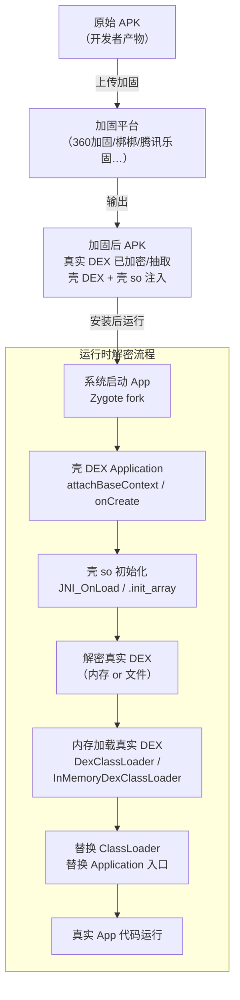
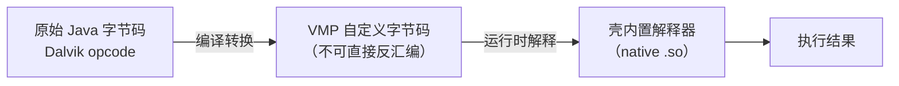
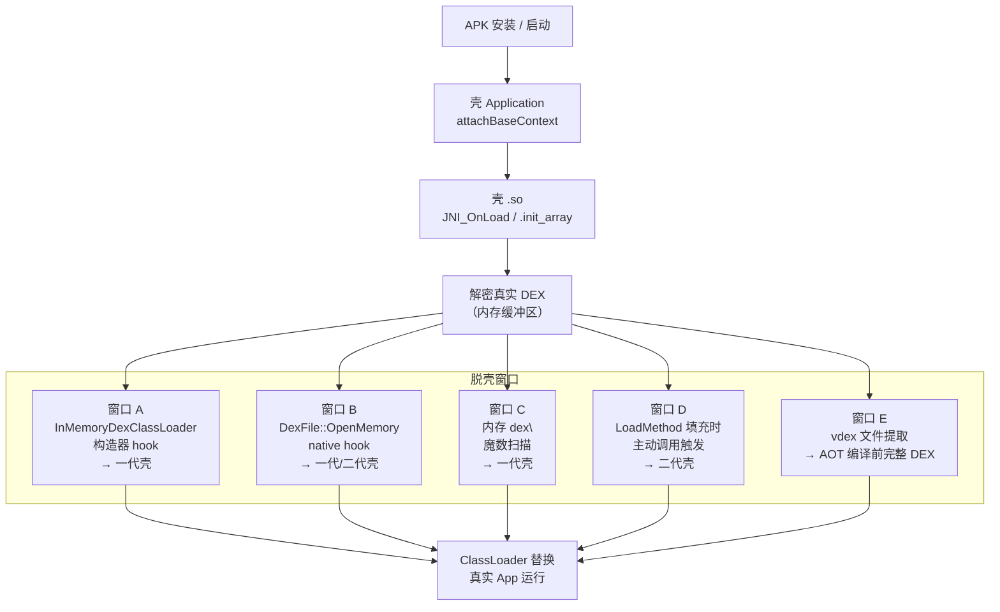
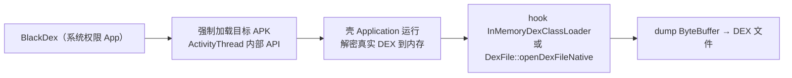

# Android逆向（11）· 加固与脱壳

> [!abstract] TL;DR
> - **加固（壳）** = 在发布前对 APK 施加保护层，目的是防止逆向/防止篡改，保护自有 App 知识产权；技术本质是：**加密/隐藏真实 DEX → 运行时还原并加载**。
> - 壳按强度分三代：**一代整体 DEX 加密**（把整个 dex 加密存 assets，运行时解密加载）、**二代函数抽取**（保留 DEX 结构但抽空方法体，按需填回）、**三代 VMP/dex2c**（自定义指令集解释器或 Java→native 转译，最难还原）。
> - **脱壳** = 在壳还原真实代码的时机，从内存中提取出来；核心原理：壳总要在某个时刻把真实 DEX 加载进内存，此刻即脱壳窗口。
> - 脱壳四条路：**内存 dex 魔数扫描 dump**、**主动调用还原抽取方法**、**ART 层 vdex/oat dump**、**Frida hook `defineClass`/`OpenMemory`**；各路对应不同壳代。
> - 本篇为**分析与防御视角**：讲清壳的工作机制与分析方法，以及给自有 App 的加固选型建议；所有脱壳操作须在**授权样本或自有 App** 上进行。

---

## 概述与定位

加固（App Hardening / Shell Protection）是移动应用安全的重要环节。开发者发布 App 后，任何人都可以用 jadx / apktool 轻松反编译 DEX，还原出可读的 Java 代码，直接暴露核心算法、密钥、通信协议。**壳技术**通过在 DEX 之外套一层保护层，把真实逻辑隐藏起来，使静态分析失效或大幅增加难度。

从攻防角度：

| 角色 | 目标 | 手段 |
|---|---|---|
| App 开发者 / 加固方 | 保护知识产权、防篡改 | 加密 DEX、函数抽取、VMP、so 加固 |
| 安全研究员 / 审计方 | 理解 App 行为、评估风险 | 脱壳、内存 dump、Frida hook、动态调试 |

本篇与 [[03.DEX文件格式]]、[[05.ART运行时]]、[[09.Frida动态插桩]]、[[34.现代二进制防护机制/00.现代二进制防护机制总览.md]] 深度互补：壳的实现原理建立在 DEX 格式与 ART 加载机制之上，脱壳工具多依赖 Frida 动态插桩。

---

## 原理与机制

### 壳的根本矛盾

Android 应用最终要**在 ART 上执行**。无论壳多复杂，真实的 DEX 字节码总需要在某个时刻以 ART 可执行的形式出现——**这个时刻就是脱壳的窗口**。壳的演进史，本质是不断缩小、模糊这个窗口的过程。

### 加壳运行总链路



> [!warning] 示例输出为示意

---

## 壳的演进与分类

### 一代壳：整体 DEX 加密

**原理**：把整个 `classes.dex` 用对称加密（AES/TEA 等）加密后存入 `assets/` 或 so 的数据段，APK 中只保留壳自身的 DEX（壳 Application）和解密逻辑（壳 so）。

**加壳运行步骤**：

1. 系统启动 App，加载壳 DEX，执行壳 Application 的 `attachBaseContext()`。
2. 壳 so 的 `JNI_OnLoad` / `.init_array` 解密出真实 DEX 字节数组（存放在内存缓冲区）。
3. 通过 `DexClassLoader`（Android 4.4 之前）或 `InMemoryDexClassLoader`（API 26+）加载内存中的真实 DEX，详见 [[03.DEX文件格式]] 中 DEX 内存布局。
4. 反射修改 `Application.mBase` 的 `ClassLoader`，以真实 DEX 的 ClassLoader 替换壳 ClassLoader。
5. 反射实例化真实 Application 类，继续正常启动，详见 [[06.应用启动与Zygote]]。

**特征**：
- `assets/` 中有加密文件（常见名：`classes.jar`、`base.apk`、`index.jar`）。
- 壳 `AndroidManifest.xml` 的 `android:name` 指向壳 Application 类（如 `com.stub.StubApp`）。
- 壳 so 名可识别：`libjiagu.so`（360）、`libshell-super.2019.so`（梆梆）、`libDexHelper.so`（爱加密）等。

**脱壳窗口**：`InMemoryDexClassLoader` 或 `DexClassLoader` 被调用的瞬间，内存中已有完整明文 DEX，dex 魔数 `64 65 78 0A`（`dex\n`）已出现在内存。

---

### 二代壳：函数抽取（抽取壳）

**核心思想**：DEX 文件结构保留，类/方法定义完整，但**方法体（code item）被置空或填充 NOP**，真实字节码存储在 so 的加密数据中，运行时在方法即将执行前才填回。

**细节机制**：

- 壳修改 ART 解释器（或通过 hook）在执行 `code_item` 之前调用壳的"填充函数"。
- 填充函数解密对应方法的字节码，写入内存中 DEX 的 `code_item` 区域。
- 执行完毕后可选择再次抹除（增加分析难度）。
- 干预点通常在 `ClassLinker::LoadMethod`、`ArtMethod::Invoke`、或 `interpreter::Execute` 层，指向 [[05.ART运行时]] 中解释器机制。

**抽取后的 DEX code item 示例**（伪字节，实际全零或 NOP）：

```
method_idx: 0x00A3  (com.real.Logic.compute)
registers_size: 0x0000
ins_size:       0x0000
outs_size:      0x0000
insns_size:     0x0000    ← 方法体长度为 0，code 已被抽走
```

**脱壳挑战**：单次内存 dump 只能拿到抽空的 DEX，必须等方法被调用时在填充点 hook 才能还原各方法字节码，需要**主动调用覆盖**（遍历调用所有方法触发填充）。

---

### 三代壳：VMP 与 dex2c

这是目前最强的保护方式，分两条技术路线：

#### 3a. VMP（Virtual Machine Protection）

**原理**：Java 字节码被编译为**自定义指令集**（与 Dalvik opcode 完全不同），运行时由壳内置的**自定义解释器**（native so 中实现）逐条解释执行。没有标准 DEX 字节码可 dump，逆向需要先分析自定义指令集语义。



> [!warning] 示例输出为示意

#### 3b. dex2c（Java to Native Transpilation）

**原理**：选取关键方法，把 Java 字节码翻译为等价的 C/C++ 代码，编译进 so，注册为 JNI native 方法。原始 DEX 中该方法被替换为 `native` 声明，真实逻辑消失在 ELF 的 `.text` 节中，需要逆向 native 代码。

```smali
# 加固前 smali
.method public compute(I)I
    .registers 3
    const/4 v0, 0x1
    add-int v0, v0, p1
    return v0
.end method

# dex2c 加固后：方法体消失，声明变 native
.method public native compute(I)I
.end method
```

三代壳分析通常需要 IDA Pro / Ghidra 对 so 做 native 逆向，与 [[07.JNI与native层]] 结合，见 [[11.ELF文件详解/00.ELF文件详解总览.md]]。

---

### so 加固、字符串加密与控制流混淆

除 DEX 层保护外，App 的 native `.so` 同样可以加固，配合 [[34.现代二进制防护机制/00.现代二进制防护机制总览.md]] 中各机制：

| 技术 | 作用 | 逆向影响 |
|---|---|---|
| **so 加壳（UPX/自定义打包器）** | 压缩/加密 so 段，运行时解压到内存 | 静态反汇编看到 stub，需 dump 运行时内存 |
| **字符串加密** | 字符串常量加密存储，调用前解密 | strings/ida strings 全为乱码，需动态 trace |
| **控制流混淆（OLLVM/Hikari）** | 插入虚假跳转、拆散基本块 | CFG 复杂化，反编译结果难读 |
| **反调试 / 反 Frida 探针** | 检测调试器 / Frida 特征，触发自毁 | 分析工具被检出，详见 [[12.反调试与反Frida对抗]] |

---

## 识别加固

分析一个 APK 时，首先判断是否加固、是哪家壳，再选对应脱壳策略。

### 快速识别方法

**1. 查看 AndroidManifest.xml 中 Application 类名**：

```bash
apktool d target.apk -o out/
grep "android:name" out/AndroidManifest.xml
```

> [!warning] 示例输出为示意
> 
> ```
> android:name="com.tencent.StubShell.TxAppEntry"   # 腾讯乐固
> android:name="com.qihoo.util.StubApp"              # 360加固
> android:name="com.secneo.apkwrapper.H"             # 梆梆
> ```

**2. 查看 lib/ 目录中 so 名**：

| so 文件名 | 对应加固厂商 |
|---|---|
| `libjiagu.so` / `libjiagu_x86.so` | 360加固保 |
| `libshell-super.*.so` | 梆梆加固 |
| `libDexHelper.so` | 爱加密 |
| `libapp2pro.so` | 通付盾 |
| `libtxprotect.so` / `libBugly.so` | 腾讯乐固 |
| `libmobisec.so` | 阿里聚安全 |

**3. 查看 assets/ 内容**：

加密的真实 DEX 常见命名：`classes.jar`、`base.apk`、`index.jar`、`0OO00l111l1l.jar`（混淆名）。

**4. 用 jadx 直接打开**：反编译出的类只有壳 stub，或只有空方法体，是二代壳的典型特征。

---

## 脱壳方法论（分析视角）

脱壳的核心原则：**找到壳将真实 DEX 还原到内存的那个时刻，把内存内容 dump 出来**。四条路对应不同壳代。

### 路线一：内存 dex 魔数扫描 dump（一代壳）

一代壳将整个 DEX 解密到内存后，内存中出现完整 DEX，其头部为固定魔数 `64 65 78 0A`（`dex\n`，见 [[03.DEX文件格式]] 魔数字段），后跟版本字节（`30 33 35 00` = `035\0`）和 Adler-32 校验和。

**Frida 脚本扫描内存（分析视角示意）**：

```javascript
// 扫描进程内存，找 dex\n 魔数并 dump
// 仅用于授权样本 / 自有 App 分析
Process.enumerateRanges('r--').forEach(function(range) {
    try {
        var buf = Memory.readByteArray(range.base, Math.min(range.size, 0x10));
        var arr = new Uint8Array(buf);
        // DEX 魔数: 64 65 78 0A (dex\n)
        if (arr[0] === 0x64 && arr[1] === 0x65 &&
            arr[2] === 0x78 && arr[3] === 0x0A) {
            // 读取 file_size 字段（header offset 0x20，小端 4 字节）
            var header = new Uint8Array(Memory.readByteArray(range.base, 0x70));
            var fileSize = header[0x20] | (header[0x21] << 8) |
                           (header[0x22] << 16) | (header[0x23] << 24);
            var dexData = Memory.readByteArray(range.base, fileSize);
            // 写出到文件（实际使用 frida File API 或转 base64 传出）
            console.log('[+] Found DEX at ' + range.base +
                        ' size=' + fileSize);
        }
    } catch(e) {}
});
```

> [!warning] 示例输出为示意
> 
> ```
> [+] Found DEX at 0x7b8a200000 size=1048576
> [+] Found DEX at 0x7b8b400000 size=524288
> ```

工具化实现参考：**FRIDA-DEXDump**（自动化扫描所有 dex，支持修复残缺头部）、**BlackDex**（基于 Android 8+ `InMemoryDexClassLoader` API 层 hook，免 frida-server root 方案）。

**DEX 头部关键字段快速参考**（完整布局见 [[03.DEX文件格式]]）：

| 偏移 | 字节 | 字段 | 说明 |
|---|---|---|---|
| 0x00 | 8 | magic | `64 65 78 0A 30 33 35 00`（`dex\n035\0`） |
| 0x08 | 4 | checksum | Adler-32，覆盖 0x0C 之后 |
| 0x0C | 20 | signature | SHA-1 |
| 0x20 | 4 | file_size | 文件总大小（用于 dump 长度） |
| 0x24 | 4 | header_size | 固定 `0x70` |
| 0x28 | 4 | endian_tag | `0x12345678`（小端） |

---

### 路线二：主动调用还原抽取方法（二代壳）

二代壳只有在方法被调用时才填充 code item，因此需要**主动触发所有方法**：

**策略**：
1. 枚举 DEX 中所有 ClassDef，通过反射或 Frida 逐一实例化每个类，调用每个方法。
2. 在 ART 层 hook `ClassLinker::LoadMethod` 或 `ArtMethod::SetEntryPointFromInterpreter`，每次填充完毕时捕获 `code_item` 内容。
3. 逐方法重建完整 DEX 的 code_item 表，最后用工具拼合。

**Frida hook ArtMethod（分析视角示意）**：

```javascript
// hook ART 解释器执行入口，捕获 code_item 填充时机
// API 层次依 Android 版本而异（此为示意）
var ArtMethod = Java.use('java.lang.reflect.Method');
// 实际 hook 点在 native 层 libart.so 的 Execute / LoadMethod
var libart = Module.findBaseAddress('libart.so');
// 需要根据目标 Android 版本确定符号偏移（通过分析 libart 符号表）
// 详见 05.ART运行时 中解释器入口分析
```

> [!warning] 示例输出为示意

工具化方案：**DexFixer**、**FDex2**（基于 hook `DexFile::OpenMemory` 捕获每次 dex 加载）。

---

### 路线三：ART / dex2oat 层 dump（vdex 还原）

Android 8.0+ 引入 `.vdex`（Verified DEX）格式，包含原始 DEX 字节的紧凑存储（去除冗余但保留 code item）。壳在 dex2oat 编译阶段之前必须提供完整 DEX，否则 AOT 编译失败。

**原理**（详见 [[05.ART运行时]] 中 AOT 编译流程）：

```
/data/app/<包名>/oat/<abi>/base.vdex   ← 包含接近原始的 DEX 结构
/data/app/<包名>/oat/<abi>/base.odex   ← AOT 编译的 oat 段
```

**提取命令（root 设备）**：

```bash
adb shell
run-as <包名>  # 可 debuggable 包
cp /data/app/<包名>-<hash>/oat/arm64/base.vdex /data/local/tmp/
exit
adb pull /data/local/tmp/base.vdex .
# 用 vdex extractor 还原 dex
python3 vdex_extractor.py -i base.vdex -o output/
```

> [!warning] 示例输出为示意
> 
> ```
> [*] Processing base.vdex (Oreo format, quicken)
> [+] Extracted classes.dex  (size: 1048576)
> [+] Extracted classes2.dex (size: 524288)
> ```

**局限性**：vdex 路径对一代壳效果好；二代壳在 dex2oat 前 code item 已抽空，vdex 中仍是空方法体。

---

### 路线四：Frida hook Java 类加载器

在 Java 层 hook `ClassLoader.defineClass` / `DexFile` 相关 API，拦截 DEX 加载事件：

**hook 点对应关系**：

| hook 点 | 对应 API/native | 适用场景 |
|---|---|---|
| `dalvik.system.DexFile` 构造器 | 加载文件路径 DEX | 一代壳（DexClassLoader） |
| `dalvik.system.InMemoryDexClassLoader` 构造器 | 加载内存 ByteBuffer | 一代壳（API 26+） |
| `libart.so DexFile::OpenMemory` | native DEX 加载入口 | 通用，含二代壳 |
| `libart.so ClassLinker::LoadMethod` | 方法加载时 | 二代壳方法体填充 |

**Frida hook InMemoryDexClassLoader（分析视角示意）**：

```javascript
Java.perform(function() {
    var InMemDexCL = Java.use(
        'dalvik.system.InMemoryDexClassLoader');
    InMemDexCL.$init.overload(
        'java.nio.ByteBuffer',
        'java.lang.ClassLoader').implementation = function(buf, parent) {
        // 读取 ByteBuffer 内容
        var capacity = buf.capacity();
        var bytes = Java.array('byte', new Array(capacity));
        buf.rewind();
        buf.get(bytes);
        // 写出到文件（示意）
        console.log('[+] InMemoryDexClassLoader size=' + capacity);
        // ... dump bytes ...
        return this.$init(buf, parent);
    };
});
```

> [!warning] 示例输出为示意

---

### 脱壳点位全景



> [!warning] 示例输出为示意

---

## 对抗：壳的反脱壳手段

壳知道自己会被上述手段分析，因此集成了多层对抗，与 [[12.反调试与反Frida对抗]] 深度结合：

| 对抗手段 | 目标 | 对分析的影响 |
|---|---|---|
| **反调试**（ptrace 自附加、`TracerPid` 检测） | 阻止调试器附加 | 动态调试不可用，详见 [[10.动态调试]] |
| **Frida 特征检测**（`/proc/self/maps` 扫描 `frida`、`gum-js` 字符串） | 检测 Frida 注入 | hook 脚本被发现后 App 自毁 |
| **完整性校验**（计算壳 so 的 CRC / 签名校验） | 检测 so 被 patch | patch 后校验失败 |
| **方法体主动抹除**（执行后再次清零 code item） | 对抗主动调用 dump | dump 时机需精确到毫秒级 |
| **多 dex 分片**（把真实 DEX 拆分为数十个小块） | 分散 dump 目标 | 需逐一捕获并拼合 |
| **SO 加壳**（壳 so 本身也被打包器保护） | 阻止分析 so 逻辑 | 需先对 so 做内存 dump 再逆向 |

绕过反调试/反 Frida 的分析方法见 [[12.反调试与反Frida对抗]]；底层 ptrace 机制见 [[44.调试器原理与实战/02.ptrace原理.md]]。

---

### VMP 逆向方法论

VMP（Virtual Machine Protection）把原始 Java 字节码替换为自定义指令集，由壳内置的 native 解释器执行。逆向 VMP 的核心是**还原自定义指令集的语义**，而非直接阅读 DEX 或 native 伪码。

**Step 1：识别 dispatch loop（分发循环）**

VMP 解释器通常是一个大的 `while(true)` + `switch` 结构：读取一个"opcode 字节"→按 case 分发到对应处理器。在 IDA/Ghidra 中识别特征：

```c
// IDA 伪码示意——VMP dispatch loop 典型结构
while (1) {
    uint8_t opcode = *pc++;          // 取指
    switch (opcode) {
        case 0x01: vm_add(ctx); break;    // 加法
        case 0x02: vm_load(ctx); break;   // 加载
        case 0x03: vm_store(ctx); break;  // 存储
        case 0x04: vm_call(ctx); break;   // 调用
        // ... 几十个到几百个 case
        default:   vm_halt(ctx); break;
    }
}
```

识别技巧：

```
- CFG 中有一个"枢纽基本块"被几十个 case 块指向（dispatch 点）
- 有一个固定"取指"模式：从指针 pc 取 1/2/4 字节后 pc 递增
- 所有 case 最后都跳回同一地址（循环头 = dispatch loop）
- IDA 的 switch 识别（View → Open Subviews → Problems → switch idiom）
```

**Step 2：建立 opcode 语义表**

对每个 case 逐一分析，推断其语义：

| opcode | case 内逻辑 | 语义 |
|---|---|---|
| `0x01` | `ctx->stack[sp++] = ctx->stack[sp-1] + ctx->stack[sp-2]; sp--` | 栈顶两值相加 |
| `0x10` | `ctx->regs[*pc++] = *(uint32_t*)ctx->heap_ptr` | 从堆加载 4 字节到寄存器 |
| `0x20` | `JNIEnv_CallMethod(env, ctx->stack[sp-1], ctx->methodID[*pc++])` | 调用 Java 方法 |

```python
# IDA Python 脚本：自动标注 VMP dispatch loop 中每个 case 的语义（示意）
import idc, idaapi, idautils

dispatch_addr = 0x12345  # dispatch loop 地址，需手动定位

# 枚举 dispatch_addr 处 switch 的所有 case 目标
for xref in idautils.XrefsTo(dispatch_addr, flags=0):
    # 找到每个 case 块，分析前几条指令，自动打注释
    case_addr = xref.frm
    # 分析 case 块的第一条访问（load/store/arith），推断语义
    insn = idaapi.insn_t()
    idaapi.decode_insn(insn, case_addr)
    # 按助记符模式打标签（此为示意逻辑）
    mnem = insn.get_canon_mnem()
    if "ADD" in mnem:
        idc.set_cmt(case_addr, "VM_ADD", 0)
    elif "LDR" in mnem:
        idc.set_cmt(case_addr, "VM_LOAD", 0)
```

**Step 3：还原 VMP 字节码为伪汇编**

建好语义表后，对 VMP 字节码流（通常存储在 `.data`/`assets` 的字节数组中）写脚本逐字节反汇编：

```python
# Python 脚本：简单 VMP 字节码反汇编器（示意）
OPCODE_TABLE = {
    0x01: ("ADD",    0),   # 无操作数
    0x02: ("LOAD",   1),   # 1字节操作数（寄存器索引）
    0x10: ("CALL",   2),   # 2字节操作数（方法ID）
    0x20: ("CONST",  4),   # 4字节操作数（立即数）
    0xFF: ("RETURN", 0),
}

def disasm_vmp(bytecode: bytes):
    pc = 0
    while pc < len(bytecode):
        op = bytecode[pc]; pc += 1
        if op not in OPCODE_TABLE:
            print(f"  0x{pc-1:04x}: UNKNOWN({op:#04x})")
            break
        mnem, operand_size = OPCODE_TABLE[op]
        if operand_size == 0:
            print(f"  0x{pc-1:04x}: {mnem}")
        elif operand_size == 1:
            arg = bytecode[pc]; pc += 1
            print(f"  0x{pc-2:04x}: {mnem} r{arg}")
        elif operand_size == 2:
            import struct
            arg = struct.unpack_from("<H", bytecode, pc)[0]; pc += 2
            print(f"  0x{pc-3:04x}: {mnem} #{arg:#06x}")
        elif operand_size == 4:
            arg = struct.unpack_from("<I", bytecode, pc)[0]; pc += 4
            print(f"  0x{pc-5:04x}: {mnem} #{arg:#010x}")
```

---

### dex2c 逆向与 DEX 修复

**dex2c 产物代码模式识别**：

dex2c 将 Java 方法翻译为 C，编译进 so，注册为 JNI native 方法。其产物在 IDA 中有以下识别特征：

| 特征 | 原始 Java 等价 | IDA 中的表现 |
|---|---|---|
| 大量 `JNIEnv->CallObjectMethod` 等调用 | 对象方法调用 | vtable 偏移调用，参数含 `jobject`/`jstring` |
| `env->FindClass` + `env->GetMethodID` 配对 | `new Foo()` 或 `Foo.bar()` | 函数开头的 class/method 查找序列 |
| 局部 `jvalue[]` 数组填充 | 多参数方法调用 | 栈上分配 `jvalue` 数组，逐项赋值后 `CallXxxMethodA` |
| `env->NewStringUTF` + `env->GetStringUTFChars` | String 处理 | 字符串来回转换 |
| 数组操作：`NewByteArray` / `SetByteArrayRegion` | `byte[]` 操作 | 成对出现 |

**dump DEX 后的修复流程**：

从内存 dump 出来的 DEX 可能头部字段不一致（checksum/signature 不匹配），需要修复：

```python
# Python 修复脚本：重算 DEX checksum 和 SHA-1 signature（示意）
import struct, hashlib, zlib

def fix_dex_header(path_in: str, path_out: str):
    with open(path_in, 'rb') as f:
        data = bytearray(f.read())

    # 1. 修正 file_size（偏移 0x20）
    file_size = struct.unpack_from('<I', data, 0x20)[0]
    if file_size != len(data):
        print(f"[!] file_size mismatch: header={file_size:#x}, actual={len(data):#x}")
        # 以实际大小为准，修正 file_size
        struct.pack_into('<I', data, 0x20, len(data))

    # 2. 重算 SHA-1 signature（偏移 0x0C，覆盖 0x20 之后 20 字节）
    sha1 = hashlib.sha1(data[0x20:]).digest()
    data[0x0C:0x20] = sha1

    # 3. 重算 Adler-32 checksum（偏移 0x08，覆盖 0x0C 之后）
    adler = zlib.adler32(bytes(data[0x0C:])) & 0xFFFFFFFF
    struct.pack_into('<I', data, 0x08, adler)

    with open(path_out, 'wb') as f:
        f.write(data)
    print(f"[+] Fixed DEX written to {path_out}")
    print(f"    file_size={len(data):#x}, sha1={sha1.hex()[:16]}..., adler32={adler:#010x}")
```

**string_ids 偏移修复**：

某些 dump 工具在 dump 时因内存重排导致 `string_ids`/`type_ids` 等偏移字段与实际数据位置不符，需用 `dexfixer` 类工具修复：

```bash
# dexfixer（开源工具，专门处理 dump DEX 的结构修复）
python3 dexfixer.py --input dumped.dex --output fixed.dex

# 验证修复结果
dexdump -d fixed.dex 2>&1 | head -30

# jadx 打开验证反编译质量
jadx -d out/ fixed.dex
```

**string_ids 偏移计算**（理解原理）：

```
DEX header 中：
  string_ids_size  @ 0x38：字符串个数
  string_ids_off   @ 0x3C：string_id_list 的文件偏移

每个 string_id = 4 字节，指向该字符串 data 的文件偏移。
若 dump 时 string data 段相对偏移变化（如内存对齐导致），
string_ids 中的偏移值仍指向旧位置 → 需重新计算每个 string_id 指向的偏移。
```

---

### BlackDex 免 root 原理与壳版本适配

**BlackDex 工作原理**：

BlackDex 是一款免 root 脱壳工具，利用 Android 系统自身的 App 安装与运行机制，无需 ptrace 注入。核心原理：

1. BlackDex 以**系统 App 权限**（或通过 `adb shell` 以 shell 用户）运行，调用 Android 内部 API（`android.app.ActivityThread`、`ClassLoader` 内部 API）强制加载目标 APK。
2. 目标 APK 被加载后，壳自动运行解密流程，将真实 DEX 映射到内存。
3. BlackDex 在 `InMemoryDexClassLoader`（API 27+）或 `DexFile.openDexFileNative` 等内部 ART API 处 hook（通过 Java 反射或 ART 内部函数），捕获解密后的 DEX ByteBuffer。
4. 将 ByteBuffer 内容 dump 到存储，完成脱壳。



**`InMemoryDexClassLoader`（API 27+）对壳迁移的影响**：

Android 8.0（API 26/27）引入 `InMemoryDexClassLoader`，允许从 `ByteBuffer` 直接加载 DEX，无需落盘为文件。这对壳和脱壳工具均有影响：

| 影响方向 | 说明 |
|---|---|
| **壳迁移**：API 27+ 设备 | 老壳用 `DexClassLoader` 需要先把 DEX 写入临时文件（`/data/data/<pkg>/`），Android 9+ 限制了这些路径的可执行权限（W^X）→ 壳被迫迁移到 `InMemoryDexClassLoader` |
| **脱壳工具适配** | 以前只需 hook `DexClassLoader` 构造器；现在还需同时 hook `InMemoryDexClassLoader.$init(ByteBuffer, ClassLoader)` |
| **API 27 以下设备** | `InMemoryDexClassLoader` 不可用，壳仍走文件路径；脱壳只需 hook `DexClassLoader` |

```java
// InMemoryDexClassLoader 构造器签名（API 27+）
InMemoryDexClassLoader(ByteBuffer dexBuffer, ClassLoader parent)
InMemoryDexClassLoader(ByteBuffer[] dexBuffers, ClassLoader parent)  // API 28+
```

**LSPosed 辅助脱壳**：

LSPosed（基于 Riru/Zygisk 的 Xposed 框架实现）可加载 Xposed 模块在 Zygote 阶段注入，比 Frida 更早介入 App 初始化。脱壳模块（如 `Dreamland`、自定义 Xposed 模块）在 `Application.attachBaseContext` 返回后 hook ART 内部 API，适合对抗在早期检测 Frida 的壳。

```
LSPosed 脱壳流程：
Zygote fork → LSPosed Zygisk 注入 → 脱壳 Xposed 模块加载
→ hook DexFile::openDexFileNative / InMemoryDexClassLoader
→ 目标 App Application.attachBaseContext（壳解密）
→ hook 命中，dump DEX
→ 真实 App 正常运行
```

**各脱壳方案对壳版本的适配矩阵**：

| 脱壳方案 | 一代整体加密 | 二代函数抽取 | 三代 VMP/dex2c | root 需求 |
|---|---|---|---|---|
| FRIDA-DEXDump | ✅ | 部分（空方法体） | ❌ | 是 |
| FDex2（hook OpenMemory） | ✅ | 部分 | ❌ | 是 |
| BlackDex | ✅（API 21+） | 部分 | ❌ | 否（需 adb 或系统权限） |
| vdex extractor | ✅ | ❌（方法体已抽） | ❌ | 是（root 读 vdex） |
| 主动调用 + hook LoadMethod | 部分 | ✅ | ❌ | 是 |
| LSPosed 脱壳模块 | ✅ | ✅（配合主动调用） | ❌ | 是（需 LSPosed 环境） |
| **VMP 自定义反汇编** | N/A | N/A | ✅（手动逆向） | 否（纯静态） |

dump 出来的 DEX 不一定完整，需要验证：

**1. 校验魔数与头部**：

```python
# 验证 DEX 头部完整性（Python 示意）
import struct, zlib

with open('dumped.dex', 'rb') as f:
    data = f.read()

magic = data[:8]
assert magic[:4] == b'dex\n', "魔数错误"
# header_size 固定 0x70
header_size = struct.unpack_from('<I', data, 0x24)[0]
assert header_size == 0x70, f"header_size 异常: {header_size:#x}"
# file_size
file_size = struct.unpack_from('<I', data, 0x20)[0]
assert len(data) >= file_size, "文件截断"
print(f"[+] DEX 版本: {magic[4:8]}, file_size={file_size:#x}")
```

> [!warning] 示例输出为示意
> 
> ```
> [+] DEX 版本: b'035\x00', file_size=0x100000
> ```

**2. Adler-32 校验（可选）**：DEX 头部 offset 0x08 处存储 Adler-32 校验和，覆盖 0x0C 之后内容，重新计算比对可判断 dump 是否完整。

**3. 工具验证**：用 jadx 或 dexdump 打开，能正常反编译所有类方法视为完整。

---

## 安全性与正确使用

### 防御加固建议（给自有 App）

> [!info] 加固选型原则
> 加固不是万能的——**所有代码最终在设备上运行，理论上都可以被还原**；加固的价值在于**大幅提高逆向成本**，使低技术门槛攻击失效，并争取响应时间。

| 保护目标 | 推荐手段 | 说明 |
|---|---|---|
| 防止核心算法被静态反编译 | 二代抽取壳 + 关键函数 dex2c | 核心逻辑下沉 native，不在 DEX 中出现 |
| 防止 so 被直接逆向 | so 字符串加密 + OLLVM 控制流混淆 | 提升 IDA 分析难度；见 [[11.ELF文件详解/00.ELF文件详解总览.md]] |
| 防止运行时 hook / 篡改 | 反 Frida 探测 + 完整性校验 | 与 [[12.反调试与反Frida对抗]] 结合 |
| 防止重打包/二次分发 | APK 签名校验（v2/v3） + 服务端验签 | 见 [[14.APK签名机制v1到v4]]；纯客户端校验可被绕过 |
| 密钥/证书保护 | 密钥不出现在 APK，服务端鉴权 | 再强的壳也挡不住内存 dump 密钥 |

**加固本质局限**：

- **密钥终究会在内存出现**：内存 dump 是无法被壳完全防住的（内存必须可读才能执行）。涉及密钥/证书的逻辑应优先做**服务端鉴权**，不要仅依赖本地加固。
- **三代壳维护成本高**：VMP 需要为每个 Android 版本、ART 内部变化维护兼容性，小团队慎用商业 VMP 后再次出现兼容性崩溃。
- **加固与性能的权衡**：函数抽取在每次方法首次调用时有解密延迟；VMP 解释执行比 JIT 慢 2–5 倍，对性能敏感路径（渲染/计算）须排除加固范围。

### 合规与边界

> [!caution] 合规边界
> - **只对自有 App 或明确授权的样本进行脱壳分析**，切勿对未授权的生产应用使用本文技术。
> - 恶意样本分析应在隔离沙箱环境中进行，dump 产物不得二次分发。
> - 脱壳产物仅用于安全评估报告和加固验证，不得绕过版权保护用于商业用途。
> - 在中国大陆，对他人 App 进行未授权逆向可能违反《网络安全法》《数据安全法》等法规。

---

## 小结

加固与脱壳是 Android 安全的核心攻防维度。理解壳的工作原理是设计合理加固方案的前提：

- **一代整体 DEX 加密**：实现简单，脱壳容易（内存魔数扫描）；适合低预算快速上线防护。
- **二代函数抽取**：增加了脱壳复杂度，需主动调用触发填充；是目前商业加固的主流。
- **三代 VMP/dex2c**：最强保护，逆向需要分析自定义指令集或 native 代码；适合核心业务逻辑保护，成本高。
- **脱壳的本质**：壳总要还原 DEX 才能运行，内存 dump + Frida hook + ART 层切入是分析的三条主线。
- **防御的本质**：加固是提高逆向成本而非实现绝对安全；密钥和敏感逻辑应走服务端设计。

分析视角上，识别加固厂商 → 选对脱壳路线 → 验证产物完整性 → 结合动态调试分析逻辑，是完整的分析链路。更深层的对抗（反调试、反 Frida）见 [[12.反调试与反Frida对抗]]。

---

## 相关阅读

- [[03.DEX文件格式]] — DEX 魔数、头部结构、class_def 布局，脱壳 dump 验证的基础
- [[05.ART运行时]] — ART 解释器、AOT 编译、vdex 格式，二代壳干预点与路线三脱壳原理
- [[09.Frida动态插桩]] — Frida hook 架构与 Java/native hook，脱壳脚本的实现基础
- [[10.动态调试]] — smali / native 动态调试，配合脱壳定位加密逻辑
- [[12.反调试与反Frida对抗]] — 壳集成的反分析手段与绕过策略
- [[34.现代二进制防护机制/00.现代二进制防护机制总览.md]] — so 层防护机制全景（CFI/ASLR/PIE/RELRO）
- [[11.ELF文件详解/00.ELF文件详解总览.md]] — so 加固的 ELF 结构基础
- [[07.JNI与native层]] — dex2c 产物的 JNI 注册与 native 逆向入口
- [[44.调试器原理与实战/02.ptrace原理.md]] — 壳反调试的底层机制
- [[14.APK签名机制v1到v4]] — 加固后 APK 的重签名与完整性验证

---

⬅️ 上一篇 [[10.动态调试]] ｜ 🏠 [[00.Android逆向与运行时总览]] ｜ 下一篇 [[12.反调试与反Frida对抗]] ➡️
