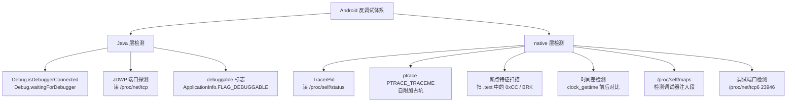
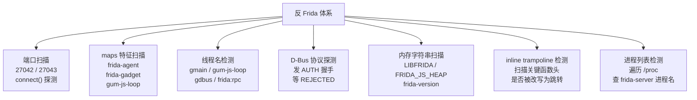
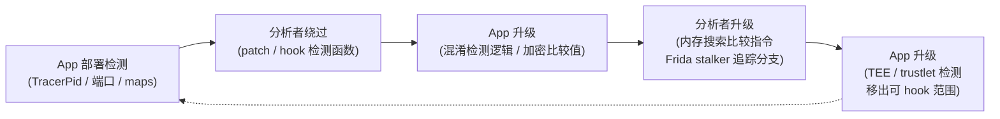

# Android逆向（12）· 反调试与反Frida对抗

> [!abstract] TL;DR
> - Android App 的**反调试**体系分两层：Java 层（`Debug.isDebuggerConnected()`/JDWP 端口检测）和 native 层（`ptrace` 自附加占坑、`TracerPid` 读取、时间差、断点特征扫描）。
> - **反 Frida** 体系独立于反调试但互补：端口扫描（27042/27043）、`/proc/self/maps` 特征串（`frida-agent`/`gum-js-loop`）、线程名检测（`gmain`/`gum-js-loop`/`gdbus`）、D-Bus 协议探测、内存字符串扫描，以及 inline trampoline 检测。
> - **检测 root/模拟器/Xposed** 作为配套环境检测层，覆盖 `su`/Magisk、QEMU 特征、`XposedBridge` 类加载。
> - **分析/授权评估视角的对抗手段**：patch 检测点、Frida hook 检测函数返回"干净"值、修改 frida-server 端口与特征串、Magisk Hide/Zygisk、早期注入（spawn 时机）。
> - 所有检测技术与对抗均在**防御/分析视角**下讨论；针对他人生产系统的武器化使用超出合规范围。

本篇是对抗层第二篇，承接 [[11.加固与脱壳]] 讲清的壳内防护出口，落在"App 如何感知分析行为并阻断"的运行时机制上；下篇 [[13.抓包与SSL_Pinning绕过]] 进入网络层对抗。必引基础：[[44.调试器原理与实战/11.调试器与反调试.md]] 讲清了 `ptrace`/断点特征/时间差的底层逻辑，本篇在 Android 场景下延伸；[[09.Frida动态插桩]] 讲清了 frida-server 的架构与注入原理，本篇是从"被检测侧"观察同一机制；[[10.动态调试]] 讲清了 JDWP/smali 调试流程；[[06.应用启动与Zygote]] 讲清了 Zygote fork 时机，决定了早期注入窗口。

---

## 概述与定位

### 技术分层全景

Android 反调试/反 Frida 防护由三个功能层构成：

| 层次 | 检测目标 | 典型实现位置 |
|---|---|---|
| 反调试（Java） | JDWP 调试器连接 | `Application.onCreate` / `Service.onCreate` |
| 反调试（native） | ptrace tracer、断点特征、时间差 | `JNI_OnLoad` / 独立守护线程 |
| 反 Frida | frida-server/gadget 的各类特征 | native 守护线程，周期扫描 |
| 环境检测 | root、模拟器、Xposed | Java + native 双层 |

四层通常**组合部署**：任意一层发现异常即触发防御行为（崩溃/逻辑变更/上报/静默退出）。

---

## 原理与机制

### 反调试技术全景



### 反 Frida 技术全景



---

## 反调试技术详解

### 1. TracerPid 检测

Linux 内核为每个进程在 `/proc/<pid>/status` 中维护 `TracerPid` 字段：进程未被跟踪时值为 0，被 `ptrace` 附加后记录 tracer 的 PID。读取 `/proc/self/status` 中该字段是 Android native 反调试最常见的起点。

```c
/* native 反调试：读取 TracerPid */
#include <stdio.h>
#include <string.h>

static int is_being_traced(void) {
    FILE *fp = fopen("/proc/self/status", "r");
    if (!fp) return 0;
    char line[256];
    while (fgets(line, sizeof(line), fp)) {
        if (strncmp(line, "TracerPid:", 10) == 0) {
            int pid = atoi(line + 10);
            fclose(fp);
            return pid != 0;   /* 非 0 = 被跟踪 */
        }
    }
    fclose(fp);
    return 0;
}
```

> [!warning] 示例输出为示意

`/proc/self/status` 中典型的 `TracerPid` 行（正常 vs 被附加）：

```
TracerPid:  0        # 正常进程
TracerPid:  3142     # 被 PID 3142 的调试器跟踪
```

> [!warning] 示例输出为示意

对应关系见 [[44.调试器原理与实战/11.调试器与反调试.md]] §进程/环境检测 中对 `/proc/self/status` 的通用讲解，Android 上逻辑完全一致。

### 2. ptrace 自附加占坑

`ptrace(PTRACE_TRACEME)` 的约束是**一个进程同时只能有一个 tracer**。App 启动早期，native 代码可以先调 `ptrace(PTRACE_TRACEME, 0, NULL, NULL)` 将自己"标记为可被父进程跟踪"，同时 fork 出一个子进程调 `ptrace(PTRACE_ATTACH, getppid(), ...)` 完成实际附加，从而占满 tracer 槽位——后来者（IDA/lldb）调 `PTRACE_ATTACH` 会得到 `EPERM`。

详细机制见 [[44.调试器原理与实战/02.ptrace原理.md]]。Android 场景下的典型部署：

```c
/* JNI_OnLoad 内调用，进程启动即占坑 */
static void anti_debug_self_attach(void) {
    pid_t child = fork();
    if (child == 0) {
        /* 子进程 attach 父进程 */
        pid_t parent = getppid();
        ptrace(PTRACE_ATTACH, parent, NULL, NULL);
        waitpid(parent, NULL, 0);
        /* 持续 waitpid 保持 tracer 身份 */
        while (1) {
            ptrace(PTRACE_CONT, parent, NULL, NULL);
            waitpid(parent, NULL, 0);
        }
    }
    /* 父进程继续正常运行 */
}
```

> [!warning] 示例输出为示意

### 3. Java 层 JDWP 检测

Java Debug Wire Protocol（JDWP）是 Android ADB 调试的传输层。`android.os.Debug` 提供两个直接 API：

| API | 含义 |
|---|---|
| `Debug.isDebuggerConnected()` | 当前是否有 JDWP 调试器已连接 |
| `Debug.waitingForDebugger()` | 进程是否在等待调试器（`android:debuggable="true"` + 主动挂起） |

除调用官方 API 外，更底层的做法是直接扫描 `/proc/net/tcp`（IPv4）或 `/proc/net/tcp6`（IPv6）中已监听的端口，JDWP 默认监听在系统分配的随机端口（可通过 ADB `jdwp` 命令查看），但 `jdwp` 隧道通常通过 socket 暴露在 `@jdwp-control` abstract domain socket。

```java
// Java 层反调试：双重检测
public static boolean isDebuggerAttached() {
    if (android.os.Debug.isDebuggerConnected()) return true;
    if (android.os.Debug.waitingForDebugger()) return true;
    // 检测 ApplicationInfo 标志位
    int flags = context.getApplicationInfo().flags;
    if ((flags & ApplicationInfo.FLAG_DEBUGGABLE) != 0) {
        // debuggable=true 的正式包是签名异常，视为检测触发点
        return true;
    }
    return false;
}
```

> [!warning] 示例输出为示意

### 4. 断点特征扫描

软件断点在 ARM32 上对应 `BKPT #0`（编码 `0xE1200070` 或 Thumb `0xBExx`），在 ARM64 上对应 `BRK #0`（编码 `0xD4200000`），在 x86 上是 `INT 3`（`0xCC`）。详见 [[44.调试器原理与实战/11.调试器与反调试.md]] §断点特征检测。

App 可在 native 层枚举自身代码段，扫描是否有字节被调试器改写：

```c
/* 扫描 .text 是否存在 ARM64 断点 BRK #0 = 0xD4200000 */
static int scan_breakpoints(const uint32_t *text, size_t len) {
    for (size_t i = 0; i < len / 4; i++) {
        if (text[i] == 0xD4200000u) return 1;  /* 发现 BRK */
    }
    return 0;
}
```

> [!warning] 示例输出为示意

实践中需从 `/proc/self/maps` 获取代码段范围，再用 `mprotect` 临时允许读取。

### 5. 时间差检测

单步执行（Step-over/Step-into）会使 CPU 在每条指令执行后陷入调试器，造成数量级的时延膨胀。App 可在关键逻辑前后插入高精度计时：

```c
#include <time.h>
static void timing_check(void) {
    struct timespec t1, t2;
    clock_gettime(CLOCK_MONOTONIC, &t1);
    /* 执行少量固定操作（空循环或哈希计算）*/
    volatile int x = 0;
    for (int i = 0; i < 1000; i++) x += i;
    clock_gettime(CLOCK_MONOTONIC, &t2);
    long ns = (t2.tv_sec - t1.tv_sec) * 1000000000L
              + (t2.tv_nsec - t1.tv_nsec);
    if (ns > 500000000L) {  /* 正常 < 1ms，单步可达数秒 */
        abort();
    }
}
```

> [!warning] 示例输出为示意

### 6. /proc/self/maps 调试器注入段检测

调试器注入的 agent（ptrace 注入、`dlopen` 注入的 .so）会在 `/proc/self/maps` 中留下映射条目。App 可扫描该文件的路径列，检测异常模块：

```c
/* 在 /proc/self/maps 中查找可疑段 */
static int maps_has_suspicious(const char *needle) {
    FILE *fp = fopen("/proc/self/maps", "r");
    if (!fp) return 0;
    char line[512];
    while (fgets(line, sizeof(line), fp)) {
        if (strstr(line, needle)) {
            fclose(fp);
            return 1;
        }
    }
    fclose(fp);
    return 0;
}
/* 调用：maps_has_suspicious("gdb")、maps_has_suspicious("lldb") */
```

> [!warning] 示例输出为示意

---

## 反 Frida 技术详解

Frida 的架构（frida-server 运行在设备上，注入 `frida-agent-<abi>.so` 到目标进程，建立 GLib/GObject 运行时）在 [[09.Frida动态插桩]] 中已详述。下面从被检测侧逐一拆解各类特征。

### 1. 默认端口探测（27042 / 27043）

frida-server 默认监听 TCP 27042（控制通道）和 27043（数据通道）。App 可主动 `connect()` 探测：

```c
#include <sys/socket.h>
#include <netinet/in.h>
#include <unistd.h>

static int frida_port_probe(int port) {
    int fd = socket(AF_INET, SOCK_STREAM, 0);
    if (fd < 0) return 0;
    struct sockaddr_in addr = {
        .sin_family = AF_INET,
        .sin_port   = htons(port),
        .sin_addr.s_addr = htonl(INADDR_LOOPBACK)
    };
    int r = connect(fd, (struct sockaddr*)&addr, sizeof(addr));
    close(fd);
    return r == 0;   /* 连接成功 = frida-server 在监听 */
}
/* 使用：frida_port_probe(27042) || frida_port_probe(27043) */
```

> [!warning] 示例输出为示意

### 2. /proc/self/maps 中的 Frida 模块特征

frida-agent 注入后会在目标进程地址空间留下以下典型路径/匿名段名：

| 特征串 | 来源 |
|---|---|
| `frida-agent` | `frida-agent-<abi>.so` 的映射路径 |
| `frida-gadget` | Gadget 模式（内嵌在 App 内） |
| `gum-js-loop` | Gum JavaScript 运行时线程段 |
| `FRIDA` | frida 标记的匿名映射区 |
| `frida-helper` | frida-helper-32/64 二进制段 |

扫描方式与上节 `maps_has_suspicious()` 相同，传入上述字符串逐一检测：

```c
const char *frida_maps_needles[] = {
    "frida-agent", "frida-gadget", "gum-js-loop",
    "FRIDA", "frida-helper", NULL
};
for (int i = 0; frida_maps_needles[i]; i++) {
    if (maps_has_suspicious(frida_maps_needles[i])) {
        /* 触发防御 */
    }
}
```

> [!warning] 示例输出为示意

### 3. 线程名检测

frida-agent 注入后在目标进程内会创建若干 GLib 内部线程，其名称具有固定模式：

| 线程名 | 作用 |
|---|---|
| `gmain` | GLib main loop 主线程 |
| `gum-js-loop` | Gum JavaScript 事件循环 |
| `gdbus` | GDBus 通信线程 |
| `frida:rpc` | Frida RPC 处理线程 |
| `pool-frida` | Gum 线程池 |

通过 `/proc/self/task/<tid>/comm` 或 `pthread_getname_np()` 枚举所有线程名：

```c
#include <dirent.h>
static int thread_name_has_frida(void) {
    char path[256], comm[32];
    DIR *d = opendir("/proc/self/task");
    if (!d) return 0;
    struct dirent *e;
    while ((e = readdir(d))) {
        if (e->d_name[0] == '.') continue;
        snprintf(path, sizeof(path),
                 "/proc/self/task/%s/comm", e->d_name);
        FILE *f = fopen(path, "r");
        if (!f) continue;
        fgets(comm, sizeof(comm), f);
        fclose(f);
        if (strstr(comm, "gmain") || strstr(comm, "gum-js") ||
            strstr(comm, "gdbus") || strstr(comm, "frida")) {
            closedir(d);
            return 1;
        }
    }
    closedir(d);
    return 0;
}
```

> [!warning] 示例输出为示意

### 4. D-Bus 协议探测

Frida 内部使用 GDBus（D-Bus over socket）进行组件间通信，监听在 abstract domain socket（Linux 特有，路径前缀为 `\0`）。可主动向该 socket 发送 D-Bus AUTH 握手包，根据响应判断 frida-server 是否存在：

```c
/* D-Bus 握手探测（简化示意） */
static int dbus_probe(void) {
    int fd = socket(AF_UNIX, SOCK_STREAM, 0);
    struct sockaddr_un addr = { .sun_family = AF_UNIX };
    /* frida 使用随机生成的 abstract socket，但特征包含 "frida" */
    /* 实际检测需枚举 /proc/net/unix 查找匹配项 */
    /* 此处为原理说明 */
    close(fd);
    return 0;
}
```

> [!warning] 示例输出为示意

实际实现需先从 `/proc/net/unix` 读取所有 abstract socket 路径，筛选包含 `frida` 字样的条目。

### 5. 内存字符串扫描

frida-agent 的 JavaScript 运行时（QuickJS/V8）在内存中驻留大量可识别的字面串，包括：

- `LIBFRIDA`（版本标记）
- `GLib-GObject`（GLib 初始化信息）
- `frida-version`（版本字符串）
- `Interceptor`（Gum API 名称）

通过扫描自身进程内存空间中的可读段，可以找到这些字符串的驻留：

```c
/* 在可读内存段中查找 frida 特征串 */
static int mem_scan_frida(void) {
    /* 从 /proc/self/maps 取各段的地址范围，
       对每个 r-- 或 r-x 段 memmem 搜索特征串 */
    const char *needle = "LIBFRIDA";
    /* ... 遍历 maps 段，memmem 搜索 ... */
    return 0; /* 简化 */
}
```

> [!warning] 示例输出为示意

### 6. Inline Trampoline 检测

Frida `Interceptor.attach()` 的底层机制是在目标函数入口写入跳转指令（ARM64 为 `LDR X16, #8; BR X16` 共 12 字节），详细机制见 [[32.hooks/00.总览.md]] 中 inline hook 章节。App 可对自身关键函数（或系统函数如 `open`/`read`）的前若干字节做哈希快照，在运行时定期校验：

```c
#include <stdint.h>
#include <string.h>

/* 保存函数入口前 16 字节的快照 */
static uint8_t orig_open[16];
static void snapshot_open(void) {
    memcpy(orig_open, (void*)&open, 16);
}
static int check_open_hooked(void) {
    return memcmp(orig_open, (void*)&open, 16) != 0;
}
```

> [!warning] 示例输出为示意

更精确的做法：检查函数头部是否以 `LDR X16` 或 `B` 跳转开头——与原始 ELF 中存储的指令编码不符即判定为 hook。

### 7. frida-server 进程检测

遍历 `/proc` 目录，对每个数字子目录读取 `/proc/<pid>/cmdline` 或 `/proc/<pid>/exe`，查找 `frida-server` 或其变体名称：

```c
static int proc_has_frida_server(void) {
    DIR *d = opendir("/proc");
    if (!d) return 0;
    struct dirent *e;
    while ((e = readdir(d))) {
        if (e->d_name[0] < '0' || e->d_name[0] > '9') continue;
        char path[64], cmdline[256];
        snprintf(path, sizeof(path), "/proc/%s/cmdline", e->d_name);
        FILE *f = fopen(path, "r");
        if (!f) continue;
        fgets(cmdline, sizeof(cmdline), f);
        fclose(f);
        if (strstr(cmdline, "frida-server") ||
            strstr(cmdline, "frida-helper")) {
            closedir(d);
            return 1;
        }
    }
    closedir(d);
    return 0;
}
```

> [!warning] 示例输出为示意

---

## 环境检测：Root / 模拟器 / Xposed

### Root 检测

| 检测点 | 说明 |
|---|---|
| 搜索 `su` 二进制 | 遍历 `PATH` 环境变量目录及 `/sbin`/`/system/xbin` 等固定路径 |
| `Runtime.exec("which su")` | 调用成功且有输出则存在 `su` |
| Magisk 特征 | 检测 `/data/adb/magisk`、`/sbin/.magisk`、`MagiskSU` 进程名 |
| `ro.build.tags` | 工厂镜像值为 `release-keys`，测试机/root 镜像为 `test-keys`/`dev-keys` |
| 检测 SafetyNet/Play Integrity | 通过 Google Play Integrity API 获得 TEE 背书的设备完整性评分 |

### 模拟器检测

Android 模拟器（QEMU/AVD）暴露多项硬件特征：

| 属性/特征 | 模拟器典型值 | 真机典型值 |
|---|---|---|
| `ro.product.model` | `Android SDK built for x86` | 具体机型名 |
| `ro.hardware` | `goldfish` / `ranchu` | Qualcomm/MTK 芯片名 |
| `ro.kernel.qemu` | `1` | 不存在 |
| `ro.product.manufacturer` | `Google` / `Genymotion` | 硬件厂商 |
| `/dev/socket/genyd` | Genymotion 特有设备节点 | 不存在 |
| 电话号码 | `+1 555-521-5554`（AVD 默认） | 真实号码 |
| CPU 核心数 | 通常 1–2 | 通常 4–8 |

```java
// Java 层模拟器检测：读 Build 属性
public static boolean isEmulator() {
    String hardware = Build.HARDWARE;
    String product  = Build.PRODUCT;
    return hardware.contains("goldfish") ||
           hardware.contains("ranchu")   ||
           product.contains("sdk")       ||
           "1".equals(SystemProperties.get("ro.kernel.qemu"));
}
```

> [!warning] 示例输出为示意

### Xposed 检测

Xposed Framework 的工作原理是替换 ART 的 `app_process`，在每个 Zygote fork 出的进程中注入 `XposedBridge.jar`（详细启动链见 [[06.应用启动与Zygote]]）。检测思路：

```java
// 检测 XposedBridge 类是否已被加载
public static boolean isXposedActive() {
    try {
        Class.forName("de.robv.android.xposed.XposedBridge");
        return true;
    } catch (ClassNotFoundException e) {
        return false;
    }
}

// 检测调用栈中是否有 Xposed 帧
public static boolean xposedInCallStack() {
    StackTraceElement[] stack = Thread.currentThread().getStackTrace();
    for (StackTraceElement e : stack) {
        if (e.getClassName().startsWith("de.robv.android.xposed"))
            return true;
    }
    return false;
}
```

> [!warning] 示例输出为示意

LSPosed（Magisk 模块化 Xposed）对 `XposedBridge` 类名保持兼容，上述检测同样有效；但 LSPosed 可借助 Zygisk 的隔离机制对部分检测返回干净结果，形成新一轮博弈。

---

## 检测与对抗的升级博弈



每一轮升级使分析成本上升，但理论上用户态检测总可被用户态对抗——因为分析者拥有和 App 相同的运行时权限（root）。TEE（Trusted Execution Environment）将检测逻辑移至可信执行区，是目前能有效缩小攻击面的方案，但开发成本极高，且结果仍需返回普通世界，返回通道依然可被拦截。

---

## 对抗思路（分析/授权评估视角）

> [!note] 本节面向**自有 App 安全评估和授权样本研究**，讲清每种检测点的绕过原理，用于评估检测有效性或分析恶意样本。针对他人系统的未授权操作超出合规范围。

### 1. Patch 检测点

最直接：用 Frida 或 `adb shell dd` 静态 patch 掉检测函数的返回值，令其恒返回"安全"：

```bash
# adb pull 目标 .so，用 IDA/Ghidra 定位检测函数偏移，
# 用 python-capstone/keystone 写 NOP 或 MOV R0,#0 patch
adb shell 'su -c cp /data/app/com.example.app/lib/arm64/libprotect.so /data/local/tmp/'
adb pull /data/local/tmp/libprotect.so
# ... patch 后 adb push 回去并重装 APK（需重签名）
```

> [!warning] 示例输出为示意

### 2. Frida hook 检测函数返回"干净"值

在 Frida 脚本中 hook 检测函数（Java 层或 native 层），让其直接返回 0（"未检测到"）：

```javascript
// hook Java 层检测
Java.perform(function () {
    var Debug = Java.use("android.os.Debug");
    Debug.isDebuggerConnected.implementation = function () {
        return false;
    };
});

// hook native 层 TracerPid 读取（hook open/read 或直接 hook 检测函数）
Interceptor.attach(Module.findExportByName(null, "open"), {
    onLeave: function (retval) {
        // 对 /proc/self/status 的 open 返回伪造 fd
    }
});
```

> [!warning] 示例输出为示意

### 3. 修改 frida-server 端口与特征串

frida-server 支持 `--listen=0.0.0.0:端口号` 参数更换默认端口，绕过基于 27042/27043 的端口扫描：

```bash
adb shell 'su -c /data/local/tmp/frida-server --listen=0.0.0.0:19999 &'
frida -H 127.0.0.1:19999 -p <pid>
```

> [!warning] 示例输出为示意

修改二进制层面的特征串（`frida-agent`/`gum-js-loop`）需要重编译 frida-gadget/frida-server，属于高成本操作，但能绕过 maps/线程名/内存字符串检测。社区有 `frida-mod`/`re-frida` 等重打包版本。

### 4. Magisk Hide / Zygisk

Magisk 的 MagiskHide（旧）或 Zygisk DenyList（新）可对目标 App 进行挂载点隐藏和属性欺骗：

```bash
# 在 Magisk App 中将目标 App 加入 DenyList
# Zygisk 在该 App 的 Zygote fork 之前隔离注入，
# 使目标进程看不到 Magisk 模块，su 二进制也从 bind mount 视图消失
```

> [!warning] 示例输出为示意

DenyList 对 `/proc/self/maps` 和进程列表检测效果好，但对纯 Java 层的 `XposedBridge` 类检测需配合 LSPosed 的 scope 隔离。

### 5. 早期注入抢在检测前（spawn 时机）

frida 的 `spawn` 模式在进程创建后、`Application.onCreate` 执行前暂停进程并注入，详见 [[06.应用启动与Zygote]] 的 Zygote fork 时机与 [[09.Frida动态插桩]] 的 spawn API：

```bash
frida -U --spawn com.example.app --no-pause -l hook_antidebug.js
# --spawn 在 Zygote fork 后暂停，注入脚本，
# 脚本先 hook 所有检测函数，再 resume 进程；
# 检测代码在 Application.onCreate 中执行时已被 hook 覆盖
```

> [!warning] 示例输出为示意

早期注入是绕过"在启动瞬间部署检测"的最有效手段，但 App 也可以把检测逻辑放在 `JNI_OnLoad` 或 `__attribute__((constructor))` 中，尝试抢在 Java 层 frida hook 之前触发。

---

## 安全性与正确使用

### 防御加固建议（自有 App）

> [!tip] 以下建议面向对自有 App 进行安全加固的开发者与安全团队。

1. **多层组合，不要单点**：单独任何一项检测都可被单独绕过，组合部署 Java + native + 环境检测可大幅提高绕过成本。
2. **检测结果不要即时崩溃**：延迟响应（继续正常运行一段时间后再触发）使分析者难以定位检测触发点；或改变逻辑而非崩溃（返回错误数据）。
3. **混淆检测代码**：字符串特征（`TracerPid`/`frida-agent`）需加密存储，运行时解密比对，防止静态分析定位。
4. **守护线程周期检测**：单次检测可被 race condition 绕过；持续周期性检测（每 1–5 秒）降低窗口期。
5. **TEE/Keystore 结合**：将密钥解密放入 Android Keystore 或 TEE，检测结果影响是否能获取密钥，把绕过成本推向硬件级别。
6. **Play Integrity API**：Google 的 TEE 背书设备完整性声明，是目前覆盖 root/解锁 bootloader/模拟器最全面的云端验证方案。

### 合规边界

| 场景 | 合规 | 不合规 |
|---|---|---|
| 对自有 App 做安全评估并绕过检测 | ✓ | |
| CTF 题目逆向 | ✓ | |
| 授权渗透测试（含 App） | ✓ | |
| 研究恶意样本（绕过其反调试以分析行为） | ✓ | |
| 未经授权对他人 App 绕过检测并修改行为 | | ✗ |
| 将绕过工具用于破解他人 DRM 或授权系统 | | ✗（版权法 / 合同法） |

分析能力的建立以**理解机制、防御自身、合规研究**为目的，本篇所有技术细节均在此框架内讨论。

---

## 小结

| 技术类别 | 核心原理 | 关键检测点 |
|---|---|---|
| 反调试 / TracerPid | 内核维护的 tracer PID 字段 | `/proc/self/status` |
| 反调试 / ptrace 占坑 | 一进程只能有一个 tracer | `ptrace(PTRACE_TRACEME)` |
| 反调试 / JDWP | Java 调试协议连接状态 | `Debug.isDebuggerConnected()` |
| 反调试 / 断点特征 | 调试器写入的 INT3/BRK 指令 | 扫描 `.text` 段字节 |
| 反调试 / 时间差 | 单步执行的时延膨胀 | `clock_gettime` 前后对比 |
| 反 Frida / 端口 | frida-server 默认监听端口 | `connect(27042)` |
| 反 Frida / maps | frida-agent .so 注入后的段映射 | 扫描 `/proc/self/maps` |
| 反 Frida / 线程名 | GLib 内部线程的固定命名 | 枚举 `/proc/self/task/*/comm` |
| 反 Frida / trampoline | Interceptor inline hook 改写函数头 | 校验函数头字节快照 |
| 环境检测 / root | su/Magisk 二进制特征 | 路径枚举 + 属性检测 |
| 环境检测 / 模拟器 | QEMU 硬件特征 | `ro.hardware` / `ro.kernel.qemu` |
| 环境检测 / Xposed | XposedBridge 类注入 | `Class.forName` |

反调试与反 Frida 本质上是**分析成本工程**：没有绝对不可绕过的检测，但组合多层、混淆特征、延迟响应、结合 TEE 可以将绕过成本推高到超出大多数攻击者的预算。

---

## 相关阅读

- [[44.调试器原理与实战/11.调试器与反调试.md]] — ptrace/断点/时间差的通用底层机制
- [[44.调试器原理与实战/02.ptrace原理.md]] — ptrace 系统调用原理与自附加详解
- [[09.Frida动态插桩]] — frida-server 架构、注入原理、脚本 API
- [[10.动态调试]] — JDWP/smali 调试流程、IDA/lldb attach 流程
- [[06.应用启动与Zygote]] — Zygote fork 时机与早期注入窗口
- [[11.加固与脱壳]] — 壳的防护体系与内存 dump 原理
- [[32.hooks/00.总览.md]] — inline hook / GOT hook / Xposed hook 机制全景
- [[34.现代二进制防护机制/00.现代二进制防护机制总览.md]] — ASLR/PIE/CFI 等底层防护
- [[11.ELF文件详解/17.got节.md]] — GOT 表结构，GOT hook 的底层目标

---

⬅️ 上一篇 [[11.加固与脱壳]] ｜ 🏠 [[00.Android逆向与运行时总览]] ｜ 下一篇 [[13.抓包与SSL_Pinning绕过]] ➡️
