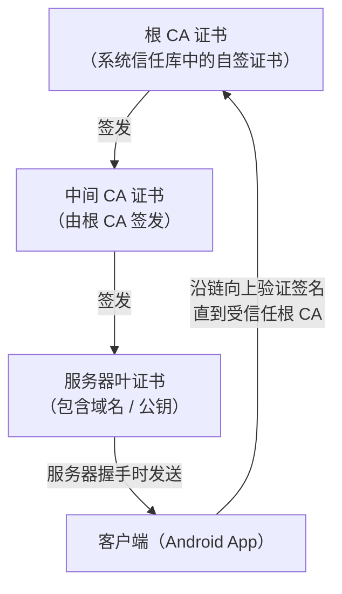
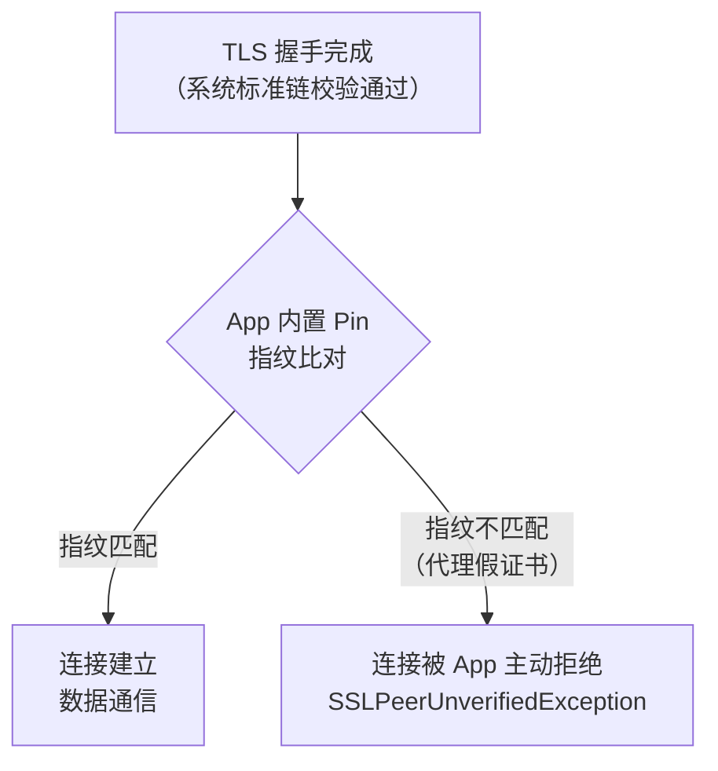
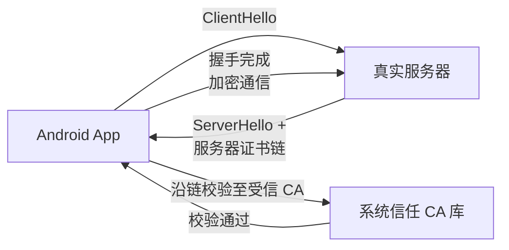
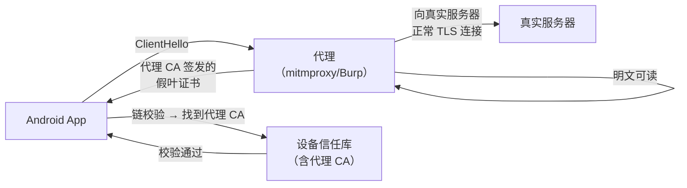
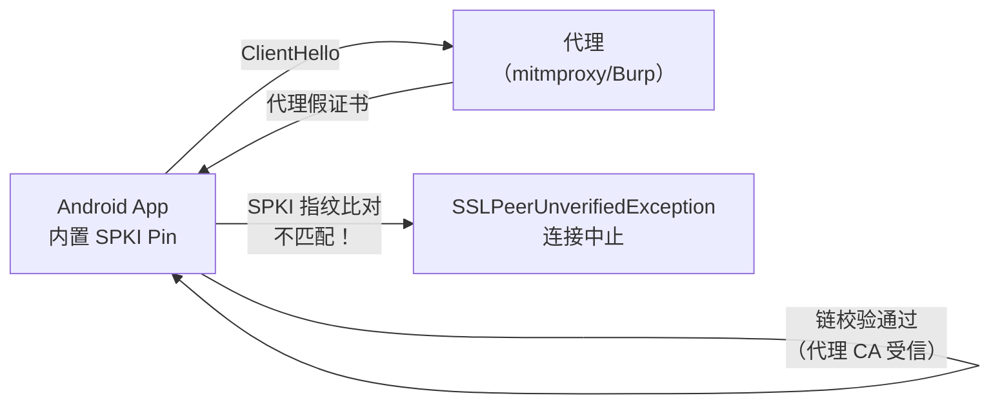
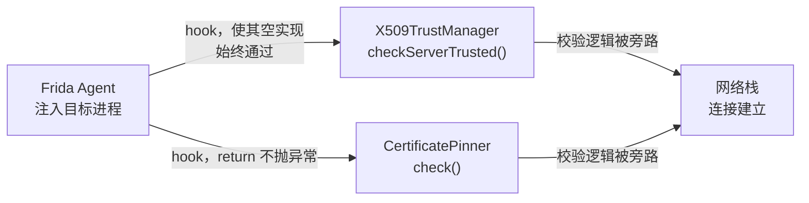

# Android逆向（13）· 抓包与SSL Pinning绕过

> [!abstract] TL;DR
> **抓包**是移动安全评估的核心手段：在客户端与服务端之间插入代理，将加密流量明文还原。然而 **SSL Pinning**（证书/公钥固定）让 App 在握手时额外校验服务器证书指纹，代理的伪造证书因指纹不符而被拒——这是对标准 TLS 信任链的"应用层加强"。本篇讲清**为何能抓包、为何 Pinning 会拦截、以及自有 App 评估时如何分析**，同时给出开发者正确实施 Pinning 的建议与合规边界。
>
> - TLS 证书链校验细节 → [[71.详解网络协议/15.TLS协议.md]]
> - SSL 历史与握手基础 → [[71.详解网络协议/14.SSL协议.md]]
> - 密码学签名与 PKI → [[37.密码学/00.密码学总览.md]]
> - Frida 动态插桩 → [[09.Frida动态插桩]]
> - native .so 层 → [[07.JNI与native层]]

---

## 1. 概述与定位

网络流量分析是 Android 安全评估的第一步：读取 API 请求/响应、观察认证令牌、发现业务逻辑漏洞，都依赖能看到明文 HTTP 流量。TLS 把流量加密，但**中间人代理**（MITM Proxy）通过掌控 CA 让客户端信任自己颁发的假证书，就能解密/重加密流量。

SSL Pinning 正是对这个攻击面的防御：App 不仅依赖操作系统的 CA 信任库，还在代码里内置了"我只信任特定证书/公钥指纹"的逻辑——任何不在白名单内的证书（包括代理的）都被拒绝建立连接。

> [!note] 本篇视角
> 所有"绕过"方法仅面向**授权安全评估**（渗透测试、漏洞赏金、自有 App 质量审计）。在未经授权的第三方 App 上操作属于违法行为。本文不提供针对他人生产系统的武器化步骤，而是讲清机制以帮助防御者理解攻击面并加固自身 App。

---

## 2. 抓包基础：中间人代理工作原理

### 2.1 常用代理工具

| 工具 | 平台 | 特点 |
| --- | --- | --- |
| **mitmproxy** | 跨平台（CLI/Web） | 开源、可编写 Python 脚本拦截/修改 |
| **Burp Suite** | 跨平台 | 安全测试标配，含 Repeater/Intruder |
| **Charles** | macOS/Win | GUI 直观，SSL 证书配置方便 |
| **Fiddler / Fiddler Everywhere** | Win/跨平台 | 微软系，深度 Windows 集成 |

### 2.2 MITM 抓包流程

```
Android 设备
  ↓ 设置 Wi-Fi 代理 → 192.168.x.x:8080（代理机 IP:端口）
代理工具（mitmproxy / Burp）
  ↓ 接受客户端连接，与客户端 TLS 握手（用代理自签 CA 颁发的假证书）
  ↓ 同时向真实服务器发起 TLS 连接（正常握手）
真实服务器
```

关键步骤：
1. **设系统代理**：进入 Android Wi-Fi 设置 → 长按热点 → 修改网络 → 代理（手动）→ 填代理 IP 和端口。
2. **安装代理 CA 证书到设备**：导出代理工具的 CA 根证书（`.cer`/`.pem`），通过 `adb push` 或浏览器下载推到设备，系统设置→安全→从存储安装证书。
3. App 通过代理发出 HTTPS 请求 → 代理用自签证书与 App 握手 → 系统验证该证书是否被信任 CA 签发。

```bash
# 推证书到设备（mitmproxy 示例）
adb push ~/.mitmproxy/mitmproxy-ca-cert.cer /sdcard/Download/mitmproxy.cer
# 设备端：设置 → 安全 → 从 SD 卡安装证书
```

> [!warning] 示例输出为示意

---

## 3. Android 7+ 证书信任变化

### 3.1 问题根源

Android 7.0（API 24）起，**默认的网络安全策略不再信任用户（手动）安装的 CA 证书**，只信任系统预装的 CA（位于 `/system/etc/security/cacerts/`）。这导致早期靠"把代理 CA 装进用户证书区"就能抓包的方法不再对 API≥24 的 App 有效——除非 App 主动声明信任用户证书。

```
/system/etc/security/cacerts/     ← 系统 CA（出厂预装，代理 CA 不在此）
/data/misc/user/0/cacerts-added/  ← 用户 CA（Android 7+ 默认不受 App 信任）
```

### 3.2 解决方案：network_security_config.xml

App 可在 `AndroidManifest.xml` 声明一个网络安全配置文件，显式信任用户 CA：

```xml
<!-- res/xml/network_security_config.xml -->
<network-security-config>
    <base-config cleartextTrafficPermitted="false">
        <trust-anchors>
            <certificates src="system"/>
            <certificates src="user"/>   <!-- 显式信任用户安装的 CA -->
        </trust-anchors>
    </base-config>
</network-security-config>
```

```xml
<!-- AndroidManifest.xml -->
<application
    android:networkSecurityConfig="@xml/network_security_config"
    ...>
```

> [!warning] 示例输出为示意

**评估场景下的做法（针对自有 App）**：
- 若可控源码：直接改配置文件重编译。
- 若只有 APK：用 `apktool` 反编译 → 改 `res/xml/network_security_config.xml`（或新建并在 `AndroidManifest.xml` 里引用）→ 重打包签名。见 [[08.静态分析工具]]。

### 3.3 把代理 CA 推入系统证书区（需 root）

若设备已 root，可直接把代理 CA 以系统 CA 格式写入 `/system/etc/security/cacerts/`：

```bash
# 转换为 OpenSSL hash 命名格式并推入系统证书目录（需 root + remount）
adb shell su -c "mount -o remount,rw /system"
adb push mitmproxy-ca-cert.pem /system/etc/security/cacerts/<hash>.0
adb shell su -c "chmod 644 /system/etc/security/cacerts/<hash>.0"
adb reboot
```

> [!warning] 示例输出为示意

---

## 4. TLS 证书链校验回顾

在理解 SSL Pinning 之前，需先回顾 TLS 正常的证书校验链（详见 [[71.详解网络协议/15.TLS协议.md]]）：



校验通过条件（同时满足）：
1. 证书链完整可达受信任的根 CA。
2. 链上每一级的数字签名有效（密码学签名原理见 [[37.密码学/00.密码学总览.md]]）。
3. 证书的 `CN`/`SAN` 与目标域名匹配（`HostnameVerifier`）。
4. 证书在有效期内且未被吊销。

> MITM 代理的伪造证书能通过 1–4，因为代理 CA 已被安装到设备信任库，且代理动态签发了匹配目标域名的叶证书。

---

## 5. SSL Pinning 原理

SSL Pinning 是在 TLS 标准校验之上增加"第五步"：**应用程序自己在握手完成后比对证书或公钥指纹**，不匹配则主动断开。



### 5.1 Certificate Pinning vs Public Key Pinning

| 类型 | 被固定的内容 | 优劣 |
| --- | --- | --- |
| **证书 Pinning** | 完整 X.509 证书（DER 编码后的 SHA-256 摘要） | 实现简单，但证书到期续签后必须同步更新 App |
| **SPKI Pinning**（推荐）| SubjectPublicKeyInfo 的 SHA-256 摘要（只比对公钥部分） | 证书续签时只要保持同一密钥对，Pin 就不需更换，工程成本低 |

SPKI（SubjectPublicKeyInfo）格式固定：`算法 OID + 公钥 bit-string`，比整张证书稳定得多。

---

## 6. Pinning 实现方式详解

### 6.1 OkHttp CertificatePinner（最常见）

OkHttp 是 Android 最流行的 HTTP 客户端。其 `CertificatePinner` 在 SPKI 层面做 SHA-256 比对：

```java
// CertificatePinner 配置示例
CertificatePinner pinner = new CertificatePinner.Builder()
    .add("api.example.com", "sha256/AAAAAAAAAAAAAAAAAAAAAAAAAAAAAAAAAAAAAAAAAAA=")
    .add("api.example.com", "sha256/BBBBBBBBBBBBBBBBBBBBBBBBBBBBBBBBBBBBBBBBBBB=") // 备份 pin
    .build();

OkHttpClient client = new OkHttpClient.Builder()
    .certificatePinner(pinner)
    .build();
```

握手完成后，`CertificatePinner.check()` 遍历服务器发来的证书链，提取每张证书的 SPKI，计算 `SHA-256`，与内置列表对比。不匹配则抛 `SSLPeerUnverifiedException`。

### 6.2 自定义 X509TrustManager

```java
// 完全自定义信任逻辑
TrustManager[] trustManagers = new TrustManager[]{
    new X509TrustManager() {
        @Override
        public void checkServerTrusted(X509Certificate[] chain, String authType)
                throws CertificateException {
            // 提取证书，比对指纹
            byte[] pin = chain[0].getPublicKey().getEncoded();
            if (!Arrays.equals(pin, EXPECTED_PIN)) {
                throw new CertificateException("Pinning failed");
            }
        }
        // ...
    }
};
SSLContext sslContext = SSLContext.getInstance("TLS");
sslContext.init(null, trustManagers, null);
```

### 6.3 network_security_config 的 pin-set

```xml
<network-security-config>
    <domain-config>
        <domain includeSubdomains="true">api.example.com</domain>
        <pin-set expiration="2027-01-01">
            <pin digest="SHA-256">主 pin 的 Base64...</pin>
            <pin digest="SHA-256">备份 pin 的 Base64...</pin>
        </pin-set>
    </domain-config>
</network-security-config>
```

系统在 TLS 握手后会自动比对，无需 App 代码显式调用，最简洁的实现方式。

### 6.4 HostnameVerifier 篡改

部分 App 用不安全的 `HostnameVerifier` 关闭域名校验，而不是实现 Pinning；还有 App 把主机名校验逻辑放进自定义 `HostnameVerifier`，两者都可能是绕过点：

```java
// 危险示例（自签测试环境常见但生产不应出现）
hostnameVerifier = (hostname, session) -> true; // 完全不校验域名
```

### 6.5 native 层 Pinning

部分高防护 App 将证书校验移入 `.so`，通过 JNI 调用 OpenSSL / BoringSSL 的 C API 实现，使 Java 层的 hook 失效：

```
Java 层请求 → JNI → libssl.so / libapp-native.so 内部校验
                       ↑
               需要在 .so 层面 hook（指向 [[07.JNI与native层]] + [[09.Frida动态插桩]]）
```

native Pinning 通常 hook 的目标函数：`SSL_CTX_set_verify`、`SSL_get_peer_certificate`、`X509_verify_cert` 或自研的对比函数（逆向定位见 [[11.ELF文件详解/17.got节.md]] GOT 劫持思路）。

---

## 7. 四种场景的 Mermaid 对比图

### 7.1 正常 TLS 握手（无 Pinning）



### 7.2 MITM 抓包场景（用户 CA 已安装 / Pinning 未启用）



### 7.3 SSL Pinning 阻断代理（Pinning 已启用）



### 7.4 Frida Hook 绕过 Pinning



---

## 8. 绕过方法（自有 App 评估 / 授权测试视角）

> [!warning] 合规前提
> 以下方法仅适用于**你拥有、开发或获得书面授权测试的 App**。未授权操作他人 App 违反《网络安全法》等法律法规。

### 8.1 Frida hook 通杀 TrustManager

最常用的方式：在 Java 层 hook `checkServerTrusted` 使其不抛异常，所有 TLS 校验都形同虚设：

```javascript
// Frida 脚本：通杀 X509TrustManager（概念示意，实际需处理多个实现）
Java.perform(function () {
    var X509TrustManager = Java.use('javax.net.ssl.X509TrustManager');
    // OkHttp3 的 JSSE 内部 TrustManager
    var CertificatePinner = Java.use('okhttp3.CertificatePinner');

    // 使 checkServerTrusted 成为空方法（不抛异常即通过）
    CertificatePinner.check.overload(
        'java.lang.String', 'java.util.List'
    ).implementation = function (hostname, peerCertificates) {
        console.log('[Frida] CertificatePinner.check bypassed for ' + hostname);
        // 不调用 this.check，不抛异常
    };
});
```

```bash
frida -U -f com.example.app --no-pause -l bypass_pinning.js
```

> [!warning] 示例输出为示意

### 8.2 objection 一键绕过

`objection` 是基于 Frida 的移动安全测试框架，内置了 SSL Pinning 绕过命令：

```bash
# 注入并绕过
objection -g com.example.app explore
# 进入 objection shell 后：
android sslpinning disable
```

> [!warning] 示例输出为示意

`objection android sslpinning disable` 内部同时 hook 了：
- `TrustManagerImpl.checkServerTrusted`
- `OkHttp3 CertificatePinner.check`
- `HttpsURLConnection.setSSLSocketFactory`
- 以及其他常见框架的校验入口

### 8.3 重打包：修改 network_security_config

适用于无 root 设备、不想用 Frida 的静态方案：

```bash
# 1. 反编译 APK
apktool d target.apk -o target_out

# 2. 修改或创建 res/xml/network_security_config.xml
#    添加 <certificates src="user"/> 并删除 <pin-set>

# 3. 确保 AndroidManifest.xml 中引用了该配置
#    android:networkSecurityConfig="@xml/network_security_config"

# 4. 重打包并重签名
apktool b target_out -o target_patched.apk
apksigner sign --ks test.keystore target_patched.apk
adb install target_patched.apk
```

> [!warning] 示例输出为示意

> [!note] 重打包限制
> 某些 App 有签名校验（APK 完整性检查）或运行时签名验证，重签后会拒绝启动，此时需结合 Frida 绕过签名检查（见 [[11.加固与脱壳]]）。

### 8.4 native 层 Pinning 的绕过思路

若 Java 层 hook 无效，说明校验已移至 `.so`，需要：

1. **定位目标函数**：用 Frida 枚举模块导出函数，或用 jadx/IDA 逆向 `.so` 找 `SSL_CTX_set_verify`、`verify_callback`、自研指纹比对函数（逆向方法见 [[07.JNI与native层]] / [[08.静态分析工具]]）。

2. **hook native 函数**：使用 Frida 的 `Interceptor.attach` 在 C 函数级别 hook：

```javascript
// 概念示例：hook BoringSSL 证书校验回调
var SSL_CTX_set_verify = Module.findExportByName('libssl.so', 'SSL_CTX_set_verify');
if (SSL_CTX_set_verify) {
    Interceptor.attach(SSL_CTX_set_verify, {
        onEnter: function (args) {
            // args[1] 是 verify_mode，args[2] 是回调函数指针
            // 将 verify_mode 设为 SSL_VERIFY_NONE (0)
            args[1] = ptr(0);
            args[2] = ptr(0);
            console.log('[Frida] SSL_CTX_set_verify patched to VERIFY_NONE');
        }
    });
}
```

> [!warning] 示例输出为示意

3. **GOT 劫持**：若函数通过 PLT/GOT 调用，可直接写 GOT 表项改变函数指针（原理见 [[11.ELF文件详解/17.got节.md]]），使校验函数被替换为永远返回成功的 stub。

详细 Frida native hook 方法见 [[09.Frida动态插桩]]。

---

### HTTP/2 与 QUIC/HTTP3 抓包

现代 Android App 越来越多地使用 **HTTP/2** 甚至 **HTTP/3（QUIC）**，这给传统抓包工具带来额外挑战。

**HTTP/2 的二进制帧与 HPACK 压缩**：

HTTP/2 不再使用可读的文本格式，而是将请求/响应封装为二进制**帧（Frame）**，头部字段经过 HPACK 压缩（使用静态表 + 动态表减少冗余）。代理工具必须实现完整的 HTTP/2 协议栈才能解析。

| 工具 | HTTP/2 支持 | HPACK 解析 | 注意事项 |
|---|---|---|---|
| mitmproxy ≥ 5.0 | ✓ | ✓ | 默认启用，流量可在 Web UI 中查看 |
| Burp Suite Pro ≥ 2021.2 | ✓ | ✓ | 需开启 HTTP/2 选项，拦截规则与 H1 共享 |
| Charles ≥ 4.6 | 部分 | 部分 | H2 支持不完整，复杂场景可能降级为 H1 |

**HTTP/2 "抓不到"的典型原因**：

OkHttp 的 H2 连接池可能导致代理工具虽然建立了连接，但请求仍通过已有的 H2 连接发送（连接复用，见下节）。若代理工具仅在 TCP 层代理而未完整协商 ALPN `h2`，App 会认为代理不支持 H2 而尝试降级或报错。解决方案：确保代理工具在 TLS ClientHello 的 ALPN 中声明 `h2`，mitmproxy 默认已处理。

**QUIC/HTTP3 抓包的现实局限**：

QUIC 基于 **UDP**，标准的系统代理设置（Wi-Fi 代理）只影响 TCP 流量。因此：
- 使用 QUIC 的流量**完全绕过** Wi-Fi 代理配置
- mitmproxy/Burp 目前（2025）不支持透明代理 QUIC 流量
- 实用方案：通过 iptables 将 UDP 443 重定向，或直接在 App 层 hook `SSLContext`/BoringSSL 在 QUIC 握手完成后截取明文数据

```bash
# 强制 App 降级到 HTTP/1.1（测试用）：通过 iptables 丢弃 UDP 443 包，
# 使 App 的 QUIC 握手超时后自动回退到 TCP TLS
iptables -I OUTPUT -p udp --dport 443 -j DROP
```

> [!warning] 示例输出为示意

---

### OkHttp 连接复用与 Certificate Transparency

**连接复用导致"抓不到"问题**：

OkHttp 维护一个 `ConnectionPool`（默认：最多 5 个空闲连接，存活 5 分钟）。若 App 在代理设置生效之前已经建立了到服务器的 HTTP/2 连接，后续请求会复用该连接而**不经过代理**，导致抓包工具看不到这些请求。

定位与绕过方法：
1. **重启 App**：关闭再打开 App，旧连接池清空，强制重新握手经过代理
2. **Hook 连接池**：用 Frida hook `okhttp3.ConnectionPool.put/get`，在 put 时丢弃所有连接，强制每次请求新建连接

```javascript
// 强制 OkHttp 不复用连接（仅用于评估）
Java.perform(function () {
    var RealConnectionPool = Java.use("okhttp3.internal.connection.RealConnectionPool");
    RealConnectionPool.put.implementation = function (connection) {
        console.log("[OkHttp] 阻止连接入池，强制新建");
        // 不调用 this.put，丢弃该连接
    };
});
```

> [!warning] 示例输出为示意

**Certificate Transparency（CT）SCT 校验**：

CT 是比 Pinning 更难绕过的机制。服务器在证书中内嵌（或通过 TLS 扩展传递）**SCT（Signed Certificate Timestamp）**，证明该证书已被记录在公开的 CT Log 中。Android 9（API 28）起，Chrome 会验证 SCT；部分 App 通过 OkHttp 自定义 `CertificateChainCleaner` 或网络安全配置强制要求 CT。

代理生成的伪证书**没有有效 SCT**（未提交到 CT Log），若 App 实施了 CT 校验，标准 Frida TrustManager hook 仍需额外 hook CT 验证逻辑：

```javascript
// hook Android 的 CT 校验（如有）
Java.perform(function () {
    try {
        var CTPolicy = Java.use("com.android.org.conscrypt.ct.CTPolicy");
        CTPolicy.doesResultConformToPolicy.implementation = function () {
            return true;   // 跳过 CT 合规性检测
        };
    } catch (e) {
        console.log("CT hook 不适用于当前版本: " + e);
    }
});
```

> [!warning] 示例输出为示意

---

### BoringSSL hook 与 WebSocket/代理检测

**Android 使用 BoringSSL 而非 OpenSSL**：

Android 6.0 起系统 TLS 实现切换为 **BoringSSL**（Google fork 自 OpenSSL），位于 `/system/lib64/libssl.so` 和 `libcrypto.so`。两者 API 层面大体兼容，但有以下关键差异影响 hook 策略：

| 差异点 | BoringSSL | OpenSSL |
|---|---|---|
| 符号可见性 | 大量内部函数使用 hidden visibility，`dlsym` 找不到 | 符号默认可见 |
| 版本号函数 | `OPENSSL_version_num()` 返回 0（故意屏蔽） | 返回真实版本 |
| 私有 API | `SSL_get_server_random` 等函数可能未导出 | 通常导出 |

由于 BoringSSL 符号可见性受限，直接用 `Module.findExportByName("libssl.so", "SSL_CTX_set_verify")` 可能返回 `null`。替代策略：

```javascript
// 通过模式扫描定位 BoringSSL 内部函数（基于特征字节序列）
var libssl = Process.getModuleByName("libssl.so");
// 或扫描 .so 中的导出符号前缀
libssl.enumerateExports().forEach(function (exp) {
    if (exp.name.indexOf("SSL_") !== -1) {
        console.log(exp.name + " @ " + exp.address);
    }
});
```

> [!warning] 示例输出为示意

**WebSocket 抓包**：

WebSocket 在 HTTP Upgrade 握手后升级为持久连接，后续帧不走 HTTP 请求-响应模型。mitmproxy/Burp 支持 WebSocket 拦截，但需要注意：
- 代理必须正确处理 `Connection: Upgrade` 和 `Upgrade: websocket` 头
- Burp Suite 的 WebSocket History 面板可独立查看 WS 帧
- OkHttp 的 `WebSocketListener` 可被 Frida hook 以在 Java 层截取已解密的帧内容（无需处理 BoringSSL）

```javascript
// 在 Java 层 hook OkHttp WebSocket 接收到的消息
Java.perform(function () {
    var WebSocketListener = Java.use("okhttp3.WebSocketListener");
    WebSocketListener.onMessage.overload("okhttp3.WebSocket", "java.lang.String")
        .implementation = function (ws, text) {
            console.log("[WS onMessage] " + text);
            this.onMessage(ws, text);
        };
});
```

> [!warning] 示例输出为示意

**代理检测绕过（透明代理 / iptables 重定向）**：

部分 App 通过 `System.getenv("http_proxy")`、`ProxySelector` 或 `ConnectivityManager` 检测系统代理设置是否存在，若检测到代理则拒绝发送流量或切换到备用逻辑。

绕过方案：改用**透明代理**，无需在系统设置中配置代理，而是通过 iptables 在网络层将流量重定向：

```bash
# 在路由器或具备 iptables 的设备上（需 root）
# 将 TCP 443 流量重定向到 mitmproxy 的透明代理端口（8080）
iptables -t nat -A PREROUTING -p tcp --dport 443 -j REDIRECT --to-port 8080

# mitmproxy 以透明模式启动
mitmproxy --mode transparent --listen-port 8080
```

> [!warning] 示例输出为示意

App 通过 `System.getProperty("http.proxyHost")` 读取到的代理配置为空，但流量已在网络层被重定向，App 无法通过常规 API 感知代理存在。针对 `NetworkSecurityConfig` 检测代理证书，需配合将代理 CA 推入系统证书区（见本篇 §3.3）。

---

## 9. 双向认证（mTLS）与 Client Certificate

### 9.1 什么是 mTLS

标准 TLS 只有服务端向客户端提供证书；**mTLS（双向 TLS / Mutual TLS）**要求客户端也向服务端提供客户端证书：

```
客户端 → ClientHello
         ← ServerHello + 服务器证书 + CertificateRequest
客户端 → 客户端证书 + CertificateVerify（用客户端私钥签名）
```

### 9.2 Android App 中的 client cert

App 通常将客户端证书（PKCS#12 格式的 `.p12`/`.pfx` 文件）内置在 assets 或 raw 资源中，并在建立 `SSLContext` 时通过 `KeyManager` 加载：

```java
// 加载内置 PKCS#12 client cert 概念示例
KeyStore keyStore = KeyStore.getInstance("PKCS12");
keyStore.load(context.getAssets().open("client.p12"), PASSWORD);
KeyManagerFactory kmf = KeyManagerFactory.getInstance("X509");
kmf.init(keyStore, PASSWORD);
SSLContext ctx = SSLContext.getInstance("TLS");
ctx.init(kmf.getKeyManagers(), trustManagers, null);
```

### 9.3 评估时提取 client cert

若 App 内置了客户端证书，可以：
1. 从 APK 解压 assets 目录，找 `.p12`/`.pfx` 文件。
2. 逆向找密码（通常硬编码在 Java 或 native 层），用 `openssl` 提取。
3. 将客户端证书导入代理工具（mitmproxy/Burp 支持配置 client cert）。

```bash
# 从 APK 提取 assets（apktool 已反编译）
ls target_out/assets/
# openssl 查看证书内容（需密码）
openssl pkcs12 -in client.p12 -info -nokeys
```

> [!warning] 示例输出为示意

---

## 10. 安全性与正确使用

### 10.1 给开发者的正确 Pinning 建议

> [!tip] 开发者建议
>
> 1. **优先使用 SPKI Pinning（公钥固定）而非证书固定**：证书每次续签都会变，而公钥对可以保持不变，更新成本更低。OkHttp 的 `CertificatePinner` 默认即为 SPKI（`sha256/` 前缀对应 SPKI 指纹）。
>
> 2. **至少配置一个备份 Pin**：生产主 Pin + 至少一个备用 Pin（对应下一轮密钥对）。若只有一个 Pin 且证书密钥被轮换，所有旧版 App 将无法联网——形成自我 DoS。`network_security_config` 的 `<pin-set expiration>` 可设置过期时间触发警报。
>
> 3. **加 native 层校验增强抵抗力**：Java 层 hook 相对容易（objection 一键），将关键校验逻辑下沉到 `.so`（通过 BoringSSL / OpenSSL C API）可提升绕过门槛。
>
> 4. **不要完全禁用系统证书校验**：自定义 `TrustManager` 时必须在 Pinning 逻辑之外保留标准链校验（`checkValidity`/`checkServerTrusted` 的 super 逻辑），避免引入更大的安全漏洞（完全接受任何证书）。
>
> 5. **正确的 HostnameVerifier**：不要用 `(hostname, session) -> true` 这类"永远通过"的实现替代正确的域名校验。
>
> 6. **debug 构建可放宽、release 构建严格**：`network_security_config` 支持 `<debug-overrides>` 节点，仅对 debuggable 构建信任用户 CA，不影响生产包。

```xml
<!-- 推荐：debug 环境允许用户 CA，生产严格 -->
<network-security-config>
    <debug-overrides>
        <trust-anchors>
            <certificates src="user"/>
        </trust-anchors>
    </debug-overrides>
    <domain-config>
        <domain includeSubdomains="true">api.example.com</domain>
        <pin-set expiration="2028-01-01">
            <pin digest="SHA-256">主 SPKI 指纹 Base64…</pin>
            <pin digest="SHA-256">备用 SPKI 指纹 Base64…</pin>
        </pin-set>
    </domain-config>
</network-security-config>
```

### 10.2 检测要点（防御方）

若要在运行时检测 Pinning 是否被绕过，可考虑：
- 随机对已知正确 Pin 做自检断言（校验结果应抛异常才正确，被 hook 后不抛可检测）。
- 与反调试 / 反 Frida 检测结合（见 [[12.反调试与反Frida对抗]]）。
- 在 native 层实现校验心跳，Java 层无法感知 hook 到 native 层的修改。

### 10.3 合规边界

| 场景 | 合法性 |
| --- | --- |
| 对自己发布的 App 进行安全评估 | 合法 |
| Bug Bounty 计划明确允许的范围内 | 合法（遵守范围约束） |
| 企业委托对自家 App 的渗透测试 | 合法（需书面授权） |
| 对第三方 App 未经授权操作 | **违法**（《网络安全法》第 27 条等） |
| 用于绕过 DRM / 版权保护 | **违法**（著作权法） |

---

## 11. 小结

| 层次 | 机制 | 评估手段 |
| --- | --- | --- |
| 系统 CA 校验 | TLS 握手标准链校验 | 安装代理 CA（Android 7+ 需显式声明或 root） |
| Java 层 Pinning | OkHttp / 自定义 TrustManager / NSC pin-set | Frida hook / objection / 重打包 |
| native 层 Pinning | .so 内 BoringSSL 回调 | Frida native hook / GOT 劫持 |
| 双向认证（mTLS） | 客户端证书 + 私钥 | 从 APK 提取 .p12 + 逆向密码 |

SSL Pinning 不是银弹，在有物理访问权限和 root 的设备上它是可以被分析的——但它显著提高了门槛，迫使攻击者具备更高的 Frida / native 逆向能力。对于金融、医疗等高风险 App，建议**多层 Pinning（Java + native）+ 反调试 + 完整性检测**组合使用。

---

## 12. 相关阅读

- [[71.详解网络协议/15.TLS协议.md]] — TLS 握手、证书链、版本演进全解
- [[71.详解网络协议/14.SSL协议.md]] — SSL 历史与握手基础
- [[37.密码学/00.密码学总览.md]] — 数字签名、PKI、CA 信任模型
- [[09.Frida动态插桩]] — Frida 架构、Java/native hook 实战
- [[07.JNI与native层]] — JNI 类型签名、.so 加载、native 调用链
- [[08.静态分析工具]] — apktool 反编译、jadx、重打包流程
- [[11.加固与脱壳]] — 壳绕过，配合评估加固 App
- [[12.反调试与反Frida对抗]] — 反检测对抗，与 Pinning 联合防御
- [[11.ELF文件详解/17.got节.md]] — GOT 结构与劫持原理（native hook 基础）

---

⬅️ 上一篇 [[12.反调试与反Frida对抗]] ｜ 🏠 [[00.Android逆向与运行时总览]] ｜ 下一篇 [[14.APK签名机制v1到v4]] ➡️
