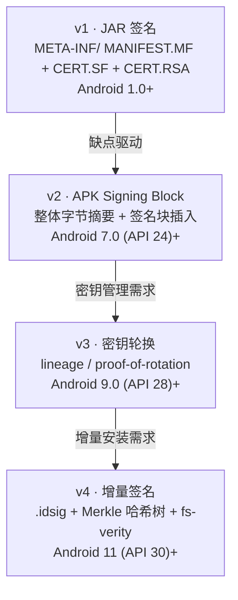
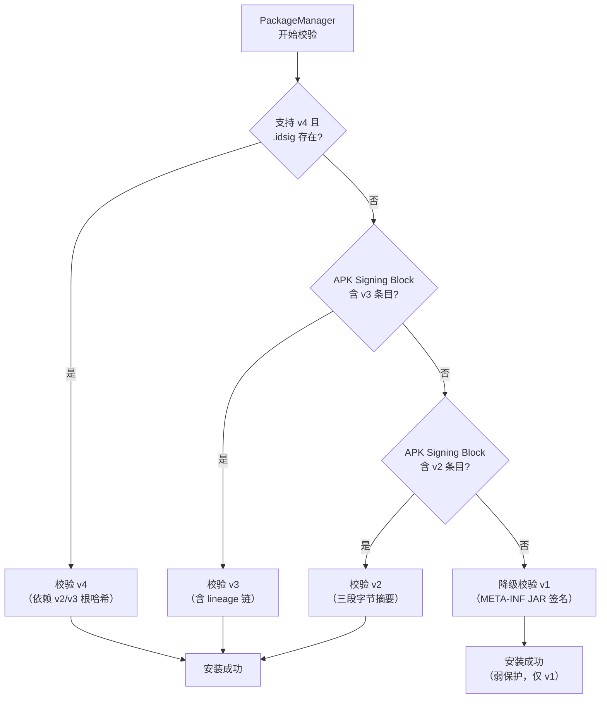
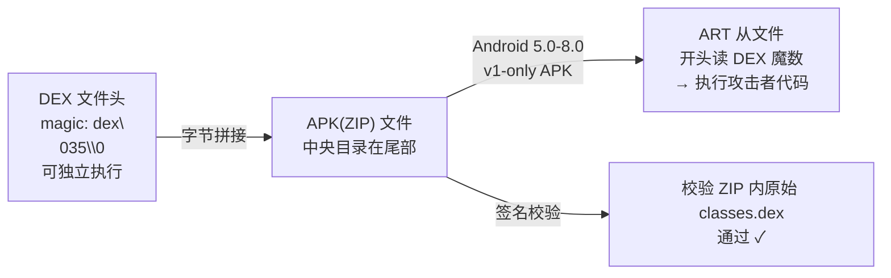
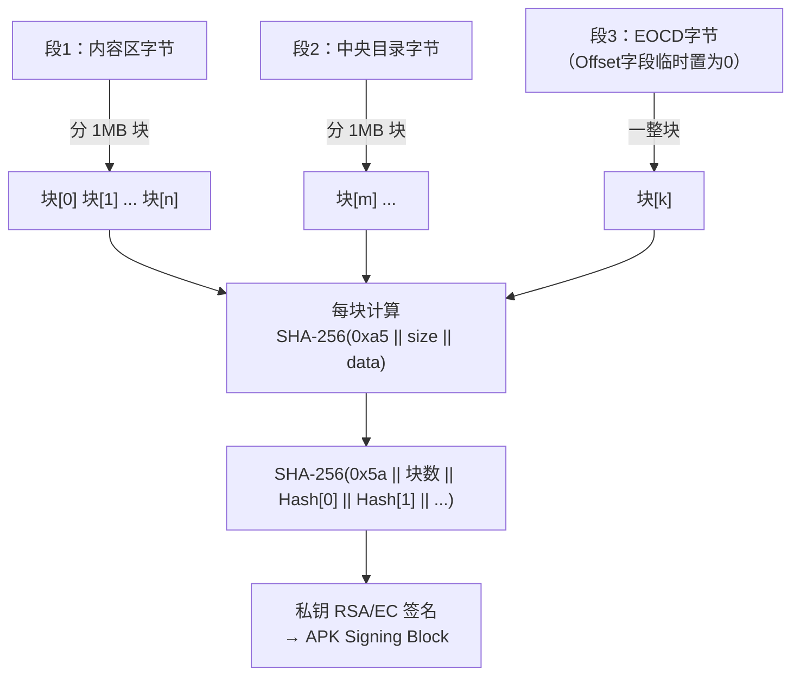
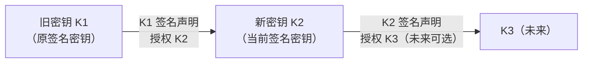
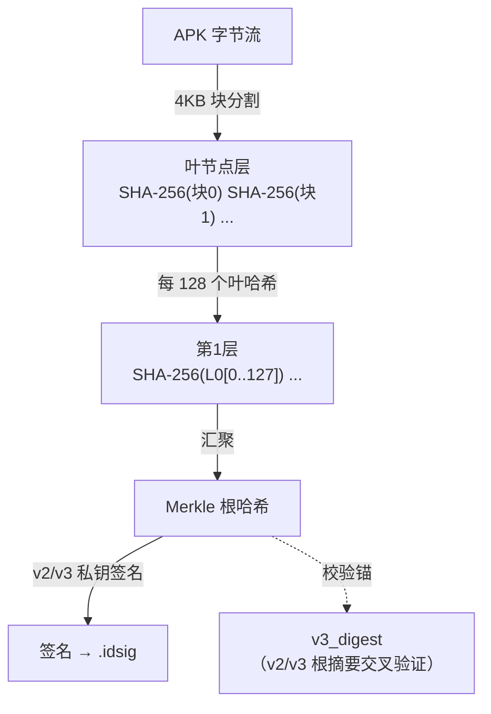

# Android逆向（14）· APK签名机制 v1 到 v4

## 概述与定位

> [!abstract] TL;DR
> APK 签名是 Android 生态唯一的**应用完整性 + 来源一致性**保障机制。v1（JAR 签名）奠定基础但有致命盲区；v2（APK Signing Block）将保护范围扩展到整个 ZIP 字节；v3 引入密钥轮换（lineage）；v4 以 Merkle 哈希树支持流式增量安装。逆向时**重打包必须重签名**，理解签名机制才能绕过或加固 App 内的自校验。

APK 签名在整个系列中承接 [[02.APK结构详解]]（APK 内部布局）与 [[11.加固与脱壳]]（壳对签名的二次校验），同时与密码学原理深度关联，见 [[37.密码学/00.密码学总览.md]]。

### 为什么需要签名

Android 没有中心化的代码签名 CA（与 Windows Authenticode／[[13.PE文件详解/12-详解PE文件(十二)：证书表.md]] 中 CA 颁发证书的模式不同）。任何人都可以用 `keytool` 生成自签名证书，系统只在以下维度做出决策：

| 目标 | 机制 |
|---|---|
| **完整性**：APK 未被篡改 | 安装时校验文件哈希/签名 |
| **来源一致性**：升级/共享 UID 来自同一主体 | 比对签名密钥（公钥指纹），而非 CA 链 |
| **权限隔离**：`sharedUserId` / 签名权限 | PackageManager 比对证书 |

这种"首次信任（TOFU，Trust On First Use）"模型意味着：
- 安装来源（Play Store / 侧载）决定初始信任，而非 CA；
- **升级要求签名密钥不变**——一旦密钥丢失，只能新包名重新分发；
- 与 TLS 服务器证书（CA 链验证，见 [[13.抓包与SSL_Pinning绕过]]）有本质区别。

---

## 原理与演进

### 版本演进全景



### 校验决策流程

系统 PackageManager 在安装/校验时按最高支持版本择优：



> [!tip] 兼容性设计
> 新版 Android 始终保留 v1 兼容解析，但 API 24+ 只要存在 v2 块就必须通过 v2 校验；v1 此时变为辅助（Google Play 已要求 API 30+ 强制 v2+）。

---

## v1 · JAR 签名（Android 1.0+）

### 文件布局

v1 基于标准 JAR 签名规范（`java.util.jar`），所有签名文件存放在 APK（ZIP）的 `META-INF/` 目录：

```
APK (ZIP)
└── META-INF/
    ├── MANIFEST.MF       ← 每个条目文件的摘要
    ├── CERT.SF           ← 对 MANIFEST 条目的再摘要
    └── CERT.RSA          ← PKCS#7 签名块（含证书 + 对 CERT.SF 的签名）
```

文件名 `CERT` 是惯例，实际可自定义（如 `ANDROID.RSA`）；后缀 `.RSA`/`.DSA`/`.EC` 表明所用算法。

### MANIFEST.MF — 每文件哈希

```
Manifest-Version: 1.0
Built-By: Generated-by-ADT

Name: classes.dex
SHA-256-Digest: <Base64(SHA-256(classes.dex 原始字节))>

Name: res/layout/activity_main.xml
SHA-256-Digest: <Base64(SHA-256(该文件原始字节))>
```

每个 **ZIP 条目**（除 `META-INF/` 下文件本身）都生成一行 `Name:` + `SHA-256-Digest:` 条目对。旧版本使用 SHA-1，现代工具默认 SHA-256。

### CERT.SF — 对 MANIFEST 的再摘要

```
Signature-Version: 1.0
SHA-256-Digest-Manifest: <Base64(SHA-256(整个 MANIFEST.MF))>
Created-By: 1.0 (Android)

Name: classes.dex
SHA-256-Digest: <Base64(SHA-256(MANIFEST.MF 中 classes.dex 那一段条目字节))>
```

二次摘要的价值：攻击者若替换了 `classes.dex` 并同时修改了 `MANIFEST.MF`，`CERT.SF` 的整体哈希就会失配，从而被发现。

### CERT.RSA — PKCS#7 签名

`CERT.RSA` 是 DER 编码的 **PKCS#7 SignedData** 结构（与 PE Authenticode 的 `WIN_CERTIFICATE` 同格式，见 [[13.PE文件详解/12-详解PE文件(十二)：证书表.md]]），包含：

| 字段 | 内容 |
|---|---|
| `SignedData.certificates` | 签名者 X.509 证书（自签名，含公钥） |
| `SignedData.signerInfos[0].signature` | 私钥对 `CERT.SF` 内容的签名 |
| `SignedData.digestAlgorithm` | SHA-256（旧版 SHA-1） |
| `SignedData.signatureAlgorithm` | RSA / DSA / EC |

查看命令：

```bash
# 以 DER 格式查看 CERT.RSA 的 PKCS#7 结构
openssl pkcs7 -inform DER -in META-INF/CERT.RSA -print_certs -noout -text
```

> [!warning] 示例输出为示意
> ```
> Certificate:
>     Data:
>         Version: 3 (0x2)
>         Serial Number: 1234567890 (示例)
>         Issuer: CN=Android Debug, O=Android, C=US
>         Validity
>             Not Before: Jan  1 00:00:00 2024 GMT
>             Not After : Jan  1 00:00:00 2054 GMT
>         Subject: CN=Android Debug, O=Android, C=US
>         Subject Public Key Info:
>             Public Key Algorithm: rsaEncryption
>                 RSA Public-Key: (2048 bit)
> ```

### v1 的结构弱点

| 弱点 | 说明 |
|---|---|
| **不保护 ZIP 元数据** | ZIP 中央目录、本地文件头、文件注释可被修改而不影响签名 |
| **不保护 META-INF 外来文件** | 可向 APK 追加任意额外文件（名称不在 MANIFEST 中）不被检测 |
| **逐文件校验慢** | 必须逐一解析 ZIP 条目并哈希每个文件 |
| **Janus 漏洞** | 见下节 |

### Janus 漏洞（CVE-2017-13156）



ZIP 格式从**尾部**定位中央目录，DEX 格式从**头部**读魔数。Janus 将恶意 DEX 前置拼接到 APK，ZIP 签名校验正常（检查的是 ZIP 内文件），但 ART 在 Android 5.0-8.0 对 v1-only APK 会先识别 DEX 头直接执行——完美绕过签名。v2+ 因为保护了整个文件字节流，前置 DEX 会导致 v2 摘要失败，Janus 无效。

---

## v2 · APK Signing Block（Android 7.0+）

### 核心思想

不再逐文件哈希，而是将**整个 APK 字节流**划分为三段，分 1 MB 块并行计算摘要，再对摘要树的根哈希签名——任何字节改动（包括 ZIP 元数据）都会被发现。

### ZIP 文件结构与签名块位置

```
ZIP 文件布局（添加 v2 后）
┌──────────────────────────────────────────┐
│  内容区（Contents of ZIP entries）        │  ← 段 1
│  （各压缩文件的本地文件头 + 数据）         │
├──────────────────────────────────────────┤
│  APK Signing Block                       │  ← 新插入（不属于 ZIP 规范）
│    ├─ size_before (8B)                   │
│    ├─ ID-value 对列表                    │
│    │   └─ ID=0x7109871a  ← v2 签名数据  │
│    ├─ size_after (8B)                    │
│    └─ magic: "APK Sig Block 42" (16B)   │
├──────────────────────────────────────────┤
│  中央目录（Central Directory）           │  ← 段 2
│  （含每个条目的文件名/偏移等元数据）       │
├──────────────────────────────────────────┤
│  ZIP 结尾（End of Central Directory）    │  ← 段 3
└──────────────────────────────────────────┘
```

签名块插入在内容区与中央目录之间，ZIP 解析器不认识它（标准 ZIP 工具忽略），但 Android PackageManager 在解析 APK 时会专门寻找它。

### APK Signing Block 结构

```
+----------------------------------+
|  size_of_block (int64)           | ← 块大小（不含此字段本身）
+----------------------------------+
|  ID-value 对 1                   |
|    length (int64)                |
|    ID     (int32)  = 0x7109871a  | ← v2 签名 ID
|    value  (bytes)                | ← APK Signature Scheme v2 Block
+----------------------------------+
|  ID-value 对 2（可选，v3/v4 等） |
|  ...                             |
+----------------------------------+
|  size_of_block (int64)           | ← 同上（重复，供逆向定位）
+----------------------------------+
|  magic (16B) = "APK Sig Block 42"| ← ASCII，定位魔数
+----------------------------------+
```

v3 使用 ID `0xf05368c0`，同样存放在 APK Signing Block 中（与 v2 并列）。

### 三段字节分块摘要



每块哈希前加 `0xa5` 前缀字节 + 块大小，防止长度扩展攻击；根哈希计算前加 `0x5a` 前缀 + 块总数。

### 字段表（v2 签名数据核心）

| 字段 | 类型 | 说明 |
|---|---|---|
| `signatures` | repeated | 每个签名者的签名算法 + 签名字节 |
| `publicKey` | bytes | 签名者公钥（SubjectPublicKeyInfo，DER） |
| `digests` | repeated | 各段的根摘要（同上方 `TOP`） |
| `certificates` | repeated | X.509 证书链（DER 编码） |
| `additionalAttributes` | repeated | 扩展属性（v3 rotation 等） |

---

## v3 · 密钥轮换（Android 9.0+）

### 为什么需要轮换

密钥泄露、算法老化、公司并购都可能要求更换签名密钥，但 Android 的 TOFU 模型要求**升级必须同一密钥**——这在 v2 时代是死结。v3 引入 **proof-of-rotation lineage（密钥历史链）**打破此限制。

### Lineage 链结构



每一级声明（`SigningCertificateLineage` 条目）包含：旧证书、新证书、旧密钥对"授权新密钥"声明的签名、授予的能力标志位（如是否允许访问旧 UID 的共享数据）。

v3 签名块 ID 为 `0xf05368c0`，存放在同一 APK Signing Block 中，与 v2（`0x7109871a`）并列。系统优先用 v3 校验，同时仍向下校验 v2 覆盖的整体摘要。

### 轮换操作（apksigner）

```bash
# 第一步：用旧密钥对 lineage 文件初始化（首次轮换）
apksigner rotate \
  --out lineage.bin \
  --old-signer --ks old_key.jks --ks-key-alias old_alias \
  --new-signer --ks new_key.jks --ks-key-alias new_alias

# 第二步：用新密钥签名 APK，附带 lineage
apksigner sign \
  --ks new_key.jks \
  --ks-key-alias new_alias \
  --lineage lineage.bin \
  --out app-signed.apk \
  app-unsigned.apk
```

> [!warning] 示例输出为示意
> ```
> Signing with key: new_alias  (示例别名)
> Signing block sizes: v2=1234 bytes, v3=5678 bytes  (示例大小)
> lineage: 2 signers  (示例)
> ```

---

## v4 · 增量签名（Android 11+）

### 设计动机

大 APK（几百 MB 游戏包）的 `adb install` 必须等全部传输完才能开始安装。Android 11 引入 **Incremental File System（IncFS）** 和 `adb install --incremental`，允许 App 在**下载过程中就启动**，后台继续拉取剩余数据块——但必须保证已下载的每个数据块都是可信的，不能等全文件都到齐才校验。

### .idsig 文件与 Merkle 树

v4 不修改 APK 本身，而是生成一个独立的 `.idsig` 文件：

```
.idsig 文件布局
┌────────────────────────────────┐
│  version (int32)               │
│  hash_tree_algorithm           │  ← SHA-256
│  log2_blocksize                │  ← 通常 12（块大小 4096 字节）
│  hashes_offset (int32)         │
│  data_size (int64)             │  ← APK 总字节数
│  v3_digest (bytes)             │  ← APK v2/v3 根摘要（信任锚）
│  certificate (bytes)           │  ← 签名证书
│  sig_algorithm (int32)         │
│  sig_size (int32)              │
│  sig (bytes)                   │  ← 对 Merkle 树根的签名
│  hash_tree (bytes)             │  ← 完整 Merkle 哈希树
└────────────────────────────────┘
```



### fs-verity 集成

`.idsig` 中的 Merkle 树可以直接交给内核的 **fs-verity** 机制，由内核在**每次读取 4KB 数据块时**自动校验该块的叶哈希，无需用户态介入——即使 IncFS 还没完整接收整个 APK，已缓存的块也是可信的。

### 增量安装命令

```bash
# 需要 .idsig 与 .apk 同名同目录
adb install --incremental app-release.apk
```

> [!warning] 示例输出为示意
> ```
> Performing Incremental Install
> Serving session data...
> Success  (示例)
> ```

---

## 工具实践

### apksigner — 签名与校验

```bash
# 生成测试密钥库（仅用于开发/分析）
keytool -genkey -v \
  -keystore test_key.jks \
  -alias test_alias \
  -keyalg RSA -keysize 2048 \
  -validity 10000 \
  -dname "CN=Test, O=Test, C=US"
```

> [!warning] 示例输出为示意
> ```
> Generating 2,048 bit RSA key pair and self-signed certificate (示例)
> ...
> [Storing test_key.jks]
> ```

```bash
# 用 v1+v2+v3 签名 APK
apksigner sign \
  --ks test_key.jks \
  --ks-key-alias test_alias \
  --v1-signing-enabled true \
  --v2-signing-enabled true \
  --v3-signing-enabled true \
  --out app-signed.apk \
  app-unsigned.apk
```

> [!warning] 示例输出为示意
> ```
> （无输出表示成功）
> ```

```bash
# 校验已签名 APK（显示详细签名信息）
apksigner verify --verbose --print-certs app-signed.apk
```

> [!warning] 示例输出为示意
> ```
> Verifies
> Verified using v1 scheme (JAR signing): true
> Verified using v2 scheme (APK Signature Scheme v2): true
> Verified using v3 scheme (APK Signature Scheme v3): true
> Verified using v4 scheme (APK Signature Scheme v4): false
> Number of signers: 1
> Signer #1 certificate DN: CN=Test, O=Test, C=US  (示例)
> Signer #1 certificate SHA-256 digest: aabbccdd...  (示例哈希)
> Signer #1 key algorithm: RSA
> Signer #1 key size (bits): 2048
> ```

### 查看签名信息（手动解析）

```bash
# 提取 v1 签名证书
unzip -p app.apk META-INF/CERT.RSA | \
  openssl pkcs7 -inform DER -print_certs -noout -text
```

> [!warning] 示例输出为示意
> （同前文 CERT.RSA 示例输出）

```bash
# 查看 APK Signing Block 是否存在（偏移定位）
python3 -c "
data = open('app.apk','rb').read()
magic = b'APK Sig Block 42'
pos = data.rfind(magic)
print('APK Signing Block magic @ offset:', pos if pos != -1 else 'not found')
"
```

> [!warning] 示例输出为示意
> ```
> APK Signing Block magic @ offset: 8388608  (示例偏移)
> ```

### apktool 重打包后重签

```bash
# 反编译
apktool d app.apk -o app_decoded/

# 修改 smali/资源 后重打包
apktool b app_decoded/ -o app_rebuilt.apk

# 对齐（必须在签名前）
zipalign -v 4 app_rebuilt.apk app_aligned.apk

# 重签名
apksigner sign --ks test_key.jks --ks-key-alias test_alias \
  --out app_final.apk app_aligned.apk
```

> [!warning] 示例输出为示意
> ```
> Verifying alignment of app_aligned.apk (4)...
>       50 META-INF/MANIFEST.MF (OK - 4)
>      ...
> Verification succesful  (示例)
> ```

---

## 逆向视角：签名与重打包对抗

### 重打包后签名必然改变

任何对 APK 内容的修改（smali 注入、资源替换、去混淆）后重打包时，必须**重新签名**。原始签名密钥（私钥）不可能复制，因此重打包 APK 的签名证书指纹一定与原版不同。这给 App 提供了一个防篡改入口：

```java
// App 内部 Java 签名自校验（典型模式）
PackageManager pm = context.getPackageManager();
PackageInfo info = pm.getPackageInfo(
    context.getPackageName(),
    PackageManager.GET_SIGNATURES);  // API 28+ 用 GET_SIGNING_CERTIFICATES

Signature sig = info.signatures[0];
String sha256 = getSHA256(sig.toByteArray());  // 计算证书的 SHA-256
if (!EXPECTED_SHA256.equals(sha256)) {
    // 检测到非原签名 → 对抗/崩溃/上报
}
```

对应逆向策略：用 Frida hook `PackageManager.getPackageInfo` 返回原始签名字节，详见 [[11.加固与脱壳]]。

### 壳对签名的二次校验

高强度加固（参考 [[11.加固与脱壳]]）会在 native 层用 JNI 调 `getPackageInfo`，或直接读 `/proc/self/maps` 找到 APK 路径后 `open` + `lseek` 解析 PKCS#7 证书 DER 字节做对比，绕过 Java 层 hook 较困难——需 native hook（参考 [[09.Frida动态插桩]]）或在内存 dump 后离线分析。

### 签名校验时序（安装 vs 运行时）

| 时机 | 执行者 | 校验内容 |
|---|---|---|
| **安装时** | PackageManager / installd | 按最高版本校验整体签名有效性 |
| **升级时** | PackageManager | 校验新包签名与已安装包签名的证书一致（或 v3 lineage 覆盖） |
| **运行时（App 自校验）** | App 代码 / 壳 | 调 PM API 或直接解析 APK 文件，比对证书指纹 |
| **系统权限校验** | PackageManager | `protectionLevel="signature"` 权限要求调用方证书一致 |

---

## 安全性与正确使用

### 密钥保管

1. **绝不将 `.jks`/`.keystore` 提交 Git**——一旦私钥泄露，任何人都能以你的身份签名恶意 APK 并推送升级。
2. 生产密钥建议存入硬件安全模块（HSM）或 Android Keystore（通过 Google Play App Signing 委托 Google 管理）。
3. 调试密钥（`~/.android/debug.keystore`）仅用于开发，严禁用于生产发布。

### 最低签名版本要求

| 目标 API Level | 推荐最低签名版本 | 原因 |
|---|---|---|
| minSdk 23 以下 | v1（强制）+ v2 | v2 在 API 24 前被忽略，但加上无害 |
| minSdk 24–27 | v1 + v2 | v3 在 API 28 前被忽略 |
| minSdk 28+ | v2 + v3 | 可完全去掉 v1（更快、更安全） |
| 增量安装 / API 30+ | v2 + v3 + v4 | `.idsig` 必须与 v2/v3 配合 |

> [!tip] Google Play 要求
> 自 2021 年起 Google Play 要求所有新 App 使用 v2+ 签名；2022 年起 targetSdk 30+ 强制 v3 推荐。

### 重打包检测加固要点

1. **在 native 层做签名校验**（JNI 直接调 PM，或 mmap APK 解析 PKCS#7）——比 Java 层更难 hook。
2. **双向验证**：既检查证书指纹，也校验 APK 文件路径与 `context.getPackageCodePath()` 一致性。
3. **分散校验点**：多处随机时机触发，而非启动时单次——让 Frida 脚本更难全量 hook。
4. **与网络绑定**：将签名指纹的哈希发往服务端做二次验证，本地绕过无法欺骗后端。

### 常见陷阱

| 陷阱 | 说明 |
|---|---|
| `zipalign` 必须在签名前 | 签名后再对齐会破坏 v2/v3 签名块；错误顺序导致安装时 v2 失败 |
| v1 弱保护不能单独依赖 | API 24+ 必须有 v2；v1-only 在 API 30+ 可能被 Play 拒绝 |
| `GET_SIGNATURES` 在 API 28 有 bug | 返回第一个证书（不含 lineage）；v3 轮换后应改用 `GET_SIGNING_CERTIFICATES` |
| 自签名证书有效期要够长 | 推荐 25 年以上；期限内密钥泄露才是风险，而非有效期本身 |
| 调试签名泄漏 | CI/CD 脚本中硬编码 debug keystore 密码，扫描并隔离 |

---

## 小结

| 版本 | 核心技术 | 保护范围 | 主要局限 |
|---|---|---|---|
| v1 JAR | MANIFEST + CERT.SF + PKCS#7 | 逐 ZIP 条目文件内容 | 不保护 ZIP 结构/元数据；Janus 漏洞 |
| v2 Signing Block | 整体三段字节分块摘要 + ID-value | 整个 APK 字节流 | 密钥不可更换 |
| v3 轮换 | lineage proof-of-rotation | 整个 APK + 密钥历史链 | 需 API 28+ |
| v4 增量 | .idsig + Merkle 树 + fs-verity | 每个 4KB 块独立可验 | 需 API 30+ + IncFS |

APK 签名机制从"逐文件哈希"进化为"字节流级完整保护"，再到"密钥轮换"和"流式可信传输"，每一代都是针对上一代实际弱点的针对性解决。逆向工程师需要理解：**重打包后签名必然变化**，这是 App 自保护的天然探针；而理解校验流程与存储格式，是分析加固方案、实施对抗或构建完整性防线的前提。

---

## 相关阅读

- [[02.APK结构详解]] — APK = ZIP 的完整内部布局，`META-INF/` 的来龙去脉
- [[11.加固与脱壳]] — 壳如何利用签名校验反篡改；native 层签名检测对抗
- [[09.Frida动态插桩]] — hook `getPackageInfo` 绕过 Java 层签名自校验
- [[37.密码学/00.密码学总览.md]] — RSA/ECDSA/SHA-256 原理，PKCS#7 SignedData 结构
- [[13.PE文件详解/12-详解PE文件(十二)：证书表.md]] — Windows Authenticode：同为 PKCS#7、CA 信任链模式与 Android 自签名 TOFU 的对比
- [[11.ELF文件详解/17.got节.md]] — ELF 格式深度参考，理解字节级结构分析方法论
- [[13.抓包与SSL_Pinning绕过]] — TLS CA 信任链 vs Android 应用签名 TOFU 模型对比

---

⬅️ 上一篇 [[13.抓包与SSL_Pinning绕过]] ｜ 🏠 [[00.Android逆向与运行时总览]] ｜ 下一篇 [[15.实战完整逆向]] ➡️
