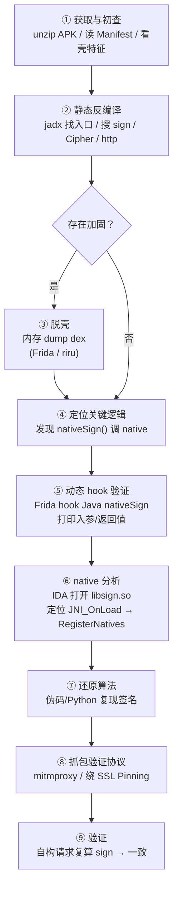
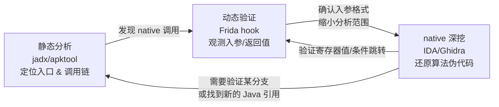
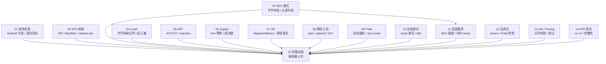

# Android逆向（15）· 实战完整逆向

> [!abstract] TL;DR
> 本篇以一个**虚构教学样本** `DemoShop.apk` 为主线，端到端演示完整逆向流程：
> APK 初查 → 静态反编译 → （脱壳）→ 定位关键逻辑 → Frida 动态 hook → native 分析 → 算法还原 → 抓包验证 → 自构请求验证一致。
> 全程串联系列 15 篇的核心知识点；**仅用于授权测试、自有 App 评估与安全教育**。

---

## 概述与定位

Android 逆向的日常形态从来不是"单点突破"——你很少只用 jadx，也很少只用 Frida；真实流程是**静态定位、动态验证、native 深挖**三者循环迭代，直到完整还原目标逻辑。

本篇虚构教学样本场景如下：

> `DemoShop.apk`——一个电商教学 Demo，登录接口在请求体里附带 `sign` 参数（对请求参数的完整性签名）。Java 层直接 `return nativeSign(params, timestamp)` 把核心算法下沉到 `libsign.so`。目标：还原 `sign` 计算逻辑，理解协议完整性机制，以便在自有后端做对应防护。

本篇把前 14 篇的知识拧成一根线，每一步都给出工具指令与分析思路，并在关键节点指回对应原理篇。

---

## 原理与机制

### 端到端逆向工作流（9 步）



---

## 步骤详解

### ① 获取与初查

**目标**：在打开任何工具之前先摸清 APK 的"基本体征"——包名、权限、`lib/` 下的 ABI 与 `.so` 列表、是否有壳特征。

```bash
# 把 APK 当 ZIP 解开
unzip DemoShop.apk -d demo_unzip
ls demo_unzip/
# 典型输出：AndroidManifest.xml  classes.dex  lib/  res/  resources.arsc  META-INF/
ls demo_unzip/lib/
# arm64-v8a  armeabi-v7a
ls demo_unzip/lib/arm64-v8a/
# libsign.so  libapp.so
```

> [!warning] 示例输出为示意

重点检查三件事：

| 检查点 | 含义 | 关联篇章 |
|---|---|---|
| `classes.dex` 是否 > 1 个 | 多 dex 说明方法数超 64K 或壳分包 | [[02.APK结构详解]] |
| `AndroidManifest.xml` `application` 节有无 `name` 属性 | 自定义 Application 常见于壳 | [[11.加固与脱壳]] |
| `lib/<abi>/` 下 `.so` 命名 | `libjiagu`/`libShield`/`libsecexe` 等是商业加固特征 | [[11.加固与脱壳]] |

读 Manifest（需反二进制 XML）：

```bash
aapt dump badging DemoShop.apk | grep -E "package|application-label|launchable"
```

> [!warning] 示例输出为示意

样本结论：发现 `libsign.so`，`classes.dex` 只有一个，Application 无壳特征 → 无明显商业加固，可直接进静态分析。

---

### ② 静态反编译

使用 jadx 把 `classes.dex` 反编译为 Java，重点搜索 `sign`、`Cipher`、`http`、`okhttp` 等关键词，找到登录逻辑。

参见 [[08.静态分析工具]] 关于 jadx 工作原理与使用模式。

```bash
jadx -d demo_jadx DemoShop.apk
# 或：jadx-gui DemoShop.apk（图形界面，支持全局搜索）
```

> [!warning] 示例输出为示意

jadx 图形界面全局搜索 `nativeSign`，定位到：

```java
// com.demoshop.network.SignHelper（反编译结果，经过 jadx 重建变量名）
public class SignHelper {
    static {
        System.loadLibrary("sign");   // 加载 libsign.so
    }

    public static native String nativeSign(String params, long timestamp);

    public static String buildSign(Map<String, String> params, long ts) {
        // 把 params 按 key 排序、拼接为 "k1=v1&k2=v2" 形式
        String sortedParams = sortAndJoin(params);
        return nativeSign(sortedParams, ts);
    }
}
```

同时搜索 `login` 找到调用链：

```java
// com.demoshop.api.LoginApi
public void doLogin(String user, String pwd) {
    Map<String, String> p = new HashMap<>();
    p.put("user", user);
    p.put("pwd", Md5Util.md5(pwd));
    long ts = System.currentTimeMillis() / 1000;
    String sign = SignHelper.buildSign(p, ts);
    p.put("sign", sign);
    p.put("ts", String.valueOf(ts));
    HttpClient.post("/api/login", p);
}
```

此时我们已经知道：
- `sign` 由 `nativeSign(sortedParams, ts)` 计算
- `sortedParams` 是请求参数 key 升序排列并拼接的字符串
- 核心算法在 `libsign.so` 的 native 层

---

### ③ 若存在加固先脱壳

本样本无明显加固，跳过。若实际遇到加固：

- **DEX 抽取型壳**：Frida 在 `ClassLoader.loadClass` 处 hook，`dumpDex()` 把内存中已还原的 dex dump 到文件
- **VMP/代码抽取**：在 `ArtMethod::Invoke` 拦截还原后的字节码
- dump 出来的 dex 用 `dex_fix.py` 修复头部 `file_size`/`checksum`/`signature` 后重新交给 jadx

参见 [[11.加固与脱壳]] 的内存 dump 原理与 [[03.DEX文件格式]] 的头部字段修复。

---

### ④ 定位关键逻辑

静态分析已确认：

```
com.demoshop.network.SignHelper.buildSign()
  └─ nativeSign(sortedParams, timestamp)   → native, 在 libsign.so
```

两条信息需要在 native 层继续追：
1. native 函数的真实实现地址（可能通过 `RegisterNatives` 注册，非默认 `JNI_方法名` 命名）
2. 算法内部逻辑

参见 [[07.JNI与native层]] 关于 `RegisterNatives` 与 `JNI_OnLoad` 的原理。

---

### ⑤ 动态 hook 验证

在进 IDA 分析 native 之前，先用 Frida hook Java 层的 `nativeSign`，**验证入参格式与返回值**，可以大幅节省 native 分析时间。

参见 [[09.Frida动态插桩]] 关于 frida-server 部署与 Java hook API。

```bash
# 1. 推送并启动 frida-server（adb root 模式）
adb push frida-server /data/local/tmp/
adb shell "chmod +x /data/local/tmp/frida-server && /data/local/tmp/frida-server &"

# 2. 运行 hook 脚本
frida -U -f com.demoshop.app -l hook_sign.js --no-pause
```

> [!warning] 示例输出为示意

`hook_sign.js` 内容：

```javascript
Java.perform(function () {
    var SignHelper = Java.use("com.demoshop.network.SignHelper");

    // hook native 方法：在 Java 层拦截，native 实现照常执行
    SignHelper.nativeSign.implementation = function (params, timestamp) {
        var result = this.nativeSign(params, timestamp);
        console.log("[nativeSign] params  = " + params);
        console.log("[nativeSign] ts      = " + timestamp);
        console.log("[nativeSign] result  = " + result);
        return result;  // 不修改返回值，仅观测
    };
});
```

> [!warning] 示例输出为示意

触发登录后，控制台打印：

```
[nativeSign] params  = pwd=5f4dcc3b5aa765d61d8327deb882cf99&user=testuser
[nativeSign] ts      = 1719734400
[nativeSign] result  = a3c2e8f1b74d910c56ef2384a7d0b91e
```

> [!warning] 示例输出为示意

**关键发现**：
- `params` 已经是按 key 升序排序并 `&` 拼接的字符串（`pwd` < `user` 字典序）
- `result` 是 32 字符十六进制，高度疑似 MD5

---

### ⑥ native 分析

用 IDA Pro（或 Ghidra）打开 `libsign.so`，定位真实实现。

```
# 从 APK 提取 so
cp demo_unzip/lib/arm64-v8a/libsign.so .
# 拖入 IDA Pro → ARM64 → 自动分析
```

> [!warning] 示例输出为示意

**第一步：定位 `JNI_OnLoad`**

IDA 导出表搜索 `JNI_OnLoad`（必须导出，否则系统找不到入口）。函数体关键片段（IDA 伪代码视图）：

```c
// JNI_OnLoad 伪代码（IDA Hex-Rays 输出，经整理）
jint JNI_OnLoad(JavaVM *vm, void *reserved) {
    JNIEnv *env;
    vm->GetEnv((void **)&env, JNI_VERSION_1_6);

    jclass clazz = env->FindClass("com/demoshop/network/SignHelper");

    JNINativeMethod methods[] = {
        { "nativeSign",
          "(Ljava/lang/String;J)Ljava/lang/String;",
          (void *)native_sign_impl }   // ← 真实函数指针
    };
    env->RegisterNatives(clazz, methods, 1);
    return JNI_VERSION_1_6;
}
```

> [!warning] 示例输出为示意

**第二步：分析 `native_sign_impl`**

IDA 跳转到 `native_sign_impl`，伪代码（整理后）：

```c
// native_sign_impl 伪代码
jstring native_sign_impl(JNIEnv *env, jclass clazz,
                          jstring j_params, jlong timestamp) {
    const char *params = env->GetStringUTFChars(j_params, NULL);

    // 拼接：params + "&salt=DemoShopSalt2024" + timestamp 字符串
    char buf[1024];
    snprintf(buf, sizeof(buf), "%s&salt=DemoShopSalt2024&ts=%lld",
             params, (long long)timestamp);

    // MD5 计算
    unsigned char md5_out[16];
    md5_compute((unsigned char *)buf, strlen(buf), md5_out);

    // 转十六进制字符串
    char hex[33];
    bytes_to_hex(md5_out, 16, hex);

    env->ReleaseStringUTFChars(j_params, params);
    return env->NewStringUTF(hex);
}
```

> [!warning] 示例输出为示意

**算法明确**：

```
sign = MD5( sortedParams + "&salt=DemoShopSalt2024&ts=" + timestamp )
```

参见 [[07.JNI与native层]] 关于 `GetStringUTFChars`/`NewStringUTF` 的 JNI 类型转换，以及 [[11.ELF文件详解/00.ELF文件详解总览.md]] 关于 `.so` 符号与 ELF 结构。

---

### ⑦ 还原算法

用 Python 复现签名计算：

```python
import hashlib

def compute_sign(params: dict, timestamp: int) -> str:
    """
    复现 DemoShop libsign.so 的 nativeSign 逻辑
    params: 请求参数 dict（不含 sign/ts 本身）
    timestamp: Unix 秒级时间戳
    """
    # 1. 按 key 升序排序，拼接为 k=v&k=v 形式
    sorted_params = "&".join(
        f"{k}={v}" for k, v in sorted(params.items())
    )
    # 2. 拼接 salt 与时间戳
    raw = f"{sorted_params}&salt=DemoShopSalt2024&ts={timestamp}"
    # 3. MD5
    return hashlib.md5(raw.encode("utf-8")).hexdigest()

# 验证（对应 Frida 观测到的那次调用）
params = {
    "user": "testuser",
    "pwd": "5f4dcc3b5aa765d61d8327deb882cf99",
}
ts = 1719734400
sign = compute_sign(params, ts)
print(f"sign = {sign}")
# 期望：a3c2e8f1b74d910c56ef2384a7d0b91e
```

> [!warning] 示例输出为示意

输出应与 Frida 观测到的 `result` 完全一致，算法还原完毕。

---

### ⑧ 抓包验证协议

使用 mitmproxy 中间人抓包，同时需要绕过可能的 SSL Pinning。

参见 [[13.抓包与SSL_Pinning绕过]] 关于证书校验、Pinning 原理与分析方法。

```bash
# 设置代理（手机 WiFi → mitmproxy 监听 8080）
mitmproxy --listen-port 8080

# 若存在 SSL Pinning，用 Frida 挂起 TrustManager hook 绕过
frida -U -f com.demoshop.app -l bypass_pinning.js --no-pause
```

> [!warning] 示例输出为示意

mitmproxy 捕获的登录请求：

```
POST /api/login HTTP/1.1
Host: api.demoshop.example
Content-Type: application/x-www-form-urlencoded

user=testuser&pwd=5f4dcc3b5aa765d61d8327deb882cf99
&ts=1719734400
&sign=a3c2e8f1b74d910c56ef2384a7d0b91e
```

> [!warning] 示例输出为示意

协议字段与 Frida hook 观测完全吻合。

---

### ⑨ 验证：自构请求复算 sign

用 Python 脚本还原的签名函数直接构造请求，验证后端是否正常接受：

```python
import requests, time, hashlib

def compute_sign(params, timestamp):
    sorted_params = "&".join(f"{k}={v}" for k, v in sorted(params.items()))
    raw = f"{sorted_params}&salt=DemoShopSalt2024&ts={timestamp}"
    return hashlib.md5(raw.encode()).hexdigest()

ts = int(time.time())
params = {"user": "testuser", "pwd": "5f4dcc3b5aa765d61d8327deb882cf99"}
sign = compute_sign(params, ts)

resp = requests.post(
    "https://api.demoshop.example/api/login",
    data={**params, "ts": ts, "sign": sign},
    verify=False   # 仅用于本地测试，生产环境保留证书校验
)
print(resp.status_code, resp.json())
```

> [!warning] 示例输出为示意

服务端返回 200 + 登录 token，签名验证通过，**算法还原正确**。

---

## 方法论总结

### 静态定位 + 动态验证 + native 深挖的循环



这个三角形循环是 Android 逆向的核心节奏：

| 步骤 | 工具 | 产出 |
|---|---|---|
| 静态定位 | jadx/apktool | 类结构、调用关系图、关键字符串 |
| 动态验证 | Frida | 真实运行时数据（入参、返回值、执行路径） |
| native 深挖 | IDA/Ghidra | 算法伪代码、内联汇编、寄存器含义 |

**循环终止条件**：能用 Python/其他语言完整复现目标函数的输出，且与运行时数据吻合。

---

## 全系列回顾：15 篇地图如何协同

本篇的每一步都踩在前 14 篇奠定的基础上：



| 实战步骤 | 依赖的篇章 |
|---|---|
| 获取与初查 | [[02.APK结构详解]]、[[11.加固与脱壳]] |
| 静态反编译 | [[08.静态分析工具]]、[[03.DEX文件格式]] |
| 脱壳（若需） | [[11.加固与脱壳]]、[[03.DEX文件格式]] |
| 定位关键逻辑 | [[08.静态分析工具]]、[[04.Dalvik字节码与smali]] |
| 动态 hook | [[09.Frida动态插桩]]、[[07.JNI与native层]] |
| native 分析 | [[07.JNI与native层]]、[[10.动态调试]] |
| 算法还原 | [[07.JNI与native层]] |
| 抓包验证 | [[13.抓包与SSL_Pinning绕过]] |
| 签名/完整性背景 | [[14.APK签名机制v1到v4]] |

---

## 安全性与正确使用

> [!danger] 合规边界——这是本系列最重要的一条
> 本文所有技术**仅限于**：
> - 你拥有所有权或书面授权的 App（自有 App 安全评估）
> - 学习目的的**虚构教学样本**（如本文的 `DemoShop.apk`）
> - 合法的漏洞赏金计划（Bug Bounty，且在范围内）
> - 安全研究机构的授权恶意样本分析
>
> **逆向他人生产 App、绕过 DRM、破解付费功能、抓取他人数据，均可能违反《计算机软件保护条例》《数据安全法》《网络安全法》及服务条款，承担民事/刑事责任。**

### 防御者视角：如何让自己的 App 更难被逆向

经历了这 9 步完整攻击链，防守方可以针对每个节点加固：

| 攻击节点 | 防御手段 | 关联篇章 |
|---|---|---|
| 静态反编译 | 代码混淆（ProGuard/R8）+ 控制流混淆 | [[08.静态分析工具]] |
| Java 层算法 | 核心逻辑下沉 native（本文已示范如何被分析）| [[07.JNI与native层]] |
| native 静态分析 | OLLVM/控制流混淆、字符串加密、反符号 | [[11.加固与脱壳]] |
| Frida hook | `ptrace(PTRACE_TRACEME)` 自我保护、Frida 特征检测 | [[12.反调试与反Frida对抗]] |
| 抓包中间人 | SSL Pinning（证书/公钥双向校验） | [[13.抓包与SSL_Pinning绕过]] |
| 重打包篡改 | APK 签名校验（v2/v3 Block）+ 运行时签名核验 | [[14.APK签名机制v1到v4]] |
| 壳（商业加固） | DEX 抽取 VMP / 代码虚拟化，大幅提高 native 分析门槛 | [[11.加固与脱壳]] |

**防御的核心原则**：没有不可逆向的 App，只有"逆向成本"高到让攻击者放弃的 App。加固 + Pinning + 反调试 + native + 签名校验是**纵深防御**，缺任何一环都会被快速绕过某一步。

---

## 小结

本篇以 `DemoShop.apk`（虚构教学样本）为例，完整走过了 Android 逆向的 9 个步骤：

1. **初查**：APK 解包看结构，识别 native 库与加固特征
2. **静态反编译**：jadx 找入口，搜索 `sign`/`nativeSign`，还原 Java 调用链
3. **脱壳**（按需）：内存 dump dex，修复头部，重新分析
4. **逻辑定位**：确认 `nativeSign()` 是 native 调用，进入 `libsign.so`
5. **Frida hook**：Java 层拦截，观测入参格式与返回值，验证初步假设
6. **native 分析**：IDA 找 `JNI_OnLoad` → `RegisterNatives` → 真实函数，读伪代码还原算法
7. **算法还原**：Python 复现 `MD5(sortedParams + salt + ts)`
8. **抓包验证**：mitmproxy 捕获真实请求，绕 Pinning，核对字段
9. **验证一致**：自构请求复算 sign，后端接受，还原完成

**方法论**：静态定位提供地图，动态验证提供数据，native 深挖还原算法——三者循环迭代直到收敛。

读完本系列 15 篇，你已掌握 Android 应用从打包格式（APK/DEX/smali）、运行时（ART/Zygote/JNI），到工具实践（jadx/Frida/IDA）、对抗机制（加固/反调试/Pinning/签名）的完整体系——这也是 Android 安全工程师的核心知识图谱。

---

## 相关阅读

- [[08.静态分析工具]] — jadx/apktool/IDA 工作原理与使用
- [[09.Frida动态插桩]] — frida 架构、Java hook、native hook
- [[07.JNI与native层]] — `JNI_OnLoad`、`RegisterNatives`、JNI 类型签名
- [[03.DEX文件格式]] — DEX 魔数、头部字段、字节布局
- [[11.加固与脱壳]] — DEX 抽取、内存 dump 脱壳
- [[12.反调试与反Frida对抗]] — ptrace 检测、Frida 特征对抗
- [[13.抓包与SSL_Pinning绕过]] — 证书校验、Pinning 绕过
- [[14.APK签名机制v1到v4]] — v1/v2/v3/v4 签名块与完整性
- [[11.ELF文件详解/00.ELF文件详解总览.md]] — native `.so` 的 ELF 结构
- [[14.动态链接与加载器详解/00.动态链接与加载器总览.md]] — `.so` 加载与动态链接
- [[32.hooks/00.总览.md]] — Frida/inline hook 原理
- [[44.调试器原理与实战/00.调试器原理与实战总览.md]] — ptrace/调试器原理
- [[37.密码学/00.密码学总览.md]] — MD5/HMAC 等签名算法背景

---

⬅️ 上一篇 [[14.APK签名机制v1到v4]] ｜ 🏠 [[00.Android逆向与运行时总览]] ｜ 下一篇 [[00.Android逆向与运行时总览]] ➡️
