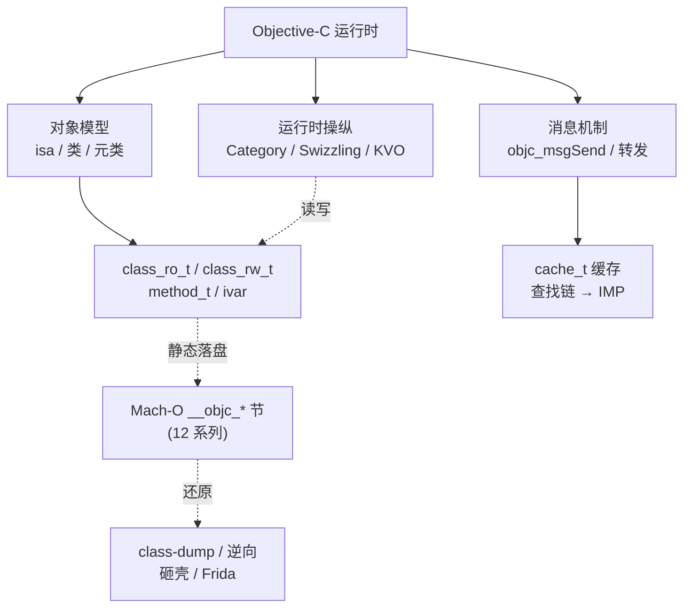

# Objective-C与iOS运行时 · 系列总览

> 作者原创系列，共 **20** 篇（15-20 为进阶专题扩展）。系统拆解 **Objective-C 运行时（runtime）** 的动态机制与 **iOS 逆向**基础：从 **对象模型**（`isa`/类/元类）、**`objc_msgSend` 消息发送**、**消息转发**，到 **Category/load**、**关联对象/KVO**、**Method Swizzling**、**属性与 ARC**、**Block 原理**，再落到 **Mach-O 中的 ObjC 元数据**、**iOS 逆向工具**、**安全与砸壳**，以及 **Swift 运行时**简介。ObjC 的"一切皆消息"建立在一套可在运行时读写的 C 结构之上——本系列与 [[12.Mach-O文件详解/00.Mach-O文件详解总览|Mach-O 文件详解]]（尤其其中的 `__objc_*` 元数据节）、[[32.hooks/00.总览|Hook 技术]]、[[44.调试器原理与实战/09.LLDB原理与实战|LLDB 调试]]、[[34.现代二进制防护机制/11.macOS与iOS防护|macOS/iOS 防护]] 深度互补，并与 [[35.Android逆向与运行时/00.Android逆向与运行时总览|Android 逆向]] 形成双平台对照。

## 一、运行时基础

| # | 章节 | 说明 |
| --- | --- | --- |
| 01 | [[01.Objective-C运行时概览]] | 动态语言、runtime 是什么、objc4 源码、消息 vs 函数调用 |
| 02 | [[02.对象模型与isa]] | `objc_object`、`isa_t`、ARM64 non-pointer isa 位域、对象内存布局 |
| 03 | [[03.类、元类与方法列表]] | `objc_class`、元类、`class_ro_t`/`class_rw_t`、`method_t`、ivar/property |

## 二、消息机制

| # | 章节 | 说明 |
| --- | --- | --- |
| 04 | [[04.objc_msgSend消息发送]] | SEL/IMP、`cache_t` 缓存、查找链、汇编快路径 |
| 05 | [[05.消息转发机制]] | 动态解析→快速转发→完整转发（`forwardInvocation:`） |

## 三、运行时特性

| # | 章节 | 说明 |
| --- | --- | --- |
| 06 | [[06.Category与load和initialize]] | 分类 attach 时机、方法前插、`+load` vs `+initialize` |
| 07 | [[07.关联对象与KVO]] | `objc_setAssociatedObject`、KVO 的 isa-swizzling 实现 |
| 08 | [[08.Method Swizzling]] | `method_exchangeImplementations`、hook 原理与陷阱 |

## 四、内存与 Block

| # | 章节 | 说明 |
| --- | --- | --- |
| 09 | [[09.属性与ARC内存管理]] | retain/release/autorelease、weak 表、autoreleasepool |
| 10 | [[10.Block原理]] | `Block_layout`、栈/堆/全局 Block、`__block` 捕获 |

## 五、Mach-O 与逆向

| # | 章节 | 说明 |
| --- | --- | --- |
| 11 | [[11.Mach-O中的ObjC元数据]] | `__objc_classlist`/`selrefs`/`catlist`、class-dump 还原 |
| 12 | [[12.iOS逆向工具]] | Hopper/IDA/class-dump/Frida/LLDB/Cycript、调试与脱壳链 |
| 13 | [[13.iOS安全与砸壳]] | FairPlay 加密、`cryptid`、dump 解密（研究/防御视角） |

## 六、Swift

| # | 章节 | 说明 |
| --- | --- | --- |
| 14 | [[14.Swift运行时简介]] | Swift metadata、与 ObjC 互操作、`@objc`、逆向差异 |

## 七、进阶专题（扩展）

| # | 章节 | 说明 |
| --- | --- | --- |
| 15 | [[15.Swift_ABI与name_mangling深入]] | Swift ABI 稳定性、`$s` mangling 规则、type metadata 布局、witness table 结构 |
| 16 | [[16.dyld_shared_cache与系统框架逆向]] | DSC 格式与结构、提取工具（dsc_extractor/dyld-shared-cache-extractor）、系统框架还原技巧 |
| 17 | [[17.arm64e_PAC指针认证专题]] | PAC 密钥体系（IA/IB/DA/DB）、PACIA/PACIB 指令、防 ROP 原理与防御视角 |
| 18 | [[18.越狱原理与TrollStore]] | 越狱攻击链（BootROM/iBoot/内核利用）、checkm8/checkra1n、TrollStore 原理（防御视角） |
| 19 | [[19.Theos与Frida_iOS插件开发]] | Theos 工程结构、logos 语法、CydiaSubstrate/libhooker hook、Frida gadget 注入与脚本 |
| 20 | [[20.iOS沙箱与entitlements]] | 沙箱轮廓（Sandbox Profile）、entitlements 声明与 AMFI 校验、TCC 权限模型、沙箱逃逸防御 |

## Objective-C 运行时的三大支柱

> 一句话：Objective-C 把"调用方法"做成"发消息"（`objc_msgSend`），方法、类、属性都是运行时可读写的 C 结构（`class_rw_t`/`method_t`），这套动态性既支撑了 Category、KVO、Swizzling 等特性，也把类信息以 `__objc_*` 元数据落进 Mach-O——于是 class-dump 能还原头、Frida 能 hook、逆向有了抓手。读完本系列，你能看懂一个 iOS App 的类结构与运行时行为。
