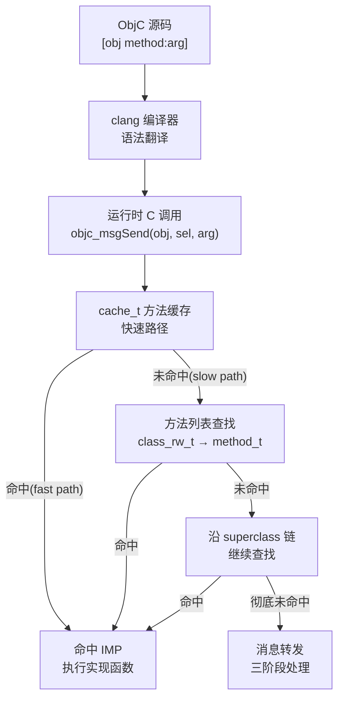

# Objective-C 运行时概览

## 概述与定位

> [!abstract] TL;DR
> Objective-C = C 的严格超集 + 一套动态运行时库（`libobjc.A.dylib`）。编译器把 `[obj doSomething]` 翻译成 `objc_msgSend(obj, @selector(doSomething))`，方法的真实实现（IMP）在运行时才被查找——这个"运行时决策"机制赋予了 ObjC 类型动态化、方法动态化、类动态加载的能力，也让 class-dump / Frida 等逆向工具能以 Mach-O 中保留的元数据还原完整的类结构。

Objective-C 的核心创新不在语法层面，而在运行时（runtime）层面：它把 C 的编译期静态世界与 Smalltalk 的消息传递思想嫁接在一起，用一套纯 C/汇编实现的运行时库将所有面向对象的动态特性落地。理解运行时，就掌握了 iOS 开发、逆向工程和安全分析的底层钥匙。

本篇是系列开篇，回答三个核心问题：**runtime 是什么**、**它怎么工作**、**为什么逆向要关注它**。后续各篇将按对象模型 → 消息机制 → 运行时特性 → Mach-O 逆向的主线深入。

---

## 原理与机制

### ObjC = C 的超集 + 动态运行时

Objective-C 在语法层是 C 的严格超集——任何合法的 C 代码都是合法的 ObjC 代码。ObjC 在 C 之上叠加了：

| 层次 | 内容 | 决策时机 |
|------|------|----------|
| 语法层 | `@interface`/`@implementation`/`@selector`/方括号消息语法 | 编译期（clang 翻译） |
| 运行时层 | `libobjc.A.dylib`（C/汇编实现的动态机制库） | 运行时（程序执行期间） |

这两层共同构成完整的 ObjC 系统：编译器负责把高层语法翻译成对运行时库的函数调用，运行时库负责在程序真正执行时完成"面向对象"的那部分工作。

### 编译期 vs 运行时：翻译的本质

编译器（clang）对 ObjC 代码做的核心事情是**语法翻译**，而不是绑定具体实现。以一行典型消息发送为例：

```objc
// ObjC 源码
[person greet];
```

clang 将其翻译为：

```c
// 编译后等价 C（伪代码）
objc_msgSend(person, sel_registerName("greet"));
```

关键点在于：编译器**不知道、也不需要知道** `greet` 最终调哪个函数体。这个决策被完全推迟到运行时，由 `objc_msgSend` 动态查找。

对比 C++ 的虚函数调用（编译期确定 vtable 偏移）和 C 的函数调用（编译期确定函数地址），ObjC 的推迟是彻底的：即使是方法是否存在，也可以在运行时动态添加。

### Runtime 是什么

**runtime** 是一套用 C 和汇编实现的库（`libobjc.A.dylib`），它把"面向对象的动态特性"在程序运行期间落地，包括：

- **动态类型**：`id` 类型、`isKindOfClass:`、`respondsToSelector:` 等运行时类型查询
- **动态方法**：方法查找（`objc_msgSend` 沿继承链搜索 IMP）、方法交换（Swizzling）
- **动态加载类**：`objc_allocateClassPair` / `objc_registerClassPair` 在运行时创建新类
- **关联对象**：为已有对象动态附加任意属性（`objc_setAssociatedObject`）
- **消息转发**：无法处理的消息触发三阶段转发链，而不是直接崩溃

runtime 的本质是一套**可在运行时读写的 C 数据结构**（类、方法列表、属性列表等），加上操作这套结构的 API（`<objc/runtime.h>`）。

### Mermaid：从 ObjC 源码到运行时调用



---

## 结构 / 源码 / 流程详解

### 消息 vs 函数调用：核心对比

这是理解 ObjC 动态性的基石，值得与其他语言做精确对比：

| 特性 | C 函数调用 | C++ 虚函数 | ObjC 消息发送 |
|------|-----------|-----------|--------------|
| 绑定时机 | 编译期 | 编译期（vtable 偏移） | **运行时**（`objc_msgSend` 查找） |
| 查找机制 | 直接调用地址 | vtable 间接调用 | cache → 方法列表 → 继承链 |
| 可否运行时替换 | 否 | 否（需改 vtable） | **是**（Method Swizzling） |
| 可否转发给其他对象 | 否 | 否 | **是**（`forwardingTargetForSelector:`） |
| 可否运行时动态添加 | 否 | 否 | **是**（`class_addMethod`） |

ObjC 的消息发送路径（详见 [[04.objc_msgSend消息发送]]）：

```
[obj doSomething]
  → objc_msgSend(obj, @selector(doSomething))
    ① 取 obj->isa 找到类对象
    ② 查 cache_t（哈希表快速查找）
    ③ 未命中 → 遍历 class_rw_t.methods 列表
    ④ 未命中 → 沿 superclass 链向上重复 ②③
    ⑤ 找到 → 写入缓存 → 跳转 IMP 执行
    ⑥ 彻底未命中 → 进入消息转发三阶段
```

### objc4 开源源码

Apple 将 ObjC runtime 以 `objc4` 项目名开源（[https://opensource.apple.com/source/objc4/](https://opensource.apple.com/source/objc4/)），本系列所有伪代码均基于此记号体系。核心文件：

| 文件 | 内容 |
|------|------|
| `objc-runtime-new.h` | `objc_class`、`class_rw_t`、`class_ro_t`、`method_t` 等核心结构体 |
| `objc-object.h` | `objc_object`、`isa_t` |
| `objc-msg-arm64.s` | ARM64 上 `objc_msgSend` 汇编实现 |
| `objc-runtime.mm` | runtime 公开 API（`class_addMethod` 等） |
| `objc-weak.mm` | weak 引用实现（SideTables） |

### 核心运行时能力总览

runtime 提供的能力可以分为四类，本系列各篇深入讲解：

| 能力 | 代表 API | 对应章节 |
|------|---------|---------|
| 查类型 / 方法列表 | `class_copyMethodList`、`object_getClass` | [[03.类、元类与方法列表]] |
| 交换方法实现 | `method_exchangeImplementations` | [[08.Method Swizzling]] |
| 动态添加方法 | `class_addMethod`、`resolveInstanceMethod:` | [[05.消息转发机制]] |
| 关联对象 | `objc_setAssociatedObject` / `objc_getAssociatedObject` | [[07.关联对象与KVO]] |

### Legacy vs Modern Runtime（fragile ivar 问题）

ObjC runtime 历史上存在两代实现：

**Legacy Runtime（fragile ivar）**
- 存在于 32 位 Mac OS X（Objective-C 1.0）
- 实例变量（ivar）的偏移量在**编译期**硬编码进调用方代码
- 问题：若超类新增 ivar，所有子类的 ivar 偏移全部错位（"fragile"）——升级父类框架必须重编译全部子类

**Modern Runtime（non-fragile ivar）**
- 64 位 macOS + 全部 iOS
- ivar 偏移通过 `__DATA` 段中的偏移变量（`ivar_t.offset` 指针）在**加载时修正**
- dyld 在加载时调用 `moveIvars()` 更新子类 ivar 偏移——父类加 ivar 无需重编译子类

```c
// 伪代码：non-fragile ivar 偏移修正（基于 objc4 moveIvars 逻辑）
static void moveIvars(class_ro_t *ro, uint32_t superSize) {
    uint32_t diff = superSize - ro->instanceStart;
    // 遍历本类所有 ivar，将偏移加上 diff
    for (uint32_t i = 0; i < ro->ivars->count; i++) {
        ivar_t *ivar = &ro->ivars->first + i;
        *ivar->offset += diff;   // 运行时修正偏移
    }
    // 更新本类的 instanceStart 与 instanceSize
}
```

Modern Runtime 是 iOS 开发体验一致性的基石，也是为何 Apple 能独立升级系统框架而不破坏第三方 App。

### Legacy vs Modern：对比表

| 维度 | Legacy Runtime | Modern Runtime |
|------|---------------|----------------|
| 平台 | 32 位 Mac OS X（历史） | 64 位 macOS / 全部 iOS |
| ivar 偏移 | 编译期硬编码（fragile） | 运行时修正（non-fragile） |
| 父类新增 ivar | 子类必须重编译 | 无需重编译 |
| isa 类型 | 裸指针 | non-pointer isa（位域压缩，见 [[02.对象模型与isa]]） |
| 已废弃 | 是 | 否（当前唯一） |

---

## 运行时能力速查：runtime 能做什么

以下能力既是 iOS 开发中的高级技巧，也是逆向工程的入口，后续篇章逐一剖析：

```objc
// 1. 运行时查询类信息
Class cls = objc_getClass("NSArray");
unsigned int count = 0;
Method *methods = class_copyMethodList(cls, &count);

// 2. 交换方法实现（Method Swizzling）
Method orig = class_getInstanceMethod(cls, @selector(count));
Method swiz = class_getInstanceMethod(cls, @selector(my_count));
method_exchangeImplementations(orig, swiz);

// 3. 运行时动态添加方法
class_addMethod(cls, @selector(newMethod:), (IMP)newMethodIMP, "v@:@");

// 4. 关联对象（为 Category 添加"属性"）
objc_setAssociatedObject(obj, &kKey, value, OBJC_ASSOCIATION_RETAIN_NONATOMIC);
```

> [!warning] 示例输出为示意
> 上述伪代码基于 objc4 API，展示接口形态；实际使用需 `#import <objc/runtime.h>`。

---

## 与 Swift 的关系

Swift 与 ObjC 共享同一套运行时基础设施，但采用了不同的默认策略：

| 维度 | Objective-C | Swift |
|------|-------------|-------|
| 方法派发默认方式 | 消息发送（`objc_msgSend`） | 静态派发或 witness table（更快） |
| 动态特性 | 全部默认动态 | 默认静态，需显式 `dynamic` |
| ObjC 互操作 | 原生 | 需标注 `@objc` / 继承 `NSObject` |
| 运行时可见性 | 类/方法名全部可见 | 纯 Swift 类型在逆向中可见度低 |

`@objc` 标注让 Swift 方法参与 ObjC 消息系统，使其可被 `objc_msgSend` 调用，也可被 Method Swizzling / Frida 等手段 hook。详见 [[14.Swift运行时简介]]。

---

## 为什么逆向关注 runtime

这是本系列串联逆向实践的核心视角。

### 元数据保留在二进制中

ObjC 运行时需要在运行时按名称查找类和方法，因此**类名、方法名、类型编码（type encoding）**必须以字符串形式保留在 Mach-O 二进制中：

| Mach-O 节 | 保存内容 |
|-----------|---------|
| `__TEXT/__objc_methname` | 所有方法名字符串（如 `"viewDidLoad"`） |
| `__TEXT/__objc_classname` | 所有类名字符串 |
| `__TEXT/__objc_methtype` | 方法类型编码（如 `"v16@0:8"`） |
| `__DATA/__objc_classlist` | 类指针数组 → 完整类结构 |
| `__DATA/__objc_selrefs` | selector 引用表 |
| `__DATA/__objc_catlist` | Category 列表 |

这些元数据在 Mach-O 中以结构化形式存在，即使代码被混淆，名称信息依然可读。详见 [[11.Mach-O中的ObjC元数据]] 以及 [[12.Mach-O文件详解/00.Mach-O文件详解总览.md]] 的 Objective-C 运行时节系列。

### class-dump 可还原头文件

`class-dump` 工具直接解析 Mach-O 中的 ObjC 元数据，无需反汇编，即可还原完整的 `.h` 头文件（类名、方法签名、属性列表、协议）：

```bash
class-dump -H MyApp.app/MyApp -o ./headers/
```

> [!warning] 示例输出为示意
> 上述命令为示意；实际需要先对 App Store 包砸壳（去除 FairPlay 加密），再运行 class-dump。

### Frida 可动态 hook 任意方法

因为方法调用经过 `objc_msgSend`，Frida 可以在运行时拦截任意消息：

```javascript
// Frida 脚本示例（示意）
var hook = ObjC.classes.SomeClass['- sensitiveMethod'];
Interceptor.attach(hook.implementation, {
    onEnter: function(args) {
        console.log('[+] sensitiveMethod called');
    }
});
```

> [!warning] 示例输出为示意
> 上述 Frida 脚本为示意，用于理解 runtime hook 原理；实际使用须遵守相关法规与授权要求。

### 与 Android/Java 双平台对照

| 维度 | iOS / ObjC | Android / Java（ART） |
|------|-----------|----------------------|
| 可执行格式 | Mach-O（`__objc_*` 节） | DEX（类结构编码在 DEX 格式中） |
| 头文件还原工具 | `class-dump` | `jadx`、`dex2jar` + `cfr` |
| 运行时 hook 工具 | Frida（hook `objc_msgSend`）、Cydia Substrate | Frida（hook ART 方法）、Xposed |
| C 层互操作 | 直接调用 C 函数（ObjC = C 超集） | JNI（Java Native Interface） |
| 元数据保留程度 | 类名/方法名/类型编码全保留 | 类名/方法名全保留（混淆后可能被替换） |

详见 [[35.Android逆向与运行时/00.Android逆向与运行时总览.md]]。

---

## 安全性与正确使用

### 动态性的双刃剑

ObjC 运行时的强大动态性是一把双刃剑：

**对开发者的价值**
- Category 无需继承即可扩展类
- KVO 无需手动通知机制即可观察属性变化
- Method Swizzling 支持无侵入式日志、性能监控

**对安全的挑战**
- 所有方法名以明文保留，class-dump 零成本还原接口
- `objc_msgSend` 是全局 hook 点，Frida 可拦截任意消息
- Method Swizzling 被滥用可导致框架行为被静默修改
- 运行时动态加类可绕过静态代码扫描

### 本系列的合规定位

本系列面向以下**合规场景**：
1. iOS 开发者理解运行时内部原理，写出更可靠的代码
2. 安全研究员对**自有 App** 进行安全评估与防御加固
3. 授权样本分析、CTF 竞赛、漏洞研究
4. 理解 Apple 系统框架的实现机制

> [!warning] 合规边界
> 对他人生产 App 进行未授权的逆向、hook 或绕过 DRM 保护，在多数司法辖区违反法律（如《计算机欺诈和滥用法》CFAA、DMCA 等）。本系列所有逆向技术描述均以**防御理解**和**授权研究**为前提，不提供针对第三方生产系统的武器化步骤。

### 防御建议

| 防御措施 | 效果 |
|---------|------|
| 代码混淆（类名/方法名） | 提高 class-dump 可读性门槛 |
| 符号剥离（`strip`） | 去除调试符号，但 ObjC 方法名仍保留 |
| Anti-Frida 检测 | 检测 `frida-server`/`__frida_*` 线程等特征 |
| 运行时完整性检查 | 检测方法 IMP 是否被替换 |
| `@objc` 最小化（Swift） | 纯 Swift 类型不暴露给 ObjC runtime，降低 hook 面 |

---

## 小结

- **ObjC = C 超集 + 动态运行时**：语法层由 clang 翻译为 runtime 函数调用，面向对象的动态特性在运行期由 `libobjc.A.dylib` 落地。
- **消息 vs 函数调用**：`[obj doSomething]` → `objc_msgSend`，运行时查 cache → 方法列表 → 继承链 → 命中 IMP；C/C++ 在编译期静态绑定，ObjC 在运行时动态决策。
- **runtime 能力**：动态类型查询、方法交换（Swizzling）、动态加方法、关联对象、消息转发——均通过操作运行时 C 数据结构实现。
- **Legacy vs Modern**：现代 non-fragile ivar 在加载时修正偏移，父类新增 ivar 无需重编译子类。
- **逆向视角**：ObjC 元数据（类名/方法名/类型编码）以结构化形式保留在 Mach-O `__objc_*` 节，class-dump 可还原头，Frida 可 hook `objc_msgSend`——理解 runtime 是 iOS 逆向的必修课。
- **Swift 关系**：`@objc` 将 Swift 符号桥入 ObjC runtime，纯 Swift 类型逆向可见度低。
- **合规**：动态性用于自有 App 防御评估和授权研究，不针对第三方生产系统。

---

## 相关阅读

- 下一步深入 → [[02.对象模型与isa]]（`objc_object`、`isa_t`、ARM64 non-pointer isa 位域）
- 消息发送全路径 → [[04.objc_msgSend消息发送]]（`cache_t`、方法列表查找、汇编快路径）
- Mach-O 中的 ObjC 元数据 → [[12.Mach-O文件详解/00.Mach-O文件详解总览.md]]（`__objc_*` 节全系列）
- Android 双平台对照 → [[35.Android逆向与运行时/00.Android逆向与运行时总览.md]]
- 方法交换与 hook → [[08.Method Swizzling]]、[[32.hooks/00.总览.md]]
- Swift 互操作 → [[14.Swift运行时简介]]

---

⬅️ 上一篇 [[00.Objective-C与iOS运行时总览]] ｜ 🏠 [[00.Objective-C与iOS运行时总览]] ｜ 下一篇 [[02.对象模型与isa]] ➡️
