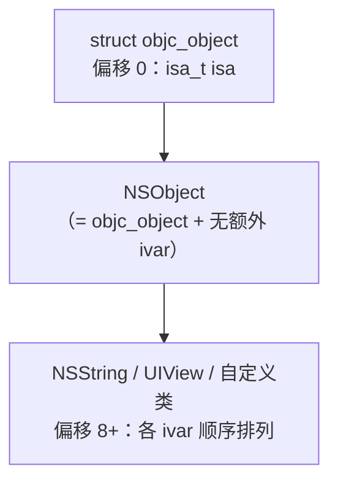
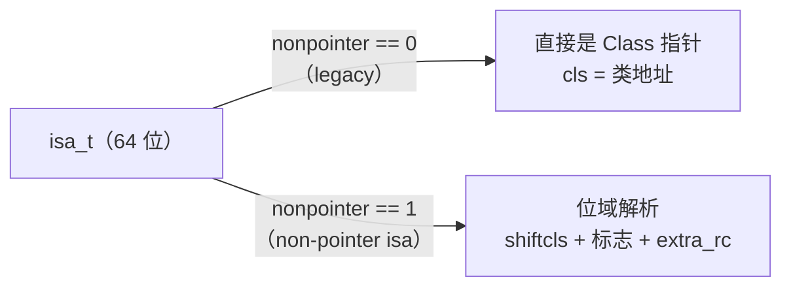
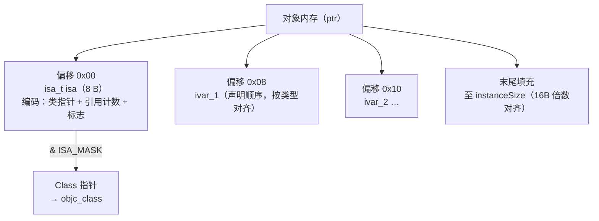

# ObjC运行时（02）· 对象模型与isa

## 概述与定位

> [!abstract] TL;DR
> Objective-C 中的一切对象在内存里都是一个 C 结构体，**第一个成员永远是 `isa`**。`isa` 是一个 64 位字，既编码了"这个对象是哪个类的实例"（类指针），又在 ARM64 non-pointer isa 优化下把**引用计数、弱引用标志、析构标志**等元数据塞进同一个 8 字节里——节省内存、加速 retain/release。逆向时，对象内存的第一个 8 字节 `& ISA_MASK` 即可还原类指针；在 Frida/LLDB 里扫描堆、确认对象类型，正是这一机制的直接应用。

本篇聚焦 `objc_object`、`isa_t` 联合体、ARM64 non-pointer isa 位域全解，以及对象内存布局。类结构、元类体系详见 [[03.类、元类与方法列表]]；引用计数完整机制详见 [[09.属性与ARC内存管理]]；消息发送如何用 isa 定位 class 见 [[04.objc_msgSend消息发送]]；关联对象与 KVO 的 isa-swizzling 见 [[07.关联对象与KVO]]。

---

## 原理与机制

### id 就是 `objc_object *`

在 Objective-C 的类型系统里，`id` 是"任意对象指针"的通用类型，其底层定义极为简单：

```c
// <objc/objc.h>
typedef struct objc_object *id;
```

每个 Objective-C 对象在内存中都是一个 `objc_object` 结构体实例；`id` 不过是指向该结构的裸指针。编译器把 `NSObject *obj` 和 `id obj` 同等对待——差别只在静态类型检查，运行时两者完全相同。

### `objc_object`：一切对象的基石

Apple 开源的 `objc4` 中，`objc_object` 只有**一个**成员：

```c
// objc-private.h（objc4 源码）
struct objc_object {
    isa_t isa;   // 对象第一个成员，固定偏移 0
    // ...（实例变量紧随其后，由编译器根据 class_ro_t 布局）
};
```

> [!important] 固定偏移 0
> `isa` 必须位于偏移 0，这是运行时的根本约定。`objc_msgSend`、`retain`/`release`、Frida 的类型探查，全部依赖"取对象首字即 isa"这一假设。

`NSObject` 在 ObjC 层面等价于一个只含 `isa` 的结构体，子类在其后追加各自的实例变量（ivar）：



---

## 结构与源码详解

### `isa_t`：联合体的两种形态

`isa` 并非简单的类指针，而是一个**联合体（union）**，在不同情形下有两种解读方式：

```c
// objc-private.h（简化，基于 objc4-906）
union isa_t {
    Class cls;          // 裸类指针（legacy / non-pointer 关闭时直接读）
    uintptr_t bits;     // 完整 64 位，non-pointer 时逐位解析

    // ARM64 non-pointer isa 位域（见下表）
    struct {
        uintptr_t nonpointer        :  1;
        uintptr_t has_assoc         :  1;
        uintptr_t has_cxx_dtor      :  1;
        uintptr_t shiftcls          : 33;
        uintptr_t magic             :  6;
        uintptr_t weakly_referenced :  1;
        uintptr_t deallocating      :  1;
        uintptr_t has_sidetable_rc  :  1;
        uintptr_t extra_rc          : 19;
    };
};
```



#### ARM64 non-pointer isa 位域详解

下表以 Apple ARM64（iPhone/iPad，iOS 12+，objc4-781 以后稳定形态）为准；**不同平台（x86_64 模拟器、老版本）位宽分配不同**，字段顺序也可能调整，逆向时应以目标架构实际头文件为准。

| 位域名称 | 位宽（ARM64） | 起始位 | 含义 |
|---|---|---|---|
| `nonpointer` | 1 | 0 | `1` = non-pointer isa 优化已启用；`0` = 裸指针，后续位域无效 |
| `has_assoc` | 1 | 1 | 是否存在关联对象（`objc_setAssociatedObject`）；dealloc 时据此决定是否清理关联表（详见 [[07.关联对象与KVO]]） |
| `has_cxx_dtor` | 1 | 2 | 类是否有 C++ 析构函数或 ARC 成员变量的析构逻辑；`objc_destructInstance` 据此调用 `.cxx_destruct` |
| `shiftcls` | 33 | 3–35 | **类指针的有效位**；实际 `Class` 地址 = `shiftcls << 3`（低 3 位因地址对齐恒为 0，故舍去） |
| `magic` | 6 | 36–41 | 固定值 `0x3b`（`0b111011`），用于调试时区分已初始化对象与野指针/未初始化内存 |
| `weakly_referenced` | 1 | 42 | 是否曾被 `__weak` 变量指向；dealloc 时据此决定是否清理 weak 表 |
| `deallocating` | 1 | 43 | 正在执行 `dealloc`；防止重入或过早释放 |
| `has_sidetable_rc` | 1 | 44 | 内联引用计数 `extra_rc` 溢出时置 1，真实计数存于全局 SideTable（详见 [[09.属性与ARC内存管理]]） |
| `extra_rc` | 19 | 45–63 | **内联引用计数**：存储 `retainCount - 1`（0 代表引用计数为 1）；19 位最多内联存储 524287 次 retain |

> [!note] 位宽说明
> ARM64 共 64 位：1+1+1+33+6+1+1+1+19 = 64，恰好填满。x86_64（模拟器）的 `shiftcls` 为 44 位，`extra_rc` 仅 8 位，整体布局不同。

#### 位域图示（ARM64，bit 0 在最低位）

```
63         45 44  43  42  41      36 35              3  2   1   0
┌───────────┬──┬───┬───┬──────────┬─────────────────┬───┬───┬───┐
│  extra_rc │hs│dea│wr │  magic   │    shiftcls      │hcd│ha │ np│
│  (19 bit) │rc│loc│   │ (6 bit)  │    (33 bit)      │   │   │   │
└───────────┴──┴───┴───┴──────────┴─────────────────┴───┴───┴───┘
np  = nonpointer        ha  = has_assoc       hcd = has_cxx_dtor
wr  = weakly_referenced dea = deallocating    hs  = has_sidetable_rc
```

### 为什么要 non-pointer isa？

在 64 位系统上，一个指针天然有 64 位，但类地址只需其中的 33~36 位（用户空间地址空间有限，且对齐后低位恒 0）。如果 `isa` 只存类指针，其余位完全浪费。non-pointer isa 的核心思路是：

1. **复用空闲位存元数据**：把引用计数（`extra_rc`）、弱引用标志、析构标志等全部打包进同一个 8 字节。
2. **减少内存读写**：retain/release 直接在 `isa.extra_rc` 上做原子加减，无需访问独立的引用计数存储，减少 cache miss。
3. **节省 SideTable 压力**：绝大多数对象引用计数不超过 524287，完全内联存储，SideTable 只作溢出兜底。

### 取类指针：`ISA_MASK` 与 shiftcls 还原

运行时读取类指针不能直接用 `isa.cls`（non-pointer 时高位含引用计数），必须屏蔽非类位：

```c
// 运行时内部（简化）
#define ISA_MASK  0x0000000ffffffff8ULL   // ARM64，抠出 shiftcls 对应位（示例值）

inline Class
objc_object::getIsa() {
    if (!isTaggedPointer()) {
        return isa.cls;   // 若 nonpointer==0 直接返回
    }
    // non-pointer：屏蔽掉非类位
    uintptr_t cls = isa.bits & ISA_MASK;
    return (Class)cls;
}
```

等价于：`Class = (isa.bits >> 3) << 3`，即清零低 3 位；或直接 `isa.bits & ISA_MASK`。

> [!warning] 示例输出为示意
> LLDB 实操：
> ```
> (lldb) po 0x000000010a3f8498   # isa.bits 示例值（非真实地址）
> (lldb) p/x 0x000000010a3f8498 & 0x0000000ffffffff8
> (uintptr_t) $1 = 0x000000010a3f8498   # → 类地址（示例）
> ```

---

### 对象内存布局

一个 `NSObject` 子类实例的内存从地址 `ptr` 开始，依次是：

```
ptr + 0x00 │ isa_t isa          │ 8 字节（non-pointer isa / 裸类指针）
ptr + 0x08 │ ivar_1             │ 按声明类型对齐
ptr + ...  │ ivar_2             │
ptr + ...  │ ...                │
ptr + N    │（末尾填充至 instanceSize 对齐，通常 16 字节倍数）
```



`instanceSize` 由编译器根据 `class_ro_t.instanceSize` 确定，并向上对齐至 16 字节（iOS 对象的最小分配粒度），通过 `class_getInstanceSize()` 可在运行时查询。

子类继承时，父类 ivar 排在低地址，子类新增 ivar 追加在后（Objective-C fragile/non-fragile ABI 差异决定是否固定偏移，现代 ARM64 使用 non-fragile ABI，ivar 偏移在运行时可调整）。

---

### 三层 isa 走向预告

`isa` 不仅把实例连接到类，类对象本身也是 `objc_object`，其 `isa` 指向**元类（metaclass）**：

```
instance.isa  ──→  class（类对象）
class.isa     ──→  metaclass（元类）
metaclass.isa ──→  NSObject 元类（根元类，isa 指向自身）
```

完整的元类体系、`superclass` 链、`class_ro_t`/`class_rw_t` 结构详见 [[03.类、元类与方法列表]]。

---

### `extra_rc` 与 SideTable

引用计数有两级存储：

- **内联（`extra_rc`，19 位）**：存 `retainCount - 1`，原子加减；绝大多数对象终身在这里。
- **溢出（SideTable）**：当 `extra_rc` 溢出（超过 `RC_HALF = 2^18`），运行时将一半计数迁移到全局 `SideTable` 哈希表，并置 `has_sidetable_rc = 1`；后续 release 先从 SideTable 批量归还到 `extra_rc`。

详细的 retain/release 流程、`__weak` 弱引用表、autoreleasepool 哨兵机制见 [[09.属性与ARC内存管理]]。

---

## 逆向实践

### 内存里找对象类型：`& ISA_MASK`

在 Frida 或 LLDB 中，拿到一个疑似对象的地址，取首 8 字节 `& ISA_MASK` 即可还原类指针：

```javascript
// Frida（ARM64，ISA_MASK 示例值）
const ISA_MASK = ptr('0x0000000ffffffff8');
function getClass(objPtr) {
    const isaBits = objPtr.readPointer();
    return isaBits.and(ISA_MASK);
}
const clsPtr = getClass(ptr('0x...'));  // 目标对象地址（示例）
console.log(new ObjC.Object(clsPtr).toString());
```

> [!warning] 示例输出为示意
> 实际 ISA_MASK 值随 iOS 版本/架构变化，应从运行时符号 `objc_debug_isa_class_mask` 读取，而非硬编码。

```bash
# LLDB：读 isa 并屏蔽
(lldb) x/gx 0x<对象地址>          # 读首 8 字节（isa.bits）
(lldb) p/x (Class)(<isa.bits> & 0x0000000ffffffff8)   # 还原类指针（示例）
(lldb) po (Class)(<类指针>)        # 打印类名
```

> [!warning] 示例输出为示意

### 扫描堆中的对象

Frida 的 `ObjC.choose()` 底层即遍历堆页、对每个疑似对象地址验证 `isa & ISA_MASK` 是否为已知类，从而定位所有活跃实例：

```javascript
ObjC.choose(ObjC.classes.SomeClass, {
    onMatch: function(obj) {
        console.log('found:', obj.toString(), 'at', obj.handle);
    },
    onComplete: function() { console.log('done'); }
});
```

> [!warning] 示例输出为示意

### LLDB 读 isa 位域

```bash
(lldb) p/x *(uintptr_t *)0x<obj_addr>   # 读 isa.bits（示例）
# 手动解析：
#   bits[0]    nonpointer
#   bits[3:35] shiftcls  → & ISA_MASK → 类地址
#   bits[45:63] extra_rc → retainCount - 1
```

> [!warning] 示例输出为示意

---

## 安全性与正确使用

### isa 直接改写的风险

`isa` 是 C 级别公开字段（`object_setClass()` 封装了安全版本），直接写 `obj->isa` 绕过所有安全检查：

- **object_setClass() vs 直接写**：应始终使用 `object_setClass()`，它会校验目标类的兼容性（ivar 布局兼容、不能降级为元类等）；直接写 `isa` 可能使运行时对 `has_assoc`/`has_sidetable_rc` 等标志产生误判，导致内存泄漏或崩溃。
- **并发写 isa**：`isa` 的多位更新（如同时修改类指针与 `has_assoc`）在非 ARM64 原子操作下存在 race；运行时用 `ISA_CAS`（Compare-And-Swap）保护，手动写不受保护。

### KVO 的 isa-swizzling

Key-Value Observing（KVO）正是利用 isa 可改写的特性实现的：当你对一个对象调用 `addObserver:...`，运行时在幕后动态生成 `NSKVONotifying_<ClassName>` 子类，重写 setter，然后**把该对象的 `isa` 偷偷改成这个新子类**（isa-swizzling）。对象的 `class` 方法同时被重写以返回原始类名，因此外部看不出变化。完整机制见 [[07.关联对象与KVO]]。

### 版本与架构差异

| 平台 / 场景 | isa 形态 | 注意事项 |
|---|---|---|
| ARM64（现代 iOS/iPadOS） | non-pointer isa，`shiftcls` 33 位 | ISA_MASK 随版本小幅变化，勿硬编码 |
| x86_64 模拟器 | non-pointer isa，`shiftcls` 44 位，`extra_rc` 8 位 | 位域布局与真机不同 |
| armv7（iOS 8 之前） | 裸类指针，`nonpointer = 0` | 直接读 `isa.cls` |
| Tagged Pointer | 非真对象，整个指针编码值和类型 | 需先排除 `isTaggedPointer()` 再读 isa |

> [!tip] 逆向合规提示
> 读 `isa` 做类型识别、调试自有 App 属于正常开发行为。绕过他人 App 的类型检查或篡改 `isa` 以规避付费验证，可能违反平台条款与相关法规；请在授权环境内进行安全研究。

---

## 小结

- `id` = `objc_object *`，任何对象内存的偏移 0 是 `isa_t isa`。
- `isa_t` 是联合体：裸 Class 指针（legacy）或 non-pointer isa（ARM64 优化，64 位字里同时存类指针 + 引用计数 + 多个标志位）。
- ARM64 non-pointer isa 位域：`nonpointer(1) | has_assoc(1) | has_cxx_dtor(1) | shiftcls(33) | magic(6) | weakly_referenced(1) | deallocating(1) | has_sidetable_rc(1) | extra_rc(19)`，共 64 位。
- 取类指针：`isa.bits & ISA_MASK`（= `shiftcls << 3`）。
- 对象内存布局：isa(8B) + ivar 按声明顺序，向上对齐至 16 字节 `instanceSize`。
- `extra_rc` 内联引用计数，溢出落 SideTable；`has_sidetable_rc` 标志溢出状态。
- 逆向核心：首 8 字节 `& ISA_MASK` 找类，Frida/LLDB 扫堆定对象类型。
- isa 改写需谨慎：KVO 通过 isa-swizzling 实现；直接写 `isa` 绕过安全检查，有崩溃风险。

---

## 相关阅读

- [[03.类、元类与方法列表]] — `objc_class` 结构、元类体系、`class_rw_t`/`class_ro_t`、`method_t`
- [[04.objc_msgSend消息发送]] — 消息发送如何用 isa 定位类、`cache_t` 快速查找
- [[09.属性与ARC内存管理]] — retain/release 完整流程、SideTable、weak 表、autoreleasepool
- [[07.关联对象与KVO]] — 关联对象存储、KVO 的 isa-swizzling 全貌
- [[01.Objective-C运行时概览]] — 运行时整体定位、objc4 源码入口
- [[12.Mach-O文件详解/00.Mach-O文件详解总览|Mach-O 文件详解]] — `__objc_classlist` 等元数据节如何存储类信息
- [[44.调试器原理与实战/09.LLDB原理与实战|LLDB 原理与实战]] — 配合 LLDB 调试 isa 与对象布局

---

⬅️ 上一篇 [[01.Objective-C运行时概览]] ｜ 🏠 [[00.Objective-C与iOS运行时总览]] ｜ 下一篇 [[03.类、元类与方法列表]] ➡️
