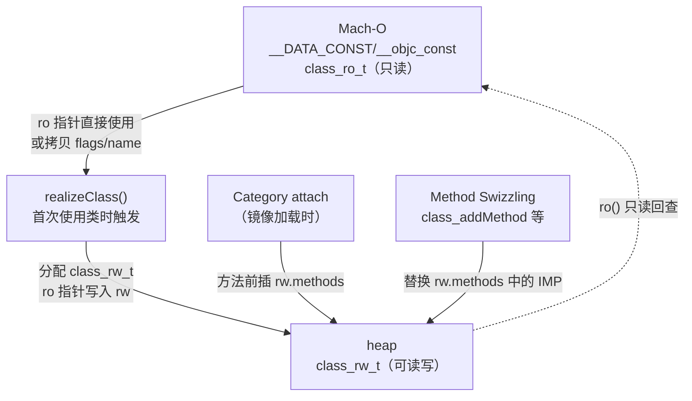
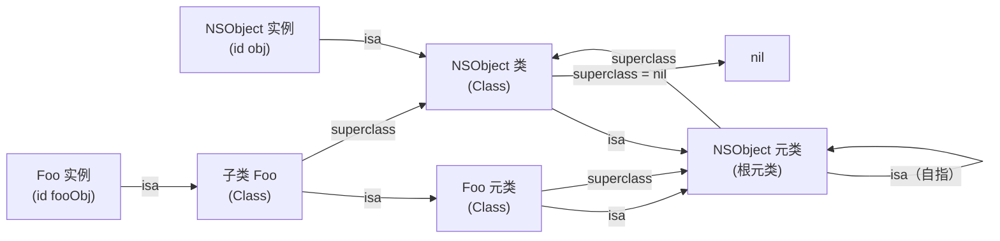
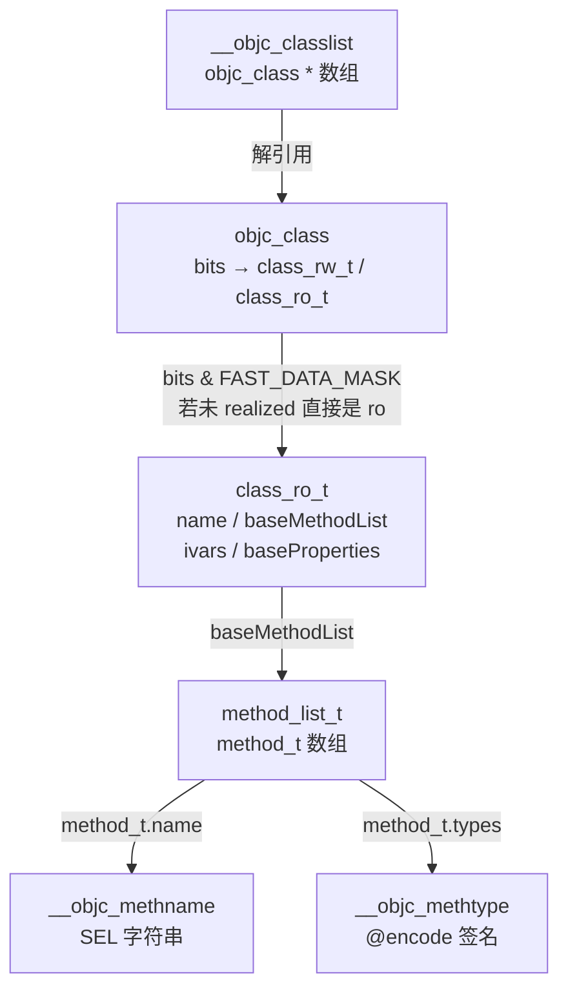

# ObjC运行时（03）· 类、元类与方法列表

## 概述与定位

> [!abstract] TL;DR
> Objective-C 的"类"本身也是一个对象——`objc_class` 继承自 `objc_object`，同样持有 `isa`。`isa` 所指之处，就是**元类（metaclass）**；元类存储类方法，普通类存储实例方法。编译器把类的只读信息（方法名、ivar、属性列表）固化为 `class_ro_t` 写入 Mach-O；运行时首次实例化时，`realizeClass` 把 `ro` 的内容"升级"为可读写的 `class_rw_t`，此后 Category 方法、Swizzling 的替换全在 `rw` 上完成。理解这套三层结构（`objc_class` → `class_rw_t` → `class_ro_t`）是读懂消息查找、Category、逆向还原的前提。

上一篇 [[02.对象模型与isa]] 讲完了 `isa_t` 的位域布局与实例的内存模型；本篇向上一级，拆解"类"本身的数据结构：`objc_class`、元类体系、`class_ro_t`/`class_rw_t` 的关系，以及 `method_t`/`ivar_t`/`property_t` 等核心类型。这些结构在 Mach-O 的 `__DATA/__objc_classlist` 等节中静态存储（详见 [[11.Mach-O中的ObjC元数据]]），也是下一篇 [[04.objc_msgSend消息发送]] 方法查找的直接操作对象。

---

## 原理与机制

### 类也是对象：`objc_class : objc_object`

在 C 语言层面，Objective-C 的所有"对象"都源自同一个根结构 `objc_object`：

```c
// objc4 源码（简化）
struct objc_object {
    isa_t isa;   // ARM64 non-pointer isa，见前篇
};
```

而**类**本身也是一个对象，它的结构是 `objc_class`，继承自 `objc_object`：

```c
struct objc_class : objc_object {
    // 继承的 isa：指向本类的"元类（metaclass）"
    Class      superclass;         // 父类指针（根类 NSObject 的 superclass = nil）
    cache_t    cache;              // 方法缓存（bucket_t 哈希表，快速路径用）
    class_data_bits_t bits;        // 编码了 class_rw_t * 以及若干标志位
};
```

四个字段各有分工：

| 字段 | 大小（ARM64） | 含义 |
|------|-------------|------|
| `isa`（继承自 `objc_object`） | 8 字节 | non-pointer isa，`shiftcls` 域指向**元类** |
| `superclass` | 8 字节 | 指向父类（类链），根元类的 superclass 指向 NSObject 类 |
| `cache` | 16 字节 | `bucket_t *` 哈希桶 + 掩码，IMP 缓存，见 [[04.objc_msgSend消息发送]] |
| `bits` | 8 字节 | 低位 `FAST_DATA_MASK` 取出 `class_rw_t *`，高位存标志 |

### `bits & FAST_DATA_MASK` → `class_rw_t *`

`bits` 字段并非一个纯指针——它把若干标志位塞进了低三位（按对齐保证必为 0）：

```c
// ARM64（非 iOS simulator）
#define FAST_IS_SWIFT_LEGACY    (1UL<<0)
#define FAST_IS_SWIFT_STABLE    (1UL<<1)
#define FAST_HAS_DEFAULT_RR     (1UL<<2)
#define FAST_DATA_MASK          0x00007ffffffffff8UL   // 取中间 bits

inline class_rw_t *data() const {
    return (class_rw_t *)(bits & FAST_DATA_MASK);
}
```

逆向读 `objc_class` 时，不能直接把 `bits` 当指针，必须先与 `FAST_DATA_MASK` 做与运算。

---

## 结构 / 源码 / 流程详解

### `class_ro_t`：只读，编译期生成，落进 Mach-O

`class_ro_t`（**r**ead-**o**nly）在编译时由编译器生成并写入 Mach-O 的 `__DATA_CONST/__objc_const` 节，程序加载后其内容**不可修改**（页面权限为只读）。

```c
struct class_ro_t {
    uint32_t          flags;             // 类标志位（元类/根类/ARC等，见下表）
    uint32_t          instanceStart;     // 实例变量区起始偏移（用于继承对齐）
    uint32_t          instanceSize;      // 实例大小（字节）
#ifdef __x86_64__
    uint32_t          reserved;
#endif
    const uint8_t    *ivarLayout;        // 强引用 ivar 位图（ARC GC 扫描用）
    const char       *name;             // 类名 C 字符串（指向 __objc_classname 节）
    method_list_t    *baseMethodList;   // 编译期方法列表（指向 __objc_methnames）
    protocol_list_t  *baseProtocols;    // 编译期协议列表
    const ivar_list_t *ivars;           // 实例变量列表（只在 ro 里有）
    const uint8_t    *weakIvarLayout;   // 弱引用 ivar 位图
    property_list_t  *baseProperties;  // 编译期属性列表
};
```

`flags` 常用位含义（部分）：

| 位掩码（十六进制） | 含义 |
|--------------------|------|
| `0x1` | `RO_META`：本结构体描述的是**元类** |
| `0x2` | `RO_ROOT`：本类是根类（NSObject） |
| `0x4` | `RO_HAS_CXX_STRUCTORS`：有 C++ 构造/析构 |
| `0x80` | `RO_IS_ARC`：ARC 模式编译 |
| `0x400` | `RO_HAS_WEAK_WITHOUT_ARC` |

`instanceStart`/`instanceSize` 的设计考虑了继承时的对齐——子类可以在父类 `instanceSize` 之后追加 ivar，不与父类重叠。

> [!info] 与 Mach-O 节的关系
> `class_ro_t` 本身存储在 `__DATA_CONST/__objc_const`；其 `name` 指向 `__TEXT/__objc_classname`；`baseMethodList` 的方法名（`SEL`）字符串指向 `__TEXT/__objc_methname`；方法类型编码字符串指向 `__TEXT/__objc_methtype`。详见 [[11.Mach-O中的ObjC元数据]]。

---

### `class_rw_t`：可读写，运行时构建

`class_rw_t`（**r**ead-**w**rite）在运行时的 `realizeClass` 阶段才被创建，存于堆上，可以被 Category、Swizzling、运行时 API 修改。

```c
struct class_rw_t {
    uint32_t          flags;            // 运行时标志
    uint16_t          witness;          // 并发读写保护（objc4-866+）
    explicit_atomic<uintptr_t> ro_or_rw_ext; // 指向 ro 或 rw_ext（小型优化）

    Class             firstSubclass;    // 子类链表头
    Class             nextSiblingClass; // 同级类链表（遍历类层次用）

    // 方法/属性/协议都是二维 list_array_tt（支持多次追加）
    method_array_t    methods;          // 实例方法（或元类的类方法）
    property_array_t  properties;       // 属性列表
    protocol_array_t  protocols;        // 协议列表

    const class_ro_t *ro() const;       // 返回对应的只读 ro
    const char       *demangledName;    // Swift demangled 名（Swift 类用）
};
```

`methods`/`properties`/`protocols` 的类型是 `list_array_tt<T, List>`——一个"二维数组"，内部持有多个 `method_list_t *` 的数组。每次 Category 被 attach，其方法列表被**追加**（前插）到该二维数组，而不是合并进同一个列表。这就是为何 Category 方法"覆盖"原方法——查找时遍历到的第一个同名 `method_t` 获胜，而 Category 列表排在更前面。

> [!tip] 关联到 Category
> Category 的 attach 时机与 `+load`/`+initialize` 的调用顺序，详见 [[06.Category与load和initialize]]。

---

### `ro` 与 `rw` 的关系：`realizeClass` 流程



关键步骤：

1. 程序启动，`dyld` 加载 Mach-O，`__objc_classlist` 中的 `objc_class *` 指针被注册。
2. 首次向该类发送消息（或 `+load` 触发），`objc_class::data()` 此时返回的是 `class_ro_t *`（一个特殊的"未实现"状态，`RW_REALIZED` 位未置）。
3. `realizeClass` 被调用：分配 `class_rw_t`，把 `ro` 的 `flags`、`name`、`baseMethodList` 等复制或链接进 `rw`，将 `bits` 指向新的 `class_rw_t`，置 `RW_REALIZED`。
4. 递归 realize 父类与元类。
5. 在 `_dyld_objc_notify_mapped` 回调中，`Category` 被 attach 到对应类的 `rw.methods`（前插）。

---

### 元类（Metaclass）体系

Objective-C 里"类方法"（`+ (void)doSomething`）由谁存储？答案是**元类**。

- 每个**类对象**（`objc_class`）本身也是 `objc_object`，它的 `isa` 指向**本类的元类**。
- 元类（metaclass）也是一个 `objc_class`，其 `methods` 存储的是**类方法**。
- 向类发送消息（调用类方法）时，`objc_msgSend` 通过类对象的 `isa` 找到元类，再在元类的 `methods` 中查找 IMP。
- 向实例发送消息时，通过实例的 `isa` 找到类对象，在类对象的 `methods` 中查找 IMP。

这套对称设计让实例方法与类方法统一纳入同一套消息分发机制。

#### 经典 isa / superclass 走向图



规律总结（务必记住）：

| 关系 | 走向 |
|------|------|
| `instance.isa` | → 类（Class） |
| `Class.isa` | → 元类（Metaclass） |
| `Metaclass.isa` | → 根元类（NSObject 元类） |
| 根元类.isa | → 自身（闭合环） |
| `Class.superclass` | → 父类 |
| `Metaclass.superclass` | → 父元类 |
| 根元类.superclass | → **NSObject 类**（不是根元类！） |

最后一条尤为关键：根元类的 `superclass` 指向 NSObject 类，而非元类链——这让"向任何类对象发送 NSObject 的实例方法（如 `-description`、`-respondsToSelector:`）"变成合法的，查找能沿 superclass 链抵达 NSObject 类。

---

### `method_t`：方法条目

每个方法由 `method_t` 描述：

```c
// objc4 中两种布局（old big 与 new small）
struct method_t {
    // ---- big（传统，ARM64 旧版）----
    SEL        name;         // 方法选择子（全局唯一 C 字符串指针）
    const char *types;       // @encode 签名，如 "v16@0:8"（void, id, SEL）
    IMP        imp;          // 函数指针，id (*IMP)(id, SEL, ...)

    // ---- small（相对偏移，objc4-818+）----
    // int32_t nameOffset;   // 相对偏移指向 SEL 引用（__objc_selrefs）
    // int32_t typesOffset;  // 相对偏移指向类型编码字符串
    // int32_t impOffset;    // 相对偏移指向函数实现
};
```

字段说明：

| 字段 | 类型 | 含义 |
|------|------|------|
| `name` / `nameOffset` | `SEL` / `int32_t` | 方法名，运行时中是全局唯一的 `const char *`（注册进 selector 表） |
| `types` / `typesOffset` | `const char *` / `int32_t` | `@encode` 类型编码，如 `"v16@0:8"` 表示返回 void、参数 `id` 偏移 0、`SEL` 偏移 8 |
| `imp` / `impOffset` | `IMP` / `int32_t` | 实现函数指针，`typedef id (*IMP)(id, SEL, ...)` |

#### Relative Method（Small Method）

从 Xcode 12 / iOS 14 起，编译器对**所有新编译的 App** 改用"相对方法列表"（`method_t::small`）：

- 三个字段均改为 `int32_t` **相对偏移**（相对于自身地址的偏移量），而非绝对指针。
- 好处：①二进制可以 **ASLR 重定位为零**（偏移值不含绝对地址，dyld shared cache 中方法列表可在进程间只读共享，节省内存）；②结构体大小从 24 字节降至 12 字节。
- `method_list_t` 头部的 `flags` 第 31 位（`METHOD_LIST_IS_UNIQUED_RELATIVE`）置 1 表示小方法列表。
- 在逆向时，Hopper/IDA 若检测到相对方法列表，会自动加偏移计算出绝对地址；`class-dump` 在处理此类二进制时需要较新版本。

```
传统 big method_t（24 字节，ARM64）：
  offset+0  : SEL *        name    （8 字节绝对指针）
  offset+8  : char *       types   （8 字节绝对指针）
  offset+16 : IMP          imp     （8 字节绝对指针）

相对 small method_t（12 字节）：
  offset+0  : int32_t  nameOffset   （→ __objc_selrefs 中 SEL 引用）
  offset+4  : int32_t  typesOffset  （→ __objc_methtype 字符串）
  offset+8  : int32_t  impOffset    （→ 函数入口，或 stub）
```

---

### `ivar_t`：实例变量

```c
struct ivar_t {
    int32_t      *offset;       // 指向 ivar 偏移量的指针（Non-fragile ABI：运行时可调整）
    const char   *name;         // 变量名 C 字符串
    const char   *type;         // @encode 类型编码
    uint32_t      alignment_raw;// log2 对齐
    uint32_t      size;         // 大小（字节）
};
```

Non-fragile ABI（ARM64 默认）的关键设计：`offset` 是一个**指针**，指向一个全局变量（存于 `__DATA/__objc_ivar`），运行时若需要调整（如子类插 ivar）可写入该全局变量，而不必改动 `ivar_t` 结构本身。这使得"框架二进制升级后子类不需要重新编译"成为可能。

> [!note] ivars 只在 class_ro_t 里
> `ivars` 字段仅存在于 `class_ro_t`，不在 `class_rw_t` 中——运行时**不能动态增删 ivar**（对象内存布局在 `instanceSize` 确定后就固定了）。Category 只能加方法和属性，不能加 ivar。

---

### `property_t`：属性

```c
struct property_t {
    const char *name;       // 属性名
    const char *attributes; // 属性特性字符串，如 "T@\"NSString\",C,N,V_title"
};
```

`attributes` 是逗号分隔的 `@encode` 扩展格式，常见 key：

| Key | 含义 |
|-----|------|
| `T` | 类型编码（如 `T@"NSString"` 表示 `NSString *`） |
| `C` | `copy` 语义 |
| `&` | `strong`（retain）语义 |
| `W` | `weak` |
| `N` | `nonatomic` |
| `R` | `readonly` |
| `V` | 对应的实例变量名（如 `V_title`） |
| `G`/`S` | 自定义 getter/setter 名 |

---

### 运行时 API

常用运行时 API 及其操作目标：

| API | 操作对象 | 说明 |
|-----|----------|------|
| `object_getClass(id obj)` | `obj->isa`（解码） | 返回对象的类，等价于 `[obj class]`（但绕过重写） |
| `class_getSuperclass(Class cls)` | `cls->superclass` | 返回父类 |
| `objc_getMetaClass("ClassName")` | 查找元类 | 返回类的元类对象 |
| `class_isMetaClass(Class cls)` | `ro->flags & RO_META` | 判断是否是元类 |
| `class_addMethod(Class, SEL, IMP, types)` | `rw->methods` 追加 | 向 `class_rw_t` 动态追加方法 |
| `class_replaceMethod(Class, SEL, IMP, types)` | `rw->methods` 替换 | 替换已有方法 IMP |
| `class_copyMethodList(Class, &count)` | `rw->methods` 遍历 | 返回所有方法的拷贝数组（调用方负责 `free`） |
| `method_exchangeImplementations(m1, m2)` | 两个 `method_t.imp` 互换 | Method Swizzling 核心，见 [[08.Method Swizzling]] |
| `class_getInstanceVariable(Class, name)` | `ro->ivars` | 查找 ivar（只读，不可新增） |

> [!warning] 示例输出为示意
> 以下 `class-dump` 与 LLDB 输出均为示例，非真实设备运行结果。

```
# 用 class-dump 还原类头（示例）
$ class-dump -H MyApp.decrypted -o ./Headers/

# LLDB：打印类的方法列表（示例）
(lldb) expression -l objc -O -- [NSObject class]
NSObject
(lldb) p (int)class_copyMethodList([NSObject class], (unsigned int *)0)
```

---

## 逆向实践

### 从 Mach-O 还原类结构

class-dump / Hopper 解析 iOS 二进制时，本质上就是遍历以下 Mach-O 节：

| 节 | 内容 |
|----|------|
| `__DATA/__objc_classlist` | `objc_class *` 指针数组（详见 [[12.Mach-O文件详解/36.Mach-O __objc_classlist节|Mach-O __objc_classlist 节]]） |
| `__DATA/__objc_catlist` | Category 指针（详见 [[12.Mach-O文件详解/39.Mach-O __objc_catlist节|Mach-O __objc_catlist 节]]） |
| `__DATA/__objc_selrefs` | SEL 引用表（详见 [[12.Mach-O文件详解/35.Mach-O __objc_selrefs节|Mach-O __objc_selrefs 节]]） |
| `__TEXT/__objc_methname` | 方法名字符串池（详见 [[12.Mach-O文件详解/24.Mach-O __objc_methname节|Mach-O __objc_methname 节]]） |
| `__TEXT/__objc_methtype` | 方法类型编码字符串池（详见 [[12.Mach-O文件详解/26.Mach-O __objc_methtype节|Mach-O __objc_methtype 节]]） |

还原流程（逆向视角）：



> [!warning] 示例输出为示意
> 下方 `otool` 输出为示意，地址为虚构值。

```
# otool 查看类列表（示意）
$ otool -s __DATA __objc_classlist MyApp | head -20
__DATA,__objc_classlist:
0000000100050000  a8 12 05 00 01 00 00 00  ...
```

实际逆向中通常直接用 class-dump 或 Hopper（后者能解析 relative method 并标注 `@encode`），而不手工解析字节。

---

## 安全性与正确使用

### `class_rw_t` 可改，`class_ro_t` 不可改

- `class_rw_t` 位于堆，运行时允许通过 `class_addMethod`/`class_replaceMethod` 修改其 `methods`。
- `class_ro_t` 位于 `__DATA_CONST` 节，iOS 上该段权限为只读（`VM_PROT_READ`），直接写入会触发 `SIGBUS`/`SIGSEGV`。逆向时若要 patch 方法，只能通过运行时 API 操作 `rw` 层，或通过 Frida 在内存中 hook IMP。

### Relative Method 对 dyld Shared Cache 的影响

`small method_t` 使方法列表在 dyld shared cache 中**真正只读共享**：所有进程共享同一份系统框架的方法列表物理页，节省约数十 MB RAM。但这也意味着：

- **逆向分析**需要注意 small method 的 `impOffset` 是相对偏移，在 dyld shared cache 之外（独立 App 二进制）它指向的是一个 **stub thunk**，而非真正的 IMP——真正的 IMP 在 cache 内，需经过 `_objc_msgSend_uncached` 解析。
- **Frida hook** 方法时，若目标在 shared cache 内，需 hook 实际函数地址，而非 `method_t.imp` 字段中存的 stub。

### 动态增删方法的正确姿势

```objc
// 正确：在 +load 或 initialize 阶段，持 dispatch_once，对 rw 操作
+ (void)load {
    static dispatch_once_t onceToken;
    dispatch_once(&onceToken, ^{
        Method orig = class_getInstanceMethod([self class], @selector(original:));
        Method swiz = class_getInstanceMethod([self class], @selector(swizzled:));
        method_exchangeImplementations(orig, swiz);
    });
}
```

陷阱：

1. **不要多次 swizzle**：`method_exchangeImplementations` 是**互换**，第二次调用会换回来。`dispatch_once` 是必要保护。
2. **Category 方法覆盖是顺序前插，非合并**：同名方法取决于镜像加载顺序，不要依赖它来"替换"父类行为，请用 Swizzling。
3. **`class_copyMethodList` 返回的数组必须 `free`**：否则内存泄漏。
4. **不要修改 `class_ro_t` 指向的内存**：`__DATA_CONST` 只读保护；`ro->ivars` 不可动态修改。
5. **元类方法调试**：`objc_getMetaClass("Foo")` 返回的是元类，用 `class_copyMethodList` 遍历它可以看到类方法。

### 逆向合规边界

- 分析自有 App 或授权样本的类结构：合法的研究与安全评估行为。
- 用 class-dump 还原头文件、理解框架调用链：标准逆向工程实践。
- 在生产设备上未经授权修改他人 App 的运行时、绕过授权验证：超出合规边界。
- iOS 系统框架的 `class_ro_t` 位于 dyld shared cache，受系统保护；绕过保护须在越狱环境下，且仅用于安全研究。

---

## 小结

| 层次 | 结构 | 可改？ | 存储位置 |
|------|------|--------|----------|
| 对象层 | `objc_class : objc_object` | isa/cache 可改 | 堆（类对象）或数据段 |
| 运行时读写层 | `class_rw_t` | 可改（方法追加/替换） | 堆（运行时分配） |
| 编译只读层 | `class_ro_t` | 不可改 | `__DATA_CONST/__objc_const` |
| 方法条目 | `method_t`（big / small） | imp 可替换 | 方法列表节 |

核心流程一句话：**编译器把类信息固化进 `class_ro_t` 落入 Mach-O；运行时 `realizeClass` 拷出 `class_rw_t` 放到堆上；Category attach、Swizzling 全在 `class_rw_t` 上操作；消息发送通过 `cache_t` 快查、缓存未命中再查 `rw.methods`。**

---

## 相关阅读

- [[02.对象模型与isa]]——`isa_t` 位域与实例内存布局，是本篇 `objc_class` 的基础
- [[04.objc_msgSend消息发送]]——如何利用 `cache_t` 与 `rw.methods` 完成方法查找
- [[06.Category与load和initialize]]——Category 如何 attach 到 `class_rw_t`，`+load` vs `+initialize`
- [[11.Mach-O中的ObjC元数据]]——`class_ro_t` 在 Mach-O 中的静态存储全貌
- [[12.Mach-O文件详解/36.Mach-O __objc_classlist节|Mach-O __objc_classlist 节]]——类列表节的字节布局
- [[12.Mach-O文件详解/24.Mach-O __objc_methname节|Mach-O __objc_methname 节]]——方法名字符串池
- [[12.Mach-O文件详解/26.Mach-O __objc_methtype节|Mach-O __objc_methtype 节]]——方法类型编码字符串
- [[12.Mach-O文件详解/39.Mach-O __objc_catlist节|Mach-O __objc_catlist 节]]——Category 列表节
- [[32.hooks/00.总览|Hook 技术总览]]——Method Swizzling 的工程化实践
- [[34.现代二进制防护机制/11.macOS与iOS防护|macOS/iOS 防护]]——代码签名与运行时保护

---

⬅️ 上一篇 [[02.对象模型与isa]] ｜ 🏠 [[00.Objective-C与iOS运行时总览]] ｜ 下一篇 [[04.objc_msgSend消息发送]] ➡️
