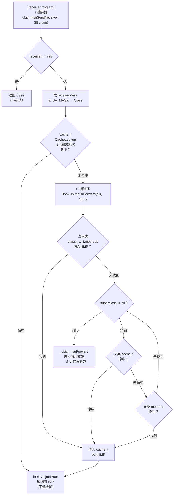

# ObjC运行时（04）· objc_msgSend 消息发送

## 概述与定位

> [!abstract] TL;DR
> `[receiver msg:arg]` 在编译期被转译为 `objc_msgSend(receiver, @selector(msg:), arg)`。运行时以 SEL 为键，在 `cache_t` 哈希桶（汇编快路径）中查找 IMP；命中即以尾调用跳入函数体，无额外栈帧。缓存未命中则进 C 慢路径 `lookUpImpOrForward`：沿 `class_rw_t.methods` 和 `superclass` 链逐级搜索，找到后填缓存再调用；彻底未找到则进入[[05.消息转发机制]]三阶段。整套机制用汇编实现的原因是极致性能与可变参数原样透传。

Objective-C 的一切方法调用都是**消息发送**（message passing）。这一句话不是比喻——编译器真的把每一次方法调用都翻译成对 `objc_msgSend` 的调用，由运行时在运行期动态决定调用哪个函数体。

本篇是消息机制的核心章节，深度剖析：

- 编译期翻译：`[receiver msg:arg]` → `objc_msgSend`
- SEL 与 IMP 的本质与关系
- `objc_msgSend` 为何用汇编、如何做尾调用
- `cache_t` 的结构与哈希查找（汇编快路径）
- C 慢路径 `lookUpImpOrForward` 的完整步骤
- `superclass` 链上的逐级查找
- `objc_msgSendSuper` 与 super 调用语义
- `@encode` 类型编码与历史变体（stret/fpret）
- 调试观察：LLDB 断在 `objc_msgSend` 读寄存器、Frida hook

本篇与[[02.对象模型与isa]]（对象/isa 结构）、[[03.类、元类与方法列表]]（`class_rw_t`/`method_t`）紧密配合，消息未找到后进入[[05.消息转发机制]]。

---

## 编译期翻译：从方括号到函数调用

ObjC 编译器（Clang）将所有 `[receiver msg:arg]` 语法在 **AST → IR** 阶段改写为对运行时函数的调用：

```c
// 源码
NSString *result = [obj uppercaseString];

// 编译器等价改写
NSString *result = ((NSString *(*)(id, SEL))objc_msgSend)(obj, sel_registerName("uppercaseString"));
```

更一般的形式：

```
[receiver msg:arg1 with:arg2]
    ↓ 编译器翻译
objc_msgSend(receiver, @selector(msg:with:), arg1, arg2)
```

`@selector(msg:with:)` 是编译期生成的 SEL 字面量，等价于运行期调用 `sel_registerName("msg:with:")`。返回 `struct` 的方法历史上使用 `objc_msgSend_stret`，浮点返回值使用 `objc_msgSend_fpret`（下文详述）。

---

## SEL：方法名的唯一化指针

**SEL**（selector，选择子）是一个 `const char *` 大小的不透明指针，其本质是**方法名字符串在全局表中的唯一化地址**。

```c
typedef struct objc_selector *SEL;
```

关键性质：

| 性质 | 说明 |
|---|---|
| 全局唯一 | 相同方法名（字符串内容相等）→ 相同 SEL 指针值 |
| 注册函数 | `SEL sel_registerName(const char *name)` |
| 查询函数 | `SEL sel_getUid(const char *name)`（不创建） |
| 比较 | 直接指针相等 `==`，无需 `strcmp` |
| 不含类型信息 | 不同类的同名方法共享同一 SEL |

SEL 在进程启动时由 `dyld` 加载 ObjC 镜像时批量注册（`__objc_methname` 节中的字符串逐一调用 `sel_registerName`）。运行期也可动态注册。

> [!note] SEL 与 `__objc_selrefs`
> Mach-O 的 `__objc_selrefs` 节存储了本模块所有静态引用的 SEL 指针地址，镜像加载时将被更新为全局唯一的 SEL 值。详见 [[12.Mach-O文件详解/35.Mach-O __objc_selrefs节]]。

---

## IMP：方法的真实函数指针

**IMP**（implementation pointer）是方法实现的 C 函数指针：

```c
typedef id (*IMP)(id self, SEL _cmd, ...);
```

每个 ObjC 方法编译为普通 C 函数，约定如下：

| 参数位置 | 名称 | 含义 |
|---|---|---|
| 第 1 个（隐藏） | `self` | 消息接收者对象 |
| 第 2 个（隐藏） | `_cmd` | 当前调用的 SEL |
| 第 3 个起 | 用户声明参数 | 业务参数 |

例如 `- (NSString *)stringByAppendingString:(NSString *)str` 的底层签名为：

```c
NSString *_I_NSString_stringByAppendingString_(id self, SEL _cmd, NSString *str);
```

你可以通过运行时 API 直接获取 IMP：

```c
IMP imp = [obj methodForSelector:@selector(uppercaseString)];
// 之后可直接调用，绕过 objc_msgSend 的查找开销
NSString *result = ((NSString *(*)(id, SEL))imp)(obj, @selector(uppercaseString));
```

---

## `method_t`：SEL 与 IMP 的绑定

`method_t` 是方法描述符，将 SEL、类型编码和 IMP 绑定为一条记录（详见[[03.类、元类与方法列表]]）：

```c
// 旧版（objc4 <= 818）
struct method_t {
    SEL         name;       // 方法名（selector）
    const char *types;      // @encode 类型编码串
    IMP         imp;        // 方法实现指针
};

// 新版（objc4 >= 818，ARM64 relative method）
struct method_t::small {
    int32_t nameOffset;     // SEL 相对偏移（指向 __objc_selrefs 条目）
    int32_t typesOffset;    // 类型串相对偏移
    int32_t impOffset;      // IMP 相对偏移（支持 stub 地址无关）
};
```

---

## objc_msgSend 为何用汇编

`objc_msgSend` 是 ObjC 运行时性能最关键的函数，iOS/macOS 上全部以**手写汇编**实现，原因有三：

### 1. 极致性能

每次 ObjC 方法调用都经过 `objc_msgSend`。一个典型 App 每秒可触发数百万次消息发送。汇编允许精确控制寄存器分配、指令序列和分支预测，消除 C 编译器的保守假设。

### 2. 可变参数原样透传

`objc_msgSend` 需要将调用者传来的所有参数（数量/类型不固定）**原封不动**地传递给最终调用的 IMP——相当于把栈帧和寄存器状态完全透传。这在 C 层无法通过 `va_list` 做到（`va_list` 只能传给接受 `va_list` 的函数），只能在汇编层直接保持寄存器状态。

### 3. 尾调用（Tail Call）跳到 IMP 不留栈帧

当 `objc_msgSend` 找到 IMP 后，通过 ARM64 的 `br x17`（或 x86-64 的 `jmp *rax`）**直接跳转**（不是 `call`），从而把栈帧让给 IMP 自己建立。结果：

- 调用栈中不出现 `objc_msgSend` 帧（性能）
- IMP 返回后直接回到原始调用者（无中间层开销）
- 递归消息不会因 `objc_msgSend` 累积栈帧

---

## `cache_t`：方法缓存结构

`cache_t` 是 `objc_class` 的第三个字段（紧跟 `isa` 和 `superclass`），缓存最近使用的 SEL→IMP 映射，提供 O(1) 平均查找。

```c
// objc_class 布局（简化）
struct objc_class : objc_object {
    // isa（继承自 objc_object）
    Class              superclass;
    cache_t            cache;        // ← 方法缓存
    class_data_bits_t  bits;         // → class_rw_t / class_ro_t
};
```

### `cache_t` 内部结构

```c
struct cache_t {
    // ARM64（objc4-906+，压缩存储）
    explicit_atomic<uintptr_t> _bucketsAndMaybeMask;  // 低位存 buckets 指针，高位存 mask
    union {
        struct {
            explicit_atomic<mask_t> _maybeMask;       // 哈希掩码 = capacity - 1
#if __LP64__
            uint16_t _flags;
            uint16_t _occupied;                       // 已用 bucket 数
#else
            mask_t   _occupied;
#endif
        };
        explicit_atomic<preopt_cache_t *> _originalPreoptCache;
    };
};

struct bucket_t {
    explicit_atomic<uintptr_t> _imp;    // IMP（或相对偏移，平台相关）
    explicit_atomic<SEL>       _sel;    // SEL 键
};
```

### 关键参数

| 字段 | 含义 |
|---|---|
| `buckets` | SEL→IMP 哈希桶数组（大小始终为 2 的幂次） |
| `mask` | `capacity - 1`（用于哈希取模：`index = (SEL >> 2) & mask`） |
| `occupied` | 已填充 bucket 数量 |
| 扩容条件 | `occupied * 4 / 3 >= capacity`（装填因子约 75%）→ 翻倍扩容并**清空重建** |

> [!note] 缓存扩容会清空
> `cache_t` 扩容时不迁移旧数据——直接分配更大数组并清零。这意味着 Method Swizzling 后、或动态添加方法后，下次消息发送重新触发慢路径并填入新 IMP。与[[08.Method Swizzling]]的交互见安全性章节。

### 为何命中率高

ObjC 程序的方法调用在实践中高度集中于少数热方法（80/20 法则更极端：少数核心方法被调用绝大多数次）。`cache_t` 的 LRU 效应（实际是自然淘汰：扩容时清空，新热点浮上来）配合小容量（起始 4 个 bucket）在大多数场景命中率 > 90%。

---

## objc_msgSend 完整查找流程



### 第 ① 步：receiver 为 nil 检查

`objc_msgSend` 汇编入口第一件事：比较 `x0`（ARM64 第一参数，即 `receiver`）是否为 0。若为 nil，直接将所有返回寄存器清零后 `ret`。

这是 ObjC 的语义保证：**向 nil 发消息永远安全、永远返回 0/nil/NO**，调用者无需检查。

### 第 ② 步：取 isa → Class

```
cls = receiver->isa & ISA_MASK
```

ARM64 non-pointer isa 的 `shiftcls` 位域（bits 3~35，33 位）存储类指针，需与 `ISA_MASK`（`0x0000000ffffffff8`，示例值）做 AND 运算还原真实 `Class` 地址。详见[[02.对象模型与isa]]。

### 第 ③ 步：cache_t 快速查找（CacheLookup 汇编宏）

ARM64 汇编（`objc-cache.mm` / `objc_msg_arm64.s`，简化）：

```asm
; 入口：x0 = receiver, x1 = SEL
; ARM64 cache_t 快路径（简化）
CacheLookup:
    ; 从 isa 取 Class（已在 x16）
    ldr     x11, [x16, #CACHE]          ; x11 = &cache_t
    ; 取 buckets 与 mask（ARM64 新版压缩在同一个 uintptr_t）
    ldr     x10, [x11]                  ; x10 = _bucketsAndMaybeMask
    ; 计算哈希 index = (SEL >> 2) & mask
    ; ... 移位与掩码操作 ...
    ; 遍历 bucket（线性探测）
.loop:
    ldr     x9, [x12, #BUCKET_SEL]      ; 取 bucket._sel
    cmp     x9, x1                      ; 与目标 SEL 比较
    b.eq    .hit
    ; 未命中：线性探测下一个（或检测空 bucket 退出）
    b.ne    .miss
.hit:
    ldr     x17, [x12, #BUCKET_IMP]     ; x17 = IMP
    br      x17                         ; 尾调用：跳入 IMP
.miss:
    ; 跳转 C 慢路径
    b       __objc_msgSend_uncached
```

> [!warning] 示例输出为示意
> 以上汇编为教学简化版，实际 `CacheLookup` 宏展开因 ARM64e（PAC）、preopt cache、vtable 等特性更复杂，完整源码见 Apple 开源 `objc4` 仓库 `objc-msg-arm64.s`。

### 第 ④ 步：C 慢路径 `lookUpImpOrForward`

缓存未命中时，从汇编跳入 C 函数 `lookUpImpOrForward(id inst, SEL sel, Class cls, int behavior)`。

### 第 ⑤ 步：在 `class_rw_t.methods` 中查找

`class_rw_t.methods` 是 `method_array_t`（`method_list_t` 数组的数组），方法列表在运行期第一次访问前会**排序**（以 SEL 地址升序），排序后可二分搜索：

```c
// 二分查找 method_list_t（已排序）
static method_t *
findMethodInSortedMethodList(SEL key, const method_list_t *list) {
    // 使用 lo/hi/mid 二分，比较 method_t.name（SEL 指针值）
    // 找到返回 &method，否则返回 nullptr
}
```

找到后：填入 `cache_t`，返回 IMP。

### 第 ⑥ 步：沿 `superclass` 链递归

未找到时，取 `cls->superclass` 继续，依次查父类 `cache_t`、父类 `methods`，直到 `superclass == nil`（`NSObject` 的元类的 `superclass`）。

查找顺序：`当前类 cache → 当前类 methods → 父类 cache → 父类 methods → ... → NSObject methods → nil`

### 第 ⑦ 步：进入消息转发

`superclass == nil` 且仍未找到 → `lookUpImpOrForward` 返回 `_objc_msgForward`（一个特殊 IMP stub）。`objc_msgSend` 以同样的尾调用跳入它，触发三阶段消息转发流程，详见[[05.消息转发机制]]。

---

## `lookUpImpOrForward` 慢路径伪代码

以下基于 Apple 开源 `objc4`（`objc-runtime-new.mm`）还原，非可编译代码：

```c
IMP lookUpImpOrForward(id inst, SEL sel, Class cls, int behavior) {
    IMP imp = nil;
    Class curClass;

    // 1. 再次尝试 cache（防止多线程竞争下已被他人填入）
    imp = cache_getImp(cls, sel);
    if (imp) goto done;

    // 2. 锁定 runtimeLock（读锁）
    runtimeLock.lock();

    // 3. 确保 class 已 realize（懒加载：首次使用时从 class_ro_t 初始化 class_rw_t）
    cls = realizeClassMaybeSwiftMaybeRelock(cls, runtimeLock, ...);

    // 4. 沿 superclass 链查找
    curClass = cls;
    while (true) {
        // 查父类 cache（命中即可跳出）
        imp = cache_getImp(curClass, sel);
        if (imp) break;

        // 查当前类 method_list
        method_t *m = getMethodNoSuper_nolock(curClass, sel);
        if (m) {
            imp = m->imp(false);   // 解引用相对偏移，取绝对 IMP
            break;
        }

        // 上移一级
        curClass = curClass->superclass;
        if (!curClass) {
            // 顶层未找到
            imp = _objc_msgForward_impcache;
            break;
        }
    }

    // 5. 填入 cls（原始起始类）的 cache
    if (imp != _objc_msgForward_impcache) {
        cache_fill(cls, sel, imp, inst);
    }

    runtimeLock.unlock();

done:
    // 6. 返回 IMP（调用者做尾调用）
    return imp;
}
```

> [!note] `realizeClass`
> ObjC 类采用**懒初始化**：第一次收到消息时才从只读的 `class_ro_t` 构建可读写的 `class_rw_t`，并 attach 同名 Category 的方法列表。这是 Category 方法能"覆盖"原始方法的时机。

---

## `objc_msgSendSuper`：super 调用

`super` 关键字并非发给另一个对象，而是改变**查找起点**——从父类开始搜索（接收者仍是 `self`）。编译器将其翻译为：

```c
// ObjC 源码
[super viewDidLoad];

// 编译器翻译
struct objc_super superInfo = {
    .receiver    = self,          // 接收者仍是 self
    .super_class = [ViewController superclass]  // 查找起点：父类
};
objc_msgSendSuper2(&superInfo, @selector(viewDidLoad));
```

```c
// objc_super 结构
struct objc_super {
    __unsafe_unretained id receiver;      // 消息接收者（self）
    __unsafe_unretained Class super_class;// 从哪个类开始查找
};
```

`objc_msgSendSuper2`（现代版，区别于旧版 `objc_msgSendSuper`）以 `super_class` 为起点做 `cache_t` 和 `methods` 查找，找到的 IMP 以 `self` 作为 `receiver` 调用——这正是 `[super init]` 能初始化 `self` 的原因。

---

## `@encode` 类型编码与消息变体

`method_t.types` 字段是 **`@encode` 类型编码串**，描述方法的返回类型和参数类型，格式为 `返回类型偏移参数1类型参数1偏移...`：

```
- (NSString *)stringByAppendingString:(NSString *)str
→ types = "@24@0:8@16"
  含义：返回 @(id)，总帧大小 24，参数 self(@) 偏移 0，_cmd(:) 偏移 8，str(@) 偏移 16
```

常见编码符号：

| 编码 | C/ObjC 类型 |
|---|---|
| `@` | `id`、ObjC 对象 |
| `:` | `SEL` |
| `i` | `int` |
| `q` | `long long` |
| `d` | `double` |
| `v` | `void` |
| `*` | `char *` |
| `^` | 指针（后跟指向类型） |
| `{name=...}` | struct |

### 历史 msgSend 变体

早期 ABI 根据返回值类型使用不同的 `objc_msgSend` 变体：

| 函数 | 适用场景 | 现状 |
|---|---|---|
| `objc_msgSend` | 整型/指针/小浮点返回 | 仍在用 |
| `objc_msgSend_stret` | 返回 struct（按寄存器传出困难时）| ARM64 已废弃；x86-64 部分场景仍用 |
| `objc_msgSend_fpret` | 返回 `long double`（x86）| 仅 x86/x86-64 |
| `objc_msgSendSuper` | super 调用（旧版） | 被 `objc_msgSendSuper2` 取代 |

ARM64 ABI 中，结构体返回通过 x8 寄存器传出（间接返回指针），无需 `_stret` 变体——这简化了调用约定，`objc_msgSend` 可以统一处理所有情况。

---

## 调试观察

### LLDB 在 objc_msgSend 下断读寄存器

```bash
# 对所有 objc_msgSend 设断点
(lldb) b objc_msgSend

# 命中后读 ARM64 参数寄存器
(lldb) register read x0   # x0 = receiver (self)
(lldb) register read x1   # x1 = SEL（实际是 char * 指针）

# 打印 SEL 字符串（x1 是指向方法名字符串的指针）
(lldb) x/s $x1

# 打印对象描述
(lldb) po $x0

# 条件断点：只在调用 viewDidLoad 时停
(lldb) b objc_msgSend -c '(BOOL)(strcmp((char *)$x1, "viewDidLoad") == 0)'
```

x86-64 上参数寄存器为 `rdi`（self）和 `rsi`（SEL）。

更多 LLDB 技巧详见[[44.调试器原理与实战/09.LLDB原理与实战]]。

### 符号断点追踪类方法

```bash
# 追踪某个具体类的某个方法
(lldb) b -[MyViewController viewDidLoad]

# 追踪类方法
(lldb) b +[NSURLSession sharedSession]

# 追踪所有 UIViewController 消息（正则）
(lldb) rb '\-\[UIViewController '
```

> [!warning] 示例输出为示意
> 以上命令需在已附加到目标进程的 LLDB 会话中执行，且目标需有 ObjC 符号（未剥离或有 dSYM）。

### Frida hook objc_msgSend 追踪所有消息

```javascript
// Frida 脚本：hook objc_msgSend，过滤目标类
const msgSend = Module.getExportByName('libobjc.A.dylib', 'objc_msgSend');

Interceptor.attach(msgSend, {
    onEnter(args) {
        const receiver = args[0];
        const sel      = args[1];
        if (!receiver.isNull()) {
            const className = ObjC.Object(receiver).$className;
            const selName   = sel.readUtf8String();
            if (className.startsWith('MyApp')) {
                console.log(`[${className} ${selName}]`);
            }
        }
    }
});
```

> [!warning] 示例输出为示意
> Frida 脚本示例，实际运行于越狱设备或注入式调试环境。

Frida hook `objc_msgSend` 是 iOS 逆向中追踪 App 运行时行为的核心手段，广泛用于协议分析与漏洞挖掘。但注意：**hook 所有消息开销巨大**（每次调用都经过 JS 引擎），实际使用建议过滤到目标类。

---

## 安全性与正确使用

### 1. 消息发送给已释放对象（野指针 crash）

```objc
MyObject *obj = [[MyObject alloc] init];
[obj release]; // MRC，或 ARC 下通过 CF 桥接释放
[obj doSomething]; // ← 野指针！行为未定义
```

ARC 下 `__strong` 变量保证对象存活，但通过 `__unsafe_unretained` 或 `void *` 转换后失去保护。运行时 `objc_msgSend` 以 `receiver->isa` 为入口——若对象已被回收，内存可能已被覆盖，`isa` 指向垃圾地址，导致 `EXC_BAD_ACCESS`（SIGSEGV/SIGBUS）。

调试野指针推荐开启 **Zombie Objects**（`NSZombieEnabled=YES`）：运行时将已释放对象替换为 `NSZombie` 代理，收到消息后打印 `-[MyObject doSomething]: message sent to deallocated instance 0x...` 而非直接崩溃。

### 2. 缓存与 Method Swizzling 的交互

Method Swizzling（`method_exchangeImplementations`）在运行时交换两个方法的 IMP。由于 `cache_t` 扩容时清空，Swizzling **之前**已缓存的旧 IMP 可能仍在 cache 中，导致短暂的"缓存失效窗口"：

```
时间线：
T1  线程A  调用 [obj foo] → cache 命中旧 IMP → 执行
T2  线程B  swizzle foo↔bar
T3  线程A  调用 [obj foo] → cache 仍命中旧 IMP（若未扩容/清空）
T4          cache 扩容/清空 → 重建 → 命中新 IMP
```

实践上 `method_exchangeImplementations` 内部会调用 `flushCaches`（清除所有受影响类及子类的 `cache_t`），但多线程竞争下仍需谨慎。详见[[08.Method Swizzling]]。

### 3. hook objc_msgSend 的逆向用途与开销

逆向场景中，hook `objc_msgSend` 是还原 App 行为的"核武器"：可获取所有 ObjC 消息的发送者、SEL 和参数，构建完整调用树。但其开销也是最高的——每次调用都要经过 interceptor 的 `onEnter`/`onLeave`，对于高频 App（UIKit 动画帧期间每帧数千次消息）可能导致明显卡顿甚至超时崩溃。

建议做法：

- 按类名前缀过滤，只 hook 目标类
- 用 `ObjC.classes.MyClass['- methodName'].implementation` 针对具体方法 hook，不拦截全局 `objc_msgSend`
- 分析阶段用 Hopper/IDA 静态还原调用图，减少动态 hook 范围

### 4. `performSelector:` 与 ARC 警告

```objc
// ARC 下编译器无法推断返回值内存语义 → 警告
id result = [obj performSelector:@selector(copy)];  // ⚠️ ARC 警告
```

`performSelector:` 系列方法在 ARC 下会产生"may cause a leak because its selector is unknown"警告，因为编译器无法在编译期确定所调用方法的所有权规则（`+alloc`/`copy`/`mutableCopy`/`new` 系列返回 +1 引用）。应优先使用直接消息发送或 `IMP` 直调。

---

## 小结

| 概念 | 一句话 |
|---|---|
| SEL | 方法名的全局唯一化字符串指针；`sel_registerName` 注册；比较可用 `==` |
| IMP | 方法的 C 函数指针；签名 `id (*)(id self, SEL _cmd, ...)`；前两个参数隐藏 |
| `objc_msgSend` | 编译器将 `[obj msg]` 翻译成的运行时调用；汇编实现；尾调用跳 IMP |
| 汇编原因 | 极致性能 + 可变参数透传 + 尾调用不留栈帧，三者 C 语言无法同时做到 |
| `cache_t` | SEL→IMP 哈希桶；汇编快路径；扩容翻倍并清空重建 |
| 慢路径 | `lookUpImpOrForward`：沿 `superclass` 链查 `class_rw_t.methods`；命中填缓存 |
| nil 消息 | 永远安全，返回 0/nil |
| super 调用 | `objc_msgSendSuper2`，接收者仍 `self`，查找起点从父类开始 |
| 未找到 | 进入 `_objc_msgForward` → 消息转发三阶段 |
| 调试 | LLDB 断 `objc_msgSend` 读 x0/x1；Frida `Interceptor` hook |

`objc_msgSend` 是 Objective-C 动态性的基石：它以极低的额外开销，在运行期完成从"消息"到"函数调用"的动态路由，并为 Category、Swizzling、KVO 等特性留下了可操控的运行时钩子。

---

## 相关阅读

- [[02.对象模型与isa]] — `isa_t` 位域、non-pointer isa、`ISA_MASK` 计算
- [[03.类、元类与方法列表]] — `objc_class`、`class_rw_t`/`class_ro_t`、`method_t` 结构
- [[05.消息转发机制]] — `objc_msgSend` 未找到 IMP 后的三阶段转发
- [[08.Method Swizzling]] — `method_exchangeImplementations` 原理与 cache 交互
- [[12.Mach-O文件详解/35.Mach-O __objc_selrefs节]] — SEL 的 Mach-O 存储
- [[12.Mach-O文件详解/00.Mach-O文件详解总览]] — Mach-O 与 ObjC 元数据全图
- [[44.调试器原理与实战/09.LLDB原理与实战]] — LLDB 断点、寄存器读取、符号断点
- [[44.调试器原理与实战/00.调试器原理与实战总览]] — 调试器系列总览

---

⬅️ 上一篇 [[03.类、元类与方法列表]] ｜ 🏠 [[00.Objective-C与iOS运行时总览]] ｜ 下一篇 [[05.消息转发机制]] ➡️
