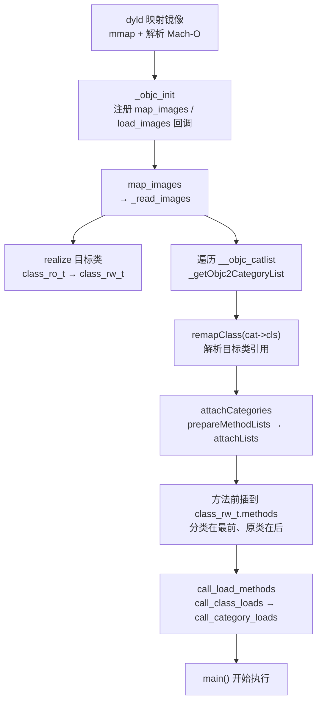
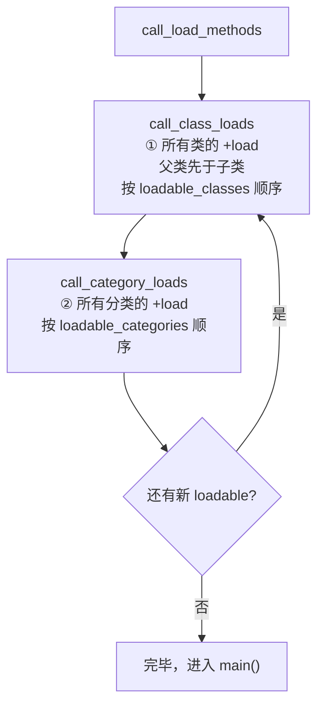
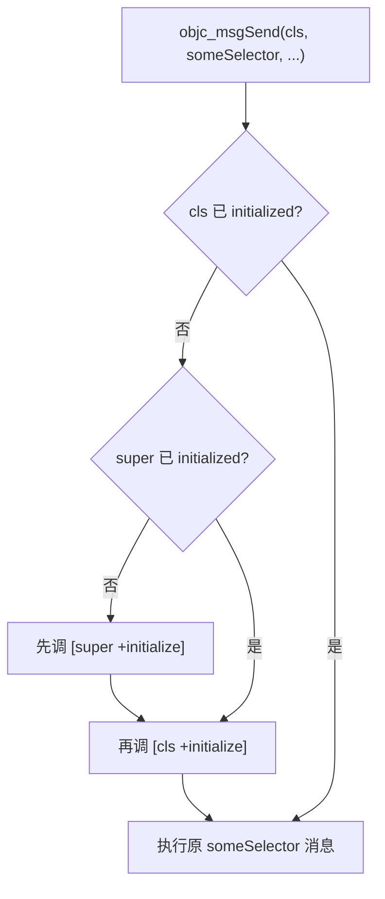

# ObjC运行时（06）· Category与load和initialize

## 概述与定位

> [!abstract] TL;DR
> **Category（分类）** 允许在不修改原类源码的前提下给任意类追加实例方法、类方法、协议遵循和属性声明，但**不能添加实例变量（ivar）**。分类在编译期被写入 Mach-O 的 `__objc_catlist` 节（`category_t` 结构），镜像加载时由 runtime 经 `attachCategories` 把分类方法**前插（prepend）**到 `class_rw_t.methods` 的最前端——同名方法"覆盖"只是遮蔽，原实现仍在列表里。`+load` 在镜像加载时**直接取地址调用**（不经 `objc_msgSend`），每个类和每个分类各调一次，父类先于子类、类先于分类，在 `main()` 之前执行；`+initialize` 则在类**首次收到消息**时懒调用，走 `objc_msgSend`，未实现时会沿继承链继承——务必用 `if (self == [X class])` 做保护。

## 概述与定位

Objective-C 的 **Category（分类）** 是"给现有类打补丁"的语言机制：你可以在不拥有源码的情况下给 `NSString`、`UIView` 乃至自己的类追加方法：

```objc
@interface NSString (MyExt)
- (NSString *)mx_trimmed;
@end

@implementation NSString (MyExt)
- (NSString *)mx_trimmed {
    return [self stringByTrimmingCharactersInSet:
            [NSCharacterSet whitespaceAndNewlineCharacterSet]];
}
@end
```

编译器不会修改 `NSString` 本身，而是把这段补丁编译成 `category_t` 结构，再把指针注册进本镜像的 `__objc_catlist` 节（见 [[11.Mach-O中的ObjC元数据]] 和 [[12.Mach-O文件详解/39.Mach-O __objc_catlist节]]）。Runtime 在镜像加载时遍历 catlist、把每个分类动态"缝合"进目标类——这就是 attach 时机。

与 Category 配套的两个类方法 `+load` 和 `+initialize` 是 ObjC 运行时的两个"生命周期钩子"，但触发时机、调用方式、继承行为截然不同，混淆它们是高频 bug 来源。

## 原理与机制

### 1. Category 的 attach 时机

从 `dyld` 加载镜像到方法可被调用，整体流程如下：



关键要点：
- `map_images` / `_read_images` 是核心入口，负责处理所有镜像的 ObjC 元数据。
- `attachCategories` 把分类方法/属性/协议分别经 `attachLists` **前插**到目标类的 `class_rw_t`（可读写运行时数据），触发分配 `class_rw_ext_t`（即 `rwe`，dirty memory）。
- 懒加载分类（无 `+load` 的分类）可以推迟到类首次 realize 时才 attach；非懒加载分类（有 `+load`）必须在加载早期就处理。

### 2. 方法前插：attachLists 的语义

`class_rw_t.methods` 的内部类型是 `method_array_t`，是一个**"方法列表的列表"（二维）**：原类自带的 `method_list_t` 是一层，每次 attach 一个分类就再插入一层。`attachLists` 的实现语义是 **prepend**：

```
attachLists 前：
  methods.array = [ ro.methods ]   // 原类方法列表，下标 0

attachLists 后（一个分类）：
  methods.array = [ cat.methods,   // 下标 0：分类方法 ← 先被查到
                    ro.methods ]   // 下标 1：原类方法 ← 永远轮不到（同名时）
```

`objc_msgSend` → `lookUpImpOrForward` 按层从前往后扫、**首个命中同名 selector 即返回其 IMP**。于是分类方法先被命中，造成"覆盖"假象，但**原方法从未被删除或替换**，它仍在列表里，只是再也轮不到（除非调用者显式遍历全部方法列表）。

多个分类同名方法的生效顺序取决于链接顺序（Xcode "Compile Sources" 顺序），官方定义为**未定义行为**。

### 3. +load 调用机制

`+load` 在 `call_load_methods` 里统一编排，**分两批、按顺序调用**：



核心特征：
- **直接取函数地址调用**，不经 `objc_msgSend`——所以不受方法前插影响，类和每个分类的 `+load` **都会独立被调用**，互不覆盖。
- **类先于分类**：`call_class_loads` 完整跑完后才 `call_category_loads`。
- **父类先于子类**：runtime 把类按继承关系排序，保证父类 `+load` 在子类之前。
- 在 `main()` 之前、镜像加载阶段执行，每个类/分类的 `+load` **只调用一次**。
- **不会自动调 super 的 `+load`**——因为不走 msgSend，父类自己的 `+load` 独立被调，无需（也不应）手写 `[super load]`。

### 4. +initialize 调用机制

`+initialize` 是懒加载的类初始化回调，由 `objc_msgSend` **在向该类发送第一条消息前**自动插入：



核心特征：
- **走 `objc_msgSend`**：受正常消息发送和继承机制约束。
- **父类先于子类**：发现子类未初始化时先触发父类 `+initialize`（若父类也未初始化）。
- **子类未实现时继承父类**：如果子类没有自己的 `+initialize`，消息会沿继承链找到父类实现——父类的 `+initialize` 会被调用**多次**（对父类本身一次、每个没有覆盖它的子类各一次）。
- **线程安全**：runtime 内部有锁，保证同一个类的 `+initialize` 只进入一次；但若在 `+initialize` 里死锁，会阻塞所有向该类发消息的线程。
- **在 `main()` 之后**，在类首次被真正使用时懒触发。

**正确写法**（防止继承重入）：

```objc
+ (void)initialize {
    if (self == [MyClass class]) {   // 必须加！否则子类触发时会再次执行
        // 一次性初始化逻辑
        sharedConfig = [[Config alloc] init];
    }
}
```

## 数据结构与源码详解

### category_t 字段

```c
// objc4 objc-runtime-new.h（精简版）
struct category_t {
    const char *name;                           // 分类名（如 "MyExt"）；仅记录，不用于定位目标类
    classref_t cls;                             // 目标类引用；加载期由 remapClass 解析成真正的类对象
    struct method_list_t *instanceMethods;      // 实例方法 → attach 进【类】的方法列表
    struct method_list_t *classMethods;         // 类方法   → attach 进【元类】的方法列表
    struct protocol_list_t *protocols;          // 分类声明的额外协议遵循
    struct property_list_t *instanceProperties; // 实例属性元数据（只有声明，无 ivar）
    struct property_list_t *_classProperties;   // 类属性（磁盘上不一定存在，旧编译器无此字段）
};
```

字段对照表：

| 字段 | 类型 | 说明 |
|---|---|---|
| `name` | `const char *` | 分类名字符串，仅供记录/调试，runtime 靠 `cls` 定位目标类 |
| `cls` | `classref_t` | 目标类引用；编译期占位，加载期 `remapClass` 绑定；目标类缺失则分类被整体忽略 |
| `instanceMethods` | `method_list_t *` | 实例方法列表，attach 进类对象 |
| `classMethods` | `method_list_t *` | 类方法列表，attach 进元类（见 [[03.类、元类与方法列表]]） |
| `protocols` | `protocol_list_t *` | 额外声明遵循的协议，attach 进类的协议列表 |
| `instanceProperties` | `property_list_t *` | 实例属性元数据；**无 ivar，不自动合成存取方法的存储** |
| `_classProperties` | `property_list_t *` | 类属性；磁盘上不一定有，runtime 用 flag 判断是否越界读 |

注意：`category_t` **没有 ivars 字段**——这是"分类不能加 ivar"的数据结构层面根因（详见下文）。

### attachCategories 核心伪代码

```c
// 基于 objc4 objc-runtime-new.mm 的源码级伪代码
static void attachCategories(Class cls, const locstamped_category_t *cats,
                              uint32_t cats_count, int flags) {
    // 收集所有分类的方法/属性/协议列表（从后往前，保证加载顺序正确）
    method_list_t  **mlists     = (method_list_t **)alloca(cats_count * sizeof(*mlists));
    property_list_t **proplists = (property_list_t **)alloca(cats_count * sizeof(*proplists));
    protocol_list_t **protolists = (protocol_list_t **)alloca(cats_count * sizeof(*protolists));
    
    int mcount = 0, propcount = 0, protocount = 0;
    bool isMeta = (flags & ATTACH_METACLASS);
    
    for (int i = cats_count - 1; i >= 0; i--) {   // 注意：逆向遍历
        category_t *cat = cats[i].cat;
        method_list_t *mlist = cat->methodsForMeta(isMeta);
        if (mlist) mlists[mcount++] = mlist;
        // ... 类似收集 props / protos
    }
    
    // 触发分配 rwe（class_rw_ext_t）
    auto rwe = cls->data()->extAllocIfNeeded();
    
    // 前插：分类方法落在下标 0，原类方法后移
    prepareMethodLists(cls, mlists, mcount, false, false, __func__);
    rwe->methods.attachLists(mlists, mcount);       // prepend！
    rwe->properties.attachLists(proplists, propcount);
    rwe->protocols.attachLists(protolists, protocount);
}
```

### 为什么不能加 ivar

原因分三层：

1. **`category_t` 无 ivars 字段**：对比 `class_ro_t` 有 `ivar_list_t *ivars`，`category_t` 结构里从 `name` 到 `_classProperties` 根本没有任何 ivars 成员，从数据结构层面就无法承载 ivar。

2. **`instance_size` 编译期写死**：`class_ro_t.instanceSize` 在编译链接时已固定，`alloc` 按此大小申请内存。运行期追加 ivar 意味着对象要变大，但已分配的对象不会随之扩大，布局错乱。

3. **会破坏既有 ivar 偏移**：ObjC ivar 访问等于 `对象指针 + 该 ivar 的偏移量`，子类 ivar 紧跟父类 ivar 之后。若允许给基类中途插入 ivar，所有子类的 ivar 偏移全部失效——这正是历史上"脆弱基类问题（fragile base class）"，现代 ObjC 的非脆弱 ivar 机制解决的是编译期已声明 ivar 的偏移重定位，**并不允许运行期新增 ivar**。

因此在分类的 `@implementation` 里使用 `@synthesize` 会直接报编译错误：`@synthesize not allowed in a category implementation`。

**替代方案**：需要给分类的 `@property` 提供存储时，用关联对象（见 [[07.关联对象与KVO]]）：

```objc
// NSObject+Tag.h
@interface NSObject (Tag)
@property (nonatomic, copy) NSString *tag;
@end

// NSObject+Tag.m
static const char kTagKey;    // 用静态变量地址做 key

@implementation NSObject (Tag)
- (NSString *)tag {
    return objc_getAssociatedObject(self, &kTagKey);
}
- (void)setTag:(NSString *)tag {
    objc_setAssociatedObject(self, &kTagKey, tag,
                             OBJC_ASSOCIATION_COPY_NONATOMIC);
}
@end
```

## load vs initialize 对比

| 维度 | `+load` | `+initialize` |
|---|---|---|
| **触发时机** | 镜像加载时（`main()` 之前） | 类首次收到消息时（`main()` 之后，懒触发） |
| **调用方式** | 直接取函数地址，不经 `objc_msgSend` | 经 `objc_msgSend`，走正常消息查找 |
| **调用次数** | 每个类/分类**各一次**，不可跳过 | 每个类理论一次，但**子类未实现时继承父类，父类可被调多次** |
| **继承行为** | **不继承**——父类 `+load` 独立被调，子类不调 `[super load]` | **会继承**——子类没实现时走 super，父类实现可被重复触发 |
| **super 调用** | 无需手动调，父类独立被调 | 不要手动调 `[super initialize]`（runtime 自动处理） |
| **分类与类的顺序** | 类的 `+load` 先，分类的 `+load` 后 | 分类方法前插后，分类实现先于原类命中（msgSend 规则） |
| **父子类顺序** | 父类先于子类 | 父类先于子类 |
| **线程安全** | 单线程串行，但不能依赖其他类已初始化 | runtime 内部有锁；但内部死锁会阻塞所有向该类发消息的线程 |
| **适合做什么** | 一次性 Method Swizzling、早期 hook 注册 | 类级别的一次性初始化（静态变量、共享资源）——必须加 `if (self == [X class])` 保护 |
| **性能风险** | 在 `main()` 前串行执行，**堆栈重、慢即崩启动** | 首次使用时同步执行，长时间初始化会卡消息调用方 |

## 逆向实践

### 从 __objc_catlist 还原分类

`__objc_catlist` 节是还原"谁给哪个类打了什么补丁"的最直接入口（详见 [[12.Mach-O文件详解/39.Mach-O __objc_catlist节]]）。逆向工具读取此节，可还原出 `@interface 目标类 (分类名)` 的完整头：

```bash
# otool 语义化解析（含分类）
otool -ov /path/to/App | grep -A 30 -i 'category\|catlist'

# class-dump 直接还原带分类的头文件
class-dump -H /path/to/App -o /tmp/headers/
```

> [!warning] 示例输出为示意
> 实际数值以目标二进制为准。

```text
# class-dump 输出示意
@interface NSString (MyExt)
- (NSString *)mx_trimmed;
@end
```

### +load 是早期 hook 与反调试落点

由于 `+load` 在 `main()` 之前执行、不走 `objc_msgSend`，它是插桩逻辑、Method Swizzling 和反调试代码的典型落点：

```objc
// 典型的分类 +load hook 模式（合法 swizzling 示例）
@implementation UIViewController (Analytics)
+ (void)load {
    static dispatch_once_t onceToken;
    dispatch_once(&onceToken, ^{
        Method orig = class_getInstanceMethod(self, @selector(viewDidAppear:));
        Method swiz = class_getInstanceMethod(self, @selector(analytics_viewDidAppear:));
        method_exchangeImplementations(orig, swiz);  // 见 [[08.Method Swizzling]]
    });
}
@end
```

> [!note] 为什么 swizzling 习惯放在分类 `+load` 而非 `+initialize`
> `+load` 时机早、不走 msgSend（不受前插顺序影响）、每类/分类各调一次且时序确定（目标类 `+load` 先完成），是方法交换的安全窗口。`+initialize` 走 msgSend、可能被调多次（继承），不适合做 swizzling。

逆向识别 hook 的关键特征：
- catlist 里某分类实现了 `+load`，且 `+load` 里调用 `method_exchangeImplementations` / `class_replaceMethod` / `class_getInstanceMethod`。
- 可在 `attachCategories` 或 `call_category_loads` 上断点（LLDB / Frida），观察哪些分类在加载早期被注入——这是定位 hook 和反调试代码的有效手段（见 [[12.iOS逆向工具]]）。

### 识别 +initialize 继承陷阱

逆向分析时，若发现某个 `+initialize` 里**缺少** `if (self == [X class])` 保护，这是一个潜在的重复初始化 bug——子类继承父类实现，每个子类首次收到消息都会再次触发父类逻辑：

```objc
// 危险写法：子类触发时 self 是子类，不是 MyClass，仍会进入
+ (void)initialize {
    // 无保护，每个未实现 +initialize 的子类首次使用时都会跑到这里
    database = [[Database alloc] initWithPath:@"..."];
}

// 正确写法
+ (void)initialize {
    if (self == [MyClass class]) {
        database = [[Database alloc] initWithPath:@"..."];
    }
}
```

## 安全性与正确使用

### 分类同名方法的不确定性

分类"覆盖"系统方法有风险：
- **不可逆**：分类方法只是前插遮蔽，若要可逆替换，应用 `method_exchangeImplementations`（见 [[08.Method Swizzling]]）。
- **多分类竞争**：多个分类给同一个类加了同名方法，生效者取决于链接顺序——这是未定义行为，可用 `OBJC_PRINT_REPLACED_METHODS=YES` 在开发阶段诊断。
- **命名空间**：给方法加前缀（如 `mx_`、`app_`），避免与系统未来版本或第三方库冲突。

### +load 的危险与性能

- `+load` 在 `main()` 之前串行执行，任何耗时操作都会延迟启动（App Store 审核/用户可见）。
- 不要在 `+load` 里初始化可能未就绪的其他类（依赖顺序无保证）。
- 不要在 `+load` 里做网络请求、磁盘 I/O 或锁等待。
- swizzling 里建议用 `dispatch_once` 做额外保护，防止意外重入（尽管 `+load` 本身只调一次）。

```objc
// 最小化 +load：只做方法交换，不做其他任何事
+ (void)load {
    static dispatch_once_t onceToken;
    dispatch_once(&onceToken, ^{
        // 只换方法，快速完成
        method_exchangeImplementations(
            class_getInstanceMethod(self, @selector(target)),
            class_getInstanceMethod(self, @selector(swizzled_target))
        );
    });
}
```

### +initialize 继承陷阱与线程安全

- **必须用 `if (self == [X class])` 保护**，防止子类触发时重复执行。
- `+initialize` 由 runtime 持锁调用——若在其内部向同一个类发消息（触发再次进入 `+initialize` 的锁），会死锁。
- 不要在 `+initialize` 里依赖其他类的 `+initialize` 已完成——两个类互相依赖会导致死锁。
- 重型初始化（数据库、文件、网络配置）放 `+initialize`（`main()` 后按需懒加载）而不是 `+load`（`main()` 前全量执行）。

### 静态库中的分类：-ObjC 标志

因为分类不产生 undefined 符号，链接器不知道需要从静态库里拉取只含分类的 `.o` 文件，运行时会报 "unrecognized selector"。解决方法：在 `Other Linker Flags` 加 `-ObjC`，强制链接器加载静态库中所有实现了类或分类的成员。

## 小结

- **Category 不改原类源码**，给现有类追加方法/协议/属性声明；`category_t` 结构无 ivars 字段，加上 `instance_size` 编译期固定，故**不能加 ivar**；要"伪装"实例变量用关联对象（[[07.关联对象与KVO]]）。
- `category_t` 六个核心字段：`name`/`cls`/`instanceMethods`/`classMethods`/`protocols`/`instanceProperties`；`cls` 在加载期 `remapClass` 绑定，方法分别 attach 进类（实例方法）和元类（类方法）。
- 分类在 Mach-O `__objc_catlist` 节（`__DATA` 或 `__DATA_CONST`）落盘，加载期 `attachCategories` 经 `attachLists` **前插**到 `class_rw_t.methods`；"同名覆盖"是遮蔽不是删除，原方法仍在（见 [[03.类、元类与方法列表]]）；多分类顺序是未定义行为。
- **`+load`**：镜像加载时直接取函数地址调用，不走 msgSend；类先于分类、父类先于子类；`main()` 之前，每类/分类各一次；是 Method Swizzling 和早期 hook 的经典落点（见 [[08.Method Swizzling]]）；**不能慢、不能重**。
- **`+initialize`**：走 msgSend，首次向类发消息时懒触发；父类先于子类；子类未实现时**继承**父类实现、父类可被多次调——**必须加 `if (self == [X class])` 保护**；不要与其他类的 `+initialize` 形成互依赖（死锁）。

## 相关阅读

- [[03.类、元类与方法列表]] — `class_ro_t`/`class_rw_t`/`method_t` 详解，理解分类 attach 后的方法列表结构
- [[07.关联对象与KVO]] — 分类无法加 ivar 的替代方案；KVO 的 isa-swizzling 机制
- [[08.Method Swizzling]] — `+load` 里做 swizzling 的正确姿势与陷阱
- [[11.Mach-O中的ObjC元数据]] — `__objc_catlist`/`__objc_nlclslist` 等节在 Mach-O 里的布局
- [[12.Mach-O文件详解/39.Mach-O __objc_catlist节]] — `category_t` 字段、attach 合并、`+load` 时序的完整 Mach-O 视角
- [[12.Mach-O文件详解/00.Mach-O文件详解总览]] — Mach-O 格式总体结构与各节导航
- 源码参考：`objc4/runtime/objc-runtime-new.h`（`category_t` 定义）、`objc-runtime-new.mm`（`attachCategories`/`attachLists`）、`objc-loadmethod.mm`（`call_load_methods`/`call_class_loads`/`call_category_loads`）

---

⬅️ 上一篇 [[05.消息转发机制]] ｜ 🏠 [[00.Objective-C与iOS运行时总览]] ｜ 下一篇 [[07.关联对象与KVO]] ➡️
