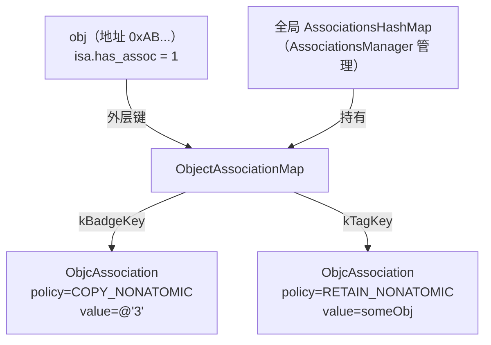
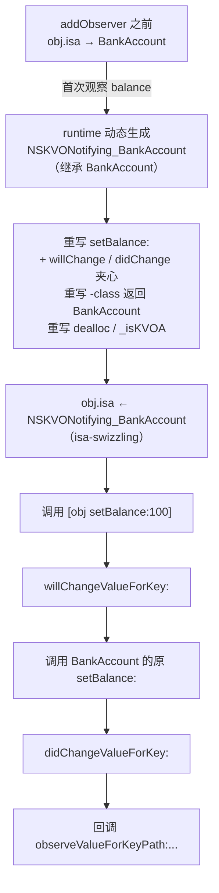

# ObjC运行时（07）· 关联对象与KVO

## 概述与定位

> [!abstract] TL;DR
> **关联对象（Associated Object）** 是运行时为 Category 补上"实例变量"能力的机制：数据不存在对象内存里，而集中在全局哈希表中，由对象地址索引，随对象 `dealloc` 自动清理。**KVO（Key-Value Observing）** 则是运行时在首次观察某属性时动态生成一个中间子类 `NSKVONotifying_<原类>`、将对象 `isa` 偷偷换掉的 isa-swizzling 技术——setter 被重写为 will/did 通知夹心，但 `-class` 谎报家门，对外仍像原类。两者都依赖 `isa` 与对象模型（详见 [[02.对象模型与isa]]），都是"运行时可读写"哲学的体现。

本篇接续 [[06.Category与load和initialize]]（Category 无法加 ivar 问题的出处）与 [[03.类、元类与方法列表]]（`class_rw_t` 的动态可写性），并为 [[08.Method Swizzling]] 中的方法替换原理铺垫背景。

---

## 关联对象（Associated Object）

### 为什么需要关联对象

Category（分类）在编译期限制了不能声明实例变量（ivar）。如 [[06.Category与load和initialize]] 所述，Category 的编译产物只有方法列表、协议列表和属性列表（属性仅声明 getter/setter，不自动生成 ivar 存储），因此无法在 Category 中为已有类新增"带独立存储的属性"。

关联对象正是运行时给出的答案：**把"本该属于对象的数据"存到一张全局哈希表里，以对象地址为外层键、以开发者自定义 key 为内层键，模拟实例变量语义。**

### API

```objc
// 设置关联值
void objc_setAssociatedObject(id object, const void *key,
                               id value, objc_AssociationPolicy policy);

// 读取关联值
id objc_getAssociatedObject(id object, const void *key);

// 删除对象上的所有关联
void objc_removeAssociatedObjects(id object);
```

#### key 的选取：静态变量地址

`key` 本质是 `const void *`，只需在整个进程生命周期内唯一且稳定。**最安全的惯用法是取静态局部变量的地址**——地址唯一、无需额外字符串比较：

```objc
// UIView+Badge.m
@implementation UIView (Badge)

- (NSString *)badge {
    static const void *kBadgeKey = &kBadgeKey; // 地址作 key
    return objc_getAssociatedObject(self, kBadgeKey);
}

- (void)setBadge:(NSString *)badge {
    static const void *kBadgeKey = &kBadgeKey;
    objc_setAssociatedObject(self, kBadgeKey, badge,
                             OBJC_ASSOCIATION_COPY_NONATOMIC);
}

@end
```

> [!tip]
> 也常见用 `@selector(badge)` 作 key（其底层也是稳定地址），但静态变量地址更明确，不会因 selector 字符串碰撞而出错。

#### policy（关联策略）

`objc_AssociationPolicy` 是枚举，对应 ARC 内存语义：

| 策略 | 对应语义 | 说明 |
|---|---|---|
| `OBJC_ASSOCIATION_ASSIGN` | `assign`（unsafe_unretained） | 不持有，不安全，悬垂指针风险 |
| `OBJC_ASSOCIATION_RETAIN_NONATOMIC` | `strong`，非原子 | 最常用，强引用，非线程安全 |
| `OBJC_ASSOCIATION_COPY_NONATOMIC` | `copy`，非原子 | 字符串/集合常用，非线程安全 |
| `OBJC_ASSOCIATION_RETAIN` | `strong`，原子 | 强引用，原子操作 |
| `OBJC_ASSOCIATION_COPY` | `copy`，原子 | copy + 原子操作 |

---

### 存储位置：全局 AssociationsHashMap

**关联对象的数据完全不在对象的内存布局里**，而是存放于 `objc4` 运行时维护的一张全局哈希表中。

#### 核心数据结构（基于 objc4 源码记号）

```cpp
// runtime 内部（简化）
class AssociationsManager {
    static AssociationsHashMap *_map;  // 全局单例哈希表
    // 使用互斥锁保护并发读写（objc4-818 起为 mutex_t；更早版本曾用自旋锁）
};

// 外层：对象地址 → ObjectAssociationMap
typedef DenseMap<DisguisedPtr<objc_object>,
                 ObjectAssociationMap> AssociationsHashMap;

// 内层：key → ObjcAssociation
typedef DenseMap<const void *, ObjcAssociation> ObjectAssociationMap;

struct ObjcAssociation {
    uintptr_t           _policy;  // 关联策略
    id                  _value;   // 关联值（已按 policy retain/copy）
};
```

**两层结构**：
- 外层 `AssociationsHashMap`：`对象地址（disguised pointer）→ ObjectAssociationMap`
- 内层 `ObjectAssociationMap`：`key（void *）→ ObjcAssociation`



#### isa.has_assoc 位

`objc_object` 的 `isa_t` 在 ARM64 non-pointer 模式下有一个 `has_assoc` 位（详见 [[02.对象模型与isa]]）：

```
ARM64 non-pointer isa（64 bit）：
bit  0     : nonpointer（1 = 非裸指针）
bit  1     : has_assoc      ← 标记"此对象有关联对象"
bit  2     : has_cxx_dtor
bits 3–35  : shiftcls（类指针）
...
```

调用 `objc_setAssociatedObject` 设置关联值时，runtime 会将对象 `isa` 的 `has_assoc` 位置 1。这是 dealloc 路径的优化标志。

---

### 生命周期：dealloc 时自动清理

对象析构时（`-dealloc` → runtime `object_dispose`），若 `isa.has_assoc == 1`，runtime 会：

```cpp
// 伪代码（objc4 object_dispose 路径）
void object_dispose(id obj) {
    if (!obj) return;
    objc_destructInstance(obj);
    free(obj);
}

void objc_destructInstance(id obj) {
    Class isa = obj->getIsa();
    if (isa->hasCxxDtor())
        object_cxxDestruct(obj);          // 析构 C++ ivar
    if (obj->hasAssociatedObjects())
        _object_remove_assocations(obj, /*deallocating*/ true);  // 从全局 map 移除
}
```

**开发者无需手动删除关联对象**，只要 `objc_removeAssociatedObjects` 保留给"提前解除所有关联"的特殊场景（如在 `dealloc` 前强制解引用循环）。

---

## KVO（Key-Value Observing）

### 基础 API

```objc
// 注册观察者
[obj addObserver:observer
      forKeyPath:@"balance"
         options:NSKeyValueObservingOptionNew | NSKeyValueObservingOptionOld
         context:&myContext];

// 回调（在 observer 中实现）
- (void)observeValueForKeyPath:(NSString *)keyPath
                      ofObject:(id)object
                        change:(NSDictionary *)change
                       context:(void *)context {
    if (context == &myContext) {
        NSNumber *newVal = change[NSKeyValueChangeNewKey];
        // ...
    }
}

// 移除（必须成对，否则 crash）
[obj removeObserver:observer forKeyPath:@"balance" context:&myContext];
```

---

### KVO 实现原理：isa-swizzling

KVO 是纯运行时实现，**不依赖编译期代码生成**，核心手法称为 **isa-swizzling**。

#### 动态生成中间子类

当对 `obj`（假设其类为 `BankAccount`）首次调用 `addObserver:forKeyPath:@"balance" ...` 时，runtime 执行以下步骤：

1. **检查是否已有中间类**：若 `NSKVONotifying_BankAccount` 尚不存在，则动态创建之（`objc_allocateClassPair` + `objc_registerClassPair`）。
2. **重写被观察属性的 setter**：在中间类中重写 `setBalance:` 为如下逻辑：
   ```objc
   // NSKVONotifying_BankAccount 中的 setBalance:（伪代码）
   - (void)setBalance:(NSNumber *)balance {
       [self willChangeValueForKey:@"balance"]; // 触发 will 通知
       [super setBalance:balance];              // 调用原类 setter
       [self didChangeValueForKey:@"balance"];  // 触发 did 通知→回调 observer
   }
   ```
3. **重写 `-class`**：返回原类 `BankAccount`（而非 `NSKVONotifying_BankAccount`），隐藏中间类：
   ```objc
   - (Class)class { return [BankAccount class]; }
   ```
4. **重写 `dealloc`** 与内部方法 `_isKVOA`（标识为 KVO 中间类）。
5. **把 `obj->isa` 指向中间子类**：此后对 `obj` 发送任何消息，走的是 `NSKVONotifying_BankAccount` 的方法列表。

#### isa-swizzling 流程图



#### 中间类结构

| 方法 | 目的 |
|---|---|
| `setBalance:`（被观察属性的 setter） | 通知夹心：will → 原 setter → did |
| `-class` | 返回 `BankAccount`，隐藏中间类身份 |
| `-dealloc` | 清理 KVO 内部状态 |
| `-_isKVOA` | 内部标识（用于 KVO 自我识别） |

> [!info] 验证中间类
> 虽然 `-class` 撒谎，但 `object_getClass(obj)` 和 LLDB `po obj->isa` 会暴露真实类名 `NSKVONotifying_BankAccount`。

---

### 手动 KVO 通知

某些场景（如批量更新、事务操作）需要手动控制通知时机：

```objc
// 1. 关闭某属性的自动通知
+ (BOOL)automaticallyNotifiesObserversForKey:(NSString *)key {
    if ([key isEqualToString:@"balance"]) return NO;
    return [super automaticallyNotifiesObserversForKey:key];
}

// 2. 手动包裹修改操作
- (void)batchUpdate {
    [self willChangeValueForKey:@"balance"];
    _balance = computedNewValue; // 直接写 ivar，不走 setter
    [self didChangeValueForKey:@"balance"];
}
```

手动通知同样经过 `willChangeValueForKey:` / `didChangeValueForKey:` 路径，observer 的回调逻辑不变。

---

## 结构与源码详解

### 关联对象 set/get 伪代码

```cpp
// objc_setAssociatedObject（简化，基于 objc4 源码结构）
void objc_setAssociatedObject(id object, const void *key,
                              id value, objc_AssociationPolicy policy) {
    AssociationsManager mgr;                          // 加互斥锁
    AssociationsHashMap &associations = mgr.get();

    if (value) {
        // 取得/创建外层 ObjectAssociationMap
        ObjectAssociationMap &refs = associations[DisguisedPtr(object)];
        // 按 policy 对 value 执行 retain 或 copy
        ObjcAssociation oldAssoc = refs[key];
        refs[key] = ObjcAssociation(policy, acquireValue(value, policy));
        // 标记 isa.has_assoc
        object->setHasAssociatedObjects();
        // release 旧值
        releaseValue(oldAssoc);
    } else {
        // value == nil → 删除该 key 的关联
        auto it = associations.find(DisguisedPtr(object));
        if (it != associations.end()) {
            it->second.erase(key);
        }
    }
    // 释放互斥锁
}
```

### KVO 中间子类创建伪代码

```objc
// runtime KVO 内部（简化）
static Class kvoClassForObject(id object) {
    Class origClass = object_getClass(object);
    NSString *kvoName = [@"NSKVONotifying_"
                          stringByAppendingString:NSStringFromClass(origClass)];
    Class kvoClass = objc_lookUpClass(kvoName.UTF8String);
    if (!kvoClass) {
        // 动态创建中间子类
        kvoClass = objc_allocateClassPair(origClass, kvoName.UTF8String, 0);
        // 重写 -class 返回原类
        Method classMethod = class_getInstanceMethod(origClass, @selector(class));
        IMP kvoClassIMP = imp_implementationWithBlock(^Class(id self) {
            return origClass;
        });
        class_addMethod(kvoClass, @selector(class), kvoClassIMP,
                        method_getTypeEncoding(classMethod));
        // 重写 _isKVOA
        class_addMethod(kvoClass, @selector(_isKVOA),
                        imp_implementationWithBlock(^BOOL(id self){ return YES; }),
                        "c@:");
        objc_registerClassPair(kvoClass);
    }
    return kvoClass;
}

- (void)addObserver:(NSObject *)observer forKeyPath:(NSString *)keyPath ... {
    // ... 记录 observer 信息到内部表 ...
    Class kvoClass = kvoClassForObject(self);
    // 重写被观察属性的 setter（若尚未重写）
    installKVOSetter(kvoClass, keyPath);
    // isa-swizzling
    object_setClass(self, kvoClass);
}
```

### 两种机制对比

| 维度 | 关联对象 | KVO |
|---|---|---|
| 核心思路 | 全局哈希表存储额外数据 | 动态生成中间子类，替换 isa |
| 运行时 API | `objc_setAssociatedObject` 等 | `addObserver:forKeyPath:...` |
| 对象内存 | 不改变 | 不改变（只改 `isa` 指针） |
| 生命周期管理 | dealloc 时按 policy 清理 | 需手动 `removeObserver`（否则 crash） |
| 隐蔽性 | 无隐藏（直接查哈希表可见） | `-class` 隐藏，`object_getClass` 可揭露 |
| 线程安全 | 全局表有锁，单个操作安全；但 NONATOMIC policy 读写竞争由调用方负责 | 注册/注销需在同一线程或同步处理 |

---

## 逆向实践

### 用 LLDB 观察关联对象

```lldb
# 运行时查看某对象是否有关联对象（通过 isa.has_assoc）
(lldb) p/x obj->isa
# 解析 non-pointer isa bit 1（has_assoc）

# 直接读关联值（需知 key 地址）
(lldb) po objc_getAssociatedObject(obj, kBadgeKey)
```

> [!warning] 示例输出为示意

### 用 LLDB 揭露 KVO 中间类

```lldb
# -class 会撒谎，用 object_getClass 看真实 isa
(lldb) p object_getClass(obj)
# 输出：NSKVONotifying_BankAccount

# 查看中间类的方法列表
(lldb) p/x (Class)NSClassFromString(@"NSKVONotifying_BankAccount")
(lldb) expression -- unsigned int count; Method *methods = class_copyMethodList(
         NSClassFromString(@"NSKVONotifying_BankAccount"), &count);
         for(int i=0;i<count;i++) printf("%s\n", sel_getName(method_getName(methods[i])));
```

> [!warning] 示例输出为示意

### Frida 脚本：Hook KVO 中间子类 setter

```javascript
// frida hook NSKVONotifying_BankAccount 的 setBalance:
const KVOClass = ObjC.classes["NSKVONotifying_BankAccount"];
if (KVOClass) {
  const setBalance = KVOClass["- setBalance:"];
  Interceptor.attach(setBalance.implementation, {
    onEnter(args) {
      const newVal = new ObjC.Object(args[2]);
      console.log("[KVO] setBalance: called with", newVal.toString());
    }
  });
}
```

> [!warning] 示例输出为示意

---

## 安全性与正确使用

### 关联对象安全

#### key 唯一性保证

不同 Category 使用相同 key 字符串（如 `"tag"`）会冲突。**务必用静态变量地址作 key**，地址在同一进程内绝对唯一：

```objc
// 错误：字符串指针并不唯一，不同编译单元可能产生不同地址
objc_setAssociatedObject(obj, @"myKey", value, ...); // ❌

// 正确：静态变量地址唯一
static const char kMyKey;
objc_setAssociatedObject(obj, &kMyKey, value, ...);  // ✓
```

#### ASSIGN policy 的悬垂指针风险

`OBJC_ASSOCIATION_ASSIGN` 不持有 value，若 value 提前释放，关联值就成悬垂指针，访问即 crash。**应用 `RETAIN_NONATOMIC` 或 `COPY_NONATOMIC` 代替。**

#### 内存泄漏场景

若 value 强引用了 object（例如 block 捕获 self），且 policy 为 `RETAIN`，则形成循环引用。此时用 `ASSIGN`（配合 `__weak` wrapper）或 weak 持有 pattern。

### KVO 陷阱

#### 必须成对移除

```objc
// ❌ 忘记移除：observer 被释放后 obj 仍持有野指针，下次通知 crash
[obj addObserver:weakSelf forKeyPath:@"x" options:... context:nil];
// 析构时未调用 removeObserver

// ✓ 在 observer 的 dealloc 中移除
- (void)dealloc {
    [_observedObj removeObserver:self forKeyPath:@"x" context:&kCtx];
}
```

iOS 11+ `-[NSObject deinit]` 路径会在对象释放时自动移除观察，但**仍推荐显式移除**以保证确定性行为。

#### 重复添加

同一 observer + keyPath + context 重复 `addObserver` 会导致通知**触发两次**；`removeObserver` 只移除一次还会留下一个"幽灵"观察，最终 over-remove 再 crash。

#### keyPath 拼写错误

`keyPath` 是字符串，编译期无检查。推荐用 `NSStringFromSelector(@selector(balance))` 代替硬编码字符串（Xcode 支持重构时同步修改）。

#### 线程安全

KVO 回调在**触发 setter 的线程**上执行，不一定是主线程。若回调中更新 UI，需手动 dispatch 到主线程：

```objc
- (void)observeValueForKeyPath:(NSString *)keyPath ... {
    dispatch_async(dispatch_get_main_queue(), ^{
        [self updateUI];
    });
}
```

### isa 被改写对类型判断的影响

KVO isa-swizzling 后，以下判断受影响：

```objc
[obj class]                 // 返回 BankAccount（被中间类 -class 欺骗）✓ 表面无影响
object_getClass(obj)        // 返回 NSKVONotifying_BankAccount ← 真实 isa
[obj isKindOfClass:[BankAccount class]]  // ✓ 正确，因为 NSKVONotifying_ 是子类
[obj isMemberOfClass:[BankAccount class]] // ❌ 返回 NO（真实类是中间类）
```

**安全建议**：用 `isKindOfClass:` 而非 `isMemberOfClass:`；不依赖 `-class` 做严格类型匹配；在 Swizzling 与 KVO 并存时务必留意 isa 已被双重修改（详见 [[08.Method Swizzling]]）。

### Method Swizzling 与 KVO 的冲突

若对 `BankAccount` 的 `setBalance:` 进行 Method Swizzling（详见 [[08.Method Swizzling]]），**必须在添加 KVO 观察之前完成 Swizzling**，否则 KVO 中间类重写的 setter 会覆盖 Swizzling 结果，或 Swizzling 绕过了中间类的 will/did 通知夹心，导致 KVO 失效：

```
正确顺序：原 setBalance → Swizzle → NSKVONotifying_ 重写 → 通知正常
错误顺序：NSKVONotifying_ 重写 → Swizzle 改写中间类 setter → 通知路径被破坏
```

---

## 小结

| 机制 | 解决的问题 | 运行时手段 | 存储/影响范围 |
|---|---|---|---|
| 关联对象 | Category 不能加 ivar | `AssociationsHashMap` 全局哈希表 | 对象外部；`isa.has_assoc` 置位 |
| KVO | 观察属性变化无需侵入原类 | isa-swizzling + 动态子类重写 setter | `isa` 指针替换；`-class` 隐藏 |

- 关联对象：key 用静态变量地址，policy 按语义选择，ASSIGN 慎用；dealloc 自动清理，无需手动移除。
- KVO：理解其 isa-swizzling 本质，严格成对 add/remove，回调注意线程，用 `object_getClass` 而非 `-class` 做真实类型判断，与 Swizzling 共存需管控顺序。

两者都是"运行时可读写"能力的典型应用，也都是 iOS 逆向分析时的重要观测点——通过 LLDB/Frida 检查 `isa` 和关联哈希表，可快速定位 App 的动态行为模式。

---

## 相关阅读

- [[02.对象模型与isa]] — `isa_t` 结构、ARM64 non-pointer isa 位域、`has_assoc` 位
- [[03.类、元类与方法列表]] — `class_rw_t` 动态可写、`method_t` 结构
- [[06.Category与load和initialize]] — Category 不能加 ivar 的根本原因
- [[08.Method Swizzling]] — `method_exchangeImplementations`、hook 陷阱与 KVO 冲突
- [[44.调试器原理与实战/09.LLDB原理与实战|LLDB 原理与实战]] — 运行时调试实践
- [[32.hooks/00.总览|Hook 技术总览]] — iOS Hook 技术全景

---

⬅️ 上一篇 [[06.Category与load和initialize]] ｜ 🏠 [[00.Objective-C与iOS运行时总览]] ｜ 下一篇 [[08.Method Swizzling]] ➡️
