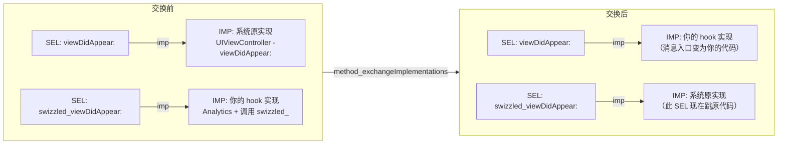

# ObjC运行时（08）· Method Swizzling

## 概述与定位

> [!abstract] TL;DR
> Method Swizzling 是 Objective-C 运行时暴露的**方法级 hook**：在进程运行期间交换两个 `Method`（即 `method_t`）内部的 IMP 指针，从此之后发往原 SEL 的所有消息都会执行你注入的实现。它是 [[32.hooks/00.总览|Hook 技术]] 体系里"语言运行时层"的代表——无需改写机器指令、无需 PLT/GOT，只需读写 `class_rw_t` 里的一张方法列表。标准做法：在 `+load` 里 + `dispatch_once`，`class_addMethod` 先探父类，再 `method_exchangeImplementations`。

Objective-C 的方法调用本质上是"向对象发送消息"，消息派发由运行时在 **`class_rw_t → methods`** 中查找 IMP（参见 [[04.objc_msgSend消息发送]] 和 [[03.类、元类与方法列表]]）。既然 IMP 是可读写的运行期数据，就可以被替换——Method Swizzling 正是利用这一点，把两个方法的实现**整体互换**，实现对任意 ObjC 方法的无侵入 hook。

本篇深度剖析：

- `method_t` 中 SEL / `types` / IMP 三者关系，以及 swizzling 本质
- 核心 API：`class_getInstanceMethod`、`method_exchangeImplementations` 等完整签名
- 标准四步写法（`+load` + `dispatch_once` + `class_addMethod` + `method_exchangeImplementations`）
- 为什么要先 `class_addMethod` 再判断——保护父类方法的关键
- 交换后 `cache_t` 的失效机制
- 实战场景：AOP 埋点、防崩溃、viewDidAppear 统计
- 逆向中注入 dylib + swizzle 监控目标方法
- 风险与陷阱：命名冲突、多次 swizzle 抵消、死循环、Swift 限制

---

## 原理与机制

### SEL、IMP、Method 的三角关系

在 `objc4` 中，方法在编译期被表示为 `method_t` 结构：

```c
// objc4 源码（简化，新版 ARM64 相对偏移 small method 略有不同）
struct method_t {
    SEL         name;       // 方法选择子：唯一字符串指针（全进程共享）
    const char *types;      // 类型编码，如 "v@:"（返回 void，id self，SEL _cmd）
    IMP         imp;        // 函数指针：实际执行体
};
```

- **`SEL`**：本质是 `char *`，进程内全局唯一（`sel_registerName` 保证）。同名 SEL 在所有类中**共享同一地址**。
- **`IMP`**：`id (*)(id self, SEL _cmd, ...)` 函数指针，指向真正的机器码。
- **`Method`**：`method_t *`，运行时 API 操作的句柄。

`objc_msgSend` 的查找路径：SEL → 在当前类及 superclass 链的 `class_rw_t.methods` 中二分/遍历，找到 `method_t.imp`，填入 `cache_t` 后调用（详见 [[04.objc_msgSend消息发送]]）。

Method Swizzling 只做一件事：**把 method_t 里的 IMP 换掉**。SEL 不变、`types` 不变，只动 `imp`。

### 交换前后的 SEL→IMP 映射变化



> [!note]
> 交换完成后，`[vc viewDidAppear:YES]` 走 `viewDidAppear:` 这个 SEL，但 IMP 已经是你的代码；你的代码里调用 `[self swizzled_viewDidAppear:YES]`，SEL 是 `swizzled_viewDidAppear:`，但 IMP 已经换成系统原实现——于是原逻辑得以执行，形成"前置/后置插入"效果。

---

## 核心 API 速查

以下 API 均来自 `<objc/runtime.h>`：

| API | 签名 | 用途 |
|---|---|---|
| `class_getInstanceMethod` | `Method class_getInstanceMethod(Class cls, SEL name)` | 查找实例方法（含 superclass） |
| `class_getClassMethod` | `Method class_getClassMethod(Class cls, SEL name)` | 查找类方法 |
| `method_getImplementation` | `IMP method_getImplementation(Method m)` | 读取 method_t 的当前 IMP |
| `method_setImplementation` | `IMP method_setImplementation(Method m, IMP imp)` | 写入新 IMP，返回旧 IMP |
| `method_exchangeImplementations` | `void method_exchangeImplementations(Method m1, Method m2)` | 原子互换 m1/m2 的 IMP |
| `class_addMethod` | `BOOL class_addMethod(Class cls, SEL name, IMP imp, const char *types)` | 向 cls 添加方法（若已存在返回 NO） |
| `class_replaceMethod` | `IMP class_replaceMethod(Class cls, SEL name, IMP imp, const char *types)` | 替换（或新增）并返回旧 IMP |
| `method_getTypeEncoding` | `const char *method_getTypeEncoding(Method m)` | 读类型编码字符串 |

### 为什么需要这么多 API？

- `method_exchangeImplementations(m1, m2)` 是最简洁的交换原语，但**前提是取到的 Method 来自目标类自身而非父类——否则会污染父类的所有子类，故需下文 `class_addMethod` 保护**。
- 如果目标类自身没有定义该方法（继承自父类），`class_getInstanceMethod` 会返回**父类的 `method_t`**。此时直接 `exchange` 会修改父类的 IMP，影响所有子类——这是最常见的陷阱。
- 因此标准写法必须先用 `class_addMethod` 探测并在本类"占位"，再决策走 `replace` 还是 `exchange`（下节详述）。

---

## 标准写法：四步模板

### 完整代码模板

```objc
// MyClass+Swizzling.m
#import "MyClass+Swizzling.h"
#import <objc/runtime.h>

@implementation UIViewController (Analytics)

// 步骤1：在 +load 中（镜像加载时，不走 objc_msgSend，时机早且确定）
// 参见 [[06.Category与load和initialize]] 对 +load 加载时机的完整讲解
+ (void)load {
    static dispatch_once_t onceToken;
    dispatch_once(&onceToken, ^{
        Class cls = [self class];  // 这里 self 是 UIViewController 类对象

        SEL originalSEL  = @selector(viewDidAppear:);
        SEL swizzledSEL  = @selector(analytics_viewDidAppear:);

        Method originalMethod  = class_getInstanceMethod(cls, originalSEL);
        Method swizzledMethod  = class_getInstanceMethod(cls, swizzledSEL);

        // 步骤2：尝试把 originalSEL 的实现用 swizzledMethod 的 IMP 添加到本类
        // 若本类已有 originalSEL 的实现 → class_addMethod 返回 NO
        // 若本类没有（继承自父类）→ 返回 YES，同时 originalSEL 在本类指向了 swizzledIMP
        BOOL didAdd = class_addMethod(cls,
                                      originalSEL,
                                      method_getImplementation(swizzledMethod),
                                      method_getTypeEncoding(swizzledMethod));

        if (didAdd) {
            // 步骤3a：本类原本没有该方法
            // class_addMethod 已让 originalSEL → swizzledIMP
            // 现在只需把 swizzledSEL 的 IMP 改成原 IMP（就是父类那个）
            class_replaceMethod(cls,
                                swizzledSEL,
                                method_getImplementation(originalMethod),
                                method_getTypeEncoding(originalMethod));
        } else {
            // 步骤3b：本类自身有该方法，直接双向互换
            method_exchangeImplementations(originalMethod, swizzledMethod);
        }
    });
}

// 步骤4：你的 hook 实现
// 命名加前缀，避免命名冲突
- (void)analytics_viewDidAppear:(BOOL)animated {
    // 前置逻辑（埋点）
    NSLog(@"[Analytics] viewDidAppear: %@", NSStringFromClass([self class]));

    // 调用"自己"——因为 IMP 已互换，此处实际执行系统原始实现
    [self analytics_viewDidAppear:animated];

    // 后置逻辑（如需）
}

@end
```

> [!warning] 示例输出为示意
> 上述代码模板为说明原理的示意代码，实际项目中应增加空指针判断（`if (!originalMethod || !swizzledMethod) return;`）以防崩溃。

### 关键设计解析

| 设计点 | 原因 |
|---|---|
| 在 `+load` 里执行 | `+load` 在 `dyld` 加载 image 时由运行时直接调用，不走 `objc_msgSend`，早于 `main()`，时机确定且不依赖首次使用触发（区别于 `+initialize`）。详见 [[06.Category与load和initialize]] |
| `dispatch_once` | 防止多次 swizzle 互相抵消（偶数次等于没换） |
| 先 `class_addMethod` 再判断 | 保护父类方法（见下节） |
| `swizzled_` 方法名前缀 | 避免与其它 Category 同名 SEL 冲突；SEL 全进程唯一，重名直接踩掉 |
| hook 方法内调用"自己" | IMP 已换，`[self analytics_viewDidAppear:]` 的 IMP 是原系统实现，不会无限递归 |

---

## 为什么先 `class_addMethod` 再判断

这是 Method Swizzling 最容易出错、也最重要的保护机制。

### 问题场景

假设你要 swizzle `UIViewController` 的 `viewDidAppear:`，而目标 App 里有一个自定义子类 `MyViewController : UIViewController` 并**没有**重写 `viewDidAppear:`。

```
NSObject
  └── UIViewController   ← 在这里定义了 viewDidAppear:（method_t A）
        └── MyViewController  ← 未定义 viewDidAppear:，查找时向上找到 A
```

如果直接：

```objc
Method m1 = class_getInstanceMethod([MyViewController class], @selector(viewDidAppear:));
// m1 实际上是 UIViewController 里的那个 method_t A ！
method_exchangeImplementations(m1, m2);  // 危险：改写了父类 UIViewController 的 method_t
```

结果：所有 `UIViewController` 的子类（包括 `UINavigationController`、`UITabBarController` 等系统视图控制器）的 `viewDidAppear:` 都被 hook，远超预期范围。

### 正确逻辑

```
class_addMethod(MyViewController, viewDidAppear:, swizzledIMP, types)
    ↓ 返回 YES（本类没有该方法）
运行时在 MyViewController 的 class_rw_t.methods 新增了一个 method_t：
    SEL = viewDidAppear:  IMP = swizzledIMP

class_replaceMethod(MyViewController, swizzled_viewDidAppear:, originalIMP, types)
    → swizzled_ SEL 的 IMP 改为父类的原始实现

效果：MyViewController.viewDidAppear: → swizzledIMP  ✓
      UIViewController.viewDidAppear: → 原始实现      ✓（未被改动）
```

```
class_addMethod 返回 NO（本类自身已有该方法）
    → 说明 class_getInstanceMethod 拿到的就是本类自己的 method_t
    → method_exchangeImplementations 直接互换，安全
```

> [!important]
> `class_addMethod` 返回 `BOOL`，它是这整套模式的核心判断点。不做这个判断而直接 `method_exchangeImplementations`，一旦目标方法定义在父类，就会污染整条继承链上的其它子类。

---

## 与 `cache_t` 的交互

`objc_msgSend` 有一套汇编快路径：发送消息时先查 `cache_t` 哈希桶，命中则直接跳 IMP，不命中才走慢路径（详见 [[04.objc_msgSend消息发送]]）。

Method Swizzling 修改的是 **`class_rw_t.methods`** 里的 `method_t.imp`，而不是 `cache_t`。如果在 swizzle 之前已经有某个调用把原 IMP 填入了 `cache_t`，后续命中缓存会拿到**旧 IMP**——看起来 swizzle 没有生效。

`objc4` 运行时处理方式：

- **`method_setImplementation` / `method_exchangeImplementations`** 内部会调用 `flushCaches(cls)`，使该类及所有已加载子类的 `cache_t` 失效（桶清零，下次命中前必须走慢路径重新查找并填充）。
- 因此正确使用运行时 API 后，缓存自动失效，不需要手动处理。
- 直接通过指针算术改写 `method_t.imp` 字段（跳过运行时 API）则**不会触发缓存失效**，极易引发难以复现的 bug。

---

## 实战场景

### 场景一：AOP 埋点——统计页面曝光

```objc
// 无需修改每个 ViewController，Category + Swizzling 全局生效
- (void)analytics_viewDidAppear:(BOOL)animated {
    NSString *pageName = NSStringFromClass([self class]);
    [AnalyticsSDK trackPageView:pageName];
    [self analytics_viewDidAppear:animated];  // 调用原实现
}
```

### 场景二：防崩溃——`-[NSArray objectAtIndex:]` 越界保护

```objc
// 在 NSArray 的 Category 里 swizzle
- (id)safe_objectAtIndex:(NSUInteger)index {
    if (index >= self.count) {
        NSLog(@"[SafeArray] Index %lu out of bounds (count=%lu)", index, self.count);
        return nil;  // 返回 nil 代替崩溃
    }
    return [self safe_objectAtIndex:index];  // 调用原实现
}
```

> [!warning] 示例输出为示意
> 以上示例仅示意，生产中应配合日志上报、灰度策略。

### 场景三：Hook 系统 API——`NSURLSession` 网络监控

可以 swizzle `NSURLSession` 的 `-dataTaskWithRequest:completionHandler:` 来记录所有网络请求，无需修改业务层代码。

---

## 逆向实践：注入 dylib + Swizzle 监控目标方法

在 iOS 逆向（越狱设备或授权样本）中，常见工作流如下：

### 步骤概述

1. **编写 Tweak / dylib**：使用 Theos 或手动编写注入 dylib，在其 `+load` 里 swizzle 目标方法。
2. **注入**：通过 CydiaSubstrate（越狱）、`DYLD_INSERT_LIBRARIES`（沙箱外）或 Frida 注入 dylib。
3. **观察**：被 hook 的方法每次调用都会经过你的实现，可打印参数、回包、调用栈。

### Theos Tweak 示例（伪代码结构）

```objc
// Tweak.x（Logos 语法，由 Theos 编译）
%hook TargetViewController

- (void)viewDidLoad {
    NSLog(@"[Tweak] viewDidLoad called: %@", self);
    %orig;  // 调用原实现（Logos 展开为 swizzle 调用链）
}

%end
```

> [!warning] 示例输出为示意
> Theos Logos 展开后等价于标准 Method Swizzling，`%orig` 展开为调用已交换 IMP 的逻辑。运行在越狱设备，输出见 Console.app 或 `syslog`。

### 与 Frida Interceptor 的配合

Frida 在 ObjC 层提供 `ObjC.classes.TargetClass['- methodName'].implementation = ...` 的 API，底层同样是写 `method_t.imp`，与 Method Swizzling 原理相同但通过 JavaScript 动态脚本驱动。两者可以配合：先用 class-dump / Hopper 逆向确认方法签名（参见 [[12.iOS逆向工具]]），再决定是编写 Tweak dylib（持久 hook）还是 Frida 脚本（临时分析）。

---

## 与其它 Hook 技术对比

承接 [[32.hooks/00.总览|Hook 技术]] 体系的分层思路：

| 维度 | ObjC Method Swizzling | C 函数 fishhook / PLT Hook | Frida Interceptor（Inline Hook） |
|---|---|---|---|
| **抽象层** | 语言运行时层 | 链接器层（GOT/PLT） | 机器指令层 |
| **挂载点** | `method_t.imp`（ObjC 方法列表） | `__DATA.__got` / `__la_symbol_ptr` | 函数入口处插入 `BL` / `JMP` |
| **侵入方式** | 读写 `class_rw_t`，调用运行时 API | 写 GOT 表项（dlopen 符号地址） | 改写机器码字节 |
| **限制** | 仅 ObjC 方法；Swift 需 `@objc dynamic` | 仅外部符号（系统库导出函数） | 任意函数，但需处理 ABI/trampoline |
| **实现难度** | 低（纯 ObjC API） | 中（需理解 Mach-O GOT 结构） | 高（汇编、trampoline、缓存一致性） |
| **典型工具** | `<objc/runtime.h>` | [fishhook](https://github.com/facebook/fishhook) | Frida、Dobby、substrate |
| **参考** | 本篇 | [[11.ELF文件详解/17.got节]] | [[32.hooks/00.总览]] |

> [!note]
> 三种技术在 iOS 逆向中常组合使用：先用 Method Swizzling hook ObjC 调用层，再用 fishhook 拦截底层 C 系统 API（如 `open`/`read`），再用 Frida Inline Hook 分析未导出私有函数。

---

## 风险与陷阱

### 1. 命名冲突（最高频陷阱）

SEL 全进程唯一。若两个 Category 都定义了 `-swizzled_viewDidAppear:`，后加载的会覆盖前者，产生**静默行为改变**，且没有任何编译或运行时警告。

**对策**：前缀加模块名，如 `-xxx_analytics_viewDidAppear:`。

### 2. 多次 Swizzle 互相抵消

偶数次 `method_exchangeImplementations` 等于没换。常见于 `+initialize`（可被多次触发，详见 [[06.Category与load和initialize]]）未配合 `dispatch_once`。

**对策**：**必须**用 `dispatch_once`；**必须**在 `+load` 而非 `+initialize` 里执行。

### 3. 不当 `super` 调用导致死循环

错误写法：

```objc
- (void)swizzled_viewDidAppear:(BOOL)animated {
    [super viewDidAppear:animated];  // 错误！这走的是 super 的 viewDidAppear:
    // 如果 super 的 IMP 没有被换过，这里可能跳到原实现 → 但如果逻辑再次触发...
}
```

正确写法是调用**自己**（`[self swizzled_viewDidAppear:animated]`），因为 IMP 已互换，这实际上跳入原实现而不是递归。

### 4. +load 时序与依赖

`+load` 的执行顺序：父类先于子类，同级按编译顺序不确定。如果你的 swizzle 依赖另一个 Category 的初始化已完成，可能出现时序问题。

### 5. Swift 方法的限制

Swift 的方法默认使用**静态派发**（vtable 或直接调用），不经过 `objc_msgSend`，无法 swizzle。只有标记了 `@objc dynamic` 的方法才进入 ObjC runtime 派发，才能被 swizzle：

```swift
class MyVC: UIViewController {
    @objc dynamic override func viewDidAppear(_ animated: Bool) {
        super.viewDidAppear(animated)
    }
}
```

未标 `@objc dynamic` 的 Swift 方法需要用 Frida Inline Hook 或 Swift metadata hook（更复杂，参见 [[14.Swift运行时简介]]）。

### 6. 不可控的全局影响

Method Swizzling 对整个进程内所有该类的实例生效（含系统组件），是**进程级 hook**。在库代码中滥用 swizzling 可能破坏宿主 App 的行为，且极难排查。SDK/库开发者应避免 swizzle 系统 API。

### 7. 线程安全

`method_exchangeImplementations` 本身在 objc4 里有锁保护，但如果 swizzle 在多线程并发执行（如未用 `dispatch_once`），仍有窗口期。`dispatch_once` 保证只执行一次、且阻塞其它线程等待完成。

---

## 安全性与正确使用

### 合规边界

| 用途 | 合规性 |
|---|---|
| 自有 App 的 AOP 埋点、防崩溃、A/B 测试 | 完全合规 |
| 授权样本的逆向分析与安全研究 | 合规（研究目的，非分发武器化工具） |
| 越狱设备上分析开源框架行为 | 合规（个人研究） |
| 未授权 hook 他人 App 的业务逻辑并分发 | **不合规**，违反 App Store 条款及相关法律 |
| 在 SDK 中 swizzle 宿主 App 的核心视图控制器 | 高风险，应提供显式 API 或文档说明影响范围 |

参见 [[34.现代二进制防护机制/11.macOS与iOS防护]] 了解 iOS 代码签名与完整性校验对 hook 的限制。

### 正确使用检查清单

- [ ] 只在 `+load` 里执行，配合 `dispatch_once`
- [ ] 用 `class_addMethod` 先判断，保护父类方法
- [ ] swizzled 方法名加有区分度的前缀，避免跨 Category 冲突
- [ ] hook 方法内部正确调用"自己"（非 `super`）以执行原实现
- [ ] 用 `NSAssert` / 运行时检查验证 Method 不为 nil
- [ ] 明确文档化哪些类的哪些方法被 swizzle，SDK 场景必须告知宿主

---

## 小结

Method Swizzling 是 Objective-C 动态性的精华之一——通过运行时写 `method_t.imp` 实现**方法级、进程范围的 hook**，无需修改源码或重新编译目标类。它在 [[32.hooks/00.总览|Hook 技术]] 的分层里处于"语言运行时层"，比 C 函数 PLT hook（链接器层）更高级但更受限（仅 ObjC 方法），比 Frida Inline Hook（机器指令层）更安全但覆盖面更窄。

核心要点回顾：

1. **本质**：`method_exchangeImplementations(m1, m2)` 互换两个 `method_t.imp`，SEL 不变，路由变了。
2. **标准四步**：`+load` + `dispatch_once` + `class_addMethod`（探父类）+ 视结果 `replaceMethod` 或 `exchangeImplementations`。
3. **IMP 交换后调"自己"**：`[self swizzled_xxx:]` 实际跳原实现，是 swizzling 的核心技巧。
4. **`cache_t` 失效**：运行时 API 内部调用 `flushCaches`，旧缓存自动失效，无需手动处理。
5. **Swift 限制**：需 `@objc dynamic`，否则方法不走 ObjC 消息派发，不可 swizzle。
6. **陷阱优先级**：命名冲突 > 多次抵消 > 误改父类 > `super` 死循环 > 线程安全。

---

## 相关阅读

- [[03.类、元类与方法列表]] —— `method_t` 数据结构与 `class_rw_t`/`class_ro_t` 关系
- [[04.objc_msgSend消息发送]] —— SEL/IMP 查找链与 `cache_t` 详解
- [[05.消息转发机制]] —— 消息找不到时的三阶段兜底
- [[06.Category与load和initialize]] —— `+load` 加载时机与 Category 方法 attach 顺序
- [[07.关联对象与KVO]] —— KVO 的 isa-swizzling，运行时动态生成子类的另一种形态
- [[09.属性与ARC内存管理]] —— ARC 对 IMP 中 retain/release 的影响
- [[32.hooks/00.总览]] —— Hook 技术全景：从语言层到内核层的统一分类
- [[12.iOS逆向工具]] —— class-dump / Hopper / Frida 在逆向中配合 swizzling 分析目标方法
- [[14.Swift运行时简介]] —— Swift 静态派发与 `@objc dynamic` 的深度分析
- [[34.现代二进制防护机制/11.macOS与iOS防护]] —— iOS 代码签名、SIP、完整性校验对 hook 的约束

---

⬅️ 上一篇 [[07.关联对象与KVO]] ｜ 🏠 [[00.Objective-C与iOS运行时总览]] ｜ 下一篇 [[09.属性与ARC内存管理]] ➡️
