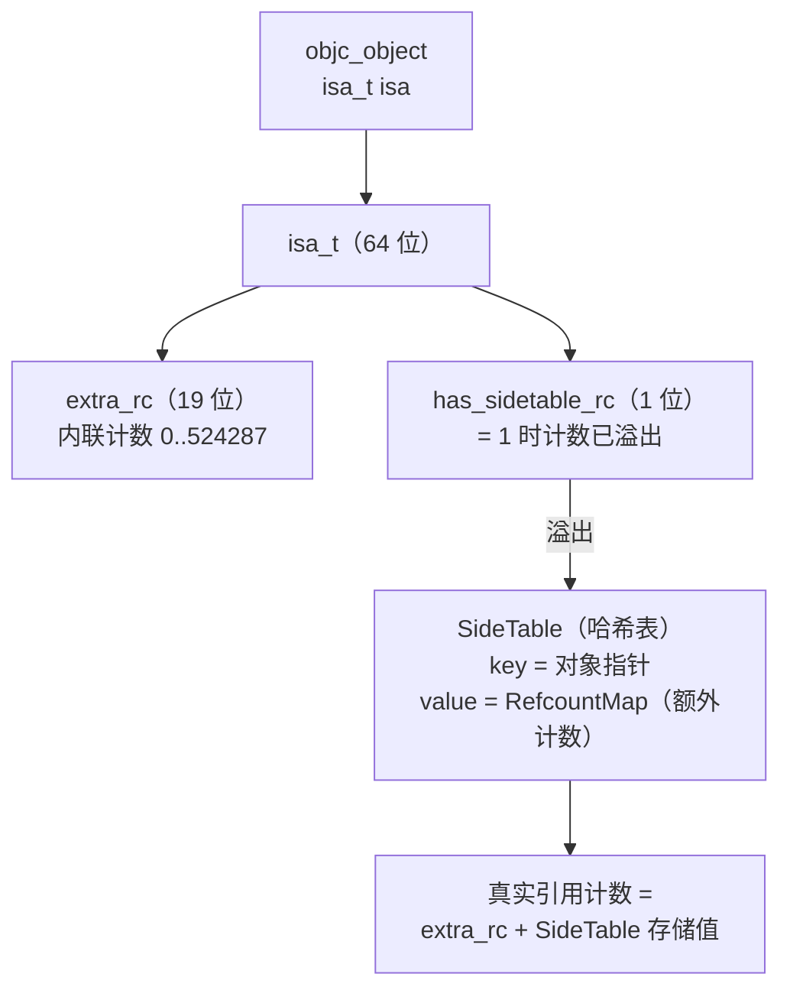
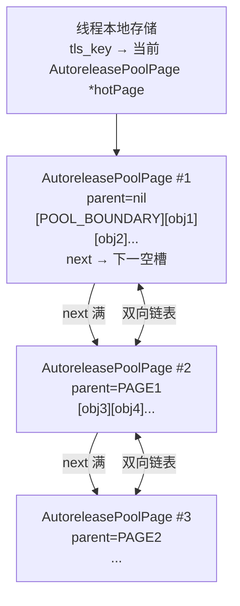
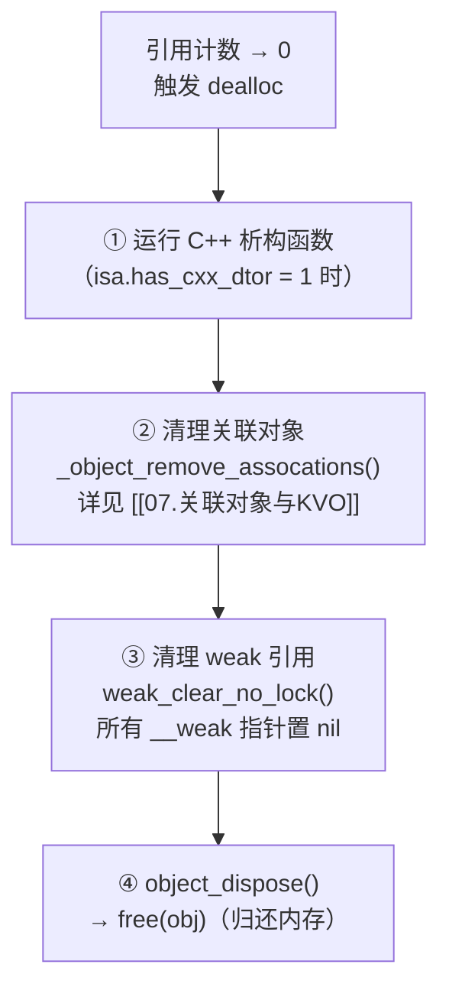

# ObjC运行时（09）· 属性与ARC内存管理

> [!abstract] TL;DR
> `@property` 是 ObjC 对"数据封装 + 内存语义"的一体化声明：编译器自动合成实例变量 `_ivar`、getter 与 setter，并根据 `strong`/`weak`/`copy` 等特性在 setter 中插入正确的 `retain`/`release`/`autorelease` 调用。ARC（Automatic Reference Counting）并不是垃圾回收——它在**编译期**静态分析引用语义并自动插入内存管理调用，引用计数存储在 isa 的 `extra_rc` 位域（不够时溢出到 `SideTable`）。weak 指针借助 `SideTable.weak_table` 在对象 `dealloc` 时被统一置 nil；`@autoreleasepool` 通过 `AutoreleasePoolPage` 双向链表管理延迟释放的对象，并与 RunLoop 每次循环的 push/pop 配合控制峰值。理解这套机制是排查循环引用、正确使用 `__weak`/`__strong` 和 block 捕获变量（见 [[10.Block原理]]）的基础。

---

## 概述与定位

Objective-C 1.0 时代，开发者必须手工编写 getter/setter，并在 MRC（Manual Reference Counting）模式下每次 `alloc`/`retain` 之后对应 `release`/`autorelease`。ObjC 2.0 引入 `@property` 语法糖将成员变量的读写、内存策略合并为一行声明；Xcode 4.2 / iOS 5 引入 ARC，让编译器承担了几乎全部的内存管理代码生成工作，但**运行时结构完全不变**——`retain`/`release` 仍然存在，只是由编译器而非程序员插入。

本篇在[[02.对象模型与isa]]讲清的 `isa_t` 内联引用计数基础上，详解 `@property` 声明到合成代码的全过程，ARC 的编译期行为，`weak`/`autorelease pool` 的运行时数据结构，以及循环引用的根因与打破方式。

---

## 原理与机制

### `@property` 的编译期展开

在源码层写下：

```objc
@interface Person : NSObject
@property (nonatomic, strong) NSString *name;
@end
```

编译器实际等价生成：

```objc
// 1. 合成实例变量（ivar）
// 等价于在 class_ro_t.ivars 中注册 _name : NSString *

// 2. 合成 getter
- (NSString *)name {
    return _name;
}

// 3. 合成 setter（strong 语义下）
- (void)setName:(NSString *)name {
    if (_name != name) {
        [_name release];        // 释放旧值
        _name = [name retain];  // 持有新值
    }
}
```

> [!info] ARC 下 setter 内部
> ARC 模式下上述 `retain`/`release` 由编译器以 `objc_storeStrong()`/`objc_release()` 等 runtime 函数形式插入，效果等价但对源码不可见。

属性的合成信息会写入 [[03.类、元类与方法列表]] 所述的 `class_ro_t` 结构中的 `baseProperties` 列表：

```c
// objc4 源码（简化）
struct property_t {
    const char *name;       // 属性名，如 "name"
    const char *attributes; // 特性字符串，如 "T@\"NSString\",N,S,V_name"
};
```

`attributes` 是紧凑编码的字符串，`T` 表示类型，`N`=nonatomic，`S`/`G` 分别指定自定义 setter/getter，`V` 指定后备 ivar 名称。

---

### 属性特性详解

#### 内存管理特性

| 特性 | 适用类型 | setter 行为 | ARC 限制符 |
|---|---|---|---|
| `strong` | ObjC 对象 | `retain` 新值，`release` 旧值 | `__strong`（默认） |
| `weak` | ObjC 对象 | 直接赋值，不 `retain`；目标 dealloc 自动置 nil | `__weak` |
| `copy` | NSCopying 对象 / block | 对新值调用 `copy`，`release` 旧值 | `__strong`（copy 语义） |
| `assign` | 标量（int/float/struct） | 直接赋值，无任何内存操作 | 无 |
| `unsafe_unretained` | ObjC 对象（罕用） | 直接赋值，不 retain，不自动置 nil（悬垂指针！） | `__unsafe_unretained` |
| `retain` | ObjC 对象（MRC） | 同 `strong`，MRC 时代用法 | — |

> [!warning] weak 与 unsafe_unretained 的本质差异
> `weak` 在被指对象 dealloc 时自动置 nil，代价是每次读取需经过 `weak_table` 加载；`unsafe_unretained` 不做任何处理，速度快但对象销毁后成悬垂指针，野指针访问即崩溃。

#### 原子性特性

| 特性 | 说明 |
|---|---|
| `atomic`（默认） | setter/getter 加自旋锁，保证单次读/写操作的原子性 |
| `nonatomic` | 无锁，性能更高；iOS 绝大多数属性用此 |

> [!warning] atomic 不等于线程安全
> `atomic` 仅保证单次 getter/setter 的原子性，**不保证复合操作（read-modify-write）的线程安全**。若需线程安全，应使用 `dispatch_queue`/`NSLock` 等同步机制。

#### 读写特性

| 特性 | 说明 |
|---|---|
| `readwrite`（默认） | 同时合成 getter 和 setter |
| `readonly` | 仅合成 getter；扩展（class extension）中可 redeclare 为 `readwrite` |

#### 自定义访问器

```objc
@property (nonatomic, assign, getter=isEnabled, setter=setEnabled:) BOOL enabled;
```

`getter=` 和 `setter=` 重命名合成的访问器方法名。BOOL 属性惯例用 `is` 前缀 getter。

---

### `@synthesize` 与 `@dynamic`

#### `@synthesize`

```objc
@implementation Person
@synthesize name = _name;  // 显式指定后备 ivar 名
@end
```

现代编译器（Xcode 4.4+）默认自动合成，无需显式写 `@synthesize`。仅在以下情况需要手动声明：
- 自定义了 getter 或 setter（编译器不再自动合成）
- 需要不同的 ivar 命名
- 使用了 `@protocol` 中声明的属性

#### `@dynamic`

```objc
@implementation Person
@dynamic name;  // 告知编译器：运行时会提供此方法，不要合成
@end
```

`@dynamic` 告诉编译器**不要**合成 getter/setter，该方法将在运行时提供。常见用途：

1. **CoreData** `NSManagedObject` 子类：属性由 CoreData 框架在运行时动态生成
2. **结合消息转发**（见[[05.消息转发机制]]）：在 `resolveInstanceMethod:` 中动态添加方法实现
3. **KVO 替代方案**：手工实现 setter 并发送通知

---

## 结构 / 源码 / 流程详解

### ARC：编译器在编译期自动插入内存管理

ARC 的核心是**编译器分析**，而非运行时垃圾回收。其工作方式：

```
源代码（.m）
    │
    ▼
Clang 静态分析（ARC 模式）
    ├── 分析每个变量的 __strong/__weak/__unsafe_unretained/__autoreleasing 语义
    ├── 在赋值处插入 objc_storeStrong() / objc_storeWeak()
    ├── 在作用域结束处插入 objc_release()
    └── 在返回值路径插入 objc_autoreleaseReturnValue() 优化
    │
    ▼
目标文件（.o）：已含 retain/release 调用
```

**MRC vs ARC 对比（以局部变量为例）：**

```objc
// MRC 手工管理
- (void)mrcExample {
    NSString *s = [[NSString alloc] initWithString:@"hello"]; // retainCount=1
    NSLog(@"%@", s);
    [s release];  // 程序员手工释放，retainCount→0，对象销毁
}

// ARC 编译器生成
- (void)arcExample {
    NSString *s = [[NSString alloc] initWithString:@"hello"]; // retainCount=1
    NSLog(@"%@", s);
    // 编译器在此处自动插入 objc_release(s)，retainCount→0
}
```

#### ARC 的关键 runtime 函数

| 函数 | 等价 MRC 操作 | 说明 |
|---|---|---|
| `objc_retain(id obj)` | `[obj retain]` | retainCount + 1 |
| `objc_release(id obj)` | `[obj release]` | retainCount - 1，归零则 dealloc |
| `objc_autorelease(id obj)` | `[obj autorelease]` | 注册到当前 autorelease pool |
| `objc_storeStrong(id *loc, id obj)` | setter 的 retain/release | 原子地更新强引用变量 |
| `objc_storeWeak(id *loc, id obj)` | — | 更新 weak 引用，维护 weak_table |
| `objc_loadWeakRetained(id *loc)` | — | 从 weak_table 加载（若对象已 dealloc 返回 nil） |

---

### 引用计数存储：isa.extra_rc + SideTable

引用计数的存储分两层，如[[02.对象模型与isa]]所述 ARM64 non-pointer isa 的位域设计：



**计数读取公式：**

```
真实引用计数 = (isa.extra_rc + 1)
              + (isa.has_sidetable_rc ? SideTable[self].refcnts : 0)
```

> [!note] extra_rc 存储的是"计数减 1"
> `extra_rc = 0` 表示引用计数为 1（对象存活）。这样在计数为 1（最常见状态）时 extra_rc 为 0，节省了一次减法。`retainCount` 返回值 = `extra_rc + 1`（简化说明，实际源码更复杂）。

**SideTable 结构：**

```c
// objc4 源码（简化）
struct SideTable {
    spinlock_t      slock;        // 自旋锁
    RefcountMap     refcnts;      // 引用计数溢出存储
    weak_table_t    weak_table;   // weak 指针注册表
};

// 全局 SideTable 数组（按对象地址哈希选表）
static SideTable SideTables[SIDETABLE_MAX_SIZE]; // 通常 8 或 64 个
```

多个 `SideTable` 分散存储可减少锁竞争（不同对象可能落到不同 `SideTable`）。

---

### retain / release / autorelease / retainCount 语义

#### retain

```c
// objc4 NSObject.mm（伪代码）
- (id)retain {
    // 1. 尝试在 isa.extra_rc 上原子加 1（快路径）
    if (isa.extra_rc < RC_HALF) {
        isa.extra_rc++;
        return self;
    }
    // 2. extra_rc 溢出，移 RC_HALF 到 SideTable
    return sidetable_retain();
}
```

#### release

```c
- (oneway void)release {
    // 1. 尝试在 isa.extra_rc 上原子减 1（快路径）
    if (isa.extra_rc > 0) {
        isa.extra_rc--;
        return;
    }
    // 2. extra_rc 已为 0，尝试从 SideTable 借回 RC_HALF
    //    若 SideTable 也无计数 → 真正归零 → dealloc
    if (isa.has_sidetable_rc) {
        sidetable_release();
    } else {
        // 引用计数归零
        ((void(*)(id, SEL))objc_msgSend)(self, @selector(dealloc));
    }
}
```

#### autorelease

`autorelease` 不立即释放，而是将 `self` 注册到当前线程的 autorelease pool，等 pool 排干（`drain`）时统一释放：

```c
- (id)autorelease {
    return objc_autorelease(self);  // 等价于 AutoreleasePoolPage::autorelease(self)
}
```

#### retainCount

`retainCount` 返回当前引用计数值，但 Apple 文档明确指出**不应依赖此值**做内存管理决策：

- 静态字符串、标记指针（TaggedPointer）等的 `retainCount` 可能返回 `ULONG_MAX`
- 多线程环境下读到的值可能在读取后立即过期

---

### weak 的实现：SideTable.weak_table

weak 指针的"自动置 nil"并非魔法，而是 `SideTable` 中 `weak_table_t` 的精确维护：

```mermaid
graph LR
    WP["__weak id weakRef"] -->|objc_storeWeak| WT["SideTable.weak_table<br/>key = 对象地址<br/>value = {&weakRef, ...}（所有 weak 指针地址数组）"]
    OBJ["被指对象"] -.isa.weakly_referenced=1.-> WT
    OBJ -->|dealloc 时| CLEAR["weak_clear_no_lock()<br/>遍历 value 数组<br/>将所有 *weakRef 置 nil"]
    CLEAR --> NWREF["所有 weak 指针 = nil<br/>无野指针"]
```

**weak 变量读写流程（ARC 编译器生成）：**

```objc
// 源码
__weak Person *wp = person;
NSLog(@"%@", wp);

// 编译器生成（伪代码）
objc_storeWeak(&wp, person);     // 写：注册到 weak_table
id tmp = objc_loadWeakRetained(&wp);  // 读：若对象存活则 retain 临时强引用
NSLog(@"%@", tmp);
objc_release(tmp);               // 读完释放临时强引用
```

> [!info] weak 读取有保护
> 每次读取 weak 指针都经过 `objc_loadWeakRetained`，在内部持有一个临时强引用，防止读取过程中对象被另一线程释放。这是 weak 安全性的保证，也是其相对于直接指针有额外开销的原因。

**dealloc 时的 weak 清理流程：**

```c
// objc4 objc-weak.mm（简化）
void weak_clear_no_lock(weak_table_t *weak_table, id referent_id) {
    // 1. 在 weak_table 中查找此对象的所有 weak 指针地址
    weak_entry_t *entry = weak_entry_for_referent(weak_table, referent_id);
    // 2. 遍历所有 weak 指针并置 nil
    for (size_t i = 0; i < entry->count; i++) {
        id *referrer = entry->referrers[i];
        *referrer = nil;   // weak 指针自动变 nil
    }
    // 3. 从 weak_table 删除此条目
    weak_entry_remove(weak_table, entry);
}
```

---

### autorelease pool：AutoreleasePoolPage 双向链表

`@autoreleasepool {}` 在编译期展开为：

```objc
// 源码
@autoreleasepool {
    NSObject *obj = [NSObject new];
}

// 编译器等价展开
void *pool = objc_autoreleasePoolPush();    // 压入哨兵
NSObject *obj = [NSObject new];
// obj 若调用了 autorelease，会被注册到当前 page
objc_autoreleasePoolPop(pool);              // 弹出并 release 所有注册对象
```

#### AutoreleasePoolPage 结构



**关键常量与字段：**

```c
// objc4 NSObject.mm（简化）
class AutoreleasePoolPage {
    static const uint32_t POOL_BOUNDARY = nil; // 哨兵值（实为 0/nil）
    AutoreleasePoolPage *parent;
    AutoreleasePoolPage *child;
    uint32_t depth;
    id *next;            // 指向下一个可用槽位
    // 紧随其后是 id 对象槽位数组，直到 PAGE_SIZE（通常 4096 字节）末尾
};
```

**push / pop 流程：**

```
objc_autoreleasePoolPush():
    1. 在当前 hotPage 的 next 位置写入 POOL_BOUNDARY（哨兵）
    2. 返回哨兵地址（作为 pop 的 token）

autorelease(obj):
    1. 在 hotPage.next 写入 obj
    2. next++（若 page 满则创建新 child page）

objc_autoreleasePoolPop(token):
    1. 从 hotPage.next 向前逐一 objc_release() 每个对象
    2. 直到遇到 token 对应的 POOL_BOUNDARY 哨兵停止
    3. 若回退到 parent page，free 已空的 child page
```

#### 与 RunLoop 的协作

主线程 RunLoop 在**每次 loop 迭代开始**时 push 一个 autorelease pool，在**迭代结束**时 pop，确保临时对象（如 UIKit 事件处理中产生的对象）在每帧结束后释放：

```
RunLoop 一次循环
  │
  ├── kCFRunLoopEntry: objc_autoreleasePoolPush()
  │
  ├── 处理事件（timer / source / block）
  │   └── 产生 autorelease 对象 → 注册到当前 pool
  │
  └── kCFRunLoopBeforeWaiting: objc_autoreleasePoolPop()
      └── 本轮所有 autorelease 对象被 release
```

> [!tip] 大量临时对象时手动创建 pool
> 循环中创建大量 `NSString`/图像等临时对象时，若依赖 RunLoop 隐式 pool，峰值内存会很高。手动在循环内加 `@autoreleasepool {}` 可在每次迭代后及时回收。

---

### dealloc 完整流程

当引用计数归零，`dealloc` 被调用，运行时按以下顺序清理对象：



**objc4 源码（NSObject.mm 简化）：**

```c
- (void)dealloc {
    _objc_rootDealloc(self);
}

void _objc_rootDealloc(id obj) {
    // 快路径：无 C++ 析构 / 无关联对象 / 无 weak 引用 / 无 SideTable 计数
    if (obj->isa.nonpointer &&
        !obj->isa.weakly_referenced &&
        !obj->isa.has_assoc &&
        !obj->isa.has_cxx_dtor &&
        !obj->isa.has_sidetable_rc) {
        free(obj);
        return;
    }
    object_dispose(obj);
}

id object_dispose(id obj) {
    objc_destructInstance(obj);  // C++ 析构 → 关联对象 → weak 清理
    free(obj);
    return nil;
}
```

> [!warning] dealloc 中的注意事项
> - **不要在 dealloc 中调用可能触发 KVO/通知的代码**：对象正在销毁，观察者可能已无效
> - **不要在 dealloc 中发消息给 weak 引用**：weak_table 清理顺序不保证，已置 nil 的 weak 指针读到 nil 后发消息是空操作（安全），但仍应避免依赖此行为
> - **`[super dealloc]` 在 ARC 下禁止手动调用**：编译器自动插入，重复调用会崩溃

---

### copy 的必要性

以下三类属性**必须使用 `copy`** 而非 `strong`：

#### 1. NSString（防可变副本）

```objc
// 危险：strong 语义
@property (nonatomic, strong) NSString *title;

NSMutableString *ms = [NSMutableString stringWithString:@"hello"];
obj.title = ms;       // setter 仅 retain，_title 指向同一 NSMutableString
[ms appendString:@"!"]; // _title 内容被外部修改！

// 安全：copy 语义
@property (nonatomic, copy) NSString *title;
obj.title = ms;       // setter 调用 [ms copy] → 生成不可变副本，外部修改无影响
```

#### 2. NSArray / NSDictionary（同理）

外部传入 `NSMutableArray` 时，`copy` 生成不可变快照，防止集合在使用中被修改。

#### 3. block（防栈 block 失效）

```objc
@property (nonatomic, copy) void (^callback)(void);

// strong 语义：若外部传入栈 block，离开其作用域后 _callback 悬垂
// copy  语义：栈 block → 堆 block（Block_copy），生命周期由属性持有
```

详细 block 类型分析见[[10.Block原理]]。

---

### 循环引用：成因与打破方式

#### 成因：strong ↔ strong 互持

```
       strong                 strong
A ─────────────→ B ─────────────→ A
     _objB           _objA
```

A 持有 B（`_objB retain`），B 持有 A（`_objA retain`），两者引用计数均 ≥ 1，没有外部强引用时也无法归零 → **内存泄漏**。

#### 打破：weak 单向弱引用

```objc
// 典型 delegate 模式
@interface NetworkClient : NSObject
@property (nonatomic, weak) id<NetworkClientDelegate> delegate;  // weak！
@end

@interface ViewController : NSObject <NetworkClientDelegate>
@property (nonatomic, strong) NetworkClient *client;
@end
```

```
ViewController  ──strong──→  NetworkClient
NetworkClient   ──weak────→  ViewController（不增加 retainCount）
```

ViewController 释放时 retainCount 归零，NetworkClient 的 `delegate` 自动置 nil。

#### block 捕获 self 的循环引用

```objc
// 泄漏：block strong 捕获 self，self 又持有 block（通过属性）
self.callback = ^{
    [self doSomething];  // self 被 block 以 strong 捕获
};

// 修复：__weak 打破
__weak typeof(self) weakSelf = self;
self.callback = ^{
    __strong typeof(weakSelf) strongSelf = weakSelf;  // 在 block 内重新 strong
    if (!strongSelf) return;
    [strongSelf doSomething];
};
```

> [!info] 为何在 block 内再转为 strongSelf
> `weakSelf` 在 block 执行期间可能随时变 nil（对象被销毁）。在 block 开头转为 `strongSelf` 后，在本次 block 执行期间对象不会被释放，保证后续逻辑的安全。详见[[10.Block原理]]的捕获变量分析。

---

## 安全性与正确使用

### weak / strong 选择原则

| 场景 | 推荐 | 原因 |
|---|---|---|
| 父→子（controller 持有 view） | `strong` | 父控制子生命周期 |
| delegate / callback | `weak` | 避免循环引用，delegate 通常是父层对象 |
| block 中捕获 self（属性 block） | `__weak` + 内部 `__strong` | 防循环引用同时保证 block 执行期间安全 |
| 通知 observer（iOS 9+） | 无需特殊处理 | `addObserver:` API 已改为 weak 持有 |
| IBOutlet | `weak`（多数情况） | view hierarchy 已被 strong 持有 |

### 循环引用排查

使用 Xcode Instruments 的 **Leaks** 工具或 **Memory Graph Debugger**：

```
Xcode → Debug → Memory Graph Debugger
查看对象图中的"循环"节点：
  MyViewController → MyNetworkClient → MyViewController（cycle!）
```

或使用 MLeaksFinder 等开源库在 `viewDidDisappear:` 后延迟检测对象是否仍存活。

### atomic 的正确理解

```objc
// atomic 只保证 getter/setter 不被半途打断
// 但无法防止以下竞态
// Thread 1:                    // Thread 2:
NSString *s = self.name;        // self.name = @"new";
// s 和 self.name 可能不一致   // 赋值竞争
```

需要复合操作线程安全时，使用 `dispatch_queue`：

```objc
// 读写安全的属性实现
- (NSString *)name {
    __block NSString *ret;
    dispatch_sync(_queue, ^{ ret = _name; });
    return ret;
}
- (void)setName:(NSString *)name {
    dispatch_barrier_async(_queue, ^{ _name = name; });
}
```

### dealloc 中的安全实践

```objc
- (void)dealloc {
    // ✅ 可以：取消 timer / 移除观察者（iOS 9 之前的 NSNotification）
    [_timer invalidate];
    [[NSNotificationCenter defaultCenter] removeObserver:self];

    // ❌ 禁止：发消息给 weak 引用（可能已 nil），调用可能 override 的方法
    // [self someVirtualMethod];  // 子类可能已 dealloc

    // ❌ 禁止（ARC）：[super dealloc];  // 编译器自动插入
}
```

---

## 小结

| 概念 | 核心要点 |
|---|---|
| `@property` | 编译器合成 `_ivar` + getter + setter，`attributes` 字符串编码内存策略 |
| `strong/weak/copy/assign` | 决定 setter 的内存操作；`copy` 防可变副本和栈 block |
| `@synthesize/@dynamic` | 前者指定 ivar 名（默认自动），后者声明运行时提供方法 |
| ARC | 编译期插入 `retain/release`，不是 GC；`extra_rc + SideTable` 双层存储计数 |
| weak 实现 | `SideTable.weak_table` 记录所有 weak 指针地址；dealloc 时遍历置 nil |
| autorelease pool | `AutoreleasePoolPage` 双向链表 + `POOL_BOUNDARY` 哨兵；RunLoop 每轮 push/pop |
| 循环引用 | strong↔strong 互持导致内存泄漏；`weak` 打破；block 用 `__weak`/`__strong` 对 |
| dealloc 顺序 | C++ 析构 → 关联对象 → weak 置 nil → free |

---

## 相关阅读

- [[02.对象模型与isa]] — `isa_t` non-pointer 位域、`extra_rc`、`has_sidetable_rc`、`weakly_referenced`
- [[03.类、元类与方法列表]] — `class_ro_t.baseProperties`、`property_t` 结构、`ivar_t`
- [[05.消息转发机制]] — `@dynamic` 配合 `resolveInstanceMethod:` 动态添加方法
- [[07.关联对象与KVO]] — dealloc 中的关联对象清理、KVO 与 setter 的关系
- [[10.Block原理]] — block 内存类型、`__block` 捕获、循环引用的 block 侧分析

---

⬅️ 上一篇 [[08.Method Swizzling]] ｜ 🏠 [[00.Objective-C与iOS运行时总览]] ｜ 下一篇 [[10.Block原理]] ➡️
