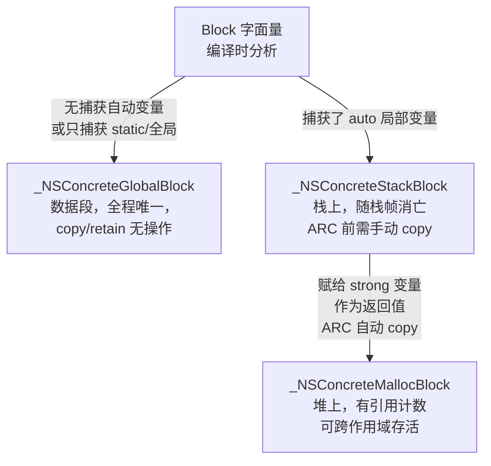
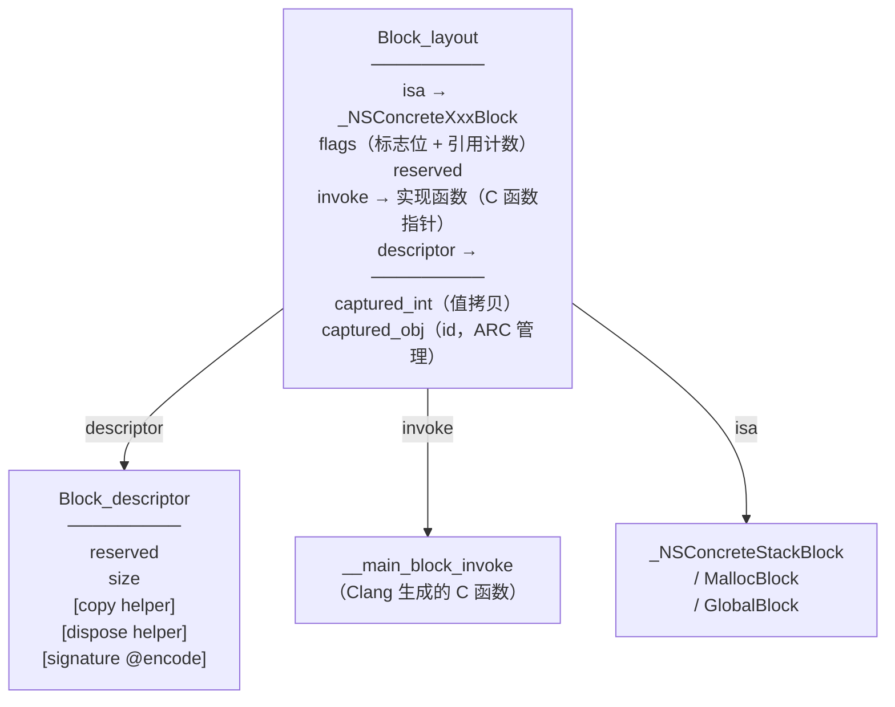
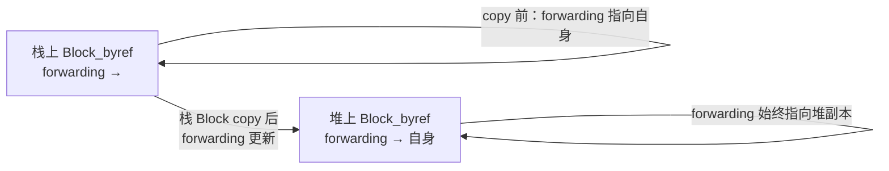

# ObjC运行时（10）· Block原理

## 概述与定位

> [!abstract] TL;DR
> Block 是 Objective-C（以及 C/C++）的闭包：一段**带有捕获环境的匿名函数**，其底层是一个普通的 C 结构体，首成员是 `isa`，本质上**也是一个对象**。编译器把 Block 字面量展开为 `Block_layout` 结构体 + 一个独立的 C 函数（`invoke`），运行时根据捕获情况把 Block 放在全局段（`_NSConcreteGlobalBlock`）、栈（`_NSConcreteStackBlock`）或堆（`_NSConcreteMallocBlock`）上。`__block` 变量则通过 `Block_byref` 结构的 `forwarding` 指针实现可写语义和跨作用域存活。逆向时，Block 的 `invoke` 字段直接指向真正的实现函数，是定位闭包逻辑的关键入口。

Block 与本系列密切交织：它的 `isa` 指针机制来自 [[02.对象模型与isa]]，捕获 `self` 会触发 [[09.属性与ARC内存管理]] 讲述的强引用循环，`invoke` 调用路径类似 [[04.objc_msgSend消息发送]] 中的 IMP 直调。Block 作为值类型在运行时中广泛用于 GCD 回调、动画完成句柄、枚举等场景，是 iOS 开发和逆向都绕不开的机制。

---

## 原理与机制

### Block 是什么

Block 字面量的语法为：

```objc
// 完整语法：^返回类型(参数列表){ 函数体 }
int (^adder)(int) = ^int(int x) {
    return x + captured;   // 捕获外层变量 captured
};
adder(10);
```

语法糖 `^` 只是编译器前端的标记，Clang 会把上述代码展开为：

1. 一个独立的 C 函数（Block 的真实实现）；
2. 一个在栈上初始化的 `Block_layout` 结构体实例；
3. 若有捕获，把捕获的值（或 byref 指针）追加在结构体末尾。

Block 能像对象一样被 `copy`/`release`，是因为 `Block_layout` 的第一个字段就是 `isa`，指向三种 Block 类之一，运行时的引用计数机制因此对 Block 完全透明。

### 三种 Block 类型的分配策略



| Block 类 | isa | 存储位置 | 何时产生 | copy 语义 |
|---|---|---|---|---|
| `_NSConcreteGlobalBlock` | 指向全局 Block 类 | `__DATA`（如 `__data`/`__const`）数据段 | 不捕获 auto 变量 | 无操作，返回自身 |
| `_NSConcreteStackBlock` | 指向栈 Block 类 | 当前栈帧 | 捕获 auto 变量 | 拷贝到堆，返回堆副本 |
| `_NSConcreteMallocBlock` | 指向堆 Block 类 | 堆（`malloc`） | 栈 Block copy 后 | 引用计数 +1 |

---

## 结构 / 源码 / 流程详解

### `Block_layout` 结构体

以下基于 Apple 开源 `libclosure`（`Block_private.h`）的结构定义：

```c
// objc4 / libclosure 源码记号
struct Block_layout {
    void        *isa;            // 指向 _NSConcreteStackBlock / MallocBlock / GlobalBlock
    volatile int flags;          // 类型标志、引用计数（低字节）、特性位
    int          reserved;       // 保留字段，通常为 0
    BlockInvokeFunction invoke;  // ← 真正的函数指针：void (*)(void *, ...)
    struct Block_descriptor_1 *descriptor;  // 描述符，含 size / helper
    // ↓ 之后紧跟捕获的变量（按声明顺序布局）
    // auto 变量：直接嵌入值（拷贝快照）
    // __block 变量：Block_byref * 指针
    // 对象引用：id（ARC 管理引用计数）
};
```

`flags` 常用位（来自 `Block_private.h`）：

| 位掩码 | 名称 | 含义 |
|---|---|---|
| `(1 << 25)` | `BLOCK_HAS_COPY_DISPOSE` | descriptor 含 copy/dispose helper |
| `(1 << 26)` | `BLOCK_HAS_CTOR` | Block 有 C++ 构造函数 |
| `(1 << 28)` | `BLOCK_IS_GLOBAL` | 全局 Block |
| `(1 << 29)` | `BLOCK_USE_STRET` | 返回值用 stret ABI（结构体） |
| `(1 << 30)` | `BLOCK_HAS_SIGNATURE` | descriptor 含 `@encode` 签名 |
| `0x0000ffff` | 低 16 位 | 引用计数（MallocBlock） |

`Block_descriptor` 的两种形态（简化）：

```c
// 基础描述符（无 copy/dispose）
struct Block_descriptor_1 {
    unsigned long int reserved;     // 保留
    unsigned long int size;         // sizeof(Block_layout) + 捕获变量大小
};

// 带 helper 描述符（捕获了对象/byref 时）
struct Block_descriptor_2 {
    // copy helper：Block 从栈复制到堆时调用，retain 捕获的对象
    void (*copy)(void *dst, const void *src);
    // dispose helper：Block 堆上被 release 归零时调用，release 捕获的对象
    void (*dispose)(const void *src);
};

// 带签名描述符（BLOCK_HAS_SIGNATURE 置位时）
struct Block_descriptor_3 {
    const char *signature;   // @encode 类型字符串，供 NSInvocation 等反射使用
};
```

`Block_layout` 整体内存布局（64 位，假设捕获一个 `int` 和一个 `id`）：

```
偏移  大小  字段
0x00   8   isa（指向 Block 类对象）
0x08   4   flags
0x0C   4   reserved
0x10   8   invoke（函数指针）
0x18   8   descriptor（指针）
0x20   4   捕获的 int 变量（值拷贝）
0x24   4   对齐填充
0x28   8   捕获的 id 对象（引用，ARC 管理）
```

### `Block_layout` 结构示意图



### 变量捕获规则

| 变量类型 | 捕获方式 | Block 内可写？ | 说明 |
|---|---|---|---|
| `auto` 局部变量（值类型） | **按值拷贝**（快照） | 否 | Block 构造时复制当前值，后续原变量修改不影响 Block |
| `auto` 局部变量（`id` 对象） | 按值拷贝引用（+retain） | 否（引用本身不变） | copy helper 对对象 retain；ARC 自动处理 |
| `static` 局部变量 | **按地址捕获**（指针） | 是 | 共享同一存储，Block 内修改立即可见 |
| 全局变量 / `static` 全局 | 直接访问（不进入结构体） | 是 | 不捕获，编译器直接生成全局访问代码 |
| `self`（实例方法内） | 按值捕获 `self` 指针 | — | 最常见的循环引用根源，见[[09.属性与ARC内存管理]] |

> [!warning] auto 变量捕获是快照
> `int x = 10; void (^b)(void) = ^{ NSLog(@"%d", x); }; x = 20; b();` 输出 `10`，不是 `20`。捕获时刻即定型。

### Clang 展开示意

```c
// 原始 ObjC 代码
int captured = 42;
void (^blk)(void) = ^{ NSLog(@"%d", captured); };
blk();

// Clang 展开（伪 C，简化）
struct __main_block_impl_0 {
    struct Block_layout base;  // isa / flags / reserved / invoke / descriptor
    int captured;              // 捕获的值拷贝
};

// 真正的实现函数
static void __main_block_invoke_0(struct __main_block_impl_0 *__self) {
    NSLog(@"%d", __self->captured);  // 从结构体读捕获值
}

// 描述符（静态存储）
static struct Block_descriptor_1 __main_block_desc_0 = {
    0,
    sizeof(struct __main_block_impl_0)
};

// 在栈上初始化
struct __main_block_impl_0 tmp = {
    { &_NSConcreteStackBlock, 0, 0,
      (BlockInvokeFunction)__main_block_invoke_0,
      &__main_block_desc_0 },
    captured   // 值拷贝 42
};
void (^blk)(void) = &tmp;
blk->base.invoke(blk);   // 直接调用函数指针，不走 objc_msgSend
```

### `__block` 变量与 `Block_byref`

`__block` 关键字让捕获变量**可被 Block 内部读写**。编译器为每个 `__block` 变量生成一个 `Block_byref` 结构体：

```c
struct Block_byref {
    void        *isa;          // 通常为 NULL（非 ObjC 对象）
    struct Block_byref *forwarding;  // 关键：指向"有效副本"
    volatile int flags;              // 类型标志
    unsigned int size;               // sizeof(Block_byref)
    // [可选] copy/dispose helper（捕获对象时需要）
    // 紧随其后：变量的实际存储
    int value;                 // 示例：__block int value
};
```

`forwarding` 指针的作用：



- **copy 之前**：`forwarding` 指向结构体自身，Block 通过 `byref->forwarding->value` 访问；
- **copy 之后**：栈 byref 的 `forwarding` 被更新为指向堆上的副本，此后不管通过哪个副本访问，路径都经由 `forwarding` 到达唯一的堆副本，保证读写一致。

`__block` 变量访问路径（Block 内部）：

```c
// 编译器生成（等价逻辑）
__block int x = 10;
// Block 内访问：
blk->byref_x->forwarding->x = 20;  // 写
int v = blk->byref_x->forwarding->x; // 读
```

### copy / dispose helper

当 Block 捕获了 `id` 对象或 `__block` 变量时，描述符里会附带 copy 和 dispose helper：

- **copy helper**（`_Block_copy` 调用时执行）：遍历捕获列表，对强引用对象调用 `_Block_object_assign`（相当于 retain），对 byref 变量也做 byref copy；
- **dispose helper**（Block 被 release 归零时执行）：对捕获的对象调用 `_Block_object_dispose`（相当于 release），对 byref 调用 byref release。

这两个 helper 是 ARC 下 Block 管理对象生命周期的核心机制。

### ARC 下的自动 copy

在 ARC 编译模式下，以下场景编译器会**自动**对栈 Block 执行 copy：

| 场景 | 说明 |
|---|---|
| 赋给 `__strong`/`copy` 修饰的变量 | `strong id blk = ^{ ... };` |
| 作为函数/方法返回值 | 返回局部 Block 时自动 copy |
| 作为函数参数传入（参数类型为 Block） | 实参是栈 Block、形参是 `id` 时触发 |
| 放入 NSArray / NSDictionary 等集合 | 集合插入时 copy |

> [!tip] ARC 之前的手动 copy
> MRC 时代必须显式 `[blk copy]` 才能让栈 Block 存活到作用域之外，否则访问已弹出的栈帧是 UB。

---

## 逆向实践

### 从 `invoke` 定位 Block 实现

Block 不走 `objc_msgSend`，调用时直接 `blk->invoke(blk, args...)`。逆向时定位步骤：

1. 在二进制中找到 Block 的数据结构（常在 `__DATA` 段或栈上），识别 `_NSConcreteGlobalBlock` / `_NSConcreteStackBlock` 等 isa；
2. 读取偏移 `+0x10` 处的 `invoke` 指针，这就是**真实实现函数**的地址；
3. 在 Hopper/IDA 中跳转到该地址，即可看到 Block 内部逻辑；
4. 偏移 `+0x18` 处 `descriptor->size` 反映捕获变量区域大小，可辅助确认捕获了哪些值。

```bash
# Frida 动态读取 Block invoke 指针（示例）
var blkPtr = ptr("0x..."); // Block 实例地址
var invoke = blkPtr.add(0x10).readPointer();
console.log("invoke ->", invoke, DebugSymbol.fromAddress(invoke).name);
```

> [!warning] 示例输出为示意
> 上述地址和符号名为示例，实际结果因 App 二进制和 ASLR 而不同。

### Frida Hook Block invoke

```javascript
// Hook 一个已知 invoke 函数地址
Interceptor.attach(ptr("0x100012abc"), {   // 替换为实际 invoke 地址
    onEnter(args) {
        var self = args[0];  // 第一个参数始终是 Block 自身
        console.log("[Block invoke] self =", self);
        // 读取捕获的第一个 int（偏移 0x20，按实际结构体调整）
        console.log("  captured_int =", self.add(0x20).readInt());
    }
});
```

> [!warning] 示例输出为示意
> 偏移量需根据 Clang 生成的实际结构体布局确认，可结合 class-dump 或 Hopper 分析。

### Hopper/IDA 中识别 Block 结构

全局 Block（`_NSConcreteGlobalBlock`）在 `__DATA.__data` 段静态可见：

```
__main_block_impl_0:
  .quad _NSConcreteGlobalBlock   ; isa
  .long 0x50000000               ; flags（BLOCK_IS_GLOBAL | BLOCK_HAS_SIGNATURE）
  .long 0x00000000               ; reserved
  .quad __main_block_invoke_0    ; invoke ← 跳这里！
  .quad __main_block_desc_0      ; descriptor
```

`class-dump` 不直接导出 Block 类型，但 `otool -tV` 可解析上述汇编布局。

---

## 安全性与正确使用

### 1. 栈 Block 逃逸（悬空指针）

```objc
// 危险：MRC 或将 Block 指针保存到比 Block 生命周期更长的容器
void (^dangerous)(void);
{
    int x = 10;
    dangerous = ^{ NSLog(@"%d", x); }; // 栈 Block，作用域结束即失效
}
dangerous(); // UB：访问已弹出的栈帧
```

ARC 会自动 copy，但若强制使用 `__unsafe_unretained` 或在 C 层传递 Block 指针，仍需手动 `Block_copy()`。

### 2. 循环引用：`__weak` + `__strong` 惯用法

Block 捕获 `self` 后 `self` 持有 Block，形成强引用环（详见 [[09.属性与ARC内存管理]]）：

```objc
// 错误：self → block → self（循环引用，内存泄漏）
self.completion = ^{ [self doSomething]; };

// 正确：weakSelf 打破强引用，strongSelf 防止 Block 执行期间 self 提前释放
__weak typeof(self) weakSelf = self;
self.completion = ^{
    __strong typeof(self) strongSelf = weakSelf;
    if (!strongSelf) return;
    [strongSelf doSomething];
};
```

### 3. `__block` 与多线程

`Block_byref` 通过 `forwarding` 指针访问变量，**不保证原子性**。多线程并发读写 `__block` 变量仍需加锁或使用原子操作：

```objc
__block int counter = 0;
// 危险：并发 GCD 任务修改 counter（数据竞争）
dispatch_async(queue, ^{ counter++; }); // 非原子
dispatch_async(queue, ^{ counter++; }); // 可能丢失更新
// 正确：用 serial queue 或 dispatch_barrier / os_lock / atomic
```

### 4. copy 语义与所有权

- `@property (copy) dispatch_block_t handler`：copy 属性会在赋值时把栈 Block 复制到堆，是正确的 Block 属性声明方式；
- 用 `strong` 替代 `copy` 通常在 ARC 下等价（ARC 会自动 copy），但语义不够明确；
- 切勿对同一 Block 多次 `Block_copy` 而不配对 `Block_release`（MRC 场景）。

### 5. 逆向合规提示

通过 `invoke` 指针分析 Block 逻辑属于静态分析技术，用于自有 App 安全评估、漏洞研究或授权样本分析是合规的；对第三方 App 的 Block 进行运行时 Hook 需获得授权，详见 [[34.现代二进制防护机制/11.macOS与iOS防护|macOS/iOS 防护]]。

---

## 小结

Block 的本质是**一个带 `isa` 的 C 结构体（`Block_layout`）+ 一个独立的 C 函数（`invoke`）**。编译器在编译期完成所有展开，运行时只负责 copy/dispose（管理堆内存和对象引用计数）。理解它的三个核心点：

1. **结构**：`isa → flags → invoke（函数指针）→ descriptor → 捕获变量`；
2. **三种存储**：无捕获 → 全局段；捕获 auto → 栈；copy 后 → 堆（有 retainCount）；
3. **`__block`**：`Block_byref` + `forwarding` 指针保证 copy 后读写唯一性；栈 copy 到堆时 byref 同步搬迁。

逆向时，Block 的 `invoke`（偏移 +0x10）直接指向实现函数，是定位闭包逻辑的最快入口。

---

## 相关阅读

- [[01.Objective-C运行时概览]] — 动态语言基础、objc4 源码结构
- [[02.对象模型与isa]] — Block 的 isa 指向的 Block 类对象、对象内存布局
- [[04.objc_msgSend消息发送]] — Block invoke 是直接函数调用，与消息发送的区别
- [[09.属性与ARC内存管理]] — ARC 引用计数、weak 表、循环引用根因
- [[11.Mach-O中的ObjC元数据]] — 全局 Block 在 Mach-O 数据段的静态布局

---

⬅️ 上一篇 [[09.属性与ARC内存管理]] ｜ 🏠 [[00.Objective-C与iOS运行时总览]] ｜ 下一篇 [[11.Mach-O中的ObjC元数据]] ➡️
