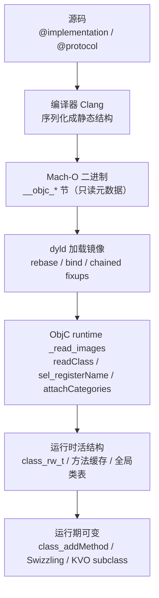
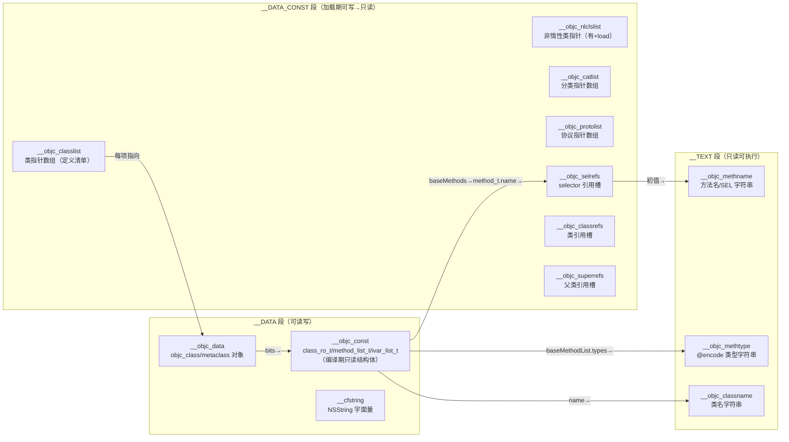
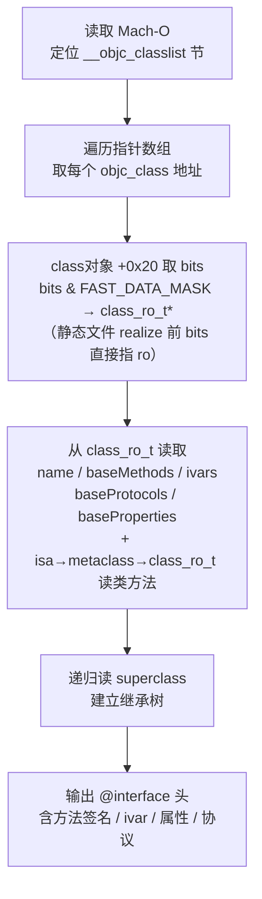

# ObjC运行时（11）· Mach-O中的ObjC元数据

## 概述与定位

> [!abstract] TL;DR
> Objective-C 的对象模型（类、元类、方法、ivar、协议、分类、属性，详见 [[03.类、元类与方法列表]]）在**编译期**就被编译器序列化成一套 `__objc_*` 静态节，写进 Mach-O（详见 [[12.Mach-O文件详解/00.Mach-O文件详解总览.md]]）。dyld 加载镜像时，ObjC runtime 的 `_read_images` 遍历这些节，完成 rebase / bind（fixup）后建立类表、唯一化 selector，最终让你写的 `[obj doSomething]` 能在运行时找到正确的 `IMP`。这套元数据**完整保留了类名、方法名、类型编码**，是 class-dump / Hopper / Frida 等逆向工具的"金矿"，也是混淆与加密需要对抗的对象。

本篇是系列中 **ObjC 运行时机制与 Mach-O 二进制格式的桥梁**，大量引用已有的 12.Mach-O 系列各节的细节；深度与 [[03.类、元类与方法列表]] 互补（那篇讲运行时结构，本篇讲它如何落盘与被加载）。读完后你能理解：编译器如何把 `@implementation` 序列化进二进制、runtime 如何把它还原成活的数据结构、逆向工具如何利用它重建头文件。

---

## 原理与机制

### ObjC 元数据的"两段式"生命周期

ObjC 运行时信息经历**编译期落盘 → 加载期 fixup → 运行期可变**三个阶段：



**编译期**：Clang 为每个 `@implementation` 生成一组静态结构：`class_ro_t`（只读类数据）、`method_list_t`（方法列表）、`ivar_list_t`（成员变量列表）、`protocol_list_t`（协议列表）、`property_list_t`（属性列表）。这些结构以字节形式写进二进制，形成 `__objc_const` / `__objc_data` 等节。方法名字符串去重后放入 `__TEXT,__objc_methname`，类名字符串放入 `__TEXT,__objc_classname`，类型编码字符串放入 `__TEXT,__objc_methtype`。

**加载期 fixup**：编译期写入的是文件偏移或 rebase 占位（VMAddr 在 ASLR 前不确定），dyld 在映射镜像后遍历 `LC_DYLD_CHAINED_FIXUPS`（或旧式 `LC_DYLD_INFO`）链式 fixup 链，把所有指针 rebase 成实际运行地址，把跨镜像的外部引用 bind 到目标符号。之后 runtime 接管：`_read_images` 调 `_getObjc2ClassList` 遍历类指针数组，逐个 `readClass` + `addNamedClass` 完成类注册；`_getObjc2SelectorRefs` 遍历 selrefs，`sel_registerName` 确保全进程唯一 `SEL` 后回填槽位；非惰性类（有 `+load`）立即 `realizeClass`，普通类惰性 realize（首次收到消息时）。

**运行期可变**：realize 完成后 `bits` 指向 `class_rw_t`（dirty memory），Category 方法通过 `attachLists` 前插入 `class_rw_ext_t.methods`；`method_exchangeImplementations` 直接改写 `method_t.imp`；KVO 动态子类由 runtime `objc_allocateClassPair` 在内存中创建，不在 Mach-O 里有对应节。

---

## 段节地图：逐节用途

下图给出 ObjC 元数据在 Mach-O 段节中的完整布局：



> [!note] `__DATA` vs `__DATA_CONST`
> 启用 `LC_DYLD_CHAINED_FIXUPS` 的现代二进制（iOS 14+ / macOS 11+）会把加载期回填一次便不再改变的指针数组（`classlist`/`selrefs`/`classrefs` 等）移入 `__DATA_CONST`，fixup 完成后 dyld 将页重新保护为只读，享受多进程共享页的收益。`__objc_const` 里的只读结构体（`class_ro_t` 等）本身也常在 `__DATA_CONST`；真正在运行期需要写的脏内存（`class_rw_t`/`class_rw_ext_t`）由 runtime 在堆上分配，不在这些节里。

### `__TEXT,__objc_methname`

存放**方法名/SEL 名字符串本体**（如 `"setName:\0"`、`"viewDidLoad\0"`），节类型 `S_CSTRING_LITERALS`，住只读 `__TEXT`，链接器跨编译单元**去重合并**同名字符串，每个名字只存一份字节。它是 `__objc_selrefs` 槽的初值指向目标，也是 class-dump 显示方法名的来源。详见 [[12.Mach-O文件详解/24.Mach-O __objc_methname节.md]]。

### `__TEXT,__objc_methtype`

存放**方法类型编码字符串**（ObjC `@encode` 产生，如 `"v28@0:8@16@24"` 表示 `- (void)foo:(id)a bar:(id)b`），节类型 `S_CSTRING_LITERALS`，只读 `__TEXT`。每个 `method_t` 的 `types` 字段指向此节里的一段字符串。类型字符串完整描述了方法的返回类型、参数类型与栈帧偏移，是 `NSInvocation`、`NSMethodSignature` 的数据来源，逆向时可据此还原方法签名。详见 [[12.Mach-O文件详解/26.Mach-O __objc_methtype节.md]]。

### `__TEXT,__objc_classname`

存放**类名字符串本体**（如 `"AppDelegate\0"`），节类型 `S_CSTRING_LITERALS`，只读 `__TEXT`。`class_ro_t.name` 指针指向此节里的对应字符串。`objc_getClass("AppDelegate")` 注册时使用的正是这里的类名。详见 [[12.Mach-O文件详解/25.Mach-O __objc_classname节.md]]。

### `__DATA_CONST,__objc_classlist`

**所有 ObjC 类的定义清单**，一张指针数组，每项指向一个 `_OBJC_CLASS_$_XxxClass`（即 `objc_class` 对象，符号名 `_OBJC_CLASS_$_`）。条目数 = `节 size / 8`（64 位）。runtime 用 `_getObjc2ClassList` 读此节，逐个 `readClass → addNamedClass → addClassTableEntry`，建立 `gdb_objc_realized_classes` 命名类表。**class-dump 入口**：逆向工具枚举此节即可列出"这个二进制定义了哪些类"。详见 [[12.Mach-O文件详解/36.Mach-O __objc_classlist节.md]]。

### `__objc_nlclslist`

**非惰性类（non-lazy class）指针数组**：`__objc_classlist` 的子集，只列出实现了 `+ (void)load` 的类。runtime 在 `_read_images` 的"Realize non-lazy classes"阶段用 `_getObjc2NonlazyClassList` 读此节，**立即 realize** 这些类（不等首次消息），保证 `+load` 在 `main()` 前被调用。详见 [[12.Mach-O文件详解/37.Mach-O __objc_nlclslist节.md]]。

### `__objc_catlist`

**分类（category）指针数组**，每项指向一个 `category_t` 结构：

```c
struct category_t {
    const char *name;           // 分类名（"MyCategory"）
    classref_t cls;             // 被扩展的类引用
    struct method_list_t *instanceMethods;
    struct method_list_t *classMethods;
    struct protocol_list_t *protocols;
    struct property_list_t *instanceProperties;
    struct property_list_t *classProperties;
};
```

runtime 在 `_read_images` 末尾调 `_getObjc2CategoryList` 收集全部 `category_t`，在对应类 realize 后（或 realize 时）通过 `attachCategories → attachLists` 把分类方法**前插**进 `class_rw_ext_t.methods`（不是替换，而是排在原方法之前，因此分类同名方法"看起来覆盖"主类方法）。详见 [[12.Mach-O文件详解/39.Mach-O __objc_catlist节.md]]。

### `__objc_protolist`

**协议（protocol）指针数组**，每项指向一个 `protocol_t`：

```c
struct protocol_t : objc_object {
    const char *mangledName;
    struct protocol_list_t *protocols;       // 父协议
    method_list_t *instanceMethods;
    method_list_t *classMethods;
    method_list_t *optionalInstanceMethods;
    method_list_t *optionalClassMethods;
    property_list_t *instanceProperties;
    const char **extendedMethodTypes;        // 完整 @encode 串
    // …
};
```

runtime 用 `_getObjc2ProtocolList` 读此节，把协议指针唯一化后注册进全局协议表（`NXMapTable`），供 `objc_getProtocol` / `conformsToProtocol:` 使用。详见 [[12.Mach-O文件详解/38.Mach-O __objc_protolist节.md]]。

### `__objc_selrefs`

**Selector 引用槽数组**：每处 `@selector(foo)` 或 `[obj foo]` 都在此节留一个槽，编译期初值指向 `__objc_methname` 里的名字字符串。加载期 runtime 调 `_getObjc2SelectorRefs` 遍历，`sel_registerName` 确保全进程唯一 `SEL`，回填槽位。回填后 `objc_msgSend` 可以用**指针相等**做方法缓存键，免去字符串比较，这是消息派发快路径的根基。节类型 `S_LITERAL_POINTERS`，属性 `S_ATTR_NO_DEAD_STRIP`（禁止死代码消除，保证动态使用的 selector 不被优化掉），`flags` 典型值 `0x10000005`。详见 [[12.Mach-O文件详解/35.Mach-O __objc_selrefs节.md]]。

### `__objc_classrefs` / `__objc_superrefs`

**类引用槽**（`__objc_classrefs`）：每处 `[MyClass doSomething]` 这类对类对象的引用都在此节留一个槽，加载期 runtime 调 `_getObjc2ClassRefs` 遍历，`remapClassRef` 把槽改写成 realize 后的真实 `Class` 指针。

**父类引用槽**（`__objc_superrefs`）：专门存放 `[super xxx]` 用到的父类类引用，`_getObjc2SuperRefs` 读取，`remapClassRef` 同样修复。

两者是"我用了哪些类"的引用清单，与 `__objc_classlist`（"我定义了哪些类"）相对。详见 [[12.Mach-O文件详解/40.Mach-O __objc_classrefs节.md]]。

### `__objc_const`

存放**编译期只读结构体**：`class_ro_t`、`method_list_t`、`ivar_list_t`、`protocol_list_t`、`property_list_t`，以及分类的 `category_t` 内嵌方法/属性列表。这是二进制里**体积最大的 ObjC 元数据区**，也是 class-dump 真正读取类接口信息的地方。

### `__objc_data`

存放**类对象（`objc_class`）和元类对象（metaclass）**的实体数据。每个类在此节有一个 `objc_class` 实例（符号 `_OBJC_CLASS_$_XxxClass`）和一个元类实例（符号 `_OBJC_METACLASS_$_XxxClass`）。加载期 `__objc_classlist` 里的指针就指向此节里的类对象。

### `__cfstring`（NSString 字面量）

存放 `@"Hello"` 这类 Objective-C 字符串字面量对象，每项是一个 `__CFConstantStringImpl` 结构体（`isa` 指向 `__NSCFConstantString`、`flags`、指向 `__TEXT` 里字符串数据的指针、`length`）。详见 [[12.Mach-O文件详解/34.Mach-O __cfstring节.md]]。

---

## 结构 / 源码 / 流程详解

### `class_ro_t` 的落盘形态

`class_ro_t` 是编译期由 Clang 生成的**只读类数据**，直接序列化进 `__objc_const` 节（clean memory，可在内存紧张时被 OS 回收再从文件读回）。其布局（结合 [[03.类、元类与方法列表]] 中的字段说明）：

```c
struct class_ro_t {
    uint32_t flags;           // RO_META / RO_ROOT / RO_HAS_CXX_STRUCTORS …
    uint32_t instanceStart;   // 本类 ivar 起始偏移（父类占完后的偏移）
    uint32_t instanceSize;    // 实例总字节数
#ifdef __LP64__
    uint32_t reserved;
#endif
    const uint8_t *ivarLayout;        // 强引用 ivar GC/ARC 布局位图
    const char *name;                 // → __objc_classname 里类名 C 字符串
    method_list_t *baseMethodList;    // 编译期方法列表（新式可为相对方法列表）
    protocol_list_t *baseProtocols;   // 编译期协议列表
    const ivar_list_t *ivars;         // 实例变量列表
    const uint8_t *weakIvarLayout;    // 弱引用 ivar 布局位图
    property_list_t *baseProperties;  // 编译期属性列表
};
```

`instanceStart`/`instanceSize` 是 ObjC 2.0 **non-fragile ivars**（非脆弱成员变量）的关键：父类库即便后来增加了 ivar，子类可在 realize 时重新计算自己 ivar 的偏移（`moveIvars`），无需重新编译。

### `method_list_t` / `ivar_list_t` / `protocol_list_t`

三者都采用**带计数头 + 连续条目**的布局：

```c
// 通用结构（以 method_list_t 为例）
struct method_list_t : entsize_list_tt<method_t, method_list_t, 0xffff0003, method_t::pointer_modifier> {
    // uint32_t entsizeAndFlags;  // 低 16 位 = 每条目字节数；高位含 is_uniqued / is_sorted / smallMethodListFlag
    // uint32_t count;
    // method_t first;            // 后跟 count-1 个连续 method_t
};
```

**`method_t`** 有两种形态（由 `entsizeAndFlags` 的 `smallMethodListFlag` 位区分）：

| 形态 | 字段 | 说明 |
|---|---|---|
| 传统"大"方法（big） | `SEL *name`（绝对指针）<br/>`const char *types`<br/>`IMP imp`（绝对指针） | 加载时需 rebase；每项 24 字节（64 位） |
| 新式"小"方法（small/relative） | `int32_t nameOffset`（相对自身地址）<br/>`int32_t typesOffset`<br/>`int32_t impOffset` | 位置无关，加载时免 rebase；每项 12 字节，节省 dirty pages |

新式相对方法列表（objc4-781+）中，`nameOffset` 相对字段自身地址指向一个 `SEL *`（进而指向 `__objc_methname` 字符串），`impOffset` 相对指向 IMP。这是 `__DATA_CONST` 优化的基础——方法列表整体免 rebase，可住 clean memory。

**`ivar_t`** 结构：

```c
struct ivar_t {
    int32_t *offset;     // 指向 ivar offset 变量（运行期可被修正：non-fragile ivar）
    const char *name;    // ivar 名（如 "_name"）
    const char *type;    // @encode 类型字符串（如 "@\"NSString\""）
    uint32_t alignment_raw;
    uint32_t size;
};
```

**`property_t`** 结构：

```c
struct property_t {
    const char *name;       // 属性名（"name"）
    const char *attributes; // @encode 属性特性串（"T@\"NSString\",C,N,V_name"）
};
```

### class-dump 原理：遍历 `__objc_classlist` 还原 `@interface`

class-dump 的核心算法，5 步走：



具体实现要点：
- `class_ro_t.name` → `__objc_classname` → 类名字符串。
- `class_ro_t.baseMethodList` → `method_list_t` → 遍历每个 `method_t`：`name`（经 `__objc_selrefs` 或直接）指向 `__objc_methname` 得方法名；`types` 指向 `__objc_methtype` 得参数/返回类型。
- 类方法（`+ methods`）在**元类**的 `class_ro_t.baseMethodList` 里：从类对象的 `isa`（指向元类）读 `bits → class_ro_t`，再取 `baseMethodList`。
- `class_ro_t.ivars` → `ivar_list_t` → 每个 `ivar_t` 有 `name`/`type`/`offset`。
- `class_ro_t.baseProtocols` → `protocol_list_t` → 每个 `protocol_t` 的 `mangledName` 即协议名。
- `class_ro_t.baseProperties` → `property_list_t` → 每个 `property_t` 的 `name`/`attributes`。
- 分类（`category_t`）在 `__objc_catlist` 里，class-dump 也会读取并输出为 `@interface XxxClass (CategoryName)` 块。

> [!warning] 示例输出为示意
> 以下 class-dump 输出基于结构知识构造，实际数值以目标二进制为准。

```bash
class-dump /path/to/TargetApp.app/TargetApp
```

```objc
// 示意输出（结构知识构造）
@interface UserModel : NSObject <NSCopying>
{
    NSString *_name;      // ivar，来自 ivar_list_t
    NSInteger _age;
}
@property (nonatomic, copy) NSString *name;    // 来自 property_list_t
@property (nonatomic, assign) NSInteger age;
- (id)initWithName:(NSString *)name age:(NSInteger)age;  // 来自 method_list_t
- (NSString *)description;
+ (id)sharedInstance;   // 来自元类 method_list_t
@end
```

### dyld fixup：rebase / bind 与 chained fixups

编译期写入 `__objc_*` 节的指针，在磁盘上不是最终运行地址，需经 dyld 修正：

| fixup 类型 | 目标节 | 说明 |
|---|---|---|
| **Rebase**（内部指针） | `__objc_classlist`、`__objc_data`、`__objc_const` 里各结构体内部指针 | ASLR 随机化后，文件偏移 → 运行地址；加上 slide |
| **Bind**（外部符号） | `__objc_classrefs`/`__objc_superrefs`（引用系统框架类）、`objc_class.superclass`（父类在系统库） | 跨镜像符号，需 dyld 在符号表里查找后填入实际地址 |
| **Chained fixups**（现代） | 同上 | iOS 14+ / macOS 11+ 改用 `LC_DYLD_CHAINED_FIXUPS`：把 rebase/bind 信息编码进指针低位（`DYLD_CHAINED_PTR_*` 格式），dyld 遍历链式结构一次性完成所有修正，比旧式 `LC_DYLD_INFO` 更快 |

ObjC runtime 在 dyld 完成 fixup 后接管，执行**元数据级别的修正**：`remapClassRef`（class/superrefs）、`sel_registerName` + 回填（selrefs）、`attachCategories`（catlist）、唯一化协议指针（protolist）。

> [!note] 为什么说这是"两层 fixup"
> dyld 负责把**内存地址**对齐到 ASLR 后的实际地址（指针层面）；ObjC runtime 再做**语义层面**的修正——合并跨镜像的同名 selector 成唯一指针、把 classref 槽绑定到已 realize 的类对象、把分类方法 attach 进类的运行期方法列表。缺少任何一层，ObjC 消息派发都会失效。

---

## 逆向实践

### 为什么是"逆向金矿"

与 C/C++ / Swift 二进制相比，ObjC Mach-O 的逆向阻力极低，根本原因是**所有元数据都在**：

| 信息 | ObjC 二进制 | stripped C/C++ | stripped Swift |
|---|---|---|---|
| 类名 | ✓ 完整（`__objc_classname`） | ✗ 符号表可被 strip | △ 部分保留（`@objc` 暴露）|
| 方法名 | ✓ 完整（`__objc_methname`） | ✗ 函数名可被 strip | ✗ Swift 符号被 mangle |
| 参数类型 | ✓ `@encode` 类型串（`__objc_methtype`） | ✗ | ✗ |
| ivar 名/类型 | ✓ `ivar_t.name`/`type` | ✗ | ✗ |
| 属性 | ✓ `property_t.attributes` | ✗ | ✗ |
| 协议 | ✓ `protocol_t.mangledName` | N/A | △ |

原因在于：ObjC 的动态消息派发需要在运行时按**字符串名字**查找方法（`sel_registerName`、`objc_getClass`），故这些名字**必须**以字符串形式保留在二进制中。即使 `strip` 删除了符号表（`__LINKEDIT,__symtab`），`__objc_*` 节里的字符串依然完整，逆向工具只需遍历 `__objc_classlist` 就能还原整个类层次。

### 用工具验证

```bash
# 列出二进制定义的所有类（枚举 __objc_classlist）
otool -ov /path/to/Binary | grep "name "

# dump selector 引用表
otool -s __DATA_CONST __objc_selrefs /path/to/Binary

# class-dump 还原头文件
class-dump -H /path/to/Binary -o /tmp/headers/

# frida 运行时枚举
# ObjC.classes 内部就是遍历已 realize 类表（gdb_objc_realized_classes 的运行时版本）
```

> [!warning] 示例输出为示意
> 以上命令输出因目标二进制而异，仅供结构理解参考。

---

## 安全性与正确使用

### 符号保留带来的逆向暴露面

ObjC 二进制的安全风险比 C/Swift 高一个数量级，原因是：
- **类名/方法名全裸**：业务逻辑、接口设计、内部模块划分一目了然（如 `PaymentManager`、`- (void)chargeUser:(NSString *)cardId amount:(double)amount`）。
- **类型信息完整**：`@encode` 类型串暴露参数类型，可直接构建 `NSInvocation` 调用私有方法。
- **ivar 布局暴露**：`ivar_t.offset` 给出每个成员变量的内存偏移，利于内存扫描攻击。

### 混淆的局限

常见 ObjC 混淆手段有两种：

**类名/方法名混淆**：把 `UserManager` 改成随机字符串（如 `a3f9bc`），把 `-[UserManager loginWithToken:]` 改成 `-[a3f9bc b7d2e1:]`。代价是：① 与系统框架 delegate 方法（如 `UIApplicationDelegate` 协议方法）名字不能改，否则 runtime 找不到；② 第三方 SDK 依赖固定方法名的 KVO / NSNotification / performSelector: 会失效；③ crash 日志可读性下降，调试困难。效果有限：混淆后方法**数量、参数数量、类型编码**仍然暴露，有经验的逆向工程师可据此还原语义。

**方法名 hash 化（SEL 混淆）**：把方法名替换成 hash 串，运行时注册。但 `__objc_methname` 里仍然存储这些 hash 串，只是人类不可读，借助交叉引用依然可追踪。

### 加密段（FairPlay / 砸壳）

对抗逆向的终极手段是**加密**：App Store 发布的 IPA 经 FairPlay DRM 加密 `__TEXT` 段（`LC_ENCRYPTION_INFO_64` 中 `cryptid=1`），静态工具无法解析加密段里的代码。但 ObjC **元数据节（`__objc_*`）通常不在加密段**（元数据节在 `__DATA`/`__DATA_CONST`），故即使加密，class-dump 依然可以读取类结构。

只有运行时解密后从内存 dump（"砸壳"：`dumpdecrypted` / `frida-ios-dump` / `Clutch`）才能拿到完整可读的代码段，这涉及代码签名与沙盒绕过，详见 [[13.iOS安全与砸壳]] 与 [[34.现代二进制防护机制/11.macOS与iOS防护.md]]。

### 与 Swift metadata 的区别

Swift 类（未标注 `@objc`）使用完全不同的元数据格式：`__TEXT,__swift5_types`（类型描述符）、`__swift5_proto`（协议一致性）等，字段名经 **Swift name mangling** 编码，类型信息更少暴露（无 `@encode` 类型串，协议一致性以哈希存储）。`strip` 后可读性大幅下降。通过 `@objc`/`@objcMembers` 暴露给 ObjC 的 Swift 成员，则会在 ObjC `__objc_*` 节里留下完整元数据。详见 [[14.Swift运行时简介]]。

> [!note] 合规使用提示
> 本篇所述逆向技术用于**自有 App 安全评估、授权研究样本分析、iOS 内部机制学习**。对他人生产 App 进行未授权逆向分析可能违反《计算机信息系统安全保护条例》及 App Store 开发者协议，请在授权范围内使用。

---

## 小结

- ObjC 元数据在**编译期**由 Clang 序列化成 `__objc_*` 静态节写进 Mach-O；**加载期**经 dyld fixup + runtime `_read_images` 完成类注册、selector 唯一化、分类 attach；**运行期**在 `class_rw_t`（dirty memory）上可变。
- 关键段节一览：`__TEXT` 存字符串（`__objc_methname`/`__objc_methtype`/`__objc_classname`）；`__DATA_CONST` 存引用/列表类指针数组（`__objc_classlist`/`__objc_selrefs`/`__objc_classrefs` 等）；`__DATA` 存结构体实体（`__objc_const`/`__objc_data`/`__cfstring`）。
- `class_ro_t`（clean，编译期）→ `class_rw_t`（dirty，realize 后）→ `class_rw_ext_t`（惰性，分类 attach 时）是类数据的三层结构，详见 [[03.类、元类与方法列表]]。
- **class-dump 原理**：枚举 `__objc_classlist` → 每项 `+0x20 → bits & FAST_DATA_MASK → class_ro_t` → 读 `name`/`baseMethods`/`ivars`/`baseProtocols`/`baseProperties`，加上元类的方法列表，重建 `@interface` 头。
- ObjC 二进制是**逆向金矿**：类名/方法名/类型全保留，strip 不影响 `__objc_*` 节，对比 C/Swift 被 mangle 或 strip 的符号优势巨大。混淆可降低可读性但无法根本阻止结构还原；加密段（FairPlay）不覆盖元数据节，砸壳后才完整。

---

## 相关阅读

- [[03.类、元类与方法列表]] — `objc_class`/`class_ro_t`/`class_rw_t`/`method_t` 运行时结构详解
- [[12.Mach-O文件详解/00.Mach-O文件详解总览.md]] — Mach-O 格式总体结构与各节索引
- [[12.Mach-O文件详解/36.Mach-O __objc_classlist节.md]] — `__objc_classlist` 详解：类指针数组与 `readClass` 流程
- [[12.Mach-O文件详解/35.Mach-O __objc_selrefs节.md]] — `__objc_selrefs` 详解：selector 引用唯一化
- [[12.Mach-O文件详解/40.Mach-O __objc_classrefs节.md]] — 类引用槽与 `remapClassRef`
- [[12.Mach-O文件详解/39.Mach-O __objc_catlist节.md]] — 分类指针数组与 `attachCategories`
- [[12.Mach-O文件详解/38.Mach-O __objc_protolist节.md]] — 协议指针数组与协议唯一化
- [[12.Mach-O文件详解/24.Mach-O __objc_methname节.md]] — 方法名字符串节
- [[12.Mach-O文件详解/26.Mach-O __objc_methtype节.md]] — 方法类型编码节
- [[12.Mach-O文件详解/34.Mach-O __cfstring节.md]] — NSString 字面量节
- [[12.iOS逆向工具]] — Hopper / IDA / class-dump / Frida / LLDB 使用
- [[13.iOS安全与砸壳]] — FairPlay 加密与内存 dump 原理
- [[14.Swift运行时简介]] — Swift metadata 格式与 ObjC 互操作差异
- [[32.hooks/00.总览.md]] — Hook 技术总览（Method Swizzling 在逆向中的应用）
- [[34.现代二进制防护机制/11.macOS与iOS防护.md]] — 代码签名、沙盒与运行时防护

---

⬅️ 上一篇 [[10.Block原理]] ｜ 🏠 [[00.Objective-C与iOS运行时总览]] ｜ 下一篇 [[12.iOS逆向工具]] ➡️
