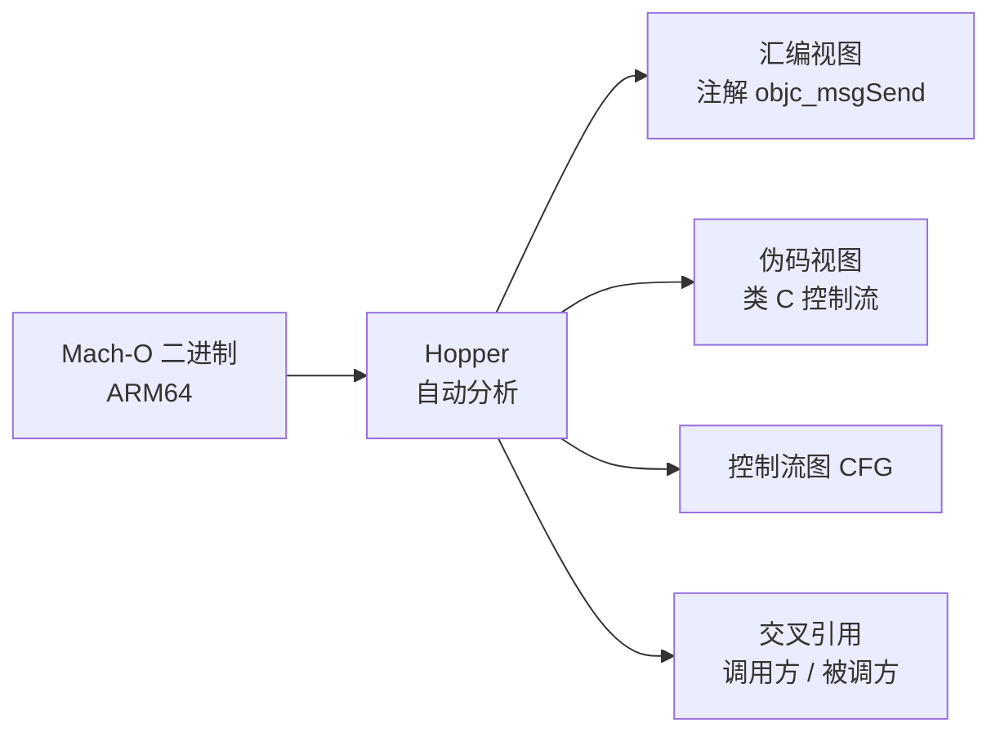
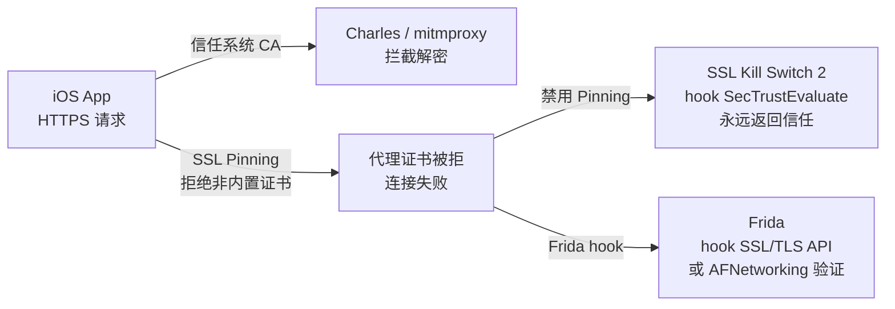
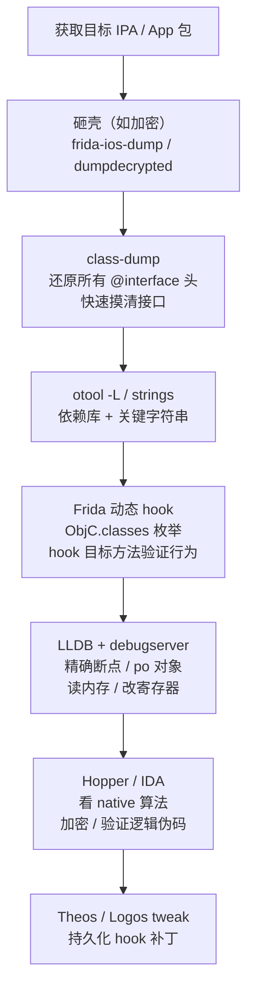

# ObjC运行时（12）· iOS逆向工具

## 概述与定位

> [!abstract] TL;DR
> - iOS 逆向工具链与 Android **路线不同**：Android 主力是 jadx（字节码反编译），iOS 面对的是 Mach-O 原生二进制，主力是 **class-dump**（还原 ObjC 头）+ **Hopper/IDA/Ghidra**（反汇编/伪码）+ **Frida**（动态 hook）+ **LLDB + debugserver**（断点调试）。
> - **静态分析**先摸接口（class-dump / otool / MachOView），**动态分析**再验证行为（Frida hook / LLDB / Cycript），**反汇编**看 native 算法（Hopper / IDA / Ghidra）。
> - 越狱设备（checkra1n / unc0ver / palera1n）是大多数深度逆向的前提：未越狱设备无法 attach debugserver、无法加载 Frida gadget 以外的注入方式。
> - **砸壳**是 App Store 包分析的第一步（FairPlay DRM，`cryptid=1`），工具见 [[13.iOS安全与砸壳]]。
> - Frida 是 iOS/Android **双平台通用**的动态 hook 框架，见 [[32.hooks/00.总览.md]]；LLDB 详细原理见 [[44.调试器原理与实战/09.LLDB原理与实战.md]]。

---

iOS 逆向面对的可执行格式是 **Mach-O**（而非 ELF），运行时元数据以 `__objc_classlist` / `__objc_selrefs` / `__objc_catlist` 等节存储在二进制中（见 [[11.Mach-O中的ObjC元数据]]）。这决定了工具链的基本走向：

- **不存在像 jadx 那样的字节码反编译器**：ObjC/Swift 编译为原生 ARM64 机器码，逆向起点是反汇编，而非字节码还原。
- **ObjC 运行时元数据格式良好**：`class-dump` 可直接解析 `__objc_*` 节还原 `@interface` 头，这是 iOS 逆向特有的"高级静态信息"优势。
- **动态 hook 接口统一**：`objc_msgSend` 是所有 ObjC 方法调用的必经之路，拦截它即可覆盖所有 ObjC 方法，Frida 正是利用这一特性。

与 Android 逆向（[[35.Android逆向与运行时/08.静态分析工具.md]]）的核心区别：

| 维度 | iOS 逆向 | Android 逆向 |
|---|---|---|
| 目标格式 | Mach-O（原生 ARM64） | DEX/APK（字节码） + ELF（native so） |
| 主力静态工具 | class-dump、Hopper、IDA、Ghidra | jadx（字节码反编译）、IDA（native so） |
| 高级语言信息 | ObjC 元数据（类名/方法名/类型编码）保留 | DEX 保留类/方法名；混淆后较难 |
| 动态 hook | Frida、LLDB + debugserver、Cycript | Frida、Xposed/LSPosed、LLDB |
| hook 入口 | `objc_msgSend`（ObjC）/ vtable（Swift） | ART 方法入口、JNI、`dlopen` |
| 需越狱/Root | 深度分析通常需越狱 | 深度分析通常需 Root 或模拟器 |
| DRM/加密 | FairPlay（`cryptid=1`），需砸壳 | 无统一 DRM，但有加固/packing |

---

## 工具链全景

### 工具分类 Mermaid

```mermaid
graph TD
  ROOT["iOS 逆向工具链"]
  ROOT --> STATIC["静态分析"]
  ROOT --> DYNAMIC["动态分析"]
  ROOT --> SHELL["砸壳工具"]
  ROOT --> TRAFFIC["抓包/网络"]

  STATIC --> CD["class-dump<br/>还原 @interface 头"]
  STATIC --> HOPPER["Hopper Disassembler<br/>反汇编 + 伪码"]
  STATIC --> IDA["IDA Pro<br/>行业标准反汇编"]
  STATIC --> GHIDRA["Ghidra<br/>NSA 开源，免费"]
  STATIC --> MACHOV["MachOView<br/>可视化 Mach-O 结构"]
  STATIC --> OTOOL["otool / nm / lipo / strings<br/>命令行静态工具"]
  STATIC --> JTOOL["jtool2<br/>命令行 Mach-O 分析"]

  DYNAMIC --> FRIDA["Frida<br/>ObjC.classes / JS hook"]
  DYNAMIC --> LLDB["LLDB + debugserver<br/>断点 / 读内存 / po"]
  DYNAMIC --> CYCRIPT["Cycript<br/>JS/ObjC 混合 REPL 注入"]
  DYNAMIC --> THEOS["Theos / Logos<br/>越狱 tweak 开发"]
  DYNAMIC --> SUBSTRATE["Cydia Substrate / substitute<br/>tweak hook 框架"]

  SHELL --> DEC["dumpdecrypted<br/>内存 dump 解密"]
  SHELL --> FRIDA_IOS["frida-ios-dump<br/>Frida 辅助砸壳"]
  SHELL --> CLUTCH["Clutch（旧）<br/>越狱设备砸壳"]

  TRAFFIC --> PROXY["Charles / mitmproxy<br/>HTTP(S) 代理抓包"]
  TRAFFIC --> SSL["SSL Kill Switch 2<br/>禁用 SSL pinning"]
```



---

## 静态分析工具详解

### class-dump：还原 ObjC 头文件

**class-dump** 是 iOS 静态分析的第一步，专为解析 Mach-O 中的 ObjC 元数据设计。

**原理**：读取 `__DATA` 段中的 `__objc_classlist` / `__objc_catlist` / `__objc_protolist`（见 [[11.Mach-O中的ObjC元数据]]），遍历 `class_ro_t` 的方法列表、属性列表、ivar 列表，将类型编码（type encoding）反解析，输出标准 ObjC `@interface` / `@protocol` 头。

被解析的关键节：

| Mach-O 节 | class-dump 利用内容 |
|---|---|
| `__objc_classlist` | 所有类的 `class_t` 指针列表 |
| `__objc_catlist` | Category 附加方法 |
| `__objc_protolist` | Protocol 声明 |
| `__objc_methname` | 方法选择子字符串（在 `__TEXT`） |
| `__objc_methtype` | 方法类型编码字符串 |
| `__objc_classname` | 类名字符串 |

```bash
# 对单架构二进制还原头文件
class-dump -H -o ./Headers/ TargetApp

# fat binary 需先指定架构（或用 lipo 拆分）
class-dump -H --arch arm64 -o ./Headers/ TargetApp
```

> [!warning] 示例输出为示意

```text
$ class-dump -H -o ./Headers/ TargetApp
Writing class definitions to ./Headers/...
  TargetApp-Headers/LoginViewController.h
  TargetApp-Headers/NetworkManager.h
  TargetApp-Headers/UserModel.h
  ...
```

> [!warning] 示例输出为示意

生成的头文件示例（`NetworkManager.h`）：

```objc
// 由 class-dump 生成，示例
@interface NetworkManager : NSObject
@property (nonatomic, strong) NSURLSession *session;
@property (nonatomic, copy) NSString *baseURL;
- (void)requestWithPath:(NSString *)arg1
             parameters:(NSDictionary *)arg2
             completion:(void (^)(id, NSError *))arg3;
- (instancetype)initWithBaseURL:(NSString *)arg1;
@end
```

> [!warning] 示例输出为示意

**注意**：
- App Store 包被 FairPlay 加密（`cryptid=1`），直接 class-dump 加密二进制只能得到极少信息，需先砸壳（见 [[13.iOS安全与砸壳]]）。
- Swift 类若未 `@objc` 标记，不会出现在 ObjC 元数据中，class-dump 无法还原。
- jtool2 (`jtool2 -d objc -arch arm64 TargetApp`) 提供类似功能且支持更多 Mach-O 字段。

---

### Hopper Disassembler

Hopper 是 macOS 平台最流行的商业反汇编器，对 Mach-O 和 ObjC 有原生支持。

**核心能力**：
- 自动识别 ObjC 方法：反汇编时将 `objc_msgSend` 调用注解为 `[receiver selector]`，可读性极高。
- **伪代码（Pseudocode）视图**：按 `F` 键切换为类 C 的控制流伪代码，加速阅读算法逻辑。
- **交叉引用**：`X` 键查看选择子的所有调用方，`xref` 网络帮助理解调用关系。
- **脚本扩展**：Python/Objective-C 脚本接口，可批量重命名、提取字符串。



ObjC 方法识别示例——Hopper 将原始汇编中的 `bl _objc_msgSend` 注解为：

```asm
; 示例：Hopper 注解后的伪汇编（示意）
; var_10 = [NSString stringWithFormat:@"%@/%@", self.baseURL, path]
; [self.session dataTaskWithURL:url completionHandler:block]
```

> [!warning] 示例输出为示意

---

### IDA Pro

IDA Pro 是业界最强大的多平台反汇编器，支持 Mach-O ARM64、识别 ObjC/Swift 运行时模式。

**优势**：
- **FLIRT 签名库**：识别标准库函数，减少分析噪音。
- **Hex-Rays 反编译插件**：ARM64 伪码质量极高，是分析算法/加密的首选。
- **脚本生态**（IDAPython / IDC）：自动化重命名、批量分析、漏洞挖掘。
- **ObjC Helper 插件**（如 `objc_helper.py`）：自动解析 `__objc_*` 节，比 Hopper 更细粒度。

**与 Hopper 对比**：

| 维度 | Hopper | IDA Pro |
|---|---|---|
| 价格 | 约 $99（个人） | 数千 $（专业版） |
| 伪码质量 | 良好 | 极高（Hex-Rays） |
| 脚本生态 | Python（有限） | IDAPython（丰富） |
| ObjC 感知 | 原生内置 | 插件辅助 |
| 上手难度 | 低 | 中高 |
| 适用场景 | 快速分析、iOS 日常逆向 | 深度算法分析、漏洞研究 |

---

### Ghidra

Ghidra 是 NSA 开源的多平台逆向工程框架，**免费**，支持 Mach-O ARM64。

- **P-Code 中间语言**：反编译基于 P-Code，支持的架构持续增加。
- **协作模式**：多人共享同一项目数据库，适合团队分析。
- **插件**：`GhidraObjcRuntime`（第三方）可解析 ObjC 元数据；Frida 脚本可导出运行时地址回 Ghidra。
- **不足**：ObjC 方法注解和伪码可读性不及 Hopper/IDA；ARM64 分析速度较慢。

---

### MachOView

MachOView 是一款图形化 Mach-O 文件结构查看器（macOS），无反汇编功能，专注可视化：

- 展示 Load Commands（`LC_SEGMENT_64`、`LC_ENCRYPTION_INFO_64`、`LC_CODE_SIGNATURE` 等）
- 展示所有节（Section）内容（十六进制 + 解析）
- 可直接确认 `cryptid` 字段判断是否加密
- 适合快速探索 Mach-O 布局，与 class-dump / otool 互补

---

### 命令行工具：otool / nm / lipo / strings / jtool2

这组 macOS 自带或第三方命令行工具是"轻量静态分析"的标准配置：

#### otool

`otool`（object tool）是 macOS 自带的 Mach-O 分析工具，类比 ELF 的 `readelf` + `objdump`：

```bash
# 查看 ObjC 类/方法元数据（__objc_* 节原始内容）
otool -ov TargetApp

# 查看动态库依赖（类比 ldd）
otool -L TargetApp

# 反汇编指定节（__text）
otool -tV TargetApp

# 查看 Load Commands
otool -l TargetApp | head -100

# 查看加密信息（判断是否砸壳）
otool -l TargetApp | grep -A5 LC_ENCRYPTION_INFO
```

> [!warning] 示例输出为示意

```text
$ otool -l TargetApp | grep -A5 LC_ENCRYPTION_INFO_64
          cmd LC_ENCRYPTION_INFO_64
      cmdsize 24
     cryptoff 16384
    cryptsize 12288000
      cryptid 1              ← 1 表示已加密，0 表示未加密/已砸壳
```

> [!warning] 示例输出为示意

```text
$ otool -L TargetApp
TargetApp:
	/System/Library/Frameworks/Foundation.framework/Foundation (compatibility version 300.0.0, current version 1967.0.0)
	/System/Library/Frameworks/UIKit.framework/UIKit (compatibility version 1.0.0, current version 5000.0.0)
	/usr/lib/libobjc.A.dylib (compatibility version 1.0.0, current version 228.0.0)
	/usr/lib/libSystem.B.dylib (compatibility version 1.0.0, current version 1345.0.0)
```

> [!warning] 示例输出为示意

#### nm

`nm` 列出 Mach-O 的符号表，快速定位函数入口：

```bash
nm -gU TargetApp | grep -i "login"     # 列出未定义（外部）全局符号，过滤 login
nm -arch arm64 TargetApp | grep " T "  # T 段（text）中的已定义符号
```

> [!warning] 示例输出为示意

#### lipo

`lipo` 处理 **fat binary**（通用二进制，含多架构切片）：

```bash
# 查看 fat binary 包含的架构
lipo -info TargetApp

# 提取 arm64 切片（class-dump / IDA 分析单架构更高效）
lipo -thin arm64 TargetApp -output TargetApp_arm64

# 合并多架构切片
lipo -create arm64/TargetApp x86_64/TargetApp -output TargetApp_fat
```

> [!warning] 示例输出为示意

```text
$ lipo -info TargetApp
Architectures in the fat file: TargetApp are: arm64 arm64e
```

> [!warning] 示例输出为示意

#### strings / jtool2

```bash
# 提取二进制中的可打印字符串（URL、密钥、错误信息等）
strings TargetApp | grep -i "https://"
strings TargetApp | grep -i "secret\|key\|token\|password"

# jtool2：比 otool 更强大的第三方命令行工具
jtool2 --analyze TargetApp          # 综合分析
jtool2 -d objc -arch arm64 TargetApp  # ObjC 元数据（类似 class-dump）
jtool2 --sig TargetApp              # 查看代码签名
jtool2 -e arch -arch arm64 TargetApp  # 提取 arm64 切片
```

> [!warning] 示例输出为示意

---

## 动态分析工具详解

### Frida：跨平台动态 hook 框架

**Frida** 是 iOS/Android **双平台通用**的动态分析框架（hook 原理详见 [[32.hooks/00.总览.md]]），通过向目标进程注入 JavaScript 引擎（QuickJS/V8）实现动态 hook。

iOS 上的两种注入方式：
- **越狱设备**：安装 `frida-server` 到设备，电脑通过 USB 连接使用
- **非越狱设备**：将 `FridaGadget.dylib` 嵌入重打包的 IPA，或用 `frida-ios-device` 方案

#### ObjC.classes：枚举所有 ObjC 类

```javascript
// 列出所有已加载的 ObjC 类名（含私有框架）
// 在 frida REPL 或脚本中运行
Object.keys(ObjC.classes).filter(name => name.includes("Login")).forEach(name => {
    console.log(name);
});
```

> [!warning] 示例输出为示意

```text
LoginViewController
LoginViewModel
LoginNetworkHandler
SocialLoginCoordinator
```

> [!warning] 示例输出为示意

#### hook ObjC 方法

```javascript
// hook -[NetworkManager requestWithPath:parameters:completion:]
// 打印参数、修改返回值
if (ObjC.available) {
    const NetworkManager = ObjC.classes.NetworkManager;
    const method = NetworkManager['- requestWithPath:parameters:completion:'];

    Interceptor.attach(method.implementation, {
        onEnter(args) {
            // args[0]=self, args[1]=SEL, args[2]=path, args[3]=params, args[4]=block
            const path = ObjC.Object(args[2]).toString();
            const params = ObjC.Object(args[3]).toString();
            console.log(`[*] requestWithPath: ${path}`);
            console.log(`[*] parameters: ${params}`);
        },
        onLeave(retval) {
            console.log(`[*] return: ${retval}`);
        }
    });
}
```

> [!warning] 示例输出为示意

#### hook objc_msgSend（全局拦截）

```javascript
// 拦截所有 objc_msgSend 调用（开销大，调试时使用）
const objc_msgSend = Module.findExportByName('libobjc.A.dylib', 'objc_msgSend');
Interceptor.attach(objc_msgSend, {
    onEnter(args) {
        // args[0]=receiver, args[1]=selector
        try {
            const sel = ObjC.selectorAsString(args[1]);
            if (sel.includes('login') || sel.includes('token')) {
                const cls = ObjC.Object(args[0]).$className;
                console.log(`[msgSend] [${cls} ${sel}]`);
            }
        } catch (e) {}
    }
});
```

> [!warning] 示例输出为示意

#### hook native 函数（非 ObjC）

```javascript
// hook C 函数 CCCrypt（常用加密函数）
const CCCrypt = Module.findExportByName('libcommonCrypto.dylib', 'CCCrypt');
if (CCCrypt) {
    Interceptor.attach(CCCrypt, {
        onEnter(args) {
            console.log(`[CCCrypt] operation=${args[0]}, algorithm=${args[1]}`);
            // args[4] = key buffer, args[5] = key length
            console.log(`[CCCrypt] key=${hexdump(args[4], { length: parseInt(args[5]) })}`);
        }
    });
}
```

> [!warning] 示例输出为示意

---

### LLDB + debugserver：断点调试

LLDB 是 iOS/macOS 的原生调试器（完整原理见 [[44.调试器原理与实战/09.LLDB原理与实战.md]]）。iOS 调试场景下，**debugserver** 运行在越狱设备上，LLDB 通过 USB（`iproxy`/`usbmuxd`）或 Wi-Fi 连接调试。

#### 越狱设备调试流程

```bash
# 1. 设备侧：debugserver 附加目标 App（需越狱 + debugserver 有 get-task-allow 权利）
debugserver *:1234 -a "TargetApp"

# 2. 电脑侧：通过 iproxy 映射 USB 端口
iproxy 1234 1234 &

# 3. 连接 LLDB
lldb
(lldb) platform select remote-ios
(lldb) process connect connect://localhost:1234
(lldb) process attach --name "TargetApp"
```

> [!warning] 示例输出为示意

#### 关键 LLDB 命令（iOS/ObjC 场景）

```bash
# 断点设到 ObjC 方法
(lldb) breakpoint set -n "-[LoginViewController loginButtonTapped:]"

# 断点设到 objc_msgSend（条件：selector 包含 "token"）
(lldb) breakpoint set -a 0x$(nm TargetApp | grep objc_msgSend | awk '{print $1}')
(lldb) breakpoint modify --condition 'strcmp((char *)$x1, "tokenForUser:") == 0' 1

# po：打印 ObjC 对象（自动调用 description）
(lldb) po $x0           # ARM64：x0 = self
(lldb) po (NSString *)$x2   # 打印第一个参数（字符串）
(lldb) po [(NSObject *)$x0 class]   # 打印对象类名

# 读内存（查看 ivar 布局）
(lldb) memory read --size 8 --format x --count 8 $x0

# 修改寄存器（改返回值绕过检查）
(lldb) register write x0 0x1   # 让函数返回 YES/true

# 打印 ObjC 类方法列表（运行时）
(lldb) expression (void)NSLog(@"%@", [LoginViewController _shortMethodDescription])
```

> [!warning] 示例输出为示意

#### Mach 异常端口与 get-task-allow

在 iOS 上，`debugserver` 必须持有 `com.apple.private.security.no-container` 和 `get-task-allow` 权利签名才能 attach 到第三方 App 进程。这正是越狱的核心价值：越狱解除了这层限制，允许任意 `get-task-allow` 权利的二进制 attach 到其他进程。非越狱设备只能调试带 `get-task-allow` entitlement 的**自签名** App（Xcode 开发调试场景）。

---

### Cycript：JS/ObjC 混合 REPL 注入

**Cycript** 是一个独特的运行时交互工具，允许将 **JavaScript 和 Objective-C 语法混合**的 REPL 注入到运行中的进程，无需重新编译。

```bash
# 附加到运行中的 App（越狱设备）
cycript -p TargetApp
```

> [!warning] 示例输出为示意

Cycript REPL 示例：

```javascript
// 获取当前 UIApplication 的 keyWindow
cy# UIApp.keyWindow
// 遍历所有 view 层级
cy# function printTree(view, depth) {
  var prefix = '';
  for (var i = 0; i < depth; i++) prefix += '  ';
  console.log(prefix + '[' + view.description() + ']');
  for (var i = 0; i < [[view subviews] count]; i++)
    printTree([[view subviews] objectAtIndex:i], depth+1);
}; printTree(UIApp.keyWindow, 0)

// 找到所有 LoginViewController 实例
cy# choose(LoginViewController)

// 直接调用私有方法
cy# [#0x1234abcd performLogin]
```

> [!warning] 示例输出为示意

Cycript 现已较少维护（停留在 iOS 12 时代），但其"ObjC + JS 混合语法"思想影响了后来的 Frida ObjC API 设计。

---

### Theos / Logos：越狱 tweak 开发

**Theos** 是越狱 tweak 的开发框架，**Logos** 是其 preprocessor，提供简洁的 hook 语法糖：

```objc
// Logos tweak 示例（Tweak.xm）
// hook -[LoginViewController viewDidLoad]
%hook LoginViewController

- (void)viewDidLoad {
    %orig;  // 调用原实现
    NSLog(@"[Tweak] LoginViewController loaded");
}

// hook -[NetworkManager requestWithPath:parameters:completion:]
- (void)requestWithPath:(NSString *)path
             parameters:(NSDictionary *)params
             completion:(id)block {
    NSLog(@"[Tweak] API call: %@", path);
    %orig;
}

%end

// 构造函数：tweak 加载时执行
%ctor {
    NSLog(@"[Tweak] loaded");
}
```

> [!warning] 示例输出为示意

Logos 语法编译为标准的 `MSHookMessageEx`（Cydia Substrate）或 `SubHookMessageEx`（substitute）调用。

---

### Cydia Substrate / substitute：hook 底层框架

这两者是越狱 tweak 的运行时 hook 基础框架：

| 框架 | 主要 API | 兼容性 |
|---|---|---|
| **Cydia Substrate** | `MSHookMessageEx`（ObjC）、`MSHookFunction`（native） | 老牌，checkra1n/unc0ver 生态 |
| **substitute** | `SubHookMessageEx`、`SubHookFunction` | 开源替代，libhooker 的前身 |
| **libhooker** | `LHHookMessageEx`、`LHHookFunction` | 现代 palera1n 生态 |

这些框架的底层实现：
- **ObjC method hook**：修改 `method_t.imp` 指针（等价于 Method Swizzling，见 [[08.Method Swizzling]]），但通过框架 API 保证线程安全和 trampoline 管理
- **native function hook**：写入 inline hook（修改函数开头几条指令为跳转到 trampoline），类似 Frida Interceptor 的做法

---

## 砸壳工具（简述）

App Store 分发的 IPA 被 FairPlay DRM 加密（`LC_ENCRYPTION_INFO_64`，`cryptid=1`），直接分析加密二进制意义有限。砸壳工具在运行时从内存 dump 解密后的 Mach-O 文本段：

| 工具 | 方式 | 说明 |
|---|---|---|
| **dumpdecrypted** | `dylib` 注入 + 内存 dump | 经典方案，需越狱 + `DYLD_INSERT_LIBRARIES` |
| **frida-ios-dump** | Frida 脚本 + 内存 dump | 无需 dylib 注入，越狱/非越狱均有方案 |
| **Clutch** | 进程 fork + dump | 较旧，兼容性差 |

砸壳原理与 FairPlay 详解见 [[13.iOS安全与砸壳]]（本篇不展开）。

---

## 越狱环境

越狱是 iOS 深度逆向的基础环境，因为：
1. **debugserver 需要 `get-task-allow`**：未越狱设备无法 attach 到第三方 App
2. **Frida server 需要 root 权限**：注入任意进程需绕过沙箱
3. **读写系统文件**：砸壳、替换 dylib、注入 tweak 均需 root 文件系统访问
4. **安装第三方工具**：Cydia/Sileo 包管理器提供 class-dump、cycript、debugserver 等工具

主流越狱工具：

| 工具 | 支持范围 | 类型 | 说明 |
|---|---|---|---|
| **checkra1n** | iOS 12–14（A7–A11） | bootrom exploit | 基于 checkm8，物理电缆触发，不依赖 iOS 版本签名 |
| **unc0ver** | iOS 11–14（多设备） | userland exploit | 无需电脑，App 安装，需定期重签 |
| **palera1n** | iOS 15–16（A9–A11） | bootrom exploit | checkm8 基础，支持较新 iOS |
| **dopamine** | iOS 15–16（A12+） | userland exploit | 支持新芯片，rootless 模式 |

包管理器：
- **Cydia**（老牌，Saurik 维护）：`apt`-based，大多数老 tweak 来自 Cydia
- **Sileo**（现代）：更快的 UI，dpkg-based，palera1n 生态默认

> [!warning]
> 越狱设备应与日常使用设备**物理隔离**，不登录 Apple ID/iCloud，不存储个人数据。越狱会显著削弱设备安全性。

---

## 网络抓包

iOS 应用的网络通信分析与 Android 同理，核心障碍是 **SSL Pinning**：



**标准抓包流程**：
1. 手机设置 Wi-Fi HTTP 代理 → Charles/mitmproxy
2. 安装代理根证书到设备
3. 若有 SSL Pinning → 安装 **SSL Kill Switch 2**（越狱 tweak）或用 Frida 脚本 hook `SecTrustEvaluateWithError`

---

## 典型工作流



**工作流要点**：
1. **class-dump 摸接口**：从 ObjC 元数据获得类名/方法名，是理解 App 架构的最快方式。
2. **Frida 动态验证**：找到目标方法后，Frida hook 实时打印参数/返回值，确认行为假设。
3. **LLDB 精调**：对复杂条件（特定参数值、特定调用路径）用 LLDB 条件断点精确定位。
4. **Hopper/IDA 看算法**：ObjC 调用是弱类型的消息传递，遇到 native C 函数（加密、校验）必须用反汇编器理解逻辑。
5. **Theos 持久化**：分析完成后，用 Theos/Logos 写越狱 tweak 做持久 hook 或修复补丁。

---

## 工具对比总表

| 工具 | 类型 | 开源/收费 | 平台 | 核心用途 |
|---|---|---|---|---|
| class-dump | 静态 | 开源 | macOS | ObjC 头文件还原 |
| Hopper Disassembler | 静态 | 商业（~$99） | macOS/Linux | 反汇编 + 伪码，ObjC 感知强 |
| IDA Pro | 静态 | 商业（贵） | Win/macOS/Linux | 业界最强反汇编，Hex-Rays 伪码 |
| Ghidra | 静态 | 开源（NSA） | 跨平台 | 免费反汇编，团队协作 |
| MachOView | 静态 | 开源 | macOS | 可视化 Mach-O 结构 |
| otool | 静态 | 系统自带 | macOS | 元数据/反汇编/依赖分析 |
| nm | 静态 | 系统自带 | macOS | 符号表查看 |
| lipo | 静态 | 系统自带 | macOS | fat binary 处理 |
| jtool2 | 静态 | 免费（闭源） | macOS | otool 替代，更强大 |
| Frida | 动态 | 开源 | 跨平台 | JS hook ObjC/native，双平台通用 |
| LLDB + debugserver | 动态 | 开源/Apple | macOS/iOS | 断点调试，ObjC/Swift 原生感知 |
| Cycript | 动态 | 开源（旧） | iOS | JS/ObjC REPL 注入 |
| Theos / Logos | 动态 | 开源 | macOS（构建） | 越狱 tweak 开发框架 |
| Cydia Substrate | 动态 | 闭源（免费） | iOS | tweak hook 运行时 |
| substitute | 动态 | 开源 | iOS | Substrate 开源替代 |
| dumpdecrypted | 砸壳 | 开源 | iOS（越狱） | FairPlay 内存 dump |
| frida-ios-dump | 砸壳 | 开源 | iOS | Frida 辅助砸壳 |
| Charles / mitmproxy | 网络 | 商业/开源 | 跨平台 | HTTP(S) 抓包 |
| SSL Kill Switch 2 | 网络 | 开源 | iOS（越狱） | 禁用 SSL Pinning |
| checkra1n / palera1n | 越狱 | 开源 | macOS/Linux | bootrom exploit 越狱工具 |

---

## 与 Android 工具对照

| iOS 工具 | Android 对应 | 说明 |
|---|---|---|
| class-dump | jadx（字节码层）/ jadx-gui | iOS 解析 ObjC 元数据；Android 反编译 DEX 字节码，信息量更大（含变量名） |
| Hopper / IDA | IDA Pro（ELF so）/ Ghidra | 均用于 native 代码；Android 的 native so 是 ELF 格式 |
| otool -ov | javap / dexdump | 前者看 ObjC 运行时元数据；后者看 DEX 字节码 |
| lipo | 无直接对应 | iOS fat binary；Android APK 含 ABI 目录（arm64-v8a/armeabi-v7a）不同概念 |
| Frida (iOS) | Frida (Android) | **完全通用**，同一套 API，只需换 `Android.use()` / `Java.use()` |
| LLDB + debugserver | LLDB / GDB + gdbserver | 原理相同，Android 走 `ptrace`；iOS 走 Mach 异常端口 |
| Cycript | 无直接对应（Java层用 Frida JS） | Cycript 特有 ObjC 语法；Android 无等价物 |
| Cydia Substrate / Logos | Xposed / LSPosed | 均是 hook 框架；Xposed 在 Java 层，Substrate 在 ObjC 消息层 |
| SSL Kill Switch 2 | TrustMeAlready / Frida hook | 均 hook TLS 验证函数，原理相同 |
| checkra1n / palera1n | Magisk（Root）/ KernelSU | 均提供特权环境；iOS 越狱机制更复杂 |

详细 Android 静态分析工具见 [[35.Android逆向与运行时/08.静态分析工具.md]]。

---

## 安全性与正确使用

### 越狱设备管理

- 越狱设备应**物理隔离**于个人账号：不登录 Apple ID、iCloud、邮件，不安装个人 App
- 越狱本身削弱系统安全层（SIP、沙箱、完整性校验），**不得用于存储敏感数据**
- 逆向分析完成后考虑恢复设备到未越狱状态（刷固件）

### 合法授权分析

- 所有工具应**仅用于自有 App** 或**明确书面授权的样本**进行安全研究
- **iOS App Store 条款**：不允许对 App Store App 进行逆向工程用于竞争目的；安全研究有例外但需谨慎
- **CFAA / DMCA**（美国）、各国计算机犯罪法：未授权访问他人系统违法；FairPlay DRM 绕过在学术/安全研究之外有 DMCA 1201 风险
- 企业内部安全团队做**渗透测试**应持有书面授权（Statement of Work）

### 工具滥用防范

- class-dump 还原的接口、Frida hook 提取的算法不得用于仿冒、盗版、绕过付费
- Theos tweak 不得发布用于窃取用户数据、绕过版权保护的功能

### 开发者视角：防御建议

- **Swift + 混淆**：纯 Swift 代码（无 `@objc`）不出现在 ObjC 元数据，增加 class-dump 分析难度
- **`__attribute__((visibility("hidden")))`**：收窄符号导出范围，减少 nm 可见信息
- **SSL Pinning**（运行时证书校验）：增加抓包门槛（但可被 SSL Kill Switch 绕过，需多层防御）
- **运行时越狱检测**：检测 `/Applications/Cydia.app`、`com.saurik.substrate`、异常 dylib 路径（但均可被 Frida 绕过，仅作第一道门）
- **代码混淆 + 算法保护**：关键算法做 LLVM 混淆（Hikari/ollvm）、白盒加密，增加 Hopper/IDA 分析成本

---

## 小结

1. **工具链的出发点不同于 Android**：iOS 面对原生 ARM64 Mach-O，没有字节码反编译的"捷径"，但 ObjC 运行时元数据保留了完整的类/方法信息，class-dump 是独特优势。

2. **静态 + 动态协同**：class-dump 摸接口结构 → Frida 动态验证行为 → LLDB 精确断点 → Hopper/IDA 理解 native 算法，四个阶段各司其职。

3. **越狱是深度分析的基础**：debugserver attach、Frida server 注入、dumpdecrypted 砸壳均需越狱提供的特权环境。

4. **Frida 双平台通用**：iOS 和 Android 共用同一套 Frida JS API，掌握一套即两平台通用；唯一区别是 ObjC API（`ObjC.classes`）vs Java API（`Java.use()`）。

5. **合规边界**：所有工具仅用于自有/授权样本，越狱设备做好隔离，安全研究报告遵守 CVE 协调披露流程。

---

## 相关阅读

- **Mach-O ObjC 元数据（class-dump 解析对象）** → [[11.Mach-O中的ObjC元数据]]
- **Hook 技术原理（Frida/Substrate 底层）** → [[32.hooks/00.总览.md]]
- **LLDB 完整原理与实战** → [[44.调试器原理与实战/09.LLDB原理与实战.md]]
- **砸壳与 FairPlay 详解** → [[13.iOS安全与砸壳]]
- **Android 静态分析工具（jadx 等，对照参考）** → [[35.Android逆向与运行时/08.静态分析工具.md]]
- **Mach-O 格式总览** → [[12.Mach-O文件详解/00.Mach-O文件详解总览.md]]
- **macOS/iOS 防护机制** → [[34.现代二进制防护机制/11.macOS与iOS防护.md]]
- **Method Swizzling（Substrate hook 的 ObjC 层原理）** → [[08.Method Swizzling]]

---

⬅️ 上一篇 [[11.Mach-O中的ObjC元数据]] ｜ 🏠 [[00.Objective-C与iOS运行时总览]] ｜ 下一篇 [[13.iOS安全与砸壳]] ➡️
