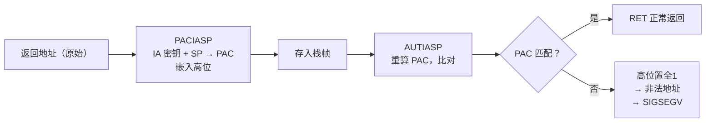
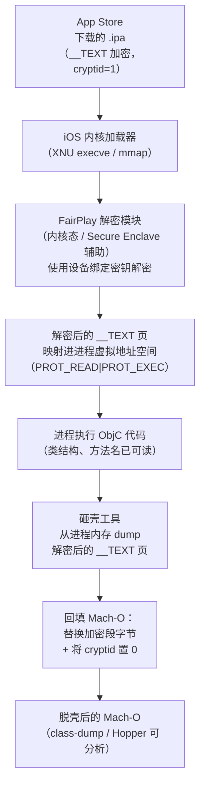

# ObjC运行时（13）· iOS安全与砸壳

## 概述与定位

> [!abstract] TL;DR
> App Store 分发的 iOS 二进制被 **FairPlay DRM** 加密：Mach-O 的 `LC_ENCRYPTION_INFO_64` 加载命令记录加密区间（`cryptoff`/`cryptsize`/`cryptid=1`），静态分析工具（class-dump、Hopper）面对加密段无法还原 ObjC 元数据。**砸壳（脱壳/解密）** 的本质是：iOS 内核在 App 启动时把加密的 `__TEXT` 段解密映射进内存，再从进程地址空间中 dump 出已解密的页，回填 Mach-O 并将 `cryptid` 置 0，得到可静态分析的"脱壳"二进制。
>
> 本篇从**防御与安全研究**视角展开，覆盖平台安全机制、FairPlay 原理、砸壳工作流与概念工具，以及**开发者防御纵深建议**。平台级防护机制详见 [[34.现代二进制防护机制/11.macOS与iOS防护.md]]；密码学基础详见 [[37.密码学/00.密码学总览.md]]；砸壳前置——逆向工具链见 [[12.iOS逆向工具]]；ObjC 元数据节分布见 [[11.Mach-O中的ObjC元数据]]。

---

## iOS 平台安全机制概览

iOS 构建了一套从硬件到内核到应用的纵深防御体系。理解这些机制是理解"为什么砸壳需要越狱""防御该从哪里入手"的前提。完整技术细节见 [[34.现代二进制防护机制/11.macOS与iOS防护.md]]，此处仅提炼与本篇直接相关的要点。

### 强制代码签名与 Entitlements

iOS 上**所有**可执行代码必须拥有有效的代码签名，无任何豁免。签名以 Mach-O 加载命令 `LC_CODE_SIGNATURE` 为载体，指向 `__LINKEDIT` 段中的 `CS_SuperBlob` 结构，其中：

| 子结构 | 作用 |
|---|---|
| `CS_CodeDirectory` | 每 4 KB 页一个 SHA-256 哈希，覆盖全文件 |
| `CS_EntitlementBlob` | XML plist，声明进程被允许的能力（网络、相机、调试…） |
| `CS_CmsBlob` | Apple 签署的 CMS 数字签名，校验前两者不可篡改 |

内核（AMFI：Apple Mobile File Integrity）在 `execve` 时验证签名，代码页在首次访问（缺页中断）时懒校验哈希——任何被篡改的代码页首次执行即触发 `SIGKILL`。

> [!info] 调试与 Get Task Allow
> 开发阶段 Xcode 调试需要 `get-task-allow` entitlement，允许调试器（LLDB）附加进程。App Store 分发时该 entitlement **必须移除**，否则苹果拒绝上架。没有此 entitlement 的进程在非越狱设备上无法被外部调试。

### App 沙盒（Sandbox）

iOS 所有 App 强制运行在沙盒中，由内核 Sandbox.kext（MAC：Mandatory Access Control）在系统调用级别拦截。沙盒容器（`/var/mobile/Containers/Data/Application/<UUID>/`）与其他 App 严格隔离，跨 App 访问须通过苹果审核的 URL Scheme / XPC / App Group entitlement。

### ASLR / PIE

iOS 从 iPhone 4S（iOS 6）起对所有应用强制启用 **ASLR（Address Space Layout Randomization）**。Mach-O 可执行文件编译为 PIE（Position Independent Executable，`MH_PIE` 标志），每次启动基地址随机化，使固定地址 exploit 失效。

### DEP / NX（数据执行保护）

iOS 设备（arm64）硬件支持 XN（Execute-Never）页属性。结合 Hardened Runtime 的 W^X 约束（同一页不可同时可写且可执行），有效阻止 shellcode 注入式攻击。

### arm64e 指针认证（PAC）

A12 及以后的 iOS 芯片（arm64e ABI）引入 **PAC（Pointer Authentication Code）**：编译器在函数入口插入 `PACIASP`（对返回地址 LR 用 IA 密钥+SP 上下文签名）、出口插入 `AUTIASP`（验签），函数指针存取也经 `PACIZA`/`AUTIZA` 守护。PAC 密钥由操作系统在进程初始化时随机生成，存于系统寄存器（用户态不可读），签名码嵌入指针高位未使用的比特。



PAC 同时防御 **ROP（Return-Oriented Programming）后向利用**（返回地址）和 **JOP（Jump-Oriented Programming）前向利用**（函数指针），是 iOS 上等价于 Intel CET Shadow Stack + IBT 的组合。详见 [[34.现代二进制防护机制/11.macOS与iOS防护.md]]。

---

## FairPlay DRM 加密

### 什么是 FairPlay

FairPlay 是苹果的数字版权管理（DRM）体系，最初用于 iTunes 音乐，后扩展到 App Store 应用。通过 App Store 下载的 `.ipa` 中的可执行文件，其 `__TEXT` 段的部分或全部内容被 FairPlay 加密——这是苹果在分发链上保护应用内容、防止直接静态分析的核心手段。

密钥管理涉及对称加密与设备绑定机制，密码学基础见 [[37.密码学/00.密码学总览.md]]。

### LC_ENCRYPTION_INFO_64 加载命令

FairPlay 加密的边界记录在 Mach-O 加载命令 `LC_ENCRYPTION_INFO_64`（arm64；32 位对应 `LC_ENCRYPTION_INFO`）中：

```c
struct encryption_info_command_64 {
    uint32_t cmd;        /* LC_ENCRYPTION_INFO_64 */
    uint32_t cmdsize;    /* sizeof(struct encryption_info_command_64) */
    uint32_t cryptoff;   /* 加密区域起始偏移（从文件头计算） */
    uint32_t cryptsize;  /* 加密区域字节长度 */
    uint32_t cryptid;    /* 加密类型：0 = 未加密，1 = FairPlay 加密 */
    uint32_t pad;        /* 64 位对齐填充 */
};
```

| 字段 | 含义 |
|---|---|
| `cryptoff` | 加密区域在文件中的起始偏移，通常紧接 Mach-O Header 和 Load Commands 之后 |
| `cryptsize` | 加密字节数，覆盖 `__TEXT` 段的主要可执行代码页 |
| `cryptid` | **关键字段**：`1` 表示已由 FairPlay 加密；`0` 表示未加密（本地构建或脱壳后的二进制） |

```bash
# 查看加密状态
otool -l MyApp | grep -A5 LC_ENCRYPTION_INFO_64
```

```text
          cmd LC_ENCRYPTION_INFO_64
      cmdsize 24
      cryptoff 16384
     cryptsize 4194304
       cryptid 1
```

> [!warning] 示例输出为示意
> `cryptid 1` 表示该二进制处于 FairPlay 加密状态，Hopper/class-dump 无法解析加密段内的 ObjC 元数据；`cryptid 0` 表示已脱壳或本地构建。

### 加密覆盖范围

FairPlay 通常**只加密** `__TEXT` 段中 `cryptoff` ~ `cryptoff+cryptsize` 范围内的代码页，即 **`__TEXT,__text`（汇编指令）是主要加密对象**。`__objc_methname`（ObjC 方法名）、`__objc_methtype`（方法类型编码）、`__objc_classname`（类名字符串）等 ObjC 元数据节**多不在加密区间内**——这正是 class-dump 对未脱壳的 App Store 包仍能**部分**还原类结构信息的原因（可读出类名/方法名，但 `__text` 中的指令仍为密文）。

具体哪些节落入加密区间，取决于各节在文件中的偏移与 `cryptoff`/`cryptsize` 的交叠：

- **通常被加密**：`__TEXT,__text`（代码指令，紧接 Load Commands 之后，在 `cryptoff` 范围内）
- **通常不被加密**：`__TEXT,__objc_methname`、`__TEXT,__objc_methtype`、`__TEXT,__objc_classname`、`__TEXT,__cstring` 等元数据/字符串节（布局偏移常落在 `cryptoff+cryptsize` 之后）

> [!info] 为什么 class-dump 能部分工作
> class-dump 解析 `__DATA,__objc_classlist`（指针表，通常不加密）并跟随指针读取方法名/类名字符串节。若这些字符串节不在加密区间，class-dump 仍能还原头文件骨架；若方法名节恰好落入加密区间，则方法名读出为乱码。脱壳后所有节均可读，还原结果最完整。

`__DATA` 段本身**不加密**（指针表、`__objc_classlist` 等结构体布局可被读到，但其中的字符串指针若指向加密区域，类名/方法名仍不可读）。

---

## 为什么需要"砸壳"（脱壳/解密）

> [!note] 合法场景声明
> 以下分析面向**自有 App 安全评估、越狱安全研究、学术研究**三类场景，不适用于对他人付费应用进行逆向工程或绕过 DRM 保护。详见末节合规边界。

### 静态分析工具的困境

class-dump 通过解析 Mach-O 的 `__objc_classlist`、`__objc_selrefs`、`__objc_methname` 等节（详见 [[11.Mach-O中的ObjC元数据]]）还原头文件。但这些节位于被加密的 `__TEXT` 范围内，加密状态下读到的是密文字节，无法还原任何有意义的类或方法信息。

Hopper、IDA Pro 等反汇编工具同理：`__TEXT,__text` 中的机器指令被加密，反汇编得到的是乱码，无法进行正常的控制流分析。

### 砸壳的三类合法场景

| 场景 | 目的 |
|---|---|
| 自有 App 安全评估 | 开发者审计自己上架应用的安全性（等同于拿到自己的源码分析，但通过砸壳验证编译结果） |
| 越狱安全研究 | 研究人员分析系统 App 或越狱相关组件的行为，以发现漏洞并向 Apple 报告 |
| 学术研究 / CTF | 在授权环境下研究 FairPlay 加密机制本身、iOS 安全模型、ObjC 运行时等 |

---

## 砸壳原理

砸壳利用了 FairPlay 的一个内在特性：**App 必须能运行**，所以内核/系统在 App 启动时会将加密的 `__TEXT` 段解密并映射进进程地址空间。解密在用户态进程可以执行代码之前完成，解密后的页就存活在内存中。

### 运行时解密流程



### 关键步骤拆解

**1. 确定加密区间**

砸壳工具首先读取目标进程的 Mach-O Header（通过 `task_for_pid` 或注入的 dylib 内读），解析 `LC_ENCRYPTION_INFO_64`，获取 `cryptoff`、`cryptsize`，确定需要 dump 的内存范围。

**2. 从内存 dump 解密页**

解密后的 `__TEXT` 页以进程基地址（ASLR slide）+ `cryptoff` 为起点在虚拟内存中连续存在。砸壳工具通过：
- 注入的 dylib 调用 `mmap`/直接读内存：`memcpy(buf, (void*)(slide + cryptoff), cryptsize)`
- 或通过 LLDB/调试器接口（`task_for_pid` → `vm_read_overwrite`）读取进程内存

将对应范围的内存字节复制出来。

**3. 重建脱壳 Mach-O**

将原始 `.ipa` 中的加密二进制文件复制，然后：
- 用内存 dump 的解密字节覆盖 `cryptoff` ~ `cryptoff+cryptsize` 区间
- 将 `LC_ENCRYPTION_INFO_64` 中的 `cryptid` 字段由 `1` 写为 `0`

得到的二进制即 `cryptid=0` 的脱壳 Mach-O，可被 class-dump、Hopper、IDA 正常解析。

**4. 与 ObjC 元数据的关系**

脱壳后，`__TEXT,__objc_methname`（方法名字符串）、`__TEXT,__objc_classname`（类名）等节内容恢复为 ASCII 明文，class-dump 解析 `__DATA,__objc_classlist`（类指针表）并跟随指针还原完整头文件。整个元数据节的分布见 [[11.Mach-O中的ObjC元数据]]，逆向工具的具体用法见 [[12.iOS逆向工具]]。

---

## 常见砸壳工具（概念层）

> [!danger] 合规限制
> 以下工具描述仅限于**原理理解与自有 App 分析**。对他人应用使用这些工具可能违反苹果开发者协议、DMCA 版权法及相关地区计算机犯罪法律。请在授权范围内使用。

### dumpdecrypted

`dumpdecrypted` 是经典的注入式砸壳工具，以编译为 dylib 的形式工作：

**原理**：将 `dumpdecrypted.dylib` 注入目标进程（通过 `DYLD_INSERT_LIBRARIES` 环境变量，需越狱设备关闭 Hardened Runtime 限制）。dylib 的 `__attribute__((constructor))` 初始化函数在进程启动、FairPlay 解密完成后执行，此时内存中的 `__TEXT` 已是明文。工具读取 `LC_ENCRYPTION_INFO_64` 定位加密区间，从内存中复制解密后的字节，写入磁盘重建 Mach-O。

**特点**：开源（GitHub: stefanesser/dumpdecrypted），原理透明；适合理解砸壳机制；需要越狱 + 命令行操作。

### frida-ios-dump

基于 Frida 动态插桩框架（见 [[12.iOS逆向工具]]）的砸壳脚本：

**原理**：通过 Frida 的 `Process.enumerateModules()` 枚举已加载模块，定位目标 App 的 Mach-O 内存基址；解析内存中的 `LC_ENCRYPTION_INFO_64`；用 `Memory.readByteArray()` 读取解密后的 `__TEXT` 页；在 Python 侧拼合磁盘原始文件与内存解密字节，输出脱壳后的 Mach-O / `.ipa`。

**特点**：Python 脚本，操作便捷；支持 Fat Binary（多架构 Universal 二进制）自动处理；依赖越狱设备上安装 frida-server。

### Clutch

较早期的命令行砸壳工具，直接 fork 目标进程并在子进程暂停后读取内存：

**原理**：利用 `posix_spawnattr_t` 以挂起状态启动目标 App，让进程短暂运行，待 FairPlay 在 `execve`/`mmap` 加载阶段完成 `__TEXT` 解密后，再通过 `task_for_pid` → `vm_read` 读出内存中已解密的 `__TEXT` 区间，提取解密后的内容并重建 Mach-O。

**特点**：需越狱；历史上在各 iOS 版本下兼容性参差不齐；较新 iOS 版本已有更新的适配版本。

### bagbak

基于 Frida 的现代砸壳工具，通过 USB 连接越狱 iPhone 在 macOS 侧操作：

**原理**：与 frida-ios-dump 类似，通过 Frida RPC 在设备侧读取进程内存，在主机侧组装脱壳二进制。支持直接输出可重签名的 `.ipa`，适合研究者的完整工作流。

### 工具定位对比

| 工具 | 注入方式 | 实现语言 | 输出 | 适用场景 |
|---|---|---|---|---|
| `dumpdecrypted` | dylib 注入（DYLD_INSERT_LIBRARIES） | C | 解密的二进制文件 | 理解原理、单文件分析 |
| `frida-ios-dump` | Frida RPC | Python + JS | 解密 ipa | Frida 工作流、批量分析 |
| `Clutch` | posix_spawn 挂起 + ptrace | ObjC/C | 解密的二进制文件 | 历史工具，了解原理 |
| `bagbak` | Frida USB RPC | Python + JS | 可重签名 ipa | 研究者完整工作流 |

---

## 越狱与砸壳的关系

在非越狱 iOS 设备上，以下安全机制共同阻止了砸壳操作：

1. **`task_for_pid` 限制**：非越狱设备上，获取其他进程的 task port（进而读取其内存）需要 `com.apple.security.cs.debugger` entitlement 或目标进程持有 `get-task-allow` entitlement。App Store 分发的 App 不含 `get-task-allow`，普通 App 也不能持有 `debugger` entitlement。
2. **AMFI 策略**：AMFI 阻止将未经签名或不在受信任列表中的 dylib 注入已签名进程。
3. **沙盒限制**：沙盒阻止进程读取其他进程的内存或文件系统数据。

**越狱通过内核漏洞**提权后，通常会：
- 修补 AMFI 策略（允许任意代码签名或完全绕过签名验证）
- 开放 `task_for_pid` 访问
- 安装 Cydia Substrate / ElleKit 等 hook 框架，支持 dylib 注入

这些修改使砸壳工具能够合法（在越狱环境下）地访问目标进程内存，完成解密 dump。

> [!warning] 越狱设备的安全风险
> 越狱设备因 AMFI / SIP 等防护失效，攻击面显著扩大。在越狱设备上进行安全研究时，应使用专用测试设备，不要将个人账号、密码、证书存储在越狱设备上。

---

## 防御视角（给开发者）

砸壳使攻击者可以对 App 进行静态分析，进一步实施协议分析、算法还原、内购破解、作弊外挂等攻击。以下是防御纵深的各层手段：

### 1. 越狱检测

越狱设备是砸壳的必要前提，检测越狱是第一道防线：

```objc
// 检测越狱特征文件（示例，实际需多重组合）
BOOL isJailbroken(void) {
    NSArray *paths = @[
        @"/Applications/Cydia.app",
        @"/usr/sbin/sshd",
        @"/bin/bash",
        @"/etc/apt",
        @"/private/var/lib/apt/",
    ];
    for (NSString *path in paths) {
        if ([[NSFileManager defaultManager] fileExistsAtPath:path]) {
            return YES;
        }
    }
    // 尝试写入沙盒外路径（越狱设备沙盒可能被绕过）
    NSError *error;
    [@"jailbreak_test" writeToFile:@"/private/jailbreak_test.txt"
                        atomically:YES
                          encoding:NSUTF8StringEncoding
                             error:&error];
    if (!error) {
        [[NSFileManager defaultManager] removeItemAtPath:@"/private/jailbreak_test.txt" error:nil];
        return YES;
    }
    return NO;
}
```

> [!warning] 越狱检测的局限性
> 越狱检测本质上是一场猫鼠游戏。高级越狱（如 rootless jailbreak）会隐藏特征文件；Hook 框架（Substrate / Frida）可以 hook 文件系统 API 使检测失效。越狱检测应作为**分层防御的一层**而非唯一屏障，不可单独依赖。

### 2. 反调试

阻止调试器附加，干扰动态分析流程：

```c
#include <sys/ptrace.h>
#include <sys/sysctl.h>

// 方法一：ptrace PT_DENY_ATTACH（请求内核拒绝后续 attach）
void denyDebugger(void) {
    ptrace(PT_DENY_ATTACH, 0, 0, 0);
}

// 方法二：sysctl 检测是否已被调试
BOOL isBeingDebugged(void) {
    int mib[4] = {CTL_KERN, KERN_PROC, KERN_PROC_PID, getpid()};
    struct kinfo_proc info = {0};
    size_t size = sizeof(info);
    sysctl(mib, 4, &info, &size, NULL, 0);
    return (info.kp_proc.p_flag & P_TRACED) != 0;
}
```

> [!warning] 反调试的局限性
> `ptrace(PT_DENY_ATTACH)` 是 macOS/iOS 的私有 ptrace 请求，越狱后攻击者可以 hook `ptrace` 系统调用使其变为空操作；`sysctl` 检测同理可被 hook。应将反调试与越狱检测、完整性校验组合使用，并在 native（C/C++）层实现，避免 ObjC 方法层面的 swizzling 绕过。

### 3. 字符串与类名混淆

脱壳后，攻击者最直接的信息来源是方法名、类名、字符串常量。混淆可显著提高分析难度：

- **类名混淆**：将 `PaymentViewController`、`LicenseValidator` 等语义明确的类名替换为无意义符号（如 `a1b2`、`_Cls007`）
- **方法名混淆**：对关键方法（验证逻辑、支付流程）的 SEL 名进行混淆
- **字符串加密**：将明文字符串常量（URL、密钥、API 路径）改为运行时解密的形式，避免直接出现在 `__TEXT,__cstring` 中
- **工具**：商业方案如 iXGuard、Obfuscator-LLVM（OLLVM）的 iOS 分支；也可自行用 Clang 插件实现符号重命名

### 4. SSL Pinning（证书锁定）

脱壳后攻击者常结合中间人攻击（MITM）分析 App 与服务器的通信协议。SSL Pinning 通过验证服务器证书的公钥哈希（而非仅验证 CA 链）来抵御 MITM：

```objc
// 使用 NSURLSession 实现 SSL Pinning（概念示例）
- (void)URLSession:(NSURLSession *)session
              task:(NSURLSessionTask *)task
didReceiveChallenge:(NSURLAuthenticationChallenge *)challenge
 completionHandler:(void (^)(NSURLSessionAuthChallengeDisposition, NSURLCredential *))completionHandler {

    if ([challenge.protectionSpace.authenticationMethod
         isEqualToString:NSURLAuthenticationMethodServerTrust]) {
        SecTrustRef serverTrust = challenge.protectionSpace.serverTrust;
        // 获取服务器证书的公钥哈希并与本地 pin 值比较
        NSData *pinnedHash = [self pinnedPublicKeyHashForTrust:serverTrust];
        if ([pinnedHash isEqual:self.expectedPublicKeyHash]) {
            completionHandler(NSURLSessionAuthChallengeUseCredential,
                              [NSURLCredential credentialForTrust:serverTrust]);
        } else {
            completionHandler(NSURLSessionAuthChallengeCancelAuthenticationChallenge, nil);
        }
    }
}
```

> [!warning] SSL Pinning 的绕过与对策
> 攻击者常用 Frida 的 `SSL_CTX_set_verify` hook 或 `TrustKit` bypass 脚本绕过 SSL Pinning。对策：在 native 层实现 pinning 逻辑、结合 ObjC 运行时 swizzling 检测（检测自身关键方法是否被 swizzle）、使用多层 pin（leaf cert + intermediate + 公钥哈希）。与 Android 的 SSL Pinning 对照见 [[35.Android逆向与运行时/00.Android逆向与运行时总览.md]]。

### 5. 关键逻辑下沉 Native 或服务端

ObjC 层的逻辑完全暴露于运行时反射和 class-dump，而 C/C++ native 代码（编译为 `.a` 静态库或 `.dylib`）没有 ObjC 元数据，逆向难度显著更高：

- **核心验证逻辑**：授权校验、加密密钥推导、防作弊校验，应在 C/C++ 层实现
- **敏感运算下沉服务端**：最根本的防御——客户端永远不信任，核心授权决策在服务端完成
- **避免客户端存储密钥**：不在 `__DATA` 段或 Info.plist 中硬编码 API 密钥、对称加密密钥

### 6. PAC 保护（arm64e）

在 arm64e 目标上编译时，编译器自动插入 PAC 指令。确保项目使用 arm64e：

```text
# Xcode Build Settings
ARCHS = arm64e arm64
# 或仅 arm64e（如只面向 A12+ 设备）
```

PAC 不直接阻止砸壳（砸壳在 App 启动后从内存读数据，不需要注入可执行代码），但它显著提升了攻击者在运行时劫持控制流的难度，是动态攻击（ROP/JOP）的有效屏障。

### 7. 完整性自校验

App 在运行时对自身代码段做哈希，检测是否被重新签名或 patch：

```objc
// 概念示例：读取自身 Mach-O 并计算 __TEXT 段 SHA-256
// 实际应在 C 层、混淆后实现，否则容易被 hook
BOOL verifyCodeIntegrity(void) {
    // 1. 通过 _dyld_get_image_header(0) 获取自身镜像基址
    // 2. 解析 LC_SEGMENT_64 找到 __TEXT 段范围
    // 3. 计算 SHA-256，与编译时内嵌的期望哈希比较
    // 4. 返回是否一致
    return YES; // 伪代码，实际需完整实现
}
```

> [!warning] 完整性校验的注意事项
> 完整性校验本身也可以被 patch（攻击者直接 NOP 掉检测函数，或 hook 其返回值）。应将校验逻辑分散、混淆，并与服务端挑战-响应机制结合：客户端每次会话向服务端证明自己的完整性，而不是仅本地自我断言。

### 防御纵深清单

| 层级 | 措施 | 对抗目标 |
|---|---|---|
| 分发层 | App Store 分发（FairPlay 加密）| 无越狱设备的静态分析 |
| 运行时检测 | 越狱检测（多特征组合）| 越狱环境下的砸壳/注入 |
| 调试阻断 | `ptrace PT_DENY_ATTACH` + `sysctl` 检测 | LLDB/Frida 动态分析 |
| 代码层 | 类名/方法名/字符串混淆（OLLVM）| class-dump 还原、Hopper 分析 |
| 通信层 | SSL Pinning（公钥哈希）| 中间人抓包分析 |
| 架构层 | 关键逻辑下沉 C/C++、核心决策服务端 | ObjC runtime 反射、Frida hook |
| 硬件层 | arm64e + PAC 编译 | ROP/JOP 运行时控制流劫持 |
| 完整性 | 代码哈希自校验 + 服务端挑战响应 | 重打包 / patch 后重签名 |

---

## 安全性与正确使用

> [!danger] 合规与法律边界：强制性声明
> **砸壳技术的合法边界极为明确，务必在以下范围内使用：**
>
> 1. **仅限自有 App**：对自己开发、持有版权的 App 进行安全评估。
> 2. **授权测试**：对他人 App 进行安全研究，须事先获得 App 所有者的书面授权（Bug Bounty 项目通常有明确范围）。
> 3. **学术研究**：研究 FairPlay 机制、iOS 安全模型等技术本身，结论以负责任方式公开披露（Responsible Disclosure）。
>
> **以下行为被明确禁止：**
> - 对他人付费 App、游戏、媒体内容进行脱壳，绕过内购保护或版权限制
> - 将脱壳后的 App 进行二次分发（侵犯版权 + 违反苹果 ToS）
> - 利用逆向所得信息实施网络攻击、作弊、欺诈
>
> 相关法律：美国 DMCA（Digital Millennium Copyright Act，17 U.S.C. §1201）、欧盟《计算机程序指令》第 6 条、中国《著作权法》第 52 条均对 DRM 绕过有明确规定；各司法管辖区的计算机欺诈与滥用法也可能适用。**苹果开发者协议（DPLA）明确禁止对 App Store 分发的内容进行反工程。**

### 运行时防御的正确心态

安全不是单点问题。FairPlay 加密提供了"初步障碍"，越狱检测、反调试、混淆、SSL Pinning 各提供一层缓解，而服务端决策是最终的信任锚。没有任何客户端防御是不可绕过的——防御的目标是**提高攻击成本，使其超过攻击收益**，而不是实现"绝对安全"。

开发者应将安全视为持续迭代的过程：跟踪越狱工具的演进（rootless jailbreak、TrollStore 等），定期更新越狱检测特征；监控 Frida 版本的新 bypass 技术，更新反调试策略；参与 Apple Security Bounty 报告自有 App 的漏洞。

---

## 小结

1. **iOS 平台安全是纵深体系**：强制代码签名（AMFI/CS_CodeDirectory）、App 沙盒（MAC 策略）、ASLR/PIE、DEP/NX、arm64e PAC 共同构成多层防御，各层互补——见 [[34.现代二进制防护机制/11.macOS与iOS防护.md]]。
2. **FairPlay DRM 以 `LC_ENCRYPTION_INFO_64` 为标记**：`cryptid=1` 表示 `__TEXT` 段被加密，`cryptoff`/`cryptsize` 定位加密区间；加密密钥由设备/系统持有（密码学机制详见 [[37.密码学/00.密码学总览.md]]），静态工具在加密状态下无法分析 ObjC 元数据。
3. **砸壳本质是内存 dump**：iOS 启动时内核解密 `__TEXT` 并映射进内存 → 砸壳工具在运行时读取解密后的页 → 回填 Mach-O 并置 `cryptid=0`，还原可分析的二进制（元数据分布见 [[11.Mach-O中的ObjC元数据]]；工具链见 [[12.iOS逆向工具]]）。
4. **砸壳依赖越狱**：越狱突破 AMFI、`task_for_pid`、沙盒限制，是砸壳操作的必要前提；非越狱设备上上述安全机制有效阻止内存访问。
5. **常见砸壳工具（概念层）**：`dumpdecrypted`（dylib 注入 + memcpy）、`frida-ios-dump` / `bagbak`（Frida RPC 读内存）、`Clutch`（posix_spawn 挂起 + ptrace）——各有侧重，核心原理相同。
6. **开发者防御应分层**：越狱检测 + 反调试 + 混淆 + SSL Pinning + native 下沉 + 服务端决策 + PAC + 完整性自校验，任何单层均可被绕过，纵深叠加才有实际效果。
7. **合规边界是硬约束**：仅限自有 App、授权研究、学术目的；DMCA 等法律对 DRM 绕过有明确规定，砸壳他人付费内容在多数司法管辖区构成违法。

---

## 相关阅读

- **平台安全机制完整详解（PAC/BTI/SIP/代码签名）**：[[34.现代二进制防护机制/11.macOS与iOS防护.md]]
- **FairPlay 涉及的密码学基础（对称加密、密钥绑定）**：[[37.密码学/00.密码学总览.md]]
- **逆向工具链（Hopper/IDA/class-dump/Frida/LLDB）**：[[12.iOS逆向工具]]
- **ObjC 元数据节（__objc_classlist/selrefs/catlist 等）**：[[11.Mach-O中的ObjC元数据]]
- **Mach-O 文件格式基础**：[[12.Mach-O文件详解/00.Mach-O文件详解总览.md]]
- **Android 平台对照（DEX 加固、DexClassLoader、SSL Pinning）**：[[35.Android逆向与运行时/00.Android逆向与运行时总览.md]]
- **Hook / Swizzling 原理**：[[32.hooks/00.总览.md]]
- **LLDB 调试原理**：[[44.调试器原理与实战/09.LLDB原理与实战.md]]

---

⬅️ 上一篇 [[12.iOS逆向工具]] ｜ 🏠 [[00.Objective-C与iOS运行时总览]] ｜ 下一篇 [[14.Swift运行时简介]] ➡️
