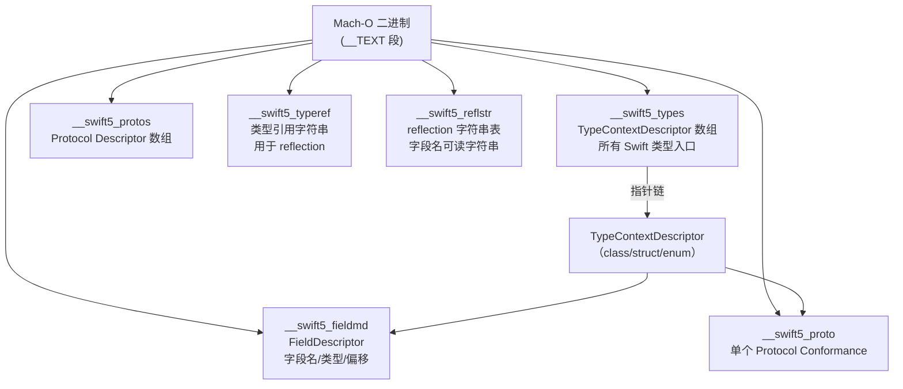
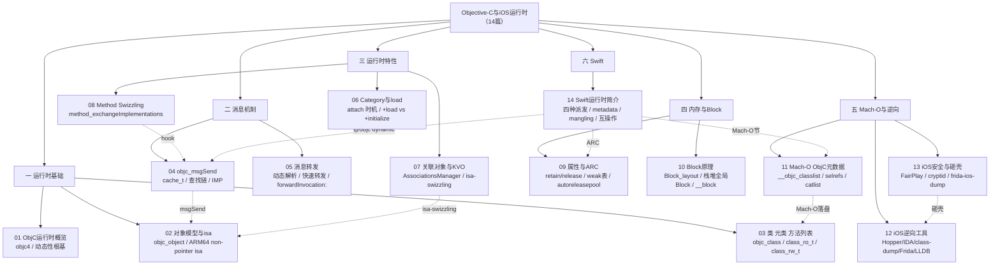

# Swift 运行时简介

## 概述与定位

> [!abstract] TL;DR
> Swift 在语言层面更静态、更强类型，默认不走 `objc_msgSend` 消息派发，而是选择**直接派发**或**虚表派发**，性能优先；只有显式标注 `@objc dynamic` 的成员才退回 ObjC 运行时的消息机制，从而支持 KVO/Swizzling/Frida hook。理解 Swift 的四种派发策略，是把握性能、可 hook 性与互操作边界的核心。Mach-O 中新增的 `__swift5_types`/`__swift5_proto` 等专属节承载 Swift 类型元数据，是逆向分析的切入口。

本篇是《Objective-C与iOS运行时》系列的**第 14 篇、收官篇**。前 13 篇深入拆解了 ObjC 运行时的全套机制——对象模型、消息发送、转发、特性（Category/KVO/Swizzling）、内存（ARC/Block）、Mach-O 元数据、逆向工具与安全砸壳。本篇用 Swift 运行时作收口：揭示 Swift 如何在"更静态"的设计下兼容 ObjC 动态性，以及这对性能与逆向各意味着什么。

---

## 原理与机制

### Swift vs ObjC 运行时哲学

ObjC 把"调用方法"做成"发消息"（[[04.objc_msgSend消息发送]] 详述），`objc_msgSend(receiver, selector, ...)` 在运行时查 selector → IMP，一切都是动态的，代价是每次调用必须过缓存/查找链。这套极致动态性让 [[07.关联对象与KVO|KVO]]、[[08.Method Swizzling|Method Swizzling]]、[[06.Category与load和initialize|Category]] 得以成立，但也带来运行时开销（[[01.Objective-C运行时概览]] 综述了这个权衡）。

Swift 的运行时哲学则相反：**编译期能确定的，就不留给运行时**。

| 维度 | ObjC | Swift |
|---|---|---|
| 调用模型 | 消息派发（`objc_msgSend`），运行时决议 | 默认直接/虚表派发，编译期决议 |
| 类型系统 | 弱类型，id 可以是任何对象 | 强类型，泛型，Protocol 约束 |
| 可 Hook 性 | 全部方法原生可 Swizzle | 仅 `@objc dynamic` 成员可 Swizzle/KVO |
| 元数据形态 | `class_ro_t`/`class_rw_t`（`__objc_classlist` 等节） | Swift metadata（`__swift5_types` 等节） |
| 性能 | 消息查找开销，但运行时灵活 | 直接/虚表调用，接近 C++ 速度 |
| 符号可读性 | selector 直接是字符串，可读 | 符号 mangled（`$s…`），需 demangle |

---

### 四种方法派发

Swift 并非只有一种派发策略，而是根据声明上下文和修饰符选择最合适的派发方式。理解这四种方式是优化性能和理解 hook 边界的关键。

```mermaid
flowchart TD
    CALL["方法调用"] --> Q1{"声明上下文？"}
    Q1 -->|struct/enum/全局函数<br/>或 class final 方法| DIRECT["① 直接派发<br/>（Direct / Static）<br/>编译期确定地址<br/>最快，不可 Hook"]
    Q1 -->|class 非 final 方法| VTABLE["② vtable 派发<br/>（Virtual Table）<br/>类的虚函数表<br/>类似 C++ vtable"]
    Q1 -->|Protocol 要求方法| WITNESS["③ witness table 派发<br/>（Protocol Witness Table）<br/>每个遵从类型一张表<br/>Protocol 泛型依赖此"]
    Q1 -->|@objc dynamic<br/>或继承 NSObject 带 dynamic| OBJC["④ 消息派发<br/>（objc_msgSend）<br/>运行时查 selector→IMP<br/>可 KVO / Swizzle / Frida hook"]

    DIRECT -.性能最高.-> PERF["性能 ↑ 可 Hook 性 ↓"]
    OBJC -.完全动态.-> DYN["性能 ↓ 可 Hook 性 ↑"]
```

> [!note] 节点说明：箭头标签用 `<br/>` 换行，节点内同理，不使用 timeline/block-beta。

#### ① 直接派发（Static / Inline）

适用场景：`struct`、`enum` 的成员方法；全局函数；`class` 的 `final` 方法；`extension` 中未标注 `@objc` 的方法（默认 final）；被编译器内联的函数。

编译器在编译期把调用地址写死（或内联展开），运行时零查找开销，是 Swift 性能最强的派发路径。代价：无法在运行时替换实现，也无法被 Frida 通过 ObjC 消息 hook。

```swift
struct Point {
    func length() -> Double { /* 直接派发 */ }
}

final class Logger {
    func log(_ msg: String) { /* 直接派发，因 final */ }
}
```

#### ② vtable 派发（Virtual Table）

适用场景：`class`（非 `final`）的普通方法。

每个 Swift 类在其类型 metadata 中维护一张 **virtual table**（虚表），存放该类所有可继承方法的 IMP 数组，布局与 C++ vtable 相似。调用时通过类型 metadata 指针偏移找到对应函数指针，有一次间接寻址，开销比直接派发略高，但比消息派发快得多（无缓存查找/散列）。子类 override 只需替换自己 vtable 中对应槽。

```swift
class Animal {
    func speak() { }  // vtable 派发
}
class Dog: Animal {
    override func speak() { }  // 替换 vtable 槽
}
```

#### ③ witness table 派发（Protocol Witness Table）

适用场景：Protocol 约束下的协议方法调用（泛型函数 `<T: Drawable>` 或 existential `any Drawable`）。

每个遵从某个 Protocol 的类型，编译器生成一张 **Protocol Witness Table（PWT）**，存放该类型对协议每个要求的具体实现指针。调用时通过 PWT 间接找到实现，类似 C++ 接口虚表，但每个协议独立一张表，而非单一类层级。

```swift
protocol Drawable {
    func draw()
}
struct Circle: Drawable {
    func draw() { }  // PWT 中存放此实现的指针
}
```

#### ④ 消息派发（objc_msgSend）

适用场景：成员标注 `@objc dynamic`；继承自 `NSObject` 且同时带 `dynamic` 关键字；`@objcMembers` 类中被 ObjC 可见的方法。

此类方法完全退回 ObjC 运行时路径，走 [[04.objc_msgSend消息发送]] 的 `cache_t` 快速查找 → 方法列表 → superclass 链全套流程，与纯 ObjC 方法行为一致。**只有这种方式**才能被 KVO 的 isa-swizzling（[[07.关联对象与KVO]] 原理）、`method_exchangeImplementations`（[[08.Method Swizzling]]）和 Frida ObjC hook 拦截。

```swift
class ViewModel: NSObject {
    @objc dynamic var name: String = ""  // 可被 KVO
    @objc dynamic func fetch() { }      // 可被 Swizzle/Frida
}
```

#### 何时用哪种派发——判定表

| 声明方式 | 默认派发 | 可被 Swizzle？ | 可被 KVO？ |
|---|---|---|---|
| `struct`/`enum` 方法 | 直接派发 | 否 | 否 |
| `class final` 方法 / `extension` 方法 | 直接派发 | 否 | 否 |
| `class` 普通方法（非 final） | vtable | 否（vtable 不走 msgSend） | 否 |
| `protocol` 方法（非 @objc） | witness table | 否 | 否 |
| `@objc` 方法，定义在 **class body** 内（无 `dynamic`） | vtable（Swift 侧）+ ObjC 可见 | 有限（ObjC 侧可，Swift 内部不保证） | 可（若属性） |
| `@objc` 方法，定义在 **extension** 内（无 `dynamic`） | **直接派发**（不进入 vtable） | 否（不在 vtable，Swift 侧无法被覆盖；ObjC 侧技术上可 swizzle，但行为不明确） | 否 |
| `@objc dynamic` 方法 / 属性 | 消息派发（objc_msgSend） | 是 | 是 |
| 继承 NSObject + 无 dynamic | vtable（Swift）+ ObjC 可见 | ObjC 侧可（有风险） | 需 dynamic |

---

### Swift 类型元数据（Metadata）

Swift 的每个类型（class/struct/enum/protocol）在运行时都对应一块 **type metadata**，是 Swift 运行时的信息核心，作用类似 ObjC 的 `class_ro_t`/`class_rw_t`（[[11.Mach-O中的ObjC元数据]] 对照）。

#### metadata 结构概览

```
┌─────────────────────────────────────────┐
│  Type Metadata                          │
│  ┌──────────────────────────────────┐   │
│  │  kind（class/struct/enum/…）     │   │
│  │  value witness table（VWT）指针  │   │  ← 描述该类型值语义（拷贝/析构/大小/对齐）
│  │  nominal type descriptor 指针   │   │  ← 指向 TypeContextDescriptor
│  │  [class 专属] vtable            │   │  ← 虚表槽（class 方法）
│  │  [class 专属] superclass metadata│   │
│  └──────────────────────────────────┘   │
└─────────────────────────────────────────┘

TypeContextDescriptor（每个类型一份，只读，落在 Mach-O）：
  - name（mangled 类型名）
  - field descriptor（字段描述，字段名/类型/偏移）
  - protocol conformances
```

**value witness table（VWT）** 是 Swift 值语义的核心——描述该类型的 `initializeWithCopy`、`destroy`、`size`、`stride`、`alignmentMask` 等操作函数，使泛型函数无需特化即可操作任意类型的值。

#### Mach-O 中的 Swift 专属节

Swift 在 Mach-O 中引入了一套与 `__objc_*` 平行的 `__swift5_*` 节，落于 `__TEXT` 段（只读），是逆向 Swift 二进制的切入口（与 [[11.Mach-O中的ObjC元数据]] 中的 `__DATA/__objc_classlist` 体系对照）：



| 节名 | 内容 | 逆向用途 |
|---|---|---|
| `__swift5_types` | `TypeContextDescriptor` 指针数组，所有 Swift 类型入口 | 枚举 App 内全部 Swift 类型 |
| `__swift5_proto` | `ProtocolConformanceDescriptor`，某类型对某协议的 conformance | 还原实现了哪些 Protocol |
| `__swift5_protos` | `ProtocolDescriptor` 数组，Protocol 本身的定义 | 还原 Protocol 签名 |
| `__swift5_fieldmd` | `FieldDescriptor`，各字段的 mangled 类型名与 key path offset | 重建结构体/类字段布局 |
| `__swift5_typeref` | mangled 类型引用字符串（用于 type metadata 的符号引用） | demangle 后还原类型名 |
| `__swift5_reflstr` | 字段名的可读字符串（供 reflection API 使用） | 直接可读，无需 demangle |

这些节与 Mach-O ObjC 节（[[12.Mach-O文件详解/36.Mach-O __objc_classlist节.md|__objc_classlist]]、[[12.Mach-O文件详解/35.Mach-O __objc_selrefs节.md|__objc_selrefs]]、[[12.Mach-O文件详解/24.Mach-O __objc_methname节.md|__objc_methname]] 等）并列存在于同一 Mach-O——混编 App 两套都有。

---

### Name Mangling 名字修饰

Swift 编译器对所有符号进行 **name mangling**，将类型名、模块名、参数类型、返回类型等信息编码进符号名，以支持重载、泛型、模块隔离等特性。

mangled 符号以 `$s` 开头（Swift 5+），例如：

```
$s9MyAppKit10UserClientC5login8username8passwordySS_SStF
 ↑  模块     类名        方法名  参数标签        参数类型  返回类型
```

> [!warning] 示例输出为示意

还原方式：

```bash
# swift-demangle 还原单个符号
swift-demangle '$s9MyAppKit10UserClientC5login8username8passwordySS_SStF'

# xcrun 包装（Xcode 工具链）
xcrun swift-demangle '$s9MyAppKit10UserClientC5login8username8passwordySS_SStF'
```

> [!warning] 示例输出为示意

```
MyAppKit.UserClient.login(username: Swift.String, password: Swift.String) -> ()
```

**Mangling 规律**（使逆向可还原）：

| 编码片段 | 含义 |
|---|---|
| `$s` | Swift 5 符号前缀 |
| `9MyAppKit` | 长度前缀 + 模块名 |
| `10UserClient` | 长度前缀 + 类名 |
| `C` | class（`V`=struct，`O`=enum） |
| `5login` | 方法名 |
| `SS` | `Swift.String` |
| `tF` | tuple 参数 + 函数 |

逆向工具（Hopper/IDA）的 Swift 支持会自动对 `$s` 前缀符号做 demangle，让反汇编视图中的符号基本可读——这使 Swift 二进制的逆向并非黑盒，只是比 ObjC 多一道 demangle 步骤。

---

### 与 ObjC 的互操作

Swift 设计了多个机制与 ObjC 运行时桥接，使 Swift 代码可在 ObjC 生态（UIKit/AppKit/Foundation）中无缝工作。

#### `@objc` 与 `@objcMembers`

- `@objc`：将单个声明（方法/属性/类/枚举）暴露给 ObjC 运行时，生成对应的 ObjC 方法注册（写入 `__objc_classlist`/`__objc_methname` 等节，参见 [[11.Mach-O中的ObjC元数据]]）。
- `@objcMembers`：对整个 Swift 类，自动为所有公开成员添加 `@objc`。
- `dynamic`：强制方法使用消息派发（须与 `@objc` 组合使用才能被 Swizzle/KVO）。

```swift
@objcMembers
class ViewController: UIViewController {
    // 所有公开方法自动 @objc
    var title: String = ""
    
    @objc dynamic func refresh() { }  // 消息派发 + 可 hook
}
```

#### 继承 NSObject

Swift 类继承 `NSObject` 后，默认进入 ObjC 运行时的类体系（isa 指针机制同 [[02.对象模型与isa]]），但 Swift 扩展方法仍走直接派发，除非加 `@objc dynamic`。

#### 标准库桥接

`String` ↔ `NSString`、`Array` ↔ `NSArray`、`Dictionary` ↔ `NSDictionary` 存在隐式桥接，传给 ObjC API 时自动转换，但涉及拷贝开销（写时复制语义与 Foundation 可变性之间的协调）。

#### ARC 与 Swift

Swift 同样使用 **ARC**（Automatic Reference Counting）管理引用类型（`class` 实例）的生命周期，机制与 ObjC ARC 一致（[[09.属性与ARC内存管理]] 详述）：`retain`/`release` 由编译器自动插入，`weak` 引用同样走 weak 表（`side table`），`unowned` 对应 ObjC 的 `__unsafe_unretained`。值类型（`struct`/`enum`）不涉及 ARC，由栈或容器管理。

---

## 结构 / 源码 / 流程详解

### Swift 类实例内存布局

对于继承自 `NSObject` 的 Swift class，内存布局前缀与 ObjC 对象一致（兼容 ObjC 运行时扫描）：

```
┌────────────────────────────────────────────────────────┐
│  Swift class 实例（继承 NSObject）                      │
│  [0x00]  isa（指向 Swift class metadata，兼容 ObjC）    │
│  [0x08]  ObjC 引用计数区域（若走 sidetable 则指针）      │
│  [0x10]  Swift 专属字段…                               │
│  [0x??]  stored properties（顺序由编译器决定，可优化）  │
└────────────────────────────────────────────────────────┘
```

纯 Swift class（不继承 NSObject）：

```
┌────────────────────────────────────────────────────────┐
│  Swift class 实例（纯 Swift）                           │
│  [0x00]  HeapObject.metadata（Swift type metadata 指针）│
│  [0x08]  HeapObject.refCounts（引用计数，SwiftRT 管理） │
│  [0x10]  stored properties…                           │
└────────────────────────────────────────────────────────┘
```

`metadata` 指针指向该类型在 `__swift5_types` 对应的 `ClassMetadata`，其中内嵌 vtable。

### 协议 Existential Container 布局

当以 `any Protocol` existential 类型存储值时，Swift 使用 **existential container**：

```
┌──────────────────────────────────────────┐
│  Existential Container（栈上 40 字节）    │
│  [0x00-0x17]  value buffer（3 × 8 字节） │  ← 小值内联，大值堆分配（只存指针）
│  [0x18]       type metadata 指针         │
│  [0x20]       Protocol Witness Table 指针│
└──────────────────────────────────────────┘
```

泛型函数 `<T: Protocol>` 则通过隐式 witness table 参数传递，无 existential box 开销（类型完全特化时消除）。

---

## 逆向实践

### Swift 逆向差异与 ObjC 对比

Swift 与 ObjC 在逆向面上的核心差异：

| 维度 | ObjC | Swift |
|---|---|---|
| 符号可读性 | selector 是字符串，直接可读 | mangled `$s…`，需 `swift-demangle` 还原 |
| 类结构还原 | `class-dump` 直接解析 `__objc_classlist` | 解析 `__swift5_types`/`__swift5_fieldmd` 重建（Ghidra/IDA Swift 插件）|
| hook 难度 | 全部方法可 Frida ObjC hook | 仅 `@objc dynamic` 可 ObjC hook；纯 Swift 需内存 patch 或 fishhook |
| 运行时查询 | `class_copyMethodList` 枚举所有方法 | Swift 反射 API 有限；需解析 metadata 节 |
| 砸壳 | FairPlay `cryptid=1` 加密 | 相同加密，同样流程砸壳（参见 [[13.iOS安全与砸壳]]） |

### 工具链

```bash
# 1. 枚举 Swift 类型（__swift5_types 节）
otool -s __TEXT __swift5_types MyApp.decrypted

# 2. 批量 demangle 符号表
nm -U MyApp.decrypted | grep '^\$s' | swift-demangle

# 3. Hopper / IDA：打开二进制后自动 demangle Swift 符号；
#    IDA 7.6+ 内置 Swift ABI 支持，可还原 class/struct/方法名

# 4. 查 Swift metadata 节布局
otool -l MyApp.decrypted | grep -A3 swift5
```

> [!warning] 示例输出为示意

```
__TEXT,__swift5_types
  sectname __swift5_types
  segname  __TEXT
  addr     0x00000001000a8000
  size     0x0000000000000350
  offset   688128
  ...
```

> [!warning] 示例输出为示意

### Frida hook Swift 方法

对 `@objc dynamic` 方法可直接用 ObjC hook（[[12.iOS逆向工具]] 的 Frida 使用）：

```js
// hook @objc dynamic 方法（消息派发）
var UserClient = ObjC.classes.UserClient;
UserClient['- login:password:'].implementation = ObjC.implement(
    UserClient['- login:password:'],
    function(handle, sel, username, password) {
        console.log('login:', ObjC.Object(username), ObjC.Object(password));
        return this.originalMethod(username, password);
    }
);
```

对纯 Swift 方法（直接/vtable 派发）需先 `swift-demangle` 定位符号，再用 `Interceptor.attach`：

```js
// hook 纯 Swift 方法（须先 demangle 找到符号地址）
var sym = Module.findExportByName('MyApp', '$s5MyApp10UserClientC5loginySS_SStF');
if (sym) {
    Interceptor.attach(sym, {
        onEnter: function(args) {
            // Swift 调用约定：参数在寄存器，需按 ABI 读
            console.log('Swift login called');
        }
    });
}
```

> [!warning] 示例输出为示意

---

## 安全性与正确使用

### 派发选择对性能与 hook 性的影响

**性能维度**：直接派发 > vtable 派发 > witness table 派发 > 消息派发。过度使用 `@objc dynamic` 会在热路径引入不必要的消息查找开销，应仅对确实需要 KVO/Swizzle/ObjC 互操作的成员标注。

**可 hook 性维度**：仅消息派发方法可被 KVO/Swizzle/Frida ObjC hook。这意味着安全敏感逻辑（加密/鉴权/防护检测）**不应使用 `@objc dynamic`**，否则攻击者可在运行时替换实现。

### `@objc dynamic` 的安全含义

将 Swift 方法标注 `@objc dynamic` 等价于向 ObjC 运行时完全开放该方法：

- 可被 `method_exchangeImplementations` Swizzle（即 [[08.Method Swizzling]] 原理）。
- 可被 Frida `ObjC.classes.XXX['- method:']` hook 拦截。
- 可被越狱设备上的任何进程通过运行时 API 替换实现。

防御建议：安全关键路径（越狱检测、证书校验、加密操作）使用**纯 Swift struct 或 final class 的非 @objc 方法**，走直接派发路径，hook 难度显著提升。

### Name Mangling 的暴露面

虽然 mangled 符号需要 demangle 步骤，但：

1. `swift-demangle` 免费公开，几乎无障碍还原类/方法/参数类型名。
2. `__swift5_reflstr`/`__swift5_fieldmd` 中直接存有字段名字符串（可读），逆向者无需 demangle 即可读字段名。
3. `nm` + `swift-demangle` 管道可在秒级还原整个 App 的方法签名列表。

因此，Swift 编译产物的**逻辑暴露面与 ObjC 相当**，不应依赖 mangling 做安全遮挡。混淆方案（如 `swiftshield`）可对 mangled 符号做二次随机化，但仍是纵深防御的一层，而非根本保护。

### 防御建议综合

| 场景 | 建议 |
|---|---|
| 鉴权/证书校验 | 用 pure Swift `final class` 或 `struct`，不加 `@objc dynamic` |
| 越狱检测 | 多路验证 + 直接派发，检测 `fishhook`/Frida 环境 |
| 类型信息保护 | 考虑 `swiftshield` 等混淆工具对外部暴露面做随机化 |
| KVO/Swizzle 业务需求 | 仅对必要属性/方法加 `@objc dynamic`，最小化消息派发范围 |
| 砸壳防御 | 参见 [[13.iOS安全与砸壳]] 的防御层次（运行时完整性检查、反调试） |
| 符号剥离 | Release build 开启 Strip Swift Symbols，减少 `__swift5_reflstr` 字段名泄露 |

---

## 全系列回顾——14 篇知识地图

本篇收官，以知识地图串接全系列 14 篇：



**一句话收官**：ObjC 运行时把"调用方法"做成"发消息"——`objc_msgSend` 在运行时查 selector→IMP，方法、类、属性都是可读写的 C 结构（`class_rw_t`/`method_t`），这套动态性既支撑了 Category/KVO/Swizzling，也把类信息以 `__objc_*` 元数据落进 Mach-O；Swift 在此基础上更进一步——更静态、更强类型、默认不走消息派发——但用 `@objc dynamic` 可随时退回 ObjC 动态世界。读完这 14 篇，你能看懂一个 iOS App 的对象模型、消息流、特性实现、内存管理、Mach-O 元数据布局，以及逆向分析的全套思路。

---

## 小结

- Swift 的**四种派发**（直接/vtable/witness table/消息）由声明上下文决定；只有 `@objc dynamic` 走 `objc_msgSend`，才可被 KVO/Swizzle/Frida hook。
- Swift **类型 metadata** 在 Mach-O 的 `__swift5_types`/`__swift5_proto`/`__swift5_fieldmd` 等节落盘，是逆向的切入口，与 `__objc_classlist` 体系平行。
- **Name mangling** 使符号编码了完整类型信息，`swift-demangle` 可还原；`__swift5_reflstr` 直接存字段名字符串，无需 demangle。
- **与 ObjC 互操作**通过 `@objc`/`@objcMembers`/`dynamic`/继承 `NSObject` 实现；`String`/`Array`/`Dictionary` 有隐式桥接。
- **ARC** 同样适用于 Swift 引用类型（参见 [[09.属性与ARC内存管理]]）；值类型不走 ARC。
- **逆向上** Swift 比 ObjC 多一道 demangle 步骤，但 metadata 节可重建类型结构，Hopper/IDA 已内置支持；砸壳流程与 ObjC 相同（[[13.iOS安全与砸壳]]）。
- 安全关键逻辑应避免 `@objc dynamic`，走直接派发路径，最小化运行时 hook 面。

---

## 相关阅读

- 本系列总览：[[00.Objective-C与iOS运行时总览]]
- ObjC 运行时根基：[[01.Objective-C运行时概览]]
- 消息派发详解：[[04.objc_msgSend消息发送]]
- Mach-O ObjC 元数据：[[11.Mach-O中的ObjC元数据]]
- iOS 逆向工具：[[12.iOS逆向工具]]
- iOS 安全与砸壳：[[13.iOS安全与砸壳]]
- Mach-O 格式总览：[[12.Mach-O文件详解/00.Mach-O文件详解总览.md]]
- ObjC 元数据节（Mach-O 系列）：[[12.Mach-O文件详解/36.Mach-O __objc_classlist节.md]]、[[12.Mach-O文件详解/35.Mach-O __objc_selrefs节.md]]
- Hook 技术：[[32.hooks/00.总览.md]]
- macOS/iOS 防护：[[34.现代二进制防护机制/11.macOS与iOS防护.md]]
- Android 逆向对照：[[35.Android逆向与运行时/00.Android逆向与运行时总览.md]]

---

⬅️ 上一篇 [[13.iOS安全与砸壳]] ｜ 🏠 [[00.Objective-C与iOS运行时总览]] ｜ 下一篇 [[00.Objective-C与iOS运行时总览]] ➡️
